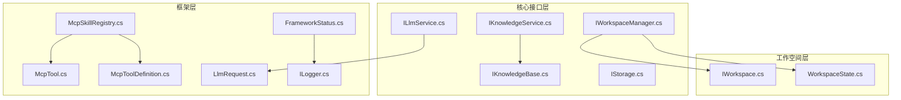
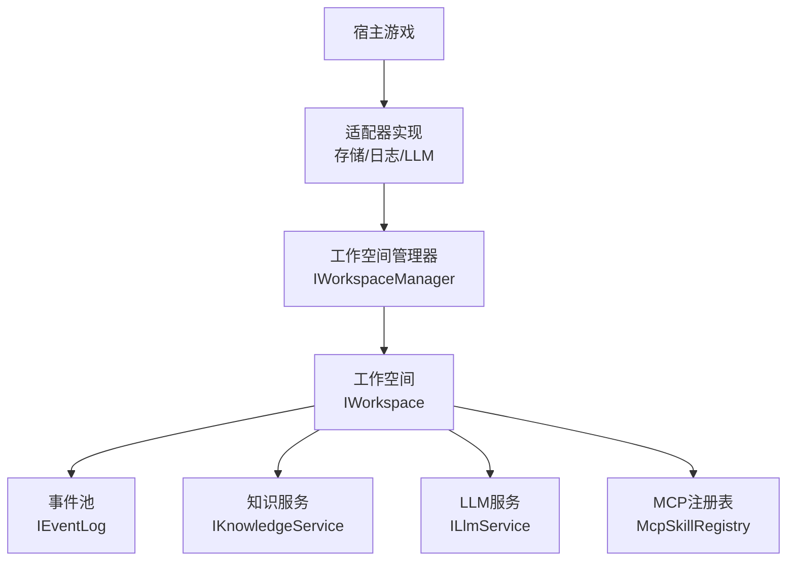
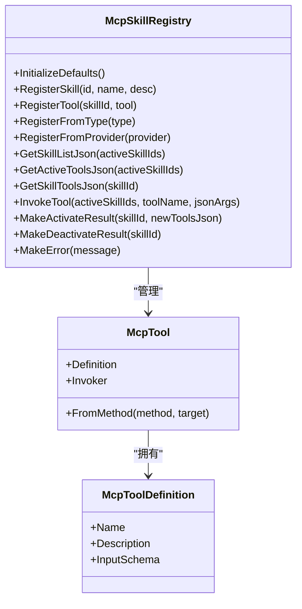
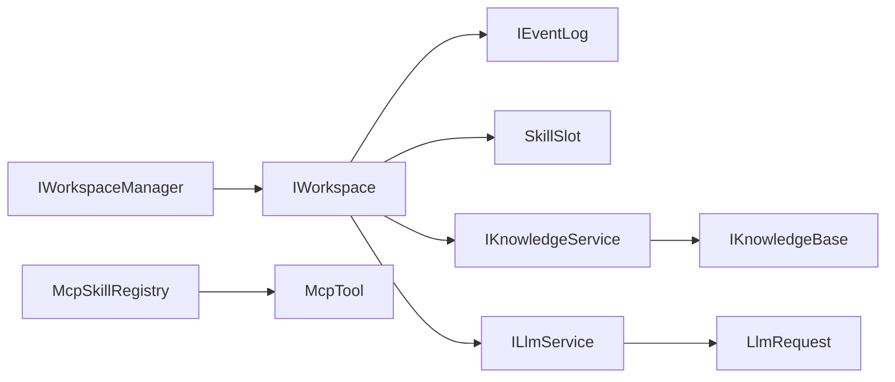
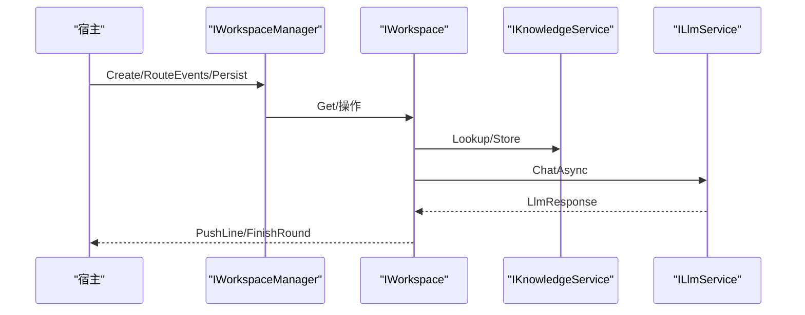

# API参考文档

<cite>
**本文档引用的文件**
- [README.md](file://README.md)
- [NPCLife.csproj](file://src/NPCLife/NPCLife.csproj)
- [IKnowledgeService.cs](file://src/NPCLife/Core/IKnowledgeService.cs)
- [IKnowledgeBase.cs](file://src/NPCLife/Core/IKnowledgeBase.cs)
- [KnowledgeEntry.cs](file://src/NPCLife/Core/KnowledgeEntry.cs)
- [ILlmService.cs](file://src/NPCLife/Core/ILlmService.cs)
- [LlmRequest.cs](file://src/NPCLife/Framework/Llm/LlmRequest.cs)
- [IStorage.cs](file://src/NPCLife/Core/IStorage.cs)
- [IWorkspaceManager.cs](file://src/NPCLife/Core/IWorkspaceManager.cs)
- [IWorkspace.cs](file://src/NPCLife/Workspace/IWorkspace.cs)
- [WorkspaceState.cs](file://src/NPCLife/Workspace/WorkspaceState.cs)
- [McpTool.cs](file://src/NPCLife/Framework/Mcp/McpTool.cs)
- [McpToolDefinition.cs](file://src/NPCLife/Framework/Mcp/McpToolDefinition.cs)
- [McpSkillRegistry.cs](file://src/NPCLife/Framework/Mcp/McpSkillRegistry.cs)
- [FrameworkStatus.cs](file://src/NPCLife/Framework/FrameworkStatus.cs)
- [ILogger.cs](file://src/NPCLife/Framework/ILogger.cs)
</cite>

## 目录
1. [简介](#简介)
2. [项目结构](#项目结构)
3. [核心组件](#核心组件)
4. [架构总览](#架构总览)
5. [详细组件分析](#详细组件分析)
6. [依赖关系分析](#依赖关系分析)
7. [性能考量](#性能考量)
8. [故障排查指南](#故障排查指南)
9. [结论](#结论)
10. [附录](#附录)

## 简介
NPCLife是一个面向游戏的LLM驱动叙事中间件，提供多智能体管线（导演/编剧/自由编剧）、基于工作空间的剧情线管理、MCP工具协议以及与多种LLM后端的集成能力。该库为宿主游戏提供纯逻辑抽象，通过适配器注入存储、日志、LLM服务等能力，实现与引擎无关的动态NPC叙事。

## 项目结构
- 核心接口层：定义知识服务、LLM服务、存储、工作空间管理等对外契约
- 框架层：MCP工具协议、LLM请求封装、状态内省、日志接口等
- 工作空间层：工作空间门面、状态与轮次模型
- 基础设施层：知识库内置实现、LLM适配器、MCP提供者等（实现由宿主注入）

图表来源
- [IKnowledgeService.cs:1-36](file://src/NPCLife/Core/IKnowledgeService.cs#L1-L36)
- [IKnowledgeBase.cs:1-53](file://src/NPCLife/Core/IKnowledgeBase.cs#L1-L53)
- [ILlmService.cs:1-51](file://src/NPCLife/Core/ILlmService.cs#L1-L51)
- [IStorage.cs:1-53](file://src/NPCLife/Core/IStorage.cs#L1-L53)
- [IWorkspaceManager.cs:1-58](file://src/NPCLife/Core/IWorkspaceManager.cs#L1-L58)
- [McpSkillRegistry.cs:1-470](file://src/NPCLife/Framework/Mcp/McpSkillRegistry.cs#L1-L470)
- [McpTool.cs:1-40](file://src/NPCLife/Framework/Mcp/McpTool.cs#L1-L40)
- [McpToolDefinition.cs:1-50](file://src/NPCLife/Framework/Mcp/McpToolDefinition.cs#L1-L50)
- [LlmRequest.cs:1-46](file://src/NPCLife/Framework/Llm/LlmRequest.cs#L1-L46)
- [FrameworkStatus.cs:1-254](file://src/NPCLife/Framework/FrameworkStatus.cs#L1-L254)
- [ILogger.cs:1-20](file://src/NPCLife/Framework/ILogger.cs#L1-L20)
- [IWorkspace.cs:1-51](file://src/NPCLife/Workspace/IWorkspace.cs#L1-L51)
- [WorkspaceState.cs:1-152](file://src/NPCLife/Workspace/WorkspaceState.cs#L1-L152)

章节来源
- [README.md:1-93](file://README.md#L1-L93)
- [NPCLife.csproj:1-38](file://src/NPCLife/NPCLife.csproj#L1-L38)

## 核心组件
本节概述所有公共接口及其职责边界，便于快速定位API位置与用途。

- 知识服务接口族
  - IKnowledgeService：面向上层组件的知识查询/存储/筛选接口，屏蔽底层知识源差异
  - IKnowledgeBase：知识库基础能力（查询/存储/删除/列举）
  - KnowledgeEntry：知识条目DTO，包含词条、释义、来源、置信度与标签

- LLM服务接口族
  - ILlmService：统一的异步LLM调用契约，支持凭证列表回退、连接测试、模型列表查询
  - LlmRequest：内部统一的对话请求封装，包含消息、工具定义、采样参数

- 存储接口族
  - IAuthorityStore：权威存档存储（不可丢失）
  - ICacheStore：缓存存储（可再生）

- 工作空间接口族
  - IWorkspaceManager：工作空间的CRUD、分支/合并、事件路由与持久化
  - IWorkspace：工作空间门面（元数据、内部组件、叙事操作）
  - WorkspaceState：工作空间状态与轮次模型（角色、状态、轮次类型、脚本行等）

- MCP工具协议
  - McpTool：MCP工具载体（定义+调用委托）
  - McpToolDefinition：工具定义的JSON Schema描述
  - McpSkillRegistry：技能与工具注册、查询、调用的静态注册表

- 框架状态与日志
  - FrameworkStatus：框架状态内省（版本、健康检查、能力查询）
  - ILogger：统一日志接口

章节来源
- [IKnowledgeService.cs:1-36](file://src/NPCLife/Core/IKnowledgeService.cs#L1-L36)
- [IKnowledgeBase.cs:1-53](file://src/NPCLife/Core/IKnowledgeBase.cs#L1-L53)
- [KnowledgeEntry.cs:1-27](file://src/NPCLife/Core/KnowledgeEntry.cs#L1-L27)
- [ILlmService.cs:1-51](file://src/NPCLife/Core/ILlmService.cs#L1-L51)
- [LlmRequest.cs:1-46](file://src/NPCLife/Framework/Llm/LlmRequest.cs#L1-L46)
- [IStorage.cs:1-53](file://src/NPCLife/Core/IStorage.cs#L1-L53)
- [IWorkspaceManager.cs:1-58](file://src/NPCLife/Core/IWorkspaceManager.cs#L1-L58)
- [IWorkspace.cs:1-51](file://src/NPCLife/Workspace/IWorkspace.cs#L1-L51)
- [WorkspaceState.cs:1-152](file://src/NPCLife/Workspace/WorkspaceState.cs#L1-L152)
- [McpTool.cs:1-40](file://src/NPCLife/Framework/Mcp/McpTool.cs#L1-L40)
- [McpToolDefinition.cs:1-50](file://src/NPCLife/Framework/Mcp/McpToolDefinition.cs#L1-L50)
- [McpSkillRegistry.cs:1-470](file://src/NPCLife/Framework/Mcp/McpSkillRegistry.cs#L1-L470)
- [FrameworkStatus.cs:1-254](file://src/NPCLife/Framework/FrameworkStatus.cs#L1-L254)
- [ILogger.cs:1-20](file://src/NPCLife/Framework/ILogger.cs#L1-L20)

## 架构总览
NPCLife采用“适配器注入 + 工作空间隔离 + MCP工具协议”的架构设计。宿主通过实现核心接口注入能力，框架在运行时通过注册表与工作空间协调各组件。

图表来源
- [IWorkspaceManager.cs:1-58](file://src/NPCLife/Core/IWorkspaceManager.cs#L1-L58)
- [IWorkspace.cs:1-51](file://src/NPCLife/Workspace/IWorkspace.cs#L1-L51)
- [IKnowledgeService.cs:1-36](file://src/NPCLife/Core/IKnowledgeService.cs#L1-L36)
- [ILlmService.cs:1-51](file://src/NPCLife/Core/ILlmService.cs#L1-L51)
- [McpSkillRegistry.cs:1-470](file://src/NPCLife/Framework/Mcp/McpSkillRegistry.cs#L1-L470)

## 详细组件分析

### 知识服务接口族
- IKnowledgeService
  - Lookup(term): 查询词条，返回来源可区分的结果列表
  - Store(entry): 存储/覆盖知识条目
  - Delete(term): 删除指定词条
  - ListAll(): 列出全部词条
  - ListByTags(tags): 按语义标签筛选
  - ListByPrefix(prefix): 按前缀列举
- IKnowledgeBase
  - TryLookup(term, out entry): 查询单条知识
  - Store(entry): 存储/覆盖，合并置信度与释义
  - Delete(term): 删除词条
  - ListByPrefix(prefix): 前缀列举
  - ListByTags(tags): 标签筛选
  - ListAll(): 全量列举
- KnowledgeEntry
  - Term/Definition/Source/Confidence/ContextTags

使用建议
- 使用IKnowledgeService进行高层查询与管理
- 使用IKnowledgeBase进行底层知识库操作
- 通过ContextTags进行领域过滤，提高检索效率

章节来源
- [IKnowledgeService.cs:1-36](file://src/NPCLife/Core/IKnowledgeService.cs#L1-L36)
- [IKnowledgeBase.cs:1-53](file://src/NPCLife/Core/IKnowledgeBase.cs#L1-L53)
- [KnowledgeEntry.cs:1-27](file://src/NPCLife/Core/KnowledgeEntry.cs#L1-L27)

### LLM服务接口族
- ILlmService.ChatAsync(request, credentials, ct)
  - 方法签名：接收统一格式请求与凭证列表，按顺序回退尝试
  - 参数：request（LlmRequest）、credentials（凭证列表）、ct（取消令牌）
  - 返回：Task<LlmResponse>
  - 异常：全部失败时返回最后一个错误
- ILlmService.TestConnectionAsync(credential, ct)
  - 连接测试，用于配置向导
- ILlmService.ListModelsAsync(credential, ct)
  - 列出可用模型，部分API不支持时返回空数组

LlmRequest要点
- Model/Message/ToolsJson/Temperature
- IsValid()/SinglePrompt()

章节来源
- [ILlmService.cs:1-51](file://src/NPCLife/Core/ILlmService.cs#L1-L51)
- [LlmRequest.cs:1-46](file://src/NPCLife/Framework/Llm/LlmRequest.cs#L1-L46)

### 存储接口族
- IAuthorityStore
  - Store<T>/Retrieve<T>/Contains/Remove：权威数据存取
- ICacheStore
  - Cache<T>/FetchCache<T>/TryFetchCache<T>/FetchOrRebuild<T>/ClearCache/ ListCacheKeys：缓存数据存取

最佳实践
- 权威数据必须可靠，缺失即异常
- 缓存数据可再生，缺失属正常情况

章节来源
- [IStorage.cs:1-53](file://src/NPCLife/Core/IStorage.cs#L1-L53)

### 工作空间接口族
- IWorkspaceManager
  - Create/Get/List/GetActive/UpdateStatus：CRUD与状态管理
  - Branch/Merge：分支与合并
  - RouteEvents：事件路由
  - Persist：持久化
- IWorkspace
  - 元数据（只读）：Id/Label/Status/.../Outcome
  - 组件：EventPool/SkillSlot
  - 操作：PushLine/FinishRound
- WorkspaceState
  - WorkspaceRole/WorkspaceStatus/RoundType
  - WorkspaceRound：Seq/Type/Recap/Narrative/CreatedAt/TriggerEventIds/AuthorRole/AuthorId/ScriptLines
  - WorkspaceState：Id/Label/Status/.../ActiveSkillIds/EventCache/PendingEventIds/PendingImportance/Outcome/DirectorMessage

章节来源
- [IWorkspaceManager.cs:1-58](file://src/NPCLife/Core/IWorkspaceManager.cs#L1-L58)
- [IWorkspace.cs:1-51](file://src/NPCLife/Workspace/IWorkspace.cs#L1-L51)
- [WorkspaceState.cs:1-152](file://src/NPCLife/Workspace/WorkspaceState.cs#L1-L152)

### MCP工具协议
- McpTool
  - Definition：工具定义
  - Invoker：JSON参数→JSON结果调用委托
  - FromMethod：从MethodInfo包装
- McpToolDefinition
  - Name/Description/InputSchema（含参数类型、描述、ItemsType）
- McpSkillRegistry
  - InitializeDefaults/RegisterSkill：注册技能元数据
  - RegisterTool/RegisterFromType/RegisterFromProvider：注册工具
  - GetSkillListJson/GetActiveToolsJson/GetSkillToolsJson：查询工具定义
  - InvokeTool：在激活技能范围内调用工具（业务技能优先，失败回退system）
  - MakeActivateResult/MakeDeactivateResult/MakeError：构造结果

图表来源
- [McpTool.cs:1-40](file://src/NPCLife/Framework/Mcp/McpTool.cs#L1-L40)
- [McpToolDefinition.cs:1-50](file://src/NPCLife/Framework/Mcp/McpToolDefinition.cs#L1-L50)
- [McpSkillRegistry.cs:1-470](file://src/NPCLife/Framework/Mcp/McpSkillRegistry.cs#L1-L470)

章节来源
- [McpTool.cs:1-40](file://src/NPCLife/Framework/Mcp/McpTool.cs#L1-L40)
- [McpToolDefinition.cs:1-50](file://src/NPCLife/Framework/Mcp/McpToolDefinition.cs#L1-L50)
- [McpSkillRegistry.cs:1-470](file://src/NPCLife/Framework/Mcp/McpSkillRegistry.cs#L1-L470)

### 框架状态与日志
- FrameworkStatus
  - RegisterReporter/UnregisterReporter：组件状态报告器注册
  - RegisterCapability：能力注册
  - HealthCheck/GetCapabilities/ToJson：健康检查与能力查询
- ILogger
  - Message/Warning/Error：统一日志接口

章节来源
- [FrameworkStatus.cs:1-254](file://src/NPCLife/Framework/FrameworkStatus.cs#L1-L254)
- [ILogger.cs:1-20](file://src/NPCLife/Framework/ILogger.cs#L1-L20)

## 依赖关系分析
- 组件耦合
  - IWorkspaceManager依赖IWorkspace与事件池、技能槽等内部组件
  - IWorkspace暴露EventPool与SkillSlot，但状态变更由IWorkspaceManager控制
  - ILlmService与MCP工具通过LlmRequest.ToolsJson交互
  - IKnowledgeService聚合IKnowledgeBase与外部知识源
- 外部依赖
  - System.Net.Http（HTTP调用）
  - 通过适配器注入存储、日志、LLM服务

图表来源
- [IWorkspaceManager.cs:1-58](file://src/NPCLife/Core/IWorkspaceManager.cs#L1-L58)
- [IWorkspace.cs:1-51](file://src/NPCLife/Workspace/IWorkspace.cs#L1-L51)
- [ILlmService.cs:1-51](file://src/NPCLife/Core/ILlmService.cs#L1-L51)
- [LlmRequest.cs:1-46](file://src/NPCLife/Framework/Llm/LlmRequest.cs#L1-L46)
- [IKnowledgeService.cs:1-36](file://src/NPCLife/Core/IKnowledgeService.cs#L1-L36)
- [IKnowledgeBase.cs:1-53](file://src/NPCLife/Core/IKnowledgeBase.cs#L1-L53)
- [McpSkillRegistry.cs:1-470](file://src/NPCLife/Framework/Mcp/McpSkillRegistry.cs#L1-L470)
- [McpTool.cs:1-40](file://src/NPCLife/Framework/Mcp/McpTool.cs#L1-L40)

章节来源
- [NPCLife.csproj:27-29](file://src/NPCLife/NPCLife.csproj#L27-L29)

## 性能考量
- 事件阈值触发：事件池积累到数量阈值或累计重要度阈值再触发AI处理，降低API调用频率与成本
- 异步无阻塞：LLM调用在工作线程执行，完成后通过MainThreadDispatcher回到主线程
- 缓存策略：ICacheStore提供FetchOrRebuild，减少重复计算与IO
- 工具调用：McpSkillRegistry内部加锁，工具查找与调用具备回退机制

## 故障排查指南
- 健康检查
  - 使用FrameworkStatus.HealthCheck()收集组件状态与问题
  - 通过RegisterReporter注册自定义组件报告器
- 日志
  - 通过ILogger实现统一日志输出，便于定位问题
- LLM连接测试
  - 使用ILlmService.TestConnectionAsync验证凭证连通性
- 工具调用异常
  - McpSkillRegistry.InvokeTool内部捕获异常并返回错误JSON，同时通过ErrorHandler上报

章节来源
- [FrameworkStatus.cs:1-254](file://src/NPCLife/Framework/FrameworkStatus.cs#L1-L254)
- [ILogger.cs:1-20](file://src/NPCLife/Framework/ILogger.cs#L1-L20)
- [ILlmService.cs:1-51](file://src/NPCLife/Core/ILlmService.cs#L1-L51)
- [McpSkillRegistry.cs:360-437](file://src/NPCLife/Framework/Mcp/McpSkillRegistry.cs#L360-L437)

## 结论
NPCLife通过清晰的接口分层与MCP工具协议，为游戏叙事提供了高内聚、低耦合的可扩展框架。宿主可通过适配器注入任意存储、日志与LLM实现，结合工作空间隔离与事件阈值触发机制，构建稳定高效的动态NPC叙事系统。

## 附录

### 接口使用流程示意

图表来源
- [IWorkspaceManager.cs:1-58](file://src/NPCLife/Core/IWorkspaceManager.cs#L1-L58)
- [IWorkspace.cs:1-51](file://src/NPCLife/Workspace/IWorkspace.cs#L1-L51)
- [IKnowledgeService.cs:1-36](file://src/NPCLife/Core/IKnowledgeService.cs#L1-L36)
- [ILlmService.cs:1-51](file://src/NPCLife/Core/ILlmService.cs#L1-L51)

### 版本兼容性与迁移指南
- 版本来源：从程序集版本读取，可通过FrameworkStatus.Version获取
- 迁移建议
  - 保持接口契约不变：新增能力通过能力注册（RegisterCapability）与新工具扩展
  - MCP工具命名与参数Schema保持稳定，避免破坏LLM提示词
  - 工作空间状态字段新增时，确保向后兼容的序列化/反序列化

章节来源
- [FrameworkStatus.cs:43-62](file://src/NPCLife/Framework/FrameworkStatus.cs#L43-L62)
- [NPCLife.csproj:10-10](file://src/NPCLife/NPCLife.csproj#L10-L10)