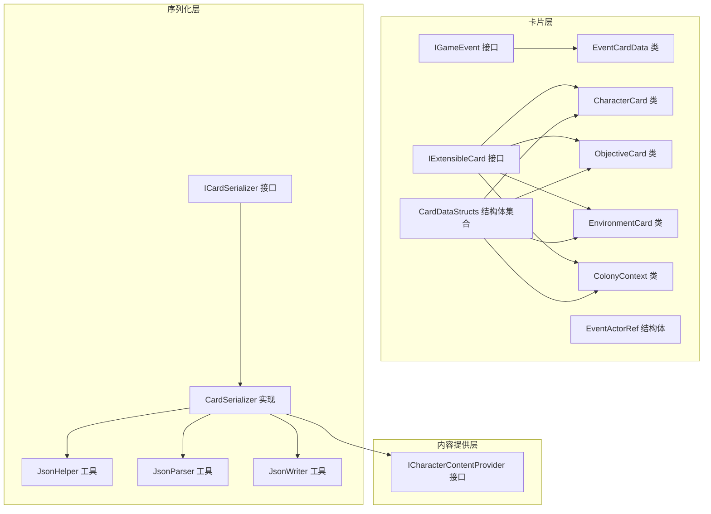
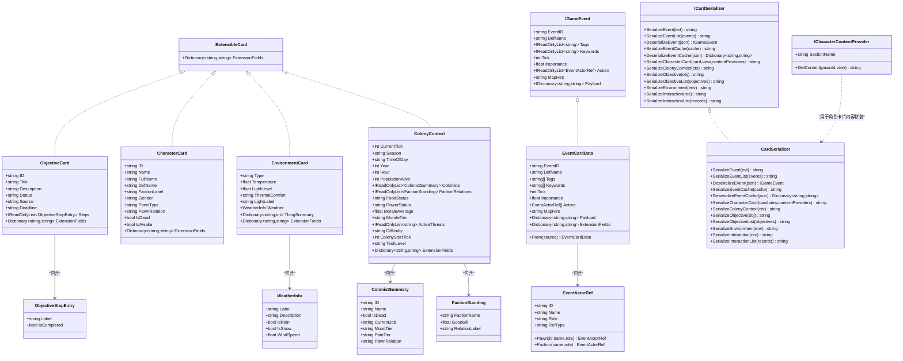
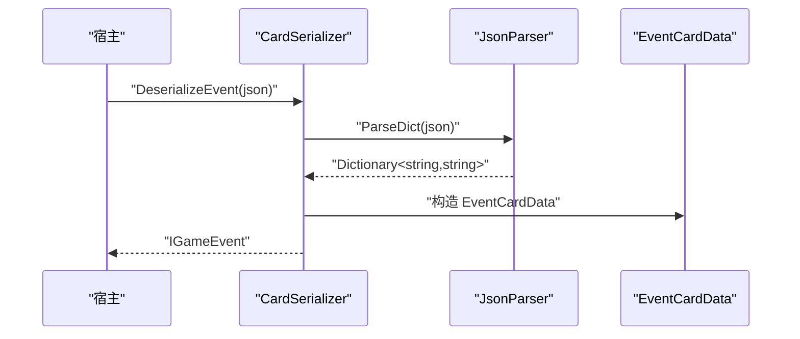
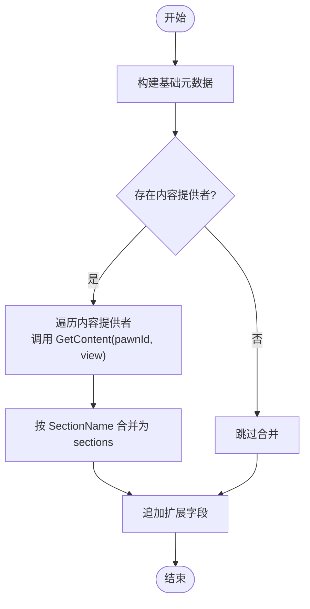
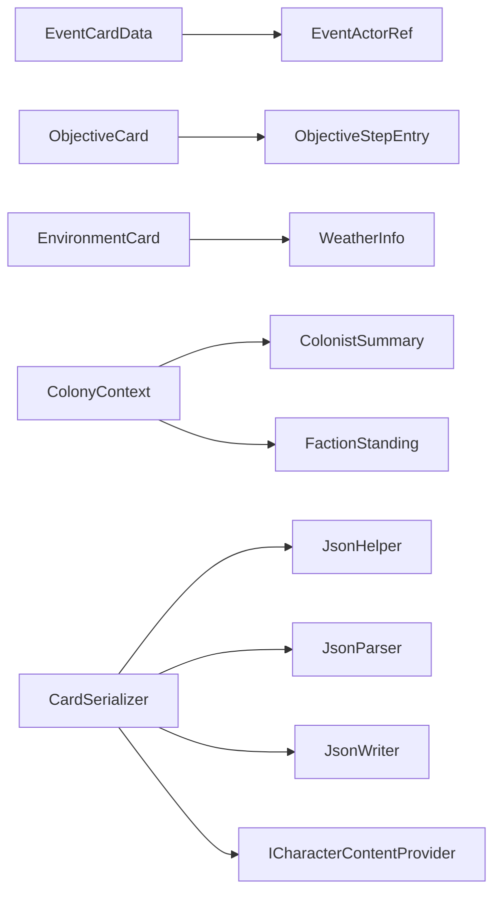

# 卡片接口

<cite>
**本文档引用的文件**
- [IExtensibleCard.cs](file://src/NPCLife/Cards/IExtensibleCard.cs)
- [EventCard.cs](file://src/NPCLife/Cards/EventCard.cs)
- [CharacterCard.cs](file://src/NPCLife/Cards/CharacterCard.cs)
- [EnvironmentCard.cs](file://src/NPCLife/Cards/EnvironmentCard.cs)
- [ObjectiveCard.cs](file://src/NPCLife/Cards/ObjectiveCard.cs)
- [CardDataStructs.cs](file://src/NPCLife/Cards/CardDataStructs.cs)
- [ColonyContext.cs](file://src/NPCLife/Cards/ColonyContext.cs)
- [ICardSerializer.cs](file://src/NPCLife/Framework/Mcp/ICardSerializer.cs)
- [CardSerializer.cs](file://src/NPCLife/Framework/Mcp/CardSerializer.cs)
- [ICharacterContentProvider.cs](file://src/NPCLife/Core/ICharacterContentProvider.cs)
- [JsonHelper.cs](file://src/NPCLife/Framework/JsonHelper.cs)
- [JsonParser.cs](file://src/NPCLife/Framework/JsonParser.cs)
- [JsonWriter.cs](file://src/NPCLife/Framework/JsonWriter.cs)
- [EventCardTests.cs](file://tests/NPCLife.Tests/Cards/EventCardTests.cs)
</cite>

## 目录
1. [简介](#简介)
2. [项目结构](#项目结构)
3. [核心组件](#核心组件)
4. [架构总览](#架构总览)
5. [详细组件分析](#详细组件分析)
6. [依赖关系分析](#依赖关系分析)
7. [性能考量](#性能考量)
8. [故障排除指南](#故障排除指南)
9. [结论](#结论)
10. [附录](#附录)

## 简介
本文件系统性梳理 NPCLife 框架中的卡片接口与数据结构，覆盖以下核心卡片类型：
- IExtensibleCard 可扩展卡片接口
- EventCard 事件卡片
- CharacterCard 角色卡片
- EnvironmentCard 环境卡片
- ObjectiveCard 目标卡片
- ColonyContext 殖民地上下文（实现 IExtensibleCard）

文档重点说明各卡片的属性定义、方法接口、数据结构、序列化与反序列化流程、继承与扩展机制、验证规则与业务约束，并提供使用模式与最佳实践。

## 项目结构
NPCLife 的卡片体系位于 src/NPCLife/Cards 目录，配套的序列化与解析工具位于 src/NPCLife/Framework/Mcp 与 src/NPCLife/Framework 下，测试位于 tests/NPCLife.Tests/Cards。

图表来源
- [EventCard.cs:45-84](file://src/NPCLife/Cards/EventCard.cs#L45-L84)
- [CharacterCard.cs:9-25](file://src/NPCLife/Cards/CharacterCard.cs#L9-L25)
- [ObjectiveCard.cs:10-35](file://src/NPCLife/Cards/ObjectiveCard.cs#L10-L35)
- [EnvironmentCard.cs:9-31](file://src/NPCLife/Cards/EnvironmentCard.cs#L9-L31)
- [ColonyContext.cs:9-81](file://src/NPCLife/Cards/ColonyContext.cs#L9-L81)
- [IExtensibleCard.cs:9-13](file://src/NPCLife/Cards/IExtensibleCard.cs#L9-L13)
- [CardDataStructs.cs:6-37](file://src/NPCLife/Cards/CardDataStructs.cs#L6-L37)
- [ICardSerializer.cs:12-32](file://src/NPCLife/Framework/Mcp/ICardSerializer.cs#L12-L32)
- [CardSerializer.cs:14-419](file://src/NPCLife/Framework/Mcp/CardSerializer.cs#L14-L419)
- [JsonHelper.cs:8-53](file://src/NPCLife/Framework/JsonHelper.cs#L8-L53)
- [JsonParser.cs:13-267](file://src/NPCLife/Framework/JsonParser.cs#L13-L267)
- [JsonWriter.cs:11-135](file://src/NPCLife/Framework/JsonWriter.cs#L11-L135)
- [ICharacterContentProvider.cs:21-36](file://src/NPCLife/Core/ICharacterContentProvider.cs#L21-L36)

章节来源
- [EventCard.cs:1-126](file://src/NPCLife/Cards/EventCard.cs#L1-L126)
- [CharacterCard.cs:1-71](file://src/NPCLife/Cards/CharacterCard.cs#L1-L71)
- [EnvironmentCard.cs:1-33](file://src/NPCLife/Cards/EnvironmentCard.cs#L1-L33)
- [ObjectiveCard.cs:1-46](file://src/NPCLife/Cards/ObjectiveCard.cs#L1-L46)
- [ColonyContext.cs:1-83](file://src/NPCLife/Cards/ColonyContext.cs#L1-L83)
- [IExtensibleCard.cs:1-15](file://src/NPCLife/Cards/IExtensibleCard.cs#L1-L15)
- [CardDataStructs.cs:1-39](file://src/NPCLife/Cards/CardDataStructs.cs#L1-L39)
- [ICardSerializer.cs:1-34](file://src/NPCLife/Framework/Mcp/ICardSerializer.cs#L1-L34)
- [CardSerializer.cs:1-421](file://src/NPCLife/Framework/Mcp/CardSerializer.cs#L1-L421)
- [ICharacterContentProvider.cs:1-38](file://src/NPCLife/Core/ICharacterContentProvider.cs#L1-L38)
- [JsonHelper.cs:1-54](file://src/NPCLife/Framework/JsonHelper.cs#L1-L54)
- [JsonParser.cs:1-268](file://src/NPCLife/Framework/JsonParser.cs#L1-L268)
- [JsonWriter.cs:1-136](file://src/NPCLife/Framework/JsonWriter.cs#L1-L136)

## 核心组件
- IExtensibleCard：定义扩展字段 ExtensionFields，用于将自定义键值对平铺到卡片 JSON 顶层，便于 LLM 或下游消费者直接访问。
- IGameEvent：事件卡片的纯 DTO 接口，定义事件标识、定义名、标签、关键词、时间戳、重要度、参与者引用、地图提示以及松结构负载等。
- EventCardData：IGameEvent 的可序列化实现，同时实现 IExtensibleCard，提供 From 静态方法进行深拷贝。
- EventActorRef：事件参与者引用的结构体，支持 Pawn/Faction 两种工厂方法，默认值安全处理。
- CharacterCard：角色卡片，聚合身份元数据，实现 IExtensibleCard。
- ObjectiveCard：目标卡片，聚合目标标识、标题、描述、状态、来源、截止时间、子步骤等，实现 IExtensibleCard。
- EnvironmentCard：环境卡片，描述环境类型、温度、光照、热舒适度、光照标签、天气信息、物品摘要等，实现 IExtensibleCard。
- ColonyContext：世界全局上下文，包含时间、人口、派系关系、资源状态、士气、威胁、难度、生命周期与科技等级等，实现 IExtensibleCard。
- CardDataStructs：环境/天气/殖民者摘要等轻量结构体集合。
- ICardSerializer/ CardSerializer：卡片到 JSON 的序列化器，支持事件、角色、目标、环境、交互记录、殖民者摘要等的序列化与反序列化。
- ICharacterContentProvider：角色内容提供者接口，用于按视图层级动态拼装角色卡片的分段内容。

章节来源
- [IExtensibleCard.cs:9-13](file://src/NPCLife/Cards/IExtensibleCard.cs#L9-L13)
- [EventCard.cs:11-39](file://src/NPCLife/Cards/EventCard.cs#L11-L39)
- [EventCard.cs:45-84](file://src/NPCLife/Cards/EventCard.cs#L45-L84)
- [EventCard.cs:89-124](file://src/NPCLife/Cards/EventCard.cs#L89-L124)
- [CharacterCard.cs:9-25](file://src/NPCLife/Cards/CharacterCard.cs#L9-L25)
- [ObjectiveCard.cs:10-35](file://src/NPCLife/Cards/ObjectiveCard.cs#L10-L35)
- [EnvironmentCard.cs:9-31](file://src/NPCLife/Cards/EnvironmentCard.cs#L9-L31)
- [ColonyContext.cs:9-81](file://src/NPCLife/Cards/ColonyContext.cs#L9-L81)
- [CardDataStructs.cs:6-37](file://src/NPCLife/Cards/CardDataStructs.cs#L6-L37)
- [ICardSerializer.cs:12-32](file://src/NPCLife/Framework/Mcp/ICardSerializer.cs#L12-L32)
- [CardSerializer.cs:14-419](file://src/NPCLife/Framework/Mcp/CardSerializer.cs#L14-L419)
- [ICharacterContentProvider.cs:21-36](file://src/NPCLife/Core/ICharacterContentProvider.cs#L21-L36)

## 架构总览
卡片系统采用“纯 DTO + 可扩展接口 + 自定义序列化器”的设计，确保：
- 卡片对象仅承载数据，降低与游戏引擎的耦合
- 通过 IExtensibleCard 支持灵活扩展
- 通过 ICardSerializer 提供稳定、高性能的 JSON 序列化/反序列化能力
- 通过 ICharacterContentProvider 实现角色卡片的分段内容动态拼装

图表来源
- [EventCard.cs:11-84](file://src/NPCLife/Cards/EventCard.cs#L11-L84)
- [CharacterCard.cs:9-71](file://src/NPCLife/Cards/CharacterCard.cs#L9-L71)
- [ObjectiveCard.cs:10-45](file://src/NPCLife/Cards/ObjectiveCard.cs#L10-L45)
- [EnvironmentCard.cs:9-31](file://src/NPCLife/Cards/EnvironmentCard.cs#L9-L31)
- [ColonyContext.cs:9-81](file://src/NPCLife/Cards/ColonyContext.cs#L9-L81)
- [CardDataStructs.cs:6-37](file://src/NPCLife/Cards/CardDataStructs.cs#L6-L37)
- [ICardSerializer.cs:12-32](file://src/NPCLife/Framework/Mcp/ICardSerializer.cs#L12-L32)
- [CardSerializer.cs:14-419](file://src/NPCLife/Framework/Mcp/CardSerializer.cs#L14-L419)
- [ICharacterContentProvider.cs:21-36](file://src/NPCLife/Core/ICharacterContentProvider.cs#L21-L36)

## 详细组件分析

### IExtensibleCard 可扩展卡片接口
- 定义：扩展字段集合，序列化时平铺到卡片 JSON 顶层。
- 用途：允许宿主或插件在不修改核心 DTO 的情况下注入自定义键值对，便于下游消费。

章节来源
- [IExtensibleCard.cs:9-13](file://src/NPCLife/Cards/IExtensibleCard.cs#L9-L13)

### EventCard 事件卡片
- 接口 IGameEvent
  - 关键属性：事件唯一标识、定义名、标签列表、关键词列表、发生时刻、重要度、参与者引用、地图提示、松结构负载。
  - 设计要点：纯 DTO，避免游戏逻辑耦合；标签与关键词用于 LLM 消费与检索。
- 数据类 EventCardData
  - 实现 IGameEvent 与 IExtensibleCard。
  - 提供 From 静态方法进行深拷贝，确保不可变性与线程安全。
- 参与者引用 EventActorRef
  - 支持 Pawn 与 Faction 两类工厂方法，提供默认值保护，避免空引用导致的异常。
- 反序列化
  - CardSerializer.DeserializeEvent 将 JSON 反序列化为 EventCardData，兼容空值与缺失字段。

图表来源
- [CardSerializer.cs:70-89](file://src/NPCLife/Framework/Mcp/CardSerializer.cs#L70-L89)
- [JsonParser.cs:23-92](file://src/NPCLife/Framework/JsonParser.cs#L23-L92)

章节来源
- [EventCard.cs:11-39](file://src/NPCLife/Cards/EventCard.cs#L11-L39)
- [EventCard.cs:45-84](file://src/NPCLife/Cards/EventCard.cs#L45-L84)
- [EventCard.cs:89-124](file://src/NPCLife/Cards/EventCard.cs#L89-L124)
- [CardSerializer.cs:22-59](file://src/NPCLife/Framework/Mcp/CardSerializer.cs#L22-L59)
- [CardSerializer.cs:70-89](file://src/NPCLife/Framework/Mcp/CardSerializer.cs#L70-L89)

### CharacterCard 角色卡片
- 属性：角色身份元数据（ID、姓名、全名、定义名、派系标签、性别、类型、关系、生死、醒着与否）。
- 扩展：实现 IExtensibleCard，支持注入自定义键值。
- 视图拼装：通过 ICharacterContentProvider 的 SectionName 与 GetContent 动态拼装“static/dynamic/full”不同粒度的内容。

图表来源
- [CardSerializer.cs:197-238](file://src/NPCLife/Framework/Mcp/CardSerializer.cs#L197-L238)
- [ICharacterContentProvider.cs:21-36](file://src/NPCLife/Core/ICharacterContentProvider.cs#L21-L36)

章节来源
- [CharacterCard.cs:9-25](file://src/NPCLife/Cards/CharacterCard.cs#L9-L25)
- [CardSerializer.cs:197-238](file://src/NPCLife/Framework/Mcp/CardSerializer.cs#L197-L238)
- [ICharacterContentProvider.cs:6-36](file://src/NPCLife/Core/ICharacterContentProvider.cs#L6-L36)

### ObjectiveCard 目标卡片
- 属性：目标标识、标题、描述、状态、来源、截止时间、子步骤列表。
- 子步骤：ObjectiveStepEntry 包含标签与完成状态。
- 扩展：实现 IExtensibleCard。

章节来源
- [ObjectiveCard.cs:10-45](file://src/NPCLife/Cards/ObjectiveCard.cs#L10-L45)
- [CardSerializer.cs:244-270](file://src/NPCLife/Framework/Mcp/CardSerializer.cs#L244-L270)

### EnvironmentCard 环境卡片
- 属性：环境类型、温度、光照、热舒适度、光照标签、天气信息、物品摘要。
- 天气：WeatherInfo 包含标签、描述、降水与风速。
- 扩展：实现 IExtensibleCard。

章节来源
- [EnvironmentCard.cs:9-31](file://src/NPCLife/Cards/EnvironmentCard.cs#L9-L31)
- [CardDataStructs.cs:30-37](file://src/NPCLife/Cards/CardDataStructs.cs#L30-L37)
- [CardSerializer.cs:281-314](file://src/NPCLife/Framework/Mcp/CardSerializer.cs#L281-L314)

### ColonyContext 殖民地上下文
- 属性：时间（tick、季节、时段、年、小时）、人口、角色摘要、派系关系、资源状态、士气、威胁、难度、生命周期、科技等级。
- 扩展：实现 IExtensibleCard。

章节来源
- [ColonyContext.cs:9-81](file://src/NPCLife/Cards/ColonyContext.cs#L9-L81)
- [CardSerializer.cs:116-173](file://src/NPCLife/Framework/Mcp/CardSerializer.cs#L116-L173)

### 数据结构与序列化工具
- JsonHelper：字符串转义与引用。
- JsonParser：JSON 解析（字典、对象数组、字符串数组），支持转义还原。
- JsonWriter：轻量 JSON 写入器，支持原生值与原生 JSON 片段写入，最小化内存分配。
- ICardSerializer/CardSerializer：统一的卡片序列化入口，支持事件、角色、目标、环境、交互记录、殖民者摘要等。

章节来源
- [JsonHelper.cs:8-53](file://src/NPCLife/Framework/JsonHelper.cs#L8-L53)
- [JsonParser.cs:13-267](file://src/NPCLife/Framework/JsonParser.cs#L13-L267)
- [JsonWriter.cs:11-135](file://src/NPCLife/Framework/JsonWriter.cs#L11-L135)
- [ICardSerializer.cs:12-32](file://src/NPCLife/Framework/Mcp/ICardSerializer.cs#L12-L32)
- [CardSerializer.cs:14-419](file://src/NPCLife/Framework/Mcp/CardSerializer.cs#L14-L419)

## 依赖关系分析
- 卡片层依赖：EventCardData 依赖 EventActorRef；ObjectiveCard 依赖 ObjectiveStepEntry；EnvironmentCard 依赖 WeatherInfo；ColonyContext 依赖 ColonistSummary 与 FactionStanding。
- 序列化层依赖：CardSerializer 依赖 JsonHelper、JsonParser、JsonWriter，并通过 ICharacterContentProvider 拼装角色卡片内容。
- 测试依赖：EventCardTests 验证 EventActorRef 工厂方法、IGameEvent 标签、CharacterCard 默认值、ColonyContext 默认值、EnvironmentCard 默认值、ObjectiveCard 默认值与子步骤默认值。

图表来源
- [EventCard.cs:45-124](file://src/NPCLife/Cards/EventCard.cs#L45-L124)
- [ObjectiveCard.cs:10-45](file://src/NPCLife/Cards/ObjectiveCard.cs#L10-L45)
- [EnvironmentCard.cs:9-31](file://src/NPCLife/Cards/EnvironmentCard.cs#L9-L31)
- [ColonyContext.cs:9-81](file://src/NPCLife/Cards/ColonyContext.cs#L9-L81)
- [CardSerializer.cs:14-419](file://src/NPCLife/Framework/Mcp/CardSerializer.cs#L14-L419)
- [ICharacterContentProvider.cs:21-36](file://src/NPCLife/Core/ICharacterContentProvider.cs#L21-L36)

章节来源
- [EventCardTests.cs:17-177](file://tests/NPCLife.Tests/Cards/EventCardTests.cs#L17-L177)

## 性能考量
- 序列化器采用轻量写入器与最小化字符串分配策略，适合高频调用场景。
- JsonWriter 支持原生 JSON 片段写入，避免二次编码成本。
- JsonParser 采用手动解析，减少 LINQ 与反射开销。
- CardSerializer.Default 单例模式，便于基础设施层直接使用，减少实例化成本。

章节来源
- [JsonWriter.cs:11-135](file://src/NPCLife/Framework/JsonWriter.cs#L11-L135)
- [JsonParser.cs:13-267](file://src/NPCLife/Framework/JsonParser.cs#L13-L267)
- [CardSerializer.cs:16-17](file://src/NPCLife/Framework/Mcp/CardSerializer.cs#L16-L17)

## 故障排除指南
- 事件反序列化失败
  - 检查 JSON 是否为空或格式错误；确认必需字段（如 eventId、defName、tags、actors、payload）是否存在。
  - 使用 CardSerializer.DeserializeEvent 并检查返回对象的字段默认值。
- 角色卡片内容为空
  - 确认 ICharacterContentProvider 的 SectionName 与 GetContent 返回值；检查视图层级（static/dynamic/full）是否正确传递。
- 环境卡片天气为空
  - 确认 WeatherInfo 的 Label 是否为空；仅当非空时才会序列化 weather 字段。
- 目标卡片子步骤为空
  - 确认 Steps 列表是否为空；子步骤默认值 IsCompleted 为 false，Label 为 null。

章节来源
- [CardSerializer.cs:70-89](file://src/NPCLife/Framework/Mcp/CardSerializer.cs#L70-L89)
- [CardSerializer.cs:197-238](file://src/NPCLife/Framework/Mcp/CardSerializer.cs#L197-L238)
- [CardSerializer.cs:281-314](file://src/NPCLife/Framework/Mcp/CardSerializer.cs#L281-L314)
- [EventCardTests.cs:17-177](file://tests/NPCLife.Tests/Cards/EventCardTests.cs#L17-L177)

## 结论
NPCLife 的卡片系统以纯 DTO 为核心，结合 IExtensibleCard 的扩展能力与 CardSerializer 的高性能序列化，提供了清晰、可扩展且易于测试的卡片数据模型。通过 ICharacterContentProvider 的分段内容拼装，角色卡片能够按需输出不同粒度的信息。建议在实际使用中遵循以下原则：
- 优先使用 DTO 进行数据传递，避免直接依赖游戏引擎对象。
- 通过 IExtensibleCard 注入必要的扩展字段，保持向后兼容。
- 使用 CardSerializer 进行统一序列化/反序列化，确保跨模块一致性。
- 在需要动态内容时，利用 ICharacterContentProvider 的 SectionName 与视图层级控制输出范围。

## 附录

### 卡片对象创建与序列化/反序列化示例（路径指引）
- 创建事件卡片数据并序列化
  - 示例路径：[EventCard.cs:64-83](file://src/NPCLife/Cards/EventCard.cs#L64-L83)
  - 序列化路径：[CardSerializer.cs:22-59](file://src/NPCLife/Framework/Mcp/CardSerializer.cs#L22-L59)
  - 反序列化路径：[CardSerializer.cs:70-89](file://src/NPCLife/Framework/Mcp/CardSerializer.cs#L70-L89)
- 创建角色卡片并序列化（含内容提供者）
  - 示例路径：[CharacterCard.cs:10-25](file://src/NPCLife/Cards/CharacterCard.cs#L10-L25)
  - 序列化路径：[CardSerializer.cs:197-238](file://src/NPCLife/Framework/Mcp/CardSerializer.cs#L197-L238)
  - 内容提供者接口：[ICharacterContentProvider.cs:21-36](file://src/NPCLife/Core/ICharacterContentProvider.cs#L21-L36)
- 创建目标卡片并序列化
  - 示例路径：[ObjectiveCard.cs:12-34](file://src/NPCLife/Cards/ObjectiveCard.cs#L12-L34)
  - 序列化路径：[CardSerializer.cs:244-270](file://src/NPCLife/Framework/Mcp/CardSerializer.cs#L244-L270)
- 创建环境卡片并序列化
  - 示例路径：[EnvironmentCard.cs:11-30](file://src/NPCLife/Cards/EnvironmentCard.cs#L11-L30)
  - 序列化路径：[CardSerializer.cs:281-314](file://src/NPCLife/Framework/Mcp/CardSerializer.cs#L281-L314)
- 创建殖民地上下文并序列化
  - 示例路径：[ColonyContext.cs:15-80](file://src/NPCLife/Cards/ColonyContext.cs#L15-L80)
  - 序列化路径：[CardSerializer.cs:116-173](file://src/NPCLife/Framework/Mcp/CardSerializer.cs#L116-L173)

### 验证规则与业务约束
- 事件卡片
  - 标签与关键词为字符串列表，可为空但不应为 null；事件 ID 与定义名不能为空。
  - 参与者引用的默认值保护：ID 与 Name 缺省时使用占位符，Role 缺省时使用“Bystander”，RefType 缺省时使用“Pawn”。
- 角色卡片
  - 默认值：ID、Name 等可为空；IsDead、IsAwake 默认为 false。
- 环境卡片
  - 天气信息仅在 Label 非空时序列化 weather 字段。
- 目标卡片
  - Deadline 可为空；Steps 可为空；子步骤默认值 IsCompleted 为 false。
- 殖民地上下文
  - 默认值：CurrentTick、Year、PopulationAlive 等为 0；Season、TimeOfDay、Colonists、FactionRelations、ActiveThreats 等为 null。

章节来源
- [EventCard.cs:103-124](file://src/NPCLife/Cards/EventCard.cs#L103-L124)
- [EventCardTests.cs:17-177](file://tests/NPCLife.Tests/Cards/EventCardTests.cs#L17-L177)
- [CardSerializer.cs:281-314](file://src/NPCLife/Framework/Mcp/CardSerializer.cs#L281-L314)