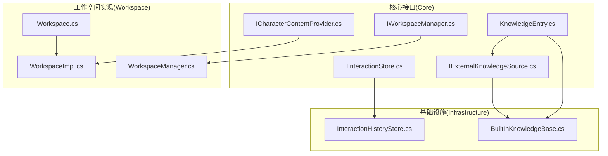
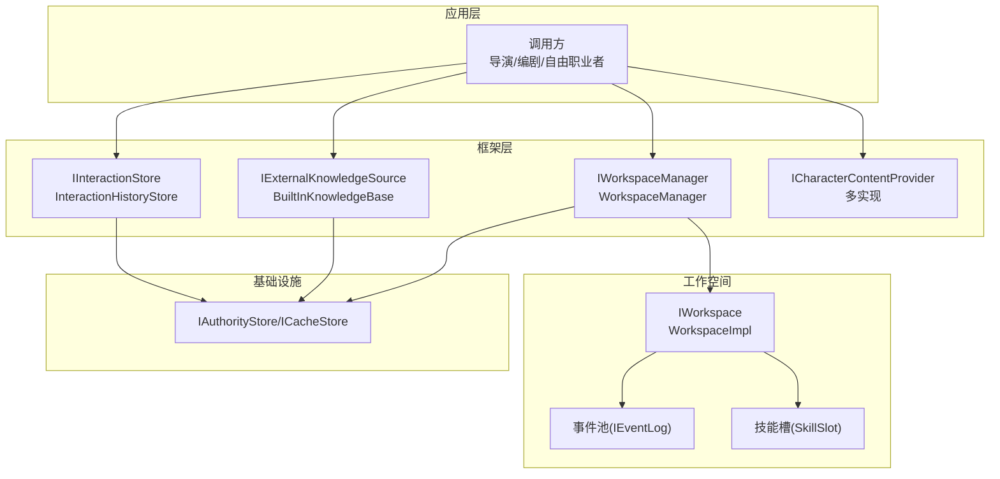
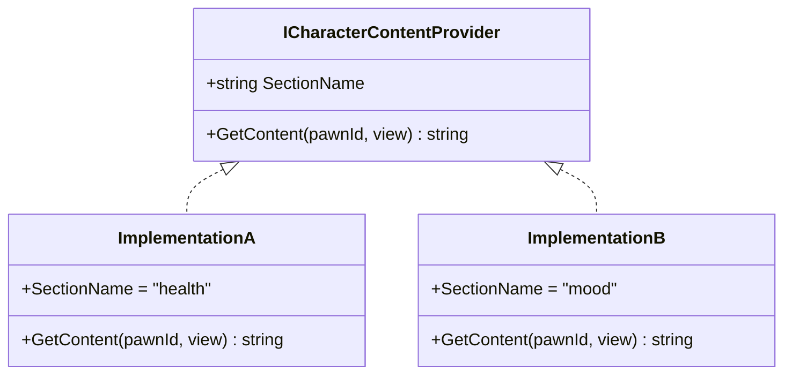
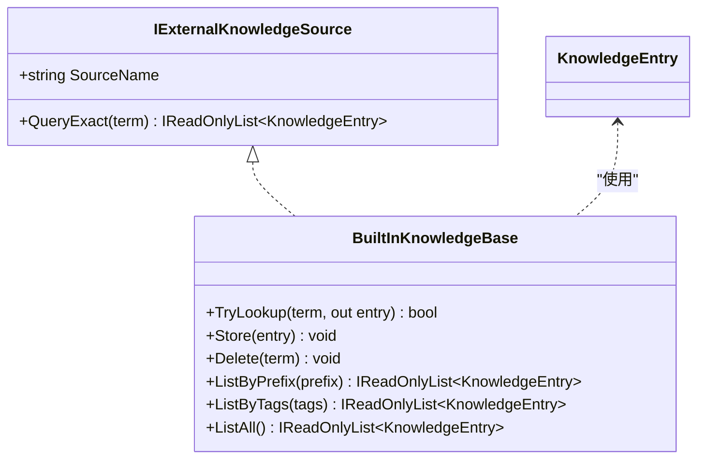
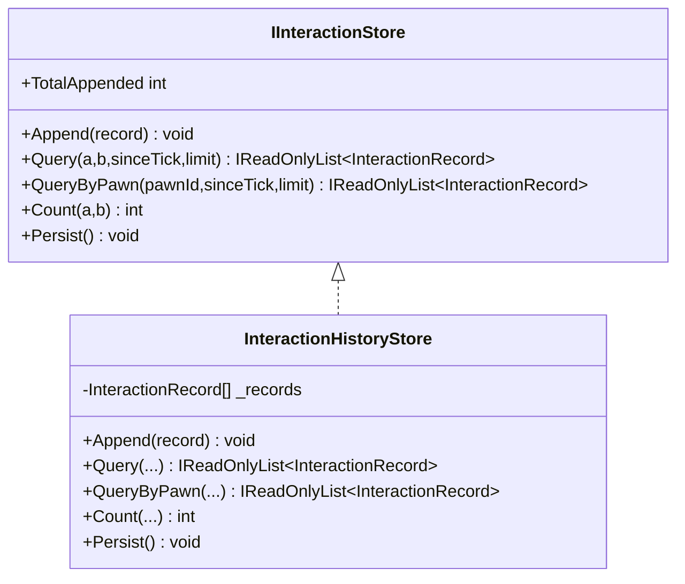
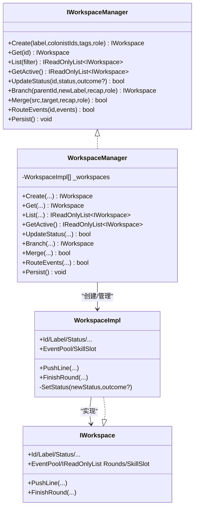
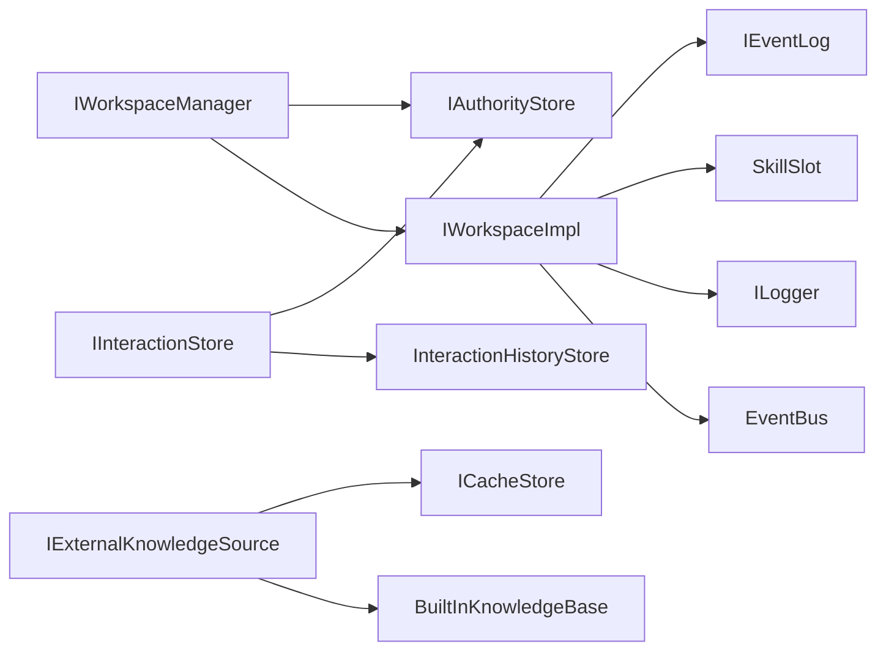

# 服务接口

<cite>
**本文引用的文件**
- [ICharacterContentProvider.cs](file://src/NPCLife/Core/ICharacterContentProvider.cs)
- [IExternalKnowledgeSource.cs](file://src/NPCLife/Core/IExternalKnowledgeSource.cs)
- [IInteractionStore.cs](file://src/NPCLife/Core/IInteractionStore.cs)
- [IWorkspaceManager.cs](file://src/NPCLife/Core/IWorkspaceManager.cs)
- [KnowledgeEntry.cs](file://src/NPCLife/Core/KnowledgeEntry.cs)
- [IWorkspace.cs](file://src/NPCLife/Workspace/IWorkspace.cs)
- [WorkspaceImpl.cs](file://src/NPCLife/Workspace/WorkspaceImpl.cs)
- [WorkspaceManager.cs](file://src/NPCLife/Workspace/WorkspaceManager.cs)
- [InteractionHistoryStore.cs](file://src/NPCLife/Infrastructure/InteractionHistoryStore.cs)
- [BuiltInKnowledgeBase.cs](file://src/NPCLife/Infrastructure/Knowledge/BuiltInKnowledgeBase.cs)
</cite>

## 目录
1. [简介](#简介)
2. [项目结构](#项目结构)
3. [核心组件](#核心组件)
4. [架构总览](#架构总览)
5. [详细组件分析](#详细组件分析)
6. [依赖分析](#依赖分析)
7. [性能考虑](#性能考虑)
8. [故障排查指南](#故障排查指南)
9. [结论](#结论)
10. [附录](#附录)

## 简介
本文件面向NPCLife框架的服务接口API文档，聚焦以下四个核心服务接口的设计与使用：
- ICharacterContentProvider：角色内容提供器接口，用于按“Section”维度输出自然语言描述，供框架组装为结构化JSON。
- IExternalKnowledgeSource：外部知识源接口，提供只读的精确词条查询能力，统一标注来源。
- IInteractionStore：交互历史存储接口，提供交互流水的追加、查询、计数与持久化能力。
- IWorkspaceManager：工作空间管理器接口，负责工作空间的CRUD、分支/合并、事件路由与持久化。

文档将逐一说明方法定义、参数规范、返回值类型、错误处理策略，并给出实现示例与集成指南，解释其在整体架构中的作用与调用关系，同时讨论性能与扩展性设计。

## 项目结构
围绕服务接口，NPCLife在Core层定义接口契约，在Workspace层提供管理器实现，在Infrastructure层提供默认存储实现。下图展示与本文相关的关键文件与职责映射：

图表来源
- [ICharacterContentProvider.cs:1-38](file://src/NPCLife/Core/ICharacterContentProvider.cs#L1-L38)
- [IExternalKnowledgeSource.cs:1-21](file://src/NPCLife/Core/IExternalKnowledgeSource.cs#L1-L21)
- [IInteractionStore.cs:1-53](file://src/NPCLife/Core/IInteractionStore.cs#L1-L53)
- [IWorkspaceManager.cs:1-58](file://src/NPCLife/Core/IWorkspaceManager.cs#L1-L58)
- [KnowledgeEntry.cs:1-27](file://src/NPCLife/Core/KnowledgeEntry.cs#L1-L27)
- [IWorkspace.cs:1-51](file://src/NPCLife/Workspace/IWorkspace.cs#L1-L51)
- [WorkspaceImpl.cs:1-197](file://src/NPCLife/Workspace/WorkspaceImpl.cs#L1-L197)
- [WorkspaceManager.cs:1-616](file://src/NPCLife/Workspace/WorkspaceManager.cs#L1-L616)
- [InteractionHistoryStore.cs:1-185](file://src/NPCLife/Infrastructure/InteractionHistoryStore.cs#L1-L185)
- [BuiltInKnowledgeBase.cs:1-206](file://src/NPCLife/Infrastructure/Knowledge/BuiltInKnowledgeBase.cs#L1-L206)

章节来源
- [ICharacterContentProvider.cs:1-38](file://src/NPCLife/Core/ICharacterContentProvider.cs#L1-L38)
- [IExternalKnowledgeSource.cs:1-21](file://src/NPCLife/Core/IExternalKnowledgeSource.cs#L1-L21)
- [IInteractionStore.cs:1-53](file://src/NPCLife/Core/IInteractionStore.cs#L1-L53)
- [IWorkspaceManager.cs:1-58](file://src/NPCLife/Core/IWorkspaceManager.cs#L1-L58)
- [KnowledgeEntry.cs:1-27](file://src/NPCLife/Core/KnowledgeEntry.cs#L1-L27)
- [IWorkspace.cs:1-51](file://src/NPCLife/Workspace/IWorkspace.cs#L1-L51)
- [WorkspaceImpl.cs:1-197](file://src/NPCLife/Workspace/WorkspaceImpl.cs#L1-L197)
- [WorkspaceManager.cs:1-616](file://src/NPCLife/Workspace/WorkspaceManager.cs#L1-L616)
- [InteractionHistoryStore.cs:1-185](file://src/NPCLife/Infrastructure/InteractionHistoryStore.cs#L1-L185)
- [BuiltInKnowledgeBase.cs:1-206](file://src/NPCLife/Infrastructure/Knowledge/BuiltInKnowledgeBase.cs#L1-L206)

## 核心组件
本节对四个服务接口进行要点梳理，便于快速理解与集成。

- ICharacterContentProvider
  - 用途：按Section维度输出角色自然语言描述，供框架聚合为结构化JSON。
  - 关键点：SectionName作为JSON key；GetContent(pawnId, view)中view取值为“static/dynamic/full”，不同层级返回不同详细度；返回null或空字符串表示该层级不需要此section。
  - 错误处理：未显式抛异常，建议实现方对非法pawnId或未知view返回空内容，避免破坏聚合流程。

- IExternalKnowledgeSource
  - 用途：只读外部知识源抽象，支持精确词条查询。
  - 关键点：SourceName用于标注查询结果来源；QueryExact(term)返回命中列表，且KnowledgeEntry.Source字段应与SourceName一致。
  - 错误处理：未显式抛异常，建议实现方对空term返回空列表，保证上层一致性。

- IInteractionStore
  - 用途：交互历史存储抽象，append-only流水，不裁剪，持久化到存档。
  - 关键点：Append(record)追加；Query/pairwise与QueryByPawn支持sinceTick与limit；Count统计两角色间交互次数；TotalAppended累计追加总数；Persist刷新持久化。
  - 错误处理：实现方应在Persist/Load时捕获异常并记录警告，避免影响宿主生命周期。

- IWorkspaceManager
  - 用途：工作空间管理器抽象，负责CRUD、分支/合并、事件路由与持久化。
  - 关键点：Create/Get/List/GetActive/UpdateStatus；Branch/Merge；RouteEvents转发至工作空间事件池；Persist持久化。
  - 错误处理：实现方应对非法输入、状态机不合法转换、目标不存在等情况返回false或记录警告。

章节来源
- [ICharacterContentProvider.cs:16-36](file://src/NPCLife/Core/ICharacterContentProvider.cs#L16-L36)
- [IExternalKnowledgeSource.cs:9-19](file://src/NPCLife/Core/IExternalKnowledgeSource.cs#L9-L19)
- [IInteractionStore.cs:11-51](file://src/NPCLife/Core/IInteractionStore.cs#L11-L51)
- [IWorkspaceManager.cs:14-56](file://src/NPCLife/Core/IWorkspaceManager.cs#L14-L56)

## 架构总览
下图展示服务接口在NPCLife中的角色定位与典型调用链路：

图表来源
- [WorkspaceManager.cs:19-40](file://src/NPCLife/Workspace/WorkspaceManager.cs#L19-L40)
- [InteractionHistoryStore.cs:16-33](file://src/NPCLife/Infrastructure/InteractionHistoryStore.cs#L16-L33)
- [BuiltInKnowledgeBase.cs:13-29](file://src/NPCLife/Infrastructure/Knowledge/BuiltInKnowledgeBase.cs#L13-L29)
- [WorkspaceImpl.cs:16-46](file://src/NPCLife/Workspace/WorkspaceImpl.cs#L16-L46)

## 详细组件分析

### ICharacterContentProvider 接口
- 方法与参数
  - SectionName：只读字符串，作为JSON key。
  - GetContent(pawnId, view)：返回自然语言描述；view取值为“static/dynamic/full”，实现可据此调整详细度；返回null或空字符串表示该层级不需要此section。
- 返回值
  - 字符串：自然语言描述；空内容用null或空字符串表示。
- 错误处理
  - 建议：对非法pawnId或未知view返回空内容；不抛异常以免影响聚合。
- 集成示例（思路）
  - 在游戏侧实现多个ICharacterContentProvider实例，分别覆盖health/mood/skills等维度；框架收集后按SectionName组装为结构化JSON。
- 性能与扩展性
  - 建议：GetContent内部采用缓存与延迟计算；view参数用于控制开销；避免在热路径做昂贵IO。

图表来源
- [ICharacterContentProvider.cs:21-36](file://src/NPCLife/Core/ICharacterContentProvider.cs#L21-L36)

章节来源
- [ICharacterContentProvider.cs:6-36](file://src/NPCLife/Core/ICharacterContentProvider.cs#L6-L36)

### IExternalKnowledgeSource 接口
- 方法与参数
  - SourceName：只读字符串，用于标注查询结果来源。
  - QueryExact(term)：精确查询词条，返回IReadOnlyList<KnowledgeEntry>；返回条目的Source字段应与SourceName一致。
- 返回值
  - 知识条目列表；空列表表示无命中。
- 错误处理
  - 建议：对空term返回空列表；实现内部异常捕获并记录警告。
- 集成示例（思路）
  - 可对接GameDef数据库、Wiki或RAG系统；实现方自行决定精确/模糊匹配策略，但需保证Source一致性。
- 性能与扩展性
  - 建议：Term作为大小写不敏感索引键；实现内建缓存；支持按ContextTags过滤。

图表来源
- [IExternalKnowledgeSource.cs:9-19](file://src/NPCLife/Core/IExternalKnowledgeSource.cs#L9-L19)
- [BuiltInKnowledgeBase.cs:13-29](file://src/NPCLife/Infrastructure/Knowledge/BuiltInKnowledgeBase.cs#L13-L29)
- [KnowledgeEntry.cs:9-25](file://src/NPCLife/Core/KnowledgeEntry.cs#L9-L25)

章节来源
- [IExternalKnowledgeSource.cs:9-19](file://src/NPCLife/Core/IExternalKnowledgeSource.cs#L9-L19)
- [KnowledgeEntry.cs:9-25](file://src/NPCLife/Core/KnowledgeEntry.cs#L9-L25)
- [BuiltInKnowledgeBase.cs:35-104](file://src/NPCLife/Infrastructure/Knowledge/BuiltInKnowledgeBase.cs#L35-L104)

### IInteractionStore 接口
- 方法与参数
  - Append(record)：追加交互记录。
  - Query(pawnIdA, pawnIdB, sinceTick?, limit?)：返回两角色间的交互记录（按时间升序）。
  - QueryByPawn(pawnId, sinceTick?, limit?)：返回与指定角色相关的所有交互记录。
  - Count(pawnIdA, pawnIdB)：统计两角色间交互次数。
  - TotalAppended：累计追加总数。
  - Persist()：将内存中记录持久化。
- 返回值
  - Query系列返回IReadOnlyList<InteractionRecord>；Count返回整数；TotalAppended为只读整数。
- 错误处理
  - 建议：对非法record（缺少InitiatorID/RecipientID）忽略；Persist/Load异常捕获并记录警告。
- 集成示例（思路）
  - 使用默认实现InteractionHistoryStore，基于IAuthorityStore进行存档；在合适时机调用Persist。
- 性能与扩展性
  - 建议：Append为O(1)；查询使用LINQ过滤与排序，注意limit优化；避免在高并发下频繁持久化。

图表来源
- [IInteractionStore.cs:11-51](file://src/NPCLife/Core/IInteractionStore.cs#L11-L51)
- [InteractionHistoryStore.cs:16-91](file://src/NPCLife/Infrastructure/InteractionHistoryStore.cs#L16-L91)

章节来源
- [IInteractionStore.cs:11-51](file://src/NPCLife/Core/IInteractionStore.cs#L11-L51)
- [InteractionHistoryStore.cs:39-91](file://src/NPCLife/Infrastructure/InteractionHistoryStore.cs#L39-L91)

### IWorkspaceManager 接口
- 方法与参数
  - CRUD：Create(label, colonistIds, tags, createdByRole)、Get(id)、List(statusFilter?)、GetActive()、UpdateStatus(id, newStatus, outcome?)。
  - 结构操作：Branch(parentId, newLabel, branchRecap, callerRole)、Merge(sourceId, targetId, mergeRecap, callerRole)。
  - 事件路由：RouteEvents(workspaceId, events)。
  - 持久化：Persist()。
- 返回值
  - Create/Branch返回IWorkspace；Get/List/GetActive返回IWorkspace或只读列表；UpdateStatus/Branch/Merge返回bool；RouteEvents返回bool。
- 错误处理
  - 建议：对非法callerRole、不存在的workspace、状态机不合法转换返回false并记录警告；完成状态变更后发布事件。
- 集成示例（思路）
  - 使用默认实现WorkspaceManager，注入IAuthorityStore、ILogger、DriverConfig、ICardSerializer；在宿主生命周期中调用Persist。
- 性能与扩展性
  - 建议：使用ReaderWriterLockSlim保护内存集合；序列化/反序列化批量处理；状态机校验前置；事件路由仅转发到活动工作空间。

图表来源
- [IWorkspaceManager.cs:14-56](file://src/NPCLife/Core/IWorkspaceManager.cs#L14-L56)
- [WorkspaceManager.cs:19-40](file://src/NPCLife/Workspace/WorkspaceManager.cs#L19-L40)
- [IWorkspace.cs:11-50](file://src/NPCLife/Workspace/IWorkspace.cs#L11-L50)
- [WorkspaceImpl.cs:16-46](file://src/NPCLife/Workspace/WorkspaceImpl.cs#L16-L46)

章节来源
- [IWorkspaceManager.cs:14-56](file://src/NPCLife/Core/IWorkspaceManager.cs#L14-L56)
- [WorkspaceManager.cs:91-187](file://src/NPCLife/Workspace/WorkspaceManager.cs#L91-L187)
- [WorkspaceManager.cs:193-376](file://src/NPCLife/Workspace/WorkspaceManager.cs#L193-L376)
- [WorkspaceManager.cs:382-392](file://src/NPCLife/Workspace/WorkspaceManager.cs#L382-L392)
- [WorkspaceManager.cs:50-74](file://src/NPCLife/Workspace/WorkspaceManager.cs#L50-L74)
- [IWorkspace.cs:11-50](file://src/NPCLife/Workspace/IWorkspace.cs#L11-L50)
- [WorkspaceImpl.cs:83-182](file://src/NPCLife/Workspace/WorkspaceImpl.cs#L83-L182)

## 依赖分析
- 接口耦合
  - IWorkspaceManager依赖IAuthorityStore进行持久化；IInteractionStore依赖IAuthorityStore；IExternalKnowledgeSource依赖ICacheStore。
  - IWorkspaceImpl内部依赖IEventLog（事件池）、SkillSlot、ICardSerializer、ILogger、EventBus等。
- 直接与间接依赖
  - WorkspaceManager直接管理WorkspaceImpl集合；WorkspaceImpl持有事件池与技能槽组件。
  - InteractionHistoryStore与BuiltInKnowledgeBase分别封装各自的持久化逻辑。
- 循环依赖
  - 当前接口设计未见循环依赖；事件通过EventBus发布，避免紧耦合。

图表来源
- [WorkspaceManager.cs:23-38](file://src/NPCLife/Workspace/WorkspaceManager.cs#L23-L38)
- [InteractionHistoryStore.cs:19-33](file://src/NPCLife/Infrastructure/InteractionHistoryStore.cs#L19-L33)
- [BuiltInKnowledgeBase.cs:22-29](file://src/NPCLife/Infrastructure/Knowledge/BuiltInKnowledgeBase.cs#L22-L29)
- [WorkspaceImpl.cs:18-46](file://src/NPCLife/Workspace/WorkspaceImpl.cs#L18-L46)

章节来源
- [WorkspaceManager.cs:23-38](file://src/NPCLife/Workspace/WorkspaceManager.cs#L23-L38)
- [InteractionHistoryStore.cs:19-33](file://src/NPCLife/Infrastructure/InteractionHistoryStore.cs#L19-L33)
- [BuiltInKnowledgeBase.cs:22-29](file://src/NPCLife/Infrastructure/Knowledge/BuiltInKnowledgeBase.cs#L22-L29)
- [WorkspaceImpl.cs:18-46](file://src/NPCLife/Workspace/WorkspaceImpl.cs#L18-L46)

## 性能考虑
- ICharacterContentProvider
  - 建议：按view分层缓存；对热点pawnId建立本地缓存；避免在GetContent中执行重IO。
- IExternalKnowledgeSource
  - 建议：Term字典索引（大小写不敏感）；对高频查询建立LRU缓存；支持按ContextTags过滤减少扫描。
- IInteractionStore
  - 建议：Append为O(1)；查询使用索引字段（如InitiatorID/RecipientID）+时间戳过滤；limit限制返回数量；批量持久化降低磁盘压力。
- IWorkspaceManager
  - 建议：读写锁保护内存集合；序列化/反序列化批量处理；状态机校验前置；事件路由仅对活动工作空间生效。

## 故障排查指南
- IInteractionStore
  - 现象：持久化失败或加载失败。
  - 排查：检查IAuthorityStore可用性；查看日志警告；确认JSON格式正确；验证字段解析（tick、initiatorId、recipientId等）。
- IWorkspaceManager
  - 现象：状态变更无效或事件未路由。
  - 排查：确认callerRole是否符合要求；检查状态机转换是否合法；验证workspaceId是否存在且处于Active；查看EventBus订阅情况。
- IExternalKnowledgeSource
  - 现象：查询无结果或来源标注不一致。
  - 排查：确认term大小写不敏感匹配；确保KnowledgeEntry.Source与SourceName一致；检查缓存/持久化是否正常。
- ICharacterContentProvider
  - 现象：聚合后缺失某Section。
  - 排查：确认GetContent对对应view返回了非空内容；检查SectionName是否与实现一致；确认框架聚合逻辑。

章节来源
- [InteractionHistoryStore.cs:97-117](file://src/NPCLife/Infrastructure/InteractionHistoryStore.cs#L97-L117)
- [InteractionHistoryStore.cs:119-141](file://src/NPCLife/Infrastructure/InteractionHistoryStore.cs#L119-L141)
- [WorkspaceManager.cs:165-187](file://src/NPCLife/Workspace/WorkspaceManager.cs#L165-L187)
- [WorkspaceManager.cs:382-392](file://src/NPCLife/Workspace/WorkspaceManager.cs#L382-L392)
- [BuiltInKnowledgeBase.cs:110-132](file://src/NPCLife/Infrastructure/Knowledge/BuiltInKnowledgeBase.cs#L110-L132)
- [BuiltInKnowledgeBase.cs:134-157](file://src/NPCLife/Infrastructure/Knowledge/BuiltInKnowledgeBase.cs#L134-L157)

## 结论
NPCLife的服务接口以清晰的职责划分与稳定的契约设计支撑了角色内容聚合、外部知识检索、交互历史管理与工作空间编排。通过默认实现与持久化抽象，框架既保证了易用性，也为扩展提供了灵活空间。建议在生产环境中结合缓存、批量处理与严格的错误日志，持续优化性能与可靠性。

## 附录
- 集成步骤（示例）
  - 注册IExternalKnowledgeSource：注入ICacheStore与ILogger，初始化BuiltInKnowledgeBase；在需要时调用Store/QueryExact。
  - 注册IInteractionStore：注入IAuthorityStore与ILogger，初始化InteractionHistoryStore；在合适时机调用Persist。
  - 注册IWorkspaceManager：注入IAuthorityStore、ILogger、DriverConfig、ICardSerializer；在宿主生命周期中调用Persist；通过EventBus订阅工作空间事件。
  - 提供ICharacterContentProvider实现：按Section维度输出描述；在框架聚合阶段按SectionName组装。
- 最佳实践
  - 所有持久化操作均需捕获异常并记录日志。
  - 对高并发场景使用读写锁或不可变快照。
  - 对查询接口提供limit与sinceTick参数，避免全量扫描。
  - 对状态变更与事件路由进行前置校验，减少无效调用。