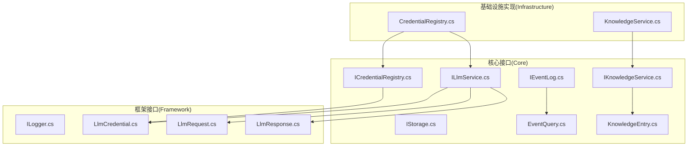
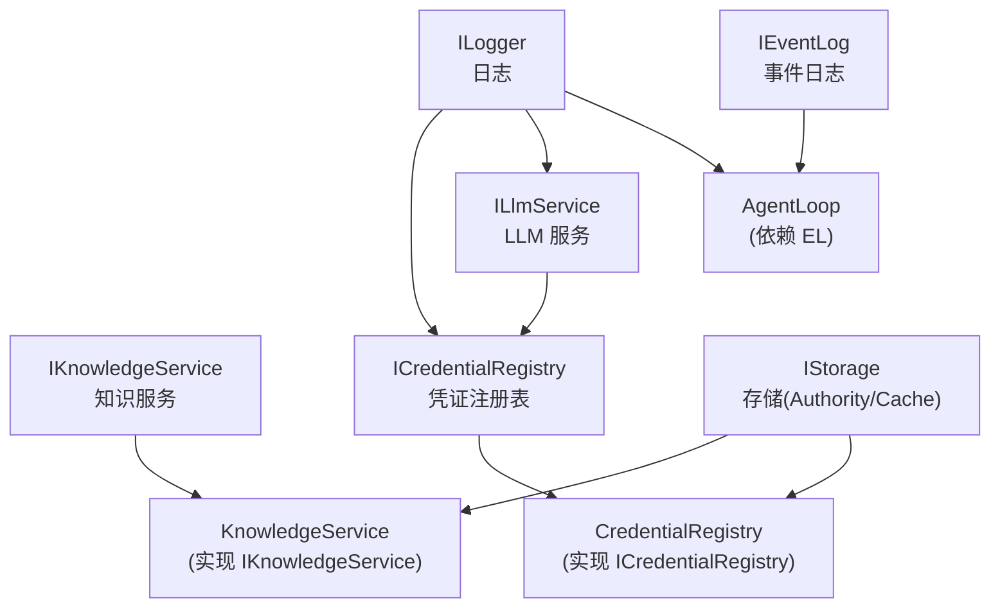
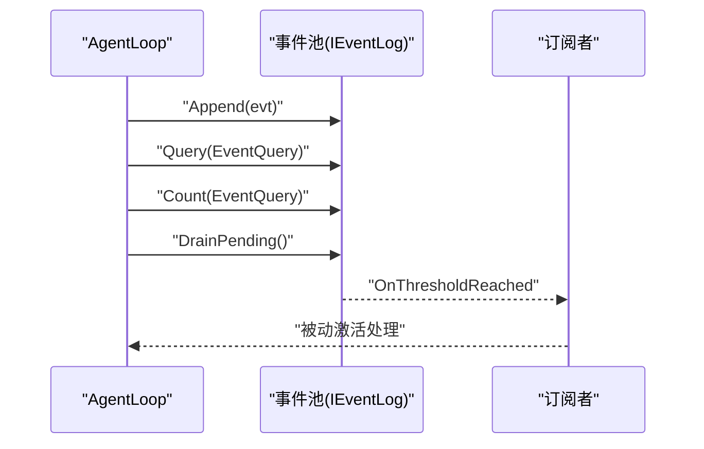
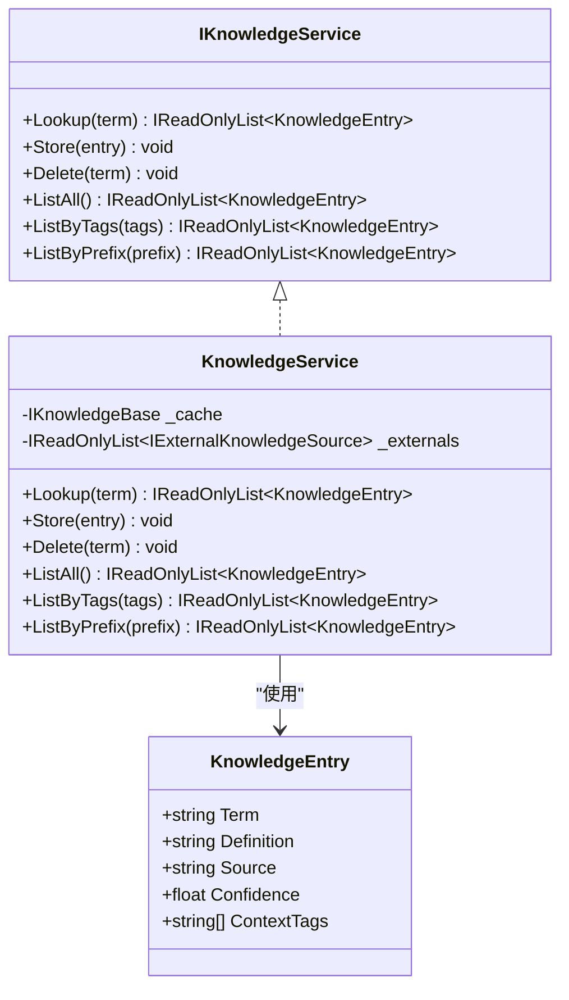
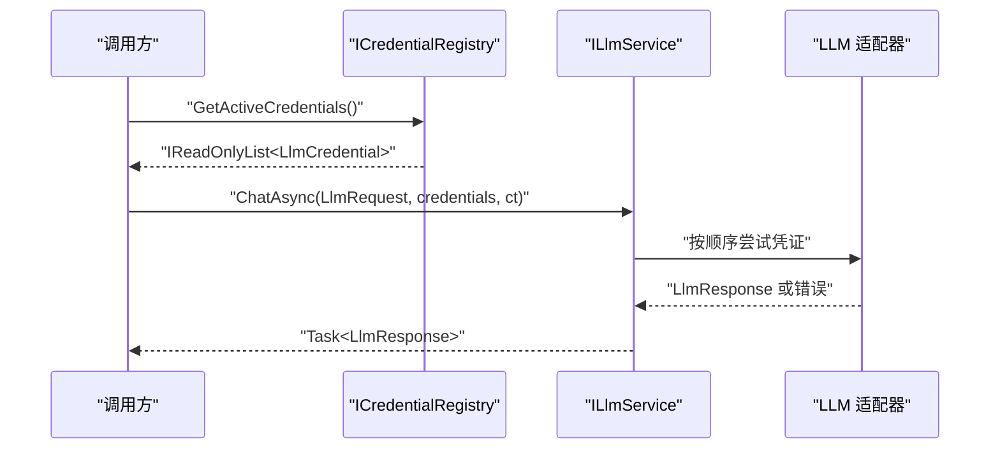
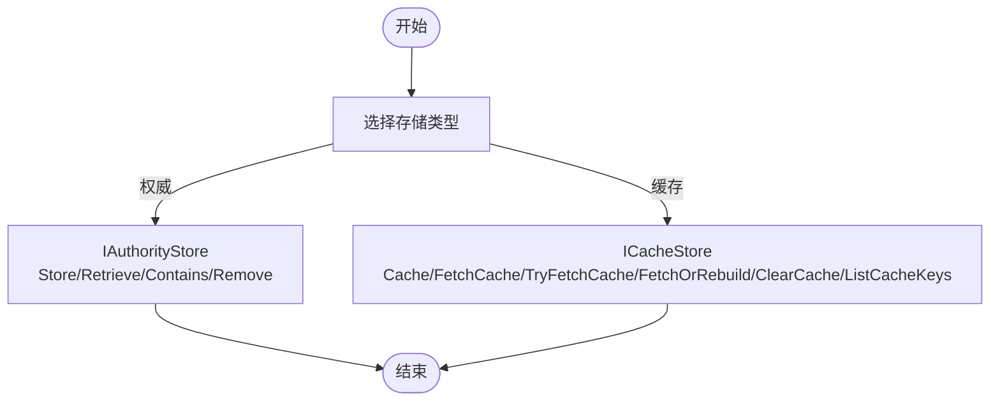
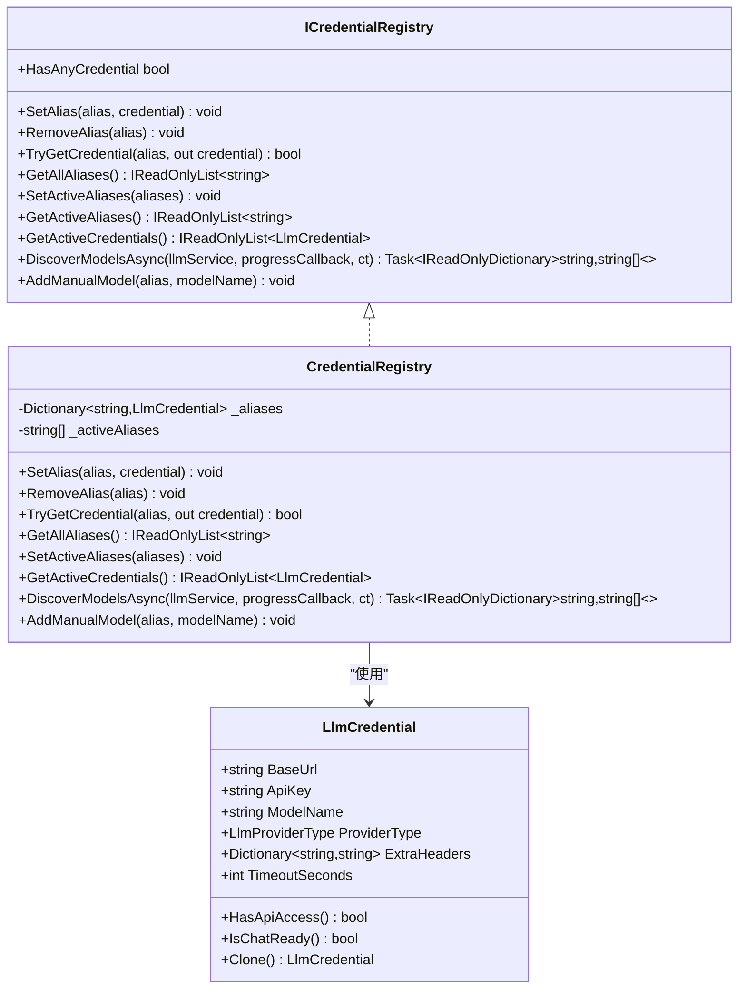
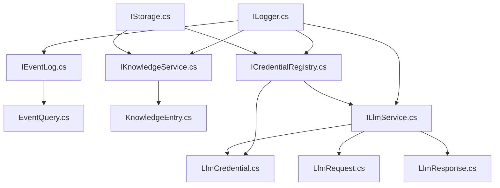

# 核心接口

<cite>
**本文引用的文件**
- [IEventLog.cs](file://src/NPCLife/Core/IEventLog.cs)
- [IKnowledgeService.cs](file://src/NPCLife/Core/IKnowledgeService.cs)
- [ILlmService.cs](file://src/NPCLife/Core/ILlmService.cs)
- [IStorage.cs](file://src/NPCLife/Core/IStorage.cs)
- [ILogger.cs](file://src/NPCLife/Framework/ILogger.cs)
- [ICredentialRegistry.cs](file://src/NPCLife/Core/ICredentialRegistry.cs)
- [KnowledgeEntry.cs](file://src/NPCLife/Core/KnowledgeEntry.cs)
- [EventQuery.cs](file://src/NPCLife/Core/EventQuery.cs)
- [LlmCredential.cs](file://src/NPCLife/Framework/Llm/LlmCredential.cs)
- [LlmRequest.cs](file://src/NPCLife/Framework/Llm/LlmRequest.cs)
- [LlmResponse.cs](file://src/NPCLife/Framework/Llm/LlmResponse.cs)
- [CredentialRegistry.cs](file://src/NPCLife/Infrastructure/Llm/CredentialRegistry.cs)
- [KnowledgeService.cs](file://src/NPCLife/Core/KnowledgeService.cs)
</cite>

## 目录
1. [简介](#简介)
2. [项目结构](#项目结构)
3. [核心组件](#核心组件)
4. [架构概览](#架构概览)
5. [详细组件分析](#详细组件分析)
6. [依赖分析](#依赖分析)
7. [性能考虑](#性能考虑)
8. [故障排查指南](#故障排查指南)
9. [结论](#结论)
10. [附录](#附录)

## 简介
本文件系统化梳理 NPCLife 框架的核心接口设计，聚焦以下接口：
- IEventLog：事件日志抽象，支持追加、查询、计数、最近事件、按 ID 查找、累计计数、pending 池阈值激活与事件提取
- IKnowledgeService：知识服务抽象，支持词条检索、存储/覆盖、删除、全量列举、按标签/前缀列举
- ILlmService：大语言模型服务统一异步契约，支持多凭证回退、连通性测试、模型列表查询
- IStorage：权威存档存储与缓存存储抽象
- ILogger：统一日志接口
- ICredentialRegistry：凭证注册表，管理“模型代号 → API 凭证三元组”映射，支持别名、激活顺序、模型发现与持久化

文档将给出各接口的方法签名、参数定义、返回值类型、异常处理机制、使用示例路径与最佳实践，并解释接口间的依赖关系与组合使用模式。

## 项目结构
核心接口位于 Core 与 Framework 子目录，数据传输对象（DTO）位于 Core 与 Framework.Llm 子目录；基础设施实现位于 Infrastructure 子目录。

图表来源
- [IEventLog.cs:1-52](file://src/NPCLife/Core/IEventLog.cs#L1-L52)
- [IKnowledgeService.cs:1-36](file://src/NPCLife/Core/IKnowledgeService.cs#L1-L36)
- [ILlmService.cs:1-51](file://src/NPCLife/Core/ILlmService.cs#L1-L51)
- [IStorage.cs:1-53](file://src/NPCLife/Core/IStorage.cs#L1-L53)
- [ILogger.cs:1-20](file://src/NPCLife/Framework/ILogger.cs#L1-L20)
- [ICredentialRegistry.cs:1-102](file://src/NPCLife/Core/ICredentialRegistry.cs#L1-L102)
- [EventQuery.cs:1-48](file://src/NPCLife/Core/EventQuery.cs#L1-L48)
- [KnowledgeEntry.cs:1-27](file://src/NPCLife/Core/KnowledgeEntry.cs#L1-L27)
- [LlmCredential.cs:1-84](file://src/NPCLife/Framework/Llm/LlmCredential.cs#L1-L84)
- [LlmRequest.cs:1-46](file://src/NPCLife/Framework/Llm/LlmRequest.cs#L1-L46)
- [LlmResponse.cs:1-58](file://src/NPCLife/Framework/Llm/LlmResponse.cs#L1-L58)
- [CredentialRegistry.cs:1-327](file://src/NPCLife/Infrastructure/Llm/CredentialRegistry.cs#L1-L327)
- [KnowledgeService.cs:1-66](file://src/NPCLife/Core/KnowledgeService.cs#L1-L66)

章节来源
- [IEventLog.cs:1-52](file://src/NPCLife/Core/IEventLog.cs#L1-L52)
- [IKnowledgeService.cs:1-36](file://src/NPCLife/Core/IKnowledgeService.cs#L1-L36)
- [ILlmService.cs:1-51](file://src/NPCLife/Core/ILlmService.cs#L1-L51)
- [IStorage.cs:1-53](file://src/NPCLife/Core/IStorage.cs#L1-L53)
- [ILogger.cs:1-20](file://src/NPCLife/Framework/ILogger.cs#L1-L20)
- [ICredentialRegistry.cs:1-102](file://src/NPCLife/Core/ICredentialRegistry.cs#L1-L102)
- [EventQuery.cs:1-48](file://src/NPCLife/Core/EventQuery.cs#L1-L48)
- [KnowledgeEntry.cs:1-27](file://src/NPCLife/Core/KnowledgeEntry.cs#L1-L27)
- [LlmCredential.cs:1-84](file://src/NPCLife/Framework/Llm/LlmCredential.cs#L1-L84)
- [LlmRequest.cs:1-46](file://src/NPCLife/Framework/Llm/LlmRequest.cs#L1-L46)
- [LlmResponse.cs:1-58](file://src/NPCLife/Framework/Llm/LlmResponse.cs#L1-L58)
- [CredentialRegistry.cs:1-327](file://src/NPCLife/Infrastructure/Llm/CredentialRegistry.cs#L1-L327)
- [KnowledgeService.cs:1-66](file://src/NPCLife/Core/KnowledgeService.cs#L1-L66)

## 核心组件
本节对六大核心接口进行逐项说明，包括职责、方法签名、参数、返回值、异常处理与使用建议。

- IEventLog（事件日志）
  - 职责：提供事件追加、条件查询（支持分页）、计数、最近事件、按 ID 查找、累计计数；具备 pending 缓冲区阈值激活与 DrainPending 取出能力；通过 OnThresholdReached 事件驱动订阅者（如 AgentLoop）被动激活。
  - 方法与属性要点
    - Append(evt)：追加事件
    - Query(query)：按 EventQuery 查询，返回只读列表
    - Count(query)：返回满足条件的总数（不受 Limit 限制）
    - Latest：最近事件，无事件时返回 null
    - GetById(eventId)：按事件 ID 查 recent 缓冲区
    - TotalAppended：累计追加事件总数
    - PendingCount、TotalImportance：pending 缓冲区统计
    - DrainPending()：取出并清空 pending 事件，返回只读列表
    - OnThresholdReached：阈值触发事件
  - 异常处理：接口声明未抛出异常；实现应确保线程安全与边界条件处理（如空查询、越界分页）。
  - 使用示例路径
    - [IEventLog.cs:16-49](file://src/NPCLife/Core/IEventLog.cs#L16-L49)
    - [EventQuery.cs:9-46](file://src/NPCLife/Core/EventQuery.cs#L9-L46)

- IKnowledgeService（知识服务）
  - 职责：统一知识检索与管理入口，屏蔽底层知识源组织与存储方式差异；默认实现 KnowledgeService 聚合 IKnowledgeBase 与 IExternalKnowledgeSource[]。
  - 方法与属性要点
    - Lookup(term)：返回所有来源的命中结果列表（可能为空）
    - Store(entry)：存储/覆盖知识条目
    - Delete(term)：删除指定词条（不存在时静默）
    - ListAll()：列出全部词条
    - ListByTags(tags)：按语义标签筛选词条（命中任一标签即匹配）
    - ListByPrefix(prefix)：按前缀列举词条
  - 异常处理：Lookup 对空 term 返回空列表；其他操作遵循实现约定。
  - 使用示例路径
    - [IKnowledgeService.cs:12-34](file://src/NPCLife/Core/IKnowledgeService.cs#L12-L34)
    - [KnowledgeEntry.cs:9-25](file://src/NPCLife/Core/KnowledgeEntry.cs#L9-L25)
    - [KnowledgeService.cs:28-63](file://src/NPCLife/Core/KnowledgeService.cs#L28-L63)

- ILlmService（大语言模型服务）
  - 职责：统一异步聊天接口，完全无状态，显式凭证参数；内部按顺序尝试凭证回退；所有方法在工作线程执行 HTTP 调用，Task 完成时通过 MainThreadDispatcher 回主线程。
  - 方法与属性要点
    - ChatAsync(request, credentials, ct)：按 credentials 顺序尝试，全部失败返回最后一个错误
    - TestConnectionAsync(credential, ct)：测试单个凭证连通性
    - ListModelsAsync(credential, ct)：列出可用模型，部分 API 不支持时返回空数组
  - 异常处理：按顺序尝试凭证，失败自动切换；全部失败返回错误；取消令牌支持取消。
  - 使用示例路径
    - [ILlmService.cs:28-48](file://src/NPCLife/Core/ILlmService.cs#L28-L48)
    - [LlmRequest.cs:9-44](file://src/NPCLife/Framework/Llm/LlmRequest.cs#L9-L44)
    - [LlmCredential.cs:12-76](file://src/NPCLife/Framework/Llm/LlmCredential.cs#L12-L76)
    - [LlmResponse.cs:9-55](file://src/NPCLife/Framework/Llm/LlmResponse.cs#L9-L55)

- IStorage（存储）
  - 职责：区分权威存档存储与缓存存储两类抽象
  - 权威存储 IAuthorityStore
    - Store(key, value)、Retrieve(key, fallback)、Contains(key)、Remove(key)
  - 缓存存储 ICacheStore
    - Cache(key, value)、FetchCache(key, fallback)、TryFetchCache(key, out value)、FetchOrRebuild(key, factory)、ClearCache(key)、ListCacheKeys()
  - 异常处理：权威存储缺失视为异常；缓存缺失属正常情况，返回 fallback。
  - 使用示例路径
    - [IStorage.cs:10-51](file://src/NPCLife/Core/IStorage.cs#L10-L51)

- ILogger（日志）
  - 职责：统一日志接口，零外部依赖；由宿主注入具体实现
  - 方法与属性要点
    - Message(msg)、Warning(msg)、Error(msg)
  - 使用示例路径
    - [ILogger.cs:8-18](file://src/NPCLife/Framework/ILogger.cs#L8-L18)

- ICredentialRegistry（凭证注册表）
  - 职责：管理“模型代号 → API 凭证三元组”映射；支持别名管理、激活顺序（fallback 链路）、模型发现、持久化
  - 方法与属性要点
    - 别名管理：SetAlias(alias, credential)、RemoveAlias(alias)、TryGetCredential(alias, out credential)、GetAllAliases()、HasAnyCredential
    - 激活顺序：SetActiveAliases(aliases)、GetActiveAliases()、GetActiveCredentials()
    - 模型发现：DiscoverModelsAsync(llmService, progressCallback, ct)、AddManualModel(alias, modelName)
  - 异常处理：参数校验（别名不能为空、凭证不能为 null）；持久化失败不应影响运行时。
  - 使用示例路径
    - [ICredentialRegistry.cs:20-100](file://src/NPCLife/Core/ICredentialRegistry.cs#L20-L100)
    - [CredentialRegistry.cs:58-226](file://src/NPCLife/Infrastructure/Llm/CredentialRegistry.cs#L58-L226)
    - [LlmCredential.cs:12-76](file://src/NPCLife/Framework/Llm/LlmCredential.cs#L12-L76)

章节来源
- [IEventLog.cs:12-50](file://src/NPCLife/Core/IEventLog.cs#L12-L50)
- [IKnowledgeService.cs:12-34](file://src/NPCLife/Core/IKnowledgeService.cs#L12-L34)
- [ILlmService.cs:17-49](file://src/NPCLife/Core/ILlmService.cs#L17-L49)
- [IStorage.cs:10-51](file://src/NPCLife/Core/IStorage.cs#L10-L51)
- [ILogger.cs:8-18](file://src/NPCLife/Framework/ILogger.cs#L8-L18)
- [ICredentialRegistry.cs:20-100](file://src/NPCLife/Core/ICredentialRegistry.cs#L20-L100)
- [EventQuery.cs:9-46](file://src/NPCLife/Core/EventQuery.cs#L9-L46)
- [KnowledgeEntry.cs:9-25](file://src/NPCLife/Core/KnowledgeEntry.cs#L9-L25)
- [LlmCredential.cs:12-76](file://src/NPCLife/Framework/Llm/LlmCredential.cs#L12-L76)
- [LlmRequest.cs:9-44](file://src/NPCLife/Framework/Llm/LlmRequest.cs#L9-L44)
- [LlmResponse.cs:9-55](file://src/NPCLife/Framework/Llm/LlmResponse.cs#L9-L55)
- [CredentialRegistry.cs:58-226](file://src/NPCLife/Infrastructure/Llm/CredentialRegistry.cs#L58-L226)
- [KnowledgeService.cs:28-63](file://src/NPCLife/Core/KnowledgeService.cs#L28-L63)

## 架构概览
核心接口围绕“事件驱动 + 知识检索 + LLM 能力 + 凭证管理 + 存储 + 日志”的闭环展开。事件日志驱动 AgentLoop 状态机；知识服务为 Agent 提供上下文；LLM 服务通过凭证注册表进行多凭证回退；存储与日志贯穿运行期与持久化。

图表来源
- [IEventLog.cs:12-50](file://src/NPCLife/Core/IEventLog.cs#L12-L50)
- [IKnowledgeService.cs:12-34](file://src/NPCLife/Core/IKnowledgeService.cs#L12-L34)
- [ILlmService.cs:17-49](file://src/NPCLife/Core/ILlmService.cs#L17-L49)
- [ICredentialRegistry.cs:20-100](file://src/NPCLife/Core/ICredentialRegistry.cs#L20-L100)
- [IStorage.cs:10-51](file://src/NPCLife/Core/IStorage.cs#L10-L51)
- [ILogger.cs:8-18](file://src/NPCLife/Framework/ILogger.cs#L8-L18)
- [CredentialRegistry.cs:20-52](file://src/NPCLife/Infrastructure/Llm/CredentialRegistry.cs#L20-L52)
- [KnowledgeService.cs:13-22](file://src/NPCLife/Core/KnowledgeService.cs#L13-L22)

## 详细组件分析

### IEventLog（事件日志）分析
- 设计要点
  - append-only 写入与按条件查询分离，支持分页
  - pending 缓冲区阈值激活语义，降低轮询开销
  - 事件 ID 快速定位，便于路由工具使用
- 数据结构与复杂度
  - Query/Count/DrainPending 等操作复杂度取决于实现与索引策略
- 错误处理
  - 空查询、越界分页等边界条件应在实现中妥善处理
- 最佳实践
  - 将高成本查询封装为后台任务，避免阻塞主线程
  - 使用 OnThresholdReached 事件驱动增量处理

图表来源
- [IEventLog.cs:16-49](file://src/NPCLife/Core/IEventLog.cs#L16-L49)
- [EventQuery.cs:9-46](file://src/NPCLife/Core/EventQuery.cs#L9-L46)

章节来源
- [IEventLog.cs:12-50](file://src/NPCLife/Core/IEventLog.cs#L12-L50)
- [EventQuery.cs:9-46](file://src/NPCLife/Core/EventQuery.cs#L9-L46)

### IKnowledgeService（知识服务）分析
- 设计要点
  - Lookup 并行查询内部缓存与外部只读源，合并同名词条释义
  - Store/Delete/List* 代理到 IKnowledgeBase，保持一致性
- 数据结构与复杂度
  - Lookup 在内部缓存命中后并行查询外部源，整体复杂度取决于外部源数量
- 错误处理
  - Lookup 对空 term 返回空列表；外部源返回 null 或空集合时静默处理
- 最佳实践
  - 将高频词条写入 IKnowledgeBase，减少外部源访问
  - 使用 ListByTags 与 ListByPrefix 进行领域化检索

图表来源
- [IKnowledgeService.cs:12-34](file://src/NPCLife/Core/IKnowledgeService.cs#L12-L34)
- [KnowledgeService.cs:13-64](file://src/NPCLife/Core/KnowledgeService.cs#L13-L64)
- [KnowledgeEntry.cs:9-25](file://src/NPCLife/Core/KnowledgeEntry.cs#L9-L25)

章节来源
- [IKnowledgeService.cs:12-34](file://src/NPCLife/Core/IKnowledgeService.cs#L12-L34)
- [KnowledgeService.cs:13-64](file://src/NPCLife/Core/KnowledgeService.cs#L13-L64)
- [KnowledgeEntry.cs:9-25](file://src/NPCLife/Core/KnowledgeEntry.cs#L9-L25)

### ILlmService（大语言模型服务）分析
- 设计要点
  - 完全无状态，显式凭证参数；内部按顺序尝试凭证回退
  - ChatAsync 支持多凭证回退，全部失败返回最后一个错误
  - 所有方法在工作线程执行 HTTP 调用，Task 完成时回主线程
- 数据结构与复杂度
  - ChatAsync 的复杂度取决于网络与模型响应时间
- 错误处理
  - 按顺序尝试凭证，失败自动切换；取消令牌支持取消
- 最佳实践
  - 为不同用途配置不同凭证（如 fast、primary），通过 ICredentialRegistry 管理激活顺序

图表来源
- [ILlmService.cs:28-48](file://src/NPCLife/Core/ILlmService.cs#L28-L48)
- [ICredentialRegistry.cs:74-74](file://src/NPCLife/Core/ICredentialRegistry.cs#L74-L74)
- [LlmCredential.cs:12-76](file://src/NPCLife/Framework/Llm/LlmCredential.cs#L12-L76)
- [LlmRequest.cs:9-44](file://src/NPCLife/Framework/Llm/LlmRequest.cs#L9-L44)
- [LlmResponse.cs:9-55](file://src/NPCLife/Framework/Llm/LlmResponse.cs#L9-L55)

章节来源
- [ILlmService.cs:17-49](file://src/NPCLife/Core/ILlmService.cs#L17-L49)
- [ICredentialRegistry.cs:74-74](file://src/NPCLife/Core/ICredentialRegistry.cs#L74-L74)
- [LlmCredential.cs:12-76](file://src/NPCLife/Framework/Llm/LlmCredential.cs#L12-L76)
- [LlmRequest.cs:9-44](file://src/NPCLife/Framework/Llm/LlmRequest.cs#L9-L44)
- [LlmResponse.cs:9-55](file://src/NPCLife/Framework/Llm/LlmResponse.cs#L9-L55)

### IStorage（存储）分析
- 设计要点
  - 权威存储：数据不可丢失，缺失视为异常
  - 缓存存储：数据可再生，缺失属正常情况
- 最佳实践
  - 权威存储用于关键配置与存档；缓存存储用于临时数据与加速访问

图表来源
- [IStorage.cs:10-51](file://src/NPCLife/Core/IStorage.cs#L10-L51)

章节来源
- [IStorage.cs:10-51](file://src/NPCLife/Core/IStorage.cs#L10-L51)

### ILogger（日志）分析
- 设计要点
  - 统一日志接口，零外部依赖；由宿主注入具体实现
- 最佳实践
  - 在关键流程（事件处理、知识检索、LLM 调用、凭证切换）记录 Message/Warning/Error

章节来源
- [ILogger.cs:8-18](file://src/NPCLife/Framework/ILogger.cs#L8-L18)

### ICredentialRegistry（凭证注册表）分析
- 设计要点
  - 管理“模型代号 → 凭证三元组”映射；支持别名、激活顺序、模型发现、持久化
  - DiscoverModelsAsync 异步发现模型，AddManualModel 支持不支持列表查询的 API
- 实现细节
  - CredentialRegistry 通过锁保护内部状态，序列化/反序列化持久化
  - GetActiveCredentials 过滤无效代号，返回可用凭证列表
- 最佳实践
  - 为不同用途设置别名（如 primary、fast、claude），通过 SetActiveAliases 控制回退链路
  - 使用 DiscoverModelsAsync 自动发现模型，必要时 AddManualModel 补充

图表来源
- [ICredentialRegistry.cs:20-100](file://src/NPCLife/Core/ICredentialRegistry.cs#L20-L100)
- [CredentialRegistry.cs:20-327](file://src/NPCLife/Infrastructure/Llm/CredentialRegistry.cs#L20-L327)
- [LlmCredential.cs:12-76](file://src/NPCLife/Framework/Llm/LlmCredential.cs#L12-L76)

章节来源
- [ICredentialRegistry.cs:20-100](file://src/NPCLife/Core/ICredentialRegistry.cs#L20-L100)
- [CredentialRegistry.cs:20-327](file://src/NPCLife/Infrastructure/Llm/CredentialRegistry.cs#L20-L327)
- [LlmCredential.cs:12-76](file://src/NPCLife/Framework/Llm/LlmCredential.cs#L12-L76)

## 依赖分析
- IEventLog 与 EventQuery：查询参数对象，支持多维筛选与分页
- IKnowledgeService 与 KnowledgeEntry：知识条目 DTO，Term 为主键索引
- ILlmService 与 LlmRequest/LlmCredential/LlmResponse：统一请求/凭证/响应格式
- ICredentialRegistry 与 ILlmService：凭证注册表通过 ILlmService 进行模型发现与连通性测试
- IStorage：为凭证注册表与知识服务提供持久化能力
- ILogger：贯穿各组件的日志输出

图表来源
- [EventQuery.cs:9-46](file://src/NPCLife/Core/EventQuery.cs#L9-L46)
- [KnowledgeEntry.cs:9-25](file://src/NPCLife/Core/KnowledgeEntry.cs#L9-L25)
- [LlmRequest.cs:9-44](file://src/NPCLife/Framework/Llm/LlmRequest.cs#L9-L44)
- [LlmCredential.cs:12-76](file://src/NPCLife/Framework/Llm/LlmCredential.cs#L12-L76)
- [LlmResponse.cs:9-55](file://src/NPCLife/Framework/Llm/LlmResponse.cs#L9-L55)
- [IEventLog.cs:12-50](file://src/NPCLife/Core/IEventLog.cs#L12-L50)
- [IKnowledgeService.cs:12-34](file://src/NPCLife/Core/IKnowledgeService.cs#L12-L34)
- [ILlmService.cs:17-49](file://src/NPCLife/Core/ILlmService.cs#L17-L49)
- [ICredentialRegistry.cs:20-100](file://src/NPCLife/Core/ICredentialRegistry.cs#L20-L100)
- [IStorage.cs:10-51](file://src/NPCLife/Core/IStorage.cs#L10-L51)
- [ILogger.cs:8-18](file://src/NPCLife/Framework/ILogger.cs#L8-L18)

章节来源
- [EventQuery.cs:9-46](file://src/NPCLife/Core/EventQuery.cs#L9-L46)
- [KnowledgeEntry.cs:9-25](file://src/NPCLife/Core/KnowledgeEntry.cs#L9-L25)
- [LlmRequest.cs:9-44](file://src/NPCLife/Framework/Llm/LlmRequest.cs#L9-L44)
- [LlmCredential.cs:12-76](file://src/NPCLife/Framework/Llm/LlmCredential.cs#L12-L76)
- [LlmResponse.cs:9-55](file://src/NPCLife/Framework/Llm/LlmResponse.cs#L9-L55)
- [IEventLog.cs:12-50](file://src/NPCLife/Core/IEventLog.cs#L12-L50)
- [IKnowledgeService.cs:12-34](file://src/NPCLife/Core/IKnowledgeService.cs#L12-L34)
- [ILlmService.cs:17-49](file://src/NPCLife/Core/ILlmService.cs#L17-L49)
- [ICredentialRegistry.cs:20-100](file://src/NPCLife/Core/ICredentialRegistry.cs#L20-L100)
- [IStorage.cs:10-51](file://src/NPCLife/Core/IStorage.cs#L10-L51)
- [ILogger.cs:8-18](file://src/NPCLife/Framework/ILogger.cs#L8-L18)

## 性能考虑
- IEventLog：利用 pending 缓冲区阈值激活减少轮询；查询与计数应配合索引与分页参数优化
- IKnowledgeService：Lookup 并行查询外部源，建议将热点词条写入 IKnowledgeBase；合理使用 ListByTags 与 ListByPrefix
- ILlmService：凭证回退在工作线程执行，注意网络延迟与超时设置；批量调用时复用连接
- ICredentialRegistry：持久化采用异步与锁保护，避免频繁写入；模型发现按需触发
- IStorage：权威存储与缓存存储分离，避免阻塞；缓存读取推荐使用 FetchOrRebuild

## 故障排查指南
- IEventLog
  - 现象：查询结果为空或计数异常
  - 排查：确认 EventQuery 参数（TagsAny/TagsAll/时间范围/Limit/Offset）；检查 Latest/PendingCount/TotalImportance
- IKnowledgeService
  - 现象：Lookup 返回空列表
  - 排查：确认 term 大小写不敏感；检查 IKnowledgeBase 与 IExternalKnowledgeSource 配置
- ILlmService
  - 现象：ChatAsync 抛错或返回错误响应
  - 排查：验证 LlmCredential.IsChatReady；检查凭证顺序与网络连通性；使用 TestConnectionAsync 测试
- ICredentialRegistry
  - 现象：GetActiveCredentials 返回空列表
  - 排查：确认代号存在且凭证 HasApiAccess/IsChatReady；检查持久化状态是否正确加载
- IStorage
  - 现象：Retrieve/FetchCache 返回 fallback
  - 排查：确认 key 正确；缓存缺失属正常情况，使用 FetchOrRebuild 重建
- ILogger
  - 现象：日志缺失
  - 排查：确认宿主已注入具体实现；在关键流程记录日志

章节来源
- [IEventLog.cs:16-49](file://src/NPCLife/Core/IEventLog.cs#L16-L49)
- [IKnowledgeService.cs:18-24](file://src/NPCLife/Core/IKnowledgeService.cs#L18-L24)
- [ILlmService.cs:28-48](file://src/NPCLife/Core/ILlmService.cs#L28-L48)
- [ICredentialRegistry.cs:139-153](file://src/NPCLife/Core/ICredentialRegistry.cs#L139-L153)
- [IStorage.cs:15-38](file://src/NPCLife/Core/IStorage.cs#L15-L38)
- [ILogger.cs:10-17](file://src/NPCLife/Framework/ILogger.cs#L10-L17)

## 结论
NPCLife 的核心接口以“事件驱动 + 知识检索 + LLM 能力 + 凭证管理 + 存储 + 日志”为核心闭环，强调无状态、可组合与可扩展。通过 IEventLog 与 AgentLoop 的解耦、IKnowledgeService 的统一检索、ILlmService 的凭证回退、ICredentialRegistry 的灵活管理、IStorage 的权威与缓存分离，以及 ILogger 的统一输出，形成清晰的架构层次与良好的扩展性。建议在实际应用中遵循参数校验、异步处理、缓存策略与持久化容错的最佳实践。

## 附录
- 使用示例路径（仅提供路径，不展示具体代码）
  - IEventLog
    - [IEventLog.cs:16-49](file://src/NPCLife/Core/IEventLog.cs#L16-L49)
    - [EventQuery.cs:9-46](file://src/NPCLife/Core/EventQuery.cs#L9-L46)
  - IKnowledgeService
    - [IKnowledgeService.cs:18-34](file://src/NPCLife/Core/IKnowledgeService.cs#L18-L34)
    - [KnowledgeEntry.cs:9-25](file://src/NPCLife/Core/KnowledgeEntry.cs#L9-L25)
    - [KnowledgeService.cs:28-63](file://src/NPCLife/Core/KnowledgeService.cs#L28-L63)
  - ILlmService
    - [ILlmService.cs:28-48](file://src/NPCLife/Core/ILlmService.cs#L28-L48)
    - [LlmRequest.cs:36-43](file://src/NPCLife/Framework/Llm/LlmRequest.cs#L36-L43)
    - [LlmCredential.cs:36-48](file://src/NPCLife/Framework/Llm/LlmCredential.cs#L36-L48)
    - [LlmResponse.cs:48-55](file://src/NPCLife/Framework/Llm/LlmResponse.cs#L48-L55)
  - IStorage
    - [IStorage.cs:13-19](file://src/NPCLife/Core/IStorage.cs#L13-L19)
    - [IStorage.cs:32-38](file://src/NPCLife/Core/IStorage.cs#L32-L38)
  - ILogger
    - [ILogger.cs:11-17](file://src/NPCLife/Framework/ILogger.cs#L11-L17)
  - ICredentialRegistry
    - [ICredentialRegistry.cs:58-74](file://src/NPCLife/Core/ICredentialRegistry.cs#L58-L74)
    - [CredentialRegistry.cs:159-209](file://src/NPCLife/Infrastructure/Llm/CredentialRegistry.cs#L159-L209)