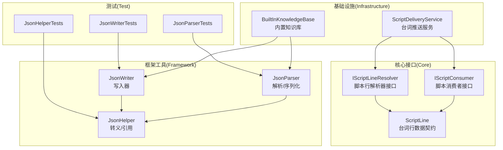
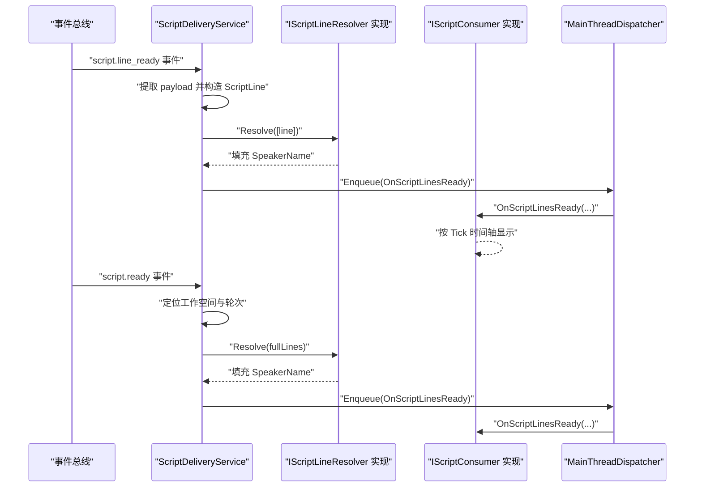
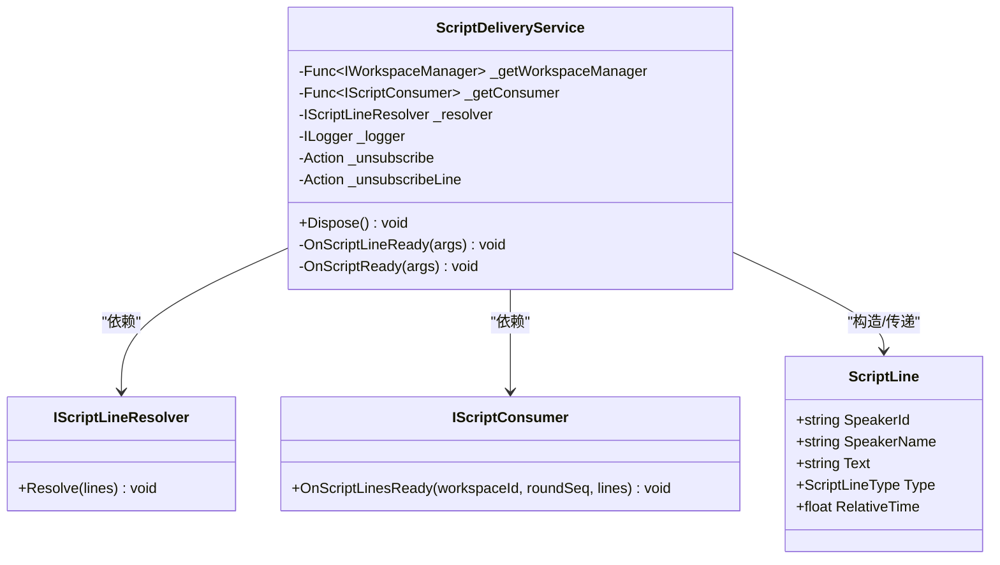
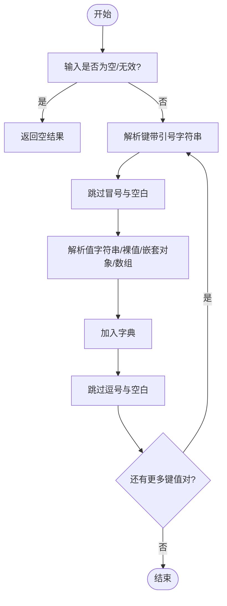
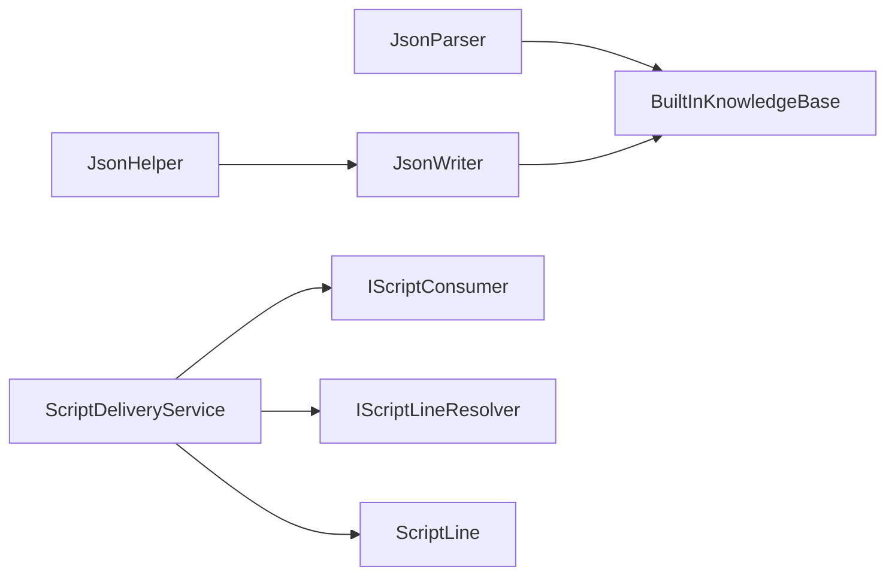

# 框架接口

<cite>
**本文档引用的文件**
- [IScriptConsumer.cs](file://src/NPCLife/Core/IScriptConsumer.cs)
- [IScriptLineResolver.cs](file://src/NPCLife/Core/IScriptLineResolver.cs)
- [ScriptLine.cs](file://src/NPCLife/Framework/Script/ScriptLine.cs)
- [JsonHelper.cs](file://src/NPCLife/Framework/JsonHelper.cs)
- [JsonParser.cs](file://src/NPCLife/Framework/JsonParser.cs)
- [JsonWriter.cs](file://src/NPCLife/Framework/JsonWriter.cs)
- [ScriptDeliveryService.cs](file://src/NPCLife/Infrastructure/ScriptDeliveryService.cs)
- [BuiltInKnowledgeBase.cs](file://src/NPCLife/Infrastructure/Knowledge/BuiltInKnowledgeBase.cs)
- [JsonHelperTests.cs](file://tests/NPCLife.Tests/Framework/JsonHelperTests.cs)
- [JsonParserTests.cs](file://tests/NPCLife.Tests/Framework/JsonParserTests.cs)
- [JsonWriterTests.cs](file://tests/NPCLife.Tests/Framework/JsonWriterTests.cs)
</cite>

## 目录
1. [简介](#简介)
2. [项目结构](#项目结构)
3. [核心组件](#核心组件)
4. [架构总览](#架构总览)
5. [详细组件分析](#详细组件分析)
6. [依赖关系分析](#依赖关系分析)
7. [性能考量](#性能考量)
8. [故障排查指南](#故障排查指南)
9. [结论](#结论)
10. [附录](#附录)

## 简介
本文件面向 NPCLife 框架的基础设施接口与工具类，系统性梳理以下能力：
- 接口层：IScriptConsumer（脚本消费者）、IScriptLineResolver（脚本行解析器）
- 数据契约：ScriptLine（台词行数据结构）
- 工具类：JsonHelper（JSON 转义与引用）、JsonParser（轻量 JSON 解析/序列化）、JsonWriter（轻量 JSON 写入器）

目标是帮助开发者快速理解这些接口与工具的职责、方法签名、参数规范、使用场景、错误处理策略、性能优化建议以及扩展与自定义指导。

## 项目结构
围绕“接口 + 工具 + 使用示例”的组织方式：
- Core：定义领域接口与数据契约
- Framework：提供 JSON 转义、解析、写入等轻量工具
- Infrastructure：具体实现与集成示例（如 ScriptDeliveryService、BuiltInKnowledgeBase）
- Tests：针对工具类的单元测试，验证行为与边界

图表来源
- [IScriptConsumer.cs:10-21](file://src/NPCLife/Core/IScriptConsumer.cs#L10-L21)
- [IScriptLineResolver.cs:11-17](file://src/NPCLife/Core/IScriptLineResolver.cs#L11-L17)
- [ScriptLine.cs:25-41](file://src/NPCLife/Framework/Script/ScriptLine.cs#L25-L41)
- [JsonHelper.cs:8-51](file://src/NPCLife/Framework/JsonHelper.cs#L8-L51)
- [JsonParser.cs:13-266](file://src/NPCLife/Framework/JsonParser.cs#L13-L266)
- [JsonWriter.cs:11-134](file://src/NPCLife/Framework/JsonWriter.cs#L11-L134)
- [ScriptDeliveryService.cs:19-223](file://src/NPCLife/Infrastructure/ScriptDeliveryService.cs#L19-L223)
- [BuiltInKnowledgeBase.cs:13-205](file://src/NPCLife/Infrastructure/Knowledge/BuiltInKnowledgeBase.cs#L13-L205)

章节来源
- [IScriptConsumer.cs:10-21](file://src/NPCLife/Core/IScriptConsumer.cs#L10-L21)
- [IScriptLineResolver.cs:11-17](file://src/NPCLife/Core/IScriptLineResolver.cs#L11-L17)
- [ScriptLine.cs:25-41](file://src/NPCLife/Framework/Script/ScriptLine.cs#L25-L41)
- [JsonHelper.cs:8-51](file://src/NPCLife/Framework/JsonHelper.cs#L8-L51)
- [JsonParser.cs:13-266](file://src/NPCLife/Framework/JsonParser.cs#L13-L266)
- [JsonWriter.cs:11-134](file://src/NPCLife/Framework/JsonWriter.cs#L11-L134)

## 核心组件
本节聚焦接口与工具类的职责、方法定义、参数规范与典型使用场景。

- IScriptConsumer（脚本消费者接口）
  - 职责：接收框架推送的已解析台词行，负责基于 Tick 的时间轴进行展示调度
  - 方法定义与参数
    - OnScriptLinesReady(workspaceId, roundSeq, lines)
      - 参数
        - workspaceId：来源工作空间 ID（字符串）
        - roundSeq：本轮在工作空间中的序号（整数）
        - lines：已解析并填充 SpeakerName 的 ScriptLine 列表（只读列表）
      - 线程模型：框架在 MainThreadDispatcher 上调用，保证主线程安全
  - 使用场景
    - 游戏侧实现该接口以接收逐行或轮次完成的台词
    - 与 EventBus 的 script.line_ready 与 script.ready 事件配合
  - 章节来源
    - [IScriptConsumer.cs:19-20](file://src/NPCLife/Core/IScriptConsumer.cs#L19-L20)

- IScriptLineResolver（脚本行解析器接口）
  - 职责：批量解析 ScriptLine 中的 SpeakerId，将其解析为显示名并填充到 SpeakerName
  - 方法定义与参数
    - Resolve(lines)
      - 参数：IReadOnlyList<ScriptLine>，遍历所有行并对 SpeakerId 非空的 Dialogue 行查找显示名
  - 使用场景
    - 在推送前统一解析占位符，确保游戏侧展示一致
  - 章节来源
    - [IScriptLineResolver.cs:17](file://src/NPCLife/Core/IScriptLineResolver.cs#L17)

- ScriptLine（台词行数据契约）
  - 字段
    - SpeakerId：说话者的 pawn ThingID（Dialogue 类型必填，其他可为空）
    - SpeakerName：解析后的显示名（由 IScriptLineResolver 填充）
    - Text：台词/描述文本（Pause 类型可为空）
    - Type：ScriptLineType（Dialogue/Narration/Action/Pause）
    - RelativeTime：相对时间戳（秒），从本批台词起点起算
  - 章节来源
    - [ScriptLine.cs:27-40](file://src/NPCLife/Framework/Script/ScriptLine.cs#L27-L40)

- JsonHelper（JSON 转义与引用工具）
  - 方法
    - Escape(s)：按 JSON 标准转义字符串中的特殊字符
    - Quote(s)：将字符串包裹在双引号中并转义内容
  - 特性
    - 零外部依赖，轻量实现
    - 支持控制字符的 Unicode 转义（<32）
  - 章节来源
    - [JsonHelper.cs:13-51](file://src/NPCLife/Framework/JsonHelper.cs#L13-L51)

- JsonParser（轻量 JSON 解析与序列化工具）
  - 解析
    - ParseDict(json)：解析 JSON 对象为字典；字符串值自动反转义；嵌套对象/数组保留为原始 JSON 字符串
    - ParseObjectArray(json)：解析 JSON 对象数组，每个元素通过 ParseDict 解析
    - ParseStringArray(json)：解析 ["a","b",...] 为字符串列表（仅字符串元素）
    - UnescapeJson(s)：按 JSON 标准反转义字符串中的特殊字符
  - 序列化
    - SerializeDict(dict)：将 string→string 字典序列化为 JSON 对象字符串
    - SerializeValue(value)：将常见基础类型序列化为 JSON 值字符串（不支持类型回退 ToString）
    - DeserializeValue<T>(json)：将 JSON 值字符串反序列化为指定基础类型（不支持类型返回 default）
  - 章节来源
    - [JsonParser.cs:23-92](file://src/NPCLife/Framework/JsonParser.cs#L23-L92)
    - [JsonParser.cs:97-125](file://src/NPCLife/Framework/JsonParser.cs#L97-L125)
    - [JsonParser.cs:130-167](file://src/NPCLife/Framework/JsonParser.cs#L130-L167)
    - [JsonParser.cs:173-204](file://src/NPCLife/Framework/JsonParser.cs#L173-L204)
    - [JsonParser.cs:213-239](file://src/NPCLife/Framework/JsonParser.cs#L213-L239)
    - [JsonParser.cs:245-256](file://src/NPCLife/Framework/JsonParser.cs#L245-L256)

- JsonWriter（轻量 JSON 写入器）
  - 结构：struct（最小化内存分配）
  - 方法
    - Prop(name, string/bool/int/long/float/double[, format])：写入字段（字符串自动转义，数值不加引号）
    - PropRaw(name, rawJson)：写入原始 JSON 值（不做转义）
    - Array(name, IEnumerable<string>)：写入字符串数组（元素自动转义）
    - ArrayRaw(name, IEnumerable<string>)：写入原始 JSON 数组元素
    - Close()/ToString()：关闭对象并返回 JSON 字符串
  - 章节来源
    - [JsonWriter.cs:29-128](file://src/NPCLife/Framework/JsonWriter.cs#L29-L128)

## 架构总览
下图展示了接口与工具在系统中的协作关系，以及与基础设施实现的对接：

图表来源
- [ScriptDeliveryService.cs:56-106](file://src/NPCLife/Infrastructure/ScriptDeliveryService.cs#L56-L106)
- [ScriptDeliveryService.cs:112-208](file://src/NPCLife/Infrastructure/ScriptDeliveryService.cs#L112-L208)
- [IScriptConsumer.cs:19-20](file://src/NPCLife/Core/IScriptConsumer.cs#L19-L20)
- [IScriptLineResolver.cs:17](file://src/NPCLife/Core/IScriptLineResolver.cs#L17)

## 详细组件分析

### 接口：IScriptConsumer 与 IScriptLineResolver
- 设计要点
  - 接口分离关注点：解析与消费职责清晰划分
  - 解析前置：在推送前完成占位符解析，降低游戏侧负担
  - 主线程安全：通过 MainThreadDispatcher 保证回调在主线程执行
- 使用流程
  - 事件驱动：监听 EventBus 的 script.line_ready 与 script.ready
  - 构造 ScriptLine：填充 SpeakerId、Text、Type、RelativeTime
  - 解析占位符：调用 Resolve(lines)
  - 投递到消费者：通过 MainThreadDispatcher.Enqueu 调用 OnScriptLinesReady
- 错误处理
  - 事件负载缺失或无效时进行防御性判断与日志告警
  - 消费者异常捕获并记录，避免影响框架流程
- 章节来源
  - [ScriptDeliveryService.cs:56-106](file://src/NPCLife/Infrastructure/ScriptDeliveryService.cs#L56-L106)
  - [ScriptDeliveryService.cs:112-208](file://src/NPCLife/Infrastructure/ScriptDeliveryService.cs#L112-L208)

图表来源
- [IScriptConsumer.cs:19-20](file://src/NPCLife/Core/IScriptConsumer.cs#L19-L20)
- [IScriptLineResolver.cs:17](file://src/NPCLife/Core/IScriptLineResolver.cs#L17)
- [ScriptLine.cs:25-41](file://src/NPCLife/Framework/Script/ScriptLine.cs#L25-L41)
- [ScriptDeliveryService.cs:19-47](file://src/NPCLife/Infrastructure/ScriptDeliveryService.cs#L19-L47)

### 工具类：JsonHelper、JsonParser、JsonWriter
- JsonHelper
  - 用途：为字符串添加 JSON 转义与双引号包裹
  - 典型场景：写入器内部对键名与字符串值进行转义
  - 章节来源
    - [JsonHelper.cs:13-51](file://src/NPCLife/Framework/JsonHelper.cs#L13-L51)

- JsonParser
  - 用途：轻量 JSON 解析与序列化，零外部依赖
  - 典型场景：持久化存储（如知识库）的 JSON 读写、事件日志解析
  - 章节来源
    - [JsonParser.cs:23-92](file://src/NPCLife/Framework/JsonParser.cs#L23-L92)
    - [JsonParser.cs:97-125](file://src/NPCLife/Framework/JsonParser.cs#L97-L125)
    - [JsonParser.cs:130-167](file://src/NPCLife/Framework/JsonParser.cs#L130-L167)
    - [JsonParser.cs:173-204](file://src/NPCLife/Framework/JsonParser.cs#L173-L204)
    - [JsonParser.cs:213-239](file://src/NPCLife/Framework/JsonParser.cs#L213-L239)
    - [JsonParser.cs:245-256](file://src/NPCLife/Framework/JsonParser.cs#L245-L256)

- JsonWriter
  - 用途：高性能 JSON 对象写入，最小化内存分配
  - 典型场景：序列化知识库条目、事件元数据等
  - 章节来源
    - [JsonWriter.cs:29-128](file://src/NPCLife/Framework/JsonWriter.cs#L29-L128)

图表来源
- [JsonParser.cs:23-92](file://src/NPCLife/Framework/JsonParser.cs#L23-L92)

### 集成示例与最佳实践
- 台词推送服务（ScriptDeliveryService）
  - 订阅 EventBus 的 script.line_ready 与 script.ready 事件
  - 逐行解析与轮次完成两种投递模式
  - 通过 MainThreadDispatcher 确保主线程安全
  - 章节来源
    - [ScriptDeliveryService.cs:43-46](file://src/NPCLife/Infrastructure/ScriptDeliveryService.cs#L43-L46)
    - [ScriptDeliveryService.cs:56-106](file://src/NPCLife/Infrastructure/ScriptDeliveryService.cs#L56-L106)
    - [ScriptDeliveryService.cs:112-208](file://src/NPCLife/Infrastructure/ScriptDeliveryService.cs#L112-L208)

- 内置知识库（BuiltInKnowledgeBase）
  - 使用 JsonParser 解析持久化 JSON 数组，使用 JsonWriter 序列化条目
  - 通过 ICacheStore 进行缓存读写
  - 章节来源
    - [BuiltInKnowledgeBase.cs:118-127](file://src/NPCLife/Infrastructure/Knowledge/BuiltInKnowledgeBase.cs#L118-L127)
    - [BuiltInKnowledgeBase.cs:134-157](file://src/NPCLife/Infrastructure/Knowledge/BuiltInKnowledgeBase.cs#L134-L157)
    - [BuiltInKnowledgeBase.cs:163-175](file://src/NPCLife/Infrastructure/Knowledge/BuiltInKnowledgeBase.cs#L163-L175)
    - [BuiltInKnowledgeBase.cs:177-203](file://src/NPCLife/Infrastructure/Knowledge/BuiltInKnowledgeBase.cs#L177-L203)

## 依赖关系分析
- 接口与实现
  - IScriptConsumer 与 IScriptLineResolver 由基础设施层（如 ScriptDeliveryService）依赖
  - ScriptLine 作为数据契约被两者共同使用
- 工具类依赖
  - JsonWriter 依赖 JsonHelper 进行键名与字符串值的转义
  - BuiltInKnowledgeBase 依赖 JsonParser/JsonWriter 进行持久化读写
- 测试验证
  - JsonHelperTests、JsonParserTests、JsonWriterTests 分别覆盖核心行为与边界条件

图表来源
- [JsonHelper.cs:13-51](file://src/NPCLife/Framework/JsonHelper.cs#L13-L51)
- [JsonWriter.cs:29-128](file://src/NPCLife/Framework/JsonWriter.cs#L29-L128)
- [JsonParser.cs:213-239](file://src/NPCLife/Framework/JsonParser.cs#L213-L239)
- [BuiltInKnowledgeBase.cs:163-175](file://src/NPCLife/Infrastructure/Knowledge/BuiltInKnowledgeBase.cs#L163-L175)
- [ScriptDeliveryService.cs:19-47](file://src/NPCLife/Infrastructure/ScriptDeliveryService.cs#L19-L47)

章节来源
- [JsonHelperTests.cs:10-91](file://tests/NPCLife.Tests/Framework/JsonHelperTests.cs#L10-L91)
- [JsonParserTests.cs:11-267](file://tests/NPCLife.Tests/Framework/JsonParserTests.cs#L11-L267)
- [JsonWriterTests.cs:13-203](file://tests/NPCLife.Tests/Framework/JsonWriterTests.cs#L13-L203)

## 性能考量
- JsonHelper/JsonParser/JsonWriter
  - 零外部依赖，减少运行时开销
  - JsonWriter 使用 struct 与预估容量，降低分配次数
  - ParseDict/ParseObjectArray 采用单次扫描与深度匹配，避免正则等高成本操作
- ScriptDeliveryService
  - 事件驱动，避免轮询
  - 通过 MainThreadDispatcher 将 UI 回调切换至主线程，避免跨线程访问
- BuiltInKnowledgeBase
  - 字典 O(1) 查找，大小写不敏感
  - 批量序列化/反序列化，减少多次字符串拼接

## 故障排查指南
- 台词推送异常
  - 确认 EventBus 是否正确发布 script.line_ready/script.ready
  - 检查 ScriptDeliveryService 的订阅与日志输出
  - 核查 IScriptConsumer 是否在主线程收到回调
  - 章节来源
    - [ScriptDeliveryService.cs:43-46](file://src/NPCLife/Infrastructure/ScriptDeliveryService.cs#L43-L46)
    - [ScriptDeliveryService.cs:90-100](file://src/NPCLife/Infrastructure/ScriptDeliveryService.cs#L90-L100)
    - [ScriptDeliveryService.cs:190-200](file://src/NPCLife/Infrastructure/ScriptDeliveryService.cs#L190-L200)

- 占位符未解析
  - 确认 IScriptLineResolver 的实现是否正确填充 SpeakerName
  - 章节来源
    - [IScriptLineResolver.cs:17](file://src/NPCLife/Core/IScriptLineResolver.cs#L17)

- JSON 解析/序列化问题
  - 使用测试用例作为参考，验证转义、反转义与边界情况
  - 章节来源
    - [JsonParserTests.cs:17-90](file://tests/NPCLife.Tests/Framework/JsonParserTests.cs#L17-L90)
    - [JsonParserTests.cs:128-153](file://tests/NPCLife.Tests/Framework/JsonParserTests.cs#L128-L153)
    - [JsonWriterTests.cs:15-202](file://tests/NPCLife.Tests/Framework/JsonWriterTests.cs#L15-L202)
    - [JsonHelperTests.cs:12-89](file://tests/NPCLife.Tests/Framework/JsonHelperTests.cs#L12-L89)

## 结论
IScriptConsumer 与 IScriptLineResolver 为框架提供了稳定的台词分发与解析契约；JsonHelper/JsonParser/JsonWriter 则以零依赖、高性能的方式支撑了 JSON 的读写需求。结合 ScriptDeliveryService 与 BuiltInKnowledgeBase 的实际实现，可以高效地完成从事件到展示的闭环，并具备良好的可扩展性与可维护性。

## 附录
- 扩展与自定义指导
  - 自定义 IScriptConsumer：实现 OnScriptLinesReady，按工作空间与轮次组织 UI 显示，注意主线程约束
  - 自定义 IScriptLineResolver：实现占位符映射逻辑（如 Pawn → Name/FullName），确保批量解析性能
  - 自定义 JSON 处理：在需要更复杂 JSON 场景时，可基于 JsonParser/JsonWriter 进行封装，但需保持零外部依赖与低分配特性
- 集成步骤建议
  - 注册 EventBus 订阅（script.line_ready/script.ready）
  - 实现并注册 IScriptConsumer 与 IScriptLineResolver
  - 使用 MainThreadDispatcher 进行 UI 回调
  - 使用 JsonParser/JsonWriter 进行持久化与序列化