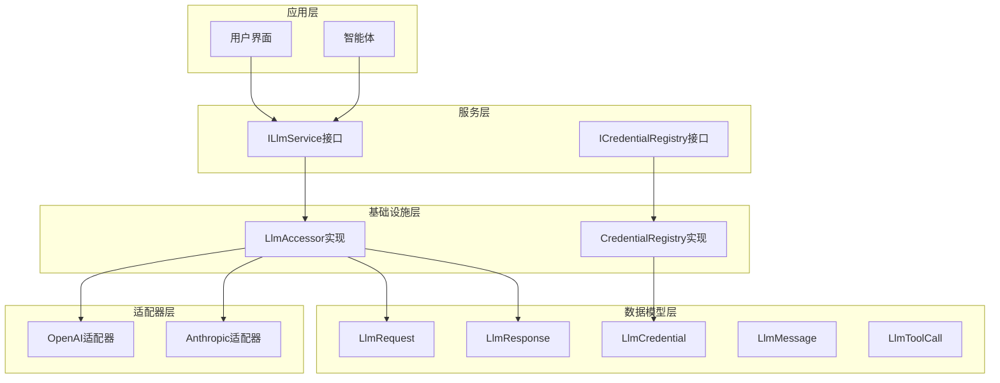
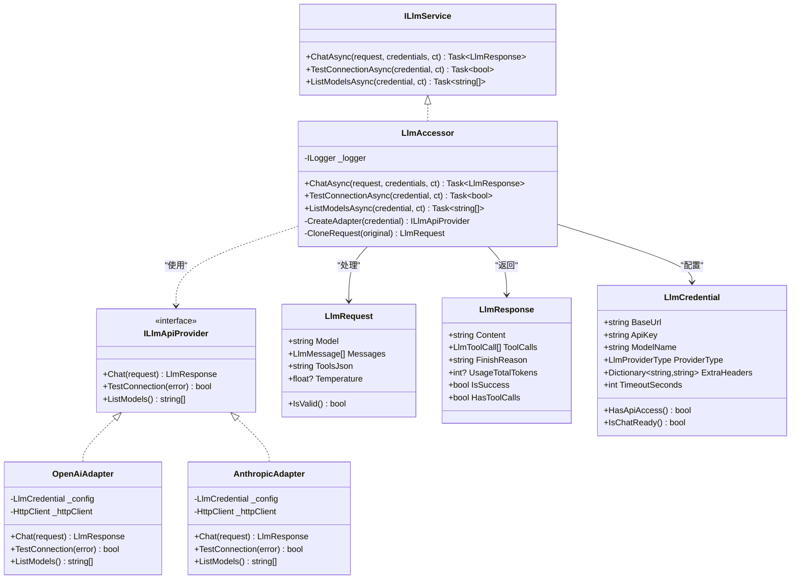
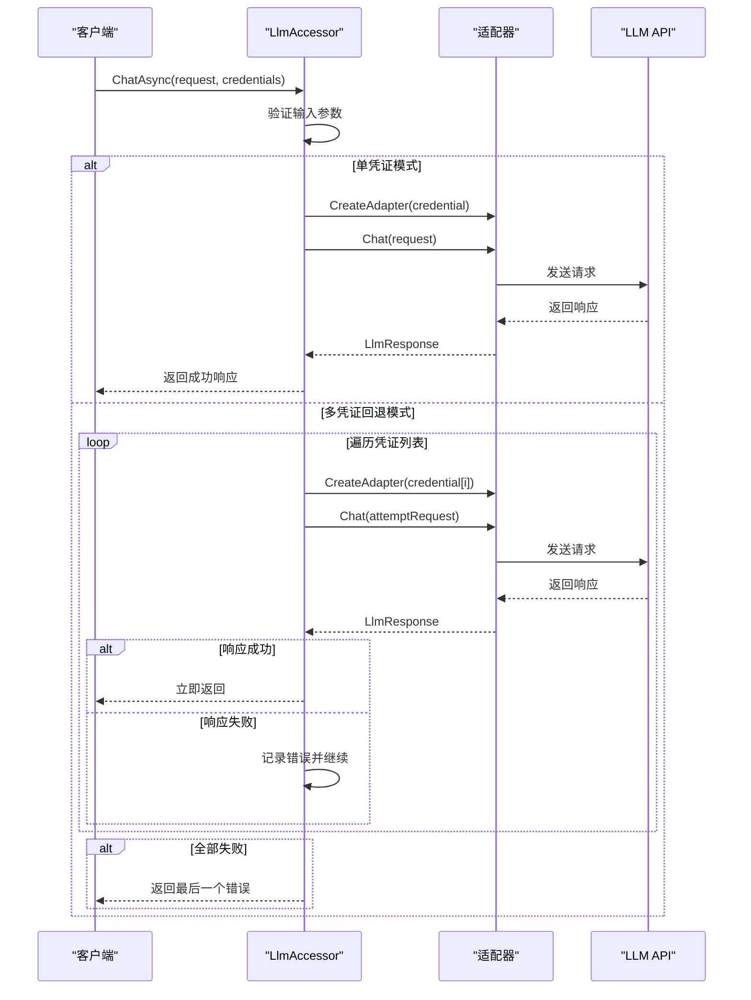
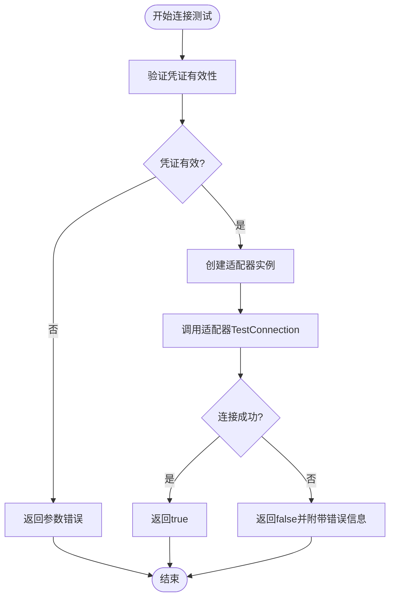
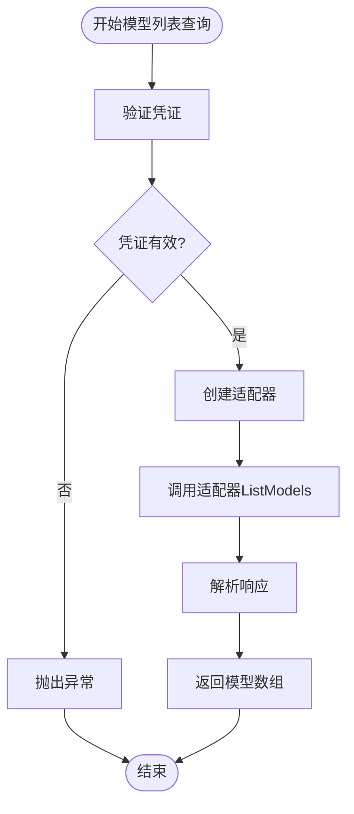
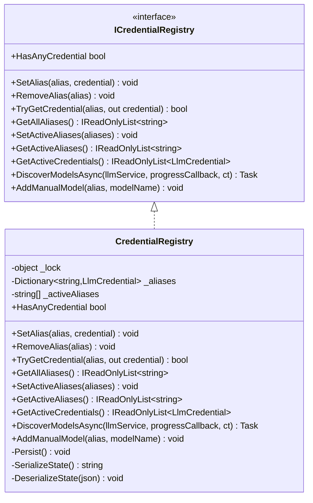
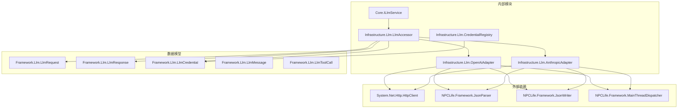

# LLM服务接口设计

<cite>
**本文档引用的文件**
- [ILlmService.cs](file://src/NPCLife/Core/ILlmService.cs)
- [ICredentialRegistry.cs](file://src/NPCLife/Core/ICredentialRegistry.cs)
- [LlmRequest.cs](file://src/NPCLife/Framework/Llm/LlmRequest.cs)
- [LlmResponse.cs](file://src/NPCLife/Framework/Llm/LlmResponse.cs)
- [LlmCredential.cs](file://src/NPCLife/Framework/Llm/LlmCredential.cs)
- [LlmMessage.cs](file://src/NPCLife/Framework/Llm/LlmMessage.cs)
- [LlmToolCall.cs](file://src/NPCLife/Framework/Llm/LlmToolCall.cs)
- [LlmConfig.cs](file://src/NPCLife/Framework/Llm/LlmConfig.cs)
- [ILlmApiProvider.cs](file://src/NPCLife/Core/ILlmApiProvider.cs)
- [LlmAccessor.cs](file://src/NPCLife/Infrastructure/Llm/LlmAccessor.cs)
- [CredentialRegistry.cs](file://src/NPCLife/Infrastructure/Llm/CredentialRegistry.cs)
- [OpenAiAdapter.cs](file://src/NPCLife/Infrastructure/Llm/OpenAiAdapter.cs)
- [AnthropicAdapter.cs](file://src/NPCLife/Infrastructure/Llm/AnthropicAdapter.cs)
</cite>

## 目录
1. [简介](#简介)
2. [项目结构](#项目结构)
3. [核心组件](#核心组件)
4. [架构概览](#架构概览)
5. [详细组件分析](#详细组件分析)
6. [依赖关系分析](#依赖关系分析)
7. [性能考虑](#性能考虑)
8. [故障排除指南](#故障排除指南)
9. [结论](#结论)

## 简介

本文档详细阐述了NPCLife项目中的LLM服务接口设计。该设计采用完全无状态的架构理念，通过统一的接口抽象实现了多供应商、多凭证的灵活配置。系统的核心价值在于提供了简洁而强大的多凭证回退机制，确保在复杂的LLM环境中有更高的成功率和更好的用户体验。

## 项目结构

LLM服务接口设计遵循清晰的分层架构，主要分为以下层次：

**图表来源**
- [ILlmService.cs:17-49](file://src/NPCLife/Core/ILlmService.cs#L17-L49)
- [LlmAccessor.cs:26-331](file://src/NPCLife/Infrastructure/Llm/LlmAccessor.cs#L26-L331)

**章节来源**
- [ILlmService.cs:1-51](file://src/NPCLife/Core/ILlmService.cs#L1-L51)
- [LlmAccessor.cs:11-331](file://src/NPCLife/Infrastructure/Llm/LlmAccessor.cs#L11-L331)

## 核心组件

### ILlmService接口设计理念

ILlmService接口体现了完全无状态的设计原则，所有方法都接受显式的凭证参数，确保了系统的可测试性和可维护性。

**关键特性：**
- **完全无状态**：所有方法都通过参数传递配置信息
- **多凭证回退**：ChatAsync方法支持凭证列表的自动切换
- **异步回调模式**：所有操作都在后台线程执行，完成后通过MainThreadDispatcher回调到UI线程
- **明确的错误处理**：失败时返回详细的错误信息

### 数据结构设计

#### LlmRequest数据结构
LlmRequest作为内部统一格式的请求载体，具有以下特点：
- **模型名称**：支持动态指定或从凭证继承
- **消息列表**：包含多种角色的消息（user、assistant、system、tool）
- **工具定义**：支持MCP标准的工具调用格式
- **采样参数**：温度参数控制生成的随机性

#### LlmResponse数据结构
LlmResponse提供了统一的响应格式，支持：
- **文本内容**：标准的LLM回复内容
- **工具调用**：当LLM请求工具调用时的特殊处理
- **使用统计**：完整的token使用情况跟踪
- **错误处理**：统一的错误状态标识

#### LlmCredential认证机制
LlmCredential是一个纯数据类，包含：
- **基础URL**：API的基础访问地址
- **API密钥**：认证凭据
- **模型名称**：默认使用的模型
- **提供商类型**：决定使用哪个适配器
- **扩展头部**：支持自定义HTTP头部

**章节来源**
- [ILlmService.cs:8-51](file://src/NPCLife/Core/ILlmService.cs#L8-L51)
- [LlmRequest.cs:9-46](file://src/NPCLife/Framework/Llm/LlmRequest.cs#L9-L46)
- [LlmResponse.cs:9-58](file://src/NPCLife/Framework/Llm/LlmResponse.cs#L9-L58)
- [LlmCredential.cs:12-84](file://src/NPCLife/Framework/Llm/LlmCredential.cs#L12-L84)

## 架构概览

LLM服务接口设计采用了分层架构，通过适配器模式实现了对不同LLM提供商的统一抽象：

**图表来源**
- [ILlmService.cs:17-49](file://src/NPCLife/Core/ILlmService.cs#L17-L49)
- [LlmAccessor.cs:26-331](file://src/NPCLife/Infrastructure/Llm/LlmAccessor.cs#L26-L331)
- [ILlmApiProvider.cs:12-37](file://src/NPCLife/Core/ILlmApiProvider.cs#L12-L37)
- [OpenAiAdapter.cs:18-392](file://src/NPCLife/Infrastructure/Llm/OpenAiAdapter.cs#L18-L392)
- [AnthropicAdapter.cs:23-434](file://src/NPCLife/Infrastructure/Llm/AnthropicAdapter.cs#L23-L434)

## 详细组件分析

### ChatAsync方法实现细节

ChatAsync方法是整个LLM服务的核心，实现了智能的多凭证回退机制：

**图表来源**
- [LlmAccessor.cs:47-191](file://src/NPCLife/Infrastructure/Llm/LlmAccessor.cs#L47-L191)

#### 凭证处理顺序和失败切换逻辑

1. **参数验证**：确保请求和凭证列表的有效性
2. **单凭证优化**：如果只有一个凭证，直接调用而不进行回退开销
3. **多凭证回退**：按顺序尝试每个凭证，遇到成功立即返回
4. **错误累积**：记录最后一次错误，用于最终失败时的反馈
5. **请求克隆**：为每次尝试创建独立的请求副本，避免状态污染

#### 具体实现要点

- **线程管理**：所有网络操作在后台线程执行，通过MainThreadDispatcher回调
- **取消支持**：完整支持CancellationToken，允许外部取消长时间操作
- **适配器创建**：每次调用都创建新的适配器实例，确保完全无状态
- **错误传播**：详细的错误信息包含在LlmResponse中

**章节来源**
- [LlmAccessor.cs:47-191](file://src/NPCLife/Infrastructure/Llm/LlmAccessor.cs#L47-L191)
- [ILlmService.cs:28-31](file://src/NPCLife/Core/ILlmService.cs#L28-L31)

### TestConnectionAsync方法

TestConnectionAsync方法用于验证单个凭证的API连通性：

**图表来源**
- [LlmAccessor.cs:196-240](file://src/NPCLife/Infrastructure/Llm/LlmAccessor.cs#L196-L240)

**使用场景：**
- 配置向导中的连接测试
- 用户首次设置API密钥时的验证
- 系统健康检查

**章节来源**
- [LlmAccessor.cs:196-240](file://src/NPCLife/Infrastructure/Llm/LlmAccessor.cs#L196-L240)
- [ILlmService.cs:39](file://src/NPCLife/Core/ILlmService.cs#L39)

### ListModelsAsync方法

ListModelsAsync方法用于获取API可用的模型列表：

**图表来源**
- [LlmAccessor.cs:245-281](file://src/NPCLife/Infrastructure/Llm/LlmAccessor.cs#L245-L281)

**使用场景：**
- 配置向导中的模型选择
- 动态模型发现
- 用户界面的模型列表展示

**章节来源**
- [LlmAccessor.cs:245-281](file://src/NPCLife/Infrastructure/Llm/LlmAccessor.cs#L245-L281)
- [ILlmService.cs:48](file://src/NPCLife/Core/ILlmService.cs#L48)

### 凭证注册表系统

CredentialRegistry提供了完整的凭证管理功能：

**图表来源**
- [ICredentialRegistry.cs:20-101](file://src/NPCLife/Core/ICredentialRegistry.cs#L20-L101)
- [CredentialRegistry.cs:20-327](file://src/NPCLife/Infrastructure/Llm/CredentialRegistry.cs#L20-L327)

**核心功能：**
- **别名管理**：为不同的凭证分配人类可读的代号
- **激活顺序**：定义凭证的优先级和回退顺序
- **模型发现**：自动查询所有凭证的可用模型
- **持久化**：将配置状态保存到存储后端

**章节来源**
- [ICredentialRegistry.cs:20-101](file://src/NPCLife/Core/ICredentialRegistry.cs#L20-L101)
- [CredentialRegistry.cs:20-327](file://src/NPCLife/Infrastructure/Llm/CredentialRegistry.cs#L20-L327)

## 依赖关系分析

LLM服务接口设计展现了良好的依赖关系和解耦：

**图表来源**
- [LlmAccessor.cs:1-331](file://src/NPCLife/Infrastructure/Llm/LlmAccessor.cs#L1-L331)
- [OpenAiAdapter.cs:1-392](file://src/NPCLife/Infrastructure/Llm/OpenAiAdapter.cs#L1-L392)
- [AnthropicAdapter.cs:1-434](file://src/NPCLife/Infrastructure/Llm/AnthropicAdapter.cs#L1-L434)

**依赖特点：**
- **低耦合**：接口与实现分离，便于测试和替换
- **无循环依赖**：清晰的单向依赖关系
- **外部依赖最小化**：只依赖必要的系统类库
- **可插拔架构**：新的LLM提供商只需实现ILlmApiProvider接口

**章节来源**
- [LlmAccessor.cs:1-331](file://src/NPCLife/Infrastructure/Llm/LlmAccessor.cs#L1-L331)
- [OpenAiAdapter.cs:1-392](file://src/NPCLife/Infrastructure/Llm/OpenAiAdapter.cs#L1-L392)
- [AnthropicAdapter.cs:1-434](file://src/NPCLife/Infrastructure/Llm/AnthropicAdapter.cs#L1-L434)

## 性能考虑

### 线程模型优化

系统采用了高效的异步回调模式：

- **后台线程执行**：所有网络I/O操作在后台线程完成
- **主线程回调**：通过MainThreadDispatcher确保UI线程安全
- **无阻塞UI**：完全避免了UI线程的阻塞

### 缓存和复用策略

- **适配器生命周期**：每次调用创建新适配器，避免状态共享问题
- **HTTP客户端复用**：适配器内部管理HttpClient实例
- **内存优化**：使用浅拷贝和克隆技术避免不必要的深拷贝

### 错误处理和重试

- **快速失败**：单凭证模式下避免回退开销
- **渐进式重试**：多凭证模式下的智能回退
- **详细错误信息**：便于诊断和用户反馈

## 故障排除指南

### 常见问题诊断

1. **连接失败**
   - 检查API密钥和基础URL的有效性
   - 验证网络连接和防火墙设置
   - 查看详细的错误信息和HTTP状态码

2. **模型不可用**
   - 确认模型名称的正确性
   - 检查API提供商的支持情况
   - 使用ListModelsAsync方法验证可用模型

3. **凭证回退问题**
   - 验证凭证列表的顺序和有效性
   - 检查是否有足够的权限访问各个API
   - 确认网络延迟和超时设置

### 最佳实践建议

1. **凭证管理**
   - 为每个API提供商设置独立的凭证
   - 定义清晰的凭证优先级顺序
   - 定期验证和更新API密钥

2. **错误处理**
   - 实现适当的重试机制
   - 提供用户友好的错误提示
   - 记录详细的日志信息

3. **性能优化**
   - 合理设置超时时间
   - 使用单凭证模式减少回退开销
   - 监控token使用情况

**章节来源**
- [LlmAccessor.cs:174-177](file://src/NPCLife/Infrastructure/Llm/LlmAccessor.cs#L174-L177)
- [LlmCredential.cs:36-49](file://src/NPCLife/Framework/Llm/LlmCredential.cs#L36-L49)

## 结论

NPCLife项目的LLM服务接口设计展现了优秀的软件工程实践：

### 设计优势

1. **完全无状态**：通过显式参数传递配置，确保了系统的可测试性和可维护性
2. **智能回退机制**：多凭证回退提供了高可用性的保障
3. **清晰的抽象层次**：接口与实现分离，便于扩展和维护
4. **完善的错误处理**：详细的错误信息和诊断能力

### 技术创新点

1. **统一数据模型**：LlmRequest和LlmResponse提供了跨提供商的统一抽象
2. **灵活的凭证管理**：CredentialRegistry支持复杂的凭证配置和管理
3. **适配器模式**：支持多种LLM提供商的无缝集成
4. **异步回调模式**：确保了UI线程的响应性

### 应用场景

该设计适用于各种需要LLM集成的应用场景：
- AI助手和聊天机器人
- 自然语言处理工具
- 内容生成和编辑应用
- 智能决策支持系统

通过其优雅的架构设计和完善的实现，NPCLife的LLM服务接口为开发者提供了一个强大而灵活的平台，能够满足各种复杂的AI应用场景需求。