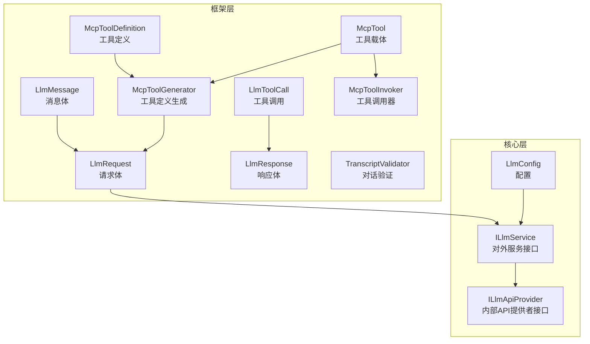
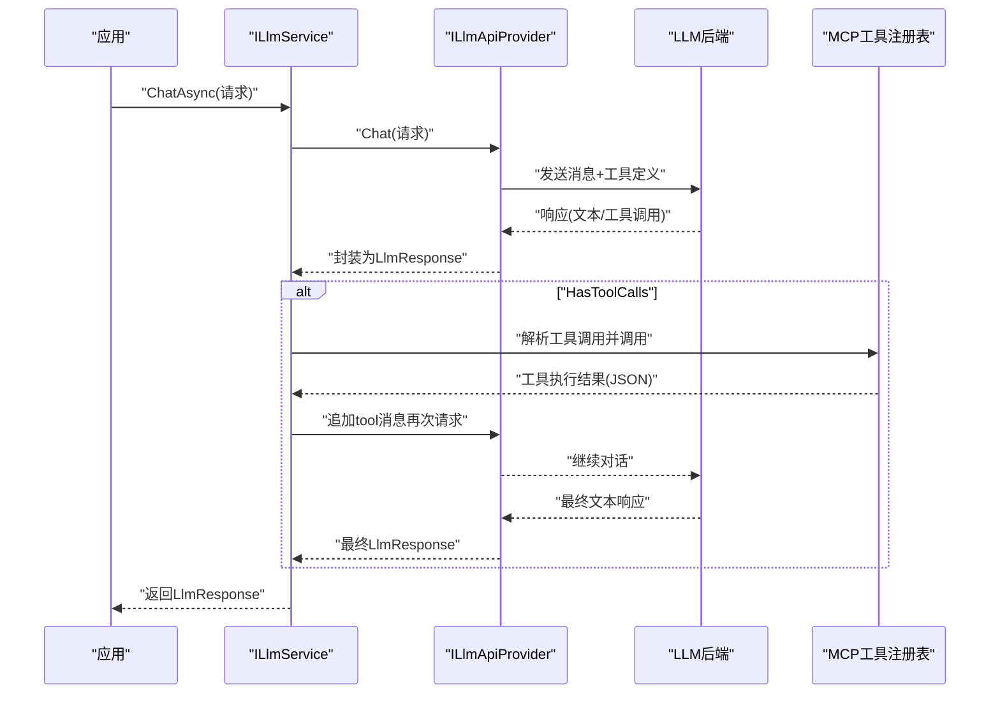
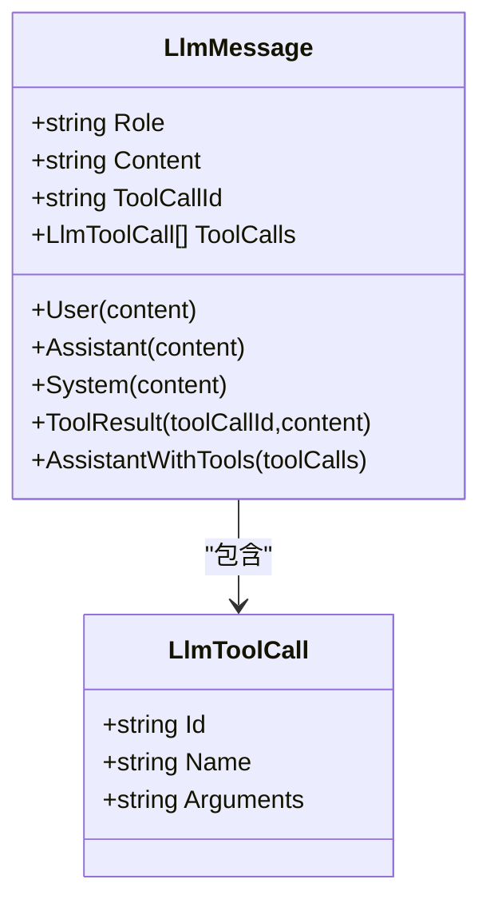
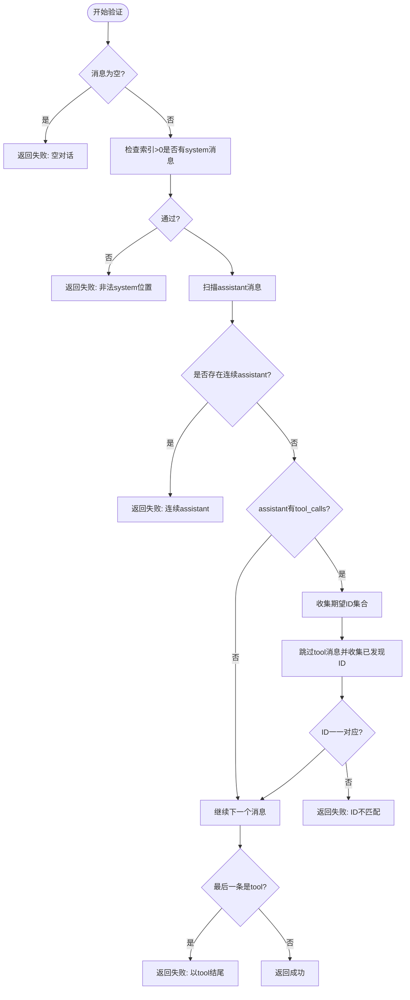
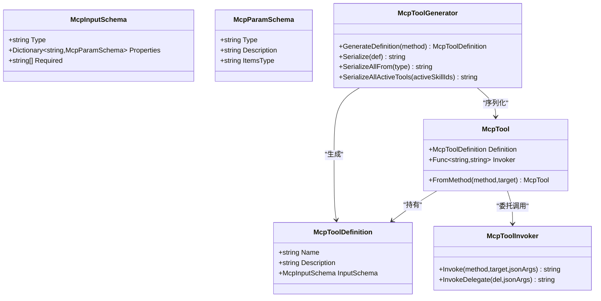
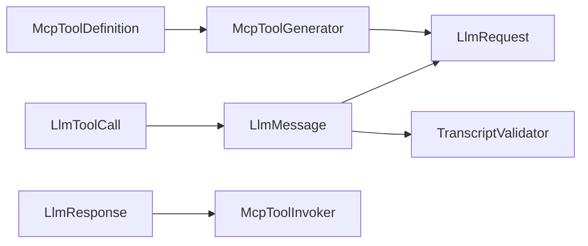

# LLM消息处理

<cite>
**本文引用的文件**
- [LlmMessage.cs](file://src/NPCLife/Framework/Llm/LlmMessage.cs)
- [LlmToolCall.cs](file://src/NPCLife/Framework/Llm/LlmToolCall.cs)
- [TranscriptValidator.cs](file://src/NPCLife/Framework/Llm/TranscriptValidator.cs)
- [LlmRequest.cs](file://src/NPCLife/Framework/Llm/LlmRequest.cs)
- [LlmResponse.cs](file://src/NPCLife/Framework/Llm/LlmResponse.cs)
- [McpTool.cs](file://src/NPCLife/Framework/Mcp/McpTool.cs)
- [McpToolInvoker.cs](file://src/NPCLife/Framework/Mcp/McpToolInvoker.cs)
- [McpToolGenerator.cs](file://src/NPCLife/Framework/Mcp/McpToolGenerator.cs)
- [McpToolDefinition.cs](file://src/NPCLife/Framework/Mcp/McpToolDefinition.cs)
- [ILlmService.cs](file://src/NPCLife/Core/ILlmService.cs)
- [ILlmApiProvider.cs](file://src/NPCLife/Core/ILlmApiProvider.cs)
- [LlmConfig.cs](file://src/NPCLife/Framework/Llm/LlmConfig.cs)
- [McpToolGeneratorTests.cs](file://tests/NPCLife.Tests/Framework/McpToolGeneratorTests.cs)
- [McpSkillRegistryTests.cs](file://tests/NPCLife.Tests/Framework/McpSkillRegistryTests.cs)
</cite>

## 目录
1. [简介](#简介)
2. [项目结构](#项目结构)
3. [核心组件](#核心组件)
4. [架构总览](#架构总览)
5. [详细组件分析](#详细组件分析)
6. [依赖关系分析](#依赖关系分析)
7. [性能考量](#性能考量)
8. [故障排查指南](#故障排查指南)
9. [结论](#结论)
10. [附录](#附录)

## 简介
本文件面向“LLM消息处理”的完整技术文档，聚焦以下主题：
- LlmMessage 数据结构设计：消息类型、角色标识与内容格式
- LlmToolCall 工具调用机制：参数传递、执行流程与结果处理
- TranscriptValidator 对话验证逻辑：确保消息格式正确性与完整性
- 消息的序列化与反序列化过程，以及与MCP工具协议的集成
- 消息处理最佳实践：错误恢复与重试机制
- 提供可追溯的代码片段路径，帮助读者定位实现细节

## 项目结构
本项目围绕“框架层”和“核心层”组织LLM消息处理能力：
- 框架层（Framework）：定义统一的消息、请求、响应与工具协议抽象，并提供MCP工具生成与调用能力
- 核心层（Core）：定义对外服务接口（ILlmService）与内部API提供者接口（ILlmApiProvider），负责与具体大模型服务对接

图表来源
- [LlmMessage.cs:1-63](file://src/NPCLife/Framework/Llm/LlmMessage.cs#L1-L63)
- [LlmToolCall.cs:1-19](file://src/NPCLife/Framework/Llm/LlmToolCall.cs#L1-L19)
- [LlmRequest.cs:1-46](file://src/NPCLife/Framework/Llm/LlmRequest.cs#L1-L46)
- [LlmResponse.cs:1-58](file://src/NPCLife/Framework/Llm/LlmResponse.cs#L1-L58)
- [TranscriptValidator.cs:1-105](file://src/NPCLife/Framework/Llm/TranscriptValidator.cs#L1-L105)
- [McpToolDefinition.cs:1-50](file://src/NPCLife/Framework/Mcp/McpToolDefinition.cs#L1-L50)
- [McpToolGenerator.cs:1-214](file://src/NPCLife/Framework/Mcp/McpToolGenerator.cs#L1-L214)
- [McpToolInvoker.cs:1-238](file://src/NPCLife/Framework/Mcp/McpToolInvoker.cs#L1-L238)
- [McpTool.cs:1-40](file://src/NPCLife/Framework/Mcp/McpTool.cs#L1-L40)
- [ILlmService.cs:1-51](file://src/NPCLife/Core/ILlmService.cs#L1-L51)
- [ILlmApiProvider.cs:1-37](file://src/NPCLife/Core/ILlmApiProvider.cs#L1-L37)
- [LlmConfig.cs:1-69](file://src/NPCLife/Framework/Llm/LlmConfig.cs#L1-L69)

章节来源
- [LlmMessage.cs:1-63](file://src/NPCLife/Framework/Llm/LlmMessage.cs#L1-L63)
- [LlmToolCall.cs:1-19](file://src/NPCLife/Framework/Llm/LlmToolCall.cs#L1-L19)
- [LlmRequest.cs:1-46](file://src/NPCLife/Framework/Llm/LlmRequest.cs#L1-L46)
- [LlmResponse.cs:1-58](file://src/NPCLife/Framework/Llm/LlmResponse.cs#L1-L58)
- [TranscriptValidator.cs:1-105](file://src/NPCLife/Framework/Llm/TranscriptValidator.cs#L1-L105)
- [McpToolDefinition.cs:1-50](file://src/NPCLife/Framework/Mcp/McpToolDefinition.cs#L1-L50)
- [McpToolGenerator.cs:1-214](file://src/NPCLife/Framework/Mcp/McpToolGenerator.cs#L1-L214)
- [McpToolInvoker.cs:1-238](file://src/NPCLife/Framework/Mcp/McpToolInvoker.cs#L1-L238)
- [McpTool.cs:1-40](file://src/NPCLife/Framework/Mcp/McpTool.cs#L1-L40)
- [ILlmService.cs:1-51](file://src/NPCLife/Core/ILlmService.cs#L1-L51)
- [ILlmApiProvider.cs:1-37](file://src/NPCLife/Core/ILlmApiProvider.cs#L1-L37)
- [LlmConfig.cs:1-69](file://src/NPCLife/Framework/Llm/LlmConfig.cs#L1-L69)

## 核心组件
- LlmMessage：统一的消息体，支持 role（system/user/assistant/tool）与内容字段，以及工具调用请求/结果的承载
- LlmToolCall：工具调用的最小单元，包含调用ID、工具名与参数JSON
- LlmRequest：统一请求体，包含模型名、消息列表与工具定义JSON
- LlmResponse：统一响应体，包含文本内容、工具调用请求、结束原因与用量统计
- TranscriptValidator：对话结构验证器，确保消息序列满足API约定
- MCP工具链：McpToolDefinition/McpToolGenerator/McpToolInvoker构成工具定义、生成与调用闭环

章节来源
- [LlmMessage.cs:8-61](file://src/NPCLife/Framework/Llm/LlmMessage.cs#L8-L61)
- [LlmToolCall.cs:7-17](file://src/NPCLife/Framework/Llm/LlmToolCall.cs#L7-L17)
- [LlmRequest.cs:9-44](file://src/NPCLife/Framework/Llm/LlmRequest.cs#L9-L44)
- [LlmResponse.cs:9-56](file://src/NPCLife/Framework/Llm/LlmResponse.cs#L9-L56)
- [TranscriptValidator.cs:16-102](file://src/NPCLife/Framework/Llm/TranscriptValidator.cs#L16-L102)
- [McpToolDefinition.cs:8-48](file://src/NPCLife/Framework/Mcp/McpToolDefinition.cs#L8-L48)
- [McpToolGenerator.cs:19-121](file://src/NPCLife/Framework/Mcp/McpToolGenerator.cs#L19-L121)
- [McpToolInvoker.cs:24-72](file://src/NPCLife/Framework/Mcp/McpToolInvoker.cs#L24-L72)

## 架构总览
下图展示了从应用发起请求到工具执行与结果回流的关键交互：

图表来源
- [ILlmService.cs:28-31](file://src/NPCLife/Core/ILlmService.cs#L28-L31)
- [ILlmApiProvider.cs:20](file://src/NPCLife/Core/ILlmApiProvider.cs#L20)
- [LlmResponse.cs:44-45](file://src/NPCLife/Framework/Llm/LlmResponse.cs#L44-L45)
- [McpToolGenerator.cs:153-156](file://src/NPCLife/Framework/Mcp/McpToolGenerator.cs#L153-L156)

## 详细组件分析

### LlmMessage：消息结构与角色语义
- 角色语义
  - system：系统提示，通常位于消息序列首位
  - user：用户输入
  - assistant：模型输出，可携带文本内容或工具调用请求
  - tool：工具执行结果，需与前一条assistant的工具调用ID关联
- 关键字段
  - Role：消息角色
  - Content：文本内容（assistant可为空，仅携带工具调用）
  - ToolCallId：tool消息的调用ID
  - ToolCalls：assistant声明的工具调用列表
- 快捷构造
  - User、Assistant、System、ToolResult、AssistantWithTools

图表来源
- [LlmMessage.cs:8-61](file://src/NPCLife/Framework/Llm/LlmMessage.cs#L8-L61)
- [LlmToolCall.cs:7-17](file://src/NPCLife/Framework/Llm/LlmToolCall.cs#L7-L17)

章节来源
- [LlmMessage.cs:10-17](file://src/NPCLife/Framework/Llm/LlmMessage.cs#L10-L17)
- [LlmMessage.cs:22-60](file://src/NPCLife/Framework/Llm/LlmMessage.cs#L22-L60)

### LlmToolCall：工具调用的最小单元
- 字段
  - Id：工具调用唯一ID，用于与tool消息关联
  - Name：工具名称
  - Arguments：JSON字符串形式的参数
- 用途
  - assistant消息中作为ToolCalls元素
  - tool消息中通过ToolCallId回指

章节来源
- [LlmToolCall.cs:9-16](file://src/NPCLife/Framework/Llm/LlmToolCall.cs#L9-L16)

### LlmRequest/LlmResponse：请求与响应的统一抽象
- LlmRequest
  - Model：模型名
  - Messages：消息列表
  - ToolsJson：MCP工具定义的JSON数组字符串
  - Temperature：采样温度
  - 辅助方法：SinglePrompt、IsValid
- LlmResponse
  - Content：文本内容
  - ToolCalls：工具调用请求
  - FinishReason：结束原因（stop/tool_calls/length/error）
  - Usage*：token用量统计
  - Model/Error：模型名与错误信息
  - 辅助属性：IsSuccess、HasToolCalls、FromError

章节来源
- [LlmRequest.cs:11-31](file://src/NPCLife/Framework/Llm/LlmRequest.cs#L11-L31)
- [LlmRequest.cs:36-43](file://src/NPCLife/Framework/Llm/LlmRequest.cs#L36-L43)
- [LlmResponse.cs:11-42](file://src/NPCLife/Framework/Llm/LlmResponse.cs#L11-L42)
- [LlmResponse.cs:47-55](file://src/NPCLife/Framework/Llm/LlmResponse.cs#L47-L55)

### TranscriptValidator：对话结构验证
- 核心规则
  - system消息仅允许位于索引0
  - assistant消息在同一轮次中不得连续出现
  - assistant声明的tool_calls必须有完整对应的tool结果消息
  - tool消息必须紧随带有tool_calls的assistant消息
  - 消息序列不得以未完成的tool结果结尾
- 返回值
  - ValidationResult：包含IsValid与Reason

图表来源
- [TranscriptValidator.cs:37-102](file://src/NPCLife/Framework/Llm/TranscriptValidator.cs#L37-L102)

章节来源
- [TranscriptValidator.cs:18-32](file://src/NPCLife/Framework/Llm/TranscriptValidator.cs#L18-L32)
- [TranscriptValidator.cs:37-102](file://src/NPCLife/Framework/Llm/TranscriptValidator.cs#L37-L102)

### MCP工具协议与消息处理集成
- 工具定义生成
  - 通过特性（McpTool、McpParam）或反射推导生成McpToolDefinition
  - 序列化为MCP标准JSON（包含type="function"）
- 工具调用器
  - 将JSON参数反序列化为方法参数，反射调用目标方法
  - 将返回值序列化为JSON字符串
  - 异常包装为包含错误信息的JSON
- 工具载体
  - McpTool：统一承载Definition与Invoker，支持FromMethod与手工构造

图表来源
- [McpToolDefinition.cs:8-48](file://src/NPCLife/Framework/Mcp/McpToolDefinition.cs#L8-L48)
- [McpToolGenerator.cs:19-121](file://src/NPCLife/Framework/Mcp/McpToolGenerator.cs#L19-L121)
- [McpTool.cs:14-37](file://src/NPCLife/Framework/Mcp/McpTool.cs#L14-L37)
- [McpToolInvoker.cs:24-72](file://src/NPCLife/Framework/Mcp/McpToolInvoker.cs#L24-L72)

章节来源
- [McpToolGenerator.cs:19-121](file://src/NPCLife/Framework/Mcp/McpToolGenerator.cs#L19-L121)
- [McpToolInvoker.cs:24-72](file://src/NPCLife/Framework/Mcp/McpToolInvoker.cs#L24-L72)
- [McpTool.cs:28-37](file://src/NPCLife/Framework/Mcp/McpTool.cs#L28-L37)

### 与LLM服务的集成
- ILlmService：对外统一异步接口，支持凭证列表的fallback策略
- ILlmApiProvider：内部API提供者接口，负责具体适配器实现
- LlmConfig：提供者类型、基础URL、密钥、模型名、超时与扩展头等配置

章节来源
- [ILlmService.cs:28-31](file://src/NPCLife/Core/ILlmService.cs#L28-L31)
- [ILlmApiProvider.cs:20](file://src/NPCLife/Core/ILlmApiProvider.cs#L20)
- [LlmConfig.cs:23-51](file://src/NPCLife/Framework/Llm/LlmConfig.cs#L23-L51)

## 依赖关系分析
- LlmMessage与LlmToolCall：组合关系，assistant消息可包含多个工具调用
- LlmRequest与McpToolGenerator：请求中注入工具定义JSON，由生成器从已激活技能中聚合
- LlmResponse与McpToolInvoker：当HasToolCalls为真时，触发工具调用并追加tool消息
- TranscriptValidator：在每次请求前对消息历史进行结构校验，避免非法序列导致API错误

图表来源
- [LlmMessage.cs:19-20](file://src/NPCLife/Framework/Llm/LlmMessage.cs#L19-L20)
- [LlmRequest.cs:17-18](file://src/NPCLife/Framework/Llm/LlmRequest.cs#L17-L18)
- [McpToolDefinition.cs:38-48](file://src/NPCLife/Framework/Mcp/McpToolDefinition.cs#L38-L48)
- [McpToolGenerator.cs:153-156](file://src/NPCLife/Framework/Mcp/McpToolGenerator.cs#L153-L156)
- [LlmResponse.cs:14-15](file://src/NPCLife/Framework/Llm/LlmResponse.cs#L14-L15)
- [TranscriptValidator.cs:37-102](file://src/NPCLife/Framework/Llm/TranscriptValidator.cs#L37-L102)

章节来源
- [LlmMessage.cs:19-20](file://src/NPCLife/Framework/Llm/LlmMessage.cs#L19-L20)
- [LlmRequest.cs:17-18](file://src/NPCLife/Framework/Llm/LlmRequest.cs#L17-L18)
- [McpToolGenerator.cs:153-156](file://src/NPCLife/Framework/Mcp/McpToolGenerator.cs#L153-L156)
- [LlmResponse.cs:14-15](file://src/NPCLife/Framework/Llm/LlmResponse.cs#L14-L15)
- [TranscriptValidator.cs:37-102](file://src/NPCLife/Framework/Llm/TranscriptValidator.cs#L37-L102)

## 性能考量
- 工具调用开销
  - 反射调用与JSON序列化/反序列化存在额外成本，建议批量调用与结果缓存
  - 参数类型转换与集合转换会带来CPU开销，尽量减少复杂嵌套
- 消息序列长度
  - 过长的历史消息会增加token用量与延迟，建议在对话轮次间清理无关上下文
- 并发与线程
  - ILlmService承诺在工作线程中执行网络调用并在主线程回调，避免UI阻塞
- 配置优化
  - LlmConfig提供超时与扩展头设置，合理配置可提升稳定性

## 故障排查指南
- 常见错误与定位
  - 请求无效：检查LlmRequest.IsValid与必要字段（Model、Messages）
  - 响应失败：查看LlmResponse.Error与FinishReason
  - 工具调用异常：确认McpToolDefinition生成正确、参数类型匹配、必填参数齐全
  - 对话结构错误：TranscriptValidator.Fail返回的具体原因
- 重试与回退
  - ILlmService支持凭证列表的顺序尝试，失败自动切换下一个
  - 对于网络超时或临时错误，可在上层实现指数退避重试
- 日志与可观测性
  - 使用LlmResponse.Usage*统计token用量，辅助成本控制
  - 在McpToolInvoker中捕获异常并返回包含错误信息的JSON，便于前端展示

章节来源
- [LlmRequest.cs:26-31](file://src/NPCLife/Framework/Llm/LlmRequest.cs#L26-L31)
- [LlmResponse.cs:38-42](file://src/NPCLife/Framework/Llm/LlmResponse.cs#L38-L42)
- [McpToolInvoker.cs:62-71](file://src/NPCLife/Framework/Mcp/McpToolInvoker.cs#L62-L71)
- [TranscriptValidator.cs:30-31](file://src/NPCLife/Framework/Llm/TranscriptValidator.cs#L30-L31)
- [ILlmService.cs:28-31](file://src/NPCLife/Core/ILlmService.cs#L28-L31)

## 结论
本文件系统梳理了LLM消息处理的统一抽象、工具协议集成与对话验证机制。通过LlmMessage/LlmRequest/LlmResponse的清晰边界，结合TranscriptValidator的结构约束与MCP工具链的生成/调用能力，能够稳定地支撑多轮对话与工具协作。建议在工程实践中遵循“先验证再请求、先工具后文本”的处理顺序，并配合合理的重试与监控策略，确保系统的可靠性与可维护性。

## 附录

### 最佳实践清单
- 消息管理
  - 严格遵守system位于首位、assistant不连续、tool紧随assistant的规则
  - 使用LlmMessage快捷构造方法保持一致性
- 工具调用
  - 通过McpToolGenerator从已激活技能聚合工具定义，避免遗漏
  - 在McpToolInvoker中确保参数类型与必填项满足要求
- 错误恢复
  - 对外使用ILlmService的凭证回退能力
  - 对内对工具调用异常进行包装与降级处理
- 性能优化
  - 控制消息历史长度与工具调用频率
  - 合理设置LlmConfig的超时与头部参数

### 示例：消息处理完整流程（步骤化）
- 步骤1：构建请求
  - 使用LlmRequest.SinglePrompt或手动添加消息
  - 通过McpToolGenerator.SerializeAllActiveTools生成ToolsJson
- 步骤2：结构验证
  - 调用TranscriptValidator.Validate，若失败则修正消息序列
- 步骤3：发送请求
  - 通过ILlmService.ChatAsync提交请求
- 步骤4：处理响应
  - 若FinishReason为tool_calls，则解析LlmResponse.ToolCalls
- 步骤5：工具执行与回流
  - 使用McpToolInvoker执行工具，得到JSON结果
  - 将结果封装为LlmMessage.ToolResult并追加到消息列表
- 步骤6：继续对话
  - 重复步骤2-5直至FinishReason为stop或error

章节来源
- [LlmRequest.cs:36-43](file://src/NPCLife/Framework/Llm/LlmRequest.cs#L36-L43)
- [McpToolGenerator.cs:153-156](file://src/NPCLife/Framework/Mcp/McpToolGenerator.cs#L153-L156)
- [TranscriptValidator.cs:37-102](file://src/NPCLife/Framework/Llm/TranscriptValidator.cs#L37-L102)
- [ILlmService.cs:28-31](file://src/NPCLife/Core/ILlmService.cs#L28-L31)
- [LlmResponse.cs:44-45](file://src/NPCLife/Framework/Llm/LlmResponse.cs#L44-L45)
- [McpToolInvoker.cs:24-72](file://src/NPCLife/Framework/Mcp/McpToolInvoker.cs#L24-L72)
- [LlmMessage.cs:40-49](file://src/NPCLife/Framework/Llm/LlmMessage.cs#L40-L49)