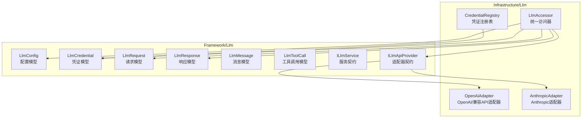
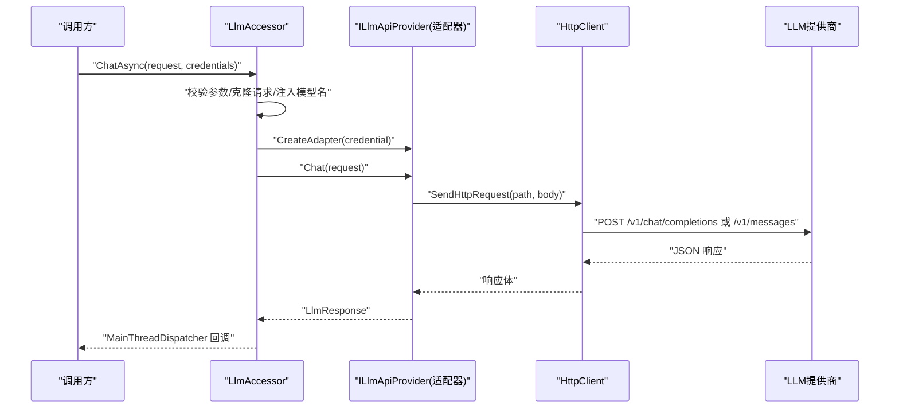
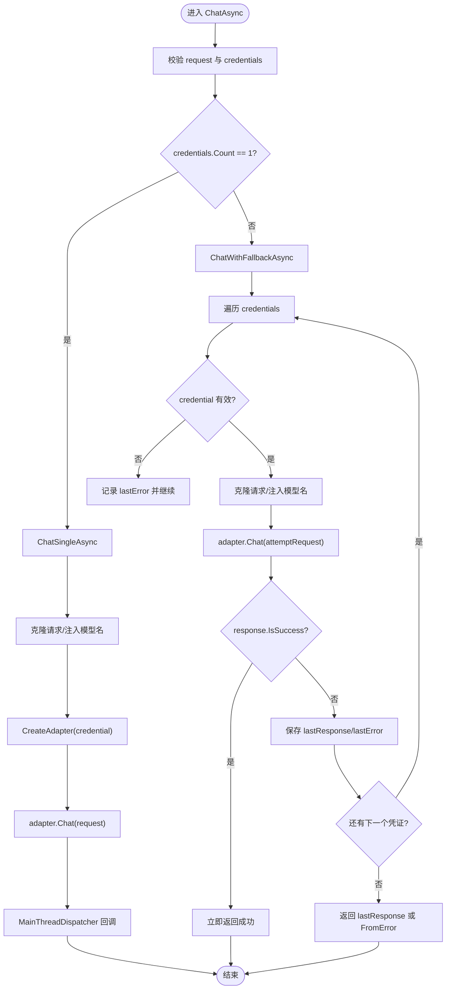
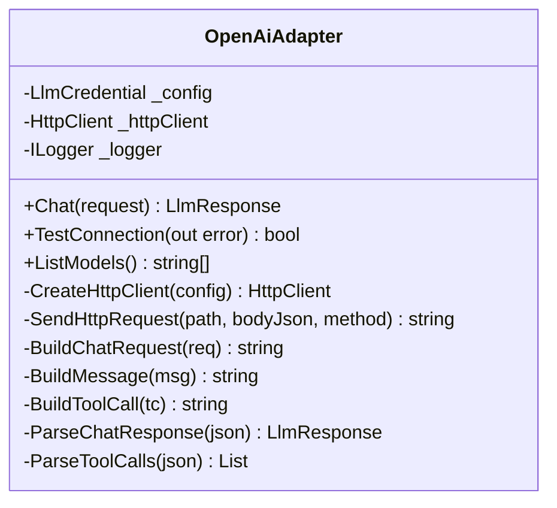
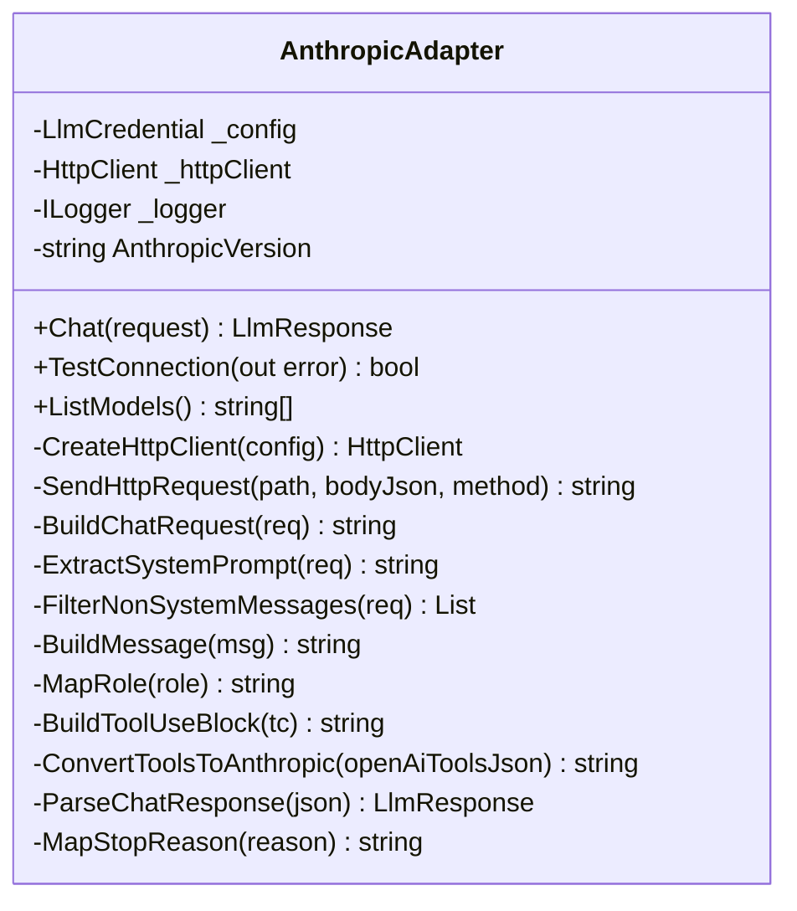
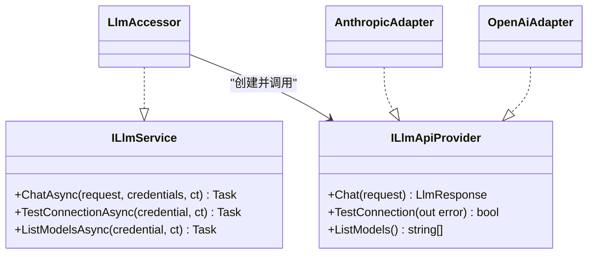
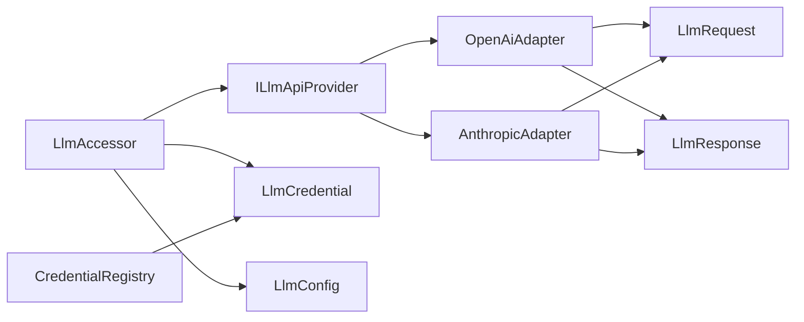

# LLM适配器实现

<cite>
**本文档引用的文件**
- [LlmAccessor.cs](file://src/NPCLife/Infrastructure/Llm/LlmAccessor.cs)
- [OpenAiAdapter.cs](file://src/NPCLife/Infrastructure/Llm/OpenAiAdapter.cs)
- [AnthropicAdapter.cs](file://src/NPCLife/Infrastructure/Llm/AnthropicAdapter.cs)
- [ILlmApiProvider.cs](file://src/NPCLife/Core/ILlmApiProvider.cs)
- [ILlmService.cs](file://src/NPCLife/Core/ILlmService.cs)
- [LlmConfig.cs](file://src/NPCLife/Framework/Llm/LlmConfig.cs)
- [LlmCredential.cs](file://src/NPCLife/Framework/Llm/LlmCredential.cs)
- [LlmRequest.cs](file://src/NPCLife/Framework/Llm/LlmRequest.cs)
- [LlmResponse.cs](file://src/NPCLife/Framework/Llm/LlmResponse.cs)
- [LlmMessage.cs](file://src/NPCLife/Framework/Llm/LlmMessage.cs)
- [LlmToolCall.cs](file://src/NPCLife/Framework/Llm/LlmToolCall.cs)
- [CredentialRegistry.cs](file://src/NPCLife/Infrastructure/Llm/CredentialRegistry.cs)
- [MetricsInterceptor.cs](file://src/NPCLife/Framework/MetricsInterceptor.cs)
</cite>

## 目录
1. [简介](#简介)
2. [项目结构](#项目结构)
3. [核心组件](#核心组件)
4. [架构总览](#架构总览)
5. [详细组件分析](#详细组件分析)
6. [依赖关系分析](#依赖关系分析)
7. [性能考虑](#性能考虑)
8. [故障排查指南](#故障排查指南)
9. [结论](#结论)
10. [附录](#附录)

## 简介
本文件系统性阐述 NPCLife 项目中的 LLM 适配器实现，重点覆盖以下方面：
- OpenAI 与 Anthropic 适配器的 HTTP 请求构建、响应解析与错误处理机制
- LlmAccessor 统一访问器模式的设计与实现，如何封装不同提供商的差异
- 适配器初始化、配置参数与认证流程
- 各适配器支持的功能差异与限制条件
- 适配器扩展指南：如何新增 LLM 提供商支持
- 性能对比与使用建议

## 项目结构
本项目围绕“统一请求/响应模型 + 适配器模式”的架构组织 LLM 能力，核心位于 Framework/Llm 与 Infrastructure/Llm 两个命名空间下：
- Framework/Llm：定义跨提供商统一的数据模型与契约（请求、响应、消息、工具调用、配置、凭证）
- Infrastructure/Llm：实现具体适配器（OpenAI、Anthropic）与统一访问器（LlmAccessor）、凭证注册表（CredentialRegistry）

图表来源
- [LlmAccessor.cs:1-331](file://src/NPCLife/Infrastructure/Llm/LlmAccessor.cs#L1-L331)
- [OpenAiAdapter.cs:1-392](file://src/NPCLife/Infrastructure/Llm/OpenAiAdapter.cs#L1-L392)
- [AnthropicAdapter.cs:1-434](file://src/NPCLife/Infrastructure/Llm/AnthropicAdapter.cs#L1-L434)
- [ILlmService.cs:1-51](file://src/NPCLife/Core/ILlmService.cs#L1-L51)
- [ILlmApiProvider.cs:1-37](file://src/NPCLife/Core/ILlmApiProvider.cs#L1-L37)
- [LlmConfig.cs:1-69](file://src/NPCLife/Framework/Llm/LlmConfig.cs#L1-L69)
- [LlmCredential.cs:1-84](file://src/NPCLife/Framework/Llm/LlmCredential.cs#L1-L84)
- [LlmRequest.cs:1-46](file://src/NPCLife/Framework/Llm/LlmRequest.cs#L1-L46)
- [LlmResponse.cs:1-58](file://src/NPCLife/Framework/Llm/LlmResponse.cs#L1-L58)
- [LlmMessage.cs:1-63](file://src/NPCLife/Framework/Llm/LlmMessage.cs#L1-L63)
- [LlmToolCall.cs:1-19](file://src/NPCLife/Framework/Llm/LlmToolCall.cs#L1-L19)
- [CredentialRegistry.cs:1-327](file://src/NPCLife/Infrastructure/Llm/CredentialRegistry.cs#L1-L327)

章节来源
- [LlmAccessor.cs:1-331](file://src/NPCLife/Infrastructure/Llm/LlmAccessor.cs#L1-L331)
- [OpenAiAdapter.cs:1-392](file://src/NPCLife/Infrastructure/Llm/OpenAiAdapter.cs#L1-L392)
- [AnthropicAdapter.cs:1-434](file://src/NPCLife/Infrastructure/Llm/AnthropicAdapter.cs#L1-L434)
- [ILlmService.cs:1-51](file://src/NPCLife/Core/ILlmService.cs#L1-L51)
- [ILlmApiProvider.cs:1-37](file://src/NPCLife/Core/ILlmApiProvider.cs#L1-L37)
- [LlmConfig.cs:1-69](file://src/NPCLife/Framework/Llm/LlmConfig.cs#L1-L69)
- [LlmCredential.cs:1-84](file://src/NPCLife/Framework/Llm/LlmCredential.cs#L1-L84)
- [LlmRequest.cs:1-46](file://src/NPCLife/Framework/Llm/LlmRequest.cs#L1-L46)
- [LlmResponse.cs:1-58](file://src/NPCLife/Framework/Llm/LlmResponse.cs#L1-L58)
- [LlmMessage.cs:1-63](file://src/NPCLife/Framework/Llm/LlmMessage.cs#L1-L63)
- [LlmToolCall.cs:1-19](file://src/NPCLife/Framework/Llm/LlmToolCall.cs#L1-L19)
- [CredentialRegistry.cs:1-327](file://src/NPCLife/Infrastructure/Llm/CredentialRegistry.cs#L1-L327)

## 核心组件
- 统一数据模型
  - LlmRequest/LlmResponse/LlmMessage/LlmToolCall：定义跨提供商统一的对话请求/响应与消息结构
  - LlmConfig/LlmCredential：承载提供商类型、基础地址、API Key、模型名、超时与扩展头等配置
- 统一服务契约
  - ILlmService：定义异步聊天、连通性测试、模型列表查询的统一接口
  - ILlmApiProvider：定义适配器必须实现的 Chat/TestConnection/ListModels 方法
- 统一访问器
  - LlmAccessor：完全无状态，按凭证动态创建适配器实例；支持多凭证 fallback；统一线程调度与回调
- 凭证注册表
  - CredentialRegistry：管理“别名 → 凭证”映射与激活顺序，支持模型发现与持久化

章节来源
- [LlmRequest.cs:1-46](file://src/NPCLife/Framework/Llm/LlmRequest.cs#L1-L46)
- [LlmResponse.cs:1-58](file://src/NPCLife/Framework/Llm/LlmResponse.cs#L1-L58)
- [LlmMessage.cs:1-63](file://src/NPCLife/Framework/Llm/LlmMessage.cs#L1-L63)
- [LlmToolCall.cs:1-19](file://src/NPCLife/Framework/Llm/LlmToolCall.cs#L1-L19)
- [LlmConfig.cs:1-69](file://src/NPCLife/Framework/Llm/LlmConfig.cs#L1-L69)
- [LlmCredential.cs:1-84](file://src/NPCLife/Framework/Llm/LlmCredential.cs#L1-L84)
- [ILlmService.cs:1-51](file://src/NPCLife/Core/ILlmService.cs#L1-L51)
- [ILlmApiProvider.cs:1-37](file://src/NPCLife/Core/ILlmApiProvider.cs#L1-L37)
- [LlmAccessor.cs:1-331](file://src/NPCLife/Infrastructure/Llm/LlmAccessor.cs#L1-L331)
- [CredentialRegistry.cs:1-327](file://src/NPCLife/Infrastructure/Llm/CredentialRegistry.cs#L1-L327)

## 架构总览
LlmAccessor 作为统一入口，依据 LlmCredential.ProviderType 动态选择适配器（OpenAI 或 Anthropic）。所有调用在后台线程执行，完成后通过 MainThreadDispatcher 回到主线程，保证 UI 不被阻塞。

图表来源
- [LlmAccessor.cs:47-191](file://src/NPCLife/Infrastructure/Llm/LlmAccessor.cs#L47-L191)
- [OpenAiAdapter.cs:38-74](file://src/NPCLife/Infrastructure/Llm/OpenAiAdapter.cs#L38-L74)
- [AnthropicAdapter.cs:43-68](file://src/NPCLife/Infrastructure/Llm/AnthropicAdapter.cs#L43-L68)

章节来源
- [LlmAccessor.cs:1-331](file://src/NPCLife/Infrastructure/Llm/LlmAccessor.cs#L1-L331)
- [OpenAiAdapter.cs:1-392](file://src/NPCLife/Infrastructure/Llm/OpenAiAdapter.cs#L1-L392)
- [AnthropicAdapter.cs:1-434](file://src/NPCLife/Infrastructure/Llm/AnthropicAdapter.cs#L1-L434)

## 详细组件分析

### LlmAccessor 统一访问器
- 设计要点
  - 完全无状态：不持有配置、凭证或适配器实例
  - 多凭证 fallback：按顺序尝试，首个成功即返回；全部失败返回最后错误
  - 线程模型：后台线程执行 HTTP，主线程回调，避免阻塞 UI
  - 请求克隆：避免 fallback 重试时对原始请求产生副作用
- 关键方法
  - ChatAsync：单凭证与多凭证分支；内部调用 ChatSingleAsync/ChatWithFallbackAsync
  - TestConnectionAsync：连通性测试，支持取消
  - ListModelsAsync：查询可用模型，支持取消
  - CreateAdapter：根据 ProviderType 创建适配器实例
- 错误处理
  - 参数校验失败直接返回异常任务
  - 适配器抛出异常时捕获并转换为 LlmResponse.Error 或抛出异常
  - 取消令牌触发取消回调

图表来源
- [LlmAccessor.cs:47-191](file://src/NPCLife/Infrastructure/Llm/LlmAccessor.cs#L47-L191)
- [LlmAccessor.cs:290-319](file://src/NPCLife/Infrastructure/Llm/LlmAccessor.cs#L290-L319)

章节来源
- [LlmAccessor.cs:1-331](file://src/NPCLife/Infrastructure/Llm/LlmAccessor.cs#L1-L331)

### OpenAI 适配器（OpenAI 及兼容 API）
- 适配范围
  - OpenAI 官方 API、Ollama、vLLM、中转代理等兼容 /v1/chat/completions 与 /v1/models 的服务
- HTTP 请求构建
  - 基础地址清理、超时设置、默认头 Authorization: Bearer {apiKey}、可选扩展头
  - 请求路径：/v1/chat/completions；GET /v1/models 用于连通性与模型列表
  - 请求体：model、messages（role/content/tool_calls）、temperature、tools（原始 JSON）
- 响应解析
  - 错误字段 error.message 映射为 LlmResponse.Error
  - choices[0].message.content → Content
  - choices[0].finish_reason → FinishReason
  - usage.total_tokens/prompt_tokens/completion_tokens/cached_tokens → Usage*
  - model → Model
- 连通性测试
  - 优先 GET /v1/models；失败则发送最小聊天请求并解析响应
- 错误处理
  - HTTP 异常、超时、解析异常均转换为 LlmResponse.FromError

图表来源
- [OpenAiAdapter.cs:18-392](file://src/NPCLife/Infrastructure/Llm/OpenAiAdapter.cs#L18-L392)

章节来源
- [OpenAiAdapter.cs:1-392](file://src/NPCLife/Infrastructure/Llm/OpenAiAdapter.cs#L1-L392)

### Anthropic 适配器
- 适配范围
  - Anthropic Messages API（/v1/messages）
- 关键差异
  - system prompt 为顶层字段 system，而非 messages 中的 system 角色消息
  - tool messages 使用特殊的 user content 块（tool_result）
  - 响应中 tool_use 位于 content 数组内，FinishReason 需要映射（end_turn→stop、tool_use→tool_calls、max_tokens→length）
  - 不支持列出模型，返回空数组
- HTTP 请求构建
  - 头部：x-api-key、anthropic-version、Accept: application/json
  - 请求体：model、temperature、system（顶层）、messages（过滤 system）、tools（转换为 Anthropic 格式）
- 响应解析
  - 错误字段 error.message → LlmResponse.Error
  - content 数组解析：text 拼接为 Content；tool_use 转换为 ToolCalls
  - usage.input_tokens/output_tokens → UsageInputTokens/UsageOutputTokens；cache_read_input_tokens → UsageCacheReadTokens
  - model → Model
- 连通性测试
  - 直接发送最小请求并解析响应

图表来源
- [AnthropicAdapter.cs:23-434](file://src/NPCLife/Infrastructure/Llm/AnthropicAdapter.cs#L23-L434)

章节来源
- [AnthropicAdapter.cs:1-434](file://src/NPCLife/Infrastructure/Llm/AnthropicAdapter.cs#L1-L434)

### 统一服务契约与适配器契约
- ILlmService：定义 ChatAsync/TestConnectionAsync/ListModelsAsync 的异步接口，确保 UI 线程安全
- ILlmApiProvider：定义 Chat/TestConnection/ListModels 的同步接口，适配器在后台线程中实现

图表来源
- [ILlmService.cs:17-51](file://src/NPCLife/Core/ILlmService.cs#L17-L51)
- [ILlmApiProvider.cs:12-37](file://src/NPCLife/Core/ILlmApiProvider.cs#L12-L37)
- [LlmAccessor.cs:26-331](file://src/NPCLife/Infrastructure/Llm/LlmAccessor.cs#L26-L331)
- [OpenAiAdapter.cs:18-392](file://src/NPCLife/Infrastructure/Llm/OpenAiAdapter.cs#L18-L392)
- [AnthropicAdapter.cs:23-434](file://src/NPCLife/Infrastructure/Llm/AnthropicAdapter.cs#L23-L434)

章节来源
- [ILlmService.cs:1-51](file://src/NPCLife/Core/ILlmService.cs#L1-L51)
- [ILlmApiProvider.cs:1-37](file://src/NPCLife/Core/ILlmApiProvider.cs#L1-L37)
- [LlmAccessor.cs:1-331](file://src/NPCLife/Infrastructure/Llm/LlmAccessor.cs#L1-L331)

### 凭证与配置
- LlmConfig：全局配置模板，包含默认值与校验
- LlmCredential：纯数据传输对象，支持聊天级与 API 访问级校验、克隆与字符串化
- CredentialRegistry：管理别名到凭证的映射、激活顺序、模型发现与持久化

章节来源
- [LlmConfig.cs:1-69](file://src/NPCLife/Framework/Llm/LlmConfig.cs#L1-L69)
- [LlmCredential.cs:1-84](file://src/NPCLife/Framework/Llm/LlmCredential.cs#L1-L84)
- [CredentialRegistry.cs:1-327](file://src/NPCLife/Infrastructure/Llm/CredentialRegistry.cs#L1-L327)

## 依赖关系分析
- 组件耦合
  - LlmAccessor 仅依赖 ILlmApiProvider 抽象，通过工厂方法解耦具体适配器
  - 适配器依赖统一数据模型（LlmRequest/LlmResponse/LlmMessage/LlmToolCall）进行格式转换
- 外部依赖
  - HttpClient：用于 HTTP 请求发送与响应读取
  - JsonParser/JsonWriter：用于请求体与响应体的序列化/反序列化
  - MainThreadDispatcher：用于线程切换与回调
- 潜在循环依赖
  - 无直接循环依赖；适配器与访问器通过接口解耦

图表来源
- [LlmAccessor.cs:290-303](file://src/NPCLife/Infrastructure/Llm/LlmAccessor.cs#L290-L303)
- [OpenAiAdapter.cs:20-29](file://src/NPCLife/Infrastructure/Llm/OpenAiAdapter.cs#L20-L29)
- [AnthropicAdapter.cs:25-37](file://src/NPCLife/Infrastructure/Llm/AnthropicAdapter.cs#L25-L37)
- [LlmCredential.cs:14-30](file://src/NPCLife/Framework/Llm/LlmCredential.cs#L14-L30)
- [LlmConfig.cs:26-41](file://src/NPCLife/Framework/Llm/LlmConfig.cs#L26-L41)
- [CredentialRegistry.cs:25-27](file://src/NPCLife/Infrastructure/Llm/CredentialRegistry.cs#L25-L27)

章节来源
- [LlmAccessor.cs:1-331](file://src/NPCLife/Infrastructure/Llm/LlmAccessor.cs#L1-L331)
- [OpenAiAdapter.cs:1-392](file://src/NPCLife/Infrastructure/Llm/OpenAiAdapter.cs#L1-L392)
- [AnthropicAdapter.cs:1-434](file://src/NPCLife/Infrastructure/Llm/AnthropicAdapter.cs#L1-L434)
- [LlmCredential.cs:1-84](file://src/NPCLife/Framework/Llm/LlmCredential.cs#L1-L84)
- [LlmConfig.cs:1-69](file://src/NPCLife/Framework/Llm/LlmConfig.cs#L1-L69)
- [CredentialRegistry.cs:1-327](file://src/NPCLife/Infrastructure/Llm/CredentialRegistry.cs#L1-L327)

## 性能考虑
- 线程模型
  - 所有 HTTP 调用在后台线程执行，完成后通过 MainThreadDispatcher 回调，避免阻塞 UI
- 资源管理
  - 每次调用创建新的 HttpClient 实例，避免连接池复用导致的并发问题；适配器内部负责超时与头部设置
- 请求与响应
  - 采用流式 JSON 解析（JsonParser/JsonWriter），减少中间对象分配
  - 响应体过大时进行截断记录，避免日志膨胀
- 多凭证 fallback
  - 仅在首个凭证失败时才尝试下一个，降低平均延迟；若多个凭证可用，建议按稳定性/成本排序放置
- 模型发现
  - CredentialRegistry 支持批量模型发现，并提供进度回调，便于 UI 展示

章节来源
- [LlmAccessor.cs:38-40](file://src/NPCLife/Infrastructure/Llm/LlmAccessor.cs#L38-L40)
- [OpenAiAdapter.cs:149-177](file://src/NPCLife/Infrastructure/Llm/OpenAiAdapter.cs#L149-L177)
- [AnthropicAdapter.cs:106-133](file://src/NPCLife/Infrastructure/Llm/AnthropicAdapter.cs#L106-L133)
- [CredentialRegistry.cs:159-209](file://src/NPCLife/Infrastructure/Llm/CredentialRegistry.cs#L159-L209)

## 故障排查指南
- 常见错误类型与定位
  - HTTP 错误：检查基础地址、API Key、网络连通性；查看响应体中的错误信息
  - 超时：调整 LlmCredential.TimeoutSeconds；确认服务端负载与代理延迟
  - 解析错误：检查响应 JSON 格式；关注日志中的截断信息
  - 连通性失败：优先使用 TestConnectionAsync；若 /v1/models 不可用，尝试最小聊天请求
- 多凭证 fallback
  - 若多个凭证配置，观察日志中的 fallback 提示；确认凭证有效性与模型名
- 工具调用
  - 确认 ToolsJson 格式符合 MCP 标准；Anthropic 需要将 tools 转换为特定格式
- 度量与监控
  - 使用 MetricsInterceptor 记录会话、工具调用与 Agent 循环统计，辅助定位性能瓶颈

章节来源
- [OpenAiAdapter.cs:62-74](file://src/NPCLife/Infrastructure/Llm/OpenAiAdapter.cs#L62-L74)
- [AnthropicAdapter.cs:56-68](file://src/NPCLife/Infrastructure/Llm/AnthropicAdapter.cs#L56-L68)
- [LlmAccessor.cs:174-177](file://src/NPCLife/Infrastructure/Llm/LlmAccessor.cs#L174-L177)
- [MetricsInterceptor.cs:13-110](file://src/NPCLife/Framework/MetricsInterceptor.cs#L13-L110)

## 结论
本实现以统一数据模型与适配器模式为核心，通过 LlmAccessor 提供一致的异步调用体验与多凭证 fallback 能力。OpenAI 与 Anthropic 适配器分别针对其 API 差异进行格式转换与解析，同时保持统一的响应结构。整体设计具备良好的可扩展性与可维护性，便于后续接入更多 LLM 提供商。

## 附录

### OpenAI 与 Anthropic 功能对比与限制
- 连通性测试
  - OpenAI：支持 /v1/models 与最小聊天请求双通道
  - Anthropic：不支持 /v1/models，仅最小聊天请求
- 模型列表
  - OpenAI：支持 /v1/models 列表查询
  - Anthropic：不支持，返回空数组
- system prompt
  - OpenAI：messages 中的 system 角色消息
  - Anthropic：顶层 system 字段
- 工具调用
  - OpenAI：assistant 的 tool_calls 字段
  - Anthropic：content 数组中的 tool_use 块；FinishReason 需要映射
- usage 字段
  - OpenAI：total_tokens、prompt_tokens、completion_tokens、cached_tokens
  - Anthropic：input_tokens、output_tokens、cache_read_input_tokens

章节来源
- [OpenAiAdapter.cs:79-143](file://src/NPCLife/Infrastructure/Llm/OpenAiAdapter.cs#L79-L143)
- [AnthropicAdapter.cs:70-100](file://src/NPCLife/Infrastructure/Llm/AnthropicAdapter.cs#L70-L100)
- [AnthropicAdapter.cs:161-184](file://src/NPCLife/Infrastructure/Llm/AnthropicAdapter.cs#L161-L184)
- [AnthropicAdapter.cs:355-407](file://src/NPCLife/Infrastructure/Llm/AnthropicAdapter.cs#L355-L407)
- [OpenAiAdapter.cs:320-342](file://src/NPCLife/Infrastructure/Llm/OpenAiAdapter.cs#L320-L342)

### 扩展指南：新增 LLM 提供商适配器
- 步骤
  - 新建类实现 ILlmApiProvider（Chat/TestConnection/ListModels）
  - 在 LlmAccessor.CreateAdapter 中增加 ProviderType 分支，返回新适配器实例
  - 在 LlmConfig/LlmCredential 中补充必要的配置项（如额外头部）
  - 在 CredentialRegistry 中处理模型发现与持久化（如需要）
- 注意事项
  - 严格遵循统一数据模型（LlmRequest/LlmResponse/LlmMessage/LlmToolCall）
  - 正确处理 HTTP 错误与超时，统一转换为 LlmResponse.FromError
  - 保持在后台线程中同步执行，交由 LlmAccessor 进行线程切换
  - 提供连通性测试与模型列表查询（若 API 支持）

章节来源
- [ILlmApiProvider.cs:12-37](file://src/NPCLife/Core/ILlmApiProvider.cs#L12-L37)
- [LlmAccessor.cs:290-303](file://src/NPCLife/Infrastructure/Llm/LlmAccessor.cs#L290-L303)
- [LlmConfig.cs:23-42](file://src/NPCLife/Framework/Llm/LlmConfig.cs#L23-L42)
- [LlmCredential.cs:12-30](file://src/NPCLife/Framework/Llm/LlmCredential.cs#L12-L30)
- [CredentialRegistry.cs:159-209](file://src/NPCLife/Infrastructure/Llm/CredentialRegistry.cs#L159-L209)