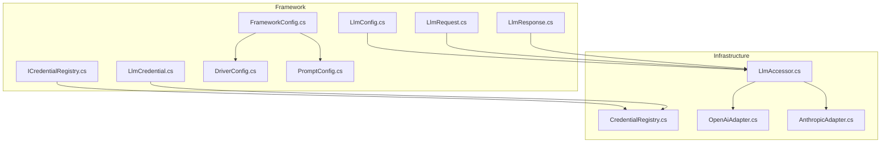
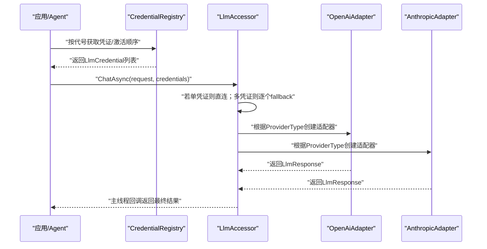
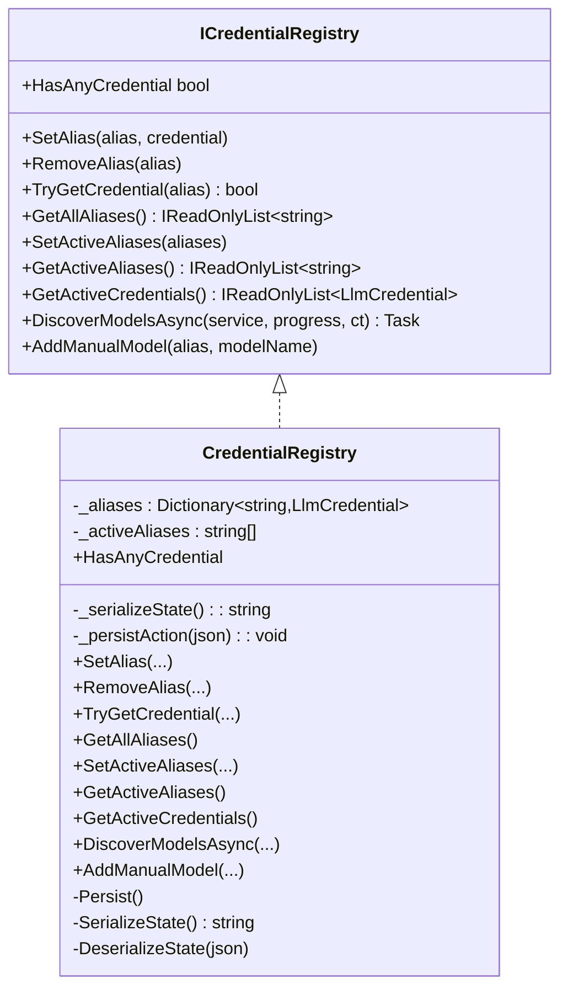
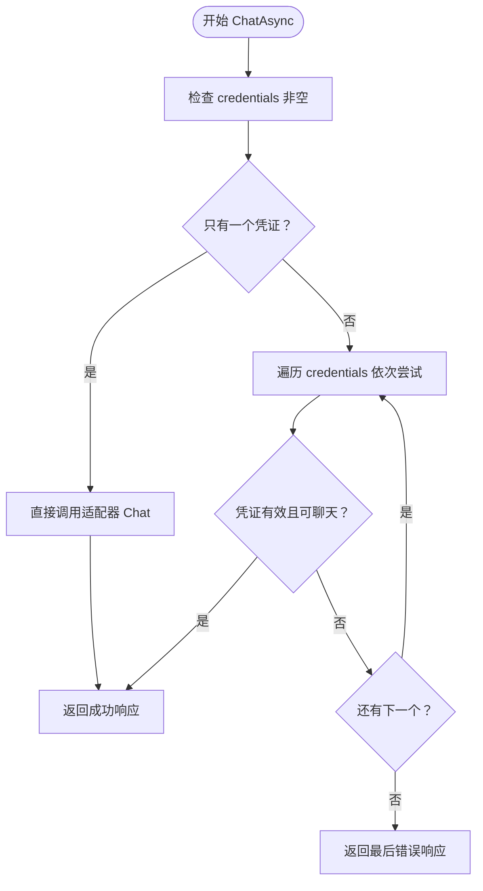
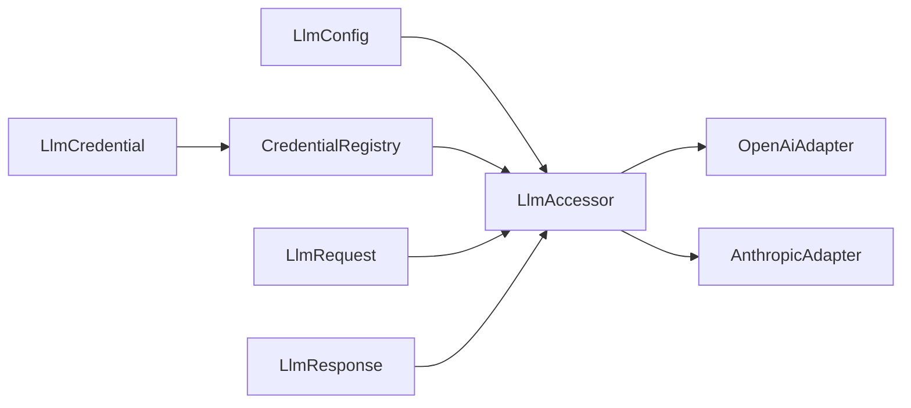

# LLM配置管理

<cite>
**本文引用的文件**
- [LlmConfig.cs](file://src/NPCLife/Framework/Llm/LlmConfig.cs)
- [LlmCredential.cs](file://src/NPCLife/Framework/Llm/LlmCredential.cs)
- [ICredentialRegistry.cs](file://src/NPCLife/Core/ICredentialRegistry.cs)
- [CredentialRegistry.cs](file://src/NPCLife/Infrastructure/Llm/CredentialRegistry.cs)
- [LlmAccessor.cs](file://src/NPCLife/Infrastructure/Llm/LlmAccessor.cs)
- [OpenAiAdapter.cs](file://src/NPCLife/Infrastructure/Llm/OpenAiAdapter.cs)
- [AnthropicAdapter.cs](file://src/NPCLife/Infrastructure/Llm/AnthropicAdapter.cs)
- [LlmRequest.cs](file://src/NPCLife/Framework/Llm/LlmRequest.cs)
- [LlmResponse.cs](file://src/NPCLife/Framework/Llm/LlmResponse.cs)
- [FrameworkConfig.cs](file://src/NPCLife/Framework/FrameworkConfig.cs)
- [DriverConfig.cs](file://src/NPCLife/Driver/DriverConfig.cs)
- [PromptConfig.cs](file://src/NPCLife/Driver/PromptConfig.cs)
</cite>

## 目录
1. [简介](#简介)
2. [项目结构](#项目结构)
3. [核心组件](#核心组件)
4. [架构总览](#架构总览)
5. [组件详解](#组件详解)
6. [依赖关系分析](#依赖关系分析)
7. [性能考量](#性能考量)
8. [故障排除指南](#故障排除指南)
9. [结论](#结论)
10. [附录](#附录)

## 简介
本文件系统性阐述NPCLife项目的LLM配置管理体系，重点覆盖以下方面：
- LlmConfig的配置结构与参数语义（模型选择、温度、超时等）
- 凭证注册与管理机制（CredentialRegistry）及存储、验证、轮换策略
- 配置加载顺序、优先级与继承关系
- 配置热更新与运行时修改能力
- 不同使用场景的最佳实践（开发、测试、生产）
- 配置文件示例与常见问题排查

## 项目结构
围绕LLM配置管理的关键目录与文件如下：
- Framework层：定义统一的数据模型与接口，如LlmConfig、LlmCredential、LlmRequest、LlmResponse等
- Infrastructure层：提供具体实现，如CredentialRegistry、LlmAccessor、OpenAiAdapter、AnthropicAdapter
- Driver层：与提示词与采样参数相关的PromptConfig，以及与Agent驱动相关的DriverConfig
- Core层：抽象接口ICredentialRegistry，定义凭证注册表的职责边界

图表来源
- [LlmConfig.cs:1-69](file://src/NPCLife/Framework/Llm/LlmConfig.cs#L1-L69)
- [LlmCredential.cs:1-84](file://src/NPCLife/Framework/Llm/LlmCredential.cs#L1-L84)
- [ICredentialRegistry.cs:1-102](file://src/NPCLife/Core/ICredentialRegistry.cs#L1-L102)
- [CredentialRegistry.cs:1-327](file://src/NPCLife/Infrastructure/Llm/CredentialRegistry.cs#L1-L327)
- [LlmAccessor.cs:1-331](file://src/NPCLife/Infrastructure/Llm/LlmAccessor.cs#L1-L331)
- [OpenAiAdapter.cs:1-392](file://src/NPCLife/Infrastructure/Llm/OpenAiAdapter.cs#L1-L392)
- [AnthropicAdapter.cs:1-434](file://src/NPCLife/Infrastructure/Llm/AnthropicAdapter.cs#L1-L434)
- [FrameworkConfig.cs:1-248](file://src/NPCLife/Framework/FrameworkConfig.cs#L1-L248)
- [DriverConfig.cs:1-107](file://src/NPCLife/Driver/DriverConfig.cs#L1-L107)
- [PromptConfig.cs:1-164](file://src/NPCLife/Driver/PromptConfig.cs#L1-L164)

章节来源
- [LlmConfig.cs:1-69](file://src/NPCLife/Framework/Llm/LlmConfig.cs#L1-L69)
- [LlmCredential.cs:1-84](file://src/NPCLife/Framework/Llm/LlmCredential.cs#L1-L84)
- [ICredentialRegistry.cs:1-102](file://src/NPCLife/Core/ICredentialRegistry.cs#L1-L102)
- [CredentialRegistry.cs:1-327](file://src/NPCLife/Infrastructure/Llm/CredentialRegistry.cs#L1-L327)
- [LlmAccessor.cs:1-331](file://src/NPCLife/Infrastructure/Llm/LlmAccessor.cs#L1-L331)
- [OpenAiAdapter.cs:1-392](file://src/NPCLife/Infrastructure/Llm/OpenAiAdapter.cs#L1-L392)
- [AnthropicAdapter.cs:1-434](file://src/NPCLife/Infrastructure/Llm/AnthropicAdapter.cs#L1-L434)
- [FrameworkConfig.cs:1-248](file://src/NPCLife/Framework/FrameworkConfig.cs#L1-L248)
- [DriverConfig.cs:1-107](file://src/NPCLife/Driver/DriverConfig.cs#L1-L107)
- [PromptConfig.cs:1-164](file://src/NPCLife/Driver/PromptConfig.cs#L1-L164)

## 核心组件
- LlmConfig：全局配置容器，包含BaseUrl、ApiKey、ModelName、ProviderType、ExtraHeaders、TimeoutSeconds，并提供IsValid与CreateDefault
- LlmCredential：纯数据传输对象，承载一次调用所需的凭据三元组（baseUrl、apiKey、modelName），并区分HasApiAccess与IsChatReady两类校验
- ICredentialRegistry：凭证注册表接口，定义别名管理、激活顺序、模型发现与持久化职责
- CredentialRegistry：接口实现，负责内存态与持久化的同步，支持多线程安全操作
- LlmAccessor：无状态访问器，按传入凭据动态创建适配器，支持多凭证fallback
- OpenAiAdapter/AnthropicAdapter：分别适配OpenAI/兼容API与Anthropic Messages API，负责HTTP请求构建、发送与响应解析
- LlmRequest/LlmResponse：统一的请求/响应模型，屏蔽不同供应商差异
- FrameworkConfig/DriverConfig/PromptConfig：框架整体配置、Agent驱动配置与提示词/采样参数配置

章节来源
- [LlmConfig.cs:23-66](file://src/NPCLife/Framework/Llm/LlmConfig.cs#L23-L66)
- [LlmCredential.cs:12-76](file://src/NPCLife/Framework/Llm/LlmCredential.cs#L12-L76)
- [ICredentialRegistry.cs:20-100](file://src/NPCLife/Core/ICredentialRegistry.cs#L20-L100)
- [CredentialRegistry.cs:20-326](file://src/NPCLife/Infrastructure/Llm/CredentialRegistry.cs#L20-L326)
- [LlmAccessor.cs:26-331](file://src/NPCLife/Infrastructure/Llm/LlmAccessor.cs#L26-L331)
- [OpenAiAdapter.cs:18-392](file://src/NPCLife/Infrastructure/Llm/OpenAiAdapter.cs#L18-L392)
- [AnthropicAdapter.cs:23-434](file://src/NPCLife/Infrastructure/Llm/AnthropicAdapter.cs#L23-L434)
- [LlmRequest.cs:9-44](file://src/NPCLife/Framework/Llm/LlmRequest.cs#L9-L44)
- [LlmResponse.cs:9-56](file://src/NPCLife/Framework/Llm/LlmResponse.cs#L9-L56)
- [FrameworkConfig.cs:17-248](file://src/NPCLife/Framework/FrameworkConfig.cs#L17-L248)
- [DriverConfig.cs:9-107](file://src/NPCLife/Driver/DriverConfig.cs#L9-L107)
- [PromptConfig.cs:14-164](file://src/NPCLife/Driver/PromptConfig.cs#L14-L164)

## 架构总览
下图展示从应用层到适配器层的调用链与职责划分。

图表来源
- [LlmAccessor.cs:47-191](file://src/NPCLife/Infrastructure/Llm/LlmAccessor.cs#L47-L191)
- [OpenAiAdapter.cs:38-74](file://src/NPCLife/Infrastructure/Llm/OpenAiAdapter.cs#L38-L74)
- [AnthropicAdapter.cs:43-68](file://src/NPCLife/Infrastructure/Llm/AnthropicAdapter.cs#L43-L68)
- [CredentialRegistry.cs:139-153](file://src/NPCLife/Infrastructure/Llm/CredentialRegistry.cs#L139-L153)

## 组件详解

### LlmConfig：配置结构与参数
- BaseUrl：API基础地址，默认OpenAI；可通过ExtraHeaders扩展代理场景
- ApiKey：API密钥
- ModelName：模型名称
- ProviderType：提供商类型（OpenAI/Anthropic），决定适配器选择
- ExtraHeaders：扩展HTTP头，用于代理或特殊网关
- TimeoutSeconds：HTTP请求超时（秒），默认120
- 校验：IsValid要求BaseUrl、ApiKey、ModelName均非空
- 默认：CreateDefault提供OpenAI默认值

章节来源
- [LlmConfig.cs:23-66](file://src/NPCLife/Framework/Llm/LlmConfig.cs#L23-L66)

### LlmCredential：凭证数据对象
- 与LlmConfig的区别：LlmCredential为纯数据传递对象，所有字段由调用方显式提供
- 校验：
  - HasApiAccess：baseUrl与apiKey非空即可（模型发现/连通性测试）
  - IsChatReady：baseUrl、apiKey、modelName均非空（聊天请求）
- Clone：浅拷贝字符串与字典引用，便于线程安全传递
- ToString：便于日志输出

章节来源
- [LlmCredential.cs:12-76](file://src/NPCLife/Framework/Llm/LlmCredential.cs#L12-L76)

### 凭证注册与管理：ICredentialRegistry与CredentialRegistry
- 别名管理：SetAlias/RemoveAlias/TryGetCredential/GetAllAliases/HasAnyCredential
- 激活顺序：SetActiveAliases/GetActiveAliases/GetActiveCredentials，形成fallback链路
- 模型发现：DiscoverModelsAsync按激活顺序查询可用模型；AddManualModel支持无法列表查询的API手动登记
- 持久化：SerializeState/DeserializeState通过宿主注入的序列化与持久化委托完成；Persist在变更后异步落盘
- 线程安全：内部锁保护状态；持久化失败不影响运行时

图表来源
- [ICredentialRegistry.cs:20-100](file://src/NPCLife/Core/ICredentialRegistry.cs#L20-L100)
- [CredentialRegistry.cs:20-326](file://src/NPCLife/Infrastructure/Llm/CredentialRegistry.cs#L20-L326)

章节来源
- [ICredentialRegistry.cs:20-100](file://src/NPCLife/Core/ICredentialRegistry.cs#L20-L100)
- [CredentialRegistry.cs:20-326](file://src/NPCLife/Infrastructure/Llm/CredentialRegistry.cs#L20-L326)

### LlmAccessor：访问器与多凭证fallback
- ChatAsync：支持单凭证直连与多凭证fallback；失败自动切换下一个；全部失败返回最后错误
- TestConnectionAsync/ListModelsAsync：连通性测试与模型列表查询
- CreateAdapter：按ProviderType创建适配器（每次调用新建实例）
- 线程模型：后台线程执行网络调用，主线程分发回调，避免UI阻塞

图表来源
- [LlmAccessor.cs:47-191](file://src/NPCLife/Infrastructure/Llm/LlmAccessor.cs#L47-L191)

章节来源
- [LlmAccessor.cs:26-331](file://src/NPCLife/Infrastructure/Llm/LlmAccessor.cs#L26-L331)

### 适配器：OpenAI与Anthropic
- OpenAiAdapter：
  - HTTP客户端基于TimeoutSeconds设置超时
  - 默认Authorization: Bearer，支持ExtraHeaders
  - 请求构建：model、messages、temperature、tools
  - 响应解析：choices[0].message.content、tool_calls、usage、model
- AnthropicAdapter：
  - 使用x-api-key与anthropic-version头部
  - system prompt置于顶层；tool_result以特殊content块表达
  - 响应解析：content数组中的text与tool_use，usage字段映射

章节来源
- [OpenAiAdapter.cs:18-392](file://src/NPCLife/Infrastructure/Llm/OpenAiAdapter.cs#L18-L392)
- [AnthropicAdapter.cs:23-434](file://src/NPCLife/Infrastructure/Llm/AnthropicAdapter.cs#L23-L434)

### 请求/响应模型：LlmRequest与LlmResponse
- LlmRequest：包含Model、Messages、ToolsJson、Temperature，提供SinglePrompt快捷构造
- LlmResponse：统一Content、ToolCalls、FinishReason、Usage指标、Model、Error与IsSuccess/HasToolCalls辅助判断

章节来源
- [LlmRequest.cs:9-44](file://src/NPCLife/Framework/Llm/LlmRequest.cs#L9-L44)
- [LlmResponse.cs:9-56](file://src/NPCLife/Framework/Llm/LlmResponse.cs#L9-L56)

### 框架与提示词配置：FrameworkConfig、DriverConfig、PromptConfig
- FrameworkConfig：合并优先级（默认值 < 配置文件 < 代码覆盖），支持Freeze冻结后禁止修改
- DriverConfig：控制Agent驱动行为的阈值、定时器与轮数限制
- PromptConfig：提示词与采样温度配置，支持从EmbeddedResource加载默认值与序列化/反序列化

章节来源
- [FrameworkConfig.cs:17-248](file://src/NPCLife/Framework/FrameworkConfig.cs#L17-L248)
- [DriverConfig.cs:9-107](file://src/NPCLife/Driver/DriverConfig.cs#L9-L107)
- [PromptConfig.cs:14-164](file://src/NPCLife/Driver/PromptConfig.cs#L14-L164)

## 依赖关系分析
- 组件耦合
  - LlmAccessor依赖ILlmApiProvider（适配器），通过LlmCredential动态创建
  - CredentialRegistry实现ICredentialRegistry，被应用层用于获取凭证与管理激活顺序
  - LlmConfig与LlmCredential在职责上互补：前者偏向全局与默认值，后者偏向调用时的显式传递
- 外部依赖
  - HttpClient与JSON解析器（JsonWriter/JsonParser）用于HTTP与序列化
  - 日志接口ILogger用于调试与错误输出
- 循环依赖
  - 未见循环依赖；各层职责清晰：Framework（模型）< Infrastructure（实现）< Core（接口）

图表来源
- [LlmConfig.cs:23-66](file://src/NPCLife/Framework/Llm/LlmConfig.cs#L23-L66)
- [LlmCredential.cs:12-76](file://src/NPCLife/Framework/Llm/LlmCredential.cs#L12-L76)
- [CredentialRegistry.cs:20-326](file://src/NPCLife/Infrastructure/Llm/CredentialRegistry.cs#L20-L326)
- [LlmAccessor.cs:26-331](file://src/NPCLife/Infrastructure/Llm/LlmAccessor.cs#L26-L331)
- [OpenAiAdapter.cs:18-392](file://src/NPCLife/Infrastructure/Llm/OpenAiAdapter.cs#L18-L392)
- [AnthropicAdapter.cs:23-434](file://src/NPCLife/Infrastructure/Llm/AnthropicAdapter.cs#L23-L434)
- [LlmRequest.cs:9-44](file://src/NPCLife/Framework/Llm/LlmRequest.cs#L9-L44)
- [LlmResponse.cs:9-56](file://src/NPCLife/Framework/Llm/LlmResponse.cs#L9-L56)

## 性能考量
- 超时设置：适配器基于TimeoutSeconds设置HttpClient超时，避免长时间阻塞
- 线程模型：后台线程执行网络I/O，主线程仅做回调分发，降低UI卡顿风险
- 多凭证fallback：按激活顺序逐一尝试，适合高可用部署；建议将高可用凭证置于前面
- JSON序列化：CredentialRegistry使用流式写入减少内存分配
- 适配器实例：每次调用创建新适配器与HttpClient，避免跨调用状态污染，但需注意连接成本

## 故障排除指南
- 连接失败
  - 检查BaseUrl与ApiKey是否正确；使用TestConnectionAsync进行连通性测试
  - 查看HTTP状态码与错误体，适配器会在非成功状态时读取响应体并抛出异常
- 模型不可用
  - 使用DiscoverModelsAsync或ListModelsAsync确认可用模型列表
  - 对于Anthropic等不支持列表查询的API，使用AddManualModel手动登记
- 超时问题
  - 调整TimeoutSeconds；确保网络稳定与代理配置正确
- 多凭证fallback
  - 检查激活顺序与凭证有效性；确保HasApiAccess/IsChatReady满足
- 持久化失败
  - CredentialRegistry的持久化失败不会影响运行时，但可能导致重启后配置丢失

章节来源
- [LlmAccessor.cs:196-240](file://src/NPCLife/Infrastructure/Llm/LlmAccessor.cs#L196-L240)
- [OpenAiAdapter.cs:179-200](file://src/NPCLife/Infrastructure/Llm/OpenAiAdapter.cs#L179-L200)
- [AnthropicAdapter.cs:135-146](file://src/NPCLife/Infrastructure/Llm/AnthropicAdapter.cs#L135-L146)
- [CredentialRegistry.cs:232-247](file://src/NPCLife/Infrastructure/Llm/CredentialRegistry.cs#L232-L247)

## 结论
本配置体系通过“配置对象+凭证注册表+访问器+适配器”的分层设计，实现了：
- 明确的职责分离与可替换性（ProviderType决定适配器）
- 可靠的凭证管理与多凭证fallback
- 可观测的日志与错误处理
- 可扩展的持久化与运行时修改能力

建议在不同环境中遵循相应的最佳实践，确保稳定性与可维护性。

## 附录

### 配置加载顺序与优先级
- FrameworkConfig合并优先级（低→高）：默认值 < 配置文件(FrameworkConfig.FromJson) < 代码覆盖
- 冻结机制：调用Freeze后禁止修改，保证运行时配置不可变
- 建议：在初始化阶段完成配置加载与校验，随后冻结

章节来源
- [FrameworkConfig.cs:12-49](file://src/NPCLife/Framework/FrameworkConfig.cs#L12-L49)
- [FrameworkConfig.cs:196-205](file://src/NPCLife/Framework/FrameworkConfig.cs#L196-L205)

### 配置热更新与运行时修改
- 凭证注册表：支持运行时SetAlias/RemoveAlias/SetActiveAliases，变更后自动持久化
- 访问器：无状态设计，按传入凭据即时生效
- 注意：FrameworkConfig冻结后禁止修改；LlmConfig与LlmCredential为数据对象，建议通过注册表统一管理

章节来源
- [CredentialRegistry.cs:58-80](file://src/NPCLife/Infrastructure/Llm/CredentialRegistry.cs#L58-L80)
- [CredentialRegistry.cs:119-129](file://src/NPCLife/Infrastructure/Llm/CredentialRegistry.cs#L119-L129)
- [LlmAccessor.cs:26-36](file://src/NPCLife/Infrastructure/Llm/LlmAccessor.cs#L26-L36)
- [FrameworkConfig.cs:41-49](file://src/NPCLife/Framework/FrameworkConfig.cs#L41-L49)

### 不同场景最佳实践
- 开发环境
  - 使用较短TimeoutSeconds以便快速反馈
  - 启用详细日志（FrameworkConfig.Diagnostics）与工具调用追踪（PromptConfig.StyleInstruction配合）
- 测试环境
  - 通过CredentialRegistry设置多套凭证，验证fallback链路
  - 使用DiscoverModelsAsync核对模型可用性
- 生产环境
  - 将高可用凭证置于激活顺序前端
  - 冻结FrameworkConfig，避免运行时误改
  - 使用持久化配置，确保重启后状态一致

章节来源
- [FrameworkConfig.cs:211-246](file://src/NPCLife/Framework/FrameworkConfig.cs#L211-L246)
- [PromptConfig.cs:14-164](file://src/NPCLife/Driver/PromptConfig.cs#L14-L164)
- [CredentialRegistry.cs:159-209](file://src/NPCLife/Infrastructure/Llm/CredentialRegistry.cs#L159-L209)
- [FrameworkConfig.cs:41-49](file://src/NPCLife/Framework/FrameworkConfig.cs#L41-L49)

### 配置文件示例（说明性）
- LlmCredential（凭证三元组）
  - 字段：baseUrl、apiKey、modelName、providerType、extraHeaders、timeoutSeconds
  - 用途：作为调用参数传入LlmAccessor
- CredentialRegistry（凭证注册表）
  - aliases：代号到凭证的映射
  - activeAliases：激活顺序列表
  - 用途：UI管理与运行时获取凭证
- FrameworkConfig（框架配置）
  - driver：DriverConfig
  - diagnostics：日志与追踪开关
  - features：功能开关
  - 用途：整体框架行为控制
- PromptConfig（提示词与采样）
  - directorPrompt/screenwriterPrompt/freelancerPrompt、styleInstruction、temperature
  - 用途：Agent系统提示词与采样参数

章节来源
- [LlmCredential.cs:12-76](file://src/NPCLife/Framework/Llm/LlmCredential.cs#L12-L76)
- [CredentialRegistry.cs:249-273](file://src/NPCLife/Infrastructure/Llm/CredentialRegistry.cs#L249-L273)
- [FrameworkConfig.cs:77-194](file://src/NPCLife/Framework/FrameworkConfig.cs#L77-L194)
- [PromptConfig.cs:115-153](file://src/NPCLife/Driver/PromptConfig.cs#L115-L153)