# LLM集成系统

<cite>
**本文档引用的文件**
- [ILlmApiProvider.cs](file://src/NPCLife/Core/ILlmApiProvider.cs)
- [ILlmService.cs](file://src/NPCLife/Core/ILlmService.cs)
- [LlmConfig.cs](file://src/NPCLife/Framework/Llm/LlmConfig.cs)
- [LlmCredential.cs](file://src/NPCLife/Framework/Llm/LlmCredential.cs)
- [LlmMessage.cs](file://src/NPCLife/Framework/Llm/LlmMessage.cs)
- [LlmRequest.cs](file://src/NPCLife/Framework/Llm/LlmRequest.cs)
- [LlmResponse.cs](file://src/NPCLife/Framework/Llm/LlmResponse.cs)
- [LlmToolCall.cs](file://src/NPCLife/Framework/Llm/LlmToolCall.cs)
- [OpenAiAdapter.cs](file://src/NPCLife/Infrastructure/Llm/OpenAiAdapter.cs)
- [AnthropicAdapter.cs](file://src/NPCLife/Infrastructure/Llm/AnthropicAdapter.cs)
- [LlmAccessor.cs](file://src/NPCLife/Infrastructure/Llm/LlmAccessor.cs)
- [CredentialRegistry.cs](file://src/NPCLife/Infrastructure/Llm/CredentialRegistry.cs)
- [TranscriptValidator.cs](file://src/NPCLife/Framework/Llm/TranscriptValidator.cs)
- [ICredentialStore.cs](file://src/NPCLife/Core/ICredentialStore.cs)
- [AgentLoop.cs](file://src/NPCLife/Agent/AgentLoop.cs)
- [IWorkspace.cs](file://src/NPCLife/Workspace/IWorkspace.cs)
- [WorkspaceImpl.cs](file://src/NPCLife/Workspace/WorkspaceImpl.cs)
</cite>

## 更新摘要
**变更内容**
- 新增AgentLoop的凭证解析改进功能，支持基于模型引用的凭证解析
- 新增工作空间模型引用功能，支持为不同工作空间配置不同的模型引用
- 新增ICredentialStore接口，提供更灵活的凭证管理架构
- 更新凭证管理架构，支持运行时凭证解析和模型引用配置

## 目录
1. [简介](#简介)
2. [项目结构](#项目结构)
3. [核心组件](#核心组件)
4. [架构总览](#架构总览)
5. [组件详解](#组件详解)
6. [依赖关系分析](#依赖关系分析)
7. [性能考量](#性能考量)
8. [故障排查指南](#故障排查指南)
9. [结论](#结论)
10. [附录](#附录)

## 简介
本文件面向LLM集成系统，系统采用"统一接口 + 适配器模式"的设计，对外暴露统一的异步服务接口，对内通过适配器对接不同LLM提供商（OpenAI及兼容API、Anthropic）。系统提供凭证管理、配置管理、消息格式标准化、工具调用与响应解析、连通性测试与模型列举、以及跨线程回调的UI友好机制。本文档将深入解释设计理念、抽象层次、实现细节与最佳实践。

**更新** 系统现已支持新的凭证管理架构，包括AgentLoop的凭证解析改进和工作空间模型引用功能，为不同工作空间提供灵活的模型配置能力。

## 项目结构
系统采用分层与职责分离的组织方式：
- Core 层：定义对外统一接口与内部数据模型契约（ILlmService、ILlmApiProvider、Llm* 数据类、ICredentialStore）
- Framework 层：定义LLM领域模型（LlmConfig、LlmCredential、LlmMessage、LlmRequest、LlmResponse、LlmToolCall、TranscriptValidator）
- Infrastructure 层：实现具体适配器（OpenAiAdapter、AnthropicAdapter）与访问器（LlmAccessor）、凭证注册表（CredentialRegistry）

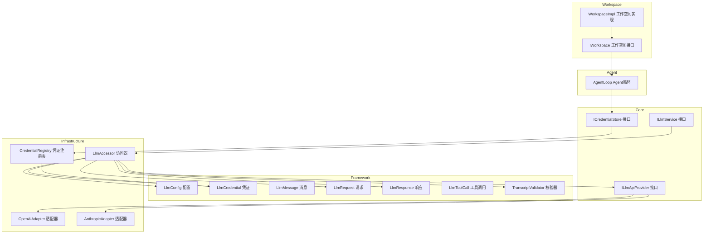

**图表来源**
- [ILlmService.cs:17-51](file://src/NPCLife/Core/ILlmService.cs#L17-L51)
- [ILlmApiProvider.cs:12-35](file://src/NPCLife/Core/ILlmApiProvider.cs#L12-L35)
- [ICredentialStore.cs:11-30](file://src/NPCLife/Core/ICredentialStore.cs#L11-L30)
- [LlmAccessor.cs:26-331](file://src/NPCLife/Infrastructure/Llm/LlmAccessor.cs#L26-L331)
- [OpenAiAdapter.cs:18-392](file://src/NPCLife/Infrastructure/Llm/OpenAiAdapter.cs#L18-L392)
- [AnthropicAdapter.cs:23-434](file://src/NPCLife/Infrastructure/Llm/AnthropicAdapter.cs#L23-L434)
- [CredentialRegistry.cs:19-329](file://src/NPCLife/Infrastructure/Llm/CredentialRegistry.cs#L19-L329)
- [AgentLoop.cs:43-680](file://src/NPCLife/Agent/AgentLoop.cs#L43-680)
- [IWorkspace.cs:11-57](file://src/NPCLife/Workspace/IWorkspace.cs#L11-57)
- [WorkspaceImpl.cs:16-199](file://src/NPCLife/Workspace/WorkspaceImpl.cs#L16-199)

**章节来源**
- [ILlmService.cs:17-51](file://src/NPCLife/Core/ILlmService.cs#L17-L51)
- [LlmAccessor.cs:26-331](file://src/NPCLife/Infrastructure/Llm/LlmAccessor.cs#L26-L331)

## 核心组件
- 统一服务接口（ILlmService）：对外暴露异步聊天、连通性测试、模型列举能力；支持多凭证顺序回退。
- 统一API提供者接口（ILlmApiProvider）：内部适配器统一实现，屏蔽不同提供商差异。
- **新的凭证存储接口（ICredentialStore）**：提供运行时凭证解析能力，支持按凭证名和模型名解析凭证三元组。
- 内部数据模型：LlmConfig、LlmCredential、LlmMessage、LlmRequest、LlmResponse、LlmToolCall。
- 访问器（LlmAccessor）：无状态、按需创建适配器，负责线程调度与UI回调。
- 凭证注册表（CredentialRegistry）：管理"别名→凭证"映射、活动顺序与持久化，实现ICredentialStore接口。
- **AgentLoop增强**：支持基于模型引用的凭证解析，优先使用工作空间配置的模型引用，回退到全局激活凭证。
- **工作空间模型引用**：IWorkspace接口新增ModelRefs和CurrentModel属性，支持为不同工作空间配置不同的模型引用。
- 消息校验器（TranscriptValidator）：保证消息历史满足API约束。

**章节来源**
- [ILlmService.cs:17-51](file://src/NPCLife/Core/ILlmService.cs#L17-L51)
- [ILlmApiProvider.cs:12-35](file://src/NPCLife/Core/ILlmApiProvider.cs#L12-L35)
- [ICredentialStore.cs:11-30](file://src/NPCLife/Core/ICredentialStore.cs#L11-L30)
- [LlmConfig.cs:23-69](file://src/NPCLife/Framework/Llm/LlmConfig.cs#L23-L69)
- [LlmCredential.cs:12-84](file://src/NPCLife/Framework/Llm/LlmCredential.cs#L12-L84)
- [LlmMessage.cs:8-63](file://src/NPCLife/Framework/Llm/LlmMessage.cs#L8-L63)
- [LlmRequest.cs:9-46](file://src/NPCLife/Framework/Llm/LlmRequest.cs#L9-L46)
- [LlmResponse.cs:9-58](file://src/NPCLife/Framework/Llm/LlmResponse.cs#L9-L58)
- [LlmToolCall.cs:7-19](file://src/NPCLife/Framework/Llm/LlmToolCall.cs#L7-L19)
- [LlmAccessor.cs:26-331](file://src/NPCLife/Infrastructure/Llm/LlmAccessor.cs#L26-L331)
- [CredentialRegistry.cs:19-329](file://src/NPCLife/Infrastructure/Llm/CredentialRegistry.cs#L19-L329)
- [AgentLoop.cs:569-607](file://src/NPCLife/Agent/AgentLoop.cs#L569-L607)
- [IWorkspace.cs:32-36](file://src/NPCLife/Workspace/IWorkspace.cs#L32-L36)
- [TranscriptValidator.cs:16-105](file://src/NPCLife/Framework/Llm/TranscriptValidator.cs#L16-L105)

## 架构总览
系统以"服务接口—访问器—适配器—HTTP客户端"的链路执行请求；UI线程通过异步API发起，后台线程执行网络调用，完成后通过主线程分发器回调至UI线程，保证UI不被阻塞。**新的架构增加了ICredentialStore接口，为AgentLoop提供灵活的凭证解析能力。**

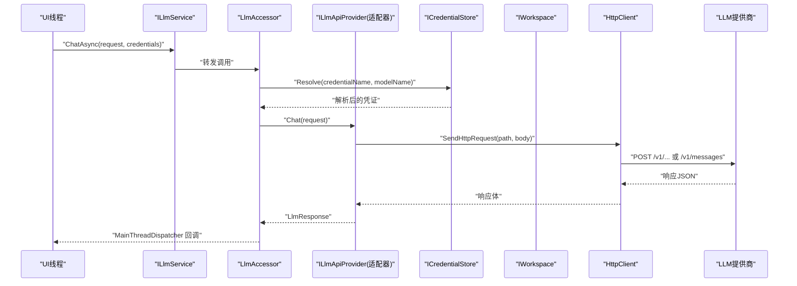

**图表来源**
- [ILlmService.cs:28-31](file://src/NPCLife/Core/ILlmService.cs#L28-L31)
- [LlmAccessor.cs:47-71](file://src/NPCLife/Infrastructure/Llm/LlmAccessor.cs#L47-L71)
- [OpenAiAdapter.cs:38-74](file://src/NPCLife/Infrastructure/Llm/OpenAiAdapter.cs#L38-L74)
- [AnthropicAdapter.cs:43-68](file://src/NPCLife/Infrastructure/Llm/AnthropicAdapter.cs#L43-L68)
- [ICredentialStore.cs:29](file://src/NPCLife/Core/ICredentialStore.cs#L29)

## 组件详解

### 统一服务接口与访问器
- ILlmService：定义ChatAsync、TestConnectionAsync、ListModelsAsync三个异步方法，均在后台线程执行HTTP，完成后通过主线程分发器回调。
- LlmAccessor：无状态实现，按凭证ProviderType动态创建适配器；支持单凭证直通与多凭证回退；对请求进行浅拷贝，避免回退过程互相污染。

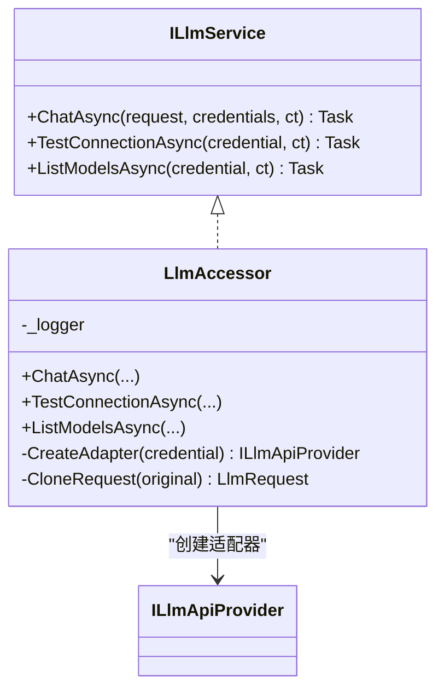

**图表来源**
- [ILlmService.cs:17-51](file://src/NPCLife/Core/ILlmService.cs#L17-L51)
- [LlmAccessor.cs:26-331](file://src/NPCLife/Infrastructure/Llm/LlmAccessor.cs#L26-L331)

**章节来源**
- [ILlmService.cs:17-51](file://src/NPCLife/Core/ILlmService.cs#L17-L51)
- [LlmAccessor.cs:26-331](file://src/NPCLife/Infrastructure/Llm/LlmAccessor.cs#L26-L331)

### AgentLoop凭证解析增强
**新的功能** AgentLoop现在支持基于模型引用的凭证解析，提供更灵活的工作空间配置能力。

- **模型引用解析**：支持从JSON配置中解析模型引用列表，格式为`[{"cred":"primary","model":"gpt-4o"},...]`
- **当前模型优先**：解析当前选中的模型引用，将其凭证放在列表首位
- **运行时解析**：通过ICredentialStore.Resolve(credentialName, modelName)进行实时凭证解析
- **回退机制**：当模型引用解析失败时，回退到全局激活凭证

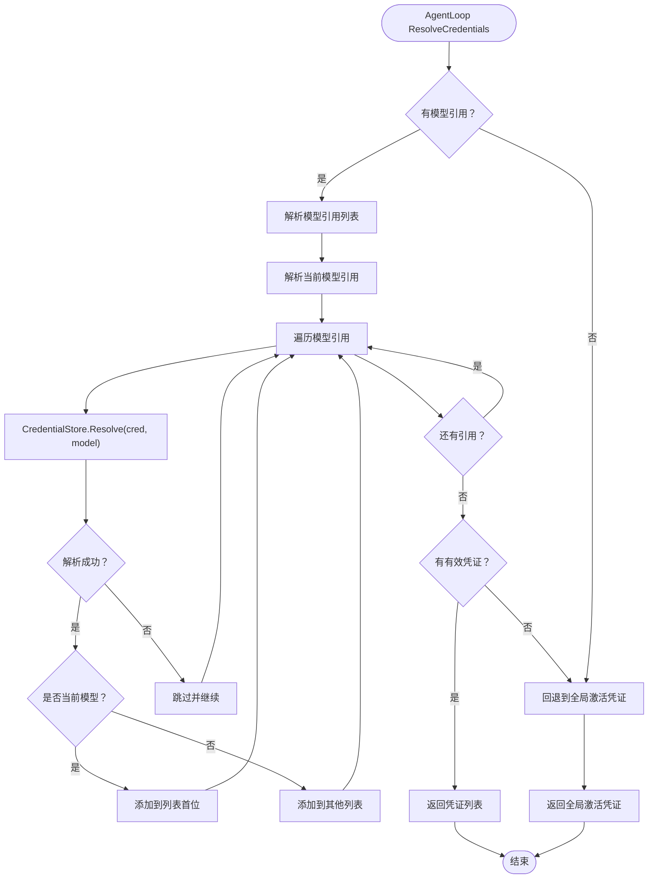

**图表来源**
- [AgentLoop.cs:569-607](file://src/NPCLife/Agent/AgentLoop.cs#L569-L607)
- [AgentLoop.cs:613-636](file://src/NPCLife/Agent/AgentLoop.cs#L613-L636)
- [AgentLoop.cs:642-655](file://src/NPCLife/Agent/AgentLoop.cs#L642-L655)

**章节来源**
- [AgentLoop.cs:569-607](file://src/NPCLife/Agent/AgentLoop.cs#L569-L607)
- [AgentLoop.cs:613-636](file://src/NPCLife/Agent/AgentLoop.cs#L613-L636)
- [AgentLoop.cs:642-655](file://src/NPCLife/Agent/AgentLoop.cs#L642-L655)

### 工作空间模型引用功能
**新的功能** 工作空间现在支持为不同的工作空间配置不同的模型引用，提供更精细的模型管理能力。

- **ModelRefs属性**：存储模型引用JSON字符串，数组顺序即调用优先级
- **CurrentModel属性**：存储当前选中模型的JSON（与ModelRefs条目同格式）
- **工作空间集成**：WorkspaceImpl实现IWorkspace接口，提供模型引用访问能力
- **持久化支持**：工作空间状态包含modelRefs和currentModel字段，支持序列化和反序列化

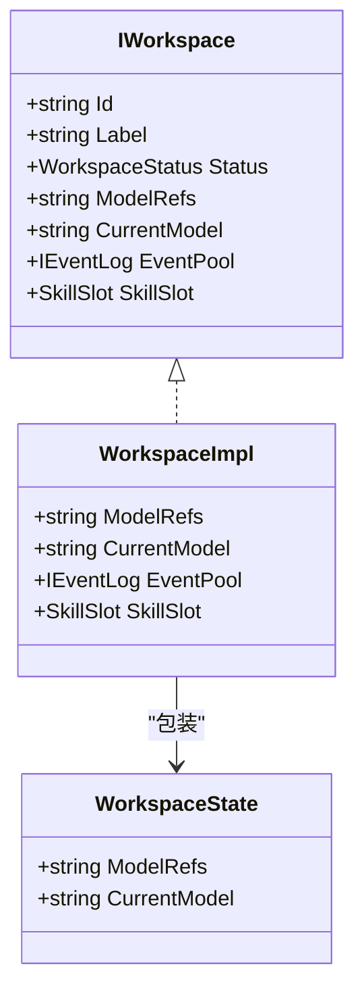

**图表来源**
- [IWorkspace.cs:32-36](file://src/NPCLife/Workspace/IWorkspace.cs#L32-L36)
- [WorkspaceImpl.cs:66-67](file://src/NPCLife/Workspace/WorkspaceImpl.cs#L66-L67)
- [WorkspaceImpl.cs:16-199](file://src/NPCLife/Workspace/WorkspaceImpl.cs#L16-L199)

**章节来源**
- [IWorkspace.cs:32-36](file://src/NPCLife/Workspace/IWorkspace.cs#L32-L36)
- [WorkspaceImpl.cs:66-67](file://src/NPCLife/Workspace/WorkspaceImpl.cs#L66-L67)
- [WorkspaceImpl.cs:16-199](file://src/NPCLife/Workspace/WorkspaceImpl.cs#L16-L199)

### 凭证存储接口与实现
**新的架构** 新增ICredentialStore接口，提供更灵活的凭证管理能力。

- **ICredentialStore接口**：定义运行时凭证获取和解析能力
  - GetActiveCredentials()：获取当前激活顺序对应的凭证列表
  - HasCredentials属性：检查是否有任何可用凭证
  - Resolve(credentialName, modelName)：按凭证名和模型名解析凭证三元组
- **CredentialRegistry实现**：实现ICredentialStore接口，提供完整的凭证管理功能
  - 支持凭证的CRUD操作
  - 管理激活顺序和持久化
  - 提供模型设置功能

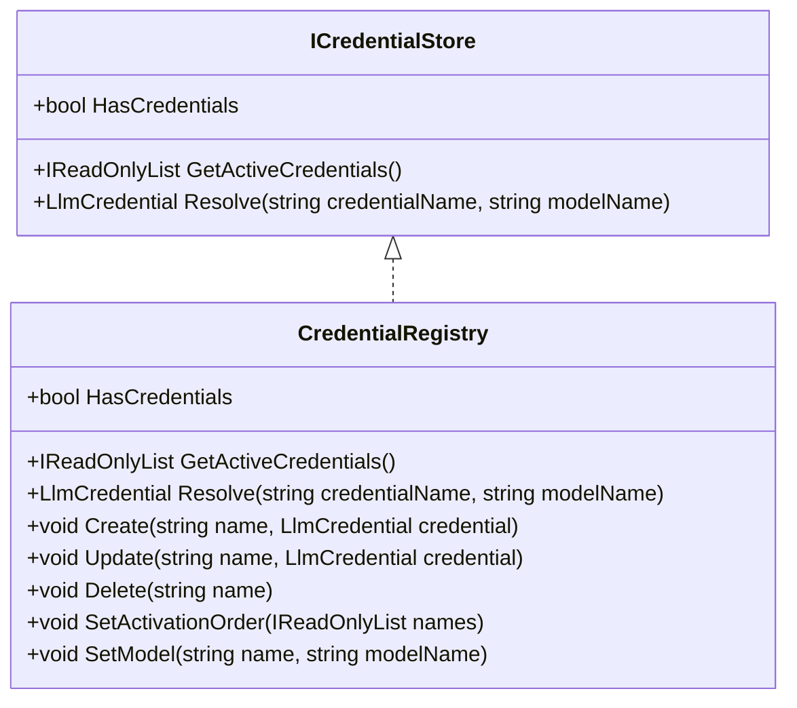

**图表来源**
- [ICredentialStore.cs:11-30](file://src/NPCLife/Core/ICredentialStore.cs#L11-L30)
- [CredentialRegistry.cs:57-91](file://src/NPCLife/Infrastructure/Llm/CredentialRegistry.cs#L57-L91)
- [CredentialRegistry.cs:97-228](file://src/NPCLife/Infrastructure/Llm/CredentialRegistry.cs#L97-L228)

**章节来源**
- [ICredentialStore.cs:11-30](file://src/NPCLife/Core/ICredentialStore.cs#L11-L30)
- [CredentialRegistry.cs:57-91](file://src/NPCLife/Infrastructure/Llm/CredentialRegistry.cs#L57-L91)
- [CredentialRegistry.cs:97-228](file://src/NPCLife/Infrastructure/Llm/CredentialRegistry.cs#L97-L228)

### OpenAI适配器
- 请求构建：将LlmRequest转换为OpenAI Chat Completions格式，支持temperature、tools、messages（含tool_calls）。
- 响应解析：提取choices[0].message.content或tool_calls，映射usage与model；错误时解析error.message。
- 连接测试：优先调用/v1/models，失败则发送最小聊天请求；超时捕获TaskCanceledException。
- 模型列举：调用/v1/models解析返回的id列表。

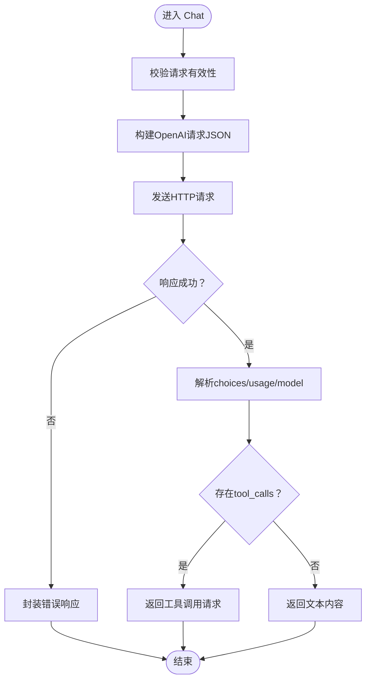

**图表来源**
- [OpenAiAdapter.cs:38-74](file://src/NPCLife/Infrastructure/Llm/OpenAiAdapter.cs#L38-L74)
- [OpenAiAdapter.cs:206-267](file://src/NPCLife/Infrastructure/Llm/OpenAiAdapter.cs#L206-L267)
- [OpenAiAdapter.cs:273-354](file://src/NPCLife/Infrastructure/Llm/OpenAiAdapter.cs#L273-L354)

**章节来源**
- [OpenAiAdapter.cs:18-392](file://src/NPCLife/Infrastructure/Llm/OpenAiAdapter.cs#L18-L392)

### Anthropic适配器
- 请求构建：system提示作为顶层system字段；messages过滤system后转换为content数组，其中tool调用以tool_use块表示；tools转换为Anthropic格式。
- 响应解析：从content数组提取text与tool_use，映射stop_reason到finish_reason，usage映射input_tokens/output_tokens与cache_read_input_tokens。
- 连接测试：直接发送最小请求；不支持/v1/models，ListModels返回空数组。
- 头部差异：使用x-api-key与anthropic-version头部。

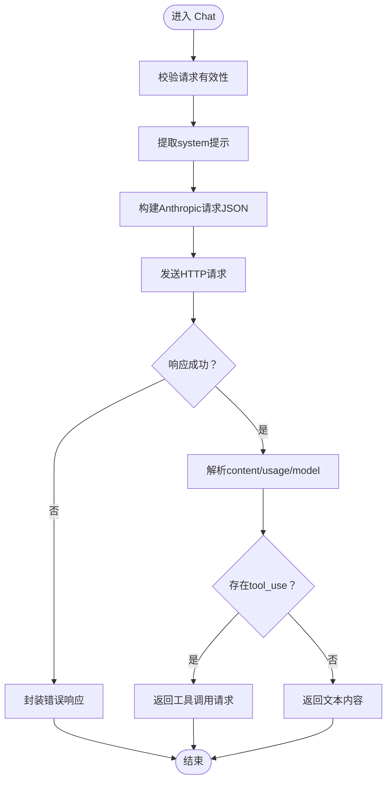

**图表来源**
- [AnthropicAdapter.cs:43-68](file://src/NPCLife/Infrastructure/Llm/AnthropicAdapter.cs#L43-L68)
- [AnthropicAdapter.cs:152-185](file://src/NPCLife/Infrastructure/Llm/AnthropicAdapter.cs#L152-L185)
- [AnthropicAdapter.cs:332-419](file://src/NPCLife/Infrastructure/Llm/AnthropicAdapter.cs#L332-L419)

**章节来源**
- [AnthropicAdapter.cs:23-434](file://src/NPCLife/Infrastructure/Llm/AnthropicAdapter.cs#L23-L434)

### 凭证与配置管理
- LlmConfig：全局配置，包含BaseUrl、ApiKey、ModelName、ProviderType、ExtraHeaders、TimeoutSeconds，提供IsValid与CreateDefault。
- LlmCredential：调用级凭证，IsChatReady用于聊天级校验，HasApiAccess用于连通性/模型列举等无需具体模型的场景。
- **CredentialRegistry增强**：实现ICredentialStore接口，提供运行时凭证解析能力，支持模型引用配置。

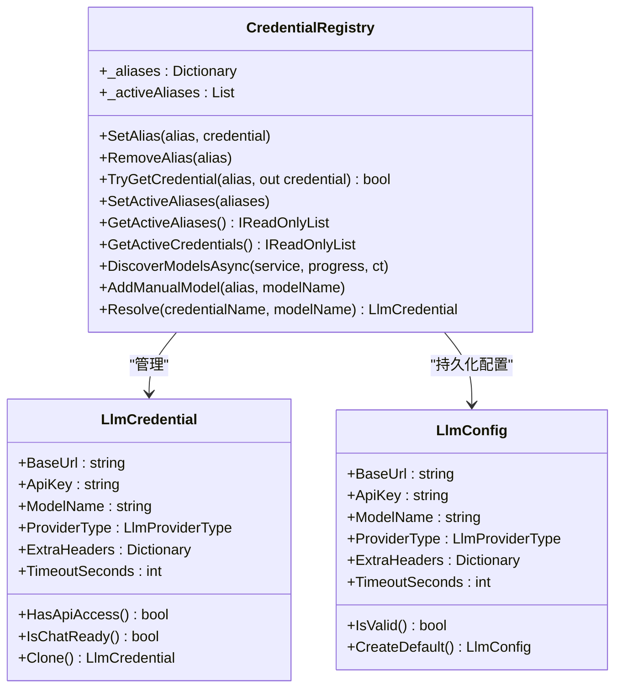

**图表来源**
- [LlmConfig.cs:23-69](file://src/NPCLife/Framework/Llm/LlmConfig.cs#L23-L69)
- [LlmCredential.cs:12-84](file://src/NPCLife/Framework/Llm/LlmCredential.cs#L12-L84)
- [CredentialRegistry.cs:20-329](file://src/NPCLife/Infrastructure/Llm/CredentialRegistry.cs#L20-L329)

**章节来源**
- [LlmConfig.cs:23-69](file://src/NPCLife/Framework/Llm/LlmConfig.cs#L23-L69)
- [LlmCredential.cs:12-84](file://src/NPCLife/Framework/Llm/LlmCredential.cs#L12-L84)
- [CredentialRegistry.cs:20-329](file://src/NPCLife/Infrastructure/Llm/CredentialRegistry.cs#L20-L329)

### 消息格式、工具调用与响应解析
- LlmMessage：统一消息载体，支持system/user/assistant/tool四种角色，assistant可携带ToolCalls，tool携带ToolCallId。
- LlmRequest：统一请求载体，包含Model、Messages、ToolsJson、Temperature。
- LlmResponse：统一响应载体，包含Content、ToolCalls、FinishReason、Usage统计、Model、Error与辅助判断属性。
- TranscriptValidator：在每轮调用前校验消息历史，确保system仅在首位、assistant不连续、tool调用与结果一一对应且不以tool结尾。

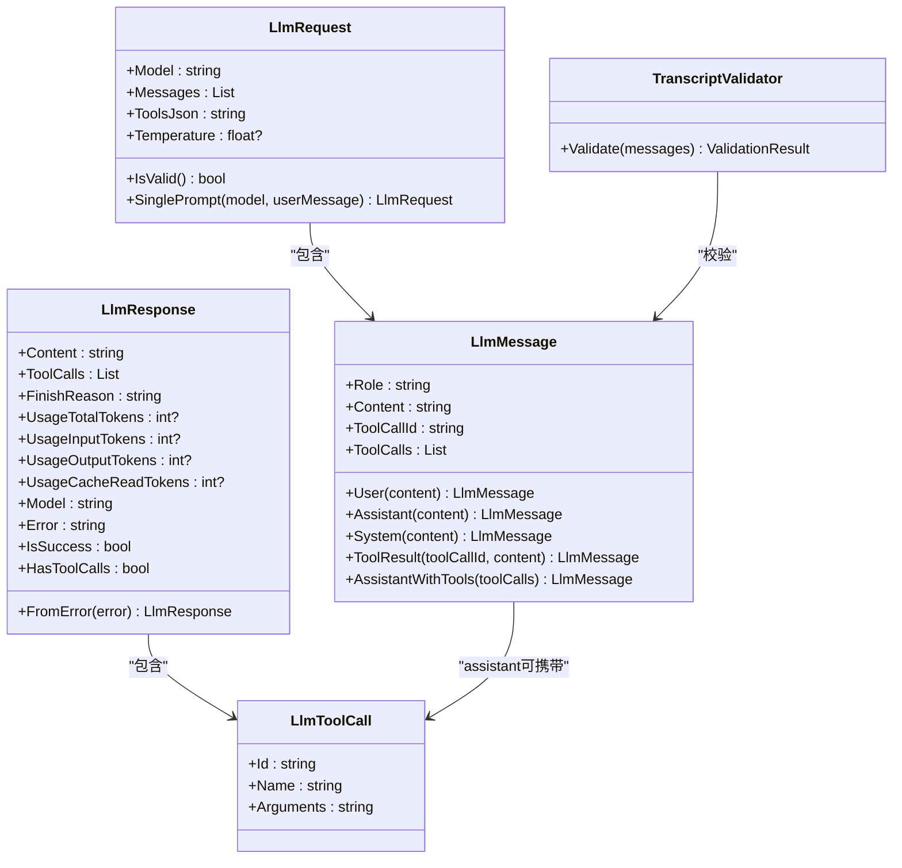

**图表来源**
- [LlmMessage.cs:8-63](file://src/NPCLife/Framework/Llm/LlmMessage.cs#L8-L63)
- [LlmRequest.cs:9-46](file://src/NPCLife/Framework/Llm/LlmRequest.cs#L9-L46)
- [LlmResponse.cs:9-58](file://src/NPCLife/Framework/Llm/LlmResponse.cs#L9-L58)
- [LlmToolCall.cs:7-19](file://src/NPCLife/Framework/Llm/LlmToolCall.cs#L7-L19)
- [TranscriptValidator.cs:16-105](file://src/NPCLife/Framework/Llm/TranscriptValidator.cs#L16-L105)

**章节来源**
- [LlmMessage.cs:8-63](file://src/NPCLife/Framework/Llm/LlmMessage.cs#L8-L63)
- [LlmRequest.cs:9-46](file://src/NPCLife/Framework/Llm/LlmRequest.cs#L9-L46)
- [LlmResponse.cs:9-58](file://src/NPCLife/Framework/Llm/LlmResponse.cs#L9-L58)
- [LlmToolCall.cs:7-19](file://src/NPCLife/Framework/Llm/LlmToolCall.cs#L7-L19)
- [TranscriptValidator.cs:16-105](file://src/NPCLife/Framework/Llm/TranscriptValidator.cs#L16-L105)

### 多凭证回退流程
- 当传入多个凭证时，按顺序尝试；任一成功即返回；全部失败返回最后一个错误。
- 每次尝试前对请求进行浅拷贝，避免前一次修改影响后续尝试。
- **新的凭证解析流程**：AgentLoop现在支持基于模型引用的凭证解析，提供更灵活的工作空间配置。

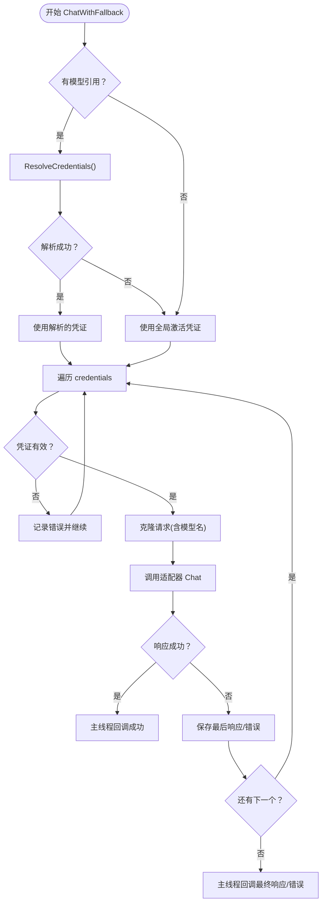

**图表来源**
- [LlmAccessor.cs:114-191](file://src/NPCLife/Infrastructure/Llm/LlmAccessor.cs#L114-L191)
- [AgentLoop.cs:569-607](file://src/NPCLife/Agent/AgentLoop.cs#L569-L607)

**章节来源**
- [LlmAccessor.cs:114-191](file://src/NPCLife/Infrastructure/Llm/LlmAccessor.cs#L114-L191)
- [AgentLoop.cs:569-607](file://src/NPCLife/Agent/AgentLoop.cs#L569-L607)

## 依赖关系分析
- 抽象与实现解耦：ILlmService与ILlmApiProvider隔离了业务调用与提供商差异。
- **新的依赖关系**：AgentLoop现在依赖ICredentialStore接口，提供运行时凭证解析能力。
- 低耦合高内聚：LlmAccessor仅负责调度与回退，适配器专注协议转换。
- **凭证管理架构**：CredentialRegistry实现ICredentialStore接口，提供完整的凭证管理功能。
- 数据模型纯数据：LlmConfig/LlmCredential/LlmRequest/LlmResponse/LlmToolCall均为无副作用的数据类，便于测试与复用。
- 外部依赖可控：HttpClient按凭证创建，避免共享状态；日志通过ILogger注入。

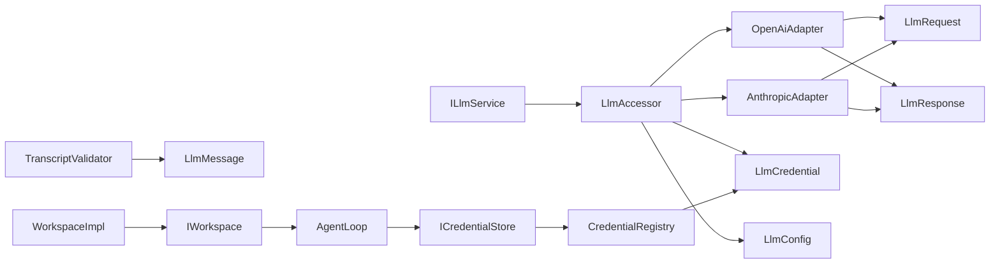

**图表来源**
- [ILlmService.cs:17-51](file://src/NPCLife/Core/ILlmService.cs#L17-L51)
- [LlmAccessor.cs:290-303](file://src/NPCLife/Infrastructure/Llm/LlmAccessor.cs#L290-L303)
- [OpenAiAdapter.cs:18-392](file://src/NPCLife/Infrastructure/Llm/OpenAiAdapter.cs#L18-L392)
- [AnthropicAdapter.cs:23-434](file://src/NPCLife/Infrastructure/Llm/AnthropicAdapter.cs#L23-L434)
- [CredentialRegistry.cs:20-329](file://src/NPCLife/Infrastructure/Llm/CredentialRegistry.cs#L20-L329)
- [TranscriptValidator.cs:16-105](file://src/NPCLife/Framework/Llm/TranscriptValidator.cs#L16-L105)
- [ICredentialStore.cs:11-30](file://src/NPCLife/Core/ICredentialStore.cs#L11-L30)
- [AgentLoop.cs:47](file://src/NPCLife/Agent/AgentLoop.cs#L47)
- [IWorkspace.cs:11-57](file://src/NPCLife/Workspace/IWorkspace.cs#L11-57)
- [WorkspaceImpl.cs:16-199](file://src/NPCLife/Workspace/WorkspaceImpl.cs#L16-199)

**章节来源**
- [ILlmService.cs:17-51](file://src/NPCLife/Core/ILlmService.cs#L17-L51)
- [LlmAccessor.cs:290-303](file://src/NPCLife/Infrastructure/Llm/LlmAccessor.cs#L290-L303)
- [OpenAiAdapter.cs:18-392](file://src/NPCLife/Infrastructure/Llm/OpenAiAdapter.cs#L18-L392)
- [AnthropicAdapter.cs:23-434](file://src/NPCLife/Infrastructure/Llm/AnthropicAdapter.cs#L23-L434)
- [CredentialRegistry.cs:20-329](file://src/NPCLife/Infrastructure/Llm/CredentialRegistry.cs#L20-L329)
- [TranscriptValidator.cs:16-105](file://src/NPCLife/Framework/Llm/TranscriptValidator.cs#L16-L105)
- [ICredentialStore.cs:11-30](file://src/NPCLife/Core/ICredentialStore.cs#L11-L30)
- [AgentLoop.cs:47](file://src/NPCLife/Agent/AgentLoop.cs#L47)
- [IWorkspace.cs:11-57](file://src/NPCLife/Workspace/IWorkspace.cs#L11-57)
- [WorkspaceImpl.cs:16-199](file://src/NPCLife/Workspace/WorkspaceImpl.cs#L16-199)

## 性能考量
- 线程模型：所有HTTP调用在后台线程执行，完成后通过主线程分发器回调，避免UI阻塞。
- 超时控制：基于LlmCredential.TimeoutSeconds设置HttpClient.Timeout，防止长时间挂起。
- 回退策略：多凭证回退减少单点故障带来的失败率，提升整体成功率。
- **凭证解析优化**：AgentLoop的凭证解析采用缓存机制，避免重复解析相同的工作空间配置。
- **模型引用解析**：支持JSON解析缓存，减少重复解析开销。
- 日志与可观测性：适配器在调试阶段记录请求/响应摘要，便于定位问题。
- 成本与Token：LlmResponse提供UsageTotalTokens/UsageInputTokens/UsageOutputTokens/UsageCacheReadTokens，便于成本与性能分析。

**章节来源**
- [LlmAccessor.cs:78-112](file://src/NPCLife/Infrastructure/Llm/LlmAccessor.cs#L78-L112)
- [OpenAiAdapter.cs:149-177](file://src/NPCLife/Infrastructure/Llm/OpenAiAdapter.cs#L149-L177)
- [AnthropicAdapter.cs:106-133](file://src/NPCLife/Infrastructure/Llm/AnthropicAdapter.cs#L106-L133)
- [LlmResponse.cs:22-36](file://src/NPCLife/Framework/Llm/LlmResponse.cs#L22-L36)
- [AgentLoop.cs:569-607](file://src/NPCLife/Agent/AgentLoop.cs#L569-L607)

## 故障排查指南
- 连接测试失败
  - 检查BaseUrl与ApiKey是否正确；OpenAI路径优先尝试/v1/models，失败再走最小聊天请求。
  - 查看HTTP状态码与错误体，适配器会抛出HttpRequestException并封装为错误响应。
- 超时
  - 检查TimeoutSeconds配置；OpenAI适配器捕获TaskCanceledException并返回"Request timed out"。
- 模型不可用
  - Anthropic不支持/v1/models，返回空数组；可通过手动添加模型名或使用兼容API。
- 工具调用异常
  - 确认LlmRequest.ToolsJson符合MCP标准tools格式；assistant消息的ToolCalls与tool结果消息的ToolCallId需一一对应。
  - 使用TranscriptValidator提前发现消息历史不合规问题。
- 多凭证回退
  - 若全部失败，检查每个凭证的IsChatReady与ProviderType是否匹配；查看回退日志定位失败凭证。
- **凭证解析失败**
  - 检查AgentLoop的modelRefsJson参数格式是否正确，应为`[{"cred":"primary","model":"gpt-4o"}]`格式。
  - 确认CredentialStore中是否存在对应的凭证名称。
  - 验证当前选中的模型引用格式是否正确。
- **工作空间模型引用问题**
  - 检查IWorkspace.ModelRefs和CurrentModel属性是否正确设置。
  - 确认工作空间状态的序列化和反序列化过程是否正常。
  - 验证工作空间持久化存储是否正确保存模型引用配置。

**章节来源**
- [OpenAiAdapter.cs:79-112](file://src/NPCLife/Infrastructure/Llm/OpenAiAdapter.cs#L79-L112)
- [AnthropicAdapter.cs:70-92](file://src/NPCLife/Infrastructure/Llm/AnthropicAdapter.cs#L70-L92)
- [LlmAccessor.cs:174-177](file://src/NPCLife/Infrastructure/Llm/LlmAccessor.cs#L174-L177)
- [TranscriptValidator.cs:37-102](file://src/NPCLife/Framework/Llm/TranscriptValidator.cs#L37-L102)
- [AgentLoop.cs:613-636](file://src/NPCLife/Agent/AgentLoop.cs#L613-L636)
- [IWorkspace.cs:32-36](file://src/NPCLife/Workspace/IWorkspace.cs#L32-L36)

## 结论
本系统通过统一接口与适配器模式，实现了对OpenAI与Anthropic的无缝集成，同时提供了凭证管理、消息校验、多凭证回退与可观测性支持。**最新的更新引入了新的凭证管理架构，包括AgentLoop的凭证解析改进和工作空间模型引用功能，为不同工作空间提供了灵活的模型配置能力。**其无状态设计与严格的线程模型保障了UI友好与可维护性，适合在复杂NPC交互场景中稳定运行。

## 附录

### 配置与凭证示例要点
- LlmConfig：设置BaseUrl、ApiKey、ModelName、ProviderType、ExtraHeaders、TimeoutSeconds；通过IsValid校验。
- LlmCredential：按调用需求提供BaseUrl、ApiKey、ModelName、ProviderType、ExtraHeaders、TimeoutSeconds；使用IsChatReady进行聊天级校验。
- **CredentialRegistry增强**：通过SetAlias/AddManualModel管理别名与模型；SetActiveAliases设定回退顺序；DiscoverModelsAsync批量查询模型；Resolve方法支持按凭证名和模型名解析凭证。
- **AgentLoop配置**：支持modelRefsJson和currentModel参数，实现基于工作空间的模型引用配置。
- **工作空间配置**：IWorkspace接口提供ModelRefs和CurrentModel属性，支持为不同工作空间配置不同的模型引用。

**章节来源**
- [LlmConfig.cs:23-69](file://src/NPCLife/Framework/Llm/LlmConfig.cs#L23-L69)
- [LlmCredential.cs:12-84](file://src/NPCLife/Framework/Llm/LlmCredential.cs#L12-L84)
- [CredentialRegistry.cs:58-227](file://src/NPCLife/Infrastructure/Llm/CredentialRegistry.cs#L58-L227)
- [AgentLoop.cs:87-100](file://src/NPCLife/Agent/AgentLoop.cs#L87-L100)
- [IWorkspace.cs:32-36](file://src/NPCLife/Workspace/IWorkspace.cs#L32-L36)