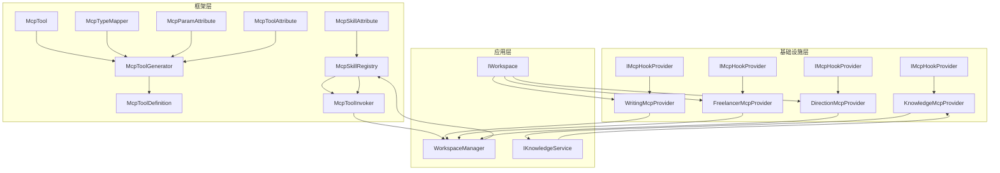
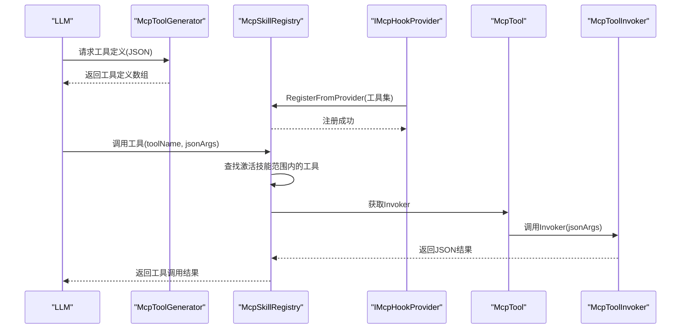
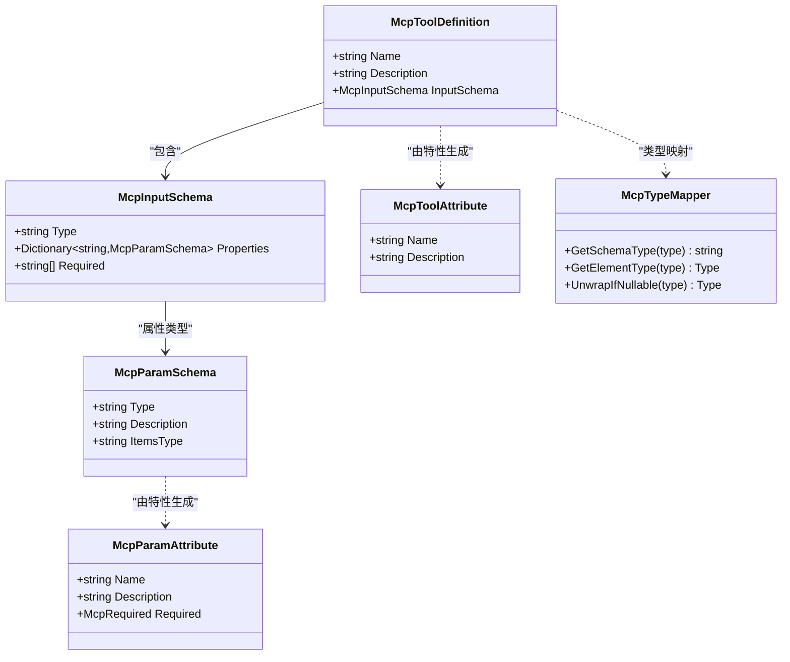
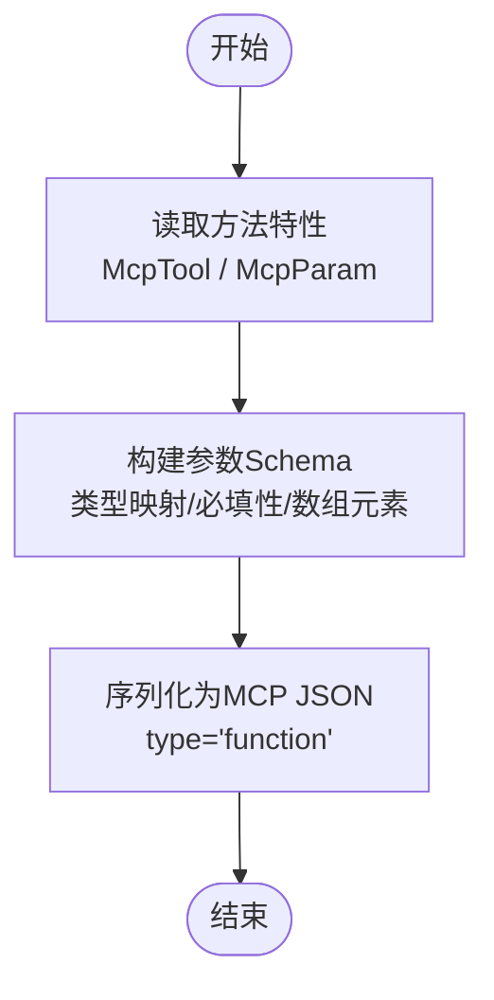
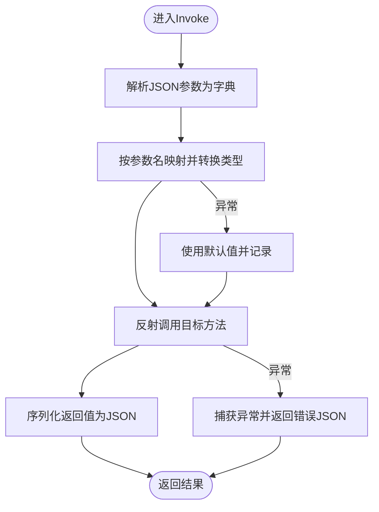
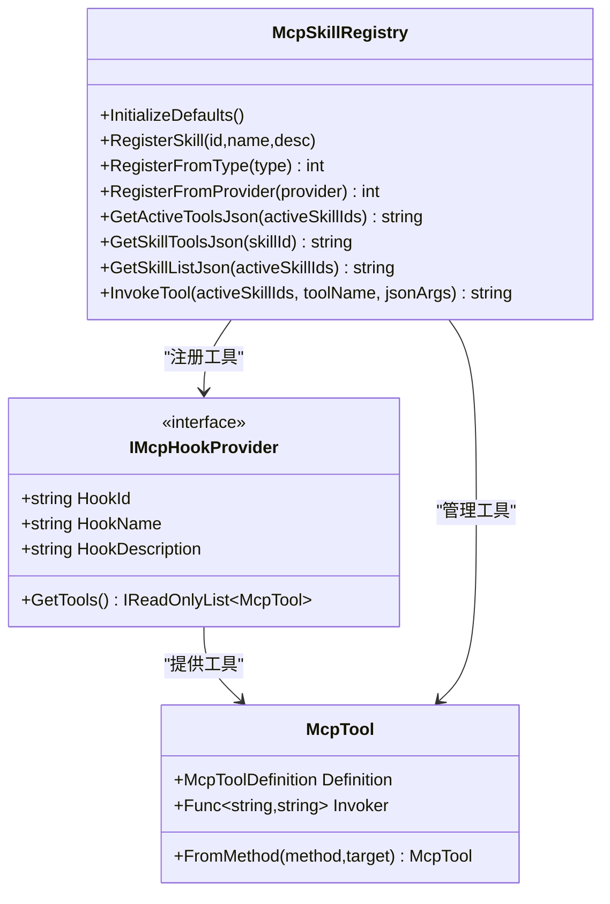
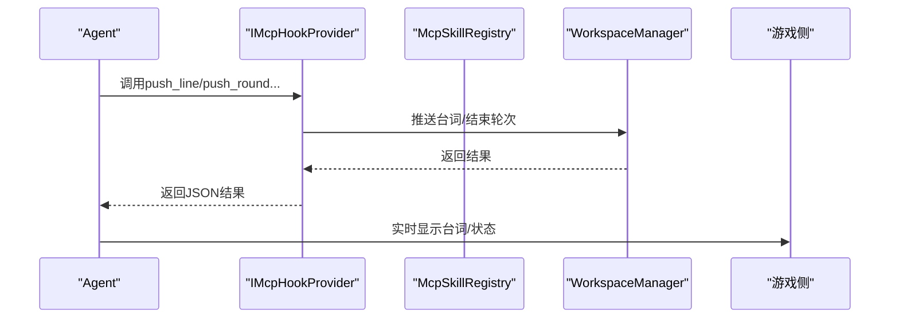
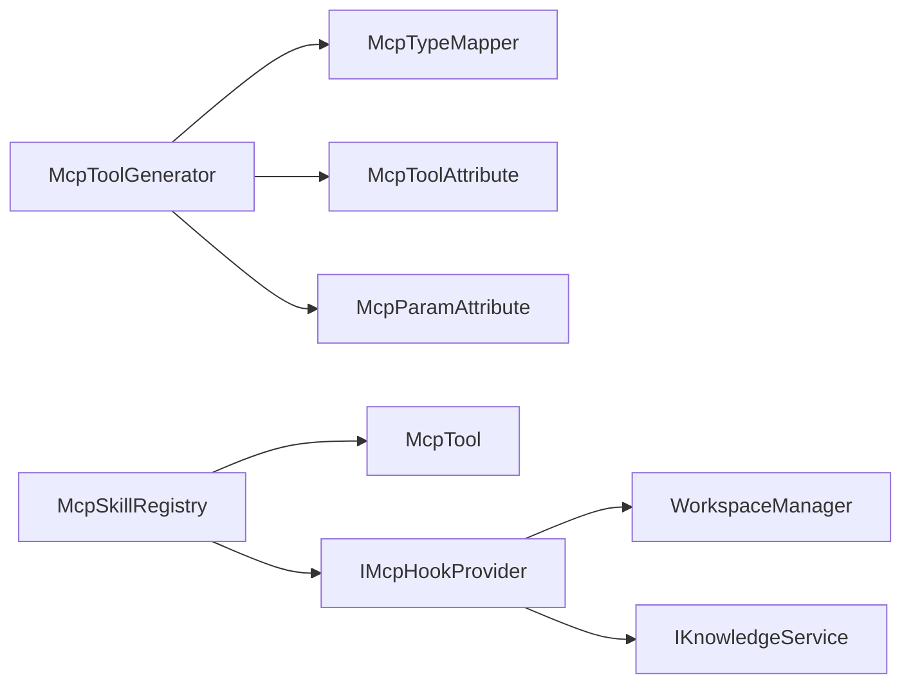

# MCP协议概述

<cite>
**本文档引用的文件**
- [McpTool.cs](file://src/NPCLife/Framework/Mcp/McpTool.cs)
- [McpToolDefinition.cs](file://src/NPCLife/Framework/Mcp/McpToolDefinition.cs)
- [McpToolGenerator.cs](file://src/NPCLife/Framework/Mcp/McpToolGenerator.cs)
- [McpToolInvoker.cs](file://src/NPCLife/Framework/Mcp/McpToolInvoker.cs)
- [McpSkillAttribute.cs](file://src/NPCLife/Framework/Mcp/McpSkillAttribute.cs)
- [McpParamAttribute.cs](file://src/NPCLife/Framework/Mcp/McpParamAttribute.cs)
- [McpToolAttribute.cs](file://src/NPCLife/Framework/Mcp/McpToolAttribute.cs)
- [McpSkillRegistry.cs](file://src/NPCLife/Framework/Mcp/McpSkillRegistry.cs)
- [McpTypeMapper.cs](file://src/NPCLife/Framework/Mcp/McpTypeMapper.cs)
- [KnowledgeMcpProvider.cs](file://src/NPCLife/Infrastructure/Mcp/KnowledgeMcpProvider.cs)
- [WritingMcpTools.cs](file://src/NPCLife/Workspace/WritingMcpTools.cs)
- [FreelancerMcpTools.cs](file://src/NPCLife/Workspace/FreelancerMcpTools.cs)
- [DirectionMcpTools.cs](file://src/NPCLife/Workspace/DirectionMcpTools.cs)
- [README.md](file://README.md)
- [McpToolGeneratorTests.cs](file://tests/NPCLife.Tests/Framework/McpToolGeneratorTests.cs)
- [McpSkillRegistryTests.cs](file://tests/NPCLife.Tests/Framework/McpSkillRegistryTests.cs)
</cite>

## 目录
1. [简介](#简介)
2. [项目结构](#项目结构)
3. [核心组件](#核心组件)
4. [架构总览](#架构总览)
5. [详细组件分析](#详细组件分析)
6. [依赖关系分析](#依赖关系分析)
7. [性能考虑](#性能考虑)
8. [故障排除指南](#故障排除指南)
9. [结论](#结论)
10. [附录](#附录)

## 简介
MCP（Model Context Protocol）协议在NPCLife中扮演着连接LLM与游戏内部系统的桥梁。它通过标准化的工具定义与调用机制，使AI能够在不同角色（导演、编剧、临时任务代理）与工作空间之间进行可控的外部操作，从而实现以事件驱动的动态叙事生成。与传统函数调用相比，MCP的优势在于：
- 标准化接口：统一的工具定义与参数schema，便于LLM理解和调用
- 可组合性：通过技能（Skill）组织工具，支持按需激活/禁用
- 安全边界：工具调用在受控范围内执行，避免直接暴露内部实现
- 可观测性：事件总线与指标拦截器提供调用前后监控

## 项目结构
NPCLife的MCP实现主要集中在Framework/Mcp目录，配合Infrastructure与Workspace目录下的具体工具提供者，形成“注册表-生成器-调用器”的完整链路。

**图表来源**
- [McpTool.cs:14-38](file://src/NPCLife/Framework/Mcp/McpTool.cs#L14-L38)
- [McpToolGenerator.cs:12-78](file://src/NPCLife/Framework/Mcp/McpToolGenerator.cs#L12-L78)
- [McpSkillRegistry.cs:22-175](file://src/NPCLife/Framework/Mcp/McpSkillRegistry.cs#L22-L175)
- [McpToolInvoker.cs:14-72](file://src/NPCLife/Framework/Mcp/McpToolInvoker.cs#L14-L72)
- [McpTypeMapper.cs:10-83](file://src/NPCLife/Framework/Mcp/McpTypeMapper.cs#L10-L83)
- [KnowledgeMcpProvider.cs:15-40](file://src/NPCLife/Infrastructure/Mcp/KnowledgeMcpProvider.cs#L15-L40)
- [WritingMcpTools.cs:16-44](file://src/NPCLife/Workspace/WritingMcpTools.cs#L16-L44)
- [FreelancerMcpTools.cs:21-44](file://src/NPCLife/Workspace/FreelancerMcpTools.cs#L21-L44)
- [DirectionMcpTools.cs:16-44](file://src/NPCLife/Workspace/DirectionMcpTools.cs#L16-L44)

**章节来源**
- [README.md:1-93](file://README.md#L1-L93)

## 核心组件
- 工具载体与定义
  - McpTool：统一的工具载体，包含Definition（工具元数据）与Invoker（JSON参数到JSON结果的调用委托）
  - McpToolDefinition：工具定义的结构化描述，包含名称、描述与输入参数schema
- 工具生成与序列化
  - McpToolGenerator：基于反射与特性生成工具定义，支持序列化为标准MCP JSON
- 工具调用与类型映射
  - McpToolInvoker：将JSON参数反序列化、反射调用目标方法、序列化返回值
  - McpTypeMapper：C#类型到JSON Schema类型的映射
- 技能注册与管理
  - McpSkillRegistry：技能元数据与工具注册中心，提供工具定义查询、工具调用、技能列表等纯函数
- 工具提供者
  - IMcpHookProvider及其实现：知识库、工作空间（编剧/临时任务代理/导演）等工具集

**章节来源**
- [McpTool.cs:14-38](file://src/NPCLife/Framework/Mcp/McpTool.cs#L14-L38)
- [McpToolDefinition.cs:38-48](file://src/NPCLife/Framework/Mcp/McpToolDefinition.cs#L38-L48)
- [McpToolGenerator.cs:12-121](file://src/NPCLife/Framework/Mcp/McpToolGenerator.cs#L12-L121)
- [McpToolInvoker.cs:14-237](file://src/NPCLife/Framework/Mcp/McpToolInvoker.cs#L14-L237)
- [McpTypeMapper.cs:10-83](file://src/NPCLife/Framework/Mcp/McpTypeMapper.cs#L10-L83)
- [McpSkillRegistry.cs:22-470](file://src/NPCLife/Framework/Mcp/McpSkillRegistry.cs#L22-L470)

## 架构总览
MCP在NPCLife中的工作流如下：
- 工具提供者通过IMcpHookProvider注册工具，McpSkillRegistry负责将工具按技能归类
- McpToolGenerator将工具定义序列化为LLM可消费的JSON格式
- 当LLM选择调用某工具时，McpSkillRegistry根据激活技能范围定位工具并交由McpToolInvoker执行
- 调用前后通过事件总线发布事件，便于监控与审计

**图表来源**
- [McpToolGenerator.cs:84-121](file://src/NPCLife/Framework/Mcp/McpToolGenerator.cs#L84-L121)
- [McpSkillRegistry.cs:154-175](file://src/NPCLife/Framework/Mcp/McpSkillRegistry.cs#L154-L175)
- [McpSkillRegistry.cs:361-437](file://src/NPCLife/Framework/Mcp/McpSkillRegistry.cs#L361-L437)
- [McpToolInvoker.cs:24-72](file://src/NPCLife/Framework/Mcp/McpToolInvoker.cs#L24-L72)

## 详细组件分析

### 工具定义与参数规范
- 工具定义结构
  - 名称与描述：来自方法上的McpToolAttribute，未设置时使用方法名与描述
  - 输入参数schema：基于方法参数与McpParamAttribute生成，支持必填/可选、类型映射、数组元素类型
- 参数规范
  - 必填性：优先使用McpParam(Required=...)，否则依据C#默认值自动推断
  - 类型映射：通过McpTypeMapper将C#类型映射为JSON Schema类型（string/integer/number/boolean/array/object）
  - 数组参数：自动识别数组与泛型集合，并设置ItemsType

**图表来源**
- [McpToolDefinition.cs:38-48](file://src/NPCLife/Framework/Mcp/McpToolDefinition.cs#L38-L48)
- [McpToolDefinition.cs:23-33](file://src/NPCLife/Framework/Mcp/McpToolDefinition.cs#L23-L33)
- [McpToolDefinition.cs:8-18](file://src/NPCLife/Framework/Mcp/McpToolDefinition.cs#L8-L18)
- [McpToolAttribute.cs:9-16](file://src/NPCLife/Framework/Mcp/McpToolAttribute.cs#L9-L16)
- [McpParamAttribute.cs:22-32](file://src/NPCLife/Framework/Mcp/McpParamAttribute.cs#L22-L32)
- [McpTypeMapper.cs:16-43](file://src/NPCLife/Framework/Mcp/McpTypeMapper.cs#L16-L43)

**章节来源**
- [McpToolDefinition.cs:38-48](file://src/NPCLife/Framework/Mcp/McpToolDefinition.cs#L38-L48)
- [McpToolGenerator.cs:19-78](file://src/NPCLife/Framework/Mcp/McpToolGenerator.cs#L19-L78)
- [McpParamAttribute.cs:8-16](file://src/NPCLife/Framework/Mcp/McpParamAttribute.cs#L8-L16)
- [McpTypeMapper.cs:16-83](file://src/NPCLife/Framework/Mcp/McpTypeMapper.cs#L16-L83)

### 工具生成与序列化流程
- 反射生成：从MethodInfo读取特性，结合McpTypeMapper推导schema
- 序列化：生成标准MCP JSON（包含type="function"、function.name/description/parameters）
- 扫描注册：支持从类型扫描所有带[McpTool]的静态/实例方法，批量序列化

**图表来源**
- [McpToolGenerator.cs:19-78](file://src/NPCLife/Framework/Mcp/McpToolGenerator.cs#L19-L78)
- [McpToolGenerator.cs:84-121](file://src/NPCLife/Framework/Mcp/McpToolGenerator.cs#L84-L121)

**章节来源**
- [McpToolGenerator.cs:19-121](file://src/NPCLife/Framework/Mcp/McpToolGenerator.cs#L19-L121)

### 工具调用与类型转换
- 参数解析：将JSON对象字符串解析为键值字典，按参数名映射到目标方法参数
- 类型转换：支持基础类型、枚举、数组、泛型集合等，转换失败时使用默认值
- 返回值序列化：支持基础类型、枚举、集合与复杂对象的JSON序列化
- 错误处理：捕获反射异常并返回标准化错误JSON

**图表来源**
- [McpToolInvoker.cs:24-72](file://src/NPCLife/Framework/Mcp/McpToolInvoker.cs#L24-L72)
- [McpToolInvoker.cs:87-132](file://src/NPCLife/Framework/Mcp/McpToolInvoker.cs#L87-L132)
- [McpToolInvoker.cs:177-226](file://src/NPCLife/Framework/Mcp/McpToolInvoker.cs#L177-L226)

**章节来源**
- [McpToolInvoker.cs:24-237](file://src/NPCLife/Framework/Mcp/McpToolInvoker.cs#L24-L237)

### 技能注册与工具管理
- 技能元数据：内置8个业务技能，支持动态注册与查询
- 工具注册：支持从类型扫描与Hook提供者注册，按技能ID去重
- 工具查询：提供GetActiveToolsJson、GetSkillToolsJson、GetSkillListJson等纯函数
- 工具调用：InvokeTool在激活技能范围内查找工具，支持system技能回退

**图表来源**
- [McpSkillRegistry.cs:52-175](file://src/NPCLife/Framework/Mcp/McpSkillRegistry.cs#L52-L175)
- [McpSkillRegistry.cs:361-437](file://src/NPCLife/Framework/Mcp/McpSkillRegistry.cs#L361-L437)
- [McpTool.cs:28-37](file://src/NPCLife/Framework/Mcp/McpTool.cs#L28-L37)

**章节来源**
- [McpSkillRegistry.cs:22-470](file://src/NPCLife/Framework/Mcp/McpSkillRegistry.cs#L22-L470)

### 工具提供者与应用场景
- 知识库工具（KnowledgeMcpProvider）
  - 功能：词条查询、学习、列举、删除、统计
  - 返回值：命中/未命中、错误信息、统计数据等
- 工作空间工具（WritingMcpProvider/FreelancerMcpProvider/DirectionMcpProvider）
  - 编剧：获取工作空间、推送台词、结束轮次、事件路由
  - 临时任务代理：轻量工作空间信息、推送台词、结束轮次、事件路由
  - 导演：创建工作空间、列出/获取工作空间、挂起/恢复/关闭、分支/合并、事件路由

**图表来源**
- [WritingMcpTools.cs:77-110](file://src/NPCLife/Workspace/WritingMcpTools.cs#L77-L110)
- [FreelancerMcpTools.cs:87-115](file://src/NPCLife/Workspace/FreelancerMcpTools.cs#L87-L115)
- [DirectionMcpTools.cs:53-78](file://src/NPCLife/Workspace/DirectionMcpTools.cs#L53-L78)

**章节来源**
- [KnowledgeMcpProvider.cs:49-229](file://src/NPCLife/Infrastructure/Mcp/KnowledgeMcpProvider.cs#L49-L229)
- [WritingMcpTools.cs:48-152](file://src/NPCLife/Workspace/WritingMcpTools.cs#L48-L152)
- [FreelancerMcpTools.cs:55-154](file://src/NPCLife/Workspace/FreelancerMcpTools.cs#L55-L154)
- [DirectionMcpTools.cs:53-282](file://src/NPCLife/Workspace/DirectionMcpTools.cs#L53-L282)

## 依赖关系分析
- 组件耦合
  - McpToolGenerator与McpTypeMapper强耦合，确保类型映射一致性
  - McpSkillRegistry作为无状态注册表，依赖McpTool与IMcpHookProvider
  - 工具提供者通过依赖注入获取WorkspaceManager/IKnowledgeService等服务
- 外部依赖
  - 仅依赖.NET反射与基础集合类型，零第三方依赖
  - 通过事件总线与错误处理器提供可观测性

**图表来源**
- [McpToolGenerator.cs:12-78](file://src/NPCLife/Framework/Mcp/McpToolGenerator.cs#L12-L78)
- [McpSkillRegistry.cs:97-175](file://src/NPCLife/Framework/Mcp/McpSkillRegistry.cs#L97-L175)
- [KnowledgeMcpProvider.cs:17-24](file://src/NPCLife/Infrastructure/Mcp/KnowledgeMcpProvider.cs#L17-L24)
- [WritingMcpTools.cs:18-25](file://src/NPCLife/Workspace/WritingMcpTools.cs#L18-L25)

**章节来源**
- [McpToolGenerator.cs:12-78](file://src/NPCLife/Framework/Mcp/McpToolGenerator.cs#L12-L78)
- [McpSkillRegistry.cs:97-175](file://src/NPCLife/Framework/Mcp/McpSkillRegistry.cs#L97-L175)

## 性能考虑
- 反射开销：工具生成与调用均使用反射，建议在启动阶段完成工具注册与定义生成
- JSON序列化：使用轻量级JsonWriter，避免多余分配
- 类型转换：针对常见类型采用快速路径，数组/集合转换时尽量减少中间对象创建
- 并发安全：注册表使用锁保护，工具调用为纯函数，避免共享可变状态

## 故障排除指南
- 工具未找到
  - 检查技能是否正确初始化与激活
  - 确认工具名称大小写与Definition.Name一致
- 参数类型错误
  - 检查McpParamAttribute的Required与Description配置
  - 确认JSON参数键名与方法参数名一致
- 返回值异常
  - 查看McpToolInvoker的异常捕获与错误JSON格式
  - 检查工具提供者内部异常日志

**章节来源**
- [McpSkillRegistry.cs:361-437](file://src/NPCLife/Framework/Mcp/McpSkillRegistry.cs#L361-L437)
- [McpToolInvoker.cs:62-72](file://src/NPCLife/Framework/Mcp/McpToolInvoker.cs#L62-L72)

## 结论
MCP协议在NPCLife中实现了LLM与游戏内部系统的解耦集成，通过标准化的工具定义、严格的类型映射与受控的调用机制，支撑了导演、编剧、临时任务代理等角色的协同工作。其纯静态、零依赖的设计使得MCP易于扩展与维护，同时通过事件总线与测试用例保障了系统的可靠性与可观测性。

## 附录

### MCP工具基本结构
- 工具定义
  - 名称：工具标识
  - 描述：用途说明
  - 输入参数：对象类型，包含属性与必填字段
- 参数规范
  - 类型：string/integer/number/boolean/array/object
  - 必填：显式Required或基于默认值推断
  - 数组元素：ItemsType指定元素类型
- 返回值格式
  - 成功：JSON对象或数组
  - 失败：包含error字段的JSON对象

**章节来源**
- [McpToolDefinition.cs:38-48](file://src/NPCLife/Framework/Mcp/McpToolDefinition.cs#L38-L48)
- [McpToolGenerator.cs:84-121](file://src/NPCLife/Framework/Mcp/McpToolGenerator.cs#L84-L121)
- [McpToolInvoker.cs:177-226](file://src/NPCLife/Framework/Mcp/McpToolInvoker.cs#L177-L226)

### 标准格式示例与兼容性
- 标准格式
  - type="function"
  - function.name/function.description
  - function.parameters: type="object"，properties与required
- 兼容性
  - 与OpenAI/DeepSeek等平台的function工具格式保持一致
  - 支持SerializeAllActiveTools与SerializeSkillList用于技能列表展示

**章节来源**
- [McpToolGenerator.cs:84-121](file://src/NPCLife/Framework/Mcp/McpToolGenerator.cs#L84-L121)
- [McpSkillRegistry.cs:153-166](file://src/NPCLife/Framework/Mcp/McpSkillRegistry.cs#L153-L166)