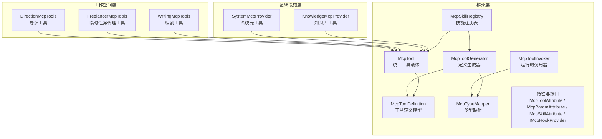
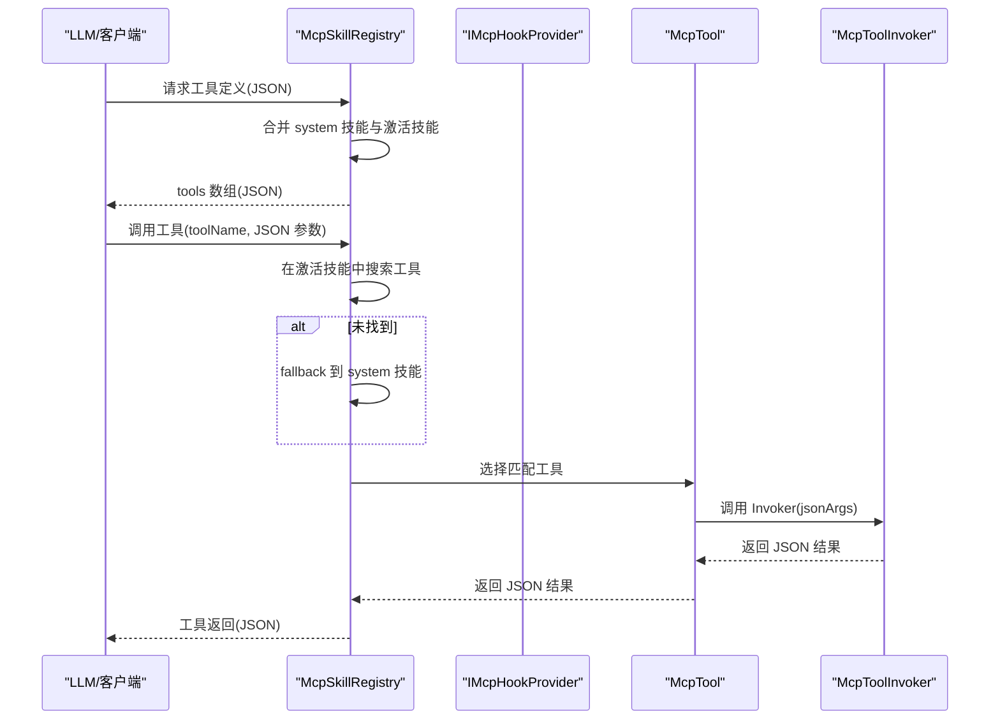
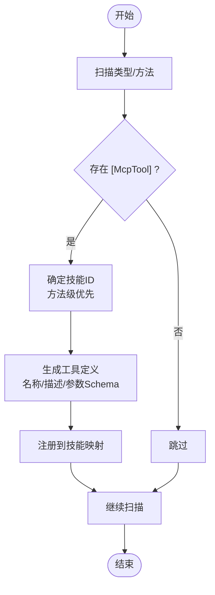
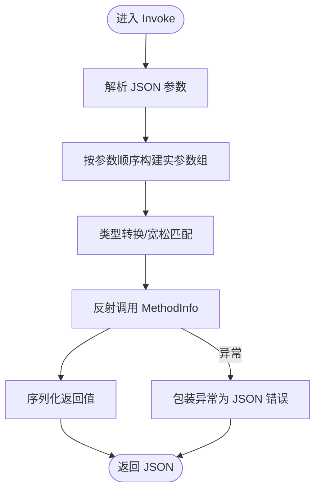
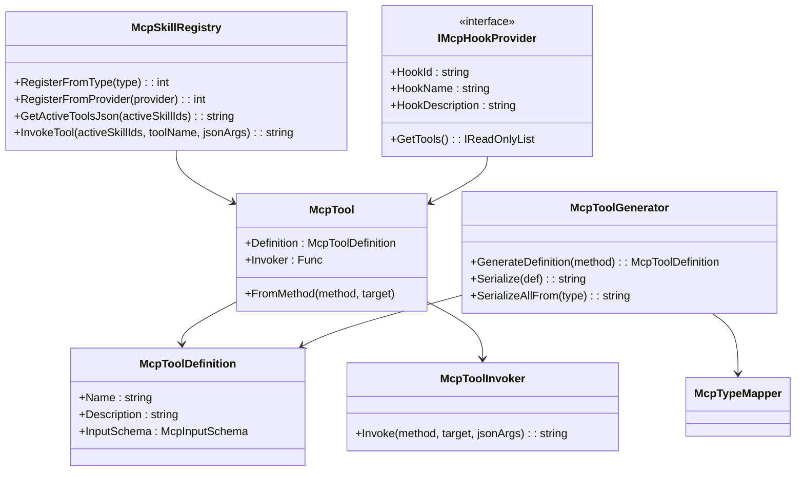

# MCP工具协议

<cite>
**本文引用的文件**
- [McpTool.cs](file://src/NPCLife/Framework/Mcp/McpTool.cs)
- [McpToolDefinition.cs](file://src/NPCLife/Framework/Mcp/McpToolDefinition.cs)
- [McpToolGenerator.cs](file://src/NPCLife/Framework/Mcp/McpToolGenerator.cs)
- [McpToolInvoker.cs](file://src/NPCLife/Framework/Mcp/McpToolInvoker.cs)
- [McpSkillRegistry.cs](file://src/NPCLife/Framework/Mcp/McpSkillRegistry.cs)
- [McpTypeMapper.cs](file://src/NPCLife/Framework/Mcp/McpTypeMapper.cs)
- [McpParamAttribute.cs](file://src/NPCLife/Framework/Mcp/McpParamAttribute.cs)
- [McpSkillAttribute.cs](file://src/NPCLife/Framework/Mcp/McpSkillAttribute.cs)
- [McpToolAttribute.cs](file://src/NPCLife/Framework/Mcp/McpToolAttribute.cs)
- [IMcpHookProvider.cs](file://src/NPCLife/Framework/Mcp/IMcpHookProvider.cs)
- [KnowledgeMcpProvider.cs](file://src/NPCLife/Infrastructure/Mcp/KnowledgeMcpProvider.cs)
- [SystemMcpProvider.cs](file://src/NPCLife/Infrastructure/Mcp/SystemMcpProvider.cs)
- [WritingMcpTools.cs](file://src/NPCLife/Workspace/WritingMcpTools.cs)
- [FreelancerMcpTools.cs](file://src/NPCLife/Workspace/FreelancerMcpTools.cs)
- [DirectionMcpTools.cs](file://src/NPCLife/Workspace/DirectionMcpTools.cs)
</cite>

## 目录
1. [引言](#引言)
2. [项目结构](#项目结构)
3. [核心组件](#核心组件)
4. [架构总览](#架构总览)
5. [详细组件分析](#详细组件分析)
6. [依赖分析](#依赖分析)
7. [性能考虑](#性能考虑)
8. [故障排查指南](#故障排查指南)
9. [结论](#结论)
10. [附录](#附录)

## 引言
本文件系统化阐述 NPCLife 中的 MCP（Model Context Protocol）工具协议实现，面向开发者与集成者，涵盖以下主题：
- MCP 协议基础与在 NPCLife 中的应用价值
- 工具注册与发现机制（反射扫描与动态生成工具定义）
- 工具调用执行流程与参数传递机制
- 自定义 MCP 工具开发指南（接口实现、参数映射、返回值处理）
- 常用 MCP 工具示例（知识查询、环境感知、角色信息、工作空间管理等）
- 调试方法与性能优化建议

## 项目结构
NPCLife 的 MCP 子系统位于 Framework/Mcp 与 Infrastructure/Mcp、Workspace 三个层次：
- Framework/Mcp：协议核心（工具定义、生成器、调用器、注册表、类型映射、特性与接口）
- Infrastructure/Mcp：内置 Hook 提供者（知识库、系统元工具）
- Workspace：按角色划分的工作空间工具（编剧、临时任务代理、导演）

**图表来源**
- [McpTool.cs:14-38](file://src/NPCLife/Framework/Mcp/McpTool.cs#L14-L38)
- [McpToolDefinition.cs:38-48](file://src/NPCLife/Framework/Mcp/McpToolDefinition.cs#L38-L48)
- [McpToolGenerator.cs:12-78](file://src/NPCLife/Framework/Mcp/McpToolGenerator.cs#L12-L78)
- [McpToolInvoker.cs:14-72](file://src/NPCLife/Framework/Mcp/McpToolInvoker.cs#L14-L72)
- [McpSkillRegistry.cs:22-117](file://src/NPCLife/Framework/Mcp/McpSkillRegistry.cs#L22-L117)
- [McpTypeMapper.cs:10-43](file://src/NPCLife/Framework/Mcp/McpTypeMapper.cs#L10-L43)
- [IMcpHookProvider.cs:23-36](file://src/NPCLife/Framework/Mcp/IMcpHookProvider.cs#L23-L36)
- [KnowledgeMcpProvider.cs:15-40](file://src/NPCLife/Infrastructure/Mcp/KnowledgeMcpProvider.cs#L15-L40)
- [SystemMcpProvider.cs:15-41](file://src/NPCLife/Infrastructure/Mcp/SystemMcpProvider.cs#L15-L41)
- [WritingMcpTools.cs:16-40](file://src/NPCLife/Workspace/WritingMcpTools.cs#L16-L40)
- [FreelancerMcpTools.cs:21-44](file://src/NPCLife/Workspace/FreelancerMcpTools.cs#L21-L44)
- [DirectionMcpTools.cs:16-44](file://src/NPCLife/Workspace/DirectionMcpTools.cs#L16-L44)

**章节来源**
- [McpTool.cs:14-38](file://src/NPCLife/Framework/Mcp/McpTool.cs#L14-L38)
- [McpToolGenerator.cs:12-78](file://src/NPCLife/Framework/Mcp/McpToolGenerator.cs#L12-L78)
- [McpSkillRegistry.cs:22-117](file://src/NPCLife/Framework/Mcp/McpSkillRegistry.cs#L22-L117)

## 核心组件
- 工具载体与定义
  - McpTool：统一承载工具定义与调用委托，支持从 MethodInfo 包装或手工构造
  - McpToolDefinition：工具定义模型，包含名称、描述与输入参数 JSON Schema
- 定义生成与序列化
  - McpToolGenerator：基于反射与特性生成工具定义，支持序列化为标准 MCP JSON
- 运行时调用
  - McpToolInvoker：将 JSON 参数反序列化、参数类型转换、反射调用方法并序列化返回值
- 技能注册与发现
  - McpSkillRegistry：集中管理技能元数据与工具映射，提供注册、查询与调用
- 类型映射与特性
  - McpTypeMapper：C# 类型到 JSON Schema 的映射
  - 特性：McpToolAttribute、McpParamAttribute、McpSkillAttribute
  - 接口：IMcpHookProvider
- 内置与角色工具提供者
  - KnowledgeMcpProvider：知识库工具（查询、学习、列举、删除、统计）
  - SystemMcpProvider：系统元工具（技能列表、激活/反激活、当前时间）
  - WritingMcpTools：编剧工作空间工具（查看、推送台词、结束轮次、事件路由）
  - FreelancerMcpTools：临时任务代理工具（轻量视图、推送台词、结束轮次、事件路由）
  - DirectionMcpTools：导演工作空间工具（创建、分支、合并、生命周期管理、事件路由）

**章节来源**
- [McpTool.cs:14-38](file://src/NPCLife/Framework/Mcp/McpTool.cs#L14-L38)
- [McpToolDefinition.cs:38-48](file://src/NPCLife/Framework/Mcp/McpToolDefinition.cs#L38-L48)
- [McpToolGenerator.cs:12-78](file://src/NPCLife/Framework/Mcp/McpToolGenerator.cs#L12-L78)
- [McpToolInvoker.cs:14-72](file://src/NPCLife/Framework/Mcp/McpToolInvoker.cs#L14-L72)
- [McpSkillRegistry.cs:22-117](file://src/NPCLife/Framework/Mcp/McpSkillRegistry.cs#L22-L117)
- [McpTypeMapper.cs:10-43](file://src/NPCLife/Framework/Mcp/McpTypeMapper.cs#L10-L43)
- [McpParamAttribute.cs:8-32](file://src/NPCLife/Framework/Mcp/McpParamAttribute.cs#L8-L32)
- [McpSkillAttribute.cs:10-20](file://src/NPCLife/Framework/Mcp/McpSkillAttribute.cs#L10-L20)
- [McpToolAttribute.cs:8-16](file://src/NPCLife/Framework/Mcp/McpToolAttribute.cs#L8-L16)
- [IMcpHookProvider.cs:23-36](file://src/NPCLife/Framework/Mcp/IMcpHookProvider.cs#L23-L36)

## 架构总览
MCP 工具协议在 NPCLife 中以“技能”为单位组织，每个技能下包含若干工具。系统通过反射扫描与 Hook 提供者两种方式注册工具，运行时根据激活技能集合进行工具调用。

**图表来源**
- [McpSkillRegistry.cs:249-287](file://src/NPCLife/Framework/Mcp/McpSkillRegistry.cs#L249-L287)
- [McpSkillRegistry.cs:361-437](file://src/NPCLife/Framework/Mcp/McpSkillRegistry.cs#L361-L437)
- [McpToolInvoker.cs:24-72](file://src/NPCLife/Framework/Mcp/McpToolInvoker.cs#L24-L72)

## 详细组件分析

### 工具注册与发现机制
- 反射扫描
  - 通过特性 [McpTool] 与 [McpParam] 标注方法与参数，McpToolGenerator 生成工具定义
  - McpSkillRegistry.RegisterFromType 扫描类型，优先使用方法级 [McpSkill]，其次类级 [McpSkill]
- Hook 提供者
  - 实现 IMcpHookProvider 的提供者自动注册为对应技能的工具集合
- 动态生成工具定义
  - 生成器根据方法签名与特性推导名称、描述、参数类型与必填性
  - 支持数组/集合/枚举/可空类型等复杂类型的 JSON Schema 映射

**图表来源**
- [McpToolGenerator.cs:119-146](file://src/NPCLife/Framework/Mcp/McpToolGenerator.cs#L119-L146)
- [McpSkillRegistry.cs:124-147](file://src/NPCLife/Framework/Mcp/McpSkillRegistry.cs#L124-L147)

**章节来源**
- [McpToolGenerator.cs:19-78](file://src/NPCLife/Framework/Mcp/McpToolGenerator.cs#L19-L78)
- [McpSkillRegistry.cs:124-147](file://src/NPCLife/Framework/Mcp/McpSkillRegistry.cs#L124-L147)
- [IMcpHookProvider.cs:23-36](file://src/NPCLife/Framework/Mcp/IMcpHookProvider.cs#L23-L36)

### 工具调用执行流程与参数传递
- 参数解析与转换
  - McpToolInvoker 将 JSON 对象字符串解析为键值字典
  - 根据参数特性与类型映射进行严格转换（布尔、数值、枚举、数组、集合）
- 反射调用与返回值序列化
  - 通过 MethodInfo.Invoke 执行目标方法
  - 返回值按类型映射序列化为 JSON（基础类型、枚举、集合、对象）
- 错误处理
  - 捕获反射异常并包装为 JSON 错误响应
  - 必填参数缺失时使用类型默认值兜底

**图表来源**
- [McpToolInvoker.cs:24-72](file://src/NPCLife/Framework/Mcp/McpToolInvoker.cs#L24-L72)
- [McpToolInvoker.cs:87-132](file://src/NPCLife/Framework/Mcp/McpToolInvoker.cs#L87-L132)
- [McpToolInvoker.cs:177-226](file://src/NPCLife/Framework/Mcp/McpToolInvoker.cs#L177-L226)

**章节来源**
- [McpToolInvoker.cs:24-72](file://src/NPCLife/Framework/Mcp/McpToolInvoker.cs#L24-L72)
- [McpToolInvoker.cs:87-132](file://src/NPCLife/Framework/Mcp/McpToolInvoker.cs#L87-L132)
- [McpToolInvoker.cs:177-226](file://src/NPCLife/Framework/Mcp/McpToolInvoker.cs#L177-L226)

### 自定义 MCP 工具开发指南
- 接口实现
  - 通过 IMcpHookProvider 暴露工具集合，或直接使用 McpTool.FromMethod 包装静态/实例方法
- 参数映射
  - 使用 [McpTool] 标注工具名称与描述；使用 [McpParam] 标注参数名称、描述与必填性
  - 未标注时由生成器自动推断（方法名/参数名、默认值决定必填）
- 返回值处理
  - 返回值自动序列化；建议返回稳定的 JSON 字符串，便于 LLM 消费
- 示例参考
  - 知识库工具：查询、学习、列举、删除、统计
  - 系统元工具：技能列表、激活/反激活、当前时间
  - 工作空间工具：编剧、临时任务代理、导演

**章节来源**
- [IMcpHookProvider.cs:23-36](file://src/NPCLife/Framework/Mcp/IMcpHookProvider.cs#L23-L36)
- [McpTool.cs:28-37](file://src/NPCLife/Framework/Mcp/McpTool.cs#L28-L37)
- [McpToolGenerator.cs:19-78](file://src/NPCLife/Framework/Mcp/McpToolGenerator.cs#L19-L78)
- [KnowledgeMcpProvider.cs:49-229](file://src/NPCLife/Infrastructure/Mcp/KnowledgeMcpProvider.cs#L49-L229)
- [SystemMcpProvider.cs:46-146](file://src/NPCLife/Infrastructure/Mcp/SystemMcpProvider.cs#L46-L146)
- [WritingMcpTools.cs:48-231](file://src/NPCLife/Workspace/WritingMcpTools.cs#L48-L231)
- [FreelancerMcpTools.cs:55-232](file://src/NPCLife/Workspace/FreelancerMcpTools.cs#L55-L232)
- [DirectionMcpTools.cs:53-361](file://src/NPCLife/Workspace/DirectionMcpTools.cs#L53-L361)

### 常用 MCP 工具示例
- 知识库工具（KnowledgeMcpProvider）
  - lookup_term：词条查询，返回命中列表与来源
  - learn_term：学习词条，支持置信度与标签
  - list_known_terms：按前缀/标签过滤列举
  - forget_term：删除词条
  - get_term_stats：获取词条元数据
- 系统元工具（SystemMcpProvider）
  - list_skills：列出技能与激活状态
  - activate_skill/deactivate_skill：激活/反激活技能
  - get_current_time：获取当前时间
- 工作空间工具
  - 编剧：get_workspace、push_line、finish_round、route_events
  - 临时任务代理：轻量视图与相同功能的变体
  - 导演：create/list/get/suspend/resume/close/branch/merge/route_events

**章节来源**
- [KnowledgeMcpProvider.cs:49-229](file://src/NPCLife/Infrastructure/Mcp/KnowledgeMcpProvider.cs#L49-L229)
- [SystemMcpProvider.cs:46-146](file://src/NPCLife/Infrastructure/Mcp/SystemMcpProvider.cs#L46-L146)
- [WritingMcpTools.cs:48-231](file://src/NPCLife/Workspace/WritingMcpTools.cs#L48-L231)
- [FreelancerMcpTools.cs:55-232](file://src/NPCLife/Workspace/FreelancerMcpTools.cs#L55-L232)
- [DirectionMcpTools.cs:53-361](file://src/NPCLife/Workspace/DirectionMcpTools.cs#L53-L361)

## 依赖分析
- 组件耦合
  - McpTool 依赖 McpToolDefinition 与 McpToolInvoker
  - McpToolGenerator 依赖特性与 McpTypeMapper
  - McpSkillRegistry 统一管理工具注册与调用，依赖 EventBus、ErrorHandler、JsonWriter 等
  - Hook 提供者通过 IMcpHookProvider 与注册表对接
- 外部依赖
  - 仅依赖系统反射与 JSON 工具（JsonWriter/JsonParser/JsonHelper），零第三方依赖

**图表来源**
- [McpTool.cs:14-38](file://src/NPCLife/Framework/Mcp/McpTool.cs#L14-L38)
- [McpToolDefinition.cs:38-48](file://src/NPCLife/Framework/Mcp/McpToolDefinition.cs#L38-L48)
- [McpToolGenerator.cs:12-78](file://src/NPCLife/Framework/Mcp/McpToolGenerator.cs#L12-L78)
- [McpToolInvoker.cs:14-72](file://src/NPCLife/Framework/Mcp/McpToolInvoker.cs#L14-L72)
- [McpSkillRegistry.cs:22-117](file://src/NPCLife/Framework/Mcp/McpSkillRegistry.cs#L22-L117)
- [IMcpHookProvider.cs:23-36](file://src/NPCLife/Framework/Mcp/IMcpHookProvider.cs#L23-L36)

**章节来源**
- [McpTool.cs:14-38](file://src/NPCLife/Framework/Mcp/McpTool.cs#L14-L38)
- [McpToolGenerator.cs:12-78](file://src/NPCLife/Framework/Mcp/McpToolGenerator.cs#L12-L78)
- [McpSkillRegistry.cs:22-117](file://src/NPCLife/Framework/Mcp/McpSkillRegistry.cs#L22-L117)

## 性能考虑
- 反射成本控制
  - 工具定义生成与注册集中在初始化阶段，避免运行时重复反射
  - 使用类型映射缓存常见类型转换路径
- 参数解析与序列化
  - 采用流式 JSON 写入（JsonWriter）降低内存分配
  - 对数组/集合进行批量解析与序列化
- 并发安全
  - 注册表使用锁保护，确保并发下的数据一致性
- 调用链路优化
  - 工具调用先查业务技能，再 fallback 至 system 技能，减少无效遍历

[本节为通用性能建议，不直接分析具体文件]

## 故障排查指南
- 工具未出现在 tools 列表
  - 检查方法是否标注 [McpTool]，类/方法是否标注 [McpSkill]
  - 确认技能已初始化且已注册到注册表
- 工具调用报错
  - 查看返回的 JSON 错误字段，定位异常消息
  - 检查参数类型与必填性是否满足要求
- 参数转换失败
  - 确认 JSON 与参数类型一致（布尔宽松匹配、数值格式、枚举大小写忽略）
  - 对数组/集合使用逗号分隔的字符串形式
- 日志与事件
  - 使用日志记录工具调用前后事件，辅助定位问题

**章节来源**
- [McpSkillRegistry.cs:361-437](file://src/NPCLife/Framework/Mcp/McpSkillRegistry.cs#L361-L437)
- [McpToolInvoker.cs:62-71](file://src/NPCLife/Framework/Mcp/McpToolInvoker.cs#L62-L71)
- [SystemMcpProvider.cs:63-67](file://src/NPCLife/Infrastructure/Mcp/SystemMcpProvider.cs#L63-L67)

## 结论
NPCLife 的 MCP 工具协议通过“技能+工具”的模块化设计，结合反射扫描与 Hook 提供者两种注册方式，实现了灵活、可扩展的工具生态。生成器与调用器将方法签名与 JSON Schema 对接，确保 LLM 能稳定消费工具定义与返回值。内置的知识库与工作空间工具为角色扮演与叙事驱动提供了坚实基础。

## 附录
- JSON Schema 与类型映射要点
  - 基础类型：string/boolean/integer/number/object/array
  - 数组元素类型通过泛型或数组元素类型推导
  - 可空类型与 Task<T> 在生成定义时自动解包
- 常用工具清单
  - 知识库：lookup_term、learn_term、list_known_terms、forget_term、get_term_stats
  - 系统：list_skills、activate_skill、deactivate_skill、get_current_time
  - 工作空间（编剧）：get_workspace、push_line、finish_round、route_events
  - 工作空间（临时任务代理）：fre_get_workspace、push_line、finish_round、route_events
  - 工作空间（导演）：create_workspace、list_workspaces、get_workspace、suspend/resume/close、branch/merge、route_events

**章节来源**
- [McpTypeMapper.cs:16-82](file://src/NPCLife/Framework/Mcp/McpTypeMapper.cs#L16-L82)
- [McpToolGenerator.cs:172-211](file://src/NPCLife/Framework/Mcp/McpToolGenerator.cs#L172-L211)
- [KnowledgeMcpProvider.cs:49-229](file://src/NPCLife/Infrastructure/Mcp/KnowledgeMcpProvider.cs#L49-L229)
- [SystemMcpProvider.cs:46-146](file://src/NPCLife/Infrastructure/Mcp/SystemMcpProvider.cs#L46-L146)
- [WritingMcpTools.cs:48-231](file://src/NPCLife/Workspace/WritingMcpTools.cs#L48-L231)
- [FreelancerMcpTools.cs:55-232](file://src/NPCLife/Workspace/FreelancerMcpTools.cs#L55-L232)
- [DirectionMcpTools.cs:53-361](file://src/NPCLife/Workspace/DirectionMcpTools.cs#L53-L361)