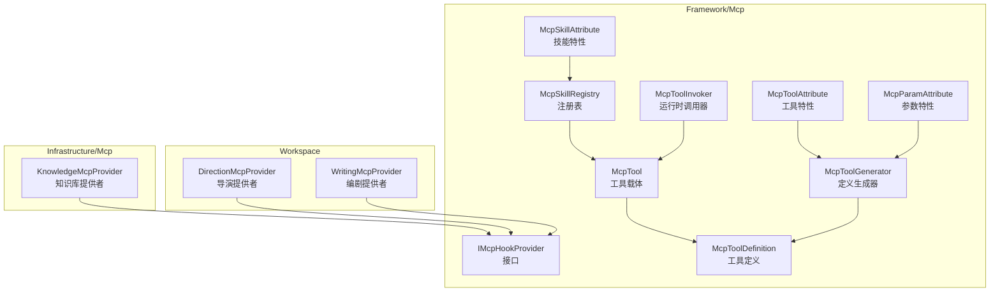
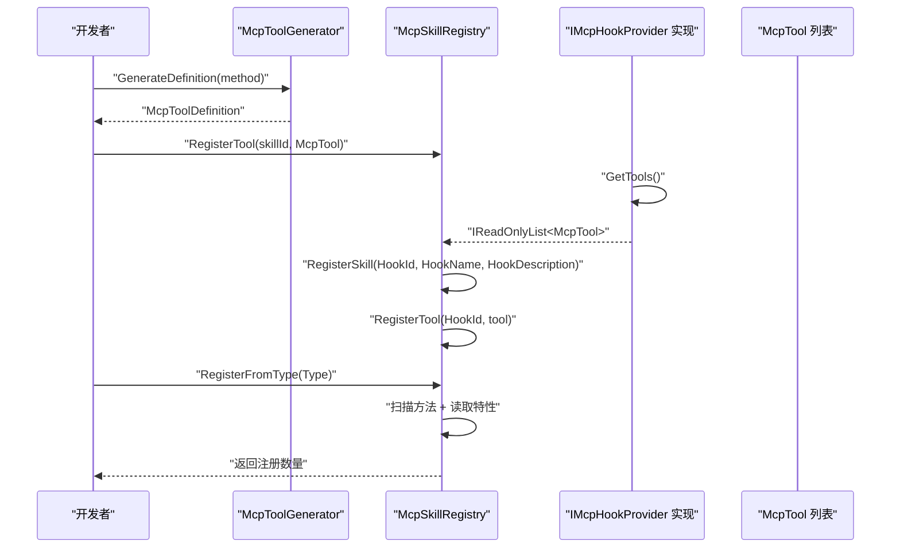
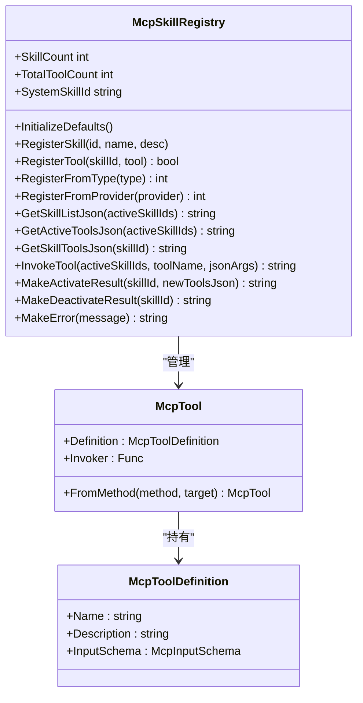
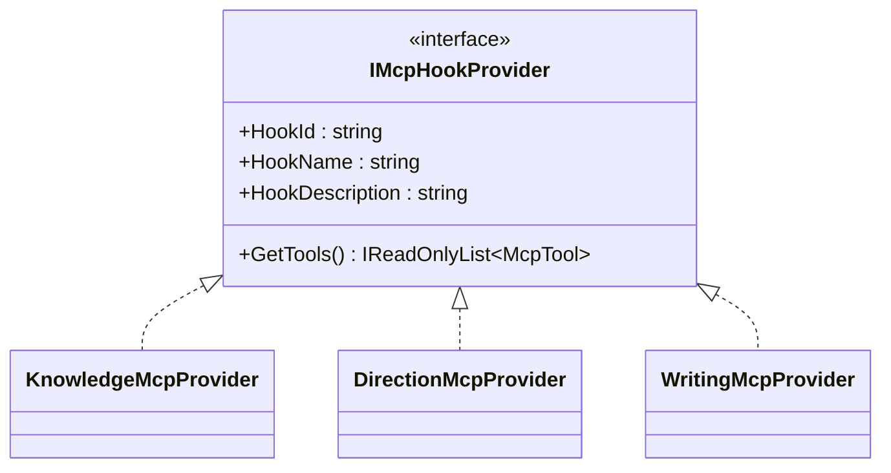
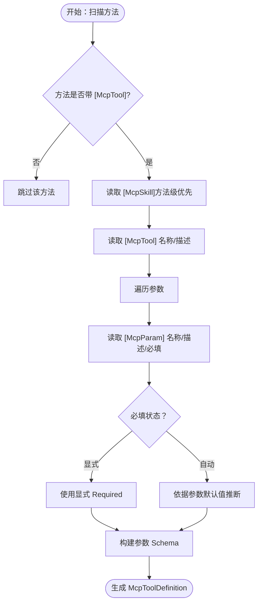
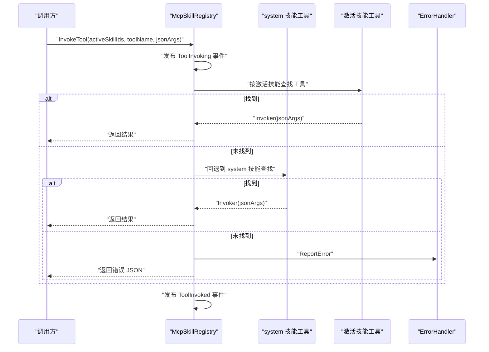
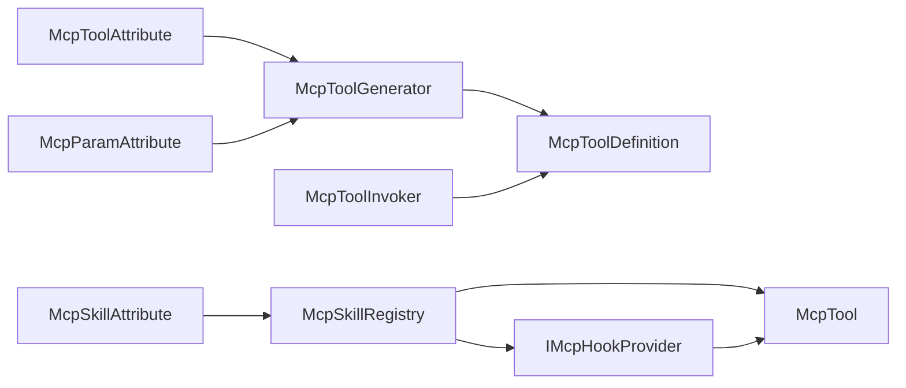

# 工具注册与发现

<cite>
**本文引用的文件**
- [McpSkillRegistry.cs](file://src/NPCLife/Framework/Mcp/McpSkillRegistry.cs)
- [IMcpHookProvider.cs](file://src/NPCLife/Framework/Mcp/IMcpHookProvider.cs)
- [McpTool.cs](file://src/NPCLife/Framework/Mcp/McpTool.cs)
- [McpSkillAttribute.cs](file://src/NPCLife/Framework/Mcp/McpSkillAttribute.cs)
- [McpToolAttribute.cs](file://src/NPCLife/Framework/Mcp/McpToolAttribute.cs)
- [McpToolDefinition.cs](file://src/NPCLife/Framework/Mcp/McpToolDefinition.cs)
- [McpToolGenerator.cs](file://src/NPCLife/Framework/Mcp/McpToolGenerator.cs)
- [McpToolInvoker.cs](file://src/NPCLife/Framework/Mcp/McpToolInvoker.cs)
- [McpParamAttribute.cs](file://src/NPCLife/Framework/Mcp/McpParamAttribute.cs)
- [KnowledgeMcpProvider.cs](file://src/NPCLife/Infrastructure/Mcp/KnowledgeMcpProvider.cs)
- [DirectionMcpTools.cs](file://src/NPCLife/Workspace/DirectionMcpTools.cs)
- [WritingMcpTools.cs](file://src/NPCLife/Workspace/WritingMcpTools.cs)
- [McpSkillRegistryTests.cs](file://tests/NPCLife.Tests/Framework/McpSkillRegistryTests.cs)
- [McpToolGeneratorTests.cs](file://tests/NPCLife.Tests/Framework/McpToolGeneratorTests.cs)
</cite>

## 目录
1. [简介](#简介)
2. [项目结构](#项目结构)
3. [核心组件](#核心组件)
4. [架构总览](#架构总览)
5. [详细组件分析](#详细组件分析)
6. [依赖关系分析](#依赖关系分析)
7. [性能考量](#性能考量)
8. [故障排查指南](#故障排查指南)
9. [结论](#结论)
10. [附录](#附录)

## 简介
本文件系统性阐述 NPCLife 项目中 MCP 工具注册与发现机制，重点围绕以下主题：
- McpSkillRegistry 的职责与工作原理：技能 ID 管理、工具激活状态跟踪、动态注册流程
- IMcpHookProvider 接口的设计目的与实现方式
- [McpTool] 特性的作用与配置选项
- 工具发现的反射机制：方法扫描、特性读取、工具定义生成
- 工具注册最佳实践与常见问题解决方案

## 项目结构
MCP 相关代码主要位于 Framework/Mcp 与 Infrastructure/Mcp、Workspace 三个层次：
- Framework/Mcp：注册表、接口、特性、工具定义与生成器、调用器
- Infrastructure/Mcp：内置知识库的 MCP 提供者
- Workspace：导演与编剧两类角色的 MCP 工具提供者

图表来源
- [McpSkillRegistry.cs:22-470](file://src/NPCLife/Framework/Mcp/McpSkillRegistry.cs#L22-L470)
- [IMcpHookProvider.cs:23-37](file://src/NPCLife/Framework/Mcp/IMcpHookProvider.cs#L23-L37)
- [McpTool.cs:14-39](file://src/NPCLife/Framework/Mcp/McpTool.cs#L14-L39)
- [McpToolDefinition.cs:38-49](file://src/NPCLife/Framework/Mcp/McpToolDefinition.cs#L38-L49)
- [McpToolGenerator.cs:12-214](file://src/NPCLife/Framework/Mcp/McpToolGenerator.cs#L12-L214)
- [McpToolInvoker.cs:14-238](file://src/NPCLife/Framework/Mcp/McpToolInvoker.cs#L14-L238)
- [McpSkillAttribute.cs:11-21](file://src/NPCLife/Framework/Mcp/McpSkillAttribute.cs#L11-L21)
- [McpToolAttribute.cs:9-17](file://src/NPCLife/Framework/Mcp/McpToolAttribute.cs#L9-L17)
- [McpParamAttribute.cs:22-33](file://src/NPCLife/Framework/Mcp/McpParamAttribute.cs#L22-L33)
- [KnowledgeMcpProvider.cs:15-40](file://src/NPCLife/Infrastructure/Mcp/KnowledgeMcpProvider.cs#L15-L40)
- [DirectionMcpTools.cs:16-45](file://src/NPCLife/Workspace/DirectionMcpTools.cs#L16-L45)
- [WritingMcpTools.cs:16-40](file://src/NPCLife/Workspace/WritingMcpTools.cs#L16-L40)

章节来源
- [McpSkillRegistry.cs:22-470](file://src/NPCLife/Framework/Mcp/McpSkillRegistry.cs#L22-L470)
- [McpToolGenerator.cs:12-214](file://src/NPCLife/Framework/Mcp/McpToolGenerator.cs#L12-L214)

## 核心组件
- 注册表 McpSkillRegistry：集中管理技能元数据与工具映射，提供纯函数式的查询与调用入口
- 接口 IMcpHookProvider：抽象“钩子提供者”，统一由注册表批量注册其工具
- 工具载体 McpTool：统一承载工具定义与调用委托
- 工具定义 McpToolDefinition：标准化的工具 JSON Schema
- 生成器 McpToolGenerator：基于反射与特性生成工具定义
- 调用器 McpToolInvoker：将 JSON 参数反序列化并调用目标方法，再序列化返回值
- 特性体系：McpSkillAttribute、McpToolAttribute、McpParamAttribute

章节来源
- [McpSkillRegistry.cs:22-470](file://src/NPCLife/Framework/Mcp/McpSkillRegistry.cs#L22-L470)
- [IMcpHookProvider.cs:23-37](file://src/NPCLife/Framework/Mcp/IMcpHookProvider.cs#L23-L37)
- [McpTool.cs:14-39](file://src/NPCLife/Framework/Mcp/McpTool.cs#L14-L39)
- [McpToolDefinition.cs:38-49](file://src/NPCLife/Framework/Mcp/McpToolDefinition.cs#L38-L49)
- [McpToolGenerator.cs:12-214](file://src/NPCLife/Framework/Mcp/McpToolGenerator.cs#L12-L214)
- [McpToolInvoker.cs:14-238](file://src/NPCLife/Framework/Mcp/McpToolInvoker.cs#L14-L238)
- [McpSkillAttribute.cs:11-21](file://src/NPCLife/Framework/Mcp/McpSkillAttribute.cs#L11-L21)
- [McpToolAttribute.cs:9-17](file://src/NPCLife/Framework/Mcp/McpToolAttribute.cs#L9-L17)
- [McpParamAttribute.cs:22-33](file://src/NPCLife/Framework/Mcp/McpParamAttribute.cs#L22-L33)

## 架构总览
MCP 工具注册与发现遵循“特性驱动 + 反射扫描 + 注册表聚合”的模式：
- 通过 [McpSkill]、[McpTool]、[McpParam] 标注方法与参数
- 生成器根据方法签名与特性生成工具定义
- 注册表将工具按技能 ID 聚合，并在调用时按激活技能范围进行查找
- Hook 提供者通过 IMcpHookProvider 将自身工具批量注册到对应技能

图表来源
- [McpToolGenerator.cs:19-78](file://src/NPCLife/Framework/Mcp/McpToolGenerator.cs#L19-L78)
- [McpSkillRegistry.cs:97-175](file://src/NPCLife/Framework/Mcp/McpSkillRegistry.cs#L97-L175)
- [IMcpHookProvider.cs:23-37](file://src/NPCLife/Framework/Mcp/IMcpHookProvider.cs#L23-L37)

## 详细组件分析

### McpSkillRegistry：技能与工具的管理中心
- 技能元数据管理：键为技能 ID，值为轻量结构体，包含名称与描述
- 工具映射：键为技能 ID，值为工具列表，按名称去重
- 系统技能常量：SystemSkillId 表示系统元工具集，始终可用
- 动态注册：
  - RegisterTool：向指定技能注册工具，避免同名重复
  - RegisterFromType：扫描类型上的 [McpTool] 方法，优先读取方法级 [McpSkill]，否则回退类级
  - RegisterFromProvider：从 Hook 提供者注册，同时确保技能元数据存在
- 查询与调用：
  - GetSkillListJson：返回技能列表及激活状态
  - GetActiveToolsJson：按激活技能返回工具定义 JSON 数组
  - GetSkillToolsJson：返回指定技能的工具定义
  - InvokeTool：在激活技能范围内查找工具，找不到则回退到 system 技能
- 结果构造：MakeActivateResult、MakeDeactivateResult、MakeError

图表来源
- [McpSkillRegistry.cs:22-470](file://src/NPCLife/Framework/Mcp/McpSkillRegistry.cs#L22-L470)
- [McpTool.cs:14-39](file://src/NPCLife/Framework/Mcp/McpTool.cs#L14-L39)
- [McpToolDefinition.cs:38-49](file://src/NPCLife/Framework/Mcp/McpToolDefinition.cs#L38-L49)

章节来源
- [McpSkillRegistry.cs:22-470](file://src/NPCLife/Framework/Mcp/McpSkillRegistry.cs#L22-L470)

### IMcpHookProvider：钩子提供者接口
- 设计目的：将“工具集合”与“技能元数据”解耦，通过接口抽象，便于不同模块以一致方式接入注册表
- 关键属性：
  - HookId → 对应技能 ID
  - HookName → 技能名称
  - HookDescription → 技能描述
  - GetTools() → 返回该技能下的工具列表
- 实现方式：知识库、导演、编剧等提供者均实现该接口，注册时由注册表统一处理

图表来源
- [IMcpHookProvider.cs:23-37](file://src/NPCLife/Framework/Mcp/IMcpHookProvider.cs#L23-L37)
- [KnowledgeMcpProvider.cs:15-40](file://src/NPCLife/Infrastructure/Mcp/KnowledgeMcpProvider.cs#L15-L40)
- [DirectionMcpTools.cs:16-45](file://src/NPCLife/Workspace/DirectionMcpTools.cs#L16-L45)
- [WritingMcpTools.cs:16-40](file://src/NPCLife/Workspace/WritingMcpTools.cs#L16-L40)

章节来源
- [IMcpHookProvider.cs:23-37](file://src/NPCLife/Framework/Mcp/IMcpHookProvider.cs#L23-L37)
- [KnowledgeMcpProvider.cs:15-40](file://src/NPCLife/Infrastructure/Mcp/KnowledgeMcpProvider.cs#L15-L40)
- [DirectionMcpTools.cs:16-45](file://src/NPCLife/Workspace/DirectionMcpTools.cs#L16-L45)
- [WritingMcpTools.cs:16-40](file://src/NPCLife/Workspace/WritingMcpTools.cs#L16-L40)

### [McpTool] 特性与参数控制
- [McpTool]：标记方法为工具，可覆盖工具名称与描述；未设置时从方法名自动推导
- [McpParam]：覆盖参数名、描述与必填状态；必填优先级：显式 Required > 依据 C# 默认值自动推断
- [McpSkill]：标记方法或类所属技能 ID；方法级优先于类级

图表来源
- [McpToolGenerator.cs:19-78](file://src/NPCLife/Framework/Mcp/McpToolGenerator.cs#L19-L78)
- [McpToolAttribute.cs:9-17](file://src/NPCLife/Framework/Mcp/McpToolAttribute.cs#L9-L17)
- [McpParamAttribute.cs:22-33](file://src/NPCLife/Framework/Mcp/McpParamAttribute.cs#L22-L33)
- [McpSkillAttribute.cs:11-21](file://src/NPCLife/Framework/Mcp/McpSkillAttribute.cs#L11-L21)

章节来源
- [McpToolGenerator.cs:19-78](file://src/NPCLife/Framework/Mcp/McpToolGenerator.cs#L19-L78)
- [McpToolAttribute.cs:9-17](file://src/NPCLife/Framework/Mcp/McpToolAttribute.cs#L9-L17)
- [McpParamAttribute.cs:22-33](file://src/NPCLife/Framework/Mcp/McpParamAttribute.cs#L22-L33)
- [McpSkillAttribute.cs:11-21](file://src/NPCLife/Framework/Mcp/McpSkillAttribute.cs#L11-L21)

### 工具调用流程（InvokeTool）
- 输入：激活技能集合、工具名称、JSON 参数
- 查找策略：先在激活技能中按名称匹配，未找到则回退到 system 技能
- 错误处理：捕获异常并返回标准化错误 JSON
- 事件发布：调用前后分别发布事件，便于可观测性

图表来源
- [McpSkillRegistry.cs:361-437](file://src/NPCLife/Framework/Mcp/McpSkillRegistry.cs#L361-L437)
- [McpToolInvoker.cs:24-72](file://src/NPCLife/Framework/Mcp/McpToolInvoker.cs#L24-L72)

章节来源
- [McpSkillRegistry.cs:361-437](file://src/NPCLife/Framework/Mcp/McpSkillRegistry.cs#L361-L437)
- [McpToolInvoker.cs:24-72](file://src/NPCLife/Framework/Mcp/McpToolInvoker.cs#L24-L72)

### Hook 提供者实现示例
- 知识库提供者：暴露词条查询、学习、列举、删除、统计等工具
- 导演提供者：创建工作空间、分支、合并、生命周期管理等工具
- 编剧提供者：获取工作空间、推送台词、结束回合、事件路由等工具

章节来源
- [KnowledgeMcpProvider.cs:15-40](file://src/NPCLife/Infrastructure/Mcp/KnowledgeMcpProvider.cs#L15-L40)
- [DirectionMcpTools.cs:16-45](file://src/NPCLife/Workspace/DirectionMcpTools.cs#L16-L45)
- [WritingMcpTools.cs:16-40](file://src/NPCLife/Workspace/WritingMcpTools.cs#L16-L40)

## 依赖关系分析
- 组件内聚与耦合
  - 注册表与工具：强内聚，注册表持有工具列表并负责去重与查找
  - 生成器与调用器：独立于注册表，仅依赖反射与特性
  - Hook 提供者：面向接口编程，与注册表解耦
- 外部依赖
  - 注册表与生成器使用内部 JSON 工具（JsonWriter/JsonHelper）
  - 调用器使用 JsonParser 进行参数解析
- 潜在循环依赖
  - 未见循环依赖迹象；各层职责清晰

图表来源
- [McpToolGenerator.cs:12-214](file://src/NPCLife/Framework/Mcp/McpToolGenerator.cs#L12-L214)
- [McpToolInvoker.cs:14-238](file://src/NPCLife/Framework/Mcp/McpToolInvoker.cs#L14-L238)
- [McpSkillRegistry.cs:22-470](file://src/NPCLife/Framework/Mcp/McpSkillRegistry.cs#L22-L470)
- [IMcpHookProvider.cs:23-37](file://src/NPCLife/Framework/Mcp/IMcpHookProvider.cs#L23-L37)
- [McpSkillAttribute.cs:11-21](file://src/NPCLife/Framework/Mcp/McpSkillAttribute.cs#L11-L21)
- [McpToolAttribute.cs:9-17](file://src/NPCLife/Framework/Mcp/McpToolAttribute.cs#L9-L17)
- [McpParamAttribute.cs:22-33](file://src/NPCLife/Framework/Mcp/McpParamAttribute.cs#L22-L33)

章节来源
- [McpSkillRegistry.cs:22-470](file://src/NPCLife/Framework/Mcp/McpSkillRegistry.cs#L22-L470)
- [McpToolGenerator.cs:12-214](file://src/NPCLife/Framework/Mcp/McpToolGenerator.cs#L12-L214)
- [McpToolInvoker.cs:14-238](file://src/NPCLife/Framework/Mcp/McpToolInvoker.cs#L14-L238)

## 性能考量
- 注册阶段
  - RegisterFromType 扫描类型的所有公共/私有方法，注意避免在大型类型上频繁扫描
  - 建议将工具方法集中在小型、语义明确的类型中，提升扫描效率
- 查询与调用阶段
  - GetActiveToolsJson 与 GetSkillToolsJson 为纯函数，避免重复计算可缓存结果
  - InvokeTool 采用线程锁保护内部字典，建议在高并发场景下合理组织激活技能集合
- 序列化成本
  - 生成器与调用器使用流式写入，尽量减少中间字符串拼接
- 反射与类型转换
  - 参数解析与返回值序列化涉及反射与类型转换，建议在工具方法签名设计上尽量使用基础类型或明确的枚举类型

## 故障排查指南
- 工具未出现在激活列表
  - 检查方法是否带有 [McpTool] 特性
  - 检查技能归属：方法级 [McpSkill] 是否正确；或类级 [McpSkill] 是否存在
  - 确认 RegisterFromType 已在初始化阶段调用
- 工具调用报错
  - 确认工具名称大小写与 Definition.Name 一致
  - 检查参数 JSON 是否符合 InputSchema；必要时使用 [McpParam] 显式声明必填
  - 查看注册表返回的错误 JSON，定位具体异常
- Hook 提供者未生效
  - 确认 HookId 与技能 ID 一致
  - 确认 RegisterFromProvider 已调用且 GetTools 返回非空列表
- 单元测试参考
  - 注册与查询行为可通过测试用例验证：工具注册数量、激活工具 JSON、技能列表、调用结果与错误处理

章节来源
- [McpSkillRegistryTests.cs:82-244](file://tests/NPCLife.Tests/Framework/McpSkillRegistryTests.cs#L82-L244)
- [McpToolGeneratorTests.cs:156-192](file://tests/NPCLife.Tests/Framework/McpToolGeneratorTests.cs#L156-L192)

## 结论
本机制通过特性驱动与反射扫描，实现了 MCP 工具的自动化注册与发现；借助注册表的纯函数式查询与调用，既保证了灵活性，又维持了可控的复杂度。结合 Hook 提供者接口，系统能够以最小耦合接入各类业务工具，满足不同角色（知识库、导演、编剧）的差异化需求。

## 附录

### 最佳实践清单
- 工具方法设计
  - 为每个工具方法添加 [McpTool]，必要时覆盖名称与描述
  - 使用 [McpParam] 明确参数名、描述与必填状态
  - 避免在工具方法中引入外部依赖，保持纯函数风格
- 类型与参数
  - 优先使用基础类型或明确的枚举类型，简化序列化与反序列化
  - 对可选参数提供合理的默认值，减少调用端负担
- 注册与扫描
  - 在应用启动阶段调用 InitializeDefaults 与 RegisterFromType
  - 将工具方法集中到小而专的类型中，便于扫描与维护
- Hook 提供者
  - 为每个 Hook 提供者实现 IMcpHookProvider，确保 HookId、HookName、HookDescription 与 GetTools 正确
  - 通过 RegisterFromProvider 将提供者纳入注册表
- 调用与监控
  - 调用前确保激活技能集合正确传递
  - 关注注册表发布的工具调用事件，便于诊断与审计

### 常见问题速查
- 问：为什么我的工具没有出现在 tools 列表？
  - 答：检查是否添加 [McpTool]；检查技能归属是否正确；确认已调用 RegisterFromType
- 问：InvokeTool 返回错误 JSON？
  - 答：核对工具名称大小写；检查参数 JSON 是否符合 InputSchema；查看异常日志
- 问：Hook 提供者 GetTools 为空？
  - 答：确认方法签名与 [McpTool] 配置；确认 RegisterFromProvider 已调用