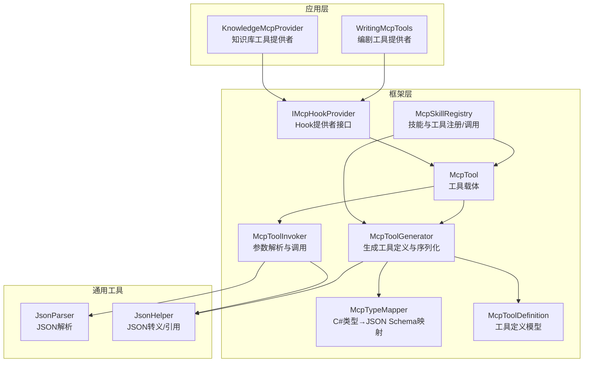
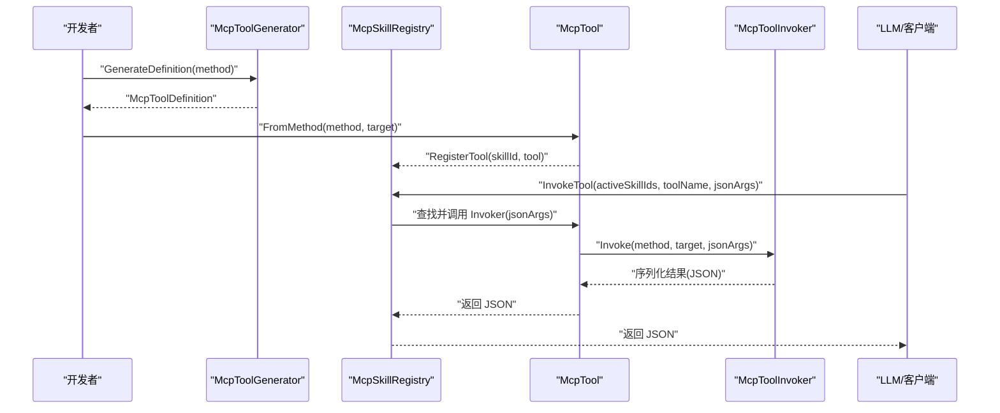
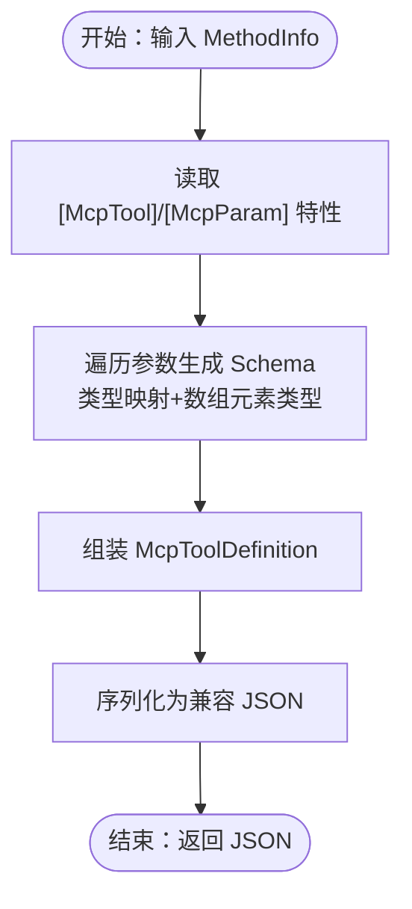
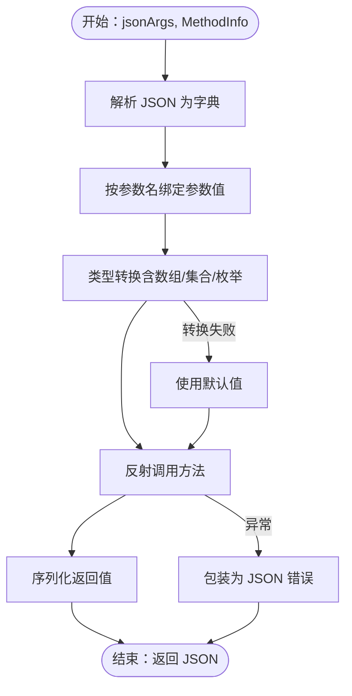
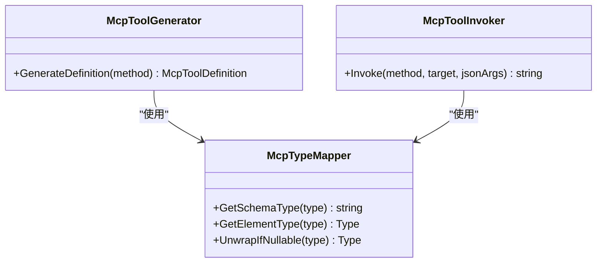
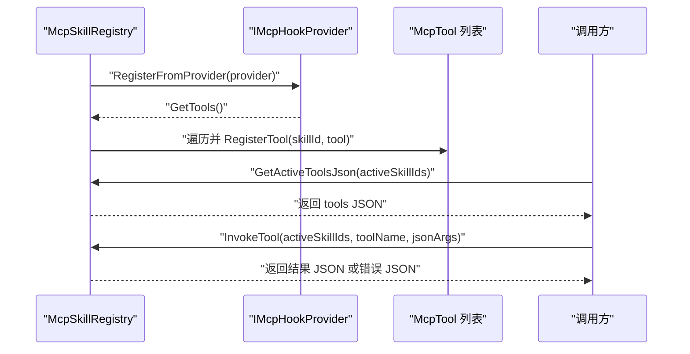
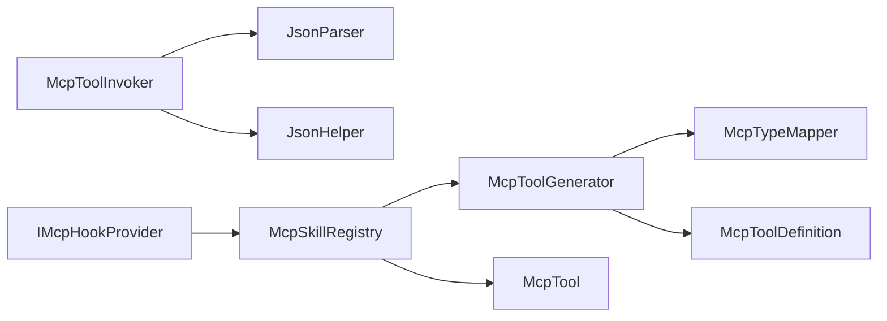

# 工具生成与调用

<cite>
**本文引用的文件**
- [McpToolGenerator.cs](file://src/NPCLife/Framework/Mcp/McpToolGenerator.cs)
- [McpToolInvoker.cs](file://src/NPCLife/Framework/Mcp/McpToolInvoker.cs)
- [McpTypeMapper.cs](file://src/NPCLife/Framework/Mcp/McpTypeMapper.cs)
- [McpTool.cs](file://src/NPCLife/Framework/Mcp/McpTool.cs)
- [McpToolDefinition.cs](file://src/NPCLife/Framework/Mcp/McpToolDefinition.cs)
- [McpToolAttribute.cs](file://src/NPCLife/Framework/Mcp/McpToolAttribute.cs)
- [McpParamAttribute.cs](file://src/NPCLife/Framework/Mcp/McpParamAttribute.cs)
- [McpSkillAttribute.cs](file://src/NPCLife/Framework/Mcp/McpSkillAttribute.cs)
- [McpSkillRegistry.cs](file://src/NPCLife/Framework/Mcp/McpSkillRegistry.cs)
- [IMcpHookProvider.cs](file://src/NPCLife/Framework/Mcp/IMcpHookProvider.cs)
- [JsonHelper.cs](file://src/NPCLife/Framework/JsonHelper.cs)
- [JsonParser.cs](file://src/NPCLife/Framework/JsonParser.cs)
- [McpToolGeneratorTests.cs](file://tests/NPCLife.Tests/Framework/McpToolGeneratorTests.cs)
- [WritingMcpTools.cs](file://src/NPCLife/Workspace/WritingMcpTools.cs)
- [KnowledgeMcpProvider.cs](file://src/NPCLife/Infrastructure/Mcp/KnowledgeMcpProvider.cs)
</cite>

## 目录
1. [简介](#简介)
2. [项目结构](#项目结构)
3. [核心组件](#核心组件)
4. [架构总览](#架构总览)
5. [详细组件分析](#详细组件分析)
6. [依赖分析](#依赖分析)
7. [性能考虑](#性能考虑)
8. [故障排查指南](#故障排查指南)
9. [结论](#结论)
10. [附录](#附录)

## 简介
本文件围绕 MCP 工具的“生成与调用”流程，系统梳理了以下关键点：
- McpToolGenerator 的实现原理：基于反射扫描方法签名，解析特性（McpTool、McpParam），结合 McpTypeMapper 生成标准 JSON Schema 的工具定义，并支持序列化为兼容 OpenAI/DeepSeek 的函数提示词格式。
- 工具调用的执行流程：从方法解析、参数绑定（含类型转换、数组/集合解析、可选参数默认值策略）到结果序列化与错误包装，形成闭环。
- McpTypeMapper 的类型映射机制：将 C# 类型映射为 JSON Schema 类型字符串，支持可空类型解包、数组/集合元素类型推断。
- 异步与错误处理：当前实现为同步调用，错误通过异常捕获与 JSON 错误载荷返回；建议在上层接入异步调度与超时控制。
- 性能优化与调试：提供参数解析与序列化路径的优化建议及调试技巧。

## 项目结构
MCP 工具体系位于 Framework/Mcp 子目录，配合 Workspace 与 Infrastructure 层的 Hook 提供者，形成“工具定义生成 → 工具注册 → 工具调用”的完整链路。测试用例集中于 Framework 层，覆盖类型映射、工具生成与调用的关键路径。

图表来源
- [McpToolGenerator.cs:1-214](file://src/NPCLife/Framework/Mcp/McpToolGenerator.cs#L1-L214)
- [McpToolInvoker.cs:1-238](file://src/NPCLife/Framework/Mcp/McpToolInvoker.cs#L1-L238)
- [McpTypeMapper.cs:1-85](file://src/NPCLife/Framework/Mcp/McpTypeMapper.cs#L1-L85)
- [McpTool.cs:1-40](file://src/NPCLife/Framework/Mcp/McpTool.cs#L1-L40)
- [McpToolDefinition.cs:1-50](file://src/NPCLife/Framework/Mcp/McpToolDefinition.cs#L1-L50)
- [McpSkillRegistry.cs:1-470](file://src/NPCLife/Framework/Mcp/McpSkillRegistry.cs#L1-L470)
- [IMcpHookProvider.cs:1-38](file://src/NPCLife/Framework/Mcp/IMcpHookProvider.cs#L1-L38)
- [JsonParser.cs:1-268](file://src/NPCLife/Framework/JsonParser.cs#L1-L268)
- [JsonHelper.cs:1-54](file://src/NPCLife/Framework/JsonHelper.cs#L1-L54)

章节来源
- [McpToolGenerator.cs:1-214](file://src/NPCLife/Framework/Mcp/McpToolGenerator.cs#L1-L214)
- [McpToolInvoker.cs:1-238](file://src/NPCLife/Framework/Mcp/McpToolInvoker.cs#L1-L238)
- [McpTypeMapper.cs:1-85](file://src/NPCLife/Framework/Mcp/McpTypeMapper.cs#L1-L85)
- [McpTool.cs:1-40](file://src/NPCLife/Framework/Mcp/McpTool.cs#L1-L40)
- [McpToolDefinition.cs:1-50](file://src/NPCLife/Framework/Mcp/McpToolDefinition.cs#L1-L50)
- [McpSkillRegistry.cs:1-470](file://src/NPCLife/Framework/Mcp/McpSkillRegistry.cs#L1-L470)
- [IMcpHookProvider.cs:1-38](file://src/NPCLife/Framework/Mcp/IMcpHookProvider.cs#L1-L38)
- [JsonParser.cs:1-268](file://src/NPCLife/Framework/JsonParser.cs#L1-L268)
- [JsonHelper.cs:1-54](file://src/NPCLife/Framework/JsonHelper.cs#L1-L54)

## 核心组件
- McpToolGenerator：从 MethodInfo 生成 McpToolDefinition，解析特性并结合类型映射生成 JSON Schema；支持序列化为兼容 OpenAI/DeepSeek 的函数提示词格式；支持批量扫描类型并序列化。
- McpToolInvoker：将 JSON 参数字符串反序列化为参数字典，按参数类型进行转换（含布尔宽松解析、数值解析、枚举解析、数组/集合解析），调用目标方法并序列化返回值；异常包装为 JSON 错误载荷。
- McpTypeMapper：将 C# 类型映射为 JSON Schema 类型字符串，支持可空类型解包、数组/集合元素类型推断。
- McpTool：统一的工具载体，包含 Definition 与 Invoker；可通过 FromMethod 快速包装 MethodInfo。
- McpToolDefinition：工具定义模型，包含名称、描述与输入参数 Schema（属性与必填项）。
- McpSkillRegistry：技能注册中心，负责技能元数据维护、工具注册、激活工具聚合、工具调用与事件发布。
- IMcpHookProvider：Hook 提供者接口，用于将外部能力以工具形式注入到特定技能下。
- JsonParser/JsonHelper：轻量 JSON 工具，提供解析、序列化与转义功能。

章节来源
- [McpToolGenerator.cs:1-214](file://src/NPCLife/Framework/Mcp/McpToolGenerator.cs#L1-L214)
- [McpToolInvoker.cs:1-238](file://src/NPCLife/Framework/Mcp/McpToolInvoker.cs#L1-L238)
- [McpTypeMapper.cs:1-85](file://src/NPCLife/Framework/Mcp/McpTypeMapper.cs#L1-L85)
- [McpTool.cs:1-40](file://src/NPCLife/Framework/Mcp/McpTool.cs#L1-L40)
- [McpToolDefinition.cs:1-50](file://src/NPCLife/Framework/Mcp/McpToolDefinition.cs#L1-L50)
- [McpSkillRegistry.cs:1-470](file://src/NPCLife/Framework/Mcp/McpSkillRegistry.cs#L1-L470)
- [IMcpHookProvider.cs:1-38](file://src/NPCLife/Framework/Mcp/IMcpHookProvider.cs#L1-L38)
- [JsonParser.cs:1-268](file://src/NPCLife/Framework/JsonParser.cs#L1-L268)
- [JsonHelper.cs:1-54](file://src/NPCLife/Framework/JsonHelper.cs#L1-L54)

## 架构总览
MCP 工具体系采用“声明式 + 反射 + 轻量序列化”的设计：
- 声明式：通过特性（McpTool、McpParam、McpSkill）标注方法与参数，提供元数据。
- 反射：McpToolGenerator 与 McpSkillRegistry 使用反射扫描与特性读取，构建工具定义与注册映射。
- 类型映射：McpTypeMapper 将 C# 类型映射为 JSON Schema 类型，支撑参数 Schema 生成与参数解析。
- 调用链：McpTool 将 Definition 与 Invoker 绑定；McpSkillRegistry 聚合工具并提供调用入口；McpToolInvoker 负责参数绑定与结果序列化。
- Hook 注入：IMcpHookProvider 将外部能力以工具形式注入技能，实现模块化扩展。

图表来源
- [McpToolGenerator.cs:19-78](file://src/NPCLife/Framework/Mcp/McpToolGenerator.cs#L19-L78)
- [McpTool.cs:28-37](file://src/NPCLife/Framework/Mcp/McpTool.cs#L28-L37)
- [McpSkillRegistry.cs:361-437](file://src/NPCLife/Framework/Mcp/McpSkillRegistry.cs#L361-L437)
- [McpToolInvoker.cs:24-72](file://src/NPCLife/Framework/Mcp/McpToolInvoker.cs#L24-L72)

## 详细组件分析

### McpToolGenerator：工具定义生成与序列化
- 功能要点
  - 从 MethodInfo 生成 McpToolDefinition：读取 [McpTool] 与 [McpParam] 特性，缺失时从方法签名推导；必填逻辑优先使用特性覆盖，否则根据参数是否可选推断。
  - 参数 Schema 生成：利用 McpTypeMapper 获取参数类型映射，数组元素类型通过 GetElementType 推断并填充 ItemsType。
  - 序列化为兼容格式：将定义序列化为包含 type="function" 的 JSON，parameters 字段来自 InputSchema。
  - 批量扫描与序列化：支持从类型扫描所有带 [McpTool] 的方法并生成 JSON 数组；支持获取激活技能的工具定义 JSON 与技能列表 JSON。
- 关键路径
  - 生成定义：[GenerateDefinition:19-78](file://src/NPCLife/Framework/Mcp/McpToolGenerator.cs#L19-L78)
  - 序列化定义：[Serialize:84-102](file://src/NPCLife/Framework/Mcp/McpToolGenerator.cs#L84-L102)
  - 批量序列化：[SerializeAllFrom:126-146](file://src/NPCLife/Framework/Mcp/McpToolGenerator.cs#L126-L146)
  - 激活工具聚合：[SerializeAllActiveTools:153-156](file://src/NPCLife/Framework/Mcp/McpToolGenerator.cs#L153-L156)

图表来源
- [McpToolGenerator.cs:19-102](file://src/NPCLife/Framework/Mcp/McpToolGenerator.cs#L19-L102)

章节来源
- [McpToolGenerator.cs:1-214](file://src/NPCLife/Framework/Mcp/McpToolGenerator.cs#L1-L214)
- [McpToolDefinition.cs:1-50](file://src/NPCLife/Framework/Mcp/McpToolDefinition.cs#L1-L50)
- [McpTypeMapper.cs:1-85](file://src/NPCLife/Framework/Mcp/McpTypeMapper.cs#L1-L85)

### McpToolInvoker：参数绑定与结果序列化
- 功能要点
  - 参数绑定：将 JSON 对象字符串解析为键值字典；按参数名匹配，缺失必填参数使用类型默认值；可选参数使用 defaultValue。
  - 类型转换：支持 string、bool（含宽松解析）、整数/浮点/小数、枚举、数组、泛型集合；转换失败回退为默认值。
  - 结果序列化：基础类型按 JSON 规范序列化；枚举序列化为字符串；集合序列化为 JSON 数组；复杂对象序列化为字符串。
  - 错误处理：捕获 TargetInvocationException 并解包内部异常，其余异常包装为 JSON 错误载荷。
- 关键路径
  - 调用入口：[Invoke:24-72](file://src/NPCLife/Framework/Mcp/McpToolInvoker.cs#L24-L72)
  - 参数转换：[ConvertArg:87-132](file://src/NPCLife/Framework/Mcp/McpToolInvoker.cs#L87-L132)
  - 结果序列化：[SerializeResult:177-226](file://src/NPCLife/Framework/Mcp/McpToolInvoker.cs#L177-L226)

图表来源
- [McpToolInvoker.cs:24-226](file://src/NPCLife/Framework/Mcp/McpToolInvoker.cs#L24-L226)
- [JsonParser.cs:23-92](file://src/NPCLife/Framework/JsonParser.cs#L23-L92)
- [JsonHelper.cs:48-51](file://src/NPCLife/Framework/JsonHelper.cs#L48-L51)

章节来源
- [McpToolInvoker.cs:1-238](file://src/NPCLife/Framework/Mcp/McpToolInvoker.cs#L1-L238)
- [JsonParser.cs:1-268](file://src/NPCLife/Framework/JsonParser.cs#L1-L268)
- [JsonHelper.cs:1-54](file://src/NPCLife/Framework/JsonHelper.cs#L1-L54)

### McpTypeMapper：类型映射机制
- 功能要点
  - 基础类型映射：string→string，bool→boolean，整数族→integer，浮点/小数→number，枚举→string，集合/数组→array，其他→object。
  - 数组/集合元素类型：通过接口与泛型信息推断元素类型。
  - 可空类型解包：Nullable<T> → T。
- 关键路径
  - 映射类型：[GetSchemaType:16-43](file://src/NPCLife/Framework/Mcp/McpTypeMapper.cs#L16-L43)
  - 元素类型：[GetElementType:48-71](file://src/NPCLife/Framework/Mcp/McpTypeMapper.cs#L48-L71)
  - 解包可空：[UnwrapIfNullable:76-82](file://src/NPCLife/Framework/Mcp/McpTypeMapper.cs#L76-L82)

图表来源
- [McpTypeMapper.cs:1-85](file://src/NPCLife/Framework/Mcp/McpTypeMapper.cs#L1-L85)
- [McpToolGenerator.cs:48-61](file://src/NPCLife/Framework/Mcp/McpToolGenerator.cs#L48-L61)
- [McpToolInvoker.cs:91-131](file://src/NPCLife/Framework/Mcp/McpToolInvoker.cs#L91-L131)

章节来源
- [McpTypeMapper.cs:1-85](file://src/NPCLife/Framework/Mcp/McpTypeMapper.cs#L1-L85)

### McpSkillRegistry：技能与工具注册/调用
- 功能要点
  - 技能元数据：初始化默认技能，支持注册自定义技能。
  - 工具注册：从类型扫描并注册工具，支持 Hook 提供者注册；按工具名去重。
  - 工具聚合：根据激活技能 ID 聚合工具定义 JSON；提供技能列表 JSON（含激活状态）。
  - 工具调用：在激活技能范围内查找工具并调用，支持 system 技能回退；发布调用前后事件；异常上报。
- 关键路径
  - 注册工具：[RegisterTool:97-117](file://src/NPCLife/Framework/Mcp/McpSkillRegistry.cs#L97-L117)
  - 扫描注册：[RegisterFromType:124-147](file://src/NPCLife/Framework/Mcp/McpSkillRegistry.cs#L124-L147)
  - Hook 注册：[RegisterFromProvider:154-175](file://src/NPCLife/Framework/Mcp/McpSkillRegistry.cs#L154-L175)
  - 聚合工具：[GetActiveToolsJson:249-287](file://src/NPCLife/Framework/Mcp/McpSkillRegistry.cs#L249-L287)
  - 调用工具：[InvokeTool:361-437](file://src/NPCLife/Framework/Mcp/McpSkillRegistry.cs#L361-L437)

图表来源
- [McpSkillRegistry.cs:154-175](file://src/NPCLife/Framework/Mcp/McpSkillRegistry.cs#L154-L175)
- [IMcpHookProvider.cs:23-36](file://src/NPCLife/Framework/Mcp/IMcpHookProvider.cs#L23-L36)
- [McpSkillRegistry.cs:249-287](file://src/NPCLife/Framework/Mcp/McpSkillRegistry.cs#L249-L287)
- [McpSkillRegistry.cs:361-437](file://src/NPCLife/Framework/Mcp/McpSkillRegistry.cs#L361-L437)

章节来源
- [McpSkillRegistry.cs:1-470](file://src/NPCLife/Framework/Mcp/McpSkillRegistry.cs#L1-L470)
- [IMcpHookProvider.cs:1-38](file://src/NPCLife/Framework/Mcp/IMcpHookProvider.cs#L1-L38)

### McpTool 与特性：声明与封装
- McpTool：统一工具载体，支持 FromMethod 快速包装 MethodInfo，自动注入 Definition 与 Invoker。
- 特性：
  - [McpTool]：覆盖工具名称与描述，未设置时从方法名/签名推导。
  - [McpParam]：覆盖参数名、描述与必填状态（Auto/True/False）。
  - [McpSkill]：将方法或类标记为属于某个技能，方法级标注优先于类级。
- 关键路径
  - 工具封装：[FromMethod:28-37](file://src/NPCLife/Framework/Mcp/McpTool.cs#L28-L37)
  - 特性定义：[McpToolAttribute:9-16](file://src/NPCLife/Framework/Mcp/McpToolAttribute.cs#L9-L16)、[McpParamAttribute:22-32](file://src/NPCLife/Framework/Mcp/McpParamAttribute.cs#L22-L32)、[McpSkillAttribute:11-20](file://src/NPCLife/Framework/Mcp/McpSkillAttribute.cs#L11-L20)

章节来源
- [McpTool.cs:1-40](file://src/NPCLife/Framework/Mcp/McpTool.cs#L1-L40)
- [McpToolAttribute.cs:1-18](file://src/NPCLife/Framework/Mcp/McpToolAttribute.cs#L1-L18)
- [McpParamAttribute.cs:1-34](file://src/NPCLife/Framework/Mcp/McpParamAttribute.cs#L1-L34)
- [McpSkillAttribute.cs:1-22](file://src/NPCLife/Framework/Mcp/McpSkillAttribute.cs#L1-L22)

### Hook 提供者示例：编剧与知识库工具
- 编剧工具提供者（WritingMcpProvider）：通过 IMcpHookProvider 暴露 get_workspace、push_line、finish_round、route_events 等工具，使用 McpTool.FromMethod 包装实例方法。
- 知识库工具提供者（KnowledgeMcpProvider）：通过 IMcpHookProvider 暴露 lookup_term、learn_term、list_known_terms、forget_term、get_term_stats 等工具，同样使用 McpTool.FromMethod 包装。
- 关键路径
  - 编剧工具：[WritingMcpTools.cs:31-40](file://src/NPCLife/Workspace/WritingMcpTools.cs#L31-L40)
  - 知识库工具：[KnowledgeMcpProvider.cs:30-40](file://src/NPCLife/Infrastructure/Mcp/KnowledgeMcpProvider.cs#L30-L40)

章节来源
- [WritingMcpTools.cs:1-313](file://src/NPCLife/Workspace/WritingMcpTools.cs#L1-L313)
- [KnowledgeMcpProvider.cs:1-355](file://src/NPCLife/Infrastructure/Mcp/KnowledgeMcpProvider.cs#L1-L355)
- [IMcpHookProvider.cs:1-38](file://src/NPCLife/Framework/Mcp/IMcpHookProvider.cs#L1-L38)

## 依赖分析
- 组件耦合
  - McpToolGenerator 依赖 McpTypeMapper 与 McpToolDefinition；间接依赖 JsonHelper/JsonWriter。
  - McpToolInvoker 依赖 JsonParser/JsonHelper；与 McpTypeMapper 协作进行类型转换。
  - McpSkillRegistry 依赖 McpToolGenerator 与 McpTool；通过 IMcpHookProvider 注入工具。
  - IMcpHookProvider 作为接口，解耦具体提供者与注册中心。
- 外部依赖
  - 严格零外部依赖，所有 JSON 工具均为框架内实现。
- 潜在循环依赖
  - 当前结构为单向依赖（生成→调用→注册），未见循环依赖迹象。

图表来源
- [McpToolGenerator.cs:1-214](file://src/NPCLife/Framework/Mcp/McpToolGenerator.cs#L1-L214)
- [McpToolInvoker.cs:1-238](file://src/NPCLife/Framework/Mcp/McpToolInvoker.cs#L1-L238)
- [McpSkillRegistry.cs:1-470](file://src/NPCLife/Framework/Mcp/McpSkillRegistry.cs#L1-L470)
- [IMcpHookProvider.cs:1-38](file://src/NPCLife/Framework/Mcp/IMcpHookProvider.cs#L1-L38)

章节来源
- [McpToolGenerator.cs:1-214](file://src/NPCLife/Framework/Mcp/McpToolGenerator.cs#L1-L214)
- [McpToolInvoker.cs:1-238](file://src/NPCLife/Framework/Mcp/McpToolInvoker.cs#L1-L238)
- [McpSkillRegistry.cs:1-470](file://src/NPCLife/Framework/Mcp/McpSkillRegistry.cs#L1-L470)
- [IMcpHookProvider.cs:1-38](file://src/NPCLife/Framework/Mcp/IMcpHookProvider.cs#L1-L38)

## 性能考虑
- 反射成本
  - 生成定义与注册阶段使用反射，建议在启动期完成一次性扫描与注册，避免运行期频繁反射。
- 参数解析与序列化
  - 参数解析与结果序列化为 O(n)（n 为参数数量），注意避免深层嵌套对象导致的字符串拼接开销。
- JSON 工具
  - JsonParser 与 JsonHelper 为轻量实现，建议在高频调用场景中复用 Writer/Reader 实例，减少临时对象分配。
- 类型转换
  - 数值解析与枚举解析为常数时间，数组/集合解析为 O(k)（k 为元素数量），建议在上层限制数组长度。
- 异步与并发
  - 当前实现为同步调用，建议在上层引入异步调度与超时控制，避免阻塞主线程；必要时对工具调用加锁保护共享资源。

## 故障排查指南
- 工具未出现在激活列表
  - 检查是否正确标注 [McpTool]；确认技能 ID 是否正确；确认 McpSkillRegistry.InitializeDefaults 与 RegisterFromType 已调用。
  - 参考：[RegisterFromType:124-147](file://src/NPCLife/Framework/Mcp/McpSkillRegistry.cs#L124-L147)、[GetActiveToolsJson:249-287](file://src/NPCLife/Framework/Mcp/McpSkillRegistry.cs#L249-L287)
- 参数缺失或类型不匹配
  - 检查 [McpParam] 的 Required 设置与默认值；确认传入 JSON 的键名与参数名一致；关注布尔宽松解析规则。
  - 参考：[Invoke:24-72](file://src/NPCLife/Framework/Mcp/McpToolInvoker.cs#L24-L72)、[ConvertArg:87-132](file://src/NPCLife/Framework/Mcp/McpToolInvoker.cs#L87-L132)
- 调用异常
  - 检查异常是否被捕获并包装为 JSON 错误载荷；关注 TargetInvocationException 的内部异常堆栈。
  - 参考：[Invoke:57-71](file://src/NPCLife/Framework/Mcp/McpToolInvoker.cs#L57-L71)
- Hook 注入无效
  - 确认 IMcpHookProvider 的 HookId/HookName/HookDescription 与 GetTools 返回值正确；检查注册流程。
  - 参考：[RegisterFromProvider:154-175](file://src/NPCLife/Framework/Mcp/McpSkillRegistry.cs#L154-L175)、[IMcpHookProvider:23-36](file://src/NPCLife/Framework/Mcp/IMcpHookProvider.cs#L23-L36)
- 单元测试验证
  - 使用测试用例验证类型映射、工具生成与调用行为，确保边界条件正确。
  - 参考：[McpToolGeneratorTests.cs:1-195](file://tests/NPCLife.Tests/Framework/McpToolGeneratorTests.cs#L1-L195)

章节来源
- [McpSkillRegistry.cs:124-175](file://src/NPCLife/Framework/Mcp/McpSkillRegistry.cs#L124-L175)
- [McpToolInvoker.cs:24-72](file://src/NPCLife/Framework/Mcp/McpToolInvoker.cs#L24-L72)
- [IMcpHookProvider.cs:1-38](file://src/NPCLife/Framework/Mcp/IMcpHookProvider.cs#L1-L38)
- [McpToolGeneratorTests.cs:1-195](file://tests/NPCLife.Tests/Framework/McpToolGeneratorTests.cs#L1-L195)

## 结论
本体系通过特性声明、反射扫描与轻量 JSON 工具，实现了 MCP 工具的自动化生成与调用。McpTypeMapper 提供稳定的类型映射，McpToolGenerator 与 McpToolInvoker 分别承担“定义生成”和“运行时调用”，McpSkillRegistry 则提供技能维度的工具聚合与调用入口。整体设计简洁、零外部依赖，便于扩展与维护。建议在生产环境中补充异步与超时控制，并在高频路径优化字符串与对象分配。

## 附录
- 支持的数据类型与转换规则
  - 基础类型：string→string，bool→boolean，整数族→integer，浮点/小数→number。
  - 枚举：映射为 string；解析时忽略大小写。
  - 数组/集合：映射为 array；元素类型通过接口与泛型推断。
  - 可空类型：Nullable<T> 自动解包。
  - 参考：[GetSchemaType:16-43](file://src/NPCLife/Framework/Mcp/McpTypeMapper.cs#L16-L43)、[ConvertArg:87-132](file://src/NPCLife/Framework/Mcp/McpToolInvoker.cs#L87-L132)
- 工具调用序列化规则
  - 基础类型按 JSON 规范序列化；枚举序列化为字符串；集合序列化为 JSON 数组；复杂对象序列化为字符串。
  - 参考：[SerializeResult:177-226](file://src/NPCLife/Framework/Mcp/McpToolInvoker.cs#L177-L226)