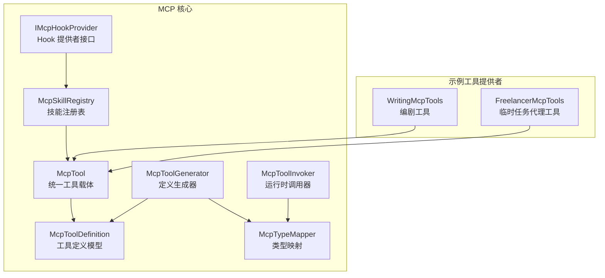
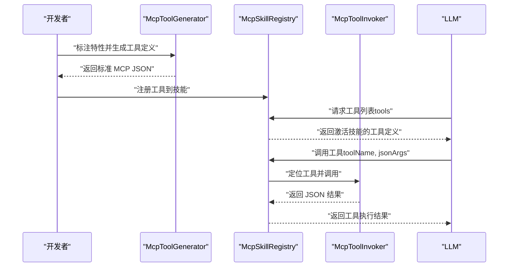
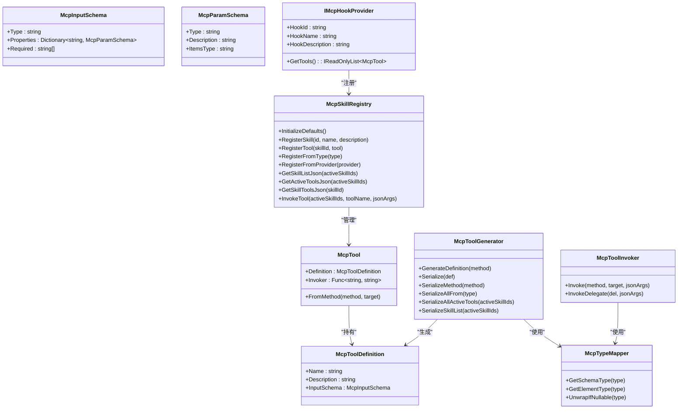
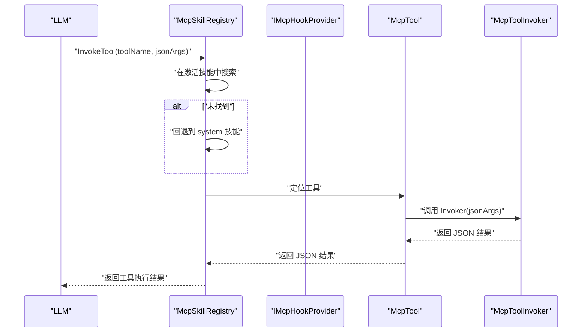
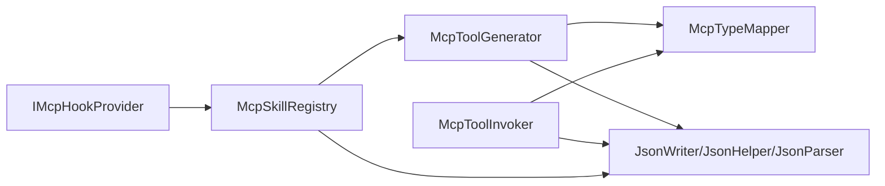

# 自定义MCP工具开发

<cite>
**本文引用的文件**
- [McpTool.cs](file://src/NPCLife/Framework/Mcp/McpTool.cs)
- [McpToolAttribute.cs](file://src/NPCLife/Framework/Mcp/McpToolAttribute.cs)
- [McpParamAttribute.cs](file://src/NPCLife/Framework/Mcp/McpParamAttribute.cs)
- [McpSkillAttribute.cs](file://src/NPCLife/Framework/Mcp/McpSkillAttribute.cs)
- [McpToolGenerator.cs](file://src/NPCLife/Framework/Mcp/McpToolGenerator.cs)
- [McpToolInvoker.cs](file://src/NPCLife/Framework/Mcp/McpToolInvoker.cs)
- [McpTypeMapper.cs](file://src/NPCLife/Framework/Mcp/McpTypeMapper.cs)
- [McpSkillRegistry.cs](file://src/NPCLife/Framework/Mcp/McpSkillRegistry.cs)
- [IMcpHookProvider.cs](file://src/NPCLife/Framework/Mcp/IMcpHookProvider.cs)
- [WritingMcpTools.cs](file://src/NPCLife/Workspace/WritingMcpTools.cs)
- [FreelancerMcpTools.cs](file://src/NPCLife/Workspace/FreelancerMcpTools.cs)
- [McpToolGeneratorTests.cs](file://tests/NPCLife.Tests/Framework/McpToolGeneratorTests.cs)
- [McpSkillRegistryTests.cs](file://tests/NPCLife.Tests/Framework/McpSkillRegistryTests.cs)
- [README.md](file://README.md)
</cite>

## 目录
1. [简介](#简介)
2. [项目结构](#项目结构)
3. [核心组件](#核心组件)
4. [架构总览](#架构总览)
5. [详细组件分析](#详细组件分析)
6. [依赖分析](#依赖分析)
7. [性能考虑](#性能考虑)
8. [故障排查指南](#故障排查指南)
9. [结论](#结论)
10. [附录](#附录)

## 简介
本指南面向希望在 NPCLife 框架中开发自定义 MCP 工具的开发者，提供从接口设计、特性标注、参数映射与校验、返回值格式化、异常处理到注册与调用的全流程说明。文档基于仓库中的 Mcp 子系统，重点讲解以下能力：
- 使用 [McpTool] 与 [McpParam] 特性进行工具定义与参数标注
- 参数映射与数据验证：必填、可选与默认值处理
- 返回值格式化与异常处理最佳实践
- 实际开发示例：简单查询工具与复杂业务工具
- 测试方法与性能优化建议

## 项目结构
MCP 子系统位于 Framework/Mcp 目录，围绕“工具定义生成”“运行时调用”“技能注册与发现”三大模块构建，并通过 Hook Provider 机制支持外部扩展。

图表来源
- [McpTool.cs:14-38](file://src/NPCLife/Framework/Mcp/McpTool.cs#L14-L38)
- [McpToolGenerator.cs:12-214](file://src/NPCLife/Framework/Mcp/McpToolGenerator.cs#L12-L214)
- [McpToolInvoker.cs:14-238](file://src/NPCLife/Framework/Mcp/McpToolInvoker.cs#L14-L238)
- [McpTypeMapper.cs:10-85](file://src/NPCLife/Framework/Mcp/McpTypeMapper.cs#L10-L85)
- [McpSkillRegistry.cs:22-470](file://src/NPCLife/Framework/Mcp/McpSkillRegistry.cs#L22-L470)
- [IMcpHookProvider.cs:23-38](file://src/NPCLife/Framework/Mcp/IMcpHookProvider.cs#L23-L38)
- [WritingMcpTools.cs:16-40](file://src/NPCLife/Workspace/WritingMcpTools.cs#L16-L40)
- [FreelancerMcpTools.cs:21-45](file://src/NPCLife/Workspace/FreelancerMcpTools.cs#L21-L45)

章节来源
- [README.md:1-93](file://README.md#L1-L93)
- [McpToolGenerator.cs:12-214](file://src/NPCLife/Framework/Mcp/McpToolGenerator.cs#L12-L214)
- [McpSkillRegistry.cs:22-470](file://src/NPCLife/Framework/Mcp/McpSkillRegistry.cs#L22-L470)

## 核心组件
- 工具载体与定义
  - [McpTool]：统一承载工具定义与调用委托，支持从 MethodInfo 包装或手工构造
  - [McpToolDefinition]：工具定义模型，包含名称、描述与输入参数 JSON Schema
- 工具生成与序列化
  - [McpToolGenerator]：从方法签名与特性生成工具定义，并序列化为标准 MCP JSON
- 运行时调用
  - [McpToolInvoker]：将 JSON 参数反序列化为强类型参数，反射调用目标方法，序列化返回值
- 类型映射
  - [McpTypeMapper]：C# 类型到 JSON Schema 类型的映射，支持数组/集合/可空类型/枚举
- 技能注册与发现
  - [McpSkillRegistry]：管理技能元数据与工具注册，提供工具定义 JSON 与调用入口
  - [IMcpHookProvider]：Hook 提供者接口，用于外部扩展注册工具
- 特性标注
  - [McpToolAttribute]：标记方法为 MCP 工具，可覆盖名称与描述
  - [McpParamAttribute]：覆盖参数名称、描述与必填状态（Auto/True/False）
  - [McpSkillAttribute]：标记方法或类所属技能 ID

章节来源
- [McpTool.cs:14-38](file://src/NPCLife/Framework/Mcp/McpTool.cs#L14-L38)
- [McpToolDefinition.cs:5-50](file://src/NPCLife/Framework/Mcp/McpToolDefinition.cs#L5-L50)
- [McpToolGenerator.cs:12-214](file://src/NPCLife/Framework/Mcp/McpToolGenerator.cs#L12-L214)
- [McpToolInvoker.cs:14-238](file://src/NPCLife/Framework/Mcp/McpToolInvoker.cs#L14-L238)
- [McpTypeMapper.cs:10-85](file://src/NPCLife/Framework/Mcp/McpTypeMapper.cs#L10-L85)
- [McpSkillRegistry.cs:22-470](file://src/NPCLife/Framework/Mcp/McpSkillRegistry.cs#L22-L470)
- [IMcpHookProvider.cs:23-38](file://src/NPCLife/Framework/Mcp/IMcpHookProvider.cs#L23-L38)
- [McpToolAttribute.cs:8-18](file://src/NPCLife/Framework/Mcp/McpToolAttribute.cs#L8-L18)
- [McpParamAttribute.cs:21-34](file://src/NPCLife/Framework/Mcp/McpParamAttribute.cs#L21-L34)
- [McpSkillAttribute.cs:10-22](file://src/NPCLife/Framework/Mcp/McpSkillAttribute.cs#L10-L22)

## 架构总览
MCP 工具开发遵循“声明式定义 + 反射调用 + JSON 序列化”的模式。整体流程如下：

图表来源
- [McpToolGenerator.cs:19-121](file://src/NPCLife/Framework/Mcp/McpToolGenerator.cs#L19-L121)
- [McpSkillRegistry.cs:249-437](file://src/NPCLife/Framework/Mcp/McpSkillRegistry.cs#L249-L437)
- [McpToolInvoker.cs:24-72](file://src/NPCLife/Framework/Mcp/McpToolInvoker.cs#L24-L72)

## 详细组件分析

### 工具定义与特性标注
- [McpToolAttribute]：用于方法级标注，可覆盖工具名称与描述；未设置时从方法名自动推导
- [McpParamAttribute]：用于参数级标注，可覆盖参数名、描述与必填状态
  - 必填状态优先级：显式 Required > 自动推断（无默认值 → 必填；有默认值 → 可选）
- [McpSkillAttribute]：用于类或方法级标注，决定工具所属技能 ID；方法级优先于类级

章节来源
- [McpToolAttribute.cs:8-18](file://src/NPCLife/Framework/Mcp/McpToolAttribute.cs#L8-L18)
- [McpParamAttribute.cs:21-34](file://src/NPCLife/Framework/Mcp/McpParamAttribute.cs#L21-L34)
- [McpSkillAttribute.cs:10-22](file://src/NPCLife/Framework/Mcp/McpSkillAttribute.cs#L10-L22)

### 参数映射与数据验证
- 参数映射规则
  - 名称：优先使用特性 Name，否则使用 C# 参数名
  - 类型：通过 [McpTypeMapper] 映射为 JSON Schema 类型（string/integer/number/boolean/array/object）
  - 数组/集合：自动识别元素类型并填充 items.type
- 数据验证与默认值
  - 必填参数缺失：使用类型默认值（如数值 0、布尔 false、字符串空、引用 null）
  - 可选参数缺失：使用方法默认值（若存在）
  - 类型转换失败：回退到类型默认值
- 示例参考
  - [McpToolGeneratorTests.cs:15-33](file://tests/NPCLife.Tests/Framework/McpToolGeneratorTests.cs#L15-L33)
  - [McpToolInvoker.cs:87-132](file://src/NPCLife/Framework/Mcp/McpToolInvoker.cs#L87-L132)

章节来源
- [McpToolGenerator.cs:19-78](file://src/NPCLife/Framework/Mcp/McpToolGenerator.cs#L19-L78)
- [McpToolInvoker.cs:87-132](file://src/NPCLife/Framework/Mcp/McpToolInvoker.cs#L87-L132)
- [McpTypeMapper.cs:16-82](file://src/NPCLife/Framework/Mcp/McpTypeMapper.cs#L16-L82)

### 返回值格式化与异常处理
- 返回值格式化
  - 基础类型：按 JSON 规范序列化（数字使用不变式格式，布尔直接输出 true/false）
  - 枚举：序列化为字符串
  - 集合：序列化为 JSON 数组
  - 复杂对象：序列化为字符串表示
  - void/空：输出 null
- 异常处理
  - 反射调用异常：解包内部异常并返回包含错误信息的 JSON
  - 其他异常：捕获并返回包含错误信息的 JSON
- 示例参考
  - [McpToolInvoker.cs:177-226](file://src/NPCLife/Framework/Mcp/McpToolInvoker.cs#L177-L226)
  - [McpToolInvoker.cs:57-72](file://src/NPCLife/Framework/Mcp/McpToolInvoker.cs#L57-L72)

章节来源
- [McpToolInvoker.cs:177-226](file://src/NPCLife/Framework/Mcp/McpToolInvoker.cs#L177-L226)
- [McpToolInvoker.cs:57-72](file://src/NPCLife/Framework/Mcp/McpToolInvoker.cs#L57-L72)

### 工具注册与调用
- 注册方式
  - 从类型扫描：自动发现带 [McpTool] 的方法并注册到对应技能
  - 从 Hook 提供者注册：实现 [IMcpHookProvider]，注册技能元数据与工具
- 调用流程
  - 通过 [McpSkillRegistry.InvokeTool] 在激活技能范围内查找工具
  - 支持回退到 system 技能（始终可用）
  - 发布工具调用前后事件，便于监控与审计
- 示例参考
  - [WritingMcpTools.cs:16-40](file://src/NPCLife/Workspace/WritingMcpTools.cs#L16-L40)
  - [FreelancerMcpTools.cs:21-45](file://src/NPCLife/Workspace/FreelancerMcpTools.cs#L21-L45)
  - [McpSkillRegistry.cs:353-437](file://src/NPCLife/Framework/Mcp/McpSkillRegistry.cs#L353-L437)

章节来源
- [McpSkillRegistry.cs:92-175](file://src/NPCLife/Framework/Mcp/McpSkillRegistry.cs#L92-L175)
- [IMcpHookProvider.cs:23-38](file://src/NPCLife/Framework/Mcp/IMcpHookProvider.cs#L23-L38)
- [McpSkillRegistry.cs:353-437](file://src/NPCLife/Framework/Mcp/McpSkillRegistry.cs#L353-L437)

### 类关系图（代码级）

图表来源
- [McpTool.cs:14-38](file://src/NPCLife/Framework/Mcp/McpTool.cs#L14-L38)
- [McpToolDefinition.cs:5-50](file://src/NPCLife/Framework/Mcp/McpToolDefinition.cs#L5-L50)
- [McpToolGenerator.cs:12-214](file://src/NPCLife/Framework/Mcp/McpToolGenerator.cs#L12-L214)
- [McpToolInvoker.cs:14-238](file://src/NPCLife/Framework/Mcp/McpToolInvoker.cs#L14-L238)
- [McpTypeMapper.cs:10-85](file://src/NPCLife/Framework/Mcp/McpTypeMapper.cs#L10-L85)
- [McpSkillRegistry.cs:22-470](file://src/NPCLife/Framework/Mcp/McpSkillRegistry.cs#L22-L470)
- [IMcpHookProvider.cs:23-38](file://src/NPCLife/Framework/Mcp/IMcpHookProvider.cs#L23-L38)

### 开发示例

#### 示例一：简单查询工具
- 设计要点
  - 使用 [McpTool] 标注方法，必要时覆盖名称与描述
  - 使用 [McpParam] 标注参数，明确描述与必填状态
  - 返回值为字符串或简单对象，便于序列化
- 参考实现
  - [McpToolGeneratorTests.cs:15-33](file://tests/NPCLife.Tests/Framework/McpToolGeneratorTests.cs#L15-L33)
  - [McpToolGeneratorTests.cs:156-192](file://tests/NPCLife.Tests/Framework/McpToolGeneratorTests.cs#L156-L192)

章节来源
- [McpToolGeneratorTests.cs:15-33](file://tests/NPCLife.Tests/Framework/McpToolGeneratorTests.cs#L15-L33)
- [McpToolGeneratorTests.cs:156-192](file://tests/NPCLife.Tests/Framework/McpToolGeneratorTests.cs#L156-L192)

#### 示例二：复杂业务工具（编剧/临时任务代理）
- 设计要点
  - 通过 [IMcpHookProvider] 实现工具提供者，注册到特定技能
  - 工具方法中进行参数解析、业务处理与结果序列化
  - 使用日志记录异常，保证稳健性
- 参考实现
  - [WritingMcpTools.cs:16-40](file://src/NPCLife/Workspace/WritingMcpTools.cs#L16-L40)
  - [WritingMcpTools.cs:48-152](file://src/NPCLife/Workspace/WritingMcpTools.cs#L48-L152)
  - [WritingMcpTools.cs:161-231](file://src/NPCLife/Workspace/WritingMcpTools.cs#L161-L231)
  - [FreelancerMcpTools.cs:21-45](file://src/NPCLife/Workspace/FreelancerMcpTools.cs#L21-L45)
  - [FreelancerMcpTools.cs:55-154](file://src/NPCLife/Workspace/FreelancerMcpTools.cs#L55-L154)
  - [FreelancerMcpTools.cs:163-232](file://src/NPCLife/Workspace/FreelancerMcpTools.cs#L163-L232)

章节来源
- [WritingMcpTools.cs:16-40](file://src/NPCLife/Workspace/WritingMcpTools.cs#L16-L40)
- [WritingMcpTools.cs:48-152](file://src/NPCLife/Workspace/WritingMcpTools.cs#L48-L152)
- [WritingMcpTools.cs:161-231](file://src/NPCLife/Workspace/WritingMcpTools.cs#L161-L231)
- [FreelancerMcpTools.cs:21-45](file://src/NPCLife/Workspace/FreelancerMcpTools.cs#L21-L45)
- [FreelancerMcpTools.cs:55-154](file://src/NPCLife/Workspace/FreelancerMcpTools.cs#L55-L154)
- [FreelancerMcpTools.cs:163-232](file://src/NPCLife/Workspace/FreelancerMcpTools.cs#L163-L232)

### 调用序列图（复杂工具）

图表来源
- [McpSkillRegistry.cs:353-437](file://src/NPCLife/Framework/Mcp/McpSkillRegistry.cs#L353-L437)
- [McpToolInvoker.cs:24-72](file://src/NPCLife/Framework/Mcp/McpToolInvoker.cs#L24-L72)

## 依赖分析
- 组件耦合
  - [McpToolGenerator] 依赖 [McpTypeMapper] 与 [JsonWriter]/[JsonHelper]/[JsonParser]
  - [McpToolInvoker] 依赖 [JsonParser]/[JsonHelper] 与 [McpTypeMapper]
  - [McpSkillRegistry] 依赖 [McpToolGenerator] 与 [JsonWriter]/[JsonHelper]
- 外部集成点
  - [IMcpHookProvider] 作为扩展点，允许游戏侧注入自定义工具
- 潜在循环依赖
  - 各组件均为纯静态或轻量封装，未见循环依赖迹象

图表来源
- [McpToolGenerator.cs:84-121](file://src/NPCLife/Framework/Mcp/McpToolGenerator.cs#L84-L121)
- [McpToolInvoker.cs:24-72](file://src/NPCLife/Framework/Mcp/McpToolInvoker.cs#L24-L72)
- [McpSkillRegistry.cs:249-286](file://src/NPCLife/Framework/Mcp/McpSkillRegistry.cs#L249-L286)

章节来源
- [McpToolGenerator.cs:84-121](file://src/NPCLife/Framework/Mcp/McpToolGenerator.cs#L84-L121)
- [McpToolInvoker.cs:24-72](file://src/NPCLife/Framework/Mcp/McpToolInvoker.cs#L24-L72)
- [McpSkillRegistry.cs:249-286](file://src/NPCLife/Framework/Mcp/McpSkillRegistry.cs#L249-L286)

## 性能考虑
- JSON 序列化/反序列化
  - 使用内置的 [JsonWriter]/[JsonParser]，避免多余分配与字符串拼接
- 类型转换与默认值
  - 优先使用基础类型与数组，减少装箱与反射开销
- 工具调用
  - 尽量保持工具方法短小、职责单一，避免长链路调用
- 注册与发现
  - 在启动阶段完成工具注册，避免运行期频繁扫描

## 故障排查指南
- 工具未出现在工具列表
  - 检查是否正确标注 [McpTool] 且未被过滤
  - 确认技能处于激活状态
  - 参考：[McpSkillRegistryTests.cs:82-96](file://tests/NPCLife.Tests/Framework/McpSkillRegistryTests.cs#L82-L96)
- 参数缺失导致异常
  - 必填参数缺失时使用类型默认值；检查 [McpParam] 的 Required 设置
  - 参考：[McpToolInvoker.cs:46-54](file://src/NPCLife/Framework/Mcp/McpToolInvoker.cs#L46-L54)
- 返回值格式不符合预期
  - 确认返回值类型可被序列化；复杂对象将被序列化为字符串
  - 参考：[McpToolInvoker.cs:177-226](file://src/NPCLife/Framework/Mcp/McpToolInvoker.cs#L177-L226)
- 调用失败返回错误
  - 查看日志与错误 JSON；确认 [IMcpHookProvider] 注册正确
  - 参考：[McpSkillRegistry.cs:402-410](file://src/NPCLife/Framework/Mcp/McpSkillRegistry.cs#L402-L410)

章节来源
- [McpSkillRegistryTests.cs:82-96](file://tests/NPCLife.Tests/Framework/McpSkillRegistryTests.cs#L82-L96)
- [McpToolInvoker.cs:46-54](file://src/NPCLife/Framework/Mcp/McpToolInvoker.cs#L46-L54)
- [McpToolInvoker.cs:177-226](file://src/NPCLife/Framework/Mcp/McpToolInvoker.cs#L177-L226)
- [McpSkillRegistry.cs:402-410](file://src/NPCLife/Framework/Mcp/McpSkillRegistry.cs#L402-L410)

## 结论
通过特性驱动的声明式方式与完善的运行时调用机制，NPCLife 的 MCP 子系统为开发者提供了清晰、可扩展的工具开发路径。遵循本文的参数标注、类型映射、返回值格式化与异常处理规范，结合 Hook Provider 机制，可快速实现从简单查询到复杂业务的各类工具，并在测试与生产环境中稳定运行。

## 附录

### 开发流程清单
- 步骤一：设计工具接口与参数
  - 使用 [McpTool] 与 [McpParam] 标注方法与参数
  - 明确必填/可选与默认值策略
- 步骤二：实现工具逻辑
  - 在方法体中进行参数解析与业务处理
  - 返回可序列化的结果对象
- 步骤三：注册工具
  - 选择注册方式：从类型扫描或实现 [IMcpHookProvider]
  - 确保技能 ID 正确，必要时使用 [McpSkillAttribute]
- 步骤四：测试与验证
  - 使用单元测试验证生成的定义与调用行为
  - 参考测试用例路径：[McpToolGeneratorTests.cs](file://tests/NPCLife.Tests/Framework/McpToolGeneratorTests.cs)，[McpSkillRegistryTests.cs](file://tests/NPCLife.Tests/Framework/McpSkillRegistryTests.cs)
- 步骤五：部署与监控
  - 在启动阶段完成注册
  - 通过事件发布机制监控工具调用

章节来源
- [McpToolAttribute.cs:8-18](file://src/NPCLife/Framework/Mcp/McpToolAttribute.cs#L8-L18)
- [McpParamAttribute.cs:21-34](file://src/NPCLife/Framework/Mcp/McpParamAttribute.cs#L21-L34)
- [McpSkillAttribute.cs:10-22](file://src/NPCLife/Framework/Mcp/McpSkillAttribute.cs#L10-L22)
- [IMcpHookProvider.cs:23-38](file://src/NPCLife/Framework/Mcp/IMcpHookProvider.cs#L23-L38)
- [McpToolGeneratorTests.cs:15-33](file://tests/NPCLife.Tests/Framework/McpToolGeneratorTests.cs#L15-L33)
- [McpSkillRegistryTests.cs:43-49](file://tests/NPCLife.Tests/Framework/McpSkillRegistryTests.cs#L43-L49)