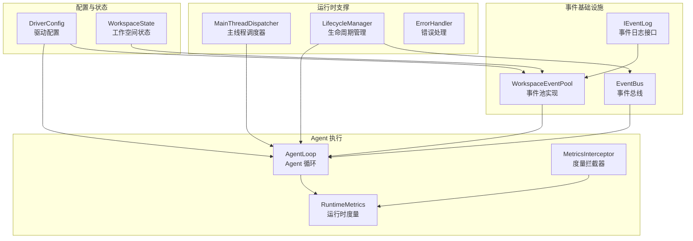
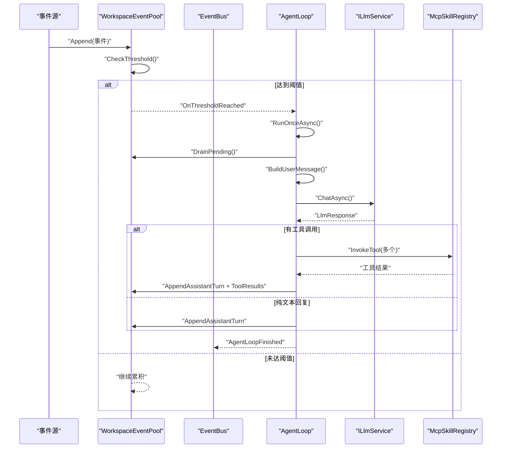
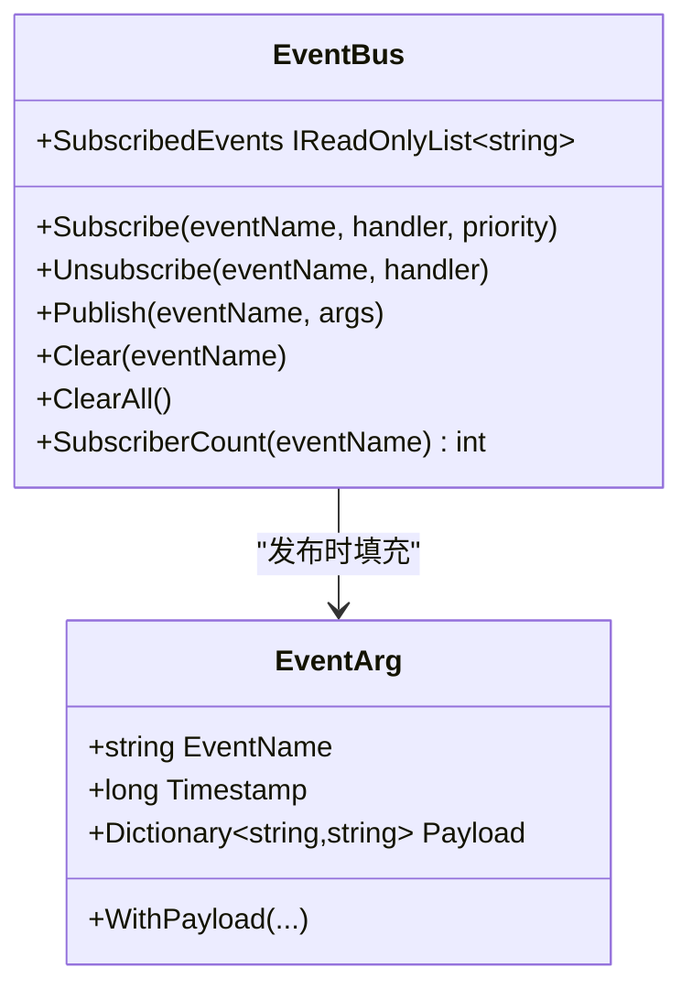
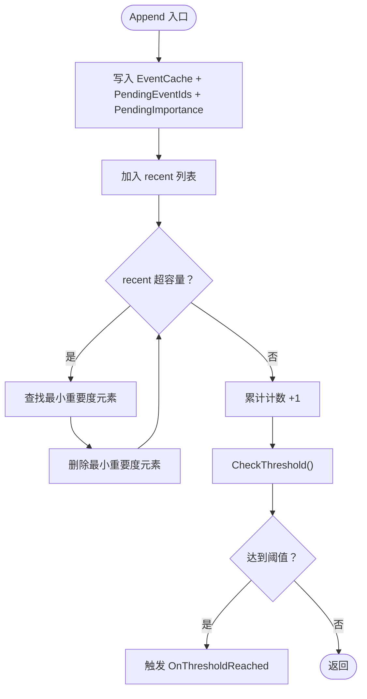
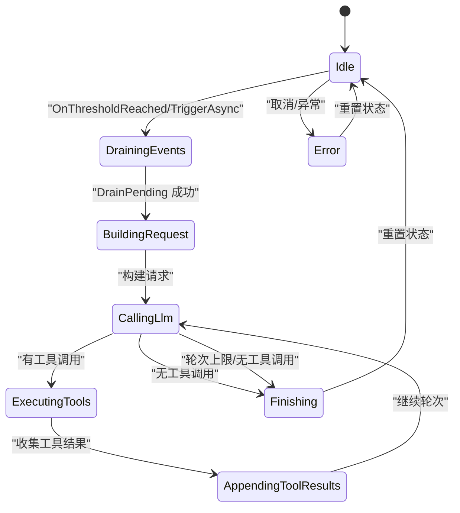
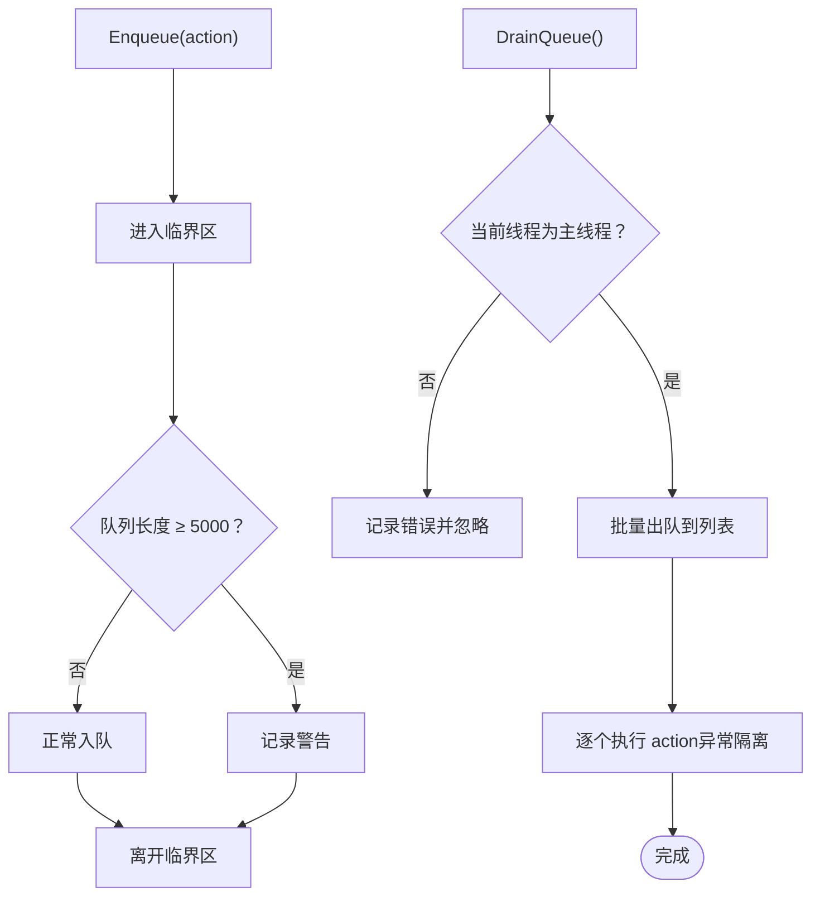
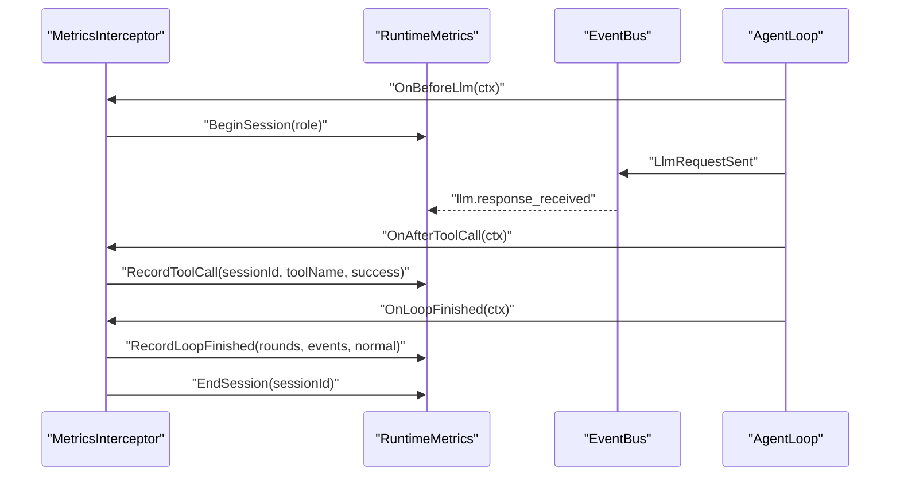
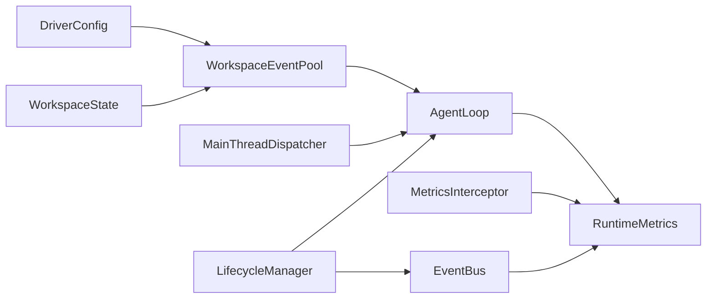

# 事件处理性能优化

<cite>
**本文引用的文件**
- [EventBus.cs](file://src/NPCLife/Framework/EventBus.cs)
- [WorkspaceEventPool.cs](file://src/NPCLife/Workspace/WorkspaceEventPool.cs)
- [IEventLog.cs](file://src/NPCLife/Core/IEventLog.cs)
- [DriverConfig.cs](file://src/NPCLife/Driver/DriverConfig.cs)
- [AgentLoop.cs](file://src/NPCLife/Agent/AgentLoop.cs)
- [MainThreadDispatcher.cs](file://src/NPCLife/Framework/MainThreadDispatcher.cs)
- [RuntimeMetrics.cs](file://src/NPCLife/Framework/RuntimeMetrics.cs)
- [MetricsInterceptor.cs](file://src/NPCLife/Framework/MetricsInterceptor.cs)
- [LifecycleManager.cs](file://src/NPCLife/Framework/LifecycleManager.cs)
- [ErrorHandler.cs](file://src/NPCLife/Framework/ErrorHandler.cs)
- [WorkspaceState.cs](file://src/NPCLife/Workspace/WorkspaceState.cs)
- [WorkspaceEventPoolTests.cs](file://tests/NPCLife.Tests/Driver/WorkspaceEventPoolTests.cs)
</cite>

## 目录
1. [简介](#简介)
2. [项目结构](#项目结构)
3. [核心组件](#核心组件)
4. [架构概览](#架构概览)
5. [详细组件分析](#详细组件分析)
6. [依赖关系分析](#依赖关系分析)
7. [性能考量](#性能考量)
8. [故障排查指南](#故障排查指南)
9. [结论](#结论)
10. [附录](#附录)

## 简介
本文件聚焦于事件处理系统的性能优化，围绕事件池、事件总线、Agent 循环、主线程调度与度量体系展开，系统性阐述批量处理、异步处理、并发控制、内存优化、CPU 密集型任务与线程池配置、网络 I/O 与 LLM 调用优化、性能监控与基准测试方法，并给出生产环境部署的最佳实践与故障诊断建议。

## 项目结构
- 事件基础设施：事件总线、事件池、事件接口
- Agent 执行：AgentLoop 状态机、工具调用、LLM 交互
- 运行时支撑：主线程调度器、生命周期管理、错误处理、度量与拦截器
- 配置与状态：DriverConfig、WorkspaceState
- 测试验证：事件池阈值与激活行为的单元测试

**图表来源**
- [EventBus.cs:17-155](file://src/NPCLife/Framework/EventBus.cs#L17-L155)
- [IEventLog.cs:12-50](file://src/NPCLife/Core/IEventLog.cs#L12-L50)
- [WorkspaceEventPool.cs:21-184](file://src/NPCLife/Workspace/WorkspaceEventPool.cs#L21-L184)
- [AgentLoop.cs:43-579](file://src/NPCLife/Agent/AgentLoop.cs#L43-L579)
- [MetricsInterceptor.cs:13-109](file://src/NPCLife/Framework/MetricsInterceptor.cs#L13-L109)
- [RuntimeMetrics.cs:29-444](file://src/NPCLife/Framework/RuntimeMetrics.cs#L29-L444)
- [MainThreadDispatcher.cs:13-146](file://src/NPCLife/Framework/MainThreadDispatcher.cs#L13-L146)
- [LifecycleManager.cs:23-263](file://src/NPCLife/Framework/LifecycleManager.cs#L23-L263)
- [DriverConfig.cs:9-106](file://src/NPCLife/Driver/DriverConfig.cs#L9-L106)
- [WorkspaceState.cs:94-150](file://src/NPCLife/Workspace/WorkspaceState.cs#L94-L150)

**章节来源**
- [EventBus.cs:17-155](file://src/NPCLife/Framework/EventBus.cs#L17-L155)
- [WorkspaceEventPool.cs:21-184](file://src/NPCLife/Workspace/WorkspaceEventPool.cs#L21-L184)
- [IEventLog.cs:12-50](file://src/NPCLife/Core/IEventLog.cs#L12-L50)
- [DriverConfig.cs:9-106](file://src/NPCLife/Driver/DriverConfig.cs#L9-L106)
- [AgentLoop.cs:43-579](file://src/NPCLife/Agent/AgentLoop.cs#L43-L579)
- [MainThreadDispatcher.cs:13-146](file://src/NPCLife/Framework/MainThreadDispatcher.cs#L13-L146)
- [RuntimeMetrics.cs:29-444](file://src/NPCLife/Framework/RuntimeMetrics.cs#L29-L444)
- [MetricsInterceptor.cs:13-109](file://src/NPCLife/Framework/MetricsInterceptor.cs#L13-L109)
- [LifecycleManager.cs:23-263](file://src/NPCLife/Framework/LifecycleManager.cs#L23-L263)
- [ErrorHandler.cs:22-206](file://src/NPCLife/Framework/ErrorHandler.cs#L22-L206)
- [WorkspaceState.cs:94-150](file://src/NPCLife/Workspace/WorkspaceState.cs#L94-L150)

## 核心组件
- 事件总线：提供发布/订阅、优先级排序、错误隔离、线程安全的事件分发。
- 事件池：基于工作空间的事件缓冲与阈值激活，支持 pending 与 recent 两层缓存。
- AgentLoop：基于显式状态机的异步执行循环，贯穿 LLM 调用与工具调用。
- 主线程调度器：限制队列长度，保证 UI/主线程安全执行。
- 度量与拦截器：在关键节点采集工具调用、会话、Token 使用与 Agent 循环统计。
- 生命周期管理：集中初始化、配置就绪、销毁与重置，保障资源有序释放。
- 错误处理：统一错误钩子、链路追踪、事件上报，便于定位问题。

**章节来源**
- [EventBus.cs:17-155](file://src/NPCLife/Framework/EventBus.cs#L17-L155)
- [WorkspaceEventPool.cs:21-184](file://src/NPCLife/Workspace/WorkspaceEventPool.cs#L21-L184)
- [IEventLog.cs:12-50](file://src/NPCLife/Core/IEventLog.cs#L12-L50)
- [AgentLoop.cs:43-579](file://src/NPCLife/Agent/AgentLoop.cs#L43-L579)
- [MainThreadDispatcher.cs:13-146](file://src/NPCLife/Framework/MainThreadDispatcher.cs#L13-L146)
- [RuntimeMetrics.cs:29-444](file://src/NPCLife/Framework/RuntimeMetrics.cs#L29-L444)
- [MetricsInterceptor.cs:13-109](file://src/NPCLife/Framework/MetricsInterceptor.cs#L13-L109)
- [LifecycleManager.cs:23-263](file://src/NPCLife/Framework/LifecycleManager.cs#L23-L263)
- [ErrorHandler.cs:22-206](file://src/NPCLife/Framework/ErrorHandler.cs#L22-L206)

## 架构概览
事件驱动的 Agent 执行链路如下：事件写入事件池 → 达到阈值触发 Agent 激活 → AgentLoop 消费事件、构建提示词 → LLM 调用 → 工具调用 → 结果回写事件池 → 下一轮激活。

**图表来源**
- [WorkspaceEventPool.cs:49-90](file://src/NPCLife/Workspace/WorkspaceEventPool.cs#L49-L90)
- [AgentLoop.cs:171-337](file://src/NPCLife/Agent/AgentLoop.cs#L171-L337)
- [EventBus.cs:86-113](file://src/NPCLife/Framework/EventBus.cs#L86-L113)

**章节来源**
- [WorkspaceEventPool.cs:49-90](file://src/NPCLife/Workspace/WorkspaceEventPool.cs#L49-L90)
- [AgentLoop.cs:171-337](file://src/NPCLife/Agent/AgentLoop.cs#L171-L337)
- [EventBus.cs:86-113](file://src/NPCLife/Framework/EventBus.cs#L86-L113)

## 详细组件分析

### 事件总线（EventBus）
- 设计要点
  - 线程安全：内部锁保护订阅表与快照遍历。
  - 错误隔离：单个处理器异常不影响其他处理器。
  - 优先级：订阅时按优先级排序，执行时按稳定排序依次调用。
  - 快照发布：发布时复制订阅列表，避免订阅变更导致的迭代异常。
- 性能特性
  - 订阅/取消订阅为 O(n log n)（排序），发布为 O(n) 遍历。
  - 适合中低频事件与少量处理器场景；高频事件建议配合批处理或限流。

**图表来源**
- [EventBus.cs:17-155](file://src/NPCLife/Framework/EventBus.cs#L17-L155)

**章节来源**
- [EventBus.cs:17-155](file://src/NPCLife/Framework/EventBus.cs#L17-L155)

### 事件池（WorkspaceEventPool）
- 设计要点
  - 双层缓冲：pending（持久化）+ recent（内存历史，按重要度淘汰）。
  - 阈值触发：事件数或重要度总和达到配置阈值时触发 OnThresholdReached。
  - DrainPending：一次性取出并清空 pending，避免重复处理。
  - 查询：对 recent 历史进行过滤、排序与分页。
- 性能特性
  - Append：O(1) 写入 + O(n) 最小重要度淘汰（n 为 recent 容量）。
  - CheckThreshold：O(1) 比较。
  - Query：O(n) 过滤 + 排序 + 分页。
  - 适合高吞吐事件的批处理与延迟聚合。

**图表来源**
- [WorkspaceEventPool.cs:49-90](file://src/NPCLife/Workspace/WorkspaceEventPool.cs#L49-L90)

**章节来源**
- [WorkspaceEventPool.cs:21-184](file://src/NPCLife/Workspace/WorkspaceEventPool.cs#L21-L184)
- [IEventLog.cs:12-50](file://src/NPCLife/Core/IEventLog.cs#L12-L50)
- [DriverConfig.cs:9-106](file://src/NPCLife/Driver/DriverConfig.cs#L9-L106)
- [WorkspaceState.cs:135-142](file://src/NPCLife/Workspace/WorkspaceState.cs#L135-L142)

### AgentLoop（Agent 循环）
- 设计要点
  - 显式状态机：Idle → DrainingEvents → BuildingRequest → CallingLlm → ExecutingTools → AppendingToolResults → Finishing/Error。
  - 防重入：SemaphoreSlim 保证单实例运行。
  - 取消传播：CancellationTokenSource 贯穿链路，支持外部取消。
  - 事件驱动：仅在 OnThresholdReached 或 TriggerAsync 主动触发。
  - Transcript 验证：每轮 LLM 前校验消息历史结构。
- 性能特性
  - 异步链路：LLM 调用与工具调用均为异步，避免阻塞。
  - 最大轮数：防止死循环，提升稳定性。
  - 事件回灌：失败时将已 drain 的事件重新写回池，保证幂等。

**图表来源**
- [AgentLoop.cs:19-38](file://src/NPCLife/Agent/AgentLoop.cs#L19-L38)
- [AgentLoop.cs:171-337](file://src/NPCLife/Agent/AgentLoop.cs#L171-L337)

**章节来源**
- [AgentLoop.cs:43-579](file://src/NPCLife/Agent/AgentLoop.cs#L43-L579)

### 主线程调度器（MainThreadDispatcher）
- 设计要点
  - 限制队列长度，超过阈值发出警告，避免内存膨胀。
  - DrainQueue 必须在主线程调用，防止跨线程 UI 访问。
  - 支持 EnqueueAsync 在主线程同步执行或异步返回 Task。
- 性能特性
  - 队列操作为 O(1)，DrainQueue 批量执行降低锁竞争。
  - 适用于 UI/渲染线程的回调调度，避免卡顿。

**图表来源**
- [MainThreadDispatcher.cs:46-108](file://src/NPCLife/Framework/MainThreadDispatcher.cs#L46-L108)

**章节来源**
- [MainThreadDispatcher.cs:13-146](file://src/NPCLife/Framework/MainThreadDispatcher.cs#L13-L146)

### 度量与拦截器（RuntimeMetrics + MetricsInterceptor）
- 设计要点
  - MetricsInterceptor 在 LLM 请求前开启会话，工具调用后记录调用次数与成功率，循环结束后汇总统计并结束会话。
  - RuntimeMetrics 以会话为中心聚合 Token 使用、工具调用、知识库查询、Agent 循环次数与错误数。
- 性能特性
  - 无侵入采集：通过事件总线与拦截器驱动，不改变核心业务逻辑。
  - 角色维度统计：按 Director/Screenwriter/Freelancer 维度聚合，便于横向对比。

**图表来源**
- [MetricsInterceptor.cs:39-84](file://src/NPCLife/Framework/MetricsInterceptor.cs#L39-L84)
- [RuntimeMetrics.cs:45-76](file://src/NPCLife/Framework/RuntimeMetrics.cs#L45-L76)
- [RuntimeMetrics.cs:113-141](file://src/NPCLife/Framework/RuntimeMetrics.cs#L113-L141)
- [RuntimeMetrics.cs:209-220](file://src/NPCLife/Framework/RuntimeMetrics.cs#L209-L220)

**章节来源**
- [MetricsInterceptor.cs:13-109](file://src/NPCLife/Framework/MetricsInterceptor.cs#L13-L109)
- [RuntimeMetrics.cs:29-444](file://src/NPCLife/Framework/RuntimeMetrics.cs#L29-L444)

### 生命周期管理（LifecycleManager）
- 设计要点
  - 统一注册/级联销毁、OnInit/OnConfigReady/OnDestroy 钩子，支持优先级排序。
  - Initialize/NotifyConfigReady/Shutdown/Reset 提供幂等生命周期入口。
- 性能特性
  - 逆序 Dispose 保证资源释放顺序可控，避免泄漏。
  - 清理事件总线订阅，防止悬挂引用。

**章节来源**
- [LifecycleManager.cs:23-263](file://src/NPCLife/Framework/LifecycleManager.cs#L23-L263)

### 错误处理（ErrorHandler）
- 设计要点
  - 全局错误处理器注册与报告，支持链路追踪 TraceId。
  - 事件总线上报 LLM 错误，便于统一监控。
- 性能特性
  - 处理器异常隔离，不影响其他处理器。
  - 诊断模式下输出详细上下文，利于定位。

**章节来源**
- [ErrorHandler.cs:22-206](file://src/NPCLife/Framework/ErrorHandler.cs#L22-L206)

## 依赖关系分析
- 事件池依赖 DriverConfig 决定阈值与历史容量；依赖 WorkspaceState 的持久化字段。
- AgentLoop 依赖 IEventLog（事件池）、ILlmService、ICredentialRegistry、IKnowledgeService、Mcp 技能注册表。
- 度量拦截器依赖 RuntimeMetrics；RuntimeMetrics 通过事件总线订阅 LLM 响应事件。
- 主线程调度器与生命周期管理分别服务于 UI/主线程与组件生命周期。

**图表来源**
- [DriverConfig.cs:9-106](file://src/NPCLife/Driver/DriverConfig.cs#L9-L106)
- [WorkspaceEventPool.cs:21-43](file://src/NPCLife/Workspace/WorkspaceEventPool.cs#L21-L43)
- [WorkspaceState.cs:135-142](file://src/NPCLife/Workspace/WorkspaceState.cs#L135-L142)
- [AgentLoop.cs:43-116](file://src/NPCLife/Agent/AgentLoop.cs#L43-L116)
- [RuntimeMetrics.cs:29-444](file://src/NPCLife/Framework/RuntimeMetrics.cs#L29-L444)
- [MetricsInterceptor.cs:13-109](file://src/NPCLife/Framework/MetricsInterceptor.cs#L13-L109)
- [EventBus.cs:17-155](file://src/NPCLife/Framework/EventBus.cs#L17-L155)
- [MainThreadDispatcher.cs:13-146](file://src/NPCLife/Framework/MainThreadDispatcher.cs#L13-L146)
- [LifecycleManager.cs:23-263](file://src/NPCLife/Framework/LifecycleManager.cs#L23-L263)

**章节来源**
- [DriverConfig.cs:9-106](file://src/NPCLife/Driver/DriverConfig.cs#L9-L106)
- [WorkspaceEventPool.cs:21-43](file://src/NPCLife/Workspace/WorkspaceEventPool.cs#L21-L43)
- [WorkspaceState.cs:135-142](file://src/NPCLife/Workspace/WorkspaceState.cs#L135-L142)
- [AgentLoop.cs:43-116](file://src/NPCLife/Agent/AgentLoop.cs#L43-L116)
- [RuntimeMetrics.cs:29-444](file://src/NPCLife/Framework/RuntimeMetrics.cs#L29-L444)
- [MetricsInterceptor.cs:13-109](file://src/NPCLife/Framework/MetricsInterceptor.cs#L13-L109)
- [EventBus.cs:17-155](file://src/NPCLife/Framework/EventBus.cs#L17-L155)
- [MainThreadDispatcher.cs:13-146](file://src/NPCLife/Framework/MainThreadDispatcher.cs#L13-L146)
- [LifecycleManager.cs:23-263](file://src/NPCLife/Framework/LifecycleManager.cs#L23-L263)

## 性能考量

### 批量处理与阈值调优
- 事件池阈值
  - 事件数阈值与重要度阈值分别控制激活时机，避免过早/过晚触发。
  - 建议根据事件到达速率与 Agent 处理能力调整，减少频繁小批次处理。
- recent 历史容量
  - 影响查询性能与内存占用，容量越大查询越灵活但内存越高。
- DrainPending
  - 一次性取出并清空，避免重复处理与竞态。

**章节来源**
- [WorkspaceEventPool.cs:49-90](file://src/NPCLife/Workspace/WorkspaceEventPool.cs#L49-L90)
- [DriverConfig.cs:42-85](file://src/NPCLife/Driver/DriverConfig.cs#L42-L85)
- [WorkspaceEventPoolTests.cs:138-197](file://tests/NPCLife.Tests/Driver/WorkspaceEventPoolTests.cs#L138-L197)

### 异步处理与并发控制
- AgentLoop
  - 使用 SemaphoreSlim 防重入，避免并发运行。
  - CancellationToken 贯穿链路，支持外部取消。
- 主线程调度器
  - 限制队列长度，避免主线程拥塞。
  - 批量 DrainQueue 降低锁持有时间。

**章节来源**
- [AgentLoop.cs:61-65](file://src/NPCLife/Agent/AgentLoop.cs#L61-L65)
- [AgentLoop.cs:122-139](file://src/NPCLife/Agent/AgentLoop.cs#L122-L139)
- [MainThreadDispatcher.cs:18-20](file://src/NPCLife/Framework/MainThreadDispatcher.cs#L18-L20)
- [MainThreadDispatcher.cs:62-108](file://src/NPCLife/Framework/MainThreadDispatcher.cs#L62-L108)

### 内存使用优化
- 事件池
  - recent 淘汰策略按最小重要度删除，控制内存峰值。
  - pending 持久化到 WorkspaceState，避免内存膨胀。
- 字符串与集合
  - 使用 HashSet 去重关键词，减少重复查询。
  - StringBuilder 构建提示词，降低中间对象分配。
- 队列与锁
  - 主线程调度器使用固定容量队列与细粒度锁，避免无限增长。

**章节来源**
- [WorkspaceEventPool.cs:61-74](file://src/NPCLife/Workspace/WorkspaceEventPool.cs#L61-L74)
- [AgentLoop.cs:462-478](file://src/NPCLife/Agent/AgentLoop.cs#L462-L478)
- [MainThreadDispatcher.cs:15-20](file://src/NPCLife/Framework/MainThreadDispatcher.cs#L15-L20)

### CPU 密集型任务与线程池配置
- 当前实现
  - AgentLoop 与事件池主要为 I/O 密集型（LLM、工具调用、序列化）。
  - 未直接使用线程池 API，推荐保持异步模型，避免阻塞线程。
- 优化建议
  - 对于可并行的工具调用，可在工具内部使用并行处理（注意幂等与一致性）。
  - 对于长耗时的本地计算，考虑后台线程或异步化，避免阻塞主线程与 Agent 循环。

**章节来源**
- [AgentLoop.cs:266-305](file://src/NPCLife/Agent/AgentLoop.cs#L266-L305)

### 网络 I/O 与 LLM 调用优化
- 请求前拦截
  - 使用 AgentPipeline.BeforeLlm 与 MetricsInterceptor 记录会话与工具调用。
- 响应事件
  - 通过事件总线订阅 llm.response_received，采集 Token 使用与模型信息。
- 传输验证
  - TranscriptValidator 在每轮 LLM 前验证消息历史，减少无效请求。

**章节来源**
- [AgentLoop.cs:225-248](file://src/NPCLife/Agent/AgentLoop.cs#L225-L248)
- [MetricsInterceptor.cs:39-84](file://src/NPCLife/Framework/MetricsInterceptor.cs#L39-L84)
- [RuntimeMetrics.cs:85-104](file://src/NPCLife/Framework/RuntimeMetrics.cs#L85-L104)

### 性能监控与基准测试
- 监控指标
  - 会话维度：输入/输出 Token、缓存命中、调用次数、错误率。
  - 工具维度：调用次数、成功率、错误分布。
  - Agent 循环：激活次数、平均轮次、事件处理总量、错误次数。
  - 工作空间：操作次数与类型。
- 基准测试
  - 使用 WorkspaceEventPoolTests 验证阈值触发、Drain 行为与多工作空间隔离。
  - 通过 MetricsInterceptor 与 RuntimeMetrics 采集真实运行数据。

**章节来源**
- [RuntimeMetrics.cs:246-365](file://src/NPCLife/Framework/RuntimeMetrics.cs#L246-L365)
- [WorkspaceEventPoolTests.cs:138-197](file://tests/NPCLife.Tests/Driver/WorkspaceEventPoolTests.cs#L138-L197)

## 故障排查指南
- 事件未触发
  - 检查事件池阈值是否合理，确认 OnThresholdReached 是否被订阅。
  - 核对事件是否写入 pending 且未被 Drain。
- Agent 未运行
  - 确认 AgentLoop.State 是否处于 Idle，是否存在并发运行（Gate）。
  - 检查取消令牌是否提前触发。
- LLM 错误
  - 通过 ErrorHandler 报告与事件总线 llm.error 上报定位。
  - 检查凭证注册表是否有效，模型别名是否匹配。
- 主线程卡顿
  - 检查主线程调度器队列长度与执行时间，避免在主线程做重计算。
- 生命周期问题
  - 使用 LifecycleManager.Reset 进行存档切换时，确认组件已正确注册与销毁。

**章节来源**
- [WorkspaceEventPool.cs:81-90](file://src/NPCLife/Workspace/WorkspaceEventPool.cs#L81-L90)
- [AgentLoop.cs:122-139](file://src/NPCLife/Agent/AgentLoop.cs#L122-L139)
- [ErrorHandler.cs:97-163](file://src/NPCLife/Framework/ErrorHandler.cs#L97-L163)
- [MainThreadDispatcher.cs:46-108](file://src/NPCLife/Framework/MainThreadDispatcher.cs#L46-L108)
- [LifecycleManager.cs:234-240](file://src/NPCLife/Framework/LifecycleManager.cs#L234-L240)

## 结论
本项目通过事件池与事件总线实现解耦的事件驱动架构，结合 AgentLoop 的显式状态机与拦截器度量体系，形成可观察、可扩展、可优化的事件处理流水线。性能优化重点在于：合理设置事件池阈值与历史容量、利用异步与防重入机制、限制主线程负载、在关键节点采集度量并持续回归测试。生产部署建议以配置为中心进行灰度与容量压测，结合度量指标与错误追踪快速定位问题。

## 附录
- 配置项参考
  - DriverConfig：各角色阈值、历史容量、最大轮数、定时器间隔。
  - WorkspaceState：事件缓存、待处理事件 ID 列表、累积重要度。
- 测试用例参考
  - WorkspaceEventPoolTests：阈值触发、Drain 行为、多工作空间隔离。

**章节来源**
- [DriverConfig.cs:9-106](file://src/NPCLife/Driver/DriverConfig.cs#L9-L106)
- [WorkspaceState.cs:135-142](file://src/NPCLife/Workspace/WorkspaceState.cs#L135-L142)
- [WorkspaceEventPoolTests.cs:138-197](file://tests/NPCLife.Tests/Driver/WorkspaceEventPoolTests.cs#L138-L197)