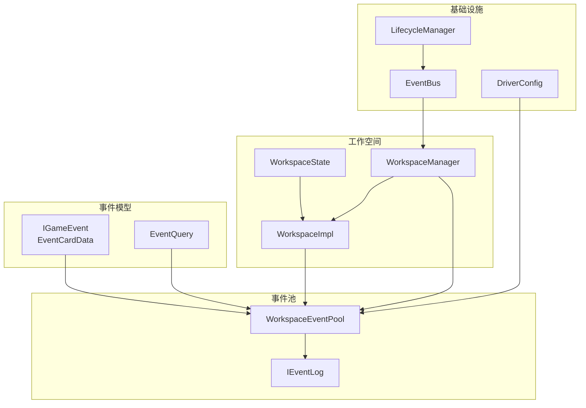
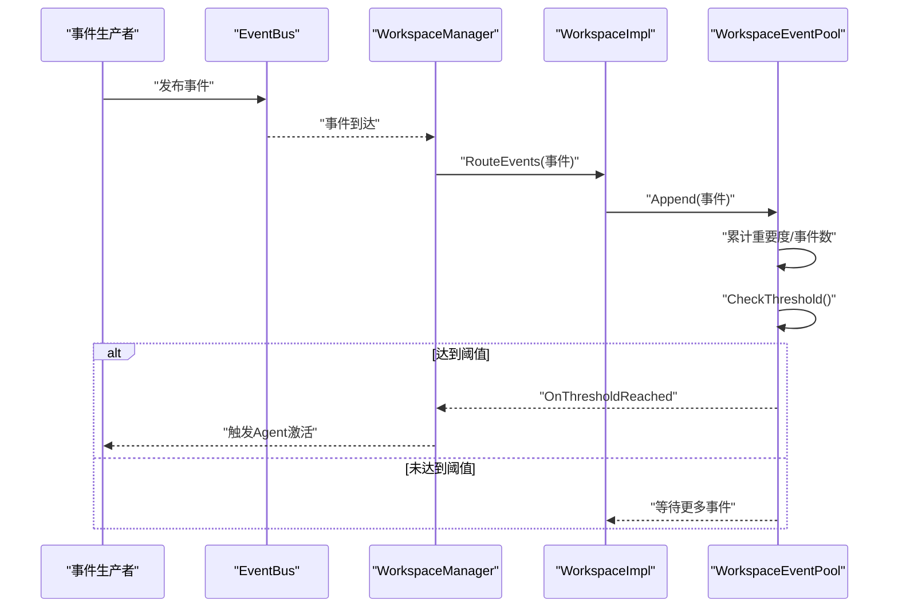
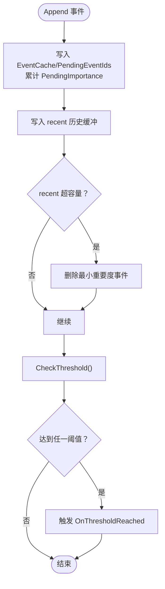
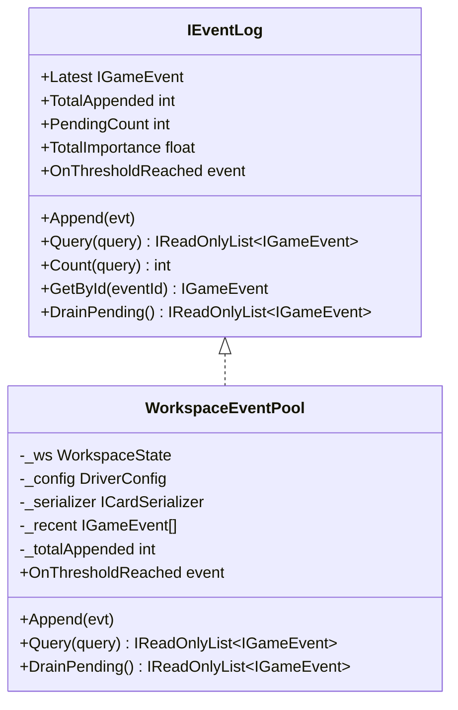
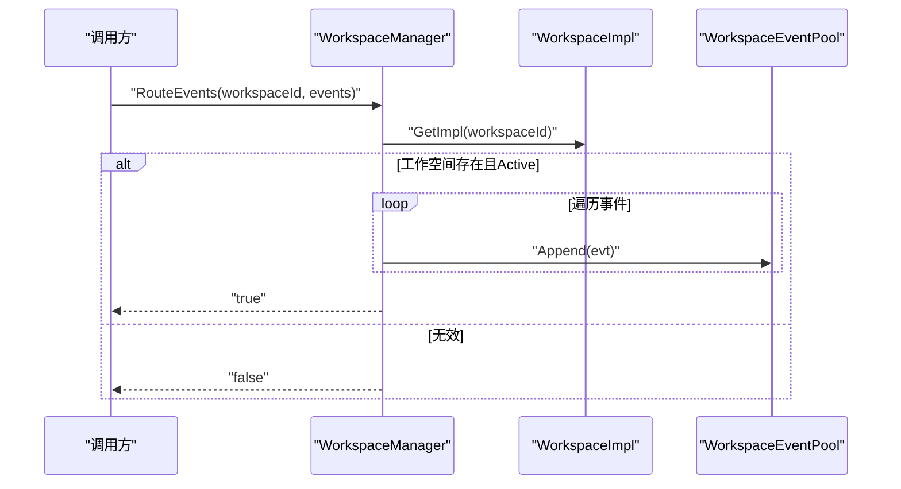
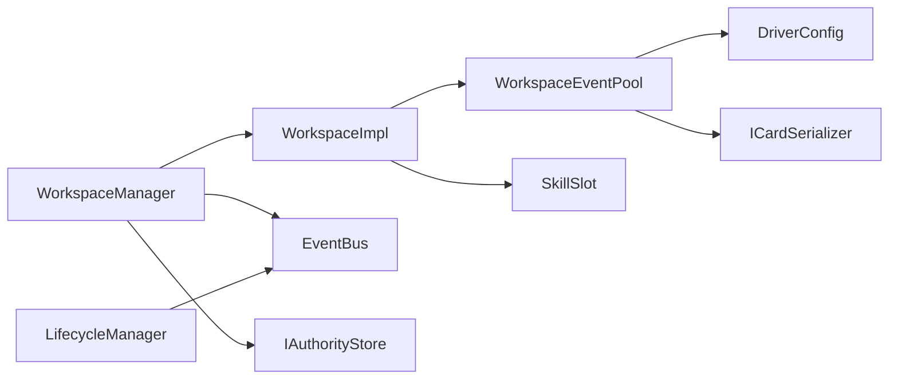

# 事件处理系统

<cite>
**本文引用的文件**
- [EventBus.cs](file://src/NPCLife/Framework/EventBus.cs)
- [WorkspaceEventPool.cs](file://src/NPCLife/Workspace/WorkspaceEventPool.cs)
- [EventQuery.cs](file://src/NPCLife/Core/EventQuery.cs)
- [WorkspaceManager.cs](file://src/NPCLife/Workspace/WorkspaceManager.cs)
- [WorkspaceImpl.cs](file://src/NPCLife/Workspace/WorkspaceImpl.cs)
- [DriverConfig.cs](file://src/NPCLife/Driver/DriverConfig.cs)
- [EventCard.cs](file://src/NPCLife/Cards/EventCard.cs)
- [IEventLog.cs](file://src/NPCLife/Core/IEventLog.cs)
- [WorkspaceState.cs](file://src/NPCLife/Workspace/WorkspaceState.cs)
- [LifecycleManager.cs](file://src/NPCLife/Framework/LifecycleManager.cs)
- [WorkspaceEventPoolTests.cs](file://tests/NPCLife.Tests/Driver/WorkspaceEventPoolTests.cs)
- [EventQueryTests.cs](file://tests/NPCLife.Tests/Core/EventQueryTests.cs)
</cite>

## 目录
1. [引言](#引言)
2. [项目结构](#项目结构)
3. [核心组件](#核心组件)
4. [架构总览](#架构总览)
5. [详细组件分析](#详细组件分析)
6. [依赖关系分析](#依赖关系分析)
7. [性能考虑](#性能考虑)
8. [故障排查指南](#故障排查指南)
9. [结论](#结论)
10. [附录](#附录)

## 引言
本文件系统化阐述事件处理系统的设计与实现，重点覆盖以下方面：
- 事件阈值触发机制：基于事件池的事件数与重要度双阈值判定，支持按角色区分阈值与定时器脉冲。
- 事件池管理策略：事件积累、重要度计算、阈值判断与激活通知；同时维护近期事件历史缓冲，支持高效查询。
- 事件路由与分配：工作空间管理器负责事件路由至目标工作空间，导演据此选择合适的工作空间进行处理。
- 性能优化：批量处理、延迟处理与资源管理策略，降低事件处理开销。
- 监控与调试：事件总线与生命周期管理提供的可观测性与调试手段。
- 配置示例与调优建议：基于配置对象的参数化控制与实践建议。

## 项目结构
事件处理系统围绕“事件模型—事件池—工作空间—事件总线”展开，核心文件分布如下：
- 事件模型与查询：IGameEvent、EventCardData、EventQuery 定义事件结构与查询参数。
- 事件池：WorkspaceEventPool 实现事件积累、阈值检测与激活通知。
- 工作空间：WorkspaceState 描述工作空间状态；WorkspaceImpl 包装事件池与技能槽；WorkspaceManager 负责路由与持久化。
- 事件总线：EventBus 提供发布/订阅、优先级排序与错误隔离。
- 配置：DriverConfig 提供按角色的阈值与定时器配置。
- 生命周期：LifecycleManager 提供统一初始化、配置就绪与销毁流程。

图表来源
- [WorkspaceEventPool.cs:1-186](file://src/NPCLife/Workspace/WorkspaceEventPool.cs#L1-L186)
- [IEventLog.cs:1-52](file://src/NPCLife/Core/IEventLog.cs#L1-L52)
- [WorkspaceImpl.cs:1-197](file://src/NPCLife/Workspace/WorkspaceImpl.cs#L1-L197)
- [WorkspaceManager.cs:1-616](file://src/NPCLife/Workspace/WorkspaceManager.cs#L1-L616)
- [EventBus.cs:1-243](file://src/NPCLife/Framework/EventBus.cs#L1-L243)
- [DriverConfig.cs:1-107](file://src/NPCLife/Driver/DriverConfig.cs#L1-L107)
- [LifecycleManager.cs:1-264](file://src/NPCLife/Framework/LifecycleManager.cs#L1-L264)

章节来源
- [WorkspaceEventPool.cs:1-186](file://src/NPCLife/Workspace/WorkspaceEventPool.cs#L1-L186)
- [WorkspaceImpl.cs:1-197](file://src/NPCLife/Workspace/WorkspaceImpl.cs#L1-L197)
- [WorkspaceManager.cs:1-616](file://src/NPCLife/Workspace/WorkspaceManager.cs#L1-L616)
- [EventBus.cs:1-243](file://src/NPCLife/Framework/EventBus.cs#L1-L243)
- [DriverConfig.cs:1-107](file://src/NPCLife/Driver/DriverConfig.cs#L1-L107)
- [IEventLog.cs:1-52](file://src/NPCLife/Core/IEventLog.cs#L1-L52)
- [EventCard.cs:1-126](file://src/NPCLife/Cards/EventCard.cs#L1-L126)
- [EventQuery.cs:1-48](file://src/NPCLife/Core/EventQuery.cs#L1-L48)
- [WorkspaceState.cs:1-152](file://src/NPCLife/Workspace/WorkspaceState.cs#L1-L152)
- [LifecycleManager.cs:1-264](file://src/NPCLife/Framework/LifecycleManager.cs#L1-L264)

## 核心组件
- 事件模型与查询
  - IGameEvent：统一事件契约，包含事件ID、定义名、标签、关键词、发生时刻、重要度、参与者、地图提示与扩展载荷。
  - EventCardData：可序列化的事件实现，便于缓存与跨边界传输。
  - EventQuery：多维查询参数，支持标签OR/AND、时间范围、演员过滤、最小重要度、分页等。
- 事件池
  - WorkspaceEventPool：实现IEventLog，负责事件写入、阈值检测、最近事件历史缓冲与DrainPending。
- 工作空间
  - WorkspaceState：工作空间状态DTO，包含事件缓存、待处理事件ID队列与累积重要度。
  - WorkspaceImpl：封装事件池与技能槽，暴露元数据与叙事操作。
  - WorkspaceManager：负责工作空间CRUD、分支/合并、事件路由与持久化。
- 事件总线
  - EventBus：静态事件总线，支持命名空间事件名、优先级排序、错误隔离与调试接口。
- 配置
  - DriverConfig：按角色的事件数与重要度阈值、定时器脉冲间隔、历史缓冲容量等配置。
- 生命周期
  - LifecycleManager：统一注册组件、初始化、配置就绪与销毁流程。

章节来源
- [EventCard.cs:1-126](file://src/NPCLife/Cards/EventCard.cs#L1-L126)
- [EventQuery.cs:1-48](file://src/NPCLife/Core/EventQuery.cs#L1-L48)
- [WorkspaceEventPool.cs:1-186](file://src/NPCLife/Workspace/WorkspaceEventPool.cs#L1-L186)
- [WorkspaceState.cs:1-152](file://src/NPCLife/Workspace/WorkspaceState.cs#L1-L152)
- [WorkspaceImpl.cs:1-197](file://src/NPCLife/Workspace/WorkspaceImpl.cs#L1-L197)
- [WorkspaceManager.cs:1-616](file://src/NPCLife/Workspace/WorkspaceManager.cs#L1-L616)
- [EventBus.cs:1-243](file://src/NPCLife/Framework/EventBus.cs#L1-L243)
- [DriverConfig.cs:1-107](file://src/NPCLife/Driver/DriverConfig.cs#L1-L107)
- [IEventLog.cs:1-52](file://src/NPCLife/Core/IEventLog.cs#L1-L52)
- [LifecycleManager.cs:1-264](file://src/NPCLife/Framework/LifecycleManager.cs#L1-L264)

## 架构总览
事件处理系统采用“事件池驱动 + 工作空间路由”的模式：
- 事件产生后经事件总线广播，工作空间管理器根据事件特征与来源路由到目标工作空间。
- 每个工作空间维护独立事件池，按角色阈值触发Agent激活。
- 导演根据工作空间状态与事件池激活情况，选择合适的技能与工具链进行处理。

图表来源
- [EventBus.cs:86-113](file://src/NPCLife/Framework/EventBus.cs#L86-L113)
- [WorkspaceManager.cs:382-392](file://src/NPCLife/Workspace/WorkspaceManager.cs#L382-L392)
- [WorkspaceImpl.cs:71](file://src/NPCLife/Workspace/WorkspaceImpl.cs#L71)
- [WorkspaceEventPool.cs:49-89](file://src/NPCLife/Workspace/WorkspaceEventPool.cs#L49-L89)

## 详细组件分析

### 事件阈值触发机制
- 设计原理
  - 双阈值判定：事件池在每次Append后评估，若事件数或累积重要度任一达到阈值，则触发OnThresholdReached。
  - 角色差异化：不同角色（导演/临时编剧/剧情编剧）拥有独立阈值，由DriverConfig按角色映射。
  - 激活语义：阈值满足后，订阅者（如AgentLoop）被动激活，开始消费DrainPending取出的事件集合。
- 实现细节
  - 事件池累计PendingCount与TotalImportance，阈值检查在Append末尾执行。
  - 事件池同时维护recent历史缓冲，按配置容量裁剪，保留最低重要度事件以保证查询效率。
  - 定时器脉冲：DriverConfig提供按角色的定时器间隔，用于周期性注入TimerPulse事件，驱动快速响应场景。

图表来源
- [WorkspaceEventPool.cs:49-89](file://src/NPCLife/Workspace/WorkspaceEventPool.cs#L49-L89)
- [WorkspaceEventPool.cs:61-74](file://src/NPCLife/Workspace/WorkspaceEventPool.cs#L61-L74)
- [DriverConfig.cs:54-101](file://src/NPCLife/Driver/DriverConfig.cs#L54-L101)

章节来源
- [WorkspaceEventPool.cs:49-89](file://src/NPCLife/Workspace/WorkspaceEventPool.cs#L49-L89)
- [DriverConfig.cs:54-101](file://src/NPCLife/Driver/DriverConfig.cs#L54-L101)
- [WorkspaceEventPoolTests.cs:138-197](file://tests/NPCLife.Tests/Driver/WorkspaceEventPoolTests.cs#L138-L197)

### 事件池管理策略
- 事件积累
  - 持久化缓冲：事件序列化后写入WorkspaceState.EventCache，ID加入PendingEventIds，重要度累加到PendingImportance。
  - 内存历史：recent列表仅保留最近事件，按重要度裁剪，确保查询与Drain效率。
- 重要度计算
  - Append阶段直接累加事件Importance，避免额外扫描。
  - TotalImportance用于阈值判断与统计。
- 触发条件判断
  - 任一阈值满足即触发，支持多次触发与Drain后重置。
- 查询与Drain
  - Query支持标签、时间范围、演员、最小重要度与分页；Latest与GetById提供便捷访问。
  - DrainPending清空pending并返回事件所有权，随后重置计数与重要度。

图表来源
- [IEventLog.cs:12-50](file://src/NPCLife/Core/IEventLog.cs#L12-L50)
- [WorkspaceEventPool.cs:21-43](file://src/NPCLife/Workspace/WorkspaceEventPool.cs#L21-L43)

章节来源
- [WorkspaceEventPool.cs:49-183](file://src/NPCLife/Workspace/WorkspaceEventPool.cs#L49-L183)
- [IEventLog.cs:12-50](file://src/NPCLife/Core/IEventLog.cs#L12-L50)

### 事件路由策略与分配算法
- 路由入口
  - WorkspaceManager.RouteEvents根据workspaceId定位目标工作空间，校验状态为Active后逐条Append事件。
- 分配决策
  - 导演（Director）可对工作空间进行分支与合并，形成树状结构；分支/合并轮次仅记录结构信息，不包含叙事台词。
  - 工作空间状态枚举支持Active/Suspended/Completed/Abandoned，状态转换受有效性约束。
- 事件特征选择工作空间
  - 事件标签、演员、时间戳与重要度可用于上层策略选择目标工作空间；当前实现由调用方负责路由到正确工作空间。

图表来源
- [WorkspaceManager.cs:382-392](file://src/NPCLife/Workspace/WorkspaceManager.cs#L382-L392)
- [WorkspaceImpl.cs:71](file://src/NPCLife/Workspace/WorkspaceImpl.cs#L71)
- [WorkspaceEventPool.cs:49](file://src/NPCLife/Workspace/WorkspaceEventPool.cs#L49)

章节来源
- [WorkspaceManager.cs:382-392](file://src/NPCLife/Workspace/WorkspaceManager.cs#L382-L392)
- [WorkspaceState.cs:25-38](file://src/NPCLife/Workspace/WorkspaceState.cs#L25-L38)

### 事件查询与过滤
- EventQuery支持多维过滤与分页，内部通过LINQ链式筛选与排序，最终按Offset/Limit返回结果。
- 测试验证了默认值、工厂方法与组合参数的正确性。

章节来源
- [EventQuery.cs:9-46](file://src/NPCLife/Core/EventQuery.cs#L9-L46)
- [EventQueryTests.cs:14-102](file://tests/NPCLife.Tests/Core/EventQueryTests.cs#L14-L102)

### 事件总线与生命周期
- EventBus提供发布/订阅、优先级排序与错误隔离；支持清理与调试接口（订阅数、事件名列表）。
- LifecycleManager统一注册组件、初始化、配置就绪与销毁，发布框架生命周期事件，便于系统级观测与调试。

章节来源
- [EventBus.cs:46-154](file://src/NPCLife/Framework/EventBus.cs#L46-L154)
- [LifecycleManager.cs:159-240](file://src/NPCLife/Framework/LifecycleManager.cs#L159-L240)

## 依赖关系分析
- 组件耦合
  - WorkspaceEventPool依赖DriverConfig与ICardSerializer，耦合度低，便于测试与替换。
  - WorkspaceImpl聚合事件池与技能槽，作为工作空间的门面。
  - WorkspaceManager协调事件路由与持久化，承担较高内聚性。
- 外部依赖
  - 事件序列化依赖ICardSerializer；事件总线为纯静态无外部依赖。
- 循环依赖
  - 未发现循环依赖；事件池与工作空间通过接口解耦。

图表来源
- [WorkspaceEventPool.cs:32-43](file://src/NPCLife/Workspace/WorkspaceEventPool.cs#L32-L43)
- [WorkspaceImpl.cs:38-45](file://src/NPCLife/Workspace/WorkspaceImpl.cs#L38-L45)
- [WorkspaceManager.cs:31-40](file://src/NPCLife/Workspace/WorkspaceManager.cs#L31-L40)
- [LifecycleManager.cs:169-170](file://src/NPCLife/Framework/LifecycleManager.cs#L169-L170)

章节来源
- [WorkspaceEventPool.cs:32-43](file://src/NPCLife/Workspace/WorkspaceEventPool.cs#L32-L43)
- [WorkspaceImpl.cs:38-45](file://src/NPCLife/Workspace/WorkspaceImpl.cs#L38-L45)
- [WorkspaceManager.cs:31-40](file://src/NPCLife/Workspace/WorkspaceManager.cs#L31-L40)
- [LifecycleManager.cs:169-170](file://src/NPCLife/Framework/LifecycleManager.cs#L169-L170)

## 性能考虑
- 批量处理
  - 事件池在Append阶段累计重要度，避免多次扫描；DrainPending一次性取出并清空，减少后续查询成本。
- 延迟处理
  - 定时器脉冲（按角色配置）可周期性注入事件，缓解突发流量；RecentHistoryCapacity限制内存占用。
- 资源管理
  - recent缓冲按重要度裁剪，优先保留高价值事件；PendingImportance持久化避免反序列化重算。
- 查询优化
  - Query通过多维过滤与分页返回，避免全量扫描；OrderBy(Tick)保证时间有序。
- 错误隔离
  - 事件总线在发布时捕获处理器异常，不影响其他订阅者。

章节来源
- [WorkspaceEventPool.cs:61-74](file://src/NPCLife/Workspace/WorkspaceEventPool.cs#L61-L74)
- [DriverConfig.cs:42-46](file://src/NPCLife/Driver/DriverConfig.cs#L42-L46)
- [EventBus.cs:104-112](file://src/NPCLife/Framework/EventBus.cs#L104-L112)

## 故障排查指南
- 事件未触发激活
  - 检查事件池阈值：确认事件数与重要度是否达到角色阈值；确认订阅者是否正确订阅OnThresholdReached。
  - 检查工作空间状态：仅Active工作空间才接受路由；确认WorkspaceManager.RouteEvents返回true。
- 事件丢失或重复
  - 检查EventCache与PendingEventIds是否正确写入；DrainPending后PendingImportance是否清零。
- 查询结果异常
  - 使用EventQuery的工厂方法与组合参数进行断言；参考测试用例验证行为。
- 生命周期问题
  - 使用LifecycleManager.RegisterDisposable注册组件；在Reset前后确认事件总线清理与重新初始化。

章节来源
- [WorkspaceEventPoolTests.cs:138-197](file://tests/NPCLife.Tests/Driver/WorkspaceEventPoolTests.cs#L138-L197)
- [WorkspaceManager.cs:382-392](file://src/NPCLife/Workspace/WorkspaceManager.cs#L382-L392)
- [EventQueryTests.cs:14-102](file://tests/NPCLife.Tests/Core/EventQueryTests.cs#L14-L102)
- [LifecycleManager.cs:234-240](file://src/NPCLife/Framework/LifecycleManager.cs#L234-L240)

## 结论
事件处理系统通过“事件池阈值驱动 + 工作空间路由”的架构，实现了高内聚、低耦合的事件处理流水线。双阈值机制与角色差异化配置提供了灵活的触发策略；事件池的内存/持久化双重缓冲兼顾了性能与可靠性；事件总线与生命周期管理增强了可观测性与可维护性。结合批量处理、延迟处理与资源管理策略，系统能够在高并发场景下保持稳定与高效。

## 附录

### 配置示例与调优建议
- 角色阈值调优
  - 导演：提高事件数阈值以减少频繁激活，降低重要度阈值以捕捉低频高价值事件。
  - 临时编剧：平衡事件数与重要度阈值，适配快速响应场景。
  - 剧情编剧：适度提高阈值，避免过度激活影响叙事节奏。
- 定时器脉冲
  - 为导演启用定时器脉冲，周期性注入TimerPulse事件，提升对突发事件的响应速度。
- 历史缓冲容量
  - 根据查询频率与内存预算调整RecentHistoryCapacity，避免过大的内存占用。
- Draining策略
  - 在Agent处理轮次中批量DrainPending，减少事件池状态变更次数，提升吞吐量。

章节来源
- [DriverConfig.cs:13-101](file://src/NPCLife/Driver/DriverConfig.cs#L13-L101)
- [WorkspaceEventPool.cs:61-74](file://src/NPCLife/Workspace/WorkspaceEventPool.cs#L61-L74)