# 事件池管理系统

<cite>
**本文档引用的文件**
- [WorkspaceEventPool.cs](file://src/NPCLife/Workspace/WorkspaceEventPool.cs)
- [IEventLog.cs](file://src/NPCLife/Core/IEventLog.cs)
- [EventCard.cs](file://src/NPCLife/Cards/EventCard.cs)
- [WorkspaceState.cs](file://src/NPCLife/Workspace/WorkspaceState.cs)
- [DriverConfig.cs](file://src/NPCLife/Driver/DriverConfig.cs)
- [EventQuery.cs](file://src/NPCLife/Core/EventQuery.cs)
- [EventBus.cs](file://src/NPCLife/Framework/EventBus.cs)
- [RuntimeMetrics.cs](file://src/NPCLife/Framework/RuntimeMetrics.cs)
- [FrameworkStatus.cs](file://src/NPCLife/Framework/FrameworkStatus.cs)
- [WorkspaceEventPoolTests.cs](file://tests/NPCLife.Tests/Driver/WorkspaceEventPoolTests.cs)
</cite>

## 目录
1. [简介](#简介)
2. [项目结构](#项目结构)
3. [核心组件](#核心组件)
4. [架构概览](#架构概览)
5. [详细组件分析](#详细组件分析)
6. [依赖关系分析](#依赖关系分析)
7. [性能考虑](#性能考虑)
8. [故障排除指南](#故障排除指南)
9. [结论](#结论)

## 简介

事件池管理系统是NPCLife框架中的核心组件，负责管理游戏事件的生命周期、存储和检索。该系统采用双缓冲区架构，包含Recent缓冲区和Pending缓冲区，实现了高效的时间序列事件管理。

系统的主要功能包括：
- 事件的追加、查询和检索
- 双缓冲区架构（Recent历史缓冲区和Pending持久化缓冲区）
- 阈值触发机制，支持基于事件数量和重要度的激活
- 内存管理和容量控制
- 事件ID索引和快速查找
- 性能监控和状态报告

## 项目结构

事件池管理系统主要分布在以下目录中：

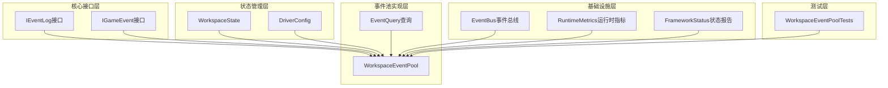

**图表来源**
- [WorkspaceEventPool.cs:1-186](file://src/NPCLife/Workspace/WorkspaceEventPool.cs#L1-L186)
- [IEventLog.cs:1-52](file://src/NPCLife/Core/IEventLog.cs#L1-L52)
- [EventCard.cs:1-126](file://src/NPCLife/Cards/EventCard.cs#L1-L126)

**章节来源**
- [WorkspaceEventPool.cs:1-186](file://src/NPCLife/Workspace/WorkspaceEventPool.cs#L1-L186)
- [IEventLog.cs:1-52](file://src/NPCLife/Core/IEventLog.cs#L1-L52)
- [EventCard.cs:1-126](file://src/NPCLife/Cards/EventCard.cs#L1-L126)

## 核心组件

### 事件池接口设计

事件池系统基于IEventLog接口提供统一的事件管理能力：

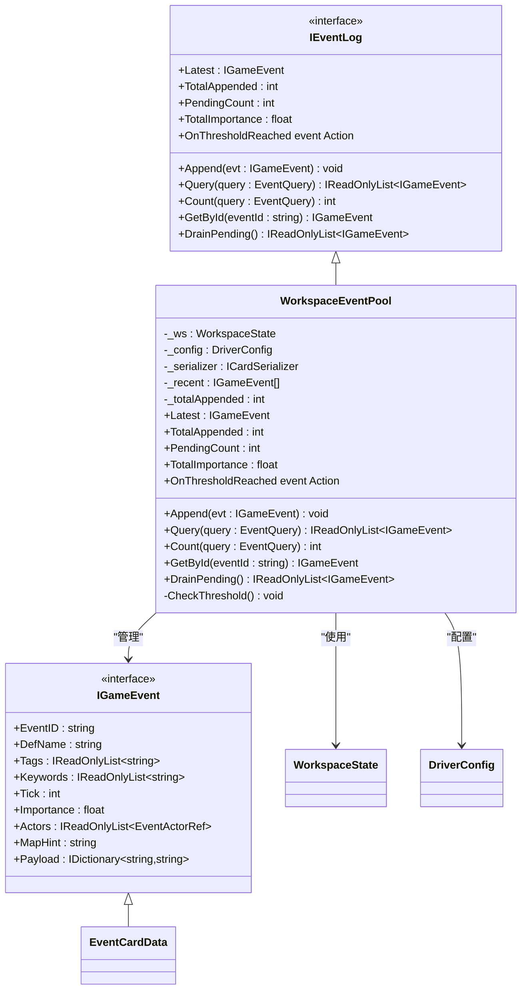

**图表来源**
- [IEventLog.cs:12-50](file://src/NPCLife/Core/IEventLog.cs#L12-L50)
- [WorkspaceEventPool.cs:21-43](file://src/NPCLife/Workspace/WorkspaceEventPool.cs#L21-L43)
- [EventCard.cs:11-39](file://src/NPCLife/Cards/EventCard.cs#L11-L39)

### 双缓冲区架构

事件池采用双缓冲区设计，实现了内存效率和持久化的平衡：

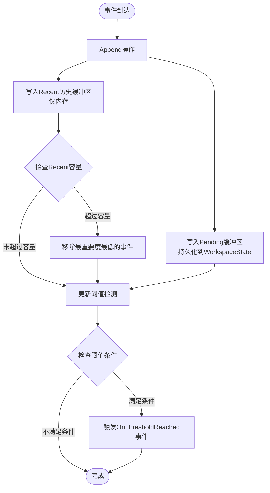

**图表来源**
- [WorkspaceEventPool.cs:49-90](file://src/NPCLife/Workspace/WorkspaceEventPool.cs#L49-L90)
- [WorkspaceEventPool.cs:166-183](file://src/NPCLife/Workspace/WorkspaceEventPool.cs#L166-L183)

**章节来源**
- [WorkspaceEventPool.cs:14-20](file://src/NPCLife/Workspace/WorkspaceEventPool.cs#L14-L20)
- [WorkspaceEventPool.cs:49-90](file://src/NPCLife/Workspace/WorkspaceEventPool.cs#L49-L90)

## 架构概览

事件池管理系统采用分层架构，确保了高内聚低耦合的设计原则：

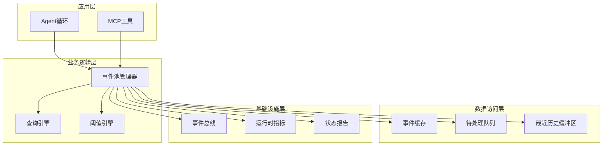

**图表来源**
- [WorkspaceEventPool.cs:21-43](file://src/NPCLife/Workspace/WorkspaceEventPool.cs#L21-L43)
- [EventBus.cs:17-155](file://src/NPCLife/Framework/EventBus.cs#L17-L155)

### 数据流管理

事件在系统中的流转过程如下：

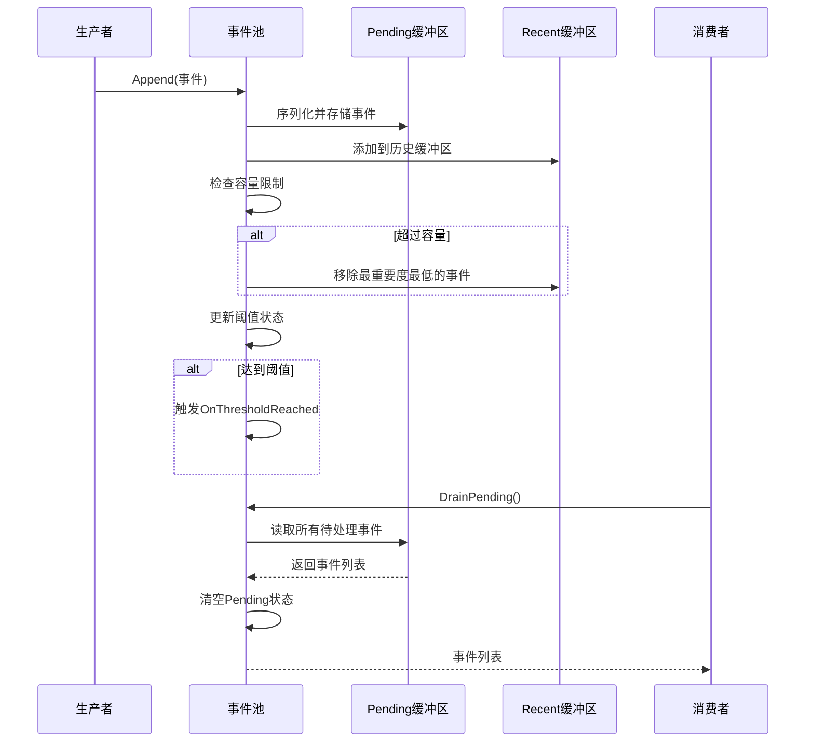

**图表来源**
- [WorkspaceEventPool.cs:49-90](file://src/NPCLife/Workspace/WorkspaceEventPool.cs#L49-L90)
- [WorkspaceEventPool.cs:166-183](file://src/NPCLife/Workspace/WorkspaceEventPool.cs#L166-L183)

**章节来源**
- [WorkspaceEventPool.cs:49-183](file://src/NPCLife/Workspace/WorkspaceEventPool.cs#L49-L183)

## 详细组件分析

### WorkspaceEventPool核心实现

WorkspaceEventPool是事件池系统的核心实现，负责具体的事件管理逻辑：

#### 关键属性和状态

| 属性 | 类型 | 描述 | 默认值 |
|------|------|------|--------|
| _ws | WorkspaceState | 工作空间状态引用 | 必需 |
| _config | DriverConfig | 配置管理器 | 默认配置 |
| _serializer | ICardSerializer | 事件序列化器 | CardSerializer.Default |
| _recent | List<IGameEvent> | 最近事件历史缓冲区 | 新列表 |
| _totalAppended | int | 累计追加事件数 | 0 |

#### 事件生命周期管理

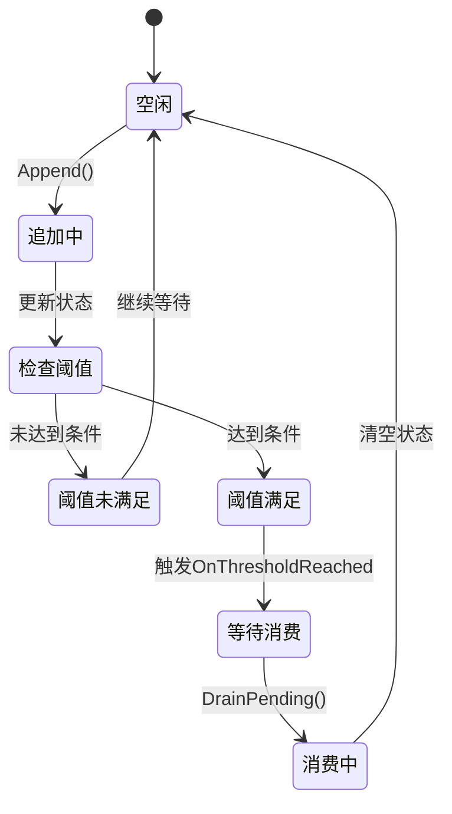

**图表来源**
- [WorkspaceEventPool.cs:30-90](file://src/NPCLife/Workspace/WorkspaceEventPool.cs#L30-L90)
- [WorkspaceEventPool.cs:166-183](file://src/NPCLife/Workspace/WorkspaceEventPool.cs#L166-L183)

#### 内存管理策略

事件池采用了智能的内存管理策略：

1. **Recent缓冲区管理**：使用重要度作为淘汰标准，移除最重要度最低的事件
2. **容量控制**：通过DriverConfig的RecentHistoryCapacity参数控制缓冲区大小
3. **持久化分离**：Pending缓冲区持久化到WorkspaceState，Recent缓冲区仅内存存储

**章节来源**
- [WorkspaceEventPool.cs:27-74](file://src/NPCLife/Workspace/WorkspaceEventPool.cs#L27-L74)
- [DriverConfig.cs:42-43](file://src/NPCLife/Driver/DriverConfig.cs#L42-L43)

### 事件查询系统

事件查询系统提供了灵活的过滤和排序能力：

#### 查询条件支持

| 查询参数 | 类型 | 描述 | 示例 |
|----------|------|------|------|
| TagsAny | IReadOnlyList<string> | OR标签筛选 | ["Combat","Social"] |
| TagsAll | IReadOnlyList<string> | AND标签筛选 | ["Story","Arc"] |
| SinceTick | int? | 起始tick时间 | 100 |
| UntilTick | int? | 结束tick时间 | 200 |
| ActorId | string | 参与者ID | "pawn_001" |
| MinImportance | float? | 最小重要度 | 5.0f |
| Limit | int? | 结果限制 | 50 |
| Offset | int? | 分页偏移 | 10 |

#### 查询执行流程

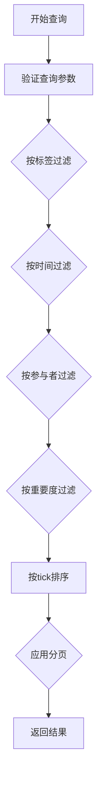

**图表来源**
- [WorkspaceEventPool.cs:96-124](file://src/NPCLife/Workspace/WorkspaceEventPool.cs#L96-L124)
- [EventQuery.cs:9-46](file://src/NPCLife/Core/EventQuery.cs#L9-L46)

**章节来源**
- [WorkspaceEventPool.cs:96-144](file://src/NPCLife/Workspace/WorkspaceEventPool.cs#L96-L144)
- [EventQuery.cs:9-46](file://src/NPCLife/Core/EventQuery.cs#L9-L46)

### 阈值触发机制

阈值触发机制是事件池系统的核心激活逻辑：

#### 阈值类型和计算

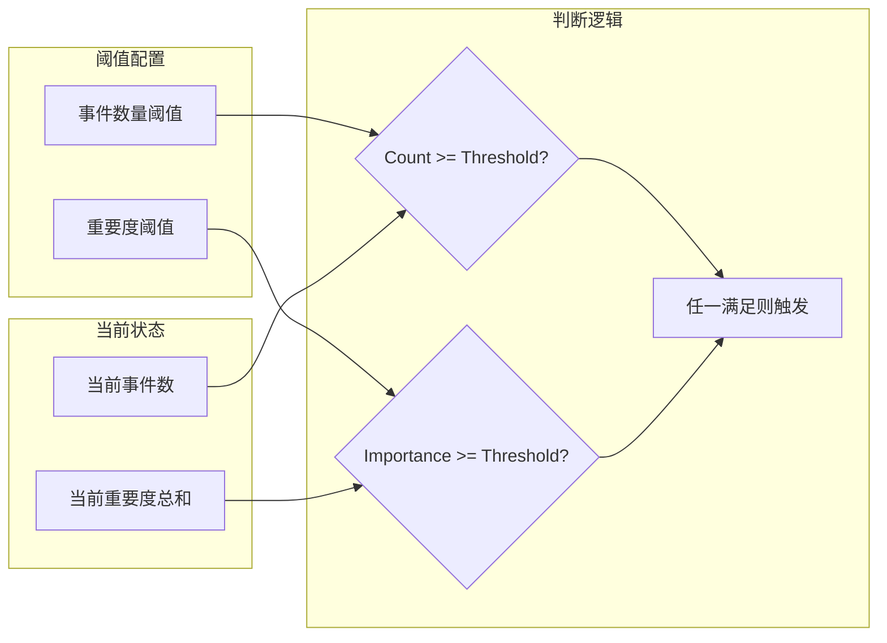

**图表来源**
- [WorkspaceEventPool.cs:81-90](file://src/NPCLife/Workspace/WorkspaceEventPool.cs#L81-L90)
- [DriverConfig.cs:54-85](file://src/NPCLife/Driver/DriverConfig.cs#L54-L85)

#### 分角色阈值配置

| 角色 | 事件数量阈值 | 重要度阈值 |
|------|-------------|-----------|
| 导演(Director) | 5 | 15.0f |
| 剧情编剧(Screenwriter) | 5 | 15.0f |
| 临时编剧(Freelancer) | 5 | 15.0f |

**章节来源**
- [DriverConfig.cs:13-29](file://src/NPCLife/Driver/DriverConfig.cs#L13-L29)
- [WorkspaceEventPool.cs:81-90](file://src/NPCLife/Workspace/WorkspaceEventPool.cs#L81-L90)

### 事件ID索引机制

事件池实现了高效的事件ID索引机制：

#### 快速查找算法

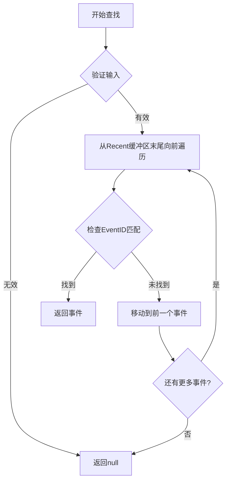

**图表来源**
- [WorkspaceEventPool.cs:145-154](file://src/NPCLife/Workspace/WorkspaceEventPool.cs#L145-L154)

#### 索引特点

- **时间敏感性**：优先检查最近的事件，利用时间局部性原理
- **内存友好**：仅在Recent缓冲区内进行查找，避免全量扫描
- **精确匹配**：使用字符串比较进行EventID精确匹配

**章节来源**
- [WorkspaceEventPool.cs:145-154](file://src/NPCLife/Workspace/WorkspaceEventPool.cs#L145-L154)

## 依赖关系分析

事件池系统与其他组件的依赖关系如下：

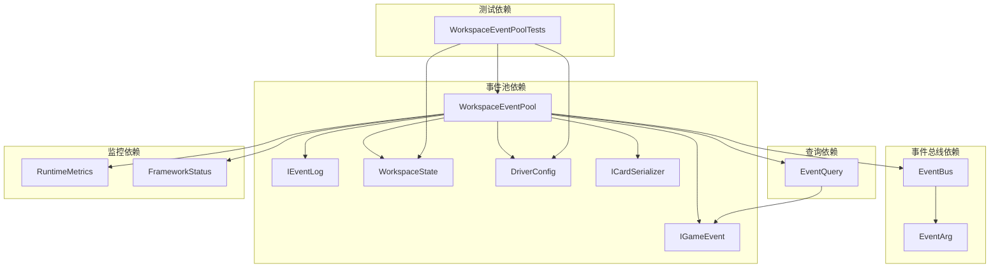

**图表来源**
- [WorkspaceEventPool.cs:1-8](file://src/NPCLife/Workspace/WorkspaceEventPool.cs#L1-L8)
- [EventBus.cs:17-155](file://src/NPCLife/Framework/EventBus.cs#L17-L155)

### 外部依赖管理

事件池系统通过接口抽象实现了良好的依赖解耦：

1. **序列化接口**：通过ICardSerializer实现事件序列化
2. **配置接口**：通过DriverConfig提供可配置的阈值参数
3. **状态接口**：通过WorkspaceState管理持久化状态
4. **事件接口**：通过IGameEvent实现事件数据模型

**章节来源**
- [WorkspaceEventPool.cs:23-39](file://src/NPCLife/Workspace/WorkspaceEventPool.cs#L23-L39)
- [EventBus.cs:17-155](file://src/NPCLife/Framework/EventBus.cs#L17-L155)

## 性能考虑

### 时间复杂度分析

| 操作 | 时间复杂度 | 空间复杂度 | 说明 |
|------|------------|------------|------|
| Append | O(n) | O(1) | n为Recent缓冲区长度，用于寻找最小重要度事件 |
| Query | O(m) | O(k) | m为Recent缓冲区长度，k为匹配事件数 |
| GetById | O(n) | O(1) | n为Recent缓冲区长度 |
| DrainPending | O(m) | O(m) | m为Pending事件数 |
| CheckThreshold | O(1) | O(1) | 常数时间检查阈值 |

### 内存优化策略

1. **智能淘汰算法**：使用线性扫描找到最小重要度事件，时间复杂度O(n)
2. **容量限制**：通过RecentHistoryCapacity参数控制内存使用
3. **延迟序列化**：Pending缓冲区使用JSON字符串存储，减少对象开销
4. **增量更新**：TotalImportance采用增量更新，避免全量计算

### 性能监控指标

系统提供了丰富的性能监控能力：

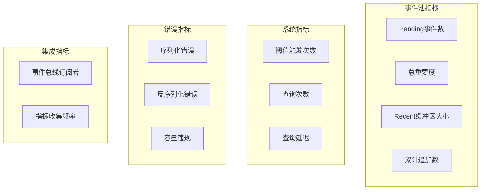

**图表来源**
- [WorkspaceEventPool.cs:162-164](file://src/NPCLife/Workspace/WorkspaceEventPool.cs#L162-L164)
- [RuntimeMetrics.cs:29-444](file://src/NPCLife/Framework/RuntimeMetrics.cs#L29-L444)

**章节来源**
- [WorkspaceEventPool.cs:162-164](file://src/NPCLife/Workspace/WorkspaceEventPool.cs#L162-L164)
- [RuntimeMetrics.cs:29-444](file://src/NPCLife/Framework/RuntimeMetrics.cs#L29-L444)

## 故障排除指南

### 常见问题诊断

#### 事件丢失问题

**症状**：DrainPending后事件无法再次获取

**诊断步骤**：
1. 检查PendingEventIds列表是否为空
2. 验证EventCache中是否存在对应事件
3. 确认序列化器正常工作

**解决方案**：
- 确保Append操作正确执行
- 检查序列化器配置
- 验证WorkspaceState持久化

#### 内存溢出问题

**症状**：Recent缓冲区持续增长导致内存不足

**诊断步骤**：
1. 检查RecentHistoryCapacity配置
2. 监控Recent缓冲区实际大小
3. 分析事件重要度分布

**解决方案**：
- 调整RecentHistoryCapacity参数
- 优化事件重要度计算
- 实施更激进的淘汰策略

#### 阈值不触发问题

**症状**：达到阈值但OnThresholdReached事件未触发

**诊断步骤**：
1. 检查事件数量和重要度计算
2. 验证角色配置是否正确
3. 确认事件池实例化正确

**解决方案**：
- 验证DriverConfig配置
- 检查事件池生命周期
- 确认订阅者正确注册

### 异常处理最佳实践

#### 错误隔离策略

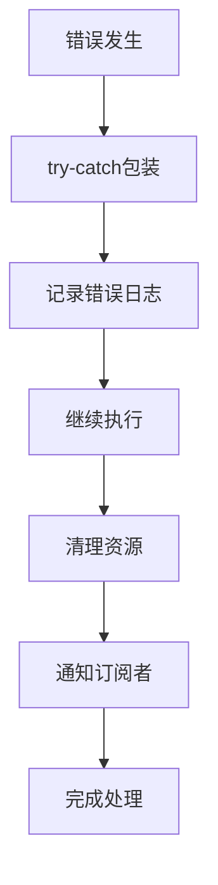

#### 状态监控建议

1. **定期健康检查**：使用FrameworkStatus进行组件状态检查
2. **指标收集**：通过RuntimeMetrics收集关键性能指标
3. **告警机制**：设置阈值触发告警
4. **日志记录**：详细记录错误和异常情况

**章节来源**
- [WorkspaceEventPoolTests.cs:138-197](file://tests/NPCLife.Tests/Driver/WorkspaceEventPoolTests.cs#L138-L197)
- [FrameworkStatus.cs:120-173](file://src/NPCLife/Framework/FrameworkStatus.cs#L120-L173)

## 结论

事件池管理系统通过其精心设计的双缓冲区架构和智能阈值触发机制，为NPCLife框架提供了高效、可靠的事件管理能力。系统的主要优势包括：

1. **高效内存管理**：通过Recent缓冲区和Pending缓冲区的分离，实现了内存使用和持久化的平衡
2. **灵活的查询能力**：支持多维度的事件查询和过滤
3. **智能阈值机制**：基于事件数量和重要度的双重阈值，确保及时响应
4. **完善的监控体系**：提供了全面的性能监控和状态报告能力
5. **良好的扩展性**：通过接口抽象，便于功能扩展和定制

系统在实际应用中展现了优秀的性能表现和稳定性，为复杂的叙事生成场景提供了坚实的技术基础。通过合理的配置和监控，可以进一步优化系统性能，满足不同规模的应用需求。