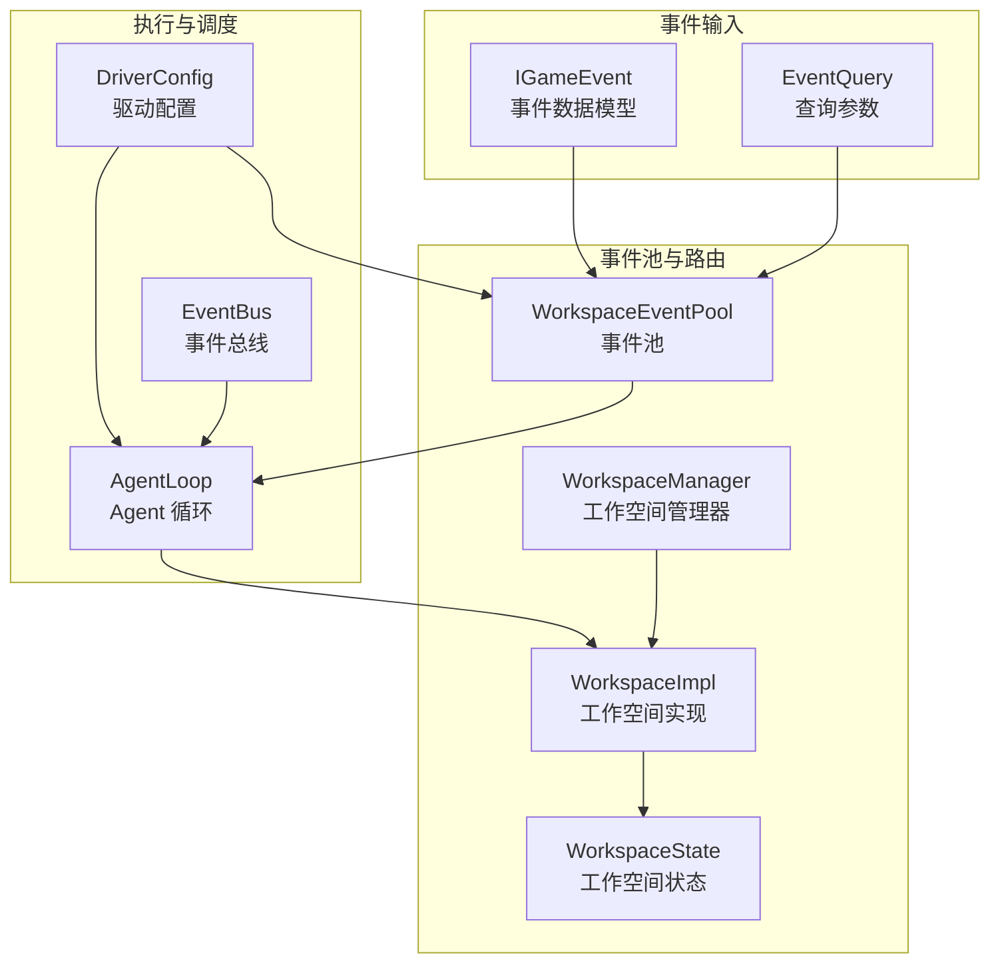
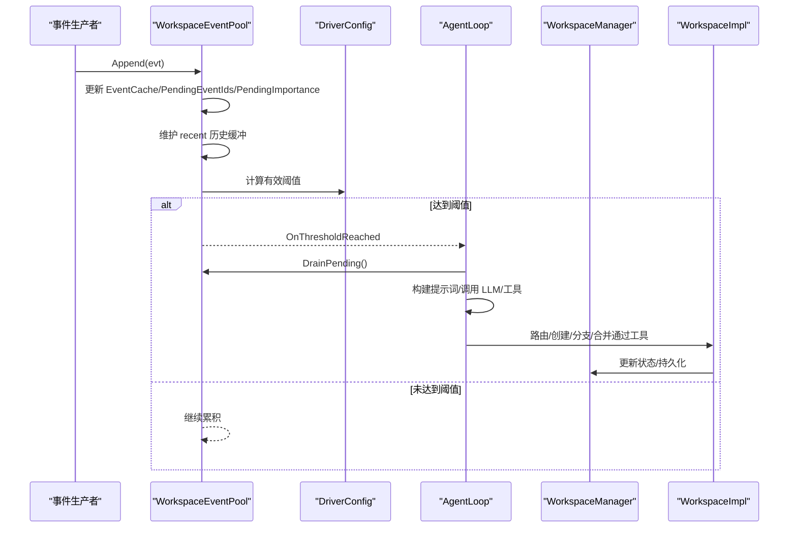
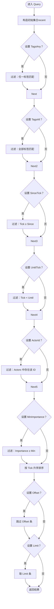
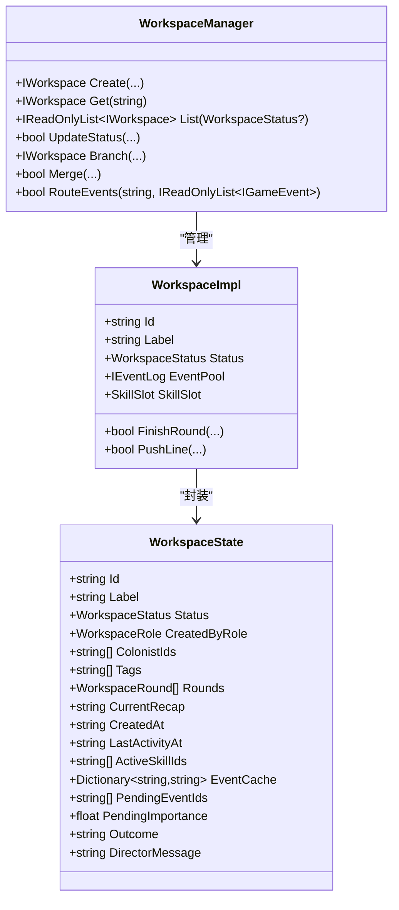
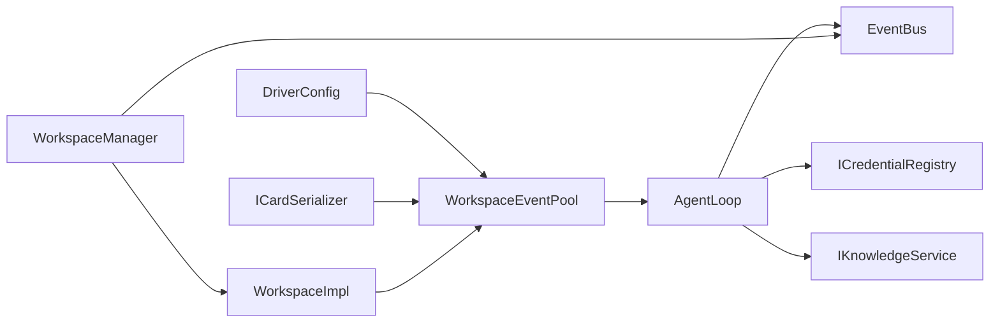

# 事件路由算法

<cite>
**本文引用的文件**
- [EventQuery.cs](file://src/NPCLife/Core/EventQuery.cs)
- [IEventLog.cs](file://src/NPCLife/Core/IEventLog.cs)
- [EventCard.cs](file://src/NPCLife/Cards/EventCard.cs)
- [WorkspaceEventPool.cs](file://src/NPCLife/Workspace/WorkspaceEventPool.cs)
- [WorkspaceManager.cs](file://src/NPCLife/Workspace/WorkspaceManager.cs)
- [WorkspaceImpl.cs](file://src/NPCLife/Workspace/WorkspaceImpl.cs)
- [AgentLoop.cs](file://src/NPCLife/Agent/AgentLoop.cs)
- [DriverConfig.cs](file://src/NPCLife/Driver/DriverConfig.cs)
- [EventBus.cs](file://src/NPCLife/Framework/EventBus.cs)
- [WorkspaceState.cs](file://src/NPCLife/Workspace/WorkspaceState.cs)
- [EventQueryTests.cs](file://tests/NPCLife.Tests/Core/EventQueryTests.cs)
- [WorkspaceEventPoolTests.cs](file://tests/NPCLife.Tests/Driver/WorkspaceEventPoolTests.cs)
</cite>

## 目录
1. [引言](#引言)
2. [项目结构](#项目结构)
3. [核心组件](#核心组件)
4. [架构总览](#架构总览)
5. [详细组件分析](#详细组件分析)
6. [依赖关系分析](#依赖关系分析)
7. [性能考量](#性能考量)
8. [故障排查指南](#故障排查指南)
9. [结论](#结论)
10. [附录](#附录)

## 引言
本文件系统化阐述 NPCLife 中“事件路由算法”的设计与实现，重点围绕以下目标展开：
- 导演如何基于事件特征进行智能路由决策
- 事件查询与筛选机制（EventQuery 的使用与过滤条件）
- 事件重要度评估与优先级排序策略
- 工作空间选择与负载均衡机制
- 路由策略的配置项与自定义方法
- 路由性能优化与错误处理实践

## 项目结构
事件路由贯穿“事件输入 → 事件池 → Agent 激活 → 工作空间路由 → 叙事产出”的完整链路。核心文件分布如下：
- 核心事件与查询：IGameEvent、EventQuery、IEventLog
- 事件池与路由：WorkspaceEventPool、WorkspaceManager.RouteEvents
- 工作空间与状态：WorkspaceImpl、WorkspaceState、WorkspaceManager
- 执行与调度：AgentLoop（阈值触发）、EventBus（事件总线）
- 配置与策略：DriverConfig（阈值、容量、轮次）

图表来源
- [WorkspaceEventPool.cs:21-186](file://src/NPCLife/Workspace/WorkspaceEventPool.cs#L21-L186)
- [WorkspaceManager.cs:382-392](file://src/NPCLife/Workspace/WorkspaceManager.cs#L382-L392)
- [AgentLoop.cs:43-581](file://src/NPCLife/Agent/AgentLoop.cs#L43-L581)
- [DriverConfig.cs:9-107](file://src/NPCLife/Driver/DriverConfig.cs#L9-L107)
- [EventBus.cs:17-243](file://src/NPCLife/Framework/EventBus.cs#L17-L243)
- [WorkspaceState.cs:94-150](file://src/NPCLife/Workspace/WorkspaceState.cs#L94-L150)

章节来源
- [WorkspaceEventPool.cs:21-186](file://src/NPCLife/Workspace/WorkspaceEventPool.cs#L21-L186)
- [WorkspaceManager.cs:382-392](file://src/NPCLife/Workspace/WorkspaceManager.cs#L382-L392)
- [AgentLoop.cs:43-581](file://src/NPCLife/Agent/AgentLoop.cs#L43-L581)
- [DriverConfig.cs:9-107](file://src/NPCLife/Driver/DriverConfig.cs#L9-L107)
- [EventBus.cs:17-243](file://src/NPCLife/Framework/EventBus.cs#L17-L243)
- [WorkspaceState.cs:94-150](file://src/NPCLife/Workspace/WorkspaceState.cs#L94-L150)

## 核心组件
- 事件模型 IGameEvent：统一承载事件标识、标签、关键词、时间戳、重要度、参与者、空间提示与扩展载荷。
- 查询参数 EventQuery：支持标签（任一/全部）、时间范围、参与者、最小重要度、分页与数量限制。
- 事件日志 IEventLog：提供 Append、Query、Count、Latest、GetById、DrainPending 与 OnThresholdReached 事件。
- 事件池 WorkspaceEventPool：双缓冲结构（pending 持久化 + recent 内存），阈值触发 Agent。
- 工作空间 WorkspaceManager：负责事件路由（RouteEvents）、工作空间 CRUD、分支/合并与持久化。
- 执行调度 AgentLoop：订阅 OnThresholdReached，被动激活，Drain 事件，构建提示词，调用 LLM 与 MCP 工具。
- 配置 DriverConfig：按角色设定事件数与重要度阈值、历史容量、最大轮次、定时器间隔。

章节来源
- [EventCard.cs:11-39](file://src/NPCLife/Cards/EventCard.cs#L11-L39)
- [EventQuery.cs:9-46](file://src/NPCLife/Core/EventQuery.cs#L9-L46)
- [IEventLog.cs:12-50](file://src/NPCLife/Core/IEventLog.cs#L12-L50)
- [WorkspaceEventPool.cs:21-186](file://src/NPCLife/Workspace/WorkspaceEventPool.cs#L21-L186)
- [WorkspaceManager.cs:382-392](file://src/NPCLife/Workspace/WorkspaceManager.cs#L382-L392)
- [AgentLoop.cs:43-581](file://src/NPCLife/Agent/AgentLoop.cs#L43-L581)
- [DriverConfig.cs:9-107](file://src/NPCLife/Driver/DriverConfig.cs#L9-L107)

## 架构总览
事件路由算法以“事件池阈值驱动 + 工作空间路由”为核心，形成如下闭环：
- 事件进入 WorkspaceEventPool.Append，同时写入 pending（持久化）与 recent（内存历史）。
- 当 PendingCount 或 TotalImportance 达到 DriverConfig 针对角色的阈值时，触发 OnThresholdReached。
- AgentLoop 订阅该事件，被动激活，DrainPending 取出事件，构建提示词并调用 LLM 与工具。
- 导演通过 WorkspaceManager.RouteEvents 将事件路由至目标工作空间；工作空间内部的事件池再次进行查询与筛选。
- 最终通过 WorkspaceImpl.FinishRound 输出叙事轮次，并通过 EventBus 发布相关事件。

图表来源
- [WorkspaceEventPool.cs:49-90](file://src/NPCLife/Workspace/WorkspaceEventPool.cs#L49-L90)
- [DriverConfig.cs:54-101](file://src/NPCLife/Driver/DriverConfig.cs#L54-L101)
- [AgentLoop.cs:171-337](file://src/NPCLife/Agent/AgentLoop.cs#L171-L337)
- [WorkspaceManager.cs:382-392](file://src/NPCLife/Workspace/WorkspaceManager.cs#L382-L392)
- [WorkspaceImpl.cs:125-182](file://src/NPCLife/Workspace/WorkspaceImpl.cs#L125-L182)

## 详细组件分析

### 事件查询与筛选机制（EventQuery）
- 支持的过滤条件
  - 标签任一匹配（TagsAny）与全部匹配（TagsAll）
  - 时间范围（SinceTick、UntilTick）
  - 参与者（ActorId）
  - 最小重要度（MinImportance）
  - 分页（Limit、Offset）
- 查询流程
  - WorkspaceEventPool.Query 对 recent 缓冲区进行 LINQ 过滤与排序（按 Tick 升序），再应用 Offset/Limit。
  - Count 通过复制查询参数（清空 Limit/Offset）后统计结果数量。
  - GetById 仅在 recent 中按事件 ID 倒序查找。
- 使用建议
  - 优先使用 TagsAny/All 限定事件域，减少后续处理量。
  - 时间范围与最小重要度可显著降低无效事件数量。
  - Limit/Offset 用于分页消费，避免一次性拉取过多。

图表来源
- [WorkspaceEventPool.cs:96-124](file://src/NPCLife/Workspace/WorkspaceEventPool.cs#L96-L124)

章节来源
- [EventQuery.cs:9-46](file://src/NPCLife/Core/EventQuery.cs#L9-L46)
- [WorkspaceEventPool.cs:96-141](file://src/NPCLife/Workspace/WorkspaceEventPool.cs#L96-L141)
- [EventQueryTests.cs:13-102](file://tests/NPCLife.Tests/Core/EventQueryTests.cs#L13-L102)

### 事件重要度评估与优先级排序策略
- 重要度来源
  - IGameEvent.Importance 由事件绑定点直接声明，事件池直接累加到 PendingImportance。
- 阈值策略
  - DriverConfig 按角色提供独立的事件数阈值与重要度阈值，WorkspaceEventPool 在每次 Append 后计算有效阈值并触发 OnThresholdReached。
- 排序策略
  - 查询阶段按 Tick 升序排序，保证时间顺序一致性。
  - 重要度作为阈值触发依据，不参与查询结果排序。
- 优化建议
  - 合理设置角色阈值，避免频繁触发或延迟过久。
  - 对高重要度事件可配合时间窗口与标签过滤，提升 Agent 消费效率。

章节来源
- [EventCard.cs:28-29](file://src/NPCLife/Cards/EventCard.cs#L28-L29)
- [WorkspaceEventPool.cs:57-90](file://src/NPCLife/Workspace/WorkspaceEventPool.cs#L57-L90)
- [DriverConfig.cs:54-101](file://src/NPCLife/Driver/DriverConfig.cs#L54-L101)
- [WorkspaceEventPool.cs:115](file://src/NPCLife/Workspace/WorkspaceEventPool.cs#L115)

### 工作空间选择与负载均衡机制
- 路由入口
  - WorkspaceManager.RouteEvents 将事件追加到指定工作空间的事件池，前提是工作空间处于 Active 状态。
- 工作空间状态与权限
  - WorkspaceState 定义 Active/Suspended/Completed/Abandoned 状态；WorkspaceRole 定义 Director/Screenwriter/Freelancer 的操作边界。
  - 分支/合并仅允许 Director 角色，FinishRound/PushLine 仅允许 Screenwriter/Freelancer。
- 负载均衡思路
  - 通过 DriverConfig 的角色阈值与历史容量控制事件池压力。
  - AgentLoop 的最大轮次限制防止长时间占用资源。
  - 事件池 recent 缓冲按最小重要度淘汰策略维持容量上限，避免内存膨胀。

图表来源
- [WorkspaceState.cs:94-150](file://src/NPCLife/Workspace/WorkspaceState.cs#L94-L150)
- [WorkspaceImpl.cs:16-75](file://src/NPCLife/Workspace/WorkspaceImpl.cs#L16-L75)
- [WorkspaceManager.cs:19-138](file://src/NPCLife/Workspace/WorkspaceManager.cs#L19-L138)

章节来源
- [WorkspaceManager.cs:382-392](file://src/NPCLife/Workspace/WorkspaceManager.cs#L382-L392)
- [WorkspaceImpl.cs:125-182](file://src/NPCLife/Workspace/WorkspaceImpl.cs#L125-L182)
- [WorkspaceState.cs:25-53](file://src/NPCLife/Workspace/WorkspaceState.cs#L25-L53)

### 导演的智能路由决策
- 路由入口与权限
  - 导演通过 WorkspaceManager.Branch/Merge/UpdateStatus 等操作对工作空间进行结构性管理。
  - RouteEvents 将事件路由至目标工作空间，供后续叙事消费。
- 决策依据
  - 事件特征：标签、参与者、时间、重要度、关键词等，用于筛选与优先级排序。
  - 工作空间上下文：角色、标签、关联人物、当前前情提要等，影响叙事方向。
- 工具集成
  - AgentLoop 在提示词中注入缺失知识词条与相关知识，结合 MCP 工具（如 create_workspace、branch_workspace）实现自动化路由与分支。

章节来源
- [WorkspaceManager.cs:193-263](file://src/NPCLife/Workspace/WorkspaceManager.cs#L193-L263)
- [WorkspaceManager.cs:269-376](file://src/NPCLife/Workspace/WorkspaceManager.cs#L269-L376)
- [AgentLoop.cs:455-539](file://src/NPCLife/Agent/AgentLoop.cs#L455-L539)

### 配置选项与自定义方法
- 角色阈值（DriverConfig）
  - DirectorCountThreshold/DirectorImportanceThreshold
  - ScreenwriterCountThreshold/ScreenwriterImportanceThreshold
  - FreelancerCountThreshold/FreelancerImportanceThreshold
- 通用配置
  - RecentHistoryCapacity：recent 缓冲容量
  - MaxAgentRounds：Agent 最大轮次
  - 定时器间隔：DirectorTimerInterval/FreelancerTimerInterval（0 表示禁用）
- 自定义方法
  - 通过 DriverConfig.CreateDefault 与按角色阈值方法扩展策略。
  - 通过 IEventLog.Query 的过滤组合实现业务定制化路由规则。

章节来源
- [DriverConfig.cs:13-101](file://src/NPCLife/Driver/DriverConfig.cs#L13-L101)
- [IEventLog.cs:19-23](file://src/NPCLife/Core/IEventLog.cs#L19-L23)

## 依赖关系分析
- 组件耦合
  - WorkspaceEventPool 依赖 DriverConfig 与 ICardSerializer，实现阈值计算与事件序列化。
  - AgentLoop 依赖 IEventLog.OnThresholdReached、ICredentialRegistry、IKnowledgeService 等，形成事件驱动的执行闭环。
  - WorkspaceManager 依赖 IAuthorityStore、ILogger、EventBus，负责工作空间生命周期与事件路由。
- 外部依赖
  - EventBus 提供事件总线能力，支持命名空间事件名与优先级排序。
  - ICardSerializer 用于事件与缓存的序列化/反序列化。

图表来源
- [DriverConfig.cs:54-101](file://src/NPCLife/Driver/DriverConfig.cs#L54-L101)
- [WorkspaceEventPool.cs:32-43](file://src/NPCLife/Workspace/WorkspaceEventPool.cs#L32-L43)
- [AgentLoop.cs:46-116](file://src/NPCLife/Agent/AgentLoop.cs#L46-L116)
- [WorkspaceManager.cs:31-40](file://src/NPCLife/Workspace/WorkspaceManager.cs#L31-L40)
- [EventBus.cs:17-243](file://src/NPCLife/Framework/EventBus.cs#L17-L243)

章节来源
- [WorkspaceEventPool.cs:32-43](file://src/NPCLife/Workspace/WorkspaceEventPool.cs#L32-L43)
- [AgentLoop.cs:46-116](file://src/NPCLife/Agent/AgentLoop.cs#L46-L116)
- [WorkspaceManager.cs:31-40](file://src/NPCLife/Workspace/WorkspaceManager.cs#L31-L40)
- [EventBus.cs:17-243](file://src/NPCLife/Framework/EventBus.cs#L17-L243)

## 性能考量
- 事件池容量与淘汰
  - recent 历史容量受 DriverConfig.RecentHistoryCapacity 控制；Append 时按最小重要度淘汰策略维持上限，避免内存膨胀。
- 阈值触发频率
  - 合理设置角色阈值，避免频繁触发导致 Agent 循环抖动；必要时提高阈值或增加事件重要度权重。
- 查询复杂度
  - Query 为 O(n) 过滤 + O(n log n) 排序，建议通过标签与时间范围缩小候选集。
- 工具调用轮次
  - MaxAgentRounds 限制防止死循环；建议在工具设计上减少不必要的往返。
- 序列化成本
  - 事件与缓存序列化/反序列化为热点，建议使用稳定的序列化器并避免重复解析。

章节来源
- [DriverConfig.cs:42-46](file://src/NPCLife/Driver/DriverConfig.cs#L42-L46)
- [WorkspaceEventPool.cs:61-74](file://src/NPCLife/Workspace/WorkspaceEventPool.cs#L61-L74)
- [AgentLoop.cs:258-264](file://src/NPCLife/Agent/AgentLoop.cs#L258-L264)

## 故障排查指南
- 事件未被 Agent 消费
  - 检查 OnThresholdReached 是否被触发（参考测试用例验证阈值逻辑）。
  - 确认 AgentLoop.State 是否处于 Idle，且 Gate 未被占用。
- 事件池状态异常
  - DrainPending 后 PendingCount/TotalImportance 是否归零。
  - recent 缓冲是否溢出或未按最小重要度淘汰。
- 工作空间路由失败
  - WorkspaceManager.RouteEvents 返回 false 的可能原因：目标工作空间不存在、状态非 Active、事件列表为空。
  - 分支/合并权限不足：仅 Director 可执行分支/合并。
- 错误处理与回滚
  - AgentLoop 在异常时会 FailAndRequeue，将已 Drain 的事件重新 Append 回池，避免数据丢失。
  - EventBus 提供统一事件发布，便于定位问题与审计。

章节来源
- [WorkspaceEventPoolTests.cs:138-197](file://tests/NPCLife.Tests/Driver/WorkspaceEventPoolTests.cs#L138-L197)
- [WorkspaceEventPoolTests.cs:203-274](file://tests/NPCLife.Tests/Driver/WorkspaceEventPoolTests.cs#L203-L274)
- [WorkspaceManager.cs:382-392](file://src/NPCLife/Workspace/WorkspaceManager.cs#L382-L392)
- [AgentLoop.cs:370-396](file://src/NPCLife/Agent/AgentLoop.cs#L370-L396)
- [EventBus.cs:86-113](file://src/NPCLife/Framework/EventBus.cs#L86-L113)

## 结论
本事件路由算法以“事件池阈值驱动 + 工作空间路由”为核心，结合角色化阈值、标签与时间过滤、重要度阈值与轮次限制，实现了高效、可控的事件消费与叙事生成。通过清晰的组件边界与事件总线，系统具备良好的扩展性与可观测性。实践中建议：
- 合理配置角色阈值与历史容量，平衡吞吐与延迟
- 使用标签与时间范围缩小查询范围
- 通过工具与知识服务增强路由智能化
- 建立完善的监控与回滚机制，保障稳定性

## 附录
- 测试参考
  - EventQuery 参数组合与默认值断言
  - 事件池阈值触发与 Drain 行为断言
- 相关文件路径
  - 事件模型与查询：[EventCard.cs:11-39](file://src/NPCLife/Cards/EventCard.cs#L11-L39)、[EventQuery.cs:9-46](file://src/NPCLife/Core/EventQuery.cs#L9-L46)
  - 事件池与路由：[WorkspaceEventPool.cs:21-186](file://src/NPCLife/Workspace/WorkspaceEventPool.cs#L21-L186)、[WorkspaceManager.cs:382-392](file://src/NPCLife/Workspace/WorkspaceManager.cs#L382-L392)
  - 执行与调度：[AgentLoop.cs:43-581](file://src/NPCLife/Agent/AgentLoop.cs#L43-581)、[EventBus.cs:17-243](file://src/NPCLife/Framework/EventBus.cs#L17-243)
  - 配置与状态：[DriverConfig.cs:9-107](file://src/NPCLife/Driver/DriverConfig.cs#L9-107)、[WorkspaceState.cs:94-150](file://src/NPCLife/Workspace/WorkspaceState.cs#L94-150)
  - 测试用例：[EventQueryTests.cs:13-102](file://tests/NPCLife.Tests/Core/EventQueryTests.cs#L13-102)、[WorkspaceEventPoolTests.cs:13-352](file://tests/NPCLife.Tests/Driver/WorkspaceEventPoolTests.cs#L13-352)