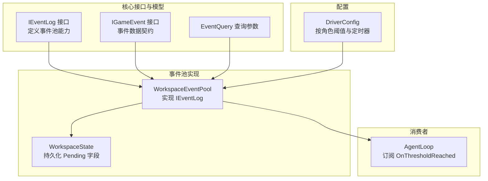
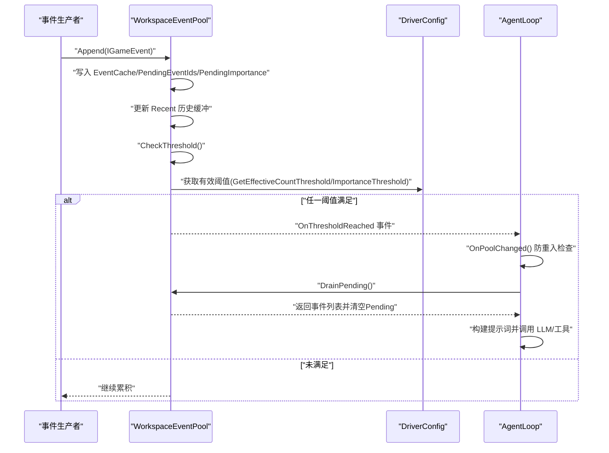
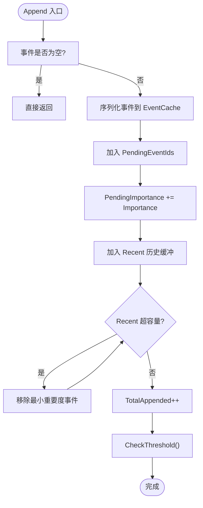
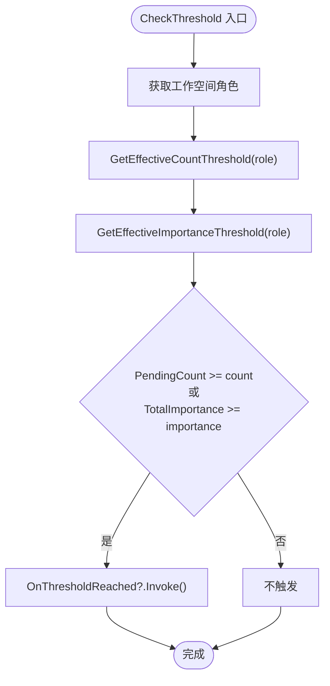
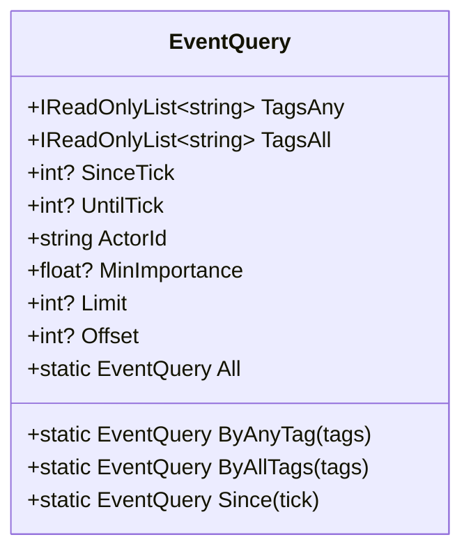
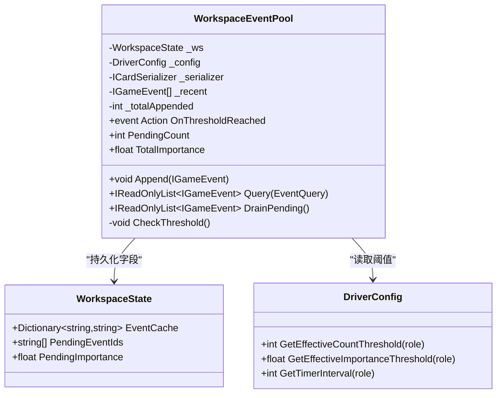
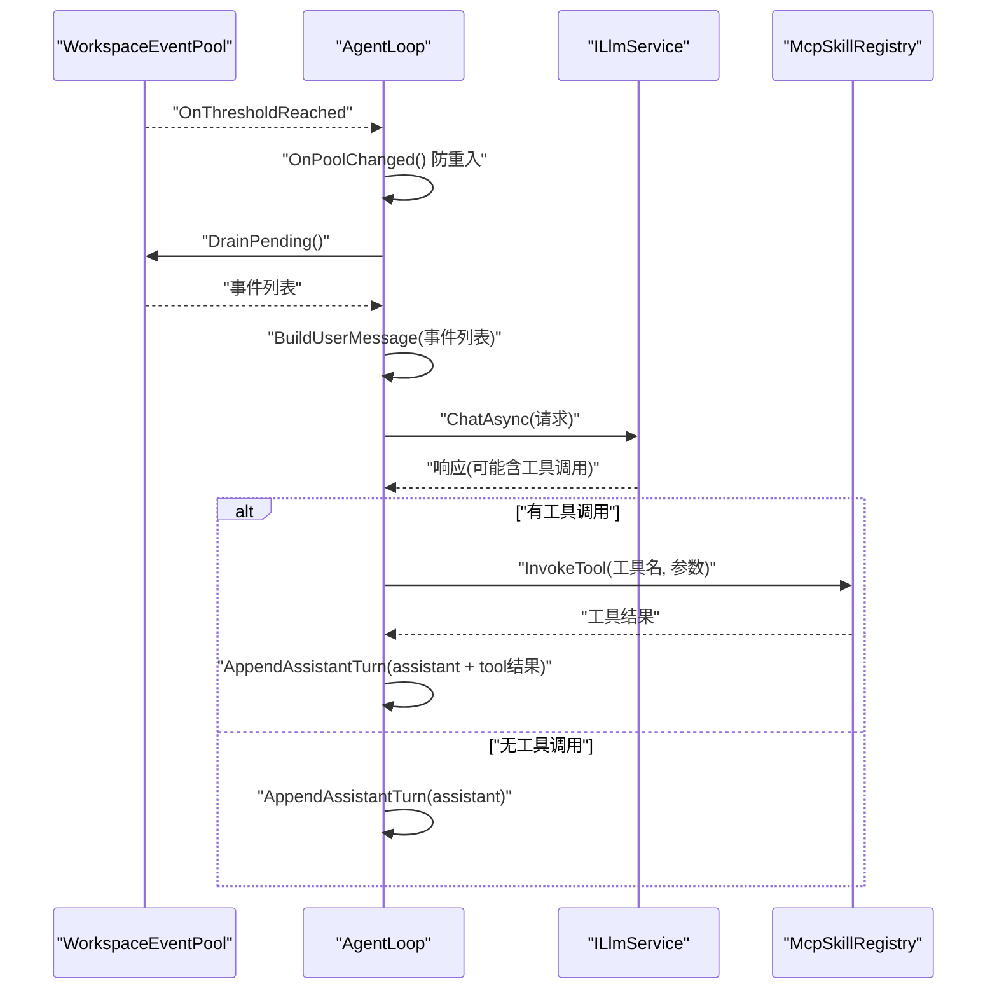
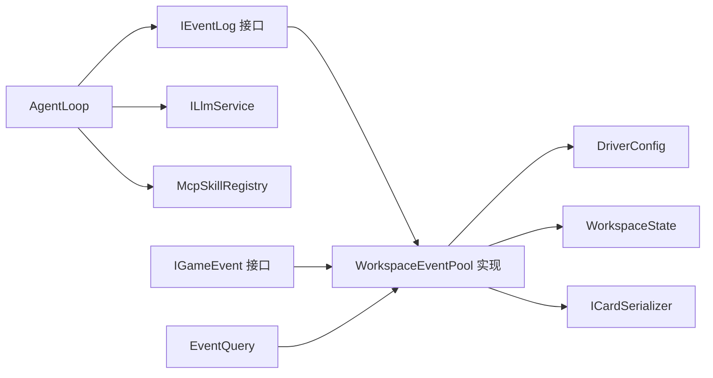

# 事件阈值触发机制

<cite>
**本文引用的文件**
- [IEventLog.cs](file://src/NPCLife/Core/IEventLog.cs)
- [WorkspaceEventPool.cs](file://src/NPCLife/Workspace/WorkspaceEventPool.cs)
- [AgentLoop.cs](file://src/NPCLife/Agent/AgentLoop.cs)
- [DriverConfig.cs](file://src/NPCLife/Driver/DriverConfig.cs)
- [EventCard.cs](file://src/NPCLife/Cards/EventCard.cs)
- [WorkspaceState.cs](file://src/NPCLife/Workspace/WorkspaceState.cs)
- [EventQuery.cs](file://src/NPCLife/Core/EventQuery.cs)
- [WorkspaceEventPoolTests.cs](file://tests/NPCLife.Tests/Driver/WorkspaceEventPoolTests.cs)
</cite>

## 目录
1. [简介](#简介)
2. [项目结构](#项目结构)
3. [核心组件](#核心组件)
4. [架构概览](#架构概览)
5. [详细组件分析](#详细组件分析)
6. [依赖关系分析](#依赖关系分析)
7. [性能考量](#性能考量)
8. [故障排除指南](#故障排除指南)
9. [结论](#结论)
10. [附录](#附录)

## 简介
本文件系统性阐述事件阈值触发机制的设计与实现，涵盖事件重要度计算、累计重要度阈值判断、时间窗口控制、Pending缓冲区工作机制、OnThresholdReached事件触发条件与回调机制，并提供阈值参数配置的最佳实践、响应延迟调整策略与性能优化建议，辅以实际配置示例与故障排除指南。

## 项目结构
事件阈值触发机制主要分布在以下模块：
- 核心接口与数据模型：IEventLog、IGameEvent、EventQuery
- 事件池实现：WorkspaceEventPool（实现IEventLog）
- 触发消费者：AgentLoop（订阅OnThresholdReached）
- 配置中心：DriverConfig（按角色配置阈值与定时器）
- 工作空间状态：WorkspaceState（承载Pending事件的持久化字段）

**图表来源**
- [IEventLog.cs:12-50](file://src/NPCLife/Core/IEventLog.cs#L12-L50)
- [WorkspaceEventPool.cs:21-44](file://src/NPCLife/Workspace/WorkspaceEventPool.cs#L21-L44)
- [WorkspaceState.cs:135-142](file://src/NPCLife/Workspace/WorkspaceState.cs#L135-L142)
- [AgentLoop.cs:113-115](file://src/NPCLife/Agent/AgentLoop.cs#L113-L115)
- [DriverConfig.cs:9-106](file://src/NPCLife/Driver/DriverConfig.cs#L9-L106)

**章节来源**
- [IEventLog.cs:7-50](file://src/NPCLife/Core/IEventLog.cs#L7-L50)
- [WorkspaceEventPool.cs:11-21](file://src/NPCLife/Workspace/WorkspaceEventPool.cs#L11-L21)
- [AgentLoop.cs:31-39](file://src/NPCLife/Agent/AgentLoop.cs#L31-L39)
- [DriverConfig.cs:3-8](file://src/NPCLife/Driver/DriverConfig.cs#L3-L8)
- [WorkspaceState.cs:94-150](file://src/NPCLife/Workspace/WorkspaceState.cs#L94-L150)

## 核心组件
- IEventLog：定义事件池的核心能力，包括追加事件、查询事件、累计统计、DrainPending与OnThresholdReached事件。
- WorkspaceEventPool：IEventLog的具体实现，负责事件写入、阈值检测、Recent历史缓冲与Drain操作。
- AgentLoop：订阅OnThresholdReached被动激活，执行事件Drain、提示词构建、LLM对话与工具调用循环。
- DriverConfig：按角色（导演、临时编剧、剧情编剧）配置事件数量阈值、重要度阈值与定时器脉冲间隔。
- IGameEvent：事件数据契约，包含EventID、DefName、Tags、Keywords、Tick、Importance、Actors、MapHint、Payload等。
- WorkspaceState：工作空间状态，持久化EventCache、PendingEventIds、PendingImportance等字段。
- EventQuery：事件查询参数对象，支持多维筛选与分页。

**章节来源**
- [IEventLog.cs:12-50](file://src/NPCLife/Core/IEventLog.cs#L12-L50)
- [WorkspaceEventPool.cs:21-184](file://src/NPCLife/Workspace/WorkspaceEventPool.cs#L21-L184)
- [AgentLoop.cs:43-116](file://src/NPCLife/Agent/AgentLoop.cs#L43-L116)
- [DriverConfig.cs:9-106](file://src/NPCLife/Driver/DriverConfig.cs#L9-L106)
- [EventCard.cs:11-39](file://src/NPCLife/Cards/EventCard.cs#L11-L39)
- [WorkspaceState.cs:94-150](file://src/NPCLife/Workspace/WorkspaceState.cs#L94-L150)
- [EventQuery.cs:9-46](file://src/NPCLife/Core/EventQuery.cs#L9-L46)

## 架构概览
事件阈值触发机制遵循“生产者-观察者”模式：事件生产者将事件写入WorkspaceEventPool的Pending缓冲区；每次Append后进行阈值检测，满足任一阈值（事件数量或累计重要度）即触发OnThresholdReached；AgentLoop作为观察者订阅该事件并被动激活，执行DrainPending取出事件并进入对话与工具调用流程。

**图表来源**
- [WorkspaceEventPool.cs:49-89](file://src/NPCLife/Workspace/WorkspaceEventPool.cs#L49-L89)
- [DriverConfig.cs:54-85](file://src/NPCLife/Driver/DriverConfig.cs#L54-L85)
- [AgentLoop.cs:122-139](file://src/NPCLife/Agent/AgentLoop.cs#L122-L139)
- [AgentLoop.cs:188-195](file://src/NPCLife/Agent/AgentLoop.cs#L188-L195)

## 详细组件分析

### 事件重要度计算与累计
- 重要度来源：IGameEvent.Importance由事件绑定点直接声明，事件池直接累加。
- 累计统计：PendingImportance在Append时累加，在DrainPending后清零，避免重复计算。
- 最近历史缓冲：Recent缓冲仅内存保存，按RecentHistoryCapacity裁剪，保留最小重要度事件以释放空间。

**图表来源**
- [WorkspaceEventPool.cs:49-79](file://src/NPCLife/Workspace/WorkspaceEventPool.cs#L49-L79)
- [WorkspaceEventPool.cs:61-74](file://src/NPCLife/Workspace/WorkspaceEventPool.cs#L61-L74)
- [WorkspaceEventPool.cs:54-57](file://src/NPCLife/Workspace/WorkspaceEventPool.cs#L54-L57)

**章节来源**
- [EventCard.cs:28-29](file://src/NPCLife/Cards/EventCard.cs#L28-L29)
- [WorkspaceEventPool.cs:54-79](file://src/NPCLife/Workspace/WorkspaceEventPool.cs#L54-L79)
- [WorkspaceState.cs:141-142](file://src/NPCLife/Workspace/WorkspaceState.cs#L141-L142)

### 累计重要度阈值判断
- 阈值来源：DriverConfig按角色提供有效阈值，WorkspaceEventPool在CheckThreshold中读取。
- 判断条件：任一阈值满足即触发OnThresholdReached（数量阈值或重要度阈值）。
- 多轮触发：DrainPending后阈值计数与重要度清零，可再次触发。

**图表来源**
- [WorkspaceEventPool.cs:81-90](file://src/NPCLife/Workspace/WorkspaceEventPool.cs#L81-L90)
- [DriverConfig.cs:54-85](file://src/NPCLife/Driver/DriverConfig.cs#L54-L85)

**章节来源**
- [WorkspaceEventPool.cs:81-90](file://src/NPCLife/Workspace/WorkspaceEventPool.cs#L81-L90)
- [DriverConfig.cs:54-85](file://src/NPCLife/Driver/DriverConfig.cs#L54-L85)

### 时间窗口控制
- 近期历史查询：EventQuery支持SinceTick、UntilTick、ActorId、MinImportance等筛选，配合Recent缓冲实现时间窗口内的事件查询。
- 定时器脉冲：DriverConfig提供按角色的定时器脉冲间隔（ticks），0表示禁用。当前实现中，脉冲事件注入到对应工作空间事件池，用于周期性激活。

**图表来源**
- [EventQuery.cs:9-46](file://src/NPCLife/Core/EventQuery.cs#L9-L46)

**章节来源**
- [EventQuery.cs:9-46](file://src/NPCLife/Core/EventQuery.cs#L9-L46)
- [DriverConfig.cs:33-101](file://src/NPCLife/Driver/DriverConfig.cs#L33-L101)

### Pending缓冲区工作机制
- 双层结构：
  - Pending缓冲区：持久化至WorkspaceState（EventCache、PendingEventIds、PendingImportance），DrainPending后清空。
  - Recent历史缓冲：仅内存保存，按RecentHistoryCapacity裁剪，保留最小重要度事件。
- 事件收集：Append将事件序列化写入EventCache，ID加入PendingEventIds，重要度累加到PendingImportance。
- 重要度累加：每次Append对PendingImportance累加，DrainPending后清零。
- 阈值比较：Append后立即CheckThreshold，满足任一阈值触发OnThresholdReached。

**图表来源**
- [WorkspaceEventPool.cs:21-44](file://src/NPCLife/Workspace/WorkspaceEventPool.cs#L21-L44)
- [WorkspaceEventPool.cs:162-183](file://src/NPCLife/Workspace/WorkspaceEventPool.cs#L162-L183)
- [WorkspaceState.cs:135-142](file://src/NPCLife/Workspace/WorkspaceState.cs#L135-L142)
- [DriverConfig.cs:54-101](file://src/NPCLife/Driver/DriverConfig.cs#L54-L101)

**章节来源**
- [WorkspaceEventPool.cs:14-19](file://src/NPCLife/Workspace/WorkspaceEventPool.cs#L14-L19)
- [WorkspaceEventPool.cs:49-79](file://src/NPCLife/Workspace/WorkspaceEventPool.cs#L49-L79)
- [WorkspaceEventPool.cs:162-183](file://src/NPCLife/Workspace/WorkspaceEventPool.cs#L162-L183)
- [WorkspaceState.cs:135-142](file://src/NPCLife/Workspace/WorkspaceState.cs#L135-L142)

### OnThresholdReached事件的触发条件与回调机制
- 触发条件：任一阈值满足（数量阈值或重要度阈值）。
- 回调机制：AgentLoop在构造时订阅IEventLog.OnThresholdReached，OnPoolChanged中进行防重入检查，随后调用RunOnceAsync执行完整流程。
- 激活路径：池子触发→AgentLoop被动激活→DrainPending→提示词构建→LLM对话→工具调用→结束或继续下一轮。

**图表来源**
- [AgentLoop.cs:122-139](file://src/NPCLife/Agent/AgentLoop.cs#L122-L139)
- [AgentLoop.cs:188-318](file://src/NPCLife/Agent/AgentLoop.cs#L188-L318)
- [WorkspaceEventPool.cs:166-183](file://src/NPCLife/Workspace/WorkspaceEventPool.cs#L166-L183)

**章节来源**
- [AgentLoop.cs:122-139](file://src/NPCLife/Agent/AgentLoop.cs#L122-L139)
- [AgentLoop.cs:188-318](file://src/NPCLife/Agent/AgentLoop.cs#L188-L318)
- [WorkspaceEventPool.cs:166-183](file://src/NPCLife/Workspace/WorkspaceEventPool.cs#L166-L183)

## 依赖关系分析
- WorkspaceEventPool依赖DriverConfig进行阈值决策，依赖WorkspaceState进行持久化字段访问，依赖ICardSerializer进行事件序列化。
- AgentLoop依赖IEventLog进行事件Drain与阈值通知，依赖ILlmService进行对话，依赖McpSkillRegistry进行工具调用。
- IEventLog作为抽象接口，约束事件池能力；IGameEvent作为数据契约，约束事件字段。

**图表来源**
- [IEventLog.cs:12-50](file://src/NPCLife/Core/IEventLog.cs#L12-L50)
- [WorkspaceEventPool.cs:21-44](file://src/NPCLife/Workspace/WorkspaceEventPool.cs#L21-L44)
- [AgentLoop.cs:43-116](file://src/NPCLife/Agent/AgentLoop.cs#L43-L116)
- [EventCard.cs:11-39](file://src/NPCLife/Cards/EventCard.cs#L11-L39)
- [EventQuery.cs:9-46](file://src/NPCLife/Core/EventQuery.cs#L9-L46)

**章节来源**
- [IEventLog.cs:12-50](file://src/NPCLife/Core/IEventLog.cs#L12-L50)
- [WorkspaceEventPool.cs:21-44](file://src/NPCLife/Workspace/WorkspaceEventPool.cs#L21-L44)
- [AgentLoop.cs:43-116](file://src/NPCLife/Agent/AgentLoop.cs#L43-L116)

## 性能考量
- 近期历史裁剪：Recent缓冲按最小重要度事件裁剪，避免无限增长导致查询与内存压力。
- 阈值检测时机：每次Append后立即CheckThreshold，减少不必要的轮询。
- Draining成本：DrainPending一次性取出并清空Pending，降低后续查询成本。
- 并发控制：AgentLoop使用SemaphoreSlim防重入，避免并发激活导致的资源竞争。
- 工具调用轮数上限：MaxAgentRounds防止死循环，保障系统稳定性。
- 序列化与反序列化：EventCache持久化JSON，减少重复计算；DrainPending时按ID顺序反序列化，保证事件顺序一致性。

**章节来源**
- [WorkspaceEventPool.cs:61-74](file://src/NPCLife/Workspace/WorkspaceEventPool.cs#L61-L74)
- [WorkspaceEventPool.cs:81-90](file://src/NPCLife/Workspace/WorkspaceEventPool.cs#L81-L90)
- [WorkspaceEventPool.cs:166-183](file://src/NPCLife/Workspace/WorkspaceEventPool.cs#L166-L183)
- [AgentLoop.cs:61-62](file://src/NPCLife/Agent/AgentLoop.cs#L61-L62)
- [DriverConfig.cs:46](file://src/NPCLife/Driver/DriverConfig.cs#L46)

## 故障排除指南
- 无订阅者不触发：无订阅者时Append不会抛异常，也不会触发OnThresholdReached，属预期行为。
- 多工作空间隔离：不同工作空间的事件池相互独立，阈值触发互不影响。
- Drain后重置：DrainPending会清空Pending计数与重要度，需等待新一轮阈值满足。
- 事件为空：Append null事件不会影响池状态。
- 查询结果为空：Latest与GetById基于Recent缓冲，超出RecentHistoryCapacity的事件可能无法查询到。

**章节来源**
- [WorkspaceEventPoolTests.cs:138-147](file://tests/NPCLife.Tests/Driver/WorkspaceEventPoolTests.cs#L138-L147)
- [WorkspaceEventPoolTests.cs:280-292](file://tests/NPCLife.Tests/Driver/WorkspaceEventPoolTests.cs#L280-L292)
- [WorkspaceEventPoolTests.cs:317-332](file://tests/NPCLife.Tests/Driver/WorkspaceEventPoolTests.cs#L317-L332)
- [WorkspaceEventPool.cs:51-51](file://src/NPCLife/Workspace/WorkspaceEventPool.cs#L51-L51)
- [WorkspaceEventPool.cs:145-154](file://src/NPCLife/Workspace/WorkspaceEventPool.cs#L145-L154)

## 结论
事件阈值触发机制通过双层缓冲（Pending持久化+Recent内存）与按角色阈值配置，实现了高效、可扩展的事件驱动激活。AgentLoop作为被动消费者，结合Drain、提示词构建与工具调用，形成完整的事件处理闭环。合理配置阈值与定时器、控制Recent容量与工具调用轮数，是保障系统性能与稳定性的关键。

## 附录

### 阈值参数配置最佳实践
- 按角色差异化配置：根据职责设定不同阈值，导演侧重综合重要度，临时编剧侧重快速响应，剧情编剧侧重叙事连贯性。
- 阈值设置策略：
  - 数量阈值：平衡吞吐与延迟，过低导致频繁激活，过高导致响应滞后。
  - 重要度阈值：反映事件影响力，避免噪声事件干扰。
- 响应延迟调整：
  - 适当增大RecentHistoryCapacity提升查询覆盖，但需关注内存与裁剪成本。
  - 合理设置MaxAgentRounds，避免长轮次导致延迟累积。
- 性能优化建议：
  - 使用DrainPending一次性处理，减少多次查询。
  - 控制事件Importance粒度，避免极端值导致阈值波动。
  - 启用定时器脉冲（ticks>0）以周期性激活，缓解突发事件堆积。

**章节来源**
- [DriverConfig.cs:13-29](file://src/NPCLife/Driver/DriverConfig.cs#L13-L29)
- [DriverConfig.cs:42-46](file://src/NPCLife/Driver/DriverConfig.cs#L42-L46)
- [DriverConfig.cs:87-101](file://src/NPCLife/Driver/DriverConfig.cs#L87-L101)
- [AgentLoop.cs:56-57](file://src/NPCLife/Agent/AgentLoop.cs#L56-L57)

### 实际配置示例
- 导演工作空间：数量阈值=5，重要度阈值=15，定时器间隔=0（禁用）。
- 临时编剧工作空间：数量阈值=5，重要度阈值=15，定时器间隔=0（禁用）。
- 剧情编剧工作空间：数量阈值=5，重要度阈值=15，定时器间隔=0（禁用）。
- 通用配置：RecentHistoryCapacity=200，MaxAgentRounds=10。

**章节来源**
- [DriverConfig.cs:13-29](file://src/NPCLife/Driver/DriverConfig.cs#L13-L29)
- [DriverConfig.cs:42-46](file://src/NPCLife/Driver/DriverConfig.cs#L42-L46)
- [DriverConfig.cs:103-105](file://src/NPCLife/Driver/DriverConfig.cs#L103-L105)