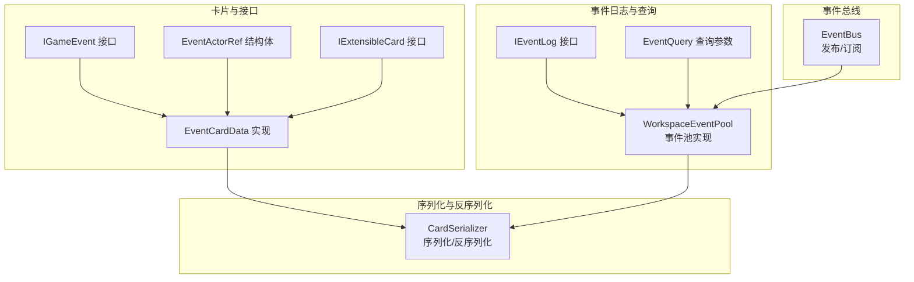
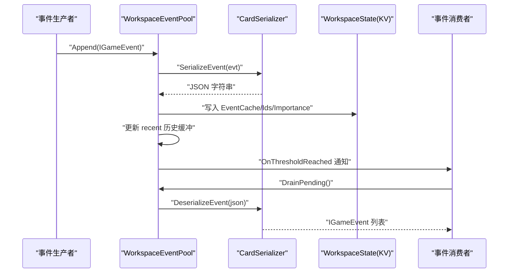
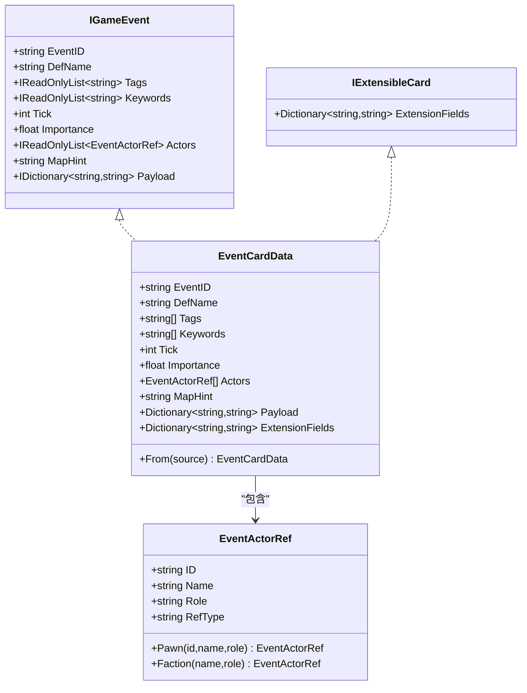
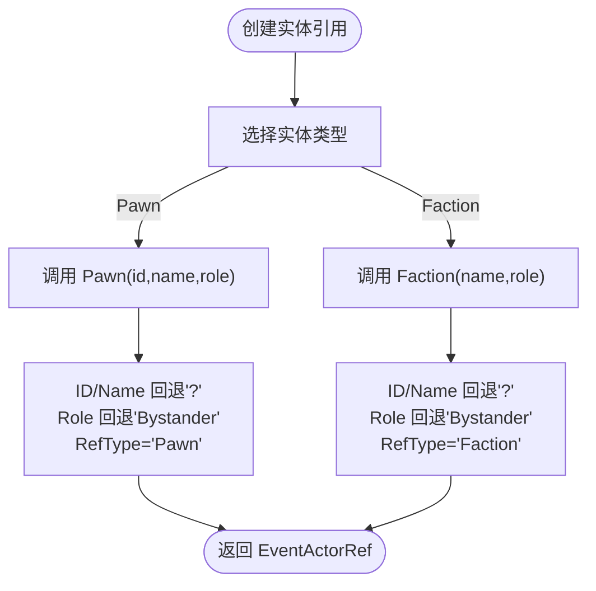
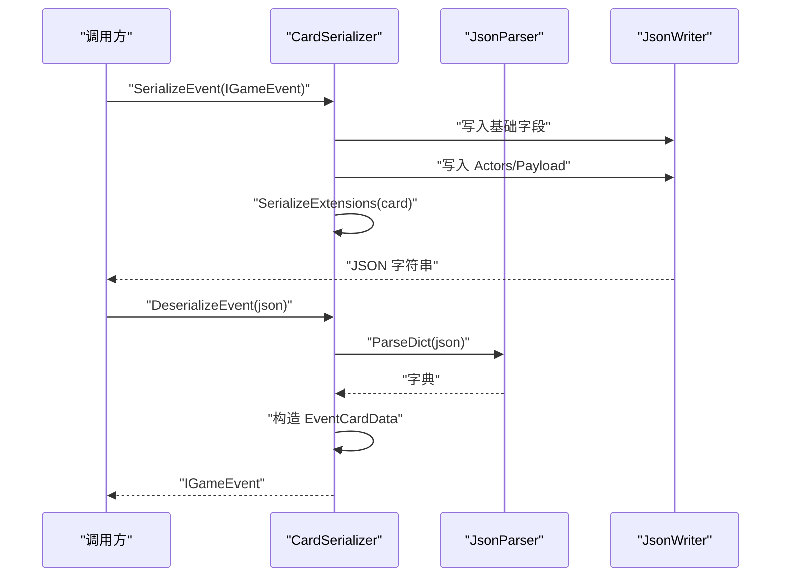
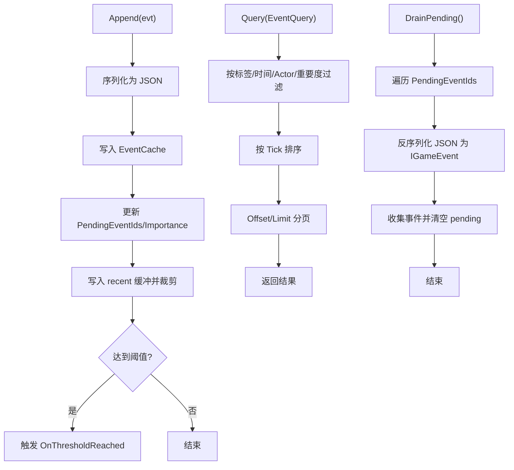
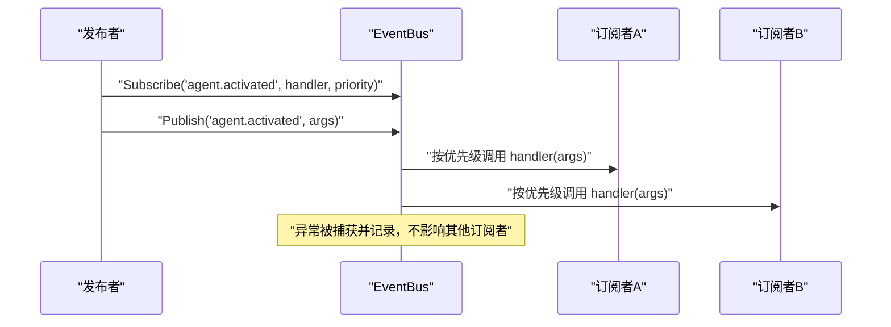
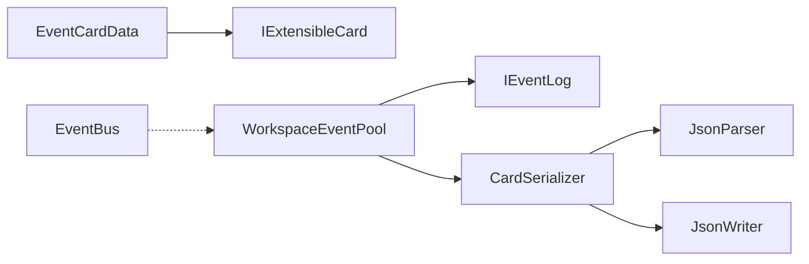

# 事件卡片系统

<cite>
**本文引用的文件**
- [EventCard.cs](file://src/NPCLife/Cards/EventCard.cs)
- [IExtensibleCard.cs](file://src/NPCLife/Cards/IExtensibleCard.cs)
- [CardDataStructs.cs](file://src/NPCLife/Cards/CardDataStructs.cs)
- [EventCardTests.cs](file://tests/NPCLife.Tests/Cards/EventCardTests.cs)
- [CardSerializer.cs](file://src/NPCLife/Framework/Mcp/CardSerializer.cs)
- [IEventLog.cs](file://src/NPCLife/Core/IEventLog.cs)
- [EventQuery.cs](file://src/NPCLife/Core/EventQuery.cs)
- [WorkspaceEventPool.cs](file://src/NPCLife/Workspace/WorkspaceEventPool.cs)
- [EventBus.cs](file://src/NPCLife/Framework/EventBus.cs)
- [EnvironmentCard.cs](file://src/NPCLife/Cards/EnvironmentCard.cs)
- [ColonyContext.cs](file://src/NPCLife/Cards/ColonyContext.cs)
- [CharacterCard.cs](file://src/NPCLife/Cards/CharacterCard.cs)
- [ObjectiveCard.cs](file://src/NPCLife/Cards/ObjectiveCard.cs)
</cite>

## 目录
1. [简介](#简介)
2. [项目结构](#项目结构)
3. [核心组件](#核心组件)
4. [架构概览](#架构概览)
5. [详细组件分析](#详细组件分析)
6. [依赖分析](#依赖分析)
7. [性能考虑](#性能考虑)
8. [故障排查指南](#故障排查指南)
9. [结论](#结论)
10. [附录](#附录)

## 简介
本文件系统性阐述事件卡片系统的设计与实现，重点围绕 IGameEvent 接口及其具体实现 EventCardData，详解事件标识、定义名称、语义标签、关键词、时间戳、重要度、实体引用与扩展载荷等核心字段；同时说明 EventActorRef 结构体的设计意图与使用方式，并给出在多智能体系统中的使用模式、最佳实践及创建、验证与处理流程示例。

## 项目结构
事件卡片系统位于 Cards 命名空间下，核心接口与实现集中在 EventCard.cs；序列化与反序列化由 CardSerializer 提供；事件日志与查询由 IEventLog 与 WorkspaceEventPool 实现；事件总线 EventBus 支持跨模块解耦通信；其他卡片类型（如 CharacterCard、ObjectiveCard、EnvironmentCard、ColonyContext）作为配套 DTO 与扩展能力参考。

图表来源
- [EventCard.cs:11-126](file://src/NPCLife/Cards/EventCard.cs#L11-L126)
- [IExtensibleCard.cs:9-13](file://src/NPCLife/Cards/IExtensibleCard.cs#L9-L13)
- [CardSerializer.cs:14-59](file://src/NPCLife/Framework/Mcp/CardSerializer.cs#L14-L59)
- [IEventLog.cs:12-50](file://src/NPCLife/Core/IEventLog.cs#L12-L50)
- [WorkspaceEventPool.cs:21-185](file://src/NPCLife/Workspace/WorkspaceEventPool.cs#L21-L185)
- [EventQuery.cs:9-46](file://src/NPCLife/Core/EventQuery.cs#L9-L46)
- [EventBus.cs:17-155](file://src/NPCLife/Framework/EventBus.cs#L17-L155)

章节来源
- [EventCard.cs:11-126](file://src/NPCLife/Cards/EventCard.cs#L11-L126)
- [CardSerializer.cs:14-59](file://src/NPCLife/Framework/Mcp/CardSerializer.cs#L14-L59)
- [IEventLog.cs:12-50](file://src/NPCLife/Core/IEventLog.cs#L12-L50)
- [WorkspaceEventPool.cs:21-185](file://src/NPCLife/Workspace/WorkspaceEventPool.cs#L21-L185)
- [EventQuery.cs:9-46](file://src/NPCLife/Core/EventQuery.cs#L9-L46)
- [EventBus.cs:17-155](file://src/NPCLife/Framework/EventBus.cs#L17-L155)

## 核心组件
- IGameEvent：事件的纯 DTO 接口，定义事件的唯一标识、定义名、语义标签、关键词、时间戳、重要度、实体引用、空间提示与扩展载荷等字段。
- EventCardData：IGameEvent 的具体可序列化实现，支持深拷贝与扩展字段挂载。
- EventActorRef：事件涉及的实体引用，包含实体 ID、显示名称、角色与引用类型。
- IExtensibleCard：可扩展卡片接口，允许在卡片上挂载自定义键值对并在序列化时平铺到顶层 JSON。
- CardSerializer：事件序列化/反序列化器，负责将 IGameEvent 转换为 JSON，以及从 JSON 还原为 EventCardData。
- IEventLog 与 WorkspaceEventPool：事件日志抽象与实现，提供追加、查询、阈值激活与 Draining pending 事件的能力。
- EventQuery：事件查询参数对象，支持多维筛选与分页。
- EventBus：通用事件总线，支持命名空间事件名、优先级排序与错误隔离。

章节来源
- [EventCard.cs:11-126](file://src/NPCLife/Cards/EventCard.cs#L11-L126)
- [IExtensibleCard.cs:9-13](file://src/NPCLife/Cards/IExtensibleCard.cs#L9-L13)
- [CardSerializer.cs:14-59](file://src/NPCLife/Framework/Mcp/CardSerializer.cs#L14-L59)
- [IEventLog.cs:12-50](file://src/NPCLife/Core/IEventLog.cs#L12-L50)
- [WorkspaceEventPool.cs:21-185](file://src/NPCLife/Workspace/WorkspaceEventPool.cs#L21-L185)
- [EventQuery.cs:9-46](file://src/NPCLife/Core/EventQuery.cs#L9-L46)
- [EventBus.cs:17-155](file://src/NPCLife/Framework/EventBus.cs#L17-L155)

## 架构概览
事件卡片系统采用“接口约束 + 可序列化实现 + 专用序列化器 + 事件池 + 查询过滤 + 总线解耦”的分层设计。事件以 IGameEvent 形式进入 WorkspaceEventPool，经由 CardSerializer 进行持久化与传输，最终由订阅者通过 EventBus 获取并处理。

图表来源
- [WorkspaceEventPool.cs:49-79](file://src/NPCLife/Workspace/WorkspaceEventPool.cs#L49-L79)
- [CardSerializer.cs:22-59](file://src/NPCLife/Framework/Mcp/CardSerializer.cs#L22-L59)
- [CardSerializer.cs:70-89](file://src/NPCLife/Framework/Mcp/CardSerializer.cs#L70-L89)
- [IEventLog.cs:48-49](file://src/NPCLife/Core/IEventLog.cs#L48-L49)

## 详细组件分析

### IGameEvent 接口与 EventCardData 实现
- 设计理念
  - 纯 DTO 接口，由宿主注入具体实现，确保与游戏运行时解耦。
  - 字段覆盖事件生命周期关键要素：标识、定义名、语义标签、关键词、时间戳、重要度、实体引用、空间提示与扩展载荷。
- EventCardData 关键特性
  - 实现 IGameEvent 与 IExtensibleCard，支持扩展字段平铺到 JSON 顶层。
  - 提供 From 静态方法进行深拷贝，确保不可变性与安全传递。
  - 所有集合字段均以可变容器公开，但通过显式转换暴露为只读视图，避免外部修改。
- 字段说明
  - EventID：事件唯一标识，用于缓存键与路由。
  - DefName：事件定义名，便于语义识别与路由。
  - Tags：语义标签列表，首标签为具体类型，后续为领域/子类型。
  - Keywords：知识库查询关键词，用于批量检索与提示词注入。
  - Tick：发生时刻（游戏 tick），用于排序与范围查询。
  - Importance：重要度，由事件绑定点声明，事件池用于阈值评估。
  - Actors：实体引用列表，描述事件参与者与角色。
  - MapHint：空间提示，辅助定位事件发生地点。
  - Payload：松结构扩展参数，存放事件特有数据。
  - ExtensionFields：扩展字段，序列化时平铺到顶层。

图表来源
- [EventCard.cs:11-126](file://src/NPCLife/Cards/EventCard.cs#L11-L126)
- [IExtensibleCard.cs:9-13](file://src/NPCLife/Cards/IExtensibleCard.cs#L9-L13)

章节来源
- [EventCard.cs:11-126](file://src/NPCLife/Cards/EventCard.cs#L11-L126)
- [IExtensibleCard.cs:9-13](file://src/NPCLife/Cards/IExtensibleCard.cs#L9-L13)

### EventActorRef 结构体
- 设计要点
  - 以结构体形式承载实体引用，值语义便于复制与传递。
  - 提供 Pawn 与 Faction 两类工厂方法，统一默认值与引用类型。
  - 字段包含实体 ID、显示名称、角色与引用类型，角色取值限定为常见语义（如 Initiator/Target/Victim/Bystander）。
- 使用建议
  - 当实体为角色（Pawn）时，使用 Pawn 工厂方法；当实体为派系（Faction）时，使用 Faction 工厂方法。
  - 对空输入采用安全回退策略（如 "?" 与 "Bystander"），保证序列化与渲染稳定性。

图表来源
- [EventCard.cs:89-124](file://src/NPCLife/Cards/EventCard.cs#L89-L124)

章节来源
- [EventCard.cs:89-124](file://src/NPCLife/Cards/EventCard.cs#L89-L124)
- [EventCardTests.cs:17-58](file://tests/NPCLife.Tests/Cards/EventCardTests.cs#L17-L58)

### 序列化与反序列化（CardSerializer）
- 事件序列化
  - 将 IGameEvent 的核心字段映射为 JSON，包含事件标识、定义名、标签、关键词、时间戳、重要度、空间提示、实体引用与扩展载荷。
  - Actors 与 Payload 分别序列化为数组与对象，ExtensionFields 平铺到顶层。
- 事件反序列化
  - DeserializeEvent 将 JSON 反序列化为 EventCardData，支持空值与缺省字段的安全处理。
  - 支持事件缓存字典的序列化与反序列化，便于持久化与恢复。
- 扩展字段
  - SerializeExtensions 将 IExtensibleCard 的 ExtensionFields 平铺到顶层，便于下游消费方直接访问。

图表来源
- [CardSerializer.cs:22-59](file://src/NPCLife/Framework/Mcp/CardSerializer.cs#L22-L59)
- [CardSerializer.cs:70-89](file://src/NPCLife/Framework/Mcp/CardSerializer.cs#L70-L89)
- [CardSerializer.cs:413-418](file://src/NPCLife/Framework/Mcp/CardSerializer.cs#L413-L418)

章节来源
- [CardSerializer.cs:14-59](file://src/NPCLife/Framework/Mcp/CardSerializer.cs#L14-L59)
- [CardSerializer.cs:70-89](file://src/NPCLife/Framework/Mcp/CardSerializer.cs#L70-L89)
- [CardSerializer.cs:349-377](file://src/NPCLife/Framework/Mcp/CardSerializer.cs#L349-L377)

### 事件日志与查询（IEventLog 与 WorkspaceEventPool）
- 写入与持久化
  - Append 将事件序列化后写入 WorkspaceState 的 EventCache，并维护 pending 列表与重要度总和。
  - recent 历史缓冲仅保留在内存中，按重要度淘汰策略维持容量上限。
- 查询与过滤
  - Query 支持标签 OR/AND、时间范围、Actor ID、最小重要度、分页偏移与限制。
  - Count 通过 Query 包装计算满足条件的事件总数。
- 阈值激活与 Draining
  - Append 后评估阈值（事件数与重要度），满足条件触发 OnThresholdReached。
  - DrainPending 清空 pending 并返回事件列表，用于 Agent 处理。

图表来源
- [WorkspaceEventPool.cs:49-79](file://src/NPCLife/Workspace/WorkspaceEventPool.cs#L49-L79)
- [WorkspaceEventPool.cs:96-124](file://src/NPCLife/Workspace/WorkspaceEventPool.cs#L96-L124)
- [WorkspaceEventPool.cs:166-183](file://src/NPCLife/Workspace/WorkspaceEventPool.cs#L166-L183)
- [IEventLog.cs:16-49](file://src/NPCLife/Core/IEventLog.cs#L16-L49)

章节来源
- [IEventLog.cs:12-50](file://src/NPCLife/Core/IEventLog.cs#L12-L50)
- [WorkspaceEventPool.cs:21-185](file://src/NPCLife/Workspace/WorkspaceEventPool.cs#L21-L185)
- [EventQuery.cs:9-46](file://src/NPCLife/Core/EventQuery.cs#L9-L46)

### 事件总线（EventBus）
- 功能特性
  - 支持命名空间事件名（如 agent.activated）、优先级排序与错误隔离。
  - Subscribe 返回取消订阅的 Action，便于生命周期管理。
  - Publish 自动填充事件名与时间戳，调用链路中异常不会影响其他订阅者。
- 使用场景
  - 事件池阈值达到时发布 agent.activated，驱动 Agent 循环。
  - 工具调用前后发布 tool.invoking/tool.invoked，便于监控与审计。

图表来源
- [EventBus.cs:46-113](file://src/NPCLife/Framework/EventBus.cs#L46-L113)
- [EventBus.cs:186-241](file://src/NPCLife/Framework/EventBus.cs#L186-L241)

章节来源
- [EventBus.cs:17-155](file://src/NPCLife/Framework/EventBus.cs#L17-L155)

### 多智能体系统中的使用模式与最佳实践
- 事件创建
  - 使用 EventCardData.From 从现有 IGameEvent 深拷贝，或直接构造并填充字段。
  - 通过 EventActorRef.Pawn/Faction 工厂方法创建实体引用，确保角色与引用类型一致。
- 事件验证
  - 使用 EventCardTests 中的断言模式验证标签、关键词、实体引用与默认值行为。
  - 对空输入采用安全回退策略，避免序列化失败。
- 事件处理
  - 通过 WorkspaceEventPool 的 DrainPending 获取待处理事件，结合 EventQuery 进行二次过滤。
  - 使用 EventBus 订阅 agent.activated，在阈值达到时启动 Agent 轮次。
- 最佳实践
  - 保持 Tags 的层次化组织（首标签为具体类型），提升检索与路由效率。
  - 合理设置 Importance，平衡事件池阈值与处理吞吐。
  - 使用 ExtensionFields 扩展卡片元数据，避免破坏现有结构。

章节来源
- [EventCardTests.cs:17-82](file://tests/NPCLife.Tests/Cards/EventCardTests.cs#L17-L82)
- [WorkspaceEventPool.cs:166-183](file://src/NPCLife/Workspace/WorkspaceEventPool.cs#L166-L183)
- [EventBus.cs:46-113](file://src/NPCLife/Framework/EventBus.cs#L46-L113)

## 依赖分析
- 组件耦合
  - EventCardData 依赖 IExtensibleCard 以支持扩展字段。
  - WorkspaceEventPool 依赖 IEventLog 接口与 CardSerializer，实现事件持久化与反序列化。
  - CardSerializer 依赖 JsonParser/JsonWriter，实现事件与缓存的序列化。
  - EventBus 与 WorkspaceEventPool 解耦，通过事件通知驱动处理流程。
- 外部依赖
  - 无外部框架依赖，纯序列化逻辑与事件池实现，便于移植与测试。

图表来源
- [EventCard.cs:45-84](file://src/NPCLife/Cards/EventCard.cs#L45-L84)
- [WorkspaceEventPool.cs:21-43](file://src/NPCLife/Workspace/WorkspaceEventPool.cs#L21-L43)
- [CardSerializer.cs:14-17](file://src/NPCLife/Framework/Mcp/CardSerializer.cs#L14-L17)

章节来源
- [EventCard.cs:45-84](file://src/NPCLife/Cards/EventCard.cs#L45-L84)
- [WorkspaceEventPool.cs:21-43](file://src/NPCLife/Workspace/WorkspaceEventPool.cs#L21-L43)
- [CardSerializer.cs:14-17](file://src/NPCLife/Framework/Mcp/CardSerializer.cs#L14-L17)

## 性能考虑
- 序列化成本
  - 事件序列化采用流式写入，Actor 与 Payload 分别序列化，减少一次性内存分配。
  - 扩展字段平铺到顶层，避免嵌套解析带来的额外开销。
- 内存占用
  - recent 历史缓冲按重要度淘汰策略裁剪，控制内存峰值。
  - 事件池的 pending 与 recent 分离，避免持久化与查询对内存造成双重压力。
- 查询效率
  - EventQuery 支持多维过滤与分页，建议结合标签与时间范围缩小结果集。
  - 重要度阈值与事件数阈值联动，降低无效轮询频率。

## 故障排查指南
- 序列化/反序列化问题
  - 确认 JSON 字段完整性，特别是 Actors 与 Payload 的存在性与格式。
  - 若 ExtensionFields 为空，SerializeExtensions 将跳过平铺，检查卡片是否实现 IExtensibleCard。
- 事件丢失或重复
  - 检查 WorkspaceEventPool 的 Append 是否成功写入 EventCache 与 PendingEventIds。
  - 确认 DrainPending 后 PendingEventIds 是否清空，避免重复处理。
- 阈值未触发
  - 校验 DriverConfig 中的阈值配置与当前角色，确认有效阈值计算。
  - 检查 Importance 累加是否正确，以及 recent 缓冲是否影响查询结果。

章节来源
- [CardSerializer.cs:413-418](file://src/NPCLife/Framework/Mcp/CardSerializer.cs#L413-L418)
- [WorkspaceEventPool.cs:49-79](file://src/NPCLife/Workspace/WorkspaceEventPool.cs#L49-L79)
- [WorkspaceEventPool.cs:166-183](file://src/NPCLife/Workspace/WorkspaceEventPool.cs#L166-L183)

## 结论
事件卡片系统通过清晰的接口设计、可序列化的实现与完善的序列化器，构建了面向多智能体系统的事件基础设施。IGameEvent 与 EventCardData 明确了事件的核心语义与承载结构，EventActorRef 提供标准化的实体引用模型，WorkspaceEventPool 与 IEventLog 实现了高效的事件持久化与查询，EventBus 则提供了跨模块解耦的通信机制。配合扩展字段与严格的数据验证，该系统能够稳定支撑复杂场景下的事件采集、传播与处理。

## 附录
- 相关卡片类型参考
  - CharacterCard：人物卡，聚合身份元数据，支持扩展字段。
  - ObjectiveCard：目标卡，描述目标状态与步骤，支持扩展字段。
  - EnvironmentCard：环境卡，描述环境快照，支持扩展字段。
  - ColonyContext：全局上下文，描述世界环境与状态，支持扩展字段。
  - CardDataStructs：轻量数据结构（ColonistSummary、FactionStanding、WeatherInfo），用于快速摘要与列表展示。

章节来源
- [CharacterCard.cs:9-25](file://src/NPCLife/Cards/CharacterCard.cs#L9-L25)
- [ObjectiveCard.cs:10-35](file://src/NPCLife/Cards/ObjectiveCard.cs#L10-L35)
- [EnvironmentCard.cs:9-31](file://src/NPCLife/Cards/EnvironmentCard.cs#L9-L31)
- [ColonyContext.cs:9-81](file://src/NPCLife/Cards/ColonyContext.cs#L9-L81)
- [CardDataStructs.cs:6-37](file://src/NPCLife/Cards/CardDataStructs.cs#L6-L37)