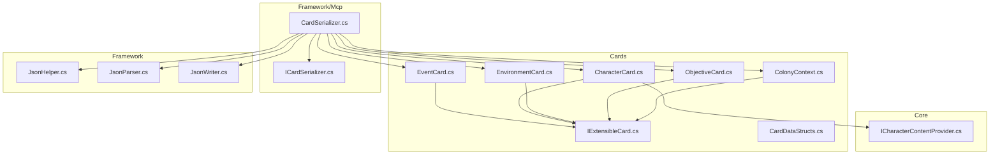
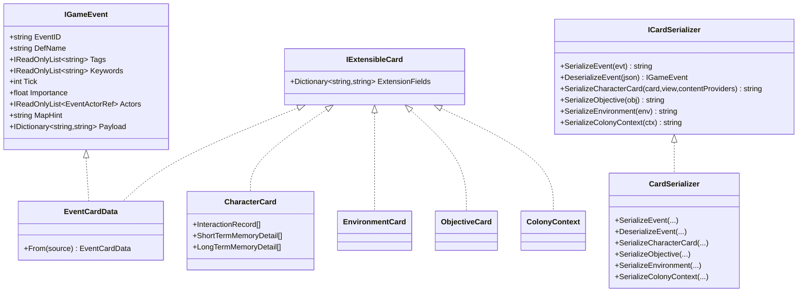
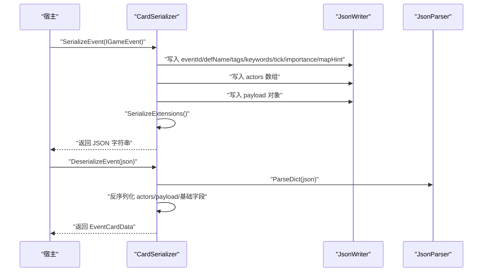
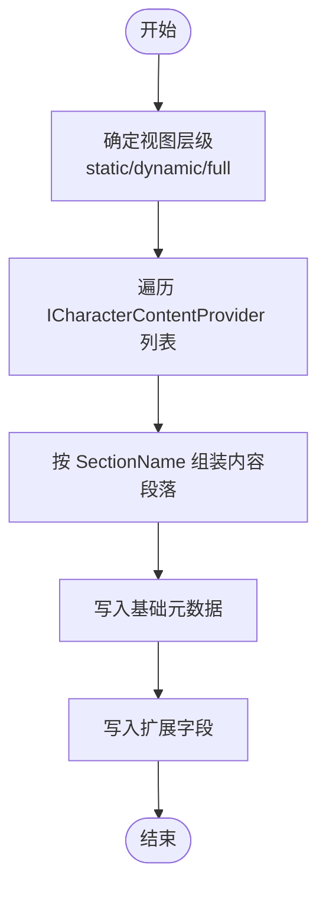
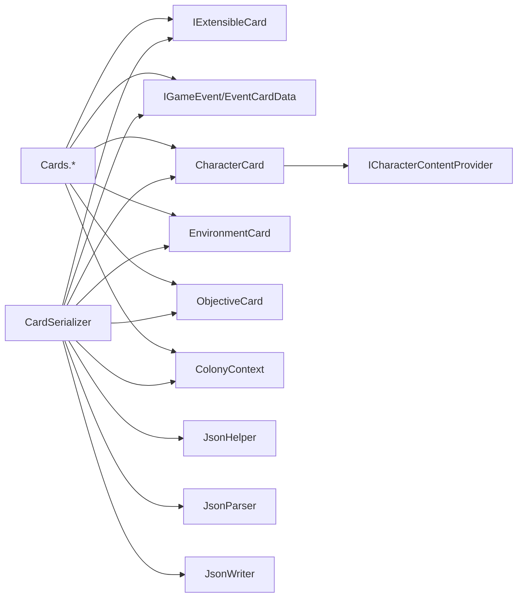

# 卡片数据结构

<cite>
**本文档引用的文件**
- [CardDataStructs.cs](file://src/NPCLife/Cards/CardDataStructs.cs)
- [CharacterCard.cs](file://src/NPCLife/Cards/CharacterCard.cs)
- [EnvironmentCard.cs](file://src/NPCLife/Cards/EnvironmentCard.cs)
- [EventCard.cs](file://src/NPCLife/Cards/EventCard.cs)
- [ObjectiveCard.cs](file://src/NPCLife/Cards/ObjectiveCard.cs)
- [IExtensibleCard.cs](file://src/NPCLife/Cards/IExtensibleCard.cs)
- [ColonyContext.cs](file://src/NPCLife/Cards/ColonyContext.cs)
- [CardSerializer.cs](file://src/NPCLife/Framework/Mcp/CardSerializer.cs)
- [ICardSerializer.cs](file://src/NPCLife/Framework/Mcp/ICardSerializer.cs)
- [JsonHelper.cs](file://src/NPCLife/Framework/JsonHelper.cs)
- [JsonParser.cs](file://src/NPCLife/Framework/JsonParser.cs)
- [JsonWriter.cs](file://src/NPCLife/Framework/JsonWriter.cs)
- [ICharacterContentProvider.cs](file://src/NPCLife/Core/ICharacterContentProvider.cs)
- [EventCardTests.cs](file://tests/NPCLife.Tests/Cards/EventCardTests.cs)
</cite>

## 目录
1. [简介](#简介)
2. [项目结构](#项目结构)
3. [核心组件](#核心组件)
4. [架构总览](#架构总览)
5. [详细组件分析](#详细组件分析)
6. [依赖分析](#依赖分析)
7. [性能考虑](#性能考虑)
8. [故障排查指南](#故障排查指南)
9. [结论](#结论)
10. [附录](#附录)

## 简介
本文件系统性梳理 NPCLife 项目中的“卡片”数据结构体系，覆盖事件卡片、角色卡片、环境卡片、目标卡片以及世界上下文卡片。文档重点阐述各类卡片的字段结构、验证与约束、业务语义、序列化/反序列化实现、卡片间关系与引用机制，并给出扩展与最佳实践建议，帮助开发者在保持低耦合的前提下灵活扩展叙事生成能力。

## 项目结构
卡片相关代码主要位于 Cards 与 Framework/Mcp 两个命名空间下：
- Cards：定义各类卡片的数据结构与接口，以及轻量级数据快照。
- Framework/Mcp：提供卡片到 JSON 的序列化/反序列化实现，以及 JSON 工具集。
- Core：提供角色卡片内容分层与内容提供者接口，支撑动态视图生成。

图表来源
- [EventCard.cs:1-126](file://src/NPCLife/Cards/EventCard.cs#L1-L126)
- [CharacterCard.cs:1-71](file://src/NPCLife/Cards/CharacterCard.cs#L1-L71)
- [EnvironmentCard.cs:1-33](file://src/NPCLife/Cards/EnvironmentCard.cs#L1-L33)
- [ObjectiveCard.cs:1-46](file://src/NPCLife/Cards/ObjectiveCard.cs#L1-L46)
- [ColonyContext.cs:1-83](file://src/NPCLife/Cards/ColonyContext.cs#L1-L83)
- [IExtensibleCard.cs:1-15](file://src/NPCLife/Cards/IExtensibleCard.cs#L1-L15)
- [CardDataStructs.cs:1-39](file://src/NPCLife/Cards/CardDataStructs.cs#L1-L39)
- [CardSerializer.cs:1-421](file://src/NPCLife/Framework/Mcp/CardSerializer.cs#L1-L421)
- [ICardSerializer.cs:1-34](file://src/NPCLife/Framework/Mcp/ICardSerializer.cs#L1-L34)
- [JsonHelper.cs:1-54](file://src/NPCLife/Framework/JsonHelper.cs#L1-L54)
- [JsonParser.cs:1-268](file://src/NPCLife/Framework/JsonParser.cs#L1-L268)
- [JsonWriter.cs:1-136](file://src/NPCLife/Framework/JsonWriter.cs#L1-L136)
- [ICharacterContentProvider.cs:1-38](file://src/NPCLife/Core/ICharacterContentProvider.cs#L1-L38)

章节来源
- [CardDataStructs.cs:1-39](file://src/NPCLife/Cards/CardDataStructs.cs#L1-L39)
- [IExtensibleCard.cs:1-15](file://src/NPCLife/Cards/IExtensibleCard.cs#L1-L15)
- [ICardSerializer.cs:1-34](file://src/NPCLife/Framework/Mcp/ICardSerializer.cs#L1-L34)

## 核心组件
- 可扩展卡片接口：IExtensibleCard，为所有卡片提供扩展字段容器，序列化时平铺到 JSON 顶层，便于动态扩展。
- 事件卡片：IGameEvent 与 EventCardData，承载事件元数据、标签、关键词、时间戳、重要度、参与者引用与事件特有负载。
- 角色卡片：CharacterCard，聚合角色身份元数据，并提供社交互动记录与短期/长期记忆详情结构。
- 环境卡片：EnvironmentCard，描述角色所处环境的温度、光照、热舒适度、天气与物品摘要。
- 目标卡片：ObjectiveCard，描述当前被追踪的目标及其来源、状态、截止时间与子步骤。
- 世界上下文：ColonyContext，提供时间、人口、派系关系、资源状态、士气、威胁、难度与科技等级等全局信息。
- JSON 工具：JsonHelper、JsonParser、JsonWriter，提供字符串转义、JSON 解析与轻量写入，避免外部依赖。

章节来源
- [IExtensibleCard.cs:1-15](file://src/NPCLife/Cards/IExtensibleCard.cs#L1-L15)
- [EventCard.cs:11-126](file://src/NPCLife/Cards/EventCard.cs#L11-L126)
- [CharacterCard.cs:9-71](file://src/NPCLife/Cards/CharacterCard.cs#L9-L71)
- [EnvironmentCard.cs:9-33](file://src/NPCLife/Cards/EnvironmentCard.cs#L9-L33)
- [ObjectiveCard.cs:10-46](file://src/NPCLife/Cards/ObjectiveCard.cs#L10-L46)
- [ColonyContext.cs:9-83](file://src/NPCLife/Cards/ColonyContext.cs#L9-L83)
- [JsonHelper.cs:1-54](file://src/NPCLife/Framework/JsonHelper.cs#L1-L54)
- [JsonParser.cs:1-268](file://src/NPCLife/Framework/JsonParser.cs#L1-L268)
- [JsonWriter.cs:1-136](file://src/NPCLife/Framework/JsonWriter.cs#L1-L136)

## 架构总览
卡片序列化/反序列化采用“接口 + 实现 + 轻量 JSON 工具”的分层设计：
- ICardSerializer 定义序列化契约，CardSerializer 提供具体实现。
- 所有卡片实现 IExtensibleCard，扩展字段在序列化时平铺到 JSON 顶层。
- JsonWriter/JsonHelper/JsonParser 提供高性能、零外部依赖的 JSON 处理能力。
- 角色卡片通过 ICharacterContentProvider 钩子按视图层级动态拼装内容段落。

图表来源
- [ICardSerializer.cs:12-34](file://src/NPCLife/Framework/Mcp/ICardSerializer.cs#L12-L34)
- [CardSerializer.cs:14-421](file://src/NPCLife/Framework/Mcp/CardSerializer.cs#L14-L421)
- [EventCard.cs:45-84](file://src/NPCLife/Cards/EventCard.cs#L45-L84)
- [CharacterCard.cs:9-71](file://src/NPCLife/Cards/CharacterCard.cs#L9-L71)
- [EnvironmentCard.cs:9-33](file://src/NPCLife/Cards/EnvironmentCard.cs#L9-L33)
- [ObjectiveCard.cs:10-46](file://src/NPCLife/Cards/ObjectiveCard.cs#L10-L46)
- [ColonyContext.cs:9-83](file://src/NPCLife/Cards/ColonyContext.cs#L9-L83)
- [IExtensibleCard.cs:9-15](file://src/NPCLife/Cards/IExtensibleCard.cs#L9-L15)

## 详细组件分析

### 事件卡片（EventCard）
- 结构要点
  - 事件唯一标识、定义名、标签（首标签为具体类型）、关键词、时间戳、重要度、参与者引用、空间提示、事件特有负载。
  - 参与者引用包含实体 ID、名称、角色与引用类型，提供工厂方法以简化构造。
  - 可序列化实现 EventCardData 支持深拷贝与从 IGameEvent 构造。
- 验证与约束
  - 标签为字符串列表，无需枚举解析；关键词用于知识库检索；重要度由事件绑定点声明。
  - 参与者引用的角色限定为特定枚举值，引用类型区分 Pawn/Faction/Thing。
- 业务逻辑
  - 事件池可直接累加重要度；事件缓存使用 KV 存储，支持序列化/反序列化。
- 序列化/反序列化
  - 使用 JsonWriter 写入基础字段与数组/对象；扩展字段平铺到顶层；反序列化时解析数组与嵌套对象为原生结构。

图表来源
- [CardSerializer.cs:22-89](file://src/NPCLife/Framework/Mcp/CardSerializer.cs#L22-L89)
- [EventCard.cs:45-84](file://src/NPCLife/Cards/EventCard.cs#L45-L84)
- [JsonWriter.cs:11-136](file://src/NPCLife/Framework/JsonWriter.cs#L11-L136)
- [JsonParser.cs:23-92](file://src/NPCLife/Framework/JsonParser.cs#L23-L92)

章节来源
- [EventCard.cs:11-126](file://src/NPCLife/Cards/EventCard.cs#L11-L126)
- [CardSerializer.cs:22-110](file://src/NPCLife/Framework/Mcp/CardSerializer.cs#L22-L110)
- [EventCardTests.cs:17-82](file://tests/NPCLife.Tests/Cards/EventCardTests.cs#L17-L82)

### 角色卡片（CharacterCard）
- 结构要点
  - 基本元数据：ID、姓名、全名、定义名、派系标签、性别、类型、关系、生死、醒着与否。
  - 扩展字段：用于挂载自定义键值对。
  - 记忆与互动：提供交互记录、短期记忆详情、长期记忆详情结构。
- 视图分层
  - 通过 ICharacterContentProvider 钩子按视图层级（static/dynamic/full）动态拼装内容段落。
- 序列化/反序列化
  - 使用 JsonWriter 写入基础字段；通过钩子收集各段内容；扩展字段平铺到顶层。

图表来源
- [CharacterCard.cs:9-71](file://src/NPCLife/Cards/CharacterCard.cs#L9-L71)
- [CardSerializer.cs:197-238](file://src/NPCLife/Framework/Mcp/CardSerializer.cs#L197-L238)
- [ICharacterContentProvider.cs:6-38](file://src/NPCLife/Core/ICharacterContentProvider.cs#L6-L38)

章节来源
- [CharacterCard.cs:9-71](file://src/NPCLife/Cards/CharacterCard.cs#L9-L71)
- [ICharacterContentProvider.cs:6-38](file://src/NPCLife/Core/ICharacterContentProvider.cs#L6-L38)
- [CardSerializer.cs:197-238](file://src/NPCLife/Framework/Mcp/CardSerializer.cs#L197-L238)

### 环境卡片（EnvironmentCard）
- 结构要点
  - 类型（室内/室外/半室外）、温度、光照、热舒适度、光照标签、天气信息、物品摘要。
  - 扩展字段：用于挂载自定义键值对。
- 序列化/反序列化
  - 天气与物品摘要作为嵌套对象/字典写入；扩展字段平铺到顶层。

章节来源
- [EnvironmentCard.cs:9-33](file://src/NPCLife/Cards/EnvironmentCard.cs#L9-L33)
- [CardSerializer.cs:281-314](file://src/NPCLife/Framework/Mcp/CardSerializer.cs#L281-L314)

### 目标卡片（ObjectiveCard）
- 结构要点
  - ID、标题、描述、状态、来源、截止时间、子步骤列表（标签+完成状态）。
  - 扩展字段：用于挂载自定义键值对。
- 序列化/反序列化
  - 子步骤序列化为对象数组；扩展字段平铺到顶层。

章节来源
- [ObjectiveCard.cs:10-46](file://src/NPCLife/Cards/ObjectiveCard.cs#L10-L46)
- [CardSerializer.cs:244-275](file://src/NPCLife/Framework/Mcp/CardSerializer.cs#L244-L275)

### 世界上下文（ColonyContext）
- 结构要点
  - 时间（tick、季节、时段、年、小时）、人口、角色摘要、派系关系、资源状态、士气、威胁、难度、科技等级、生命周期起始时间。
  - 扩展字段：用于挂载自定义键值对。
- 序列化/反序列化
  - 各字段按需写入；扩展字段平铺到顶层。

章节来源
- [ColonyContext.cs:9-83](file://src/NPCLife/Cards/ColonyContext.cs#L9-L83)
- [CardSerializer.cs:116-173](file://src/NPCLife/Framework/Mcp/CardSerializer.cs#L116-L173)

### 数据快照与引用
- 轻量摘要
  - 殖民者摘要：ID、姓名、生死、工作、情绪、痛苦、关系。
  - 派系关系：派系名、声望、关系标签。
  - 天气信息：标签、描述、降雨/降雪、风速。
- 引用机制
  - 事件参与者通过 EventActorRef 引用角色或派系，区分 Pawn/Faction/Thing 与角色（Initiator/Target/Victim/Bystander）。

章节来源
- [CardDataStructs.cs:6-37](file://src/NPCLife/Cards/CardDataStructs.cs#L6-L37)
- [EventCard.cs:89-124](file://src/NPCLife/Cards/EventCard.cs#L89-L124)

## 依赖分析
- 组件耦合
  - 所有卡片实现 IExtensibleCard，统一扩展字段处理。
  - CardSerializer 依赖 JsonHelper/JsonParser/JsonWriter 进行序列化/反序列化。
  - 角色卡片序列化依赖 ICharacterContentProvider 钩子进行内容拼装。
- 外部依赖
  - 严格零外部依赖，所有 JSON 处理逻辑内置于框架层。
- 循环依赖
  - 无循环依赖：接口在 Cards，实现与工具在 Framework。

图表来源
- [IExtensibleCard.cs:9-15](file://src/NPCLife/Cards/IExtensibleCard.cs#L9-L15)
- [CardSerializer.cs:14-421](file://src/NPCLife/Framework/Mcp/CardSerializer.cs#L14-L421)
- [ICharacterContentProvider.cs:21-36](file://src/NPCLife/Core/ICharacterContentProvider.cs#L21-L36)
- [JsonHelper.cs:8-54](file://src/NPCLife/Framework/JsonHelper.cs#L8-L54)
- [JsonParser.cs:13-268](file://src/NPCLife/Framework/JsonParser.cs#L13-L268)
- [JsonWriter.cs:11-136](file://src/NPCLife/Framework/JsonWriter.cs#L11-L136)

章节来源
- [ICardSerializer.cs:12-34](file://src/NPCLife/Framework/Mcp/ICardSerializer.cs#L12-L34)
- [CardSerializer.cs:14-421](file://src/NPCLife/Framework/Mcp/CardSerializer.cs#L14-L421)

## 性能考虑
- 内存分配优化
  - JsonWriter 使用 StringBuilder 并在构造时预估容量，减少扩容与复制。
  - SerializeObjectList 与 SerializeStringList 采用一次性拼接策略。
- 解析健壮性
  - JsonParser 支持裸值、嵌套对象/数组与转义字符，避免异常中断。
- 可扩展性
  - 扩展字段平铺序列化，避免深层嵌套带来的解析成本。

章节来源
- [JsonWriter.cs:16-136](file://src/NPCLife/Framework/JsonWriter.cs#L16-L136)
- [JsonParser.cs:19-268](file://src/NPCLife/Framework/JsonParser.cs#L19-L268)
- [CardSerializer.cs:396-407](file://src/NPCLife/Framework/Mcp/CardSerializer.cs#L396-L407)

## 故障排查指南
- 常见问题
  - 反序列化失败：检查 JSON 是否为空或格式错误；确认键名与类型匹配。
  - 扩展字段丢失：确保 ExtensionFields 非空且键值有效。
  - 角色内容为空：确认 ICharacterContentProvider 返回内容且视图层级正确。
- 定位手段
  - 使用 JsonParser.ParseDict/ParseObjectArray 检查中间结构。
  - 在序列化前后打印关键字段，核对数值格式与单位。

章节来源
- [CardSerializer.cs:70-110](file://src/NPCLife/Framework/Mcp/CardSerializer.cs#L70-L110)
- [JsonParser.cs:23-125](file://src/NPCLife/Framework/JsonParser.cs#L23-L125)
- [EventCardTests.cs:17-178](file://tests/NPCLife.Tests/Cards/EventCardTests.cs#L17-L178)

## 结论
本卡片体系以纯 DTO 为核心，通过 IExtensibleCard 提供统一扩展能力，结合 ICardSerializer 与轻量 JSON 工具，实现高效、可测试、可扩展的序列化/反序列化流程。事件、角色、环境、目标与上下文卡片共同构成叙事生成所需的核心数据骨架，既满足低耦合需求，又具备良好的灵活性与可维护性。

## 附录

### 字段与验证规则速查
- 事件卡片
  - 必填：EventID、DefName、Tick、Importance。
  - 参与者角色：Initiator/Target/Victim/Bystander；引用类型：Pawn/Faction/Thing。
  - 关键词用于知识库检索；标签为字符串列表，首标签为具体类型。
- 角色卡片
  - 基本元数据：ID、Name、FullName、DefName、FactionLabel、Gender、PawnType、PawnRelation、IsDead、IsAwake。
  - 扩展字段：Dictionary<string,string>，序列化时平铺。
- 环境卡片
  - Type：Indoors/Outdoors/SemiOutdoors；Temperature/LightLevel；Weather 为空时室内。
  - ThingSummary：类别计数映射。
- 目标卡片
  - Status：Active/Completed/Failed/Expired；Source：QuestSystem/ColonyNeed/AgentInferred。
  - Steps：Label + IsCompleted。
- 上下文卡片
  - 时间与人口：CurrentTick、Season、TimeOfDay、Year、Hour、PopulationAlive。
  - 资源与士气：FoodStatus、PowerStatus、MoraleAverage、MoraleTier。
  - 威胁与难度：ActiveThreats、Difficulty、TechLevel、ColonyStartTick。

章节来源
- [EventCard.cs:11-126](file://src/NPCLife/Cards/EventCard.cs#L11-L126)
- [CharacterCard.cs:9-71](file://src/NPCLife/Cards/CharacterCard.cs#L9-L71)
- [EnvironmentCard.cs:9-33](file://src/NPCLife/Cards/EnvironmentCard.cs#L9-L33)
- [ObjectiveCard.cs:10-46](file://src/NPCLife/Cards/ObjectiveCard.cs#L10-L46)
- [ColonyContext.cs:9-83](file://src/NPCLife/Cards/ColonyContext.cs#L9-L83)

### 最佳实践与设计模式
- 设计模式
  - 钩子模式：角色卡片内容通过 ICharacterContentProvider 动态拼装，降低耦合。
  - 扩展模式：IExtensibleCard 统一扩展字段处理，便于插件式增强。
  - 接口隔离：ICardSerializer 与 IGameEvent 分离，便于测试与替换实现。
- 最佳实践
  - 事件标签使用“具体类型 + 领域子类型”的层次化命名，利于检索与过滤。
  - 扩展字段命名前缀化，避免冲突。
  - 反序列化时对空值与默认值进行显式校验，保证数据一致性。
  - 视图层级按需生成，避免一次性输出全量内容造成体积膨胀。

章节来源
- [ICharacterContentProvider.cs:21-36](file://src/NPCLife/Core/ICharacterContentProvider.cs#L21-L36)
- [IExtensibleCard.cs:9-15](file://src/NPCLife/Cards/IExtensibleCard.cs#L9-L15)
- [ICardSerializer.cs:12-34](file://src/NPCLife/Framework/Mcp/ICardSerializer.cs#L12-L34)

### 自定义卡片类型开发指南
- 步骤
  1) 定义 DTO：新增类继承 IExtensibleCard，声明必要字段与扩展字段。
  2) 实现序列化：在 CardSerializer 中添加对应 SerializeXxx 方法，使用 JsonWriter 写入字段与嵌套对象。
  3) 注册契约：在 ICardSerializer 中添加签名，便于上层调用。
  4) 反序列化：提供 DeserializeXxx 方法，使用 JsonParser 解析嵌套结构。
  5) 测试：编写单元测试验证字段完整性与默认值行为。
- 示例参考
  - 事件卡片：IGameEvent/EventCardData 的实现与序列化/反序列化。
  - 角色卡片：ICharacterContentProvider 钩子与视图层级拼装。
  - 环境卡片：天气与物品摘要的嵌套对象序列化。

章节来源
- [EventCard.cs:45-84](file://src/NPCLife/Cards/EventCard.cs#L45-L84)
- [CardSerializer.cs:22-173](file://src/NPCLife/Framework/Mcp/CardSerializer.cs#L22-L173)
- [ICharacterContentProvider.cs:21-36](file://src/NPCLife/Core/ICharacterContentProvider.cs#L21-L36)