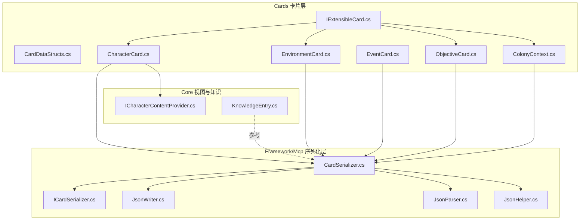
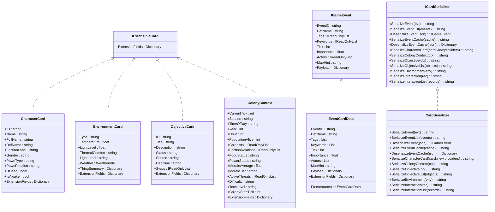
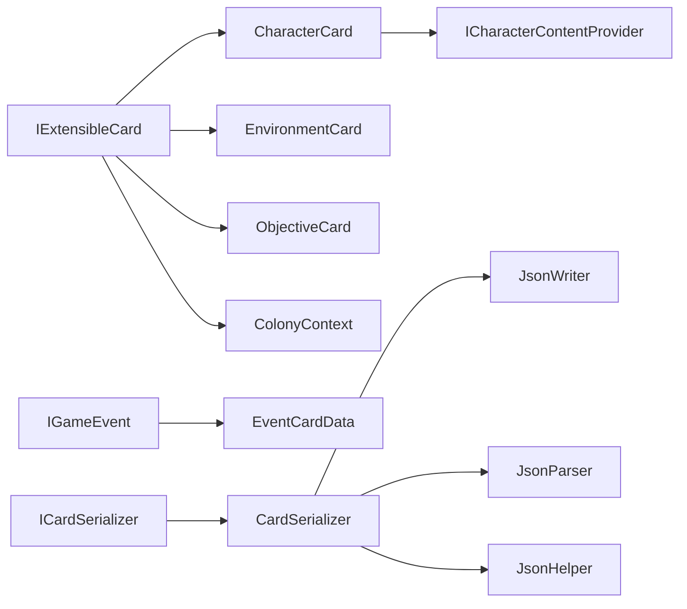

# 卡片通用数据结构

<cite>
**本文引用的文件**
- [IExtensibleCard.cs](file://src/NPCLife/Cards/IExtensibleCard.cs)
- [CardDataStructs.cs](file://src/NPCLife/Cards/CardDataStructs.cs)
- [CharacterCard.cs](file://src/NPCLife/Cards/CharacterCard.cs)
- [EnvironmentCard.cs](file://src/NPCLife/Cards/EnvironmentCard.cs)
- [EventCard.cs](file://src/NPCLife/Cards/EventCard.cs)
- [ObjectiveCard.cs](file://src/NPCLife/Cards/ObjectiveCard.cs)
- [ColonyContext.cs](file://src/NPCLife/Cards/ColonyContext.cs)
- [CardSerializer.cs](file://src/NPCLife/Framework/Mcp/CardSerializer.cs)
- [ICardSerializer.cs](file://src/NPCLife/Framework/Mcp/ICardSerializer.cs)
- [JsonHelper.cs](file://src/NPCLife/Framework/JsonHelper.cs)
- [JsonParser.cs](file://src/NPCLife/Framework/JsonParser.cs)
- [JsonWriter.cs](file://src/NPCLife/Framework/JsonWriter.cs)
- [ICharacterContentProvider.cs](file://src/NPCLife/Core/ICharacterContentProvider.cs)
- [KnowledgeEntry.cs](file://src/NPCLife/Core/KnowledgeEntry.cs)
- [README.md](file://README.md)
</cite>

## 目录
1. [简介](#简介)
2. [项目结构](#项目结构)
3. [核心组件](#核心组件)
4. [架构总览](#架构总览)
5. [详细组件分析](#详细组件分析)
6. [依赖分析](#依赖分析)
7. [性能考虑](#性能考虑)
8. [故障排查指南](#故障排查指南)
9. [结论](#结论)
10. [附录](#附录)

## 简介
本文件聚焦于 NPCLife 项目中的“卡片通用数据结构”，系统性阐述以下主题：
- IExtensibleCard 接口的设计原理与扩展机制，以及扩展字段的管理与类型安全保证
- CardDataStructs 中定义的通用数据结构（基础类型、枚举与辅助类）及其作用
- 卡片系统的共享数据模型与工具类（序列化支持、验证规则与转换机制）
- 卡片数据结构的继承关系与组合模式
- 自定义卡片类型开发时应遵循的设计原则与最佳实践

## 项目结构
本专题涉及的文件主要分布在 Cards 与 Framework/Mcp 两个命名空间下，配合 Core 中的角色视图与知识条目模型，形成“数据模型 + 序列化工具 + 视图钩子”的完整体系。

图表来源
- [IExtensibleCard.cs:1-15](file://src/NPCLife/Cards/IExtensibleCard.cs#L1-L15)
- [CardDataStructs.cs:1-39](file://src/NPCLife/Cards/CardDataStructs.cs#L1-L39)
- [CharacterCard.cs:1-71](file://src/NPCLife/Cards/CharacterCard.cs#L1-L71)
- [EnvironmentCard.cs:1-33](file://src/NPCLife/Cards/EnvironmentCard.cs#L1-L33)
- [EventCard.cs:1-126](file://src/NPCLife/Cards/EventCard.cs#L1-L126)
- [ObjectiveCard.cs:1-46](file://src/NPCLife/Cards/ObjectiveCard.cs#L1-L46)
- [ColonyContext.cs:1-83](file://src/NPCLife/Cards/ColonyContext.cs#L1-L83)
- [ICardSerializer.cs:1-34](file://src/NPCLife/Framework/Mcp/ICardSerializer.cs#L1-L34)
- [CardSerializer.cs:1-421](file://src/NPCLife/Framework/Mcp/CardSerializer.cs#L1-L421)
- [JsonHelper.cs:1-54](file://src/NPCLife/Framework/JsonHelper.cs#L1-L54)
- [JsonParser.cs:1-268](file://src/NPCLife/Framework/JsonParser.cs#L1-L268)
- [JsonWriter.cs:1-136](file://src/NPCLife/Framework/JsonWriter.cs#L1-L136)
- [ICharacterContentProvider.cs:1-38](file://src/NPCLife/Core/ICharacterContentProvider.cs#L1-L38)
- [KnowledgeEntry.cs:1-27](file://src/NPCLife/Core/KnowledgeEntry.cs#L1-L27)

章节来源
- [README.md:1-93](file://README.md#L1-L93)

## 核心组件
本节概述卡片系统的关键构件与其职责：
- IExtensibleCard：统一的可扩展卡片接口，提供扩展字段容器，确保序列化时扩展字段平铺至顶层 JSON，便于 LLM 与下游消费者直接访问
- CardDataStructs：定义通用的轻量级数据结构（如 ColonistSummary、FactionStanding、WeatherInfo），用于在卡片间共享与复用
- 卡片类（CharacterCard、EnvironmentCard、ObjectiveCard、ColonyContext）：以纯 DTO 形式承载业务语义，均实现 IExtensibleCard，支持扩展字段
- IGameEvent 与 EventCardData：事件领域的标准接口与可序列化实现，同样实现 IExtensibleCard，支持 Payload 与扩展字段
- ICardSerializer 与 CardSerializer：面向各类卡片的序列化/反序列化接口与实现，内置扩展字段平铺逻辑
- JsonHelper/JsonParser/JsonWriter：轻量 JSON 工具集，提供字符串转义、解析与写入能力，支撑序列化器的高性能实现
- ICharacterContentProvider：角色卡片内容提供者的钩子接口，用于按视图层级拼装结构化 JSON

章节来源
- [IExtensibleCard.cs:1-15](file://src/NPCLife/Cards/IExtensibleCard.cs#L1-L15)
- [CardDataStructs.cs:1-39](file://src/NPCLife/Cards/CardDataStructs.cs#L1-L39)
- [CharacterCard.cs:1-71](file://src/NPCLife/Cards/CharacterCard.cs#L1-L71)
- [EnvironmentCard.cs:1-33](file://src/NPCLife/Cards/EnvironmentCard.cs#L1-L33)
- [EventCard.cs:1-126](file://src/NPCLife/Cards/EventCard.cs#L1-L126)
- [ObjectiveCard.cs:1-46](file://src/NPCLife/Cards/ObjectiveCard.cs#L1-L46)
- [ColonyContext.cs:1-83](file://src/NPCLife/Cards/ColonyContext.cs#L1-L83)
- [ICardSerializer.cs:1-34](file://src/NPCLife/Framework/Mcp/ICardSerializer.cs#L1-L34)
- [CardSerializer.cs:1-421](file://src/NPCLife/Framework/Mcp/CardSerializer.cs#L1-L421)
- [JsonHelper.cs:1-54](file://src/NPCLife/Framework/JsonHelper.cs#L1-L54)
- [JsonParser.cs:1-268](file://src/NPCLife/Framework/JsonParser.cs#L1-L268)
- [JsonWriter.cs:1-136](file://src/NPCLife/Framework/JsonWriter.cs#L1-L136)
- [ICharacterContentProvider.cs:1-38](file://src/NPCLife/Core/ICharacterContentProvider.cs#L1-L38)

## 架构总览
卡片系统采用“接口 + 结构体 + 类 + 序列化器”的分层设计：
- 接口层：IExtensibleCard 统一扩展字段契约；IGameEvent 统一事件数据契约
- 数据层：CardDataStructs 定义共享结构体；各卡片类承载业务语义
- 序列化层：ICardSerializer 抽象接口，CardSerializer 实现具体序列化/反序列化逻辑，内置扩展字段平铺
- 工具层：JsonHelper/JsonParser/JsonWriter 提供高性能 JSON 支撑
- 视图层：ICharacterContentProvider 钩子，按视图层级拼装角色卡片内容

图表来源
- [IExtensibleCard.cs:1-15](file://src/NPCLife/Cards/IExtensibleCard.cs#L1-L15)
- [CharacterCard.cs:1-71](file://src/NPCLife/Cards/CharacterCard.cs#L1-L71)
- [EnvironmentCard.cs:1-33](file://src/NPCLife/Cards/EnvironmentCard.cs#L1-L33)
- [ObjectiveCard.cs:1-46](file://src/NPCLife/Cards/ObjectiveCard.cs#L1-L46)
- [ColonyContext.cs:1-83](file://src/NPCLife/Cards/ColonyContext.cs#L1-L83)
- [EventCard.cs:1-126](file://src/NPCLife/Cards/EventCard.cs#L1-L126)
- [ICardSerializer.cs:1-34](file://src/NPCLife/Framework/Mcp/ICardSerializer.cs#L1-L34)
- [CardSerializer.cs:1-421](file://src/NPCLife/Framework/Mcp/CardSerializer.cs#L1-L421)

## 详细组件分析

### IExtensibleCard 接口与扩展机制
- 设计目的：为卡片 DTO 提供统一的扩展字段容器，使宿主或插件能够在不修改核心结构的前提下注入自定义键值对
- 扩展字段管理：
  - 类型：Dictionary<string, string>，键与值均为字符串，确保序列化一致性与易消费性
  - 平铺策略：CardSerializer 在序列化时将扩展字段直接平铺到 JSON 顶层，避免嵌套复杂化
  - 空值处理：序列化器仅输出非空扩展字段，避免冗余
- 类型安全保证：
  - 由于扩展字段为字符串类型，消费端无需额外解析即可直接使用
  - 若需强类型扩展，建议在上层约定命名规范与转换器，避免跨模块类型耦合

章节来源
- [IExtensibleCard.cs:1-15](file://src/NPCLife/Cards/IExtensibleCard.cs#L1-L15)
- [CardSerializer.cs:409-418](file://src/NPCLife/Framework/Mcp/CardSerializer.cs#L409-L418)

### CardDataStructs 通用数据结构
- ColonistSummary：殖民者轻量摘要，包含 ID、姓名、生死、当前工作、情绪等级、疼痛等级、关系等字段，用于快速筛选与概览
- FactionStanding：派系关系快照，包含派系名、声望值、关系标签，便于快速评估外交态势
- WeatherInfo：天气信息快照，包含标签、描述、降雨/降雪标记与风速，支持环境感知与叙事渲染

这些结构体均为公开 struct，字段均为公开成员，便于序列化器直接写入，且保持零依赖与高性能特性。

章节来源
- [CardDataStructs.cs:1-39](file://src/NPCLife/Cards/CardDataStructs.cs#L1-L39)

### 卡片类与继承关系
- CharacterCard：人物卡，承载角色身份元数据，实现 IExtensibleCard，支持扩展字段
- EnvironmentCard：环境卡，描述环境温度、光照、热舒适度、天气与物品摘要，实现 IExtensibleCard
- ObjectiveCard：目标卡，描述目标 ID、标题、描述、状态、来源、截止时间与子步骤，实现 IExtensibleCard
- ColonyContext：世界全局上下文，包含时间、人口、派系关系、资源状态、士气、威胁、难度与科技等级，实现 IExtensibleCard
- EventCardData：事件的可序列化实现，实现 IGameEvent 与 IExtensibleCard，支持 Payload 与扩展字段，并提供 From 静态方法进行深拷贝

继承关系与组合模式：
- 所有卡片类均实现 IExtensibleCard，体现“组合优于继承”的设计，避免复杂的类层次
- 事件领域通过 IGameEvent 与 EventCardData 的组合，既满足接口契约又满足序列化需求

章节来源
- [CharacterCard.cs:1-71](file://src/NPCLife/Cards/CharacterCard.cs#L1-L71)
- [EnvironmentCard.cs:1-33](file://src/NPCLife/Cards/EnvironmentCard.cs#L1-L33)
- [ObjectiveCard.cs:1-46](file://src/NPCLife/Cards/ObjectiveCard.cs#L1-L46)
- [ColonyContext.cs:1-83](file://src/NPCLife/Cards/ColonyContext.cs#L1-L83)
- [EventCard.cs:1-126](file://src/NPCLife/Cards/EventCard.cs#L1-L126)

### 序列化支持与转换机制
- ICardSerializer：定义事件、角色、环境、目标、交互等的序列化/反序列化契约，便于注入与测试
- CardSerializer：
  - 事件序列化：写入 eventId、defName、tags、keywords、tick、importance、mapHint、actors、payload，并平铺扩展字段
  - 反序列化：从 JSON 解析为 EventCardData，支持 actors 与 payload 的嵌套解析
  - 角色卡片序列化：基于 ICharacterContentProvider 的钩子收集各 section 内容，按视图层级拼装
  - 环境、目标、交互、上下文等均有专门的序列化/反序列化方法
  - 内部工具：SerializeStringList、SerializeObjectList、SerializeExtensions 等，保证性能与一致性

JSON 工具链：
- JsonHelper：字符串转义与引用
- JsonParser：字典、数组、裸值解析与反转义
- JsonWriter：高性能 JSON 对象写入器，支持原始 JSON 值写入

章节来源
- [ICardSerializer.cs:1-34](file://src/NPCLife/Framework/Mcp/ICardSerializer.cs#L1-L34)
- [CardSerializer.cs:1-421](file://src/NPCLife/Framework/Mcp/CardSerializer.cs#L1-L421)
- [JsonHelper.cs:1-54](file://src/NPCLife/Framework/JsonHelper.cs#L1-L54)
- [JsonParser.cs:1-268](file://src/NPCLife/Framework/JsonParser.cs#L1-L268)
- [JsonWriter.cs:1-136](file://src/NPCLife/Framework/JsonWriter.cs#L1-L136)

### 角色卡片视图与内容提供者
- ICharacterContentProvider：通过 SectionName 与 GetContent 组织角色卡片的内容，支持 static/dynamic/full 三层视图
- 角色卡片序列化：CardSerializer 依据视图层级调用各 Provider，将返回的自然语言内容拼装为 sections 字段

章节来源
- [ICharacterContentProvider.cs:1-38](file://src/NPCLife/Core/ICharacterContentProvider.cs#L1-L38)
- [CardSerializer.cs:197-238](file://src/NPCLife/Framework/Mcp/CardSerializer.cs#L197-L238)

### 事件领域与知识条目
- IGameEvent：事件的标准接口，包含事件标识、定义名、标签、关键词、时间戳、重要度、参与者、空间提示与松结构扩展参数
- EventCardData：可序列化的事件实现，支持 From 深拷贝，便于缓存与跨模块传输
- KnowledgeEntry：知识库条目 DTO，包含词条名、释义、来源、信心度与上下文标签，用于增强叙事与推理

章节来源
- [EventCard.cs:1-126](file://src/NPCLife/Cards/EventCard.cs#L1-L126)
- [KnowledgeEntry.cs:1-27](file://src/NPCLife/Core/KnowledgeEntry.cs#L1-L27)

## 依赖分析
- 组件耦合：
  - 卡片类依赖 IExtensibleCard 接口，实现扩展字段契约
  - CardSerializer 依赖 JsonHelper/JsonParser/JsonWriter 进行高性能 JSON 处理
  - 角色卡片序列化依赖 ICharacterContentProvider 钩子，实现内容拼装
- 直接与间接依赖：
  - ICardSerializer 为序列化抽象，CardSerializer 为其实现
  - EventCardData 同时实现 IGameEvent 与 IExtensibleCard，承担事件与扩展字段双重职责
- 循环依赖：
  - 未发现循环依赖；序列化器与卡片类通过接口解耦

图表来源
- [IExtensibleCard.cs:1-15](file://src/NPCLife/Cards/IExtensibleCard.cs#L1-L15)
- [CharacterCard.cs:1-71](file://src/NPCLife/Cards/CharacterCard.cs#L1-L71)
- [EnvironmentCard.cs:1-33](file://src/NPCLife/Cards/EnvironmentCard.cs#L1-L33)
- [ObjectiveCard.cs:1-46](file://src/NPCLife/Cards/ObjectiveCard.cs#L1-L46)
- [ColonyContext.cs:1-83](file://src/NPCLife/Cards/ColonyContext.cs#L1-L83)
- [EventCard.cs:1-126](file://src/NPCLife/Cards/EventCard.cs#L1-L126)
- [ICardSerializer.cs:1-34](file://src/NPCLife/Framework/Mcp/ICardSerializer.cs#L1-L34)
- [CardSerializer.cs:1-421](file://src/NPCLife/Framework/Mcp/CardSerializer.cs#L1-L421)
- [JsonHelper.cs:1-54](file://src/NPCLife/Framework/JsonHelper.cs#L1-L54)
- [JsonParser.cs:1-268](file://src/NPCLife/Framework/JsonParser.cs#L1-L268)
- [JsonWriter.cs:1-136](file://src/NPCLife/Framework/JsonWriter.cs#L1-L136)
- [ICharacterContentProvider.cs:1-38](file://src/NPCLife/Core/ICharacterContentProvider.cs#L1-L38)

## 性能考虑
- 高效序列化：
  - 使用 JsonWriter 减少中间对象与字符串拼接，支持原始 JSON 值写入
  - 通过 SerializeObjectList 与 SerializeStringList 批量序列化，降低循环开销
- 解析与转换：
  - JsonParser 提供字典、数组与裸值解析，避免正则与第三方库依赖
  - 反序列化时对数值与布尔进行文化无关解析，提升稳定性
- 扩展字段平铺：
  - 扩展字段直接平铺到顶层 JSON，减少嵌套层级，利于 LLM 消费与检索

章节来源
- [CardSerializer.cs:394-407](file://src/NPCLife/Framework/Mcp/CardSerializer.cs#L394-L407)
- [JsonWriter.cs:1-136](file://src/NPCLife/Framework/JsonWriter.cs#L1-L136)
- [JsonParser.cs:1-268](file://src/NPCLife/Framework/JsonParser.cs#L1-L268)

## 故障排查指南
- 扩展字段为空或缺失：
  - 检查序列化器是否正确调用扩展字段平铺逻辑
  - 确认扩展字段字典非空且键值非空
- 事件反序列化失败：
  - 核对 JSON 字段是否符合 EventCardData 的映射
  - 检查 actors 与 payload 的嵌套 JSON 是否有效
- 角色卡片 sections 为空：
  - 确认 ICharacterContentProvider 的 SectionName 与 GetContent 返回值
  - 检查视图层级参数是否正确传入
- JSON 转义问题：
  - 使用 JsonHelper.Escape 与 JsonWriter.Prop 确保字符串正确转义
  - 避免手动拼接 JSON 导致的非法字符

章节来源
- [CardSerializer.cs:409-418](file://src/NPCLife/Framework/Mcp/CardSerializer.cs#L409-L418)
- [CardSerializer.cs:70-89](file://src/NPCLife/Framework/Mcp/CardSerializer.cs#L70-L89)
- [CardSerializer.cs:217-233](file://src/NPCLife/Framework/Mcp/CardSerializer.cs#L217-L233)
- [JsonHelper.cs:1-54](file://src/NPCLife/Framework/JsonHelper.cs#L1-L54)
- [JsonWriter.cs:1-136](file://src/NPCLife/Framework/JsonWriter.cs#L1-L136)

## 结论
本文件系统梳理了 NPCLife 卡片通用数据结构的设计与实现，重点阐明了：
- IExtensibleCard 的扩展机制与类型安全边界
- CardDataStructs 的共享数据模型与组合复用
- 卡片类与事件域的继承/组合关系
- 基于 JsonHelper/JsonParser/JsonWriter 的高性能序列化方案
- 角色卡片视图与内容提供者的钩子模式

这些设计共同构成了可扩展、可测试、可维护的卡片数据体系，适用于 LLM 驱动的叙事生成场景。

## 附录
- 自定义卡片类型开发最佳实践：
  - 优先实现 IExtensibleCard，统一扩展字段管理
  - 使用公开 struct/公开字段，便于序列化器直接访问
  - 为扩展字段制定命名规范与版本策略，避免冲突
  - 通过 ICardSerializer 注入与测试，确保序列化/反序列化一致性
  - 对于强类型扩展，建议在上层提供转换器与校验器，保持类型安全
  - 角色卡片按视图层级组织内容，利用 ICharacterContentProvider 钩子实现模块化扩展

章节来源
- [IExtensibleCard.cs:1-15](file://src/NPCLife/Cards/IExtensibleCard.cs#L1-L15)
- [CardSerializer.cs:1-421](file://src/NPCLife/Framework/Mcp/CardSerializer.cs#L1-L421)
- [ICharacterContentProvider.cs:1-38](file://src/NPCLife/Core/ICharacterContentProvider.cs#L1-L38)