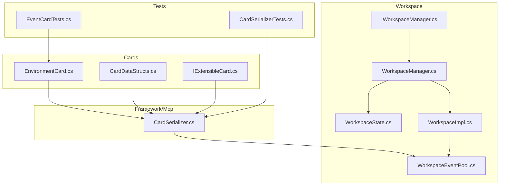
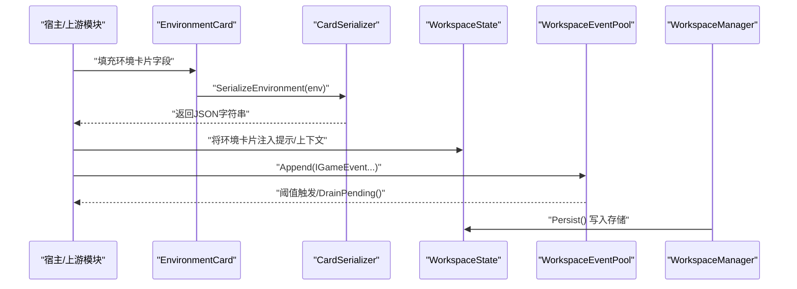
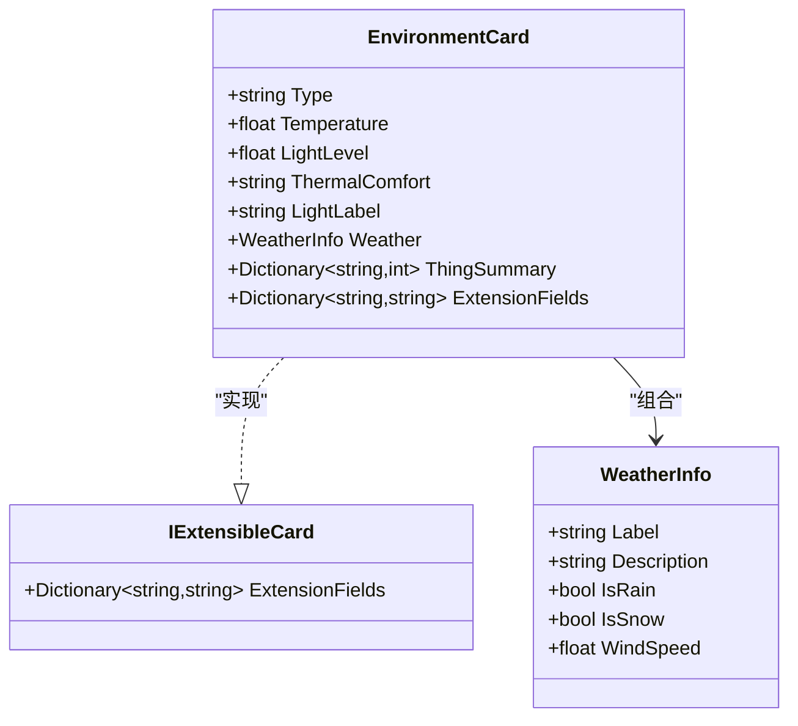
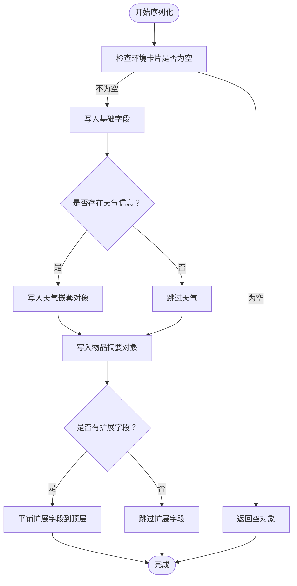
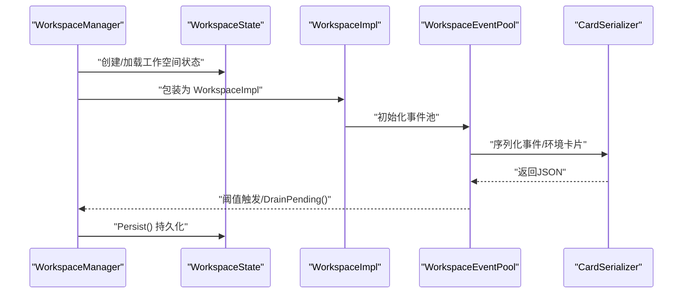
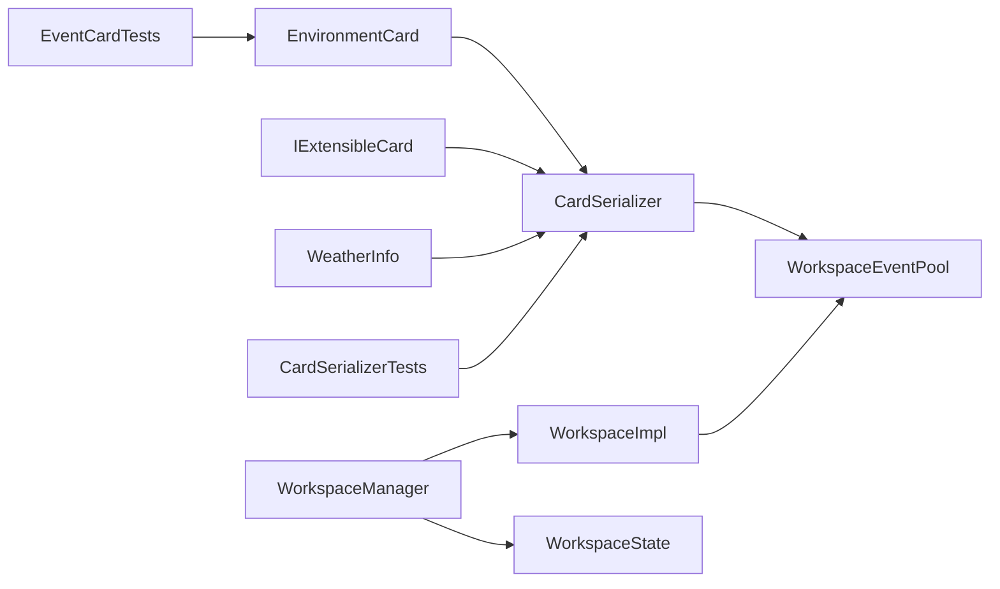

# 环境卡片系统

<cite>
**本文引用的文件**
- [EnvironmentCard.cs](file://src/NPCLife/Cards/EnvironmentCard.cs)
- [CardDataStructs.cs](file://src/NPCLife/Cards/CardDataStructs.cs)
- [IExtensibleCard.cs](file://src/NPCLife/Cards/IExtensibleCard.cs)
- [CardSerializer.cs](file://src/NPCLife/Framework/Mcp/CardSerializer.cs)
- [IWorkspaceManager.cs](file://src/NPCLife/Core/IWorkspaceManager.cs)
- [WorkspaceImpl.cs](file://src/NPCLife/Workspace/WorkspaceImpl.cs)
- [WorkspaceState.cs](file://src/NPCLife/Workspace/WorkspaceState.cs)
- [WorkspaceManager.cs](file://src/NPCLife/Workspace/WorkspaceManager.cs)
- [WorkspaceEventPool.cs](file://src/NPCLife/Workspace/WorkspaceEventPool.cs)
- [CardSerializerTests.cs](file://tests/NPCLife.Tests/Framework/CardSerializerTests.cs)
- [EventCardTests.cs](file://tests/NPCLife.Tests/Cards/EventCardTests.cs)
</cite>

## 目录
1. [简介](#简介)
2. [项目结构](#项目结构)
3. [核心组件](#核心组件)
4. [架构总览](#架构总览)
5. [详细组件分析](#详细组件分析)
6. [依赖关系分析](#依赖关系分析)
7. [性能考量](#性能考量)
8. [故障排查指南](#故障排查指南)
9. [结论](#结论)
10. [附录](#附录)

## 简介
本文件系统性阐述“环境卡片”在 NPCLife 中的设计与实现，覆盖其数据结构、序列化表示、与工作空间系统的集成方式，以及在叙事生成中的作用机制。环境卡片用于描述角色所处环境的语义化快照，包含位置类型、温度、光照、热舒适度、光照标签、天气信息以及环境内物品分类摘要等关键要素。通过可扩展字段，环境卡片还能承载业务自定义的上下文信息。结合工作空间系统，环境卡片与事件池协同，为叙事生成提供高质量且高相关性的环境背景。

## 项目结构
围绕环境卡片的关键代码分布在以下模块：
- Cards：定义环境卡片及其相关数据结构（如天气信息）与可扩展接口
- Framework/Mcp：提供卡片序列化器，负责将环境卡片转换为 LLM 可消费的 JSON
- Workspace：工作空间管理与事件池，承载环境卡片在叙事流程中的生命周期与持久化
- Tests：验证序列化行为与默认值

图表来源
- [EnvironmentCard.cs:1-33](file://src/NPCLife/Cards/EnvironmentCard.cs#L1-L33)
- [CardDataStructs.cs:1-39](file://src/NPCLife/Cards/CardDataStructs.cs#L1-L39)
- [IExtensibleCard.cs:1-15](file://src/NPCLife/Cards/IExtensibleCard.cs#L1-L15)
- [CardSerializer.cs:277-314](file://src/NPCLife/Framework/Mcp/CardSerializer.cs#L277-L314)
- [WorkspaceManager.cs:19-616](file://src/NPCLife/Workspace/WorkspaceManager.cs#L19-L616)
- [WorkspaceState.cs:94-150](file://src/NPCLife/Workspace/WorkspaceState.cs#L94-L150)
- [WorkspaceImpl.cs:16-197](file://src/NPCLife/Workspace/WorkspaceImpl.cs#L16-L197)
- [WorkspaceEventPool.cs:21-186](file://src/NPCLife/Workspace/WorkspaceEventPool.cs#L21-L186)
- [IWorkspaceManager.cs:14-57](file://src/NPCLife/Core/IWorkspaceManager.cs#L14-L57)
- [CardSerializerTests.cs:294-342](file://tests/NPCLife.Tests/Framework/CardSerializerTests.cs#L294-L342)
- [EventCardTests.cs:143-154](file://tests/NPCLife.Tests/Cards/EventCardTests.cs#L143-L154)

章节来源
- [EnvironmentCard.cs:1-33](file://src/NPCLife/Cards/EnvironmentCard.cs#L1-L33)
- [CardDataStructs.cs:1-39](file://src/NPCLife/Cards/CardDataStructs.cs#L1-L39)
- [IExtensibleCard.cs:1-15](file://src/NPCLife/Cards/IExtensibleCard.cs#L1-L15)
- [CardSerializer.cs:277-314](file://src/NPCLife/Framework/Mcp/CardSerializer.cs#L277-L314)
- [WorkspaceManager.cs:19-616](file://src/NPCLife/Workspace/WorkspaceManager.cs#L19-L616)
- [WorkspaceState.cs:94-150](file://src/NPCLife/Workspace/WorkspaceState.cs#L94-L150)
- [WorkspaceImpl.cs:16-197](file://src/NPCLife/Workspace/WorkspaceImpl.cs#L16-L197)
- [WorkspaceEventPool.cs:21-186](file://src/NPCLife/Workspace/WorkspaceEventPool.cs#L21-L186)
- [IWorkspaceManager.cs:14-57](file://src/NPCLife/Core/IWorkspaceManager.cs#L14-L57)
- [CardSerializerTests.cs:294-342](file://tests/NPCLife.Tests/Framework/CardSerializerTests.cs#L294-L342)
- [EventCardTests.cs:143-154](file://tests/NPCLife.Tests/Cards/EventCardTests.cs#L143-L154)

## 核心组件
- 环境卡片（EnvironmentCard）：描述角色所处环境的语义化快照，包含位置类型、温度、光照、热舒适度、光照标签、天气信息及物品分类摘要，并支持扩展字段
- 天气信息（WeatherInfo）：封装天气标签、描述、降水与风速等
- 可扩展卡片接口（IExtensibleCard）：约定扩展字段集合，序列化时平铺至 JSON 顶层
- 卡片序列化器（CardSerializer）：将环境卡片序列化为 JSON，包含嵌套 weather 与 thingSummary，以及扩展字段
- 工作空间（Workspace）：承载环境卡片在叙事流程中的状态与事件，提供事件池、轮次管理与持久化
- 工作空间管理器（WorkspaceManager）：提供工作空间的创建、查询、分支/合并、事件路由与持久化
- 事件池（WorkspaceEventPool）：维护最近事件与待处理事件，支持阈值触发与批量消费

章节来源
- [EnvironmentCard.cs:9-31](file://src/NPCLife/Cards/EnvironmentCard.cs#L9-L31)
- [CardDataStructs.cs:30-37](file://src/NPCLife/Cards/CardDataStructs.cs#L30-L37)
- [IExtensibleCard.cs:9-13](file://src/NPCLife/Cards/IExtensibleCard.cs#L9-L13)
- [CardSerializer.cs:281-314](file://src/NPCLife/Framework/Mcp/CardSerializer.cs#L281-L314)
- [WorkspaceState.cs:94-150](file://src/NPCLife/Workspace/WorkspaceState.cs#L94-L150)
- [WorkspaceManager.cs:91-138](file://src/NPCLife/Workspace/WorkspaceManager.cs#L91-L138)
- [WorkspaceEventPool.cs:49-89](file://src/NPCLife/Workspace/WorkspaceEventPool.cs#L49-L89)

## 架构总览
环境卡片在系统中的流转路径如下：
- 数据来源：由宿主或上游模块填充环境卡片（位置、温度、光照、天气、物品摘要、扩展字段）
- 序列化：通过 CardSerializer 将环境卡片转换为 JSON，供 MCP/LLM 使用
- 工作空间集成：环境卡片作为叙事上下文的一部分，与事件池、轮次、角色标签共同构成提示词输入
- 持久化：工作空间状态（含事件缓存）被序列化并保存，确保重启后可恢复

图表来源
- [EnvironmentCard.cs:9-31](file://src/NPCLife/Cards/EnvironmentCard.cs#L9-L31)
- [CardSerializer.cs:281-314](file://src/NPCLife/Framework/Mcp/CardSerializer.cs#L281-L314)
- [WorkspaceState.cs:94-150](file://src/NPCLife/Workspace/WorkspaceState.cs#L94-L150)
- [WorkspaceEventPool.cs:49-89](file://src/NPCLife/Workspace/WorkspaceEventPool.cs#L49-L89)
- [WorkspaceManager.cs:50-74](file://src/NPCLife/Workspace/WorkspaceManager.cs#L50-L74)

## 详细组件分析

### 环境卡片数据模型
- 关键字段
  - 类型：室内/室外/半室内
  - 温度：浮点数
  - 光照强度：0~1 浮点数
  - 热舒适度：语义标签
  - 光照标签：语义标签
  - 天气：当为室内时为 null，室外时包含标签、描述、降水与风速
  - 物品摘要：字典，键为类别，值为数量
  - 扩展字段：键值对，序列化时平铺到 JSON 顶层
- 默认值与空值处理：测试用例表明某些字段默认为 null，序列化器会按需跳过空字段

图表来源
- [EnvironmentCard.cs:9-31](file://src/NPCLife/Cards/EnvironmentCard.cs#L9-L31)
- [CardDataStructs.cs:30-37](file://src/NPCLife/Cards/CardDataStructs.cs#L30-L37)
- [IExtensibleCard.cs:9-13](file://src/NPCLife/Cards/IExtensibleCard.cs#L9-L13)

章节来源
- [EnvironmentCard.cs:9-31](file://src/NPCLife/Cards/EnvironmentCard.cs#L9-L31)
- [CardDataStructs.cs:30-37](file://src/NPCLife/Cards/CardDataStructs.cs#L30-L37)
- [IExtensibleCard.cs:9-13](file://src/NPCLife/Cards/IExtensibleCard.cs#L9-L13)
- [EventCardTests.cs:147-154](file://tests/NPCLife.Tests/Cards/EventCardTests.cs#L147-L154)

### 序列化与表示
- 序列化规则
  - 基础字段：类型、温度、光照、热舒适度、光照标签
  - 天气：仅当存在时序列化为嵌套对象，包含标签、描述、降水布尔值与风速
  - 物品摘要：序列化为键值对对象
  - 扩展字段：平铺到 JSON 顶层
- 行为验证
  - 室外环境包含天气字段，室内环境不包含房间字段
  - 默认字段可为 null，序列化器正确处理空值

图表来源
- [CardSerializer.cs:281-314](file://src/NPCLife/Framework/Mcp/CardSerializer.cs#L281-L314)
- [CardSerializerTests.cs:298-342](file://tests/NPCLife.Tests/Framework/CardSerializerTests.cs#L298-L342)

章节来源
- [CardSerializer.cs:281-314](file://src/NPCLife/Framework/Mcp/CardSerializer.cs#L281-L314)
- [CardSerializerTests.cs:298-342](file://tests/NPCLife.Tests/Framework/CardSerializerTests.cs#L298-L342)

### 与工作空间系统的集成
- 工作空间状态（WorkspaceState）
  - 包含轮次列表、当前前情提要、事件缓存、待处理事件队列与累计重要度等
  - 作为环境卡片的承载容器，参与叙事生成的上下文拼接
- 事件池（WorkspaceEventPool）
  - 维护最近事件与待处理事件，支持阈值触发与批量消费
  - 通过序列化器将事件与环境卡片一起注入提示词
- 工作空间管理器（WorkspaceManager）
  - 提供创建、查询、分支/合并、事件路由与持久化能力
  - 在创建时根据角色激活默认技能集，在分支/合并时复制/合并状态

图表来源
- [WorkspaceManager.cs:91-138](file://src/NPCLife/Workspace/WorkspaceManager.cs#L91-L138)
- [WorkspaceState.cs:94-150](file://src/NPCLife/Workspace/WorkspaceState.cs#L94-L150)
- [WorkspaceImpl.cs:25-46](file://src/NPCLife/Workspace/WorkspaceImpl.cs#L25-L46)
- [WorkspaceEventPool.cs:49-89](file://src/NPCLife/Workspace/WorkspaceEventPool.cs#L49-L89)
- [CardSerializer.cs:281-314](file://src/NPCLife/Framework/Mcp/CardSerializer.cs#L281-L314)

章节来源
- [WorkspaceState.cs:94-150](file://src/NPCLife/Workspace/WorkspaceState.cs#L94-L150)
- [WorkspaceImpl.cs:25-46](file://src/NPCLife/Workspace/WorkspaceImpl.cs#L25-L46)
- [WorkspaceEventPool.cs:49-89](file://src/NPCLife/Workspace/WorkspaceEventPool.cs#L49-L89)
- [WorkspaceManager.cs:91-138](file://src/NPCLife/Workspace/WorkspaceManager.cs#L91-L138)

### 环境卡片对叙事质量与相关性的影响
- 环境作为上下文注入：温度、光照、天气与物品摘要直接影响 NPC 的行为倾向与事件发生的概率
- 事件驱动的环境变化：事件池中的事件可触发环境状态更新（例如天气变化、物品消耗），从而影响后续叙事
- 角色与环境的耦合：通过工作空间的轮次与前情提要，环境卡片与角色状态、派系关系等共同构成提示词窗口，提升叙事一致性与相关性

章节来源
- [WorkspaceEventPool.cs:96-124](file://src/NPCLife/Workspace/WorkspaceEventPool.cs#L96-L124)
- [WorkspaceImpl.cs:83-123](file://src/NPCLife/Workspace/WorkspaceImpl.cs#L83-L123)
- [WorkspaceState.cs:120-125](file://src/NPCLife/Workspace/WorkspaceState.cs#L120-L125)

### 环境卡片的创建、更新与查询实践
- 创建
  - 通过工作空间管理器创建新工作空间，随后在合适时机将环境卡片注入提示词或事件
- 更新
  - 通过事件池追加事件，触发环境状态变化；或直接修改环境卡片字段后重新序列化
- 查询
  - 使用事件池的查询接口按标签、时间戳、重要度等条件筛选事件，结合环境卡片进行上下文检索

章节来源
- [WorkspaceManager.cs:91-138](file://src/NPCLife/Workspace/WorkspaceManager.cs#L91-L138)
- [WorkspaceEventPool.cs:96-154](file://src/NPCLife/Workspace/WorkspaceEventPool.cs#L96-L154)

### 不同游戏场景中的使用模式与优化策略
- 使用模式
  - 场景一：户外探索（温度、光照、天气显著影响角色行动与对话倾向）
  - 场景二：室内生活（物品摘要反映资源状态，影响日常事件与需求满足）
  - 场景三：昼夜循环（光照强度与时间影响角色情绪与活动安排）
- 优化策略
  - 事件阈值：根据角色定位设置不同的待处理事件计数与重要度阈值，平衡吞吐与延迟
  - 近期历史容量：控制事件池的近期事件容量，减少内存占用并提高查询效率
  - 扩展字段：仅存放必要上下文，避免过度膨胀 JSON 体积

章节来源
- [WorkspaceEventPool.cs:81-90](file://src/NPCLife/Workspace/WorkspaceEventPool.cs#L81-L90)
- [WorkspaceEventPool.cs:61-74](file://src/NPCLife/Workspace/WorkspaceEventPool.cs#L61-L74)
- [CardSerializer.cs:413-418](file://src/NPCLife/Framework/Mcp/CardSerializer.cs#L413-L418)

## 依赖关系分析
- 环境卡片依赖可扩展接口，序列化器统一处理扩展字段
- 工作空间管理器持有工作空间实现与事件池，负责状态持久化
- 事件池依赖序列化器进行事件与环境卡片的 JSON 转换
- 测试用例覆盖序列化行为与默认值，保障兼容性

图表来源
- [EnvironmentCard.cs:9-31](file://src/NPCLife/Cards/EnvironmentCard.cs#L9-L31)
- [IExtensibleCard.cs:9-13](file://src/NPCLife/Cards/IExtensibleCard.cs#L9-L13)
- [CardDataStructs.cs:30-37](file://src/NPCLife/Cards/CardDataStructs.cs#L30-L37)
- [CardSerializer.cs:281-314](file://src/NPCLife/Framework/Mcp/CardSerializer.cs#L281-L314)
- [WorkspaceManager.cs:91-138](file://src/NPCLife/Workspace/WorkspaceManager.cs#L91-L138)
- [WorkspaceImpl.cs:25-46](file://src/NPCLife/Workspace/WorkspaceImpl.cs#L25-L46)
- [WorkspaceEventPool.cs:49-89](file://src/NPCLife/Workspace/WorkspaceEventPool.cs#L49-L89)
- [CardSerializerTests.cs:298-342](file://tests/NPCLife.Tests/Framework/CardSerializerTests.cs#L298-L342)
- [EventCardTests.cs:147-154](file://tests/NPCLife.Tests/Cards/EventCardTests.cs#L147-L154)

章节来源
- [CardSerializer.cs:281-314](file://src/NPCLife/Framework/Mcp/CardSerializer.cs#L281-L314)
- [WorkspaceManager.cs:91-138](file://src/NPCLife/Workspace/WorkspaceManager.cs#L91-L138)
- [WorkspaceEventPool.cs:49-89](file://src/NPCLife/Workspace/WorkspaceEventPool.cs#L49-L89)
- [CardSerializerTests.cs:298-342](file://tests/NPCLife.Tests/Framework/CardSerializerTests.cs#L298-L342)
- [EventCardTests.cs:147-154](file://tests/NPCLife.Tests/Cards/EventCardTests.cs#L147-L154)

## 性能考量
- 事件阈值与批处理：通过有效计数与重要度阈值控制事件池触发频率，降低频繁序列化与提示词构建开销
- 近期事件容量：限制内存中保留的事件数量，避免热点工作空间内存膨胀
- JSON 序列化成本：扩展字段应精简，避免在高频路径上产生过大 JSON 文本
- 持久化策略：工作空间状态按需持久化，减少 IO 压力

## 故障排查指南
- 环境卡片为空或字段缺失
  - 现象：序列化结果缺少部分字段
  - 排查：确认环境卡片字段是否为 null，序列化器会跳过空字段
- 事件池未触发阈值
  - 现象：DrainPending 未被调用
  - 排查：检查事件重要度累加与阈值配置，确认角色类型对应的阈值参数
- 工作空间状态异常
  - 现象：状态无法更新或持久化失败
  - 排查：检查状态机转换合法性与持久化时机

章节来源
- [CardSerializerTests.cs:325-342](file://tests/NPCLife.Tests/Framework/CardSerializerTests.cs#L325-L342)
- [WorkspaceEventPool.cs:81-90](file://src/NPCLife/Workspace/WorkspaceEventPool.cs#L81-L90)
- [WorkspaceManager.cs:165-187](file://src/NPCLife/Workspace/WorkspaceManager.cs#L165-L187)

## 结论
环境卡片系统通过简洁而语义明确的数据结构，为叙事生成提供了稳定且可扩展的环境上下文。配合工作空间与事件池，系统实现了从环境状态到事件驱动再到叙事产出的完整闭环。通过合理的阈值与容量配置，可在保证叙事质量的同时兼顾性能与稳定性。

## 附录
- 相关接口与类的职责边界清晰，便于在不同游戏场景中复用与扩展
- 测试用例覆盖了关键序列化行为与默认值，建议在新增字段或调整阈值时同步补充测试