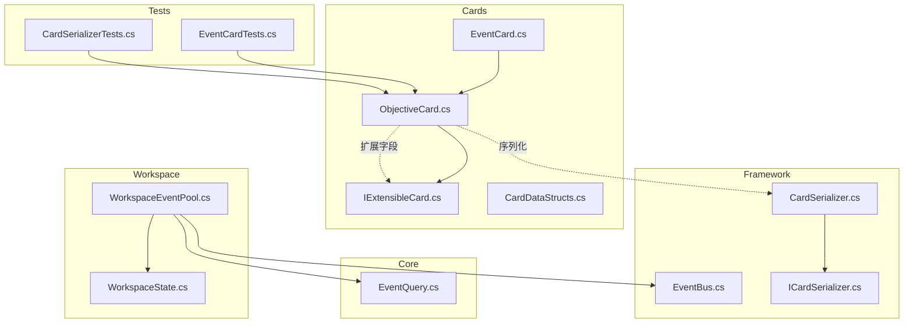
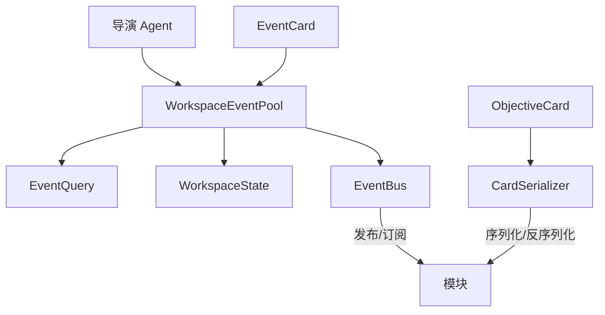
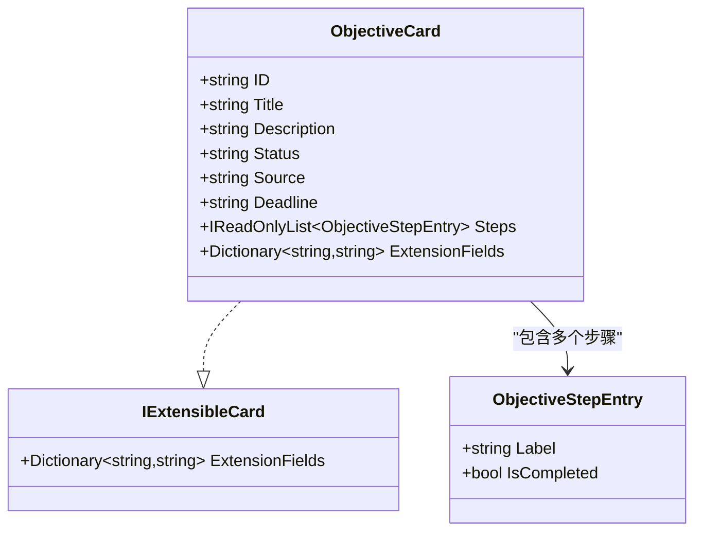
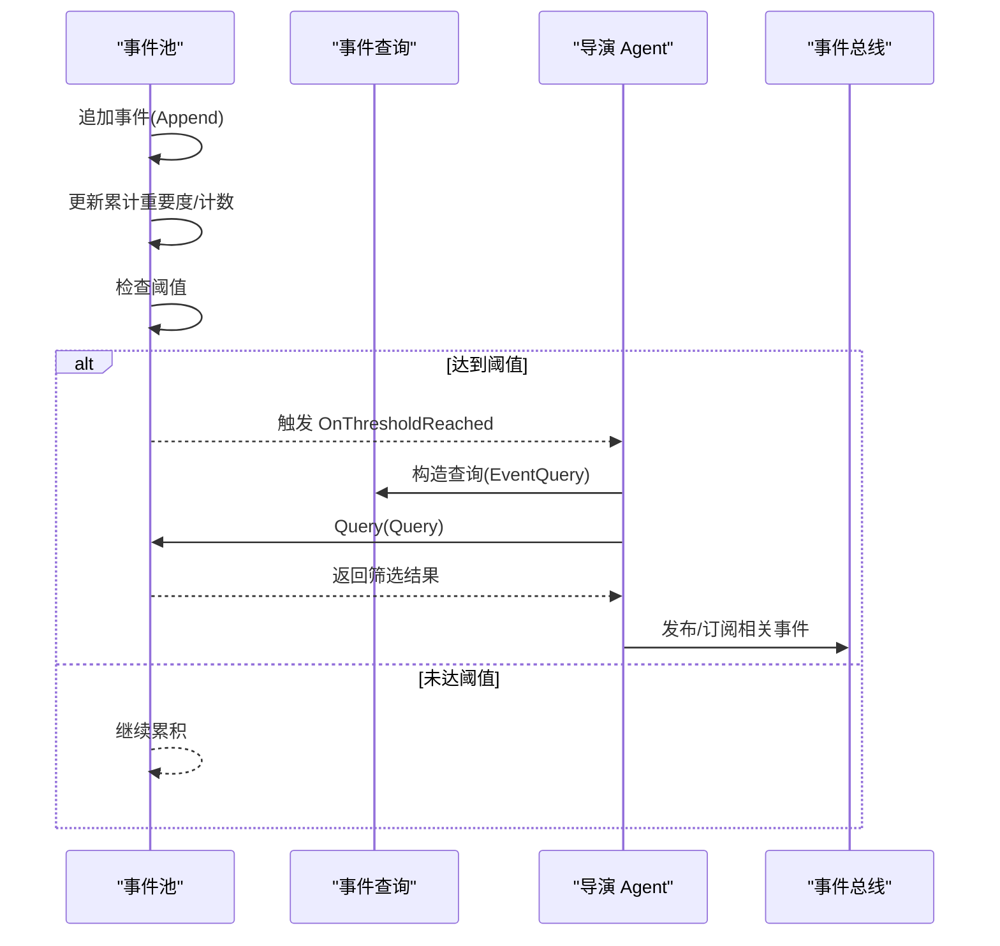
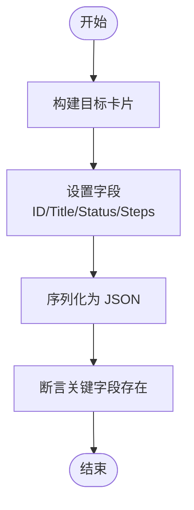
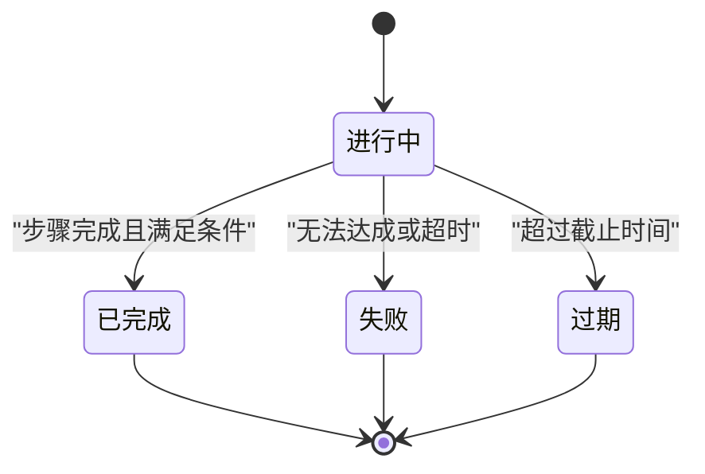
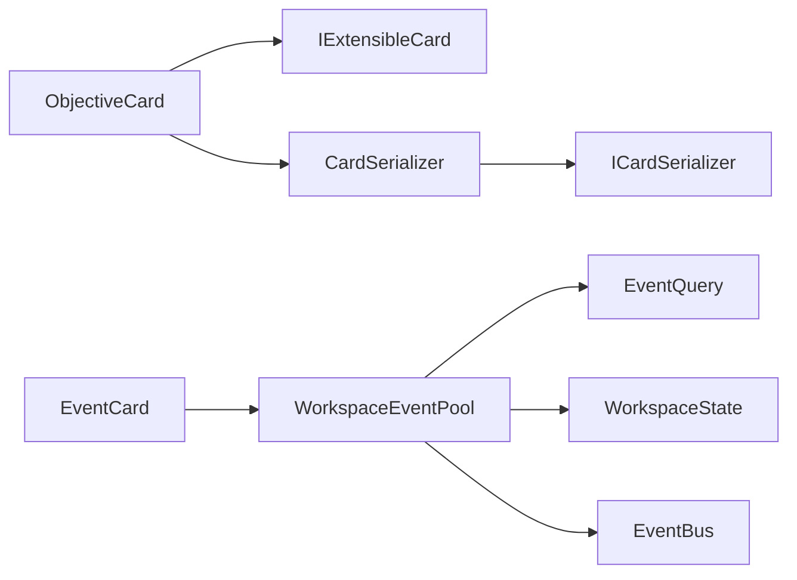

# 目标卡片系统

<cite>
**本文引用的文件**
- [ObjectiveCard.cs](file://src/NPCLife/Cards/ObjectiveCard.cs)
- [IExtensibleCard.cs](file://src/NPCLife/Cards/IExtensibleCard.cs)
- [CardDataStructs.cs](file://src/NPCLife/Cards/CardDataStructs.cs)
- [EventCard.cs](file://src/NPCLife/Cards/EventCard.cs)
- [EventQuery.cs](file://src/NPCLife/Core/EventQuery.cs)
- [EventBus.cs](file://src/NPCLife/Framework/EventBus.cs)
- [WorkspaceEventPool.cs](file://src/NPCLife/Workspace/WorkspaceEventPool.cs)
- [WorkspaceState.cs](file://src/NPCLife/Workspace/WorkspaceState.cs)
- [CardSerializer.cs](file://src/NPCLife/Framework/Mcp/CardSerializer.cs)
- [ICardSerializer.cs](file://src/NPCLife/Framework/Mcp/ICardSerializer.cs)
- [EventCardTests.cs](file://tests/NPCLife.Tests/Cards/EventCardTests.cs)
- [CardSerializerTests.cs](file://tests/NPCLife.Tests/Framework/CardSerializerTests.cs)
</cite>

## 目录
1. [引言](#引言)
2. [项目结构](#项目结构)
3. [核心组件](#核心组件)
4. [架构总览](#架构总览)
5. [详细组件分析](#详细组件分析)
6. [依赖关系分析](#依赖关系分析)
7. [性能考量](#性能考量)
8. [故障排查指南](#故障排查指南)
9. [结论](#结论)
10. [附录](#附录)

## 引言
本文件系统性阐述目标卡片（ObjectiveCard）的设计与实现，覆盖其在叙事驱动中的定位、与事件系统的交互、以及在复杂叙事结构中的应用模式与动态调整策略。目标卡片作为导演 Agent 的“当前被追踪目标”的统一抽象，既可承载传统游戏中的任务/剧情目标，也可承载来自多方来源的动态需求（如殖民地需求、Agent 推断等）。通过与事件总线、事件池、序列化器及工作空间状态的协同，目标卡片成为贯穿 NPC 行为与剧情推进的关键数据枢纽。

## 项目结构
目标卡片系统位于 Cards 命名空间，围绕以下关键模块组织：
- Cards 层：目标卡片、事件卡片、可扩展卡片接口、环境卡片等
- Core 层：事件查询参数对象
- Framework 层：事件总线、序列化器接口与实现
- Workspace 层：事件池、工作空间状态
- Tests 层：针对目标卡片与序列化的单元测试

图表来源
- [ObjectiveCard.cs:1-46](file://src/NPCLife/Cards/ObjectiveCard.cs#L1-L46)
- [IExtensibleCard.cs:1-15](file://src/NPCLife/Cards/IExtensibleCard.cs#L1-L15)
- [EventCard.cs:1-126](file://src/NPCLife/Cards/EventCard.cs#L1-L126)
- [EventQuery.cs:1-48](file://src/NPCLife/Core/EventQuery.cs#L1-L48)
- [EventBus.cs:1-243](file://src/NPCLife/Framework/EventBus.cs#L1-L243)
- [WorkspaceEventPool.cs:1-186](file://src/NPCLife/Workspace/WorkspaceEventPool.cs#L1-L186)
- [WorkspaceState.cs:1-152](file://src/NPCLife/Workspace/WorkspaceState.cs#L1-L152)
- [CardSerializer.cs](file://src/NPCLife/Framework/Mcp/CardSerializer.cs)
- [ICardSerializer.cs](file://src/NPCLife/Framework/Mcp/ICardSerializer.cs)
- [EventCardTests.cs:150-180](file://tests/NPCLife.Tests/Cards/EventCardTests.cs#L150-L180)
- [CardSerializerTests.cs:257-292](file://tests/NPCLife.Tests/Framework/CardSerializerTests.cs#L257-L292)

章节来源
- [ObjectiveCard.cs:1-46](file://src/NPCLife/Cards/ObjectiveCard.cs#L1-L46)
- [EventCard.cs:1-126](file://src/NPCLife/Cards/EventCard.cs#L1-L126)
- [EventQuery.cs:1-48](file://src/NPCLife/Core/EventQuery.cs#L1-L48)
- [EventBus.cs:1-243](file://src/NPCLife/Framework/EventBus.cs#L1-L243)
- [WorkspaceEventPool.cs:1-186](file://src/NPCLife/Workspace/WorkspaceEventPool.cs#L1-L186)
- [WorkspaceState.cs:1-152](file://src/NPCLife/Workspace/WorkspaceState.cs#L1-L152)
- [CardSerializer.cs](file://src/NPCLife/Framework/Mcp/CardSerializer.cs)
- [ICardSerializer.cs](file://src/NPCLife/Framework/Mcp/ICardSerializer.cs)
- [EventCardTests.cs:150-180](file://tests/NPCLife.Tests/Cards/EventCardTests.cs#L150-L180)
- [CardSerializerTests.cs:257-292](file://tests/NPCLife.Tests/Framework/CardSerializerTests.cs#L257-L292)

## 核心组件
- 目标卡片（ObjectiveCard）
  - 唯一标识、标题、描述、状态、来源、截止时间、子步骤、扩展字段
  - 子步骤结构体包含标签与完成标志
  - 实现可扩展卡片接口，支持序列化时平铺扩展字段
- 事件系统（EventCard/EventQuery/EventBus/WorkspaceEventPool）
  - IGameEvent 标准事件接口，包含事件 ID、定义名、标签、关键词、时间戳、重要度、参与者、地图提示与负载
  - EventQuery 支持多维筛选与分页
  - EventBus 提供发布/订阅、优先级排序与错误隔离
  - WorkspaceEventPool 实现 IEventLog，维护 pending 与 recent 两层事件缓冲，并基于阈值触发激活
- 工作空间（WorkspaceState）
  - 描述工作空间状态、角色、轮次、事件缓存与待处理事件队列、累积重要度等
- 序列化（CardSerializer/ICardSerializer）
  - 提供 ObjectiveCard 的序列化与列表序列化能力，确保跨模块一致的数据交换

章节来源
- [ObjectiveCard.cs:10-45](file://src/NPCLife/Cards/ObjectiveCard.cs#L10-L45)
- [IExtensibleCard.cs:9-13](file://src/NPCLife/Cards/IExtensibleCard.cs#L9-L13)
- [EventCard.cs:11-84](file://src/NPCLife/Cards/EventCard.cs#L11-L84)
- [EventQuery.cs:9-46](file://src/NPCLife/Core/EventQuery.cs#L9-L46)
- [EventBus.cs:17-154](file://src/NPCLife/Framework/EventBus.cs#L17-L154)
- [WorkspaceEventPool.cs:21-184](file://src/NPCLife/Workspace/WorkspaceEventPool.cs#L21-L184)
- [WorkspaceState.cs:94-150](file://src/NPCLife/Workspace/WorkspaceState.cs#L94-L150)
- [CardSerializer.cs](file://src/NPCLife/Framework/Mcp/CardSerializer.cs)
- [ICardSerializer.cs](file://src/NPCLife/Framework/Mcp/ICardSerializer.cs)

## 架构总览
目标卡片在系统中的位置与交互如下：
- 导演 Agent 通过工作空间事件池获取事件，结合事件查询与阈值触发，形成“当前被追踪目标”的输入
- 事件总线用于模块间解耦，事件产生与消费通过命名空间事件名进行
- 目标卡片作为统一数据载体，经由序列化器在 MCP 工具链中传递

图表来源
- [WorkspaceEventPool.cs:21-184](file://src/NPCLife/Workspace/WorkspaceEventPool.cs#L21-L184)
- [EventQuery.cs:9-46](file://src/NPCLife/Core/EventQuery.cs#L9-L46)
- [WorkspaceState.cs:94-150](file://src/NPCLife/Workspace/WorkspaceState.cs#L94-L150)
- [EventBus.cs:17-154](file://src/NPCLife/Framework/EventBus.cs#L17-L154)
- [ObjectiveCard.cs:10-45](file://src/NPCLife/Cards/ObjectiveCard.cs#L10-L45)
- [CardSerializer.cs](file://src/NPCLife/Framework/Mcp/CardSerializer.cs)
- [EventCard.cs:11-84](file://src/NPCLife/Cards/EventCard.cs#L11-L84)

## 详细组件分析

### 目标卡片模型与数据流
- 设计要点
  - 统一抽象：目标卡片面向导演 Agent 的“当前被追踪目标”，来源多样（任务系统、殖民地需求、Agent 推断）
  - 状态机：状态涵盖“进行中/已完成/失败/过期”，便于驱动行为与剧情走向
  - 步骤化：子步骤支持阶段性完成度统计，利于进度可视化与阶段性奖励
  - 可扩展：扩展字段支持业务定制，序列化时平铺至顶层
- 数据流
  - 事件池持续追加事件，累积重要度与数量达到阈值后触发 Agent 激活
  - Agent 基于事件查询与工作空间上下文，生成/更新目标卡片
  - 序列化器将目标卡片转换为 MCP 工具链可消费的 JSON

图表来源
- [ObjectiveCard.cs:10-45](file://src/NPCLife/Cards/ObjectiveCard.cs#L10-L45)
- [IExtensibleCard.cs:9-13](file://src/NPCLife/Cards/IExtensibleCard.cs#L9-L13)

章节来源
- [ObjectiveCard.cs:10-45](file://src/NPCLife/Cards/ObjectiveCard.cs#L10-L45)
- [IExtensibleCard.cs:9-13](file://src/NPCLife/Cards/IExtensibleCard.cs#L9-L13)
- [CardSerializerTests.cs:261-285](file://tests/NPCLife.Tests/Framework/CardSerializerTests.cs#L261-L285)

### 事件系统与目标卡片的关联
- 事件查询与过滤
  - EventQuery 支持 OR/AND 标签、时间范围、演员 ID、最小重要度、分页等维度
  - WorkspaceEventPool 在 Query 中按标签、时间、演员、重要度进行筛选与排序
- 事件池与阈值触发
  - 事件池维护 pending 与 recent 两层缓冲，阈值检测在 Append 后评估
  - 达到有效计数或重要度阈值时触发 OnThresholdReached，驱动 Agent 激活
- 事件总线与模块解耦
  - EventBus 提供命名空间事件名、优先级排序与错误隔离，避免模块间紧耦合

图表来源
- [WorkspaceEventPool.cs:49-90](file://src/NPCLife/Workspace/WorkspaceEventPool.cs#L49-L90)
- [EventQuery.cs:9-46](file://src/NPCLife/Core/EventQuery.cs#L9-L46)
- [EventBus.cs:46-113](file://src/NPCLife/Framework/EventBus.cs#L46-L113)

章节来源
- [WorkspaceEventPool.cs:49-124](file://src/NPCLife/Workspace/WorkspaceEventPool.cs#L49-L124)
- [EventQuery.cs:9-46](file://src/NPCLife/Core/EventQuery.cs#L9-L46)
- [EventBus.cs:17-154](file://src/NPCLife/Framework/EventBus.cs#L17-L154)

### 目标卡片与事件的序列化与传输
- 序列化接口
  - ICardSerializer 定义了 ObjectiveCard 与 ObjectiveCard 列表的序列化方法
  - CardSerializer 提供默认实现，确保跨模块一致的序列化/反序列化
- 测试验证
  - 单元测试覆盖基本字段存在性、空截止时间默认值、空步骤默认值、空列表序列化等场景

图表来源
- [CardSerializerTests.cs:261-285](file://tests/NPCLife.Tests/Framework/CardSerializerTests.cs#L261-L285)
- [CardSerializer.cs](file://src/NPCLife/Framework/Mcp/CardSerializer.cs)
- [ICardSerializer.cs](file://src/NPCLife/Framework/Mcp/ICardSerializer.cs)

章节来源
- [CardSerializerTests.cs:261-292](file://tests/NPCLife.Tests/Framework/CardSerializerTests.cs#L261-L292)
- [CardSerializer.cs](file://src/NPCLife/Framework/Mcp/CardSerializer.cs)
- [ICardSerializer.cs](file://src/NPCLife/Framework/Mcp/ICardSerializer.cs)

### 目标卡片在复杂叙事结构中的应用模式
- 动态目标生成
  - 基于事件池的阈值触发与查询，动态生成目标卡片；来源可为任务系统、殖民地需求或 Agent 推断
- 分支与合并
  - 工作空间状态支持分支/合并轮次，目标卡片可随叙事结构变化而调整
- 进度与奖励
  - 子步骤完成度可用于阶段性奖励与剧情推进；状态机驱动目标生命周期（进行中/完成/失败/过期）

图表来源
- [ObjectiveCard.cs:21-22](file://src/NPCLife/Cards/ObjectiveCard.cs#L21-L22)
- [WorkspaceState.cs:25-38](file://src/NPCLife/Workspace/WorkspaceState.cs#L25-L38)

章节来源
- [ObjectiveCard.cs:21-22](file://src/NPCLife/Cards/ObjectiveCard.cs#L21-L22)
- [WorkspaceState.cs:25-38](file://src/NPCLife/Workspace/WorkspaceState.cs#L25-L38)

## 依赖关系分析
- 组件耦合
  - ObjectiveCard 依赖 IExtensibleCard，实现可扩展字段
  - 事件系统通过 IGameEvent 与 WorkspaceEventPool 解耦，EventBus 提供跨模块通信
  - 序列化器通过 ICardSerializer 与具体实现解耦，保证数据一致性
- 外部依赖
  - 事件池依赖驱动配置与卡片序列化器
  - 工作空间状态包含事件缓存与待处理事件队列，支撑持久化与回放

图表来源
- [ObjectiveCard.cs:10-45](file://src/NPCLife/Cards/ObjectiveCard.cs#L10-L45)
- [IExtensibleCard.cs:9-13](file://src/NPCLife/Cards/IExtensibleCard.cs#L9-L13)
- [EventCard.cs:11-84](file://src/NPCLife/Cards/EventCard.cs#L11-L84)
- [WorkspaceEventPool.cs:21-184](file://src/NPCLife/Workspace/WorkspaceEventPool.cs#L21-L184)
- [EventQuery.cs:9-46](file://src/NPCLife/Core/EventQuery.cs#L9-L46)
- [WorkspaceState.cs:94-150](file://src/NPCLife/Workspace/WorkspaceState.cs#L94-L150)
- [EventBus.cs:17-154](file://src/NPCLife/Framework/EventBus.cs#L17-L154)
- [CardSerializer.cs](file://src/NPCLife/Framework/Mcp/CardSerializer.cs)
- [ICardSerializer.cs](file://src/NPCLife/Framework/Mcp/ICardSerializer.cs)

章节来源
- [ObjectiveCard.cs:10-45](file://src/NPCLife/Cards/ObjectiveCard.cs#L10-L45)
- [EventCard.cs:11-84](file://src/NPCLife/Cards/EventCard.cs#L11-L84)
- [WorkspaceEventPool.cs:21-184](file://src/NPCLife/Workspace/WorkspaceEventPool.cs#L21-L184)
- [EventQuery.cs:9-46](file://src/NPCLife/Core/EventQuery.cs#L9-L46)
- [WorkspaceState.cs:94-150](file://src/NPCLife/Workspace/WorkspaceState.cs#L94-L150)
- [EventBus.cs:17-154](file://src/NPCLife/Framework/EventBus.cs#L17-L154)
- [CardSerializer.cs](file://src/NPCLife/Framework/Mcp/CardSerializer.cs)
- [ICardSerializer.cs](file://src/NPCLife/Framework/Mcp/ICardSerializer.cs)

## 性能考量
- 事件池容量控制
  - recent 历史缓冲按重要度淘汰策略维持固定容量，避免内存膨胀
- 阈值触发
  - 通过有效计数与重要度阈值减少不必要的处理开销，提升响应效率
- 序列化成本
  - 可扩展字段平铺序列化，建议仅存放必要键值，避免过度扩展导致体积增大

## 故障排查指南
- 目标卡片默认值
  - 截止时间与子步骤默认为空，需在使用前检查空值
- 序列化验证
  - 通过单元测试断言关键字段存在，确保序列化正确性
- 事件查询
  - 使用 EventQuery 的多维筛选组合，逐步缩小范围定位问题

章节来源
- [EventCardTests.cs:160-177](file://tests/NPCLife.Tests/Cards/EventCardTests.cs#L160-L177)
- [CardSerializerTests.cs:261-292](file://tests/NPCLife.Tests/Framework/CardSerializerTests.cs#L261-L292)
- [EventQuery.cs:9-46](file://src/NPCLife/Core/EventQuery.cs#L9-L46)

## 结论
目标卡片系统以统一的数据模型连接事件系统与叙事管线，通过事件池的阈值触发与事件总线的解耦通信，实现对 NPC 行为与剧情发展的动态驱动。其可扩展字段与状态机设计，使其在复杂叙事结构中具备良好的适应性与可维护性。

## 附录
- 创建示例（路径参考）
  - 构建目标卡片并设置字段：[CardSerializerTests.cs:264-276](file://tests/NPCLife.Tests/Framework/CardSerializerTests.cs#L264-L276)
  - 序列化目标卡片列表：[CardSerializerTests.cs:288-292](file://tests/NPCLife.Tests/Framework/CardSerializerTests.cs#L288-L292)
- 跟踪与评估（路径参考）
  - 事件查询与分页：[EventQuery.cs:9-46](file://src/NPCLife/Core/EventQuery.cs#L9-L46)
  - 事件池查询与阈值：[WorkspaceEventPool.cs:96-90](file://src/NPCLife/Workspace/WorkspaceEventPool.cs#L96-L90)
- 动态调整策略（路径参考）
  - 工作空间状态与轮次类型：[WorkspaceState.cs:43-88](file://src/NPCLife/Workspace/WorkspaceState.cs#L43-L88)
  - 目标状态机：[ObjectiveCard.cs:21-22](file://src/NPCLife/Cards/ObjectiveCard.cs#L21-L22)