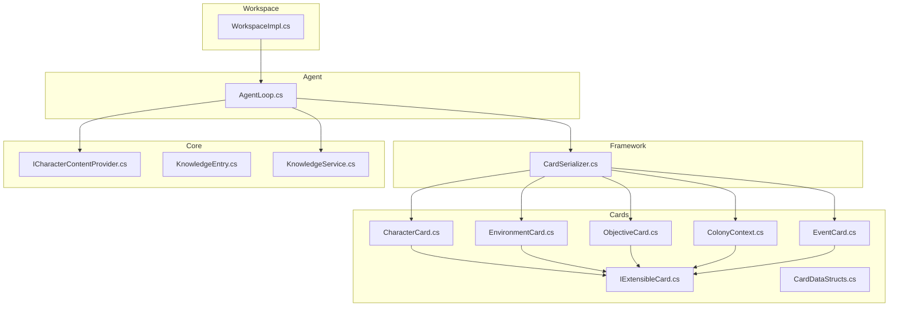
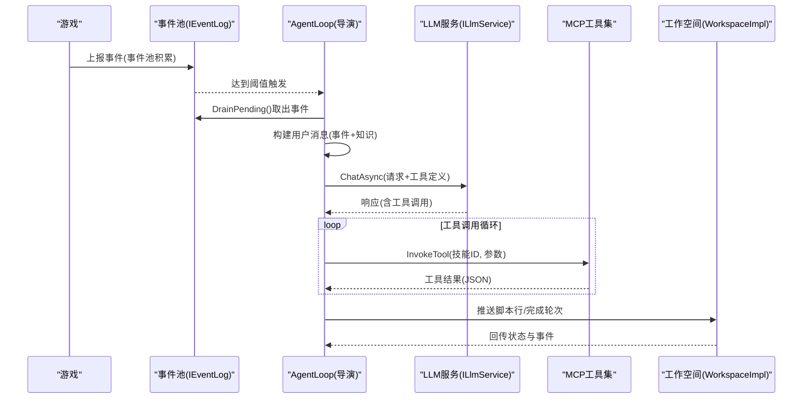
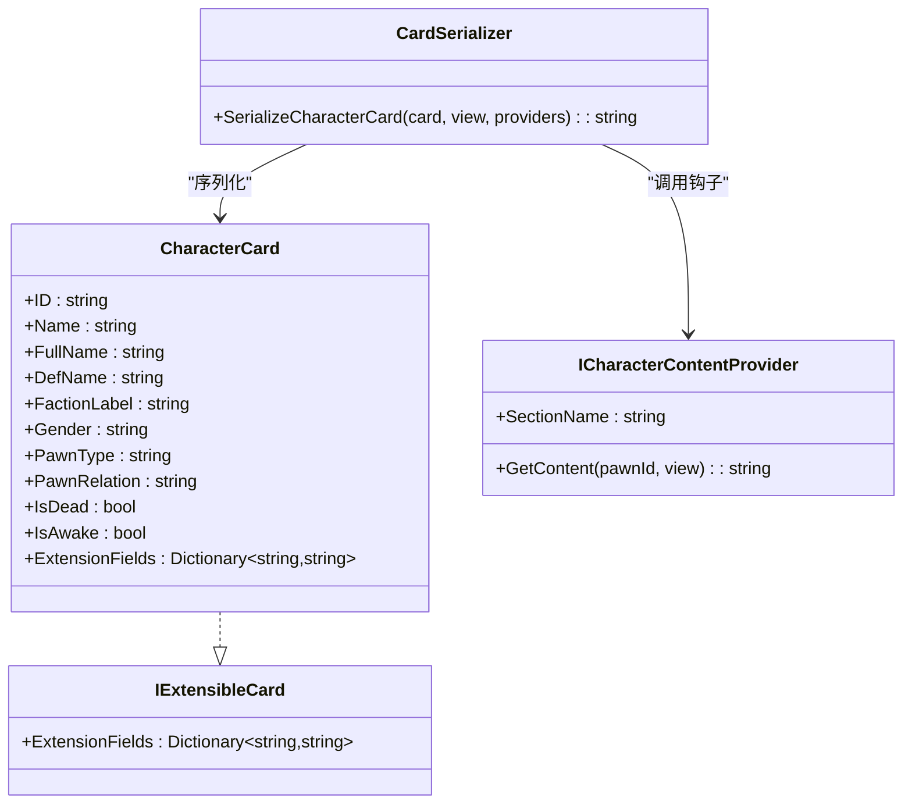
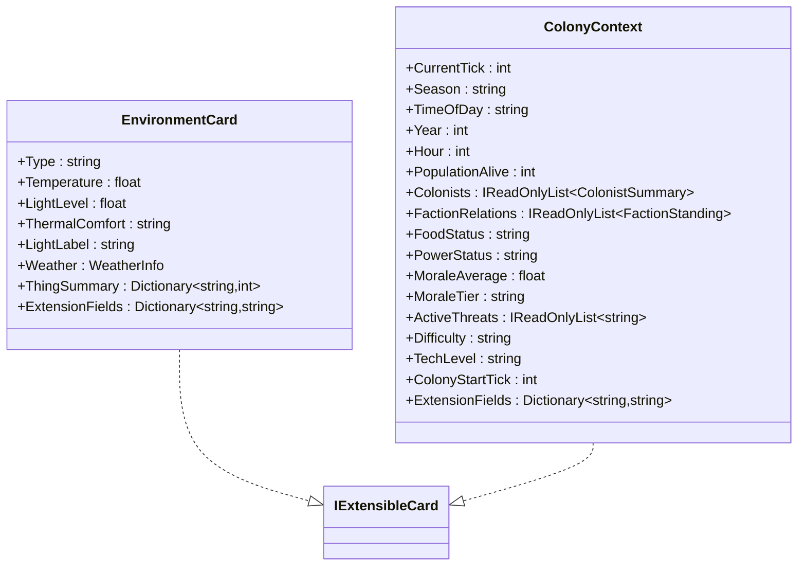
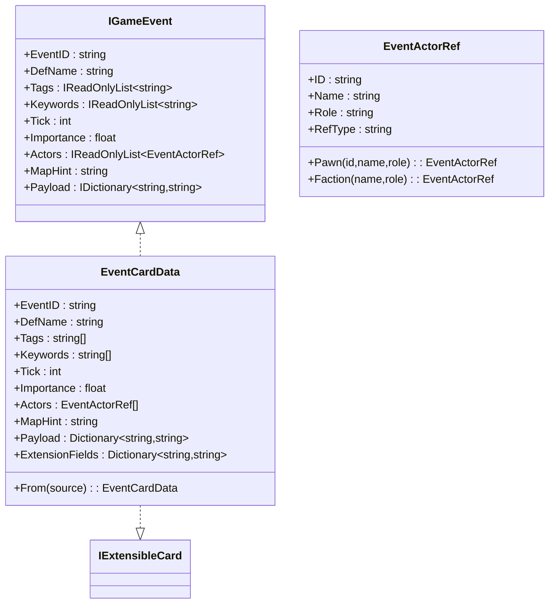
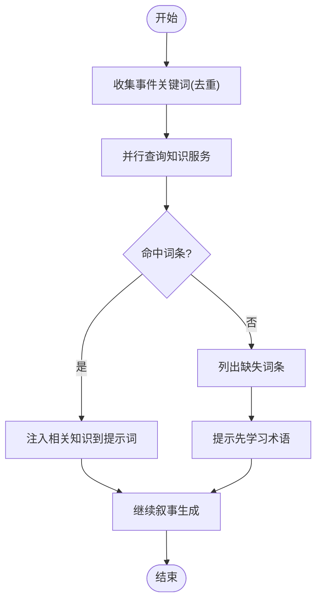
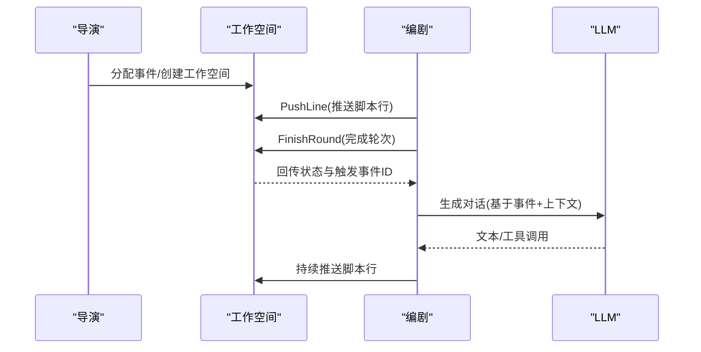
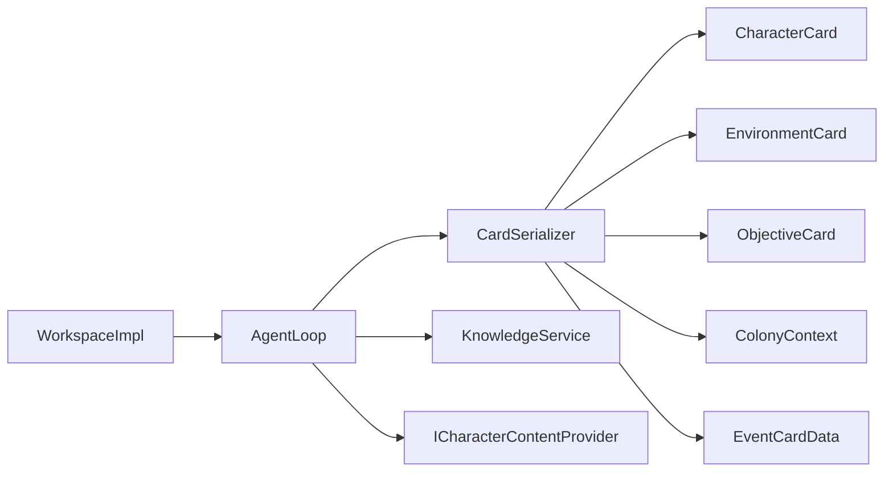

# 角色卡片系统

<cite>
**本文引用的文件**
- [README.md](file://README.md)
- [CardDataStructs.cs](file://src/NPCLife/Cards/CardDataStructs.cs)
- [CharacterCard.cs](file://src/NPCLife/Cards/CharacterCard.cs)
- [ColonyContext.cs](file://src/NPCLife/Cards/ColonyContext.cs)
- [EnvironmentCard.cs](file://src/NPCLife/Cards/EnvironmentCard.cs)
- [EventCard.cs](file://src/NPCLife/Cards/EventCard.cs)
- [IExtensibleCard.cs](file://src/NPCLife/Cards/IExtensibleCard.cs)
- [ObjectiveCard.cs](file://src/NPCLife/Cards/ObjectiveCard.cs)
- [ICharacterContentProvider.cs](file://src/NPCLife/Core/ICharacterContentProvider.cs)
- [KnowledgeEntry.cs](file://src/NPCLife/Core/KnowledgeEntry.cs)
- [KnowledgeService.cs](file://src/NPCLife/Core/KnowledgeService.cs)
- [CardSerializer.cs](file://src/NPCLife/Framework/McP/CardSerializer.cs)
- [AgentLoop.cs](file://src/NPCLife/Agent/AgentLoop.cs)
- [WorkspaceImpl.cs](file://src/NPCLife/Workspace/WorkspaceImpl.cs)
- [EventCardTests.cs](file://tests/NPCLife.Tests/Cards/EventCardTests.cs)
</cite>

## 目录
1. [简介](#简介)
2. [项目结构](#项目结构)
3. [核心组件](#核心组件)
4. [架构总览](#架构总览)
5. [详细组件分析](#详细组件分析)
6. [依赖分析](#依赖分析)
7. [性能考虑](#性能考虑)
8. [故障排查指南](#故障排查指南)
9. [结论](#结论)
10. [附录](#附录)

## 简介
本文件系统化阐述“角色卡片系统”的数据结构设计、在叙事生成中的作用、与事件系统的集成机制，以及在多智能体协作中的应用模式。角色卡片以纯 DTO 形式承载角色身份元数据与可扩展字段，通过内容提供者钩子动态拼装角色的客观属性、动态视角与完整记忆，从而驱动 NPC 的行为决策与对话内容。事件系统提供统一的事件接口与序列化能力，使角色在事件中被引用、参与并受事件影响。多智能体协作通过导演、编剧、临时编剧等角色分工，借助事件池与工作空间实现上下文隔离与异步消息传递。

## 项目结构
角色卡片系统位于 Cards 命名空间，围绕 IExtensibleCard 接口提供可扩展的卡片 DTO；通过 CardSerializer 将卡片序列化为 LLM 可消费的 JSON；结合事件系统与知识服务，支撑 Agent 的叙事生成与多智能体协作。

图表来源
- [CharacterCard.cs:1-71](file://src/NPCLife/Cards/CharacterCard.cs#L1-L71)
- [EnvironmentCard.cs:1-33](file://src/NPCLife/Cards/EnvironmentCard.cs#L1-L33)
- [ObjectiveCard.cs:1-46](file://src/NPCLife/Cards/ObjectiveCard.cs#L1-L46)
- [ColonyContext.cs:1-83](file://src/NPCLife/Cards/ColonyContext.cs#L1-L83)
- [EventCard.cs:1-126](file://src/NPCLife/Cards/EventCard.cs#L1-L126)
- [IExtensibleCard.cs:1-15](file://src/NPCLife/Cards/IExtensibleCard.cs#L1-L15)
- [CardSerializer.cs:1-421](file://src/NPCLife/Framework/McP/CardSerializer.cs#L1-L421)
- [ICharacterContentProvider.cs:1-38](file://src/NPCLife/Core/ICharacterContentProvider.cs#L1-L38)
- [KnowledgeEntry.cs:1-27](file://src/NPCLife/Core/KnowledgeEntry.cs#L1-L27)
- [KnowledgeService.cs:1-66](file://src/NPCLife/Core/KnowledgeService.cs#L1-L66)
- [AgentLoop.cs:1-581](file://src/NPCLife/Agent/AgentLoop.cs#L1-L581)
- [WorkspaceImpl.cs:1-197](file://src/NPCLife/Workspace/WorkspaceImpl.cs#L1-L197)

章节来源
- [README.md:1-93](file://README.md#L1-L93)

## 核心组件
- 角色卡片（CharacterCard）：承载角色身份元数据与扩展字段，配合内容提供者钩子动态生成角色描述。
- 环境卡片（EnvironmentCard）：描述角色所处环境的语义化快照，包含温度、光照、天气与物品摘要。
- 目标卡片（ObjectiveCard）：抽象“当前被追踪的目标”，支持来源、截止时间与子步骤。
- 殖民地上下文（ColonyContext）：世界全局上下文，包含时间、人口、派系关系、资源状态、威胁与难度等。
- 事件卡片（EventCard/IGameEvent）：事件标准接口与可序列化实现，支持标签、关键词、重要度、参与者与负载。
- 可扩展卡片接口（IExtensibleCard）：允许在卡片上挂载自定义字段，序列化时平铺到 JSON 顶层。
- 内容提供者（ICharacterContentProvider）：钩子模式，按视图层级（static/dynamic/full）生成角色各维度自然语言描述。
- 知识服务（KnowledgeService）：聚合可写缓存与只读外部知识源，提供词条精确查询与存储/删除/列举能力。
- 序列化器（CardSerializer）：将各类卡片序列化为 LLM 可消费的 JSON，支持事件、角色、环境、目标与上下文等。
- 多智能体（AgentLoop/WorkspaceImpl）：导演/编剧/临时编剧通过事件池与工作空间协作，实现阈值触发与轮次管理。

章节来源
- [CharacterCard.cs:1-71](file://src/NPCLife/Cards/CharacterCard.cs#L1-L71)
- [EnvironmentCard.cs:1-33](file://src/NPCLife/Cards/EnvironmentCard.cs#L1-L33)
- [ObjectiveCard.cs:1-46](file://src/NPCLife/Cards/ObjectiveCard.cs#L1-L46)
- [ColonyContext.cs:1-83](file://src/NPCLife/Cards/ColonyContext.cs#L1-L83)
- [EventCard.cs:1-126](file://src/NPCLife/Cards/EventCard.cs#L1-L126)
- [IExtensibleCard.cs:1-15](file://src/NPCLife/Cards/IExtensibleCard.cs#L1-L15)
- [ICharacterContentProvider.cs:1-38](file://src/NPCLife/Core/ICharacterContentProvider.cs#L1-L38)
- [KnowledgeEntry.cs:1-27](file://src/NPCLife/Core/KnowledgeEntry.cs#L1-L27)
- [KnowledgeService.cs:1-66](file://src/NPCLife/Core/KnowledgeService.cs#L1-L66)
- [CardSerializer.cs:1-421](file://src/NPCLife/Framework/McP/CardSerializer.cs#L1-L421)
- [AgentLoop.cs:1-581](file://src/NPCLife/Agent/AgentLoop.cs#L1-L581)
- [WorkspaceImpl.cs:1-197](file://src/NPCLife/Workspace/WorkspaceImpl.cs#L1-L197)

## 架构总览
角色卡片系统以“事件驱动 + 卡片序列化 + 内容提供者 + 知识服务”为核心，通过 AgentLoop 的阈值触发与工具调用循环，将事件与角色上下文注入 LLM，再经 MCP 工具执行落地到工作空间与叙事输出。

图表来源
- [AgentLoop.cs:171-337](file://src/NPCLife/Agent/AgentLoop.cs#L171-L337)
- [WorkspaceImpl.cs:83-182](file://src/NPCLife/Workspace/WorkspaceImpl.cs#L83-L182)

## 详细组件分析

### 角色卡片（CharacterCard）与内容提供者（ICharacterContentProvider）
- 数据结构要点
  - 基本元数据：ID、姓名、全名、种族定义、派系标签、性别、角色类型、关系阵营、生死与清醒状态。
  - 扩展字段：Dictionary<string,string>，序列化时平铺到 JSON 顶层。
  - 交互记录与短期/长期记忆详情：用于交互历史与记忆流水的结构化存储。
- 内容提供者钩子
  - 通过 ICharacterContentProvider.GetContent(pawnId, view) 按视图层级（static/dynamic/full）生成各维度描述。
  - CardSerializer.SerializeCharacterCard 调用各 Provider，将 sections 组装为结构化 JSON。
- 使用建议
  - 在 static 层级仅输出客观属性；dynamic 增加视角/记忆快照；full 包含完整记忆流水，适合深度叙事。

图表来源
- [CharacterCard.cs:9-71](file://src/NPCLife/Cards/CharacterCard.cs#L9-L71)
- [IExtensibleCard.cs:9-13](file://src/NPCLife/Cards/IExtensibleCard.cs#L9-L13)
- [ICharacterContentProvider.cs:21-36](file://src/NPCLife/Core/ICharacterContentProvider.cs#L21-L36)
- [CardSerializer.cs:197-238](file://src/NPCLife/Framework/McP/CardSerializer.cs#L197-L238)

章节来源
- [CharacterCard.cs:1-71](file://src/NPCLife/Cards/CharacterCard.cs#L1-L71)
- [ICharacterContentProvider.cs:1-38](file://src/NPCLife/Core/ICharacterContentProvider.cs#L1-L38)
- [CardSerializer.cs:197-238](file://src/NPCLife/Framework/McP/CardSerializer.cs#L197-L238)

### 环境卡片（EnvironmentCard）与殖民地上下文（ColonyContext）
- 环境卡片
  - 描述角色所处环境：室内/半户外/户外、温度、光照、热舒适度、光照标签、天气信息与物品摘要。
  - 与角色卡片配合，提供情境化叙事依据。
- 殖民地上下文
  - 全局时间与季节/昼夜、年份与小时。
  - 人口存活数、角色摘要列表、派系关系、食物与电力状态、平均士气与士气等级、活动威胁、难度、科技等级、会话起始时间。
  - 与事件池的累计重要度共同决定触发阈值。

图表来源
- [EnvironmentCard.cs:9-31](file://src/NPCLife/Cards/EnvironmentCard.cs#L9-L31)
- [ColonyContext.cs:9-81](file://src/NPCLife/Cards/ColonyContext.cs#L9-L81)
- [CardDataStructs.cs:6-37](file://src/NPCLife/Cards/CardDataStructs.cs#L6-L37)
- [IExtensibleCard.cs:9-13](file://src/NPCLife/Cards/IExtensibleCard.cs#L9-L13)

章节来源
- [EnvironmentCard.cs:1-33](file://src/NPCLife/Cards/EnvironmentCard.cs#L1-L33)
- [ColonyContext.cs:1-83](file://src/NPCLife/Cards/ColonyContext.cs#L1-L83)
- [CardDataStructs.cs:1-39](file://src/NPCLife/Cards/CardDataStructs.cs#L1-L39)

### 事件系统（EventCard/IGameEvent）与序列化
- 事件接口
  - 唯一标识、定义名、语义标签、关键词、发生时刻、重要度、参与者（EventActorRef）、地图提示、负载与扩展字段。
  - 参与者支持角色/派系/物品三类引用及角色扮演（发起者/目标/受害者/旁观者）。
- 序列化与反序列化
  - CardSerializer 提供 SerializeEvent/DeserializeEvent，支持 actors 与 payload 的结构化序列化。
  - EventCardData.From 可深拷贝 IGameEvent 为可缓存的可序列化对象。
- 测试覆盖
  - EventCardTests 验证 Actor 工厂方法、标签列表、角色卡默认值与环境卡默认值等。

图表来源
- [EventCard.cs:11-125](file://src/NPCLife/Cards/EventCard.cs#L11-L125)
- [IExtensibleCard.cs:9-13](file://src/NPCLife/Cards/IExtensibleCard.cs#L9-L13)

章节来源
- [EventCard.cs:1-126](file://src/NPCLife/Cards/EventCard.cs#L1-L126)
- [CardSerializer.cs:22-89](file://src/NPCLife/Framework/McP/CardSerializer.cs#L22-L89)
- [EventCardTests.cs:1-180](file://tests/NPCLife.Tests/Cards/EventCardTests.cs#L1-L180)

### 目标卡片（ObjectiveCard）与知识服务（KnowledgeService）
- 目标卡片
  - 唯一标识、标题、描述、状态、来源、截止时间与子步骤列表。
  - 用于导演 Agent 跟踪当前被追踪目标，指导事件路由与工作空间优先级。
- 知识服务
  - Lookup 并行查询内部缓存与外部知识源，返回全部命中结果。
  - Store/Delete/List* 代理到可写缓存，支持按标签与前缀检索。
- 在叙事中的作用
  - AgentLoop 在构建用户消息时收集事件关键词，去重后批量查询知识服务，缺失词条引导 LLM 先行学习术语，再注入相关知识。

图表来源
- [AgentLoop.cs:462-527](file://src/NPCLife/Agent/AgentLoop.cs#L462-L527)
- [KnowledgeService.cs:28-48](file://src/NPCLife/Core/KnowledgeService.cs#L28-L48)

章节来源
- [ObjectiveCard.cs:1-46](file://src/NPCLife/Cards/ObjectiveCard.cs#L1-L46)
- [KnowledgeEntry.cs:1-27](file://src/NPCLife/Core/KnowledgeEntry.cs#L1-L27)
- [KnowledgeService.cs:1-66](file://src/NPCLife/Core/KnowledgeService.cs#L1-L66)
- [AgentLoop.cs:462-527](file://src/NPCLife/Agent/AgentLoop.cs#L462-L527)

### 多智能体协作与工作空间
- 导演（Director）：审查事件池，决定路由策略，将事件分配到合适的工作空间。
- 编剧（Screenwriter）：在工作空间内基于事件与上下文生成具体 NPC 台词与叙事，支持轮次归档与状态留言。
- 临时编剧（Freelancer）：处理一次性或临时性事件。
- 工作空间（WorkspaceImpl）：维护独立事件池、脚本行与角色集合，支持轮次完成、状态变更与事件发布。

图表来源
- [WorkspaceImpl.cs:83-182](file://src/NPCLife/Workspace/WorkspaceImpl.cs#L83-L182)
- [AgentLoop.cs:171-337](file://src/NPCLife/Agent/AgentLoop.cs#L171-L337)

章节来源
- [WorkspaceImpl.cs:1-197](file://src/NPCLife/Workspace/WorkspaceImpl.cs#L1-L197)
- [AgentLoop.cs:1-581](file://src/NPCLife/Agent/AgentLoop.cs#L1-L581)

## 依赖分析
- 组件耦合
  - CardSerializer 依赖 IExtensibleCard 与各卡片 DTO，负责统一序列化。
  - AgentLoop 依赖 IEventLog、ILlmService、ICredentialRegistry、IKnowledgeService 与 ICharacterContentProvider，形成事件-知识-内容-对话闭环。
  - WorkspaceImpl 依赖事件池与脚本交付，承担叙事输出与状态管理。
- 外部依赖
  - JsonWriter/JsonParser：序列化与反序列化基础。
  - MCP 技能注册表：工具调用执行入口。
- 潜在循环依赖
  - 通过接口解耦，未见直接循环依赖。

图表来源
- [CardSerializer.cs:14-421](file://src/NPCLife/Framework/McP/CardSerializer.cs#L14-L421)
- [AgentLoop.cs:43-116](file://src/NPCLife/Agent/AgentLoop.cs#L43-L116)
- [WorkspaceImpl.cs:16-46](file://src/NPCLife/Workspace/WorkspaceImpl.cs#L16-L46)

章节来源
- [CardSerializer.cs:14-421](file://src/NPCLife/Framework/McP/CardSerializer.cs#L14-L421)
- [AgentLoop.cs:43-116](file://src/NPCLife/Agent/AgentLoop.cs#L43-L116)
- [WorkspaceImpl.cs:16-46](file://src/NPCLife/Workspace/WorkspaceImpl.cs#L16-L46)

## 性能考虑
- 事件阈值触发：通过累计重要度与数量阈值降低 LLM 调用频率，控制成本与延迟。
- 并行知识查询：KnowledgeService 并行查询内部缓存与外部源，减少等待时间。
- 序列化优化：CardSerializer 使用流式写入与预估容量，避免重复分配。
- 工具调用限制：AgentLoop 设置最大轮次上限，防止死循环与长尾延迟。
- 内容提供者分层：按视图层级生成内容，避免 full 视图在高频场景下的高开销。

## 故障排查指南
- 事件序列化异常
  - 检查 EventCardData 反序列化字段映射与默认值填充。
  - 参考测试用例验证 Actor 工厂方法与标签列表行为。
- 角色卡片序列化为空
  - 确认 ExtensionFields 是否为空；确认 ICharacterContentProvider 返回内容非空。
- 知识查询无命中
  - 检查关键词去重与大小写敏感设置；确认外部知识源可用。
- 工作空间状态不更新
  - 确认 PushLine/FinishRound 的调用角色与工作空间状态；检查事件总线发布与订阅。

章节来源
- [EventCardTests.cs:17-177](file://tests/NPCLife.Tests/Cards/EventCardTests.cs#L17-L177)
- [CardSerializer.cs:70-89](file://src/NPCLife/Framework/McP/CardSerializer.cs#L70-L89)
- [AgentLoop.cs:462-527](file://src/NPCLife/Agent/AgentLoop.cs#L462-L527)
- [WorkspaceImpl.cs:83-182](file://src/NPCLife/Workspace/WorkspaceImpl.cs#L83-L182)

## 结论
角色卡片系统通过纯 DTO 的卡片结构、可扩展字段与内容提供者钩子，将角色的客观属性、动态视角与完整记忆有机整合，为叙事生成提供高质量上下文。事件系统与知识服务的集成，使角色在事件中被引用、参与并受事件影响，同时通过阈值触发与工具调用循环实现高效可控的多智能体协作。该设计既满足动态叙事需求，又具备良好的扩展性与性能表现。

## 附录
- 创建角色卡片
  - 初始化 CharacterCard 基本元数据，按需填充 ExtensionFields。
  - 通过 ICharacterContentProvider.GetContent 生成 sections 内容。
- 更新角色卡片
  - 通过交互记录与记忆详情更新短期/长期记忆，必要时重建序列化 JSON。
- 查询角色卡片
  - 使用 CardSerializer.SerializeCharacterCard 输出 JSON；按 view 层级选择 static/dynamic/full。
- 角色参与事件
  - 在 EventActorRef 中以 Pawn/Faction/Thing 形式引用角色，标注角色扮演（发起者/目标/受害者/旁观者）。
- 角色状态变化
  - 通过事件池累计重要度与时间戳，结合 ColonyContext 的全局状态，驱动角色行为与对话内容的动态调整。