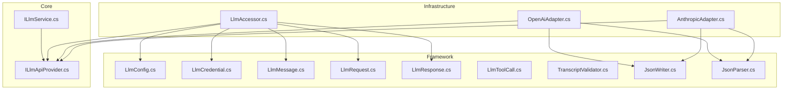
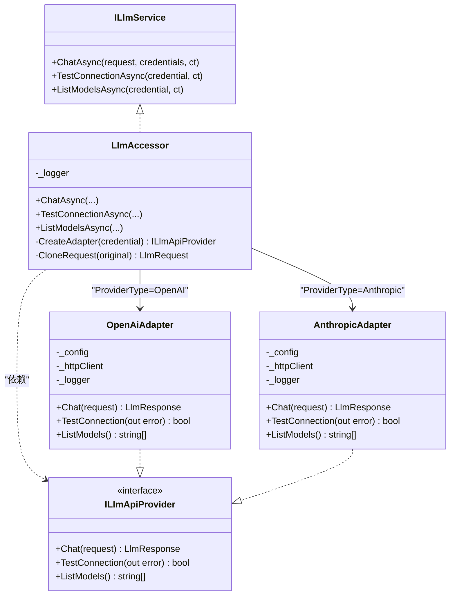
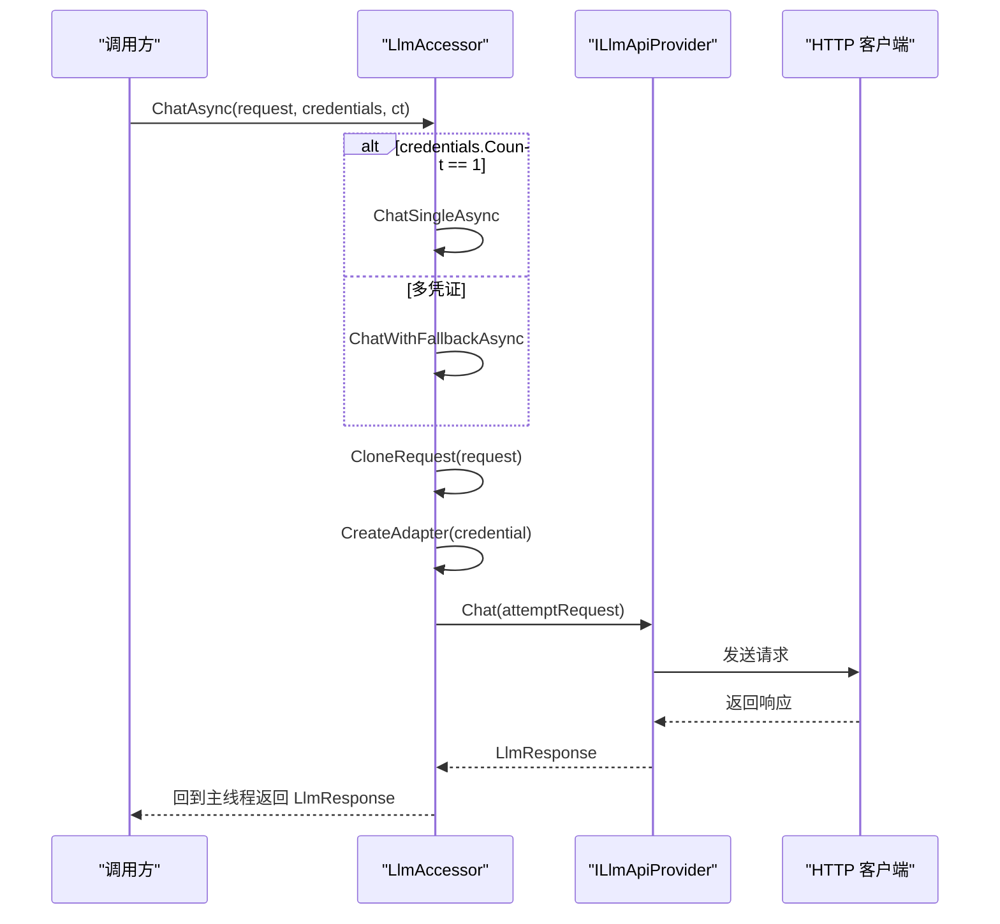
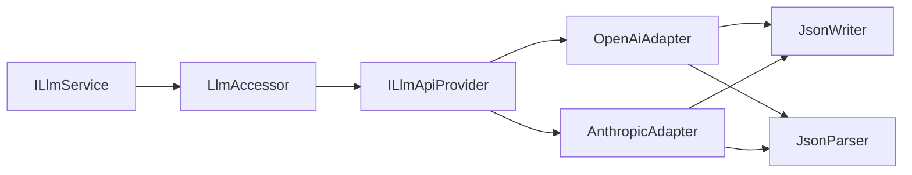

# LLM适配器

<cite>
**本文档引用的文件**
- [LlmConfig.cs](file://src/NPCLife/Framework/Llm/LlmConfig.cs)
- [LlmCredential.cs](file://src/NPCLife/Framework/Llm/LlmCredential.cs)
- [LlmMessage.cs](file://src/NPCLife/Framework/Llm/LlmMessage.cs)
- [LlmRequest.cs](file://src/NPCLife/Framework/Llm/LlmRequest.cs)
- [LlmResponse.cs](file://src/NPCLife/Framework/Llm/LlmResponse.cs)
- [LlmToolCall.cs](file://src/NPCLife/Framework/Llm/LlmToolCall.cs)
- [TranscriptValidator.cs](file://src/NPCLife/Framework/Llm/TranscriptValidator.cs)
- [ILlmApiProvider.cs](file://src/NPCLife/Core/ILlmApiProvider.cs)
- [ILlmService.cs](file://src/NPCLife/Core/ILlmService.cs)
- [LlmAccessor.cs](file://src/NPCLife/Infrastructure/Llm/LlmAccessor.cs)
- [AnthropicAdapter.cs](file://src/NPCLife/Infrastructure/Llm/AnthropicAdapter.cs)
- [OpenAiAdapter.cs](file://src/NPCLife/Infrastructure/Llm/OpenAiAdapter.cs)
- [JsonWriter.cs](file://src/NPCLife/Framework/JsonWriter.cs)
- [JsonParser.cs](file://src/NPCLife/Framework/JsonParser.cs)
</cite>

## 目录
1. [简介](#简介)
2. [项目结构](#项目结构)
3. [核心组件](#核心组件)
4. [架构总览](#架构总览)
5. [组件详解](#组件详解)
6. [依赖关系分析](#依赖关系分析)
7. [性能考量](#性能考量)
8. [故障排查指南](#故障排查指南)
9. [结论](#结论)
10. [附录](#附录)

## 简介
本文件系统性阐述 NPCLife 项目中的 LLM 适配器体系，重点覆盖以下方面：
- LlmAccessor 统一访问接口与适配器模式实现
- AnthropicAdapter 与 OpenAiAdapter 的具体差异与 API 适配策略
- LLM 服务抽象接口设计与多提供商支持机制
- 适配器的错误处理、重试策略与超时管理
- LLM 适配器的配置指南与性能调优建议
- 自定义 LLM 适配器的开发流程与集成测试方法

## 项目结构
LLM 适配器相关代码主要分布在以下模块：
- Framework 层：定义统一的数据模型与工具（LlmConfig、LlmCredential、LlmMessage、LlmRequest、LlmResponse、LlmToolCall、TranscriptValidator、JsonWriter、JsonParser）
- Core 层：定义对外服务接口（ILlmService）与内部 API 提供者接口（ILlmApiProvider）
- Infrastructure 层：实现具体适配器（OpenAiAdapter、AnthropicAdapter）与统一访问器（LlmAccessor）

图表来源
- [LlmAccessor.cs:1-331](file://src/NPCLife/Infrastructure/Llm/LlmAccessor.cs#L1-L331)
- [OpenAiAdapter.cs:1-392](file://src/NPCLife/Infrastructure/Llm/OpenAiAdapter.cs#L1-L392)
- [AnthropicAdapter.cs:1-434](file://src/NPCLife/Infrastructure/Llm/AnthropicAdapter.cs#L1-L434)
- [ILlmService.cs:1-51](file://src/NPCLife/Core/ILlmService.cs#L1-L51)
- [ILlmApiProvider.cs:1-37](file://src/NPCLife/Core/ILlmApiProvider.cs#L1-L37)
- [LlmConfig.cs:1-69](file://src/NPCLife/Framework/Llm/LlmConfig.cs#L1-L69)
- [LlmCredential.cs:1-84](file://src/NPCLife/Framework/Llm/LlmCredential.cs#L1-L84)
- [LlmMessage.cs:1-63](file://src/NPCLife/Framework/Llm/LlmMessage.cs#L1-L63)
- [LlmRequest.cs:1-46](file://src/NPCLife/Framework/Llm/LlmRequest.cs#L1-L46)
- [LlmResponse.cs:1-58](file://src/NPCLife/Framework/Llm/LlmResponse.cs#L1-L58)
- [LlmToolCall.cs:1-19](file://src/NPCLife/Framework/Llm/LlmToolCall.cs#L1-L19)
- [TranscriptValidator.cs:1-105](file://src/NPCLife/Framework/Llm/TranscriptValidator.cs#L1-L105)
- [JsonWriter.cs:1-136](file://src/NPCLife/Framework/JsonWriter.cs#L1-L136)
- [JsonParser.cs:1-268](file://src/NPCLife/Framework/JsonParser.cs#L1-L268)

章节来源
- [LlmAccessor.cs:1-331](file://src/NPCLife/Infrastructure/Llm/LlmAccessor.cs#L1-L331)
- [ILlmService.cs:1-51](file://src/NPCLife/Core/ILlmService.cs#L1-L51)
- [ILlmApiProvider.cs:1-37](file://src/NPCLife/Core/ILlmApiProvider.cs#L1-L37)

## 核心组件
- 统一数据模型
  - LlmConfig：全局配置，包含 BaseUrl、ApiKey、ModelName、ProviderType、ExtraHeaders、TimeoutSeconds，并提供 IsValid 与 CreateDefault
  - LlmCredential：调用级凭证，包含与 LlmConfig 类似的字段，但强调“无状态数据传递”，提供 HasApiAccess、IsChatReady、Clone、ToString
  - LlmMessage：统一消息结构，支持 system、user、assistant、tool 角色，以及 ToolCalls 与 ToolCallId
  - LlmRequest：统一请求结构，包含 Model、Messages、ToolsJson、Temperature，并提供 IsValid 与 SinglePrompt 快捷构造
  - LlmResponse：统一响应结构，包含 Content、ToolCalls、FinishReason、Usage*、Model、Error、IsSuccess、HasToolCalls、FromError
  - LlmToolCall：工具调用结构，包含 Id、Name、Arguments
  - TranscriptValidator：对话历史结构验证器，确保 system 位置、assistant 不连续、tool_calls 与 tool 结果一一对应、不以未完成的 tool 结尾等
- 抽象接口
  - ILlmService：对外统一异步契约，支持多凭证 fallback、连通性测试、模型列表查询
  - ILlmApiProvider：内部 API 提供者统一接口，定义 Chat、TestConnection、ListModels
- 适配器
  - OpenAiAdapter：适配 OpenAI 及兼容 API（如 Ollama、vLLM、中转代理），支持 /v1/models 与 /v1/chat/completions
  - AnthropicAdapter：适配 Anthropic Messages API，支持 /v1/messages，系统提示位于顶层、content 为数组、tool_use 嵌入 content
- 工具
  - JsonWriter：轻量 JSON 写入器，减少内存分配
  - JsonParser：轻量 JSON 解析工具，支持对象/数组/字符串数组解析与反序列化

章节来源
- [LlmConfig.cs:1-69](file://src/NPCLife/Framework/Llm/LlmConfig.cs#L1-L69)
- [LlmCredential.cs:1-84](file://src/NPCLife/Framework/Llm/LlmCredential.cs#L1-L84)
- [LlmMessage.cs:1-63](file://src/NPCLife/Framework/Llm/LlmMessage.cs#L1-L63)
- [LlmRequest.cs:1-46](file://src/NPCLife/Framework/Llm/LlmRequest.cs#L1-L46)
- [LlmResponse.cs:1-58](file://src/NPCLife/Framework/Llm/LlmResponse.cs#L1-L58)
- [LlmToolCall.cs:1-19](file://src/NPCLife/Framework/Llm/LlmToolCall.cs#L1-L19)
- [TranscriptValidator.cs:1-105](file://src/NPCLife/Framework/Llm/TranscriptValidator.cs#L1-L105)
- [ILlmService.cs:1-51](file://src/NPCLife/Core/ILlmService.cs#L1-L51)
- [ILlmApiProvider.cs:1-37](file://src/NPCLife/Core/ILlmApiProvider.cs#L1-L37)
- [OpenAiAdapter.cs:1-392](file://src/NPCLife/Infrastructure/Llm/OpenAiAdapter.cs#L1-L392)
- [AnthropicAdapter.cs:1-434](file://src/NPCLife/Infrastructure/Llm/AnthropicAdapter.cs#L1-L434)
- [JsonWriter.cs:1-136](file://src/NPCLife/Framework/JsonWriter.cs#L1-L136)
- [JsonParser.cs:1-268](file://src/NPCLife/Framework/JsonParser.cs#L1-L268)

## 架构总览
下图展示 LlmAccessor 如何根据 ProviderType 选择适配器，并将统一的 LlmRequest 转换为各提供商的 API 请求，再将响应转换为统一的 LlmResponse。

图表来源
- [LlmAccessor.cs:1-331](file://src/NPCLife/Infrastructure/Llm/LlmAccessor.cs#L1-L331)
- [ILlmService.cs:1-51](file://src/NPCLife/Core/ILlmService.cs#L1-L51)
- [ILlmApiProvider.cs:1-37](file://src/NPCLife/Core/ILlmApiProvider.cs#L1-L37)
- [OpenAiAdapter.cs:1-392](file://src/NPCLife/Infrastructure/Llm/OpenAiAdapter.cs#L1-L392)
- [AnthropicAdapter.cs:1-434](file://src/NPCLife/Infrastructure/Llm/AnthropicAdapter.cs#L1-L434)

## 组件详解

### LlmAccessor：统一访问器与适配器模式
- 设计要点
  - 无状态：不持有配置、凭证或适配器，每次调用按传入的 LlmCredential 创建临时适配器
  - 适配器模式：根据 LlmCredential.ProviderType 分派到 OpenAiAdapter 或 AnthropicAdapter
  - 多凭证 fallback：ChatAsync 支持按顺序尝试多个凭证，首个成功即返回，全部失败返回最后一个错误
  - 线程模型：在后台线程执行 HTTP 调用，完成后通过 MainThreadDispatcher 回到主线程
- 关键流程
  - ChatAsync：单凭证路径直接调用；多凭证路径逐个尝试并记录日志
  - TestConnectionAsync：校验凭证可用性
  - ListModelsAsync：查询可用模型列表
- 错误处理
  - 参数校验失败时抛出异常
  - 适配器内部捕获 HttpRequestException、TaskCanceledException 等并转换为 LlmResponse.Error
  - fallback 场景记录警告日志，最终返回 LlmResponse.FromError

图表来源
- [LlmAccessor.cs:42-191](file://src/NPCLife/Infrastructure/Llm/LlmAccessor.cs#L42-L191)
- [OpenAiAdapter.cs:35-74](file://src/NPCLife/Infrastructure/Llm/OpenAiAdapter.cs#L35-L74)
- [AnthropicAdapter.cs:43-68](file://src/NPCLife/Infrastructure/Llm/AnthropicAdapter.cs#L43-L68)

章节来源
- [LlmAccessor.cs:1-331](file://src/NPCLife/Infrastructure/Llm/LlmAccessor.cs#L1-L331)

### OpenAiAdapter：OpenAI 及兼容 API 适配
- 关键差异
  - 请求：/v1/chat/completions；消息数组 messages；tool_calls 与 function 调用
  - 响应：choices[0].message.content；usage 包含 total_tokens、prompt_tokens、completion_tokens；prompt_tokens_details.cached_tokens 映射到 UsageCacheReadTokens
  - 连通性测试：优先 /v1/models；失败则发送最小聊天请求
  - 模型列表：/v1/models
- 请求构建
  - BuildChatRequest：写入 model、messages、temperature、tools（原始 JSON）
  - BuildMessage：role、content、tool_call_id、tool_calls（function）
- 响应解析
  - ParseChatResponse：解析 choices[0].message、finish_reason、usage、model
  - ParseToolCalls：解析 tool_calls.function.name/arguments
- 错误处理
  - HttpRequestException → LlmResponse.FromError
  - TaskCanceledException → "Request timed out"
  - 非 2xx 状态码读取响应体并抛出异常，便于上层统一处理

章节来源
- [OpenAiAdapter.cs:1-392](file://src/NPCLife/Infrastructure/Llm/OpenAiAdapter.cs#L1-L392)
- [JsonWriter.cs:1-136](file://src/NPCLife/Framework/JsonWriter.cs#L1-L136)
- [JsonParser.cs:1-268](file://src/NPCLife/Framework/JsonParser.cs#L1-L268)

### AnthropicAdapter：Anthropic Messages API 适配
- 关键差异
  - 请求：/v1/messages；system 提示位于顶层 system 字段；messages 中排除 system
  - content 为数组，包含 text 与 tool_use 块；tool_result 以特殊 user content 块表达
  - 响应：stop_reason 映射到 FinishReason；content 数组解析 text 与 tool_use
  - 连通性测试：由于 /v1/models 不可用，直接发送最小请求
  - 模型列表：不支持，返回空数组
- 请求构建
  - ExtractSystemPrompt：提取第一条 system 内容作为顶层 system
  - FilterNonSystemMessages：过滤 system 消息
  - BuildMessage：根据 role 生成 content 数组；tool 角色使用 tool_result 块；assistant 的 tool_calls 转为 tool_use 块
  - ConvertToolsToAnthropic：将 OpenAI function tools 转为 Anthropic tools（name/description/input_schema）
- 响应解析
  - ParseChatResponse：解析 stop_reason、content 数组（text/tool_use）、usage（input_tokens/output_tokens/cache_read_input_tokens）、model
  - MapStopReason：end_turn→stop、tool_use→tool_calls、max_tokens→length
- 错误处理
  - error 嵌套对象中的 message 作为错误信息
  - HttpRequestException → LlmResponse.FromError
  - TaskCanceledException → "Request timed out"

章节来源
- [AnthropicAdapter.cs:1-434](file://src/NPCLife/Infrastructure/Llm/AnthropicAdapter.cs#L1-L434)
- [JsonWriter.cs:1-136](file://src/NPCLife/Framework/JsonWriter.cs#L1-L136)
- [JsonParser.cs:1-268](file://src/NPCLife/Framework/JsonParser.cs#L1-L268)

### 数据模型与工具
- LlmMessage/LlmRequest/LlmResponse：统一消息、请求与响应结构，屏蔽提供商差异
- LlmToolCall：封装工具调用标识与参数
- TranscriptValidator：在对话轮次前进行结构校验，确保 system 位置、assistant 不连续、tool_calls 与 tool 结果一一对应等
- JsonWriter/JsonParser：高性能 JSON 编解码工具，减少 GC 压力

章节来源
- [LlmMessage.cs:1-63](file://src/NPCLife/Framework/Llm/LlmMessage.cs#L1-L63)
- [LlmRequest.cs:1-46](file://src/NPCLife/Framework/Llm/LlmRequest.cs#L1-L46)
- [LlmResponse.cs:1-58](file://src/NPCLife/Framework/Llm/LlmResponse.cs#L1-L58)
- [LlmToolCall.cs:1-19](file://src/NPCLife/Framework/Llm/LlmToolCall.cs#L1-L19)
- [TranscriptValidator.cs:1-105](file://src/NPCLife/Framework/Llm/TranscriptValidator.cs#L1-L105)
- [JsonWriter.cs:1-136](file://src/NPCLife/Framework/JsonWriter.cs#L1-L136)
- [JsonParser.cs:1-268](file://src/NPCLife/Framework/JsonParser.cs#L1-L268)

## 依赖关系分析
- LlmAccessor 依赖 ILlmApiProvider 并在运行时根据 ProviderType 创建具体适配器实例
- 两个适配器均依赖 Framework 层的 JsonWriter/JsonParser 进行 JSON 构建与解析
- ILlmService 为对外契约，LlmAccessor 实现该接口并向外暴露统一能力

图表来源
- [LlmAccessor.cs:290-303](file://src/NPCLife/Infrastructure/Llm/LlmAccessor.cs#L290-L303)
- [ILlmService.cs:1-51](file://src/NPCLife/Core/ILlmService.cs#L1-L51)
- [ILlmApiProvider.cs:1-37](file://src/NPCLife/Core/ILlmApiProvider.cs#L1-L37)
- [OpenAiAdapter.cs:1-392](file://src/NPCLife/Infrastructure/Llm/OpenAiAdapter.cs#L1-L392)
- [AnthropicAdapter.cs:1-434](file://src/NPCLife/Infrastructure/Llm/AnthropicAdapter.cs#L1-L434)
- [JsonWriter.cs:1-136](file://src/NPCLife/Framework/JsonWriter.cs#L1-L136)
- [JsonParser.cs:1-268](file://src/NPCLife/Framework/JsonParser.cs#L1-L268)

章节来源
- [LlmAccessor.cs:290-303](file://src/NPCLife/Infrastructure/Llm/LlmAccessor.cs#L290-L303)
- [ILlmService.cs:1-51](file://src/NPCLife/Core/ILlmService.cs#L1-L51)
- [ILlmApiProvider.cs:1-37](file://src/NPCLife/Core/ILlmApiProvider.cs#L1-L37)

## 性能考量
- JSON 编解码优化
  - 使用 JsonWriter/JsonParser 减少中间对象与字符串拼接开销，降低 GC 压力
- HTTP 客户端生命周期
  - 适配器在每次调用创建新的 HttpClient，避免连接池复用导致的并发问题；若需长期运行，可在上层复用 LlmAccessor 并通过配置调整超时
- 超时与重试
  - 通过 LlmCredential.TimeoutSeconds 控制超时；LlmAccessor 的 ChatWithFallbackAsync 提供多凭证 fallback，提升可用性
- 日志与调试
  - OpenAiAdapter 在调试模式下输出请求/响应摘要，便于定位问题

章节来源
- [OpenAiAdapter.cs:149-177](file://src/NPCLife/Infrastructure/Llm/OpenAiAdapter.cs#L149-L177)
- [AnthropicAdapter.cs:106-133](file://src/NPCLife/Infrastructure/Llm/AnthropicAdapter.cs#L106-L133)
- [LlmAccessor.cs:114-191](file://src/NPCLife/Infrastructure/Llm/LlmAccessor.cs#L114-L191)

## 故障排查指南
- 常见错误来源
  - 请求无效：LlmRequest.IsValid 校验失败（Model 为空或 Messages 为空）
  - 凭证不完整：LlmCredential.IsChatReady/HasApiAccess 校验失败
  - HTTP 错误：HttpRequestException，适配器转换为 LlmResponse.Error
  - 超时：TaskCanceledException，适配器转换为 "Request timed out"
  - 响应解析失败：JsonParser 解析异常，返回 "Parse error"
- 排查步骤
  - 使用 ILlmService.TestConnectionAsync 验证连通性
  - 使用 ILlmService.ListModelsAsync 获取可用模型列表（OpenAI 适用）
  - 检查 LlmCredential.BaseUrl、ApiKey、ModelName、ExtraHeaders、TimeoutSeconds
  - 查看 LlmAccessor 的 fallback 警告日志，确认失败原因
- 适配器特定
  - Anthropic：/v1/models 不可用，需直接发送最小请求测试
  - OpenAI：优先 /v1/models，失败再走最小聊天请求

章节来源
- [LlmRequest.cs:24-31](file://src/NPCLife/Framework/Llm/LlmRequest.cs#L24-L31)
- [LlmCredential.cs:36-49](file://src/NPCLife/Framework/Llm/LlmCredential.cs#L36-L49)
- [OpenAiAdapter.cs:62-73](file://src/NPCLife/Infrastructure/Llm/OpenAiAdapter.cs#L62-L73)
- [AnthropicAdapter.cs:56-67](file://src/NPCLife/Infrastructure/Llm/AnthropicAdapter.cs#L56-L67)
- [LlmAccessor.cs:174-187](file://src/NPCLife/Infrastructure/Llm/LlmAccessor.cs#L174-L187)

## 结论
本适配器体系通过统一的数据模型与抽象接口，实现了对 OpenAI 与 Anthropic 的无缝支持。LlmAccessor 采用适配器模式与多凭证 fallback 机制，既保证了易用性，又提升了鲁棒性。通过合理的错误处理、超时控制与性能优化，能够在复杂环境中稳定运行。对于新增提供商，只需实现 ILlmApiProvider 并在 LlmAccessor.CreateAdapter 中注册即可。

## 附录

### 配置指南
- LlmCredential 字段
  - BaseUrl：API 基础地址（末尾斜杠会被清理）
  - ApiKey：API 密钥
  - ModelName：模型名称
  - ProviderType：提供商类型（OpenAI/Anthropic）
  - ExtraHeaders：扩展 HTTP 头（如代理场景）
  - TimeoutSeconds：请求超时（秒）
- LlmConfig 字段
  - BaseUrl、ApiKey、ModelName、ProviderType、ExtraHeaders、TimeoutSeconds
  - IsValid：校验 BaseUrl、ApiKey、ModelName 是否非空
  - CreateDefault：创建默认 OpenAI 配置

章节来源
- [LlmCredential.cs:14-30](file://src/NPCLife/Framework/Llm/LlmCredential.cs#L14-L30)
- [LlmConfig.cs:25-41](file://src/NPCLife/Framework/Llm/LlmConfig.cs#L25-L41)

### 自定义 LLM 适配器开发流程
- 步骤
  - 实现 ILlmApiProvider 接口：Chat、TestConnection、ListModels
  - 在 LlmAccessor.CreateAdapter 中添加 ProviderType 分支，返回新适配器实例
  - 使用 JsonWriter/JsonParser 构建请求与解析响应
  - 处理 HTTP 错误与超时，统一转换为 LlmResponse
  - 提供最小请求测试与模型列表查询（如 API 支持）
- 集成测试方法
  - 使用 ILlmService.TestConnectionAsync 验证连通性
  - 使用 ILlmService.ListModelsAsync 获取模型列表
  - 构造 LlmRequest（含 LlmMessage）并通过 ChatAsync 验证往返
  - 使用 TranscriptValidator 验证消息历史结构

章节来源
- [ILlmApiProvider.cs:12-35](file://src/NPCLife/Core/ILlmApiProvider.cs#L12-L35)
- [LlmAccessor.cs:290-303](file://src/NPCLife/Infrastructure/Llm/LlmAccessor.cs#L290-L303)
- [ILlmService.cs:17-49](file://src/NPCLife/Core/ILlmService.cs#L17-L49)
- [TranscriptValidator.cs:37-102](file://src/NPCLife/Framework/Llm/TranscriptValidator.cs#L37-L102)