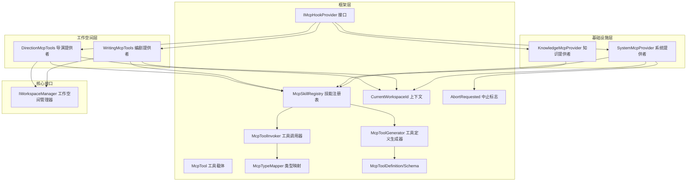
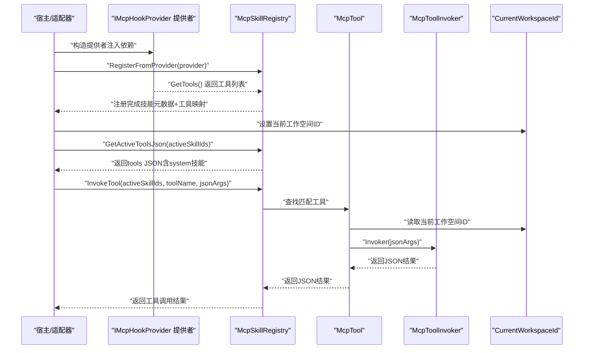
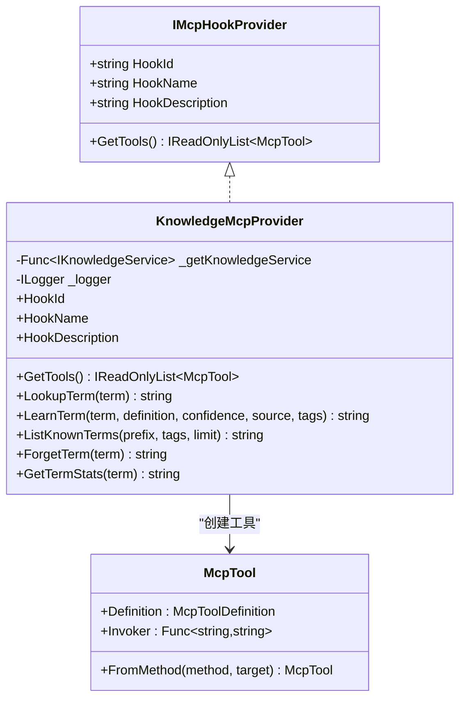
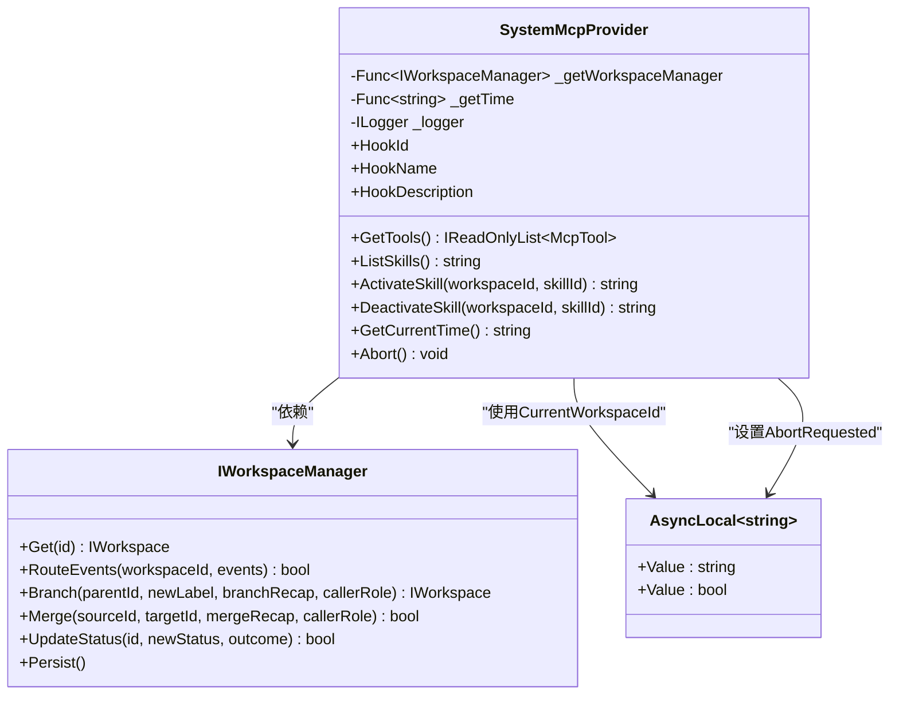
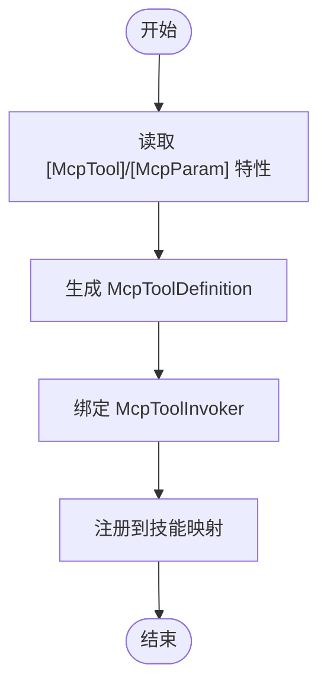
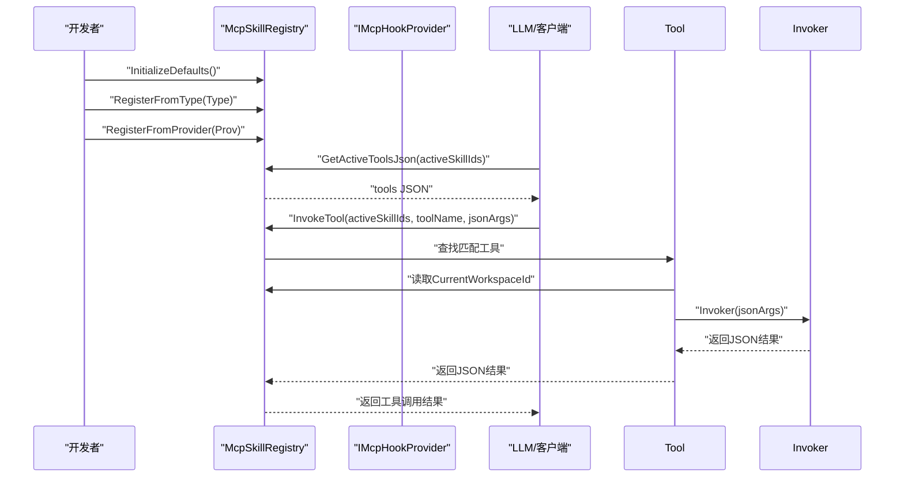
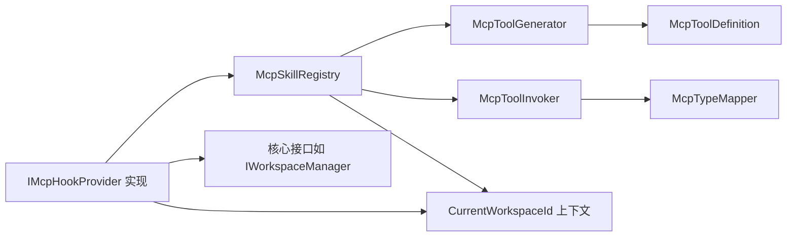

# MCP提供者

<cite>
**本文引用的文件**
- [KnowledgeMcpProvider.cs](file://src/NPCLife/Infrastructure/Mcp/KnowledgeMcpProvider.cs)
- [SystemMcpProvider.cs](file://src/NPCLife/Infrastructure/Mcp/SystemMcpProvider.cs)
- [IMcpHookProvider.cs](file://src/NPCLife/Framework/Mcp/IMcpHookProvider.cs)
- [McpTool.cs](file://src/NPCLife/Framework/Mcp/McpTool.cs)
- [McpToolGenerator.cs](file://src/NPCLife/Framework/Mcp/McpToolGenerator.cs)
- [McpToolDefinition.cs](file://src/NPCLife/Framework/Mcp/McpToolDefinition.cs)
- [McpToolInvoker.cs](file://src/NPCLife/Framework/Mcp/McpToolInvoker.cs)
- [McpSkillRegistry.cs](file://src/NPCLife/Framework/Mcp/McpSkillRegistry.cs)
- [McpParamAttribute.cs](file://src/NPCLife/Framework/Mcp/McpParamAttribute.cs)
- [McpToolAttribute.cs](file://src/NPCLife/Framework/Mcp/McpToolAttribute.cs)
- [McpTypeMapper.cs](file://src/NPCLife/Framework/Mcp/McpTypeMapper.cs)
- [WritingMcpTools.cs](file://src/NPCLife/Workspace/WritingMcpTools.cs)
- [DirectionMcpTools.cs](file://src/NPCLife/Workspace/DirectionMcpTools.cs)
- [IWorkspaceManager.cs](file://src/NPCLife/Core/IWorkspaceManager.cs)
- [LifecycleManager.cs](file://src/NPCLife/Framework/LifecycleManager.cs)
- [McpSkillRegistryTests.cs](file://tests/NPCLife.Tests/Framework/McpSkillRegistryTests.cs)
</cite>

## 更新摘要
**所做更改**
- 更新了系统MCP提供者部分，反映新增Abort工具的实现
- 更新了工作空间MCP工具部分，反映GetWorkspace工具已被移除
- 更新了架构总览和工具调用流程，反映所有工具现在自动使用CurrentWorkspaceId
- 更新了依赖关系分析，反映CurrentWorkspaceId上下文管理的变化

## 目录
1. [简介](#简介)
2. [项目结构](#项目结构)
3. [核心组件](#核心组件)
4. [架构总览](#架构总览)
5. [详细组件分析](#详细组件分析)
6. [依赖关系分析](#依赖关系分析)
7. [性能考量](#性能考量)
8. [故障排查指南](#故障排查指南)
9. [结论](#结论)
10. [附录](#附录)

## 简介
本文件面向MCP（Model Context Protocol）提供者，系统性阐述知识与系统两类MCP提供者的实现差异、接口设计与扩展机制，以及工具注册、发现与调用的完整流程。文档还解释了MCP提供者与核心框架的集成方式、生命周期管理，并给出自定义MCP提供者的开发指南与最佳实践，最后提供协议实现细节与性能优化建议。

**重要更新**：本次重构移除了所有GetWorkspace工具，SystemMcpProvider新增了Abort工具，所有工具现在自动使用CurrentWorkspaceId上下文进行工作空间识别。

## 项目结构
MCP相关代码主要分布在以下模块：
- Framework/Mcp：MCP协议基础设施（工具定义、调用器、注册表、特性与类型映射）
- Infrastructure/Mcp：内置提供者（知识库与系统元工具）
- Workspace：工作空间相关提供者（编剧与导演工具）
- Core：工作空间管理器接口
- Framework：生命周期管理器

**图表来源**
- [IMcpHookProvider.cs:1-38](file://src/NPCLife/Framework/Mcp/IMcpHookProvider.cs#L1-L38)
- [McpTool.cs:1-40](file://src/NPCLife/Framework/Mcp/McpTool.cs#L1-L40)
- [McpToolGenerator.cs:1-214](file://src/NPCLife/Framework/Mcp/McpToolGenerator.cs#L1-L214)
- [McpToolInvoker.cs:1-238](file://src/NPCLife/Framework/Mcp/McpToolInvoker.cs#L1-L238)
- [McpSkillRegistry.cs:43-57](file://src/NPCLife/Framework/Mcp/McpSkillRegistry.cs#L43-L57)
- [KnowledgeMcpProvider.cs:1-324](file://src/NPCLife/Infrastructure/Mcp/KnowledgeMcpProvider.cs#L1-L324)
- [SystemMcpProvider.cs:1-156](file://src/NPCLife/Infrastructure/Mcp/SystemMcpProvider.cs#L1-L156)
- [WritingMcpTools.cs:1-200](file://src/NPCLife/Workspace/WritingMcpTools.cs#L1-L200)
- [DirectionMcpTools.cs:100-121](file://src/NPCLife/Workspace/DirectionMcpTools.cs#L100-L121)
- [IWorkspaceManager.cs:1-35](file://src/NPCLife/Core/IWorkspaceManager.cs#L1-L35)

**章节来源**
- [IMcpHookProvider.cs:1-38](file://src/NPCLife/Framework/Mcp/IMcpHookProvider.cs#L1-L38)
- [McpSkillRegistry.cs:1-200](file://src/NPCLife/Framework/Mcp/McpSkillRegistry.cs#L1-L200)

## 核心组件
- IMcpHookProvider：MCP提供者接口，定义HookId/HookName/HookDescription与GetTools方法，每个提供者对应一个Skill。
- McpTool：统一的工具载体，包含Definition（工具定义）与Invoker（调用委托）。
- McpToolGenerator：基于反射生成工具定义（含参数Schema），并序列化为标准JSON。
- McpToolInvoker：将JSON参数反序列化、反射调用目标方法、序列化返回值。
- McpSkillRegistry：技能注册表，负责技能元数据、工具注册、激活工具查询、工具调用与事件发布。
- McpTypeMapper：C#类型到JSON Schema类型的映射。
- McpToolDefinition/McpInputSchema/McpParamSchema：工具定义的数据结构。
- 提供者实现：KnowledgeMcpProvider（知识库）、SystemMcpProvider（系统元工具）、WritingMcpTools/DirectorMcpTools（工作空间）。

**章节来源**
- [McpTool.cs:1-40](file://src/NPCLife/Framework/Mcp/McpTool.cs#L1-L40)
- [McpToolGenerator.cs:1-214](file://src/NPCLife/Framework/Mcp/McpToolGenerator.cs#L1-L214)
- [McpToolInvoker.cs:1-238](file://src/NPCLife/Framework/Mcp/McpToolInvoker.cs#L1-L238)
- [McpSkillRegistry.cs:1-200](file://src/NPCLife/Framework/Mcp/McpSkillRegistry.cs#L1-L200)
- [McpTypeMapper.cs:1-85](file://src/NPCLife/Framework/Mcp/McpTypeMapper.cs#L1-L85)
- [McpToolDefinition.cs:1-50](file://src/NPCLife/Framework/Mcp/McpToolDefinition.cs#L1-L50)
- [IMcpHookProvider.cs:1-38](file://src/NPCLife/Framework/Mcp/IMcpHookProvider.cs#L1-L38)

## 架构总览
MCP提供者通过IMcpHookProvider注入依赖，向McpSkillRegistry注册工具。激活的技能集合决定哪些工具对LLM可见；调用时由McpSkillRegistry在激活技能范围内查找工具并委派给McpToolInvoker执行。所有工具现在通过AsyncLocal上下文自动获取当前工作空间ID，无需显式传递参数。

**图表来源**
- [IMcpHookProvider.cs:14-21](file://src/NPCLife/Framework/Mcp/IMcpHookProvider.cs#L14-L21)
- [McpSkillRegistry.cs:154-175](file://src/NPCLife/Framework/Mcp/McpSkillRegistry.cs#L154-L175)
- [McpSkillRegistry.cs:249-287](file://src/NPCLife/Framework/Mcp/McpSkillRegistry.cs#L249-L287)
- [McpSkillRegistry.cs:361-437](file://src/NPCLife/Framework/Mcp/McpSkillRegistry.cs#L361-L437)
- [McpToolInvoker.cs:24-72](file://src/NPCLife/Framework/Mcp/McpToolInvoker.cs#L24-L72)
- [McpSkillRegistry.cs:43-48](file://src/NPCLife/Framework/Mcp/McpSkillRegistry.cs#L43-L48)

## 详细组件分析

### 知识MCP提供者（KnowledgeMcpProvider）
- 职责：封装IKnowledgeService，提供词条查询、学习、列举、删除、统计等工具。
- 工具清单：
  - lookup_term：并行查询内部与外部知识源，返回命中列表（含来源标注）
  - learn_term：主动学习词条并覆盖存储，回读确认后返回命中
  - list_known_terms：支持前缀/标签过滤与限制数量
  - forget_term：删除词条（不存在时静默）
  - get_term_stats：返回词条元数据（信心度、来源、标签）
- 错误处理：捕获异常并记录日志，返回标准化错误JSON
- 输出格式：单命中返回扁平JSON，多命中返回数组；统计与摘要采用不同字段集

**图表来源**
- [IMcpHookProvider.cs:23-36](file://src/NPCLife/Framework/Mcp/IMcpHookProvider.cs#L23-L36)
- [KnowledgeMcpProvider.cs:15-40](file://src/NPCLife/Infrastructure/Mcp/KnowledgeMcpProvider.cs#L15-L40)
- [McpTool.cs:14-38](file://src/NPCLife/Framework/Mcp/McpTool.cs#L14-L38)

**章节来源**
- [KnowledgeMcpProvider.cs:15-324](file://src/NPCLife/Infrastructure/Mcp/KnowledgeMcpProvider.cs#L15-L324)

### 系统MCP提供者（SystemMcpProvider）
- 职责：系统元工具集，提供技能列表查询、激活/反激活、当前时间获取，以及对话中止功能。
- 工具清单：
  - list_skills：列出指定工作空间的技能分组及激活状态（system隐式可用）
  - activate_skill：激活技能（可叠加）
  - deactivate_skill：反激活技能（system不可反激活）
  - get_current_time：获取格式化时间字符串
  - abort：中止当前对话（设置AbortRequested标志）
- 依赖注入：IWorkspaceManager、时间提供器、ILogger
- 错误处理：捕获异常并返回标准化错误JSON
- **新增功能**：Abort工具用于在出现错误或违反安全/道德准则时中止对话

**图表来源**
- [SystemMcpProvider.cs:15-156](file://src/NPCLife/Infrastructure/Mcp/SystemMcpProvider.cs#L15-L156)
- [IWorkspaceManager.cs:14-35](file://src/NPCLife/Core/IWorkspaceManager.cs#L14-L35)
- [McpSkillRegistry.cs:43-57](file://src/NPCLife/Framework/Mcp/McpSkillRegistry.cs#L43-L57)

**章节来源**
- [SystemMcpProvider.cs:15-156](file://src/NPCLife/Infrastructure/Mcp/SystemMcpProvider.cs#L15-L156)

### 工作空间MCP提供者（编剧与导演工具）
- 编剧提供者（WritingMcpProvider）：提供工作空间全量视图、逐句台词推送、结束本轮并归档、事件路由（可附加关键词）。
- 导演提供者（DirectionMcpProvider）：提供工作空间管理功能，包括工作空间查询、挂起/恢复、关闭、分支/合并、事件路由等。
- **重要变更**：移除了所有GetWorkspace工具，现在通过工作空间上下文自动识别当前工作空间
- 两者均通过IMcpHookProvider注入IWorkspaceManager与ILogger，零静态耦合

**章节来源**
- [WritingMcpTools.cs:16-200](file://src/NPCLife/Workspace/WritingMcpTools.cs#L16-L200)
- [DirectionMcpTools.cs:100-121](file://src/NPCLife/Workspace/DirectionMcpTools.cs#L100-L121)

### 接口设计与扩展机制
- IMcpHookProvider：提供者契约，统一HookId/HookName/HookDescription与GetTools。
- 特性驱动：
  - [McpTool]：标记方法为工具，可覆盖名称与描述
  - [McpParam]：覆盖参数名、描述与必填状态（Auto/True/False）
- 工具注册：
  - 从类型扫描：RegisterFromType(Type)
  - 从提供者注册：RegisterFromProvider(IMcpHookProvider)
  - 手工注册：RegisterTool(skillId, McpTool)

**图表来源**
- [McpToolGenerator.cs:19-78](file://src/NPCLife/Framework/Mcp/McpToolGenerator.cs#L19-L78)
- [McpTool.cs:28-37](file://src/NPCLife/Framework/Mcp/McpTool.cs#L28-L37)
- [McpSkillRegistry.cs:154-175](file://src/NPCLife/Framework/Mcp/McpSkillRegistry.cs#L154-L175)

**章节来源**
- [IMcpHookProvider.cs:14-36](file://src/NPCLife/Framework/Mcp/IMcpHookProvider.cs#L14-L36)
- [McpToolAttribute.cs:1-18](file://src/NPCLife/Framework/Mcp/McpToolAttribute.cs#L1-L18)
- [McpParamAttribute.cs:1-34](file://src/NPCLife/Framework/Mcp/McpParamAttribute.cs#L1-L34)
- [McpSkillRegistry.cs:124-175](file://src/NPCLife/Framework/Mcp/McpSkillRegistry.cs#L124-L175)

### 工具注册、发现与调用流程
- 注册阶段
  - 初始化技能元数据：InitializeDefaults()
  - 从类型扫描注册：RegisterFromType(Type)
  - 从提供者注册：RegisterFromProvider(IMcpHookProvider)
- 发现阶段
  - 获取技能列表：GetSkillListJson(activeSkillIds)
  - 获取激活工具定义：GetActiveToolsJson(activeSkillIds)
- 调用阶段
  - InvokeTool(activeSkillIds, toolName, jsonArgs)
  - 内部搜索顺序：业务技能 → system技能（回退）
  - **新增**：所有工具自动从CurrentWorkspaceId读取工作空间上下文

**图表来源**
- [McpSkillRegistry.cs:52-76](file://src/NPCLife/Framework/Mcp/McpSkillRegistry.cs#L52-L76)
- [McpSkillRegistry.cs:124-175](file://src/NPCLife/Framework/Mcp/McpSkillRegistry.cs#L124-L175)
- [McpSkillRegistry.cs:249-287](file://src/NPCLife/Framework/Mcp/McpSkillRegistry.cs#L249-L287)
- [McpSkillRegistry.cs:361-437](file://src/NPCLife/Framework/Mcp/McpSkillRegistry.cs#L361-L437)
- [McpSkillRegistry.cs:43-48](file://src/NPCLife/Framework/Mcp/McpSkillRegistry.cs#L43-L48)

**章节来源**
- [McpSkillRegistry.cs:52-437](file://src/NPCLife/Framework/Mcp/McpSkillRegistry.cs#L52-L437)

### 与核心框架的集成与生命周期管理
- 集成点
  - 提供者通过构造函数注入IWorkspaceManager、ILogger等依赖
  - 通过McpSkillRegistry.RegisterFromProvider完成注册
  - 工具调用经由McpSkillRegistry.InvokeTool进行
  - **新增**：AgentLoop在工具调用前后设置和清理CurrentWorkspaceId上下文
- 生命周期
  - LifecycleManager负责组件注册、初始化、配置就绪、销毁与重置
  - 提供者作为组件可被LifecycleManager统一管理

**章节来源**
- [SystemMcpProvider.cs:21-26](file://src/NPCLife/Infrastructure/Mcp/SystemMcpProvider.cs#L21-L26)
- [WritingMcpTools.cs:21-25](file://src/NPCLife/Workspace/WritingMcpTools.cs#L21-L25)
- [DirectionMcpTools.cs:100-121](file://src/NPCLife/Workspace/DirectionMcpTools.cs#L100-L121)
- [LifecycleManager.cs:159-240](file://src/NPCLife/Framework/LifecycleManager.cs#L159-L240)

## 依赖关系分析
- 耦合与内聚
  - 提供者与核心服务通过接口注入，低耦合高内聚
  - McpSkillRegistry集中管理技能与工具映射，避免分散注册
  - **新增**：CurrentWorkspaceId作为AsyncLocal上下文提供工作空间透明访问
- 外部依赖
  - 依赖JsonHelper/JsonWriter进行JSON序列化
  - 依赖反射与特性进行工具定义生成
- 潜在循环依赖
  - 提供者不直接依赖注册表，注册表也不依赖提供者，无循环

**图表来源**
- [McpSkillRegistry.cs:154-175](file://src/NPCLife/Framework/Mcp/McpSkillRegistry.cs#L154-L175)
- [McpToolGenerator.cs:19-78](file://src/NPCLife/Framework/Mcp/McpToolGenerator.cs#L19-L78)
- [McpToolInvoker.cs:24-72](file://src/NPCLife/Framework/Mcp/McpToolInvoker.cs#L24-L72)
- [McpTypeMapper.cs:16-43](file://src/NPCLife/Framework/Mcp/McpTypeMapper.cs#L16-L43)
- [McpSkillRegistry.cs:43-48](file://src/NPCLife/Framework/Mcp/McpSkillRegistry.cs#L43-L48)

**章节来源**
- [McpSkillRegistry.cs:154-437](file://src/NPCLife/Framework/Mcp/McpSkillRegistry.cs#L154-L437)

## 性能考量
- 反射与序列化
  - 工具定义生成与调用均为纯静态方法，避免实例化开销
  - 使用StringBuilder与预分配容量减少GC压力
- 参数解析与类型转换
  - 严格类型映射与宽松布尔解析，降低异常开销
  - 数组/集合转换采用批量解析，避免逐项装箱
- 工具调用
  - 激活工具集合由调用方提供，减少遍历范围
  - system技能工具始终可用，减少遗漏查找
  - **新增**：AsyncLocal上下文访问比参数传递更高效

**章节来源**
- [McpToolInvoker.cs:87-132](file://src/NPCLife/Framework/Mcp/McpToolInvoker.cs#L87-L132)
- [McpToolInvoker.cs:159-171](file://src/NPCLife/Framework/Mcp/McpToolInvoker.cs#L159-L171)
- [McpToolGenerator.cs:172-211](file://src/NPCLife/Framework/Mcp/McpToolGenerator.cs#L172-L211)

## 故障排查指南
- 常见问题
  - 工具未出现在tools列表：检查是否正确注册（RegisterFromType/RegisterFromProvider）
  - 工具调用返回错误：确认激活技能集合是否包含目标工具
  - 参数类型不匹配：检查[McpParam]必填与类型映射
  - **新增**：工具调用失败但没有工作空间上下文：检查AgentLoop是否正确设置了CurrentWorkspaceId
- 日志与错误
  - 提供者内部捕获异常并记录警告
  - 注册表在工具调用失败时发布事件并返回标准化错误JSON
  - **新增**：Abort工具调用后对话中止：检查AbortRequested标志状态
- 单元测试参考
  - McpSkillRegistryTests覆盖初始化、注册、查询与调用路径

**章节来源**
- [KnowledgeMcpProvider.cs:70-75](file://src/NPCLife/Infrastructure/Mcp/KnowledgeMcpProvider.cs#L70-L75)
- [SystemMcpProvider.cs:63-67](file://src/NPCLife/Infrastructure/Mcp/SystemMcpProvider.cs#L63-L67)
- [McpSkillRegistry.cs:367-383](file://src/NPCLife/Framework/Mcp/McpSkillRegistry.cs#L367-L383)
- [McpSkillRegistryTests.cs:102-244](file://tests/NPCLife.Tests/Framework/McpSkillRegistryTests.cs#L102-L244)

## 结论
MCP提供者体系以IMcpHookProvider为核心契约，结合McpSkillRegistry实现技能与工具的集中管理，配合McpToolGenerator与McpToolInvoker完成从方法签名到工具定义与调用的完整闭环。知识与系统提供者分别覆盖知识检索与系统元能力，工作空间提供者支撑编剧与导演的叙事流程。通过特性驱动与接口注入，系统具备良好的扩展性与低耦合性。**本次重构进一步提升了系统的易用性和安全性，通过自动工作空间上下文管理和对话中止机制，简化了工具调用并增强了错误处理能力。**

## 附录

### 自定义MCP提供者开发指南与最佳实践
- 设计步骤
  - 实现IMcpHookProvider，定义HookId/HookName/HookDescription与GetTools
  - 使用[McpTool]/[McpParam]标注工具方法与参数，明确名称、描述与必填
  - 通过构造函数注入所需依赖（如IWorkspaceManager、ILogger）
  - 在合适时机调用McpSkillRegistry.RegisterFromProvider注册
  - **新增**：利用CurrentWorkspaceId自动获取工作空间上下文，无需显式参数
- 最佳实践
  - 工具方法保持幂等与无副作用
  - 参数尽量使用强类型，必要时提供默认值
  - 对异常进行捕获并返回标准化JSON
  - 使用system技能承载跨域元工具，业务工具使用独立技能
  - 通过LifecycleManager注册组件，确保生命周期一致
  - **新增**：合理使用Abort工具处理不可继续的对话场景

**章节来源**
- [IMcpHookProvider.cs:14-36](file://src/NPCLife/Framework/Mcp/IMcpHookProvider.cs#L14-L36)
- [McpToolAttribute.cs:1-18](file://src/NPCLife/Framework/Mcp/McpToolAttribute.cs#L1-L18)
- [McpParamAttribute.cs:1-34](file://src/NPCLife/Framework/Mcp/McpParamAttribute.cs#L1-L34)
- [McpSkillRegistry.cs:154-175](file://src/NPCLife/Framework/Mcp/McpSkillRegistry.cs#L154-L175)
- [LifecycleManager.cs:77-97](file://src/NPCLife/Framework/LifecycleManager.cs#L77-L97)