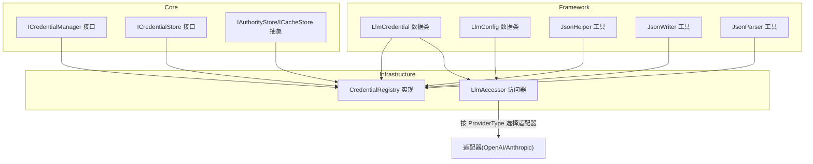
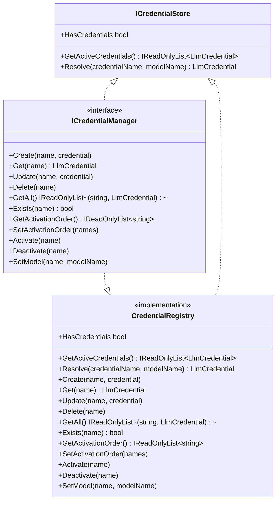
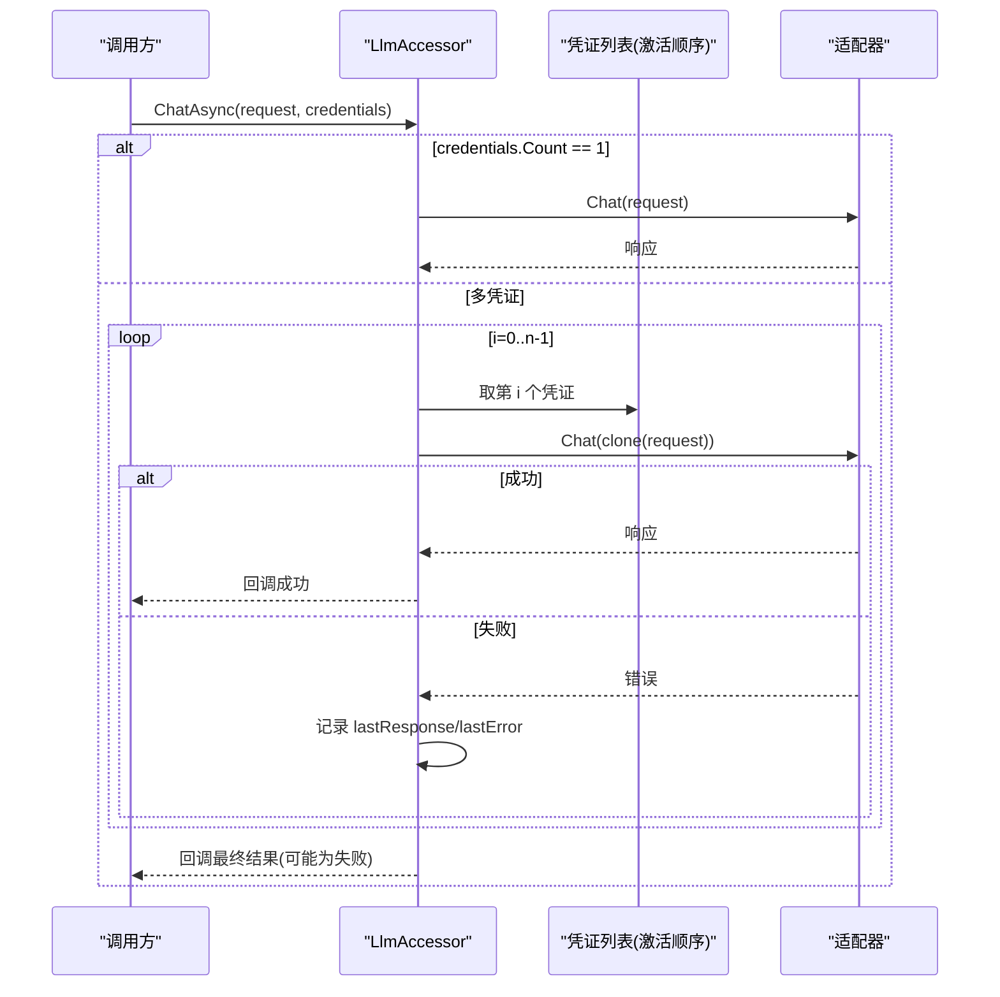
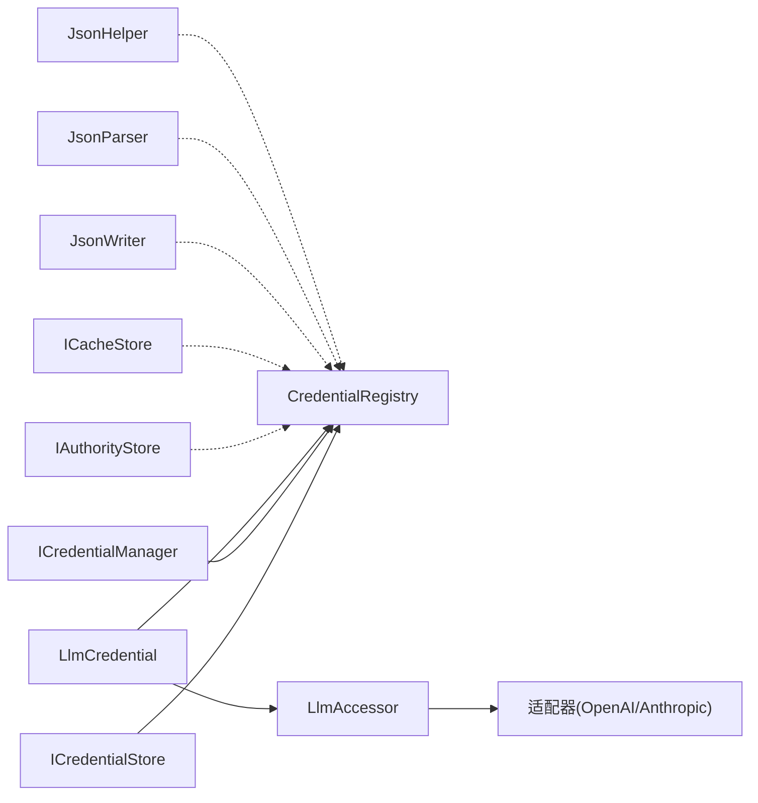

# 凭证管理

<cite>
**本文引用的文件**
- [CredentialRegistry.cs](file://src/NPCLife/Infrastructure/Llm/CredentialRegistry.cs)
- [ICredentialManager.cs](file://src/NPCLife/Core/ICredentialManager.cs)
- [ICredentialStore.cs](file://src/NPCLife/Core/ICredentialStore.cs)
- [LlmCredential.cs](file://src/NPCLife/Framework/Llm/LlmCredential.cs)
- [LlmConfig.cs](file://src/NPCLife/Framework/Llm/LlmConfig.cs)
- [LlmAccessor.cs](file://src/NPCLife/Infrastructure/Llm/LlmAccessor.cs)
- [JsonHelper.cs](file://src/NPCLife/Framework/JsonHelper.cs)
- [JsonWriter.cs](file://src/NPCLife/Framework/JsonWriter.cs)
- [JsonParser.cs](file://src/NPCLife/Framework/JsonParser.cs)
- [IStorage.cs](file://src/NPCLife/Core/IStorage.cs)
</cite>

## 更新摘要
**变更内容**
- 新增ICredentialManager和ICredentialStore接口架构
- CredentialRegistry完全重构为实现新的接口架构
- 增强凭证管理功能，包括激活顺序管理和模型特定凭证设置
- 新增Resolve方法支持按凭证名和模型名解析凭证
- 改进序列化和持久化机制

## 目录
1. [简介](#简介)
2. [项目结构](#项目结构)
3. [核心组件](#核心组件)
4. [架构总览](#架构总览)
5. [详细组件分析](#详细组件分析)
6. [依赖关系分析](#依赖关系分析)
7. [性能考量](#性能考量)
8. [故障排查指南](#故障排查指南)
9. [结论](#结论)
10. [附录：API 参考与最佳实践](#附录api-参考与最佳实践)

## 简介
本文件系统性阐述凭证管理子系统的设计与实现，重点围绕重构后的CredentialRegistry类展开，涵盖以下主题：
- 凭证管理接口架构：ICredentialManager和ICredentialStore的分层设计
- 凭证别名管理：以"凭证名"形式组织与检索API凭证
- 激活顺序与回退链路：通过"激活顺序"实现多凭证自动回退
- 模型特定凭证设置：支持按凭证名设置模型名称
- 序列化与持久化：JSON格式与存储策略，以及持久化失败的容错
- 凭证解析功能：Resolve方法支持按凭证名和模型名解析
- 安全与最佳实践：凭证书写、可见性控制与错误处理建议
- API参考与使用示例：面向使用者的完整接口说明与操作指引

## 项目结构
凭证管理相关代码主要分布在以下模块：
- Core层：定义凭证管理接口（ICredentialManager、ICredentialStore）与通用配置类型
- Framework层：提供凭证数据结构、JSON工具与配置类型
- Infrastructure层：实现凭证注册表与访问器，负责持久化与适配器调度



**图表来源**
- [ICredentialManager.cs:11-82](file://src/NPCLife/Core/ICredentialManager.cs#L11-L82)
- [ICredentialStore.cs:11-32](file://src/NPCLife/Core/ICredentialStore.cs#L11-L32)
- [CredentialRegistry.cs:19-329](file://src/NPCLife/Infrastructure/Llm/CredentialRegistry.cs#L19-L329)
- [LlmCredential.cs:12-84](file://src/NPCLife/Framework/Llm/LlmCredential.cs#L12-L84)
- [LlmConfig.cs:23-69](file://src/NPCLife/Framework/Llm/LlmConfig.cs#L23-L69)
- [LlmAccessor.cs:26-331](file://src/NPCLife/Infrastructure/Llm/LlmAccessor.cs#L26-L331)
- [JsonHelper.cs:8-54](file://src/NPCLife/Framework/JsonHelper.cs#L8-L54)
- [JsonWriter.cs:11-136](file://src/NPCLife/Framework/JsonWriter.cs#L11-L136)
- [JsonParser.cs:13-268](file://src/NPCLife/Framework/JsonParser.cs#L13-L268)
- [IStorage.cs:10-53](file://src/NPCLife/Core/IStorage.cs#L10-L53)

**章节来源**
- [ICredentialManager.cs:11-82](file://src/NPCLife/Core/ICredentialManager.cs#L11-L82)
- [ICredentialStore.cs:11-32](file://src/NPCLife/Core/ICredentialStore.cs#L11-L32)
- [CredentialRegistry.cs:19-329](file://src/NPCLife/Infrastructure/Llm/CredentialRegistry.cs#L19-L329)
- [LlmCredential.cs:12-84](file://src/NPCLife/Framework/Llm/LlmCredential.cs#L12-L84)
- [LlmConfig.cs:23-69](file://src/NPCLife/Framework/Llm/LlmConfig.cs#L23-L69)
- [LlmAccessor.cs:26-331](file://src/NPCLife/Infrastructure/Llm/LlmAccessor.cs#L26-L331)
- [JsonHelper.cs:8-54](file://src/NPCLife/Framework/JsonHelper.cs#L8-L54)
- [JsonWriter.cs:11-136](file://src/NPCLife/Framework/JsonWriter.cs#L11-L136)
- [JsonParser.cs:13-268](file://src/NPCLife/Framework/JsonParser.cs#L13-L268)
- [IStorage.cs:10-53](file://src/NPCLife/Core/IStorage.cs#L10-L53)

## 核心组件
- 凭证管理接口（ICredentialManager）
  - 职责边界清晰：继承ICredentialStore，提供UI使用的完整CRUD操作和激活顺序管理
  - 关键方法族：凭证CRUD操作、激活顺序管理、模型设置、凭证解析
- 凭证存储接口（ICredentialStore）
  - 运行时专用：提供获取活跃凭证列表、检查凭证可用性、解析凭证等功能
  - 关键方法：GetActiveCredentials、HasCredentials、Resolve
- 凭证数据类（LlmCredential）
  - 七元组字段：baseUrl、apiKey、modelName、providerType、ExtraHeaders、TimeoutSeconds
  - 校验方法：HasApiAccess（API访问级）、IsChatReady（聊天级）
  - 克隆语义：Clone返回浅拷贝副本，避免并发与调用方副作用
- 访问器（LlmAccessor）
  - 无状态设计：每次调用基于传入凭证创建临时适配器，用后即弃
  - 多凭证回退：ChatAsync支持按顺序尝试，失败自动切换，全部失败返回最后错误
  - 异步回调：后台线程执行，通过MainThreadDispatcher回到UI线程回调

**章节来源**
- [ICredentialManager.cs:11-82](file://src/NPCLife/Core/ICredentialManager.cs#L11-L82)
- [ICredentialStore.cs:11-32](file://src/NPCLife/Core/ICredentialStore.cs#L11-L32)
- [LlmCredential.cs:12-84](file://src/NPCLife/Framework/Llm/LlmCredential.cs#L12-L84)
- [LlmAccessor.cs:26-331](file://src/NPCLife/Infrastructure/Llm/LlmAccessor.cs#L26-L331)

## 架构总览
CredentialRegistry作为凭证管理器实现，通过构造函数注入持久化委托，实现"内存状态 ↔ JSON字符串 ↔ 存储后端"的解耦。运行时Agent通过ICredentialStore接口获取凭证，UI通过ICredentialManager接口管理配置。LlmAccessor在调用层按激活顺序进行多凭证回退，确保高可用。

```mermaid
sequenceDiagram
participant UI as "UI/配置界面"
participant Manager as "ICredentialManager"
participant Registry as "CredentialRegistry"
participan Store as "存储后端(IStorage)"
participant Accessor as "LlmAccessor"
participant Service as "ILlmService(适配器)"
UI->>Manager : Create/Update/Delete/SetModel(...)
Manager->>Registry : 内部状态变更(加锁)
Registry->>Registry : SerializeState()
Registry->>Store : 持久化(JSON)
Note over Registry,Store : 持久化失败不影响运行时
Accessor->>Registry : GetActiveCredentials()
Registry-->>Accessor : 凭证列表(按激活顺序过滤)
loop 逐个凭证尝试
Accessor->>Service : ChatAsync(带模型名)
alt 成功
Service-->>Accessor : 响应
Accessor-->>UI : 回调结果
else 失败
Service-->>Accessor : 错误
Accessor->>Accessor : 继续下一个凭证
end
end
```

**图表来源**
- [CredentialRegistry.cs:39-51](file://src/NPCLife/Infrastructure/Llm/CredentialRegistry.cs#L39-L51)
- [CredentialRegistry.cs:57-82](file://src/NPCLife/Infrastructure/Llm/CredentialRegistry.cs#L57-L82)
- [CredentialRegistry.cs:171-208](file://src/NPCLife/Infrastructure/Llm/CredentialRegistry.cs#L171-L208)
- [LlmAccessor.cs:47-71](file://src/NPCLife/Infrastructure/Llm/LlmAccessor.cs#L47-L71)
- [LlmAccessor.cs:114-191](file://src/NPCLife/Infrastructure/Llm/LlmAccessor.cs#L114-L191)

## 详细组件分析

### 凭证管理接口架构
- ICredentialStore（运行时接口）
  - 职责：为Agent提供只读的凭证访问接口
  - 方法：GetActiveCredentials、HasCredentials、Resolve
- ICredentialManager（UI接口）
  - 职责：为UI提供完整的凭证管理功能
  - 继承：完全继承ICredentialStore的所有功能
  - 扩展：添加CRUD操作、激活顺序管理、模型设置



**图表来源**
- [ICredentialStore.cs:11-32](file://src/NPCLife/Core/ICredentialStore.cs#L11-L32)
- [ICredentialManager.cs:11-82](file://src/NPCLife/Core/ICredentialManager.cs#L11-L82)
- [CredentialRegistry.cs:19-329](file://src/NPCLife/Infrastructure/Llm/CredentialRegistry.cs#L19-L329)

**章节来源**
- [ICredentialStore.cs:11-32](file://src/NPCLife/Core/ICredentialStore.cs#L11-L32)
- [ICredentialManager.cs:11-82](file://src/NPCLife/Core/ICredentialManager.cs#L11-L82)
- [CredentialRegistry.cs:19-329](file://src/NPCLife/Infrastructure/Llm/CredentialRegistry.cs#L19-L329)

### 凭证注册表（CredentialRegistry）实现
- 内部状态
  - _lock：细粒度互斥，保障多线程安全
  - _credentials：字典，键为凭证名（大小写不敏感），值为LlmCredential副本
  - _activationOrder：激活顺序列表，仅保留存在的凭证名，顺序即优先级
- 运行时接口实现（ICredentialStore）
  - GetActiveCredentials：按激活顺序筛选并克隆有效凭证，形成回退链路
  - HasCredentials：检查是否有任一凭证具备API访问能力
  - Resolve：按凭证名和模型名解析凭证，支持模型覆盖
- UI接口实现（ICredentialManager）
  - CRUD操作：Create、Get、Update、Delete、GetAll、Exists
  - 激活顺序管理：GetActivationOrder、SetActivationOrder、Activate、Deactivate
  - 模型设置：SetModel按凭证名设置模型名称
- 序列化与持久化
  - SerializeState：将_credentials与_activationOrder写入JSON，字段包含baseUrl、apiKey、modelName、providerType、timeoutSeconds
  - DeserializeState：解析JSON，恢复凭证列表与激活顺序，忽略不存在的凭证名
  - Persist：序列化后调用注入的持久化动作，捕获异常以免影响运行时

**章节来源**
- [CredentialRegistry.cs:23-51](file://src/NPCLife/Infrastructure/Llm/CredentialRegistry.cs#L23-L51)
- [CredentialRegistry.cs:57-91](file://src/NPCLife/Infrastructure/Llm/CredentialRegistry.cs#L57-L91)
- [CredentialRegistry.cs:97-165](file://src/NPCLife/Infrastructure/Llm/CredentialRegistry.cs#L97-L165)
- [CredentialRegistry.cs:171-208](file://src/NPCLife/Infrastructure/Llm/CredentialRegistry.cs#L171-L208)
- [CredentialRegistry.cs:214-228](file://src/NPCLife/Infrastructure/Llm/CredentialRegistry.cs#L214-L228)
- [CredentialRegistry.cs:234-275](file://src/NPCLife/Infrastructure/Llm/CredentialRegistry.cs#L234-L275)
- [CredentialRegistry.cs:277-326](file://src/NPCLife/Infrastructure/Llm/CredentialRegistry.cs#L277-L326)

### 多凭证回退链路（LlmAccessor）
- 单凭证路径：直接创建适配器并调用Chat
- 多凭证路径：按顺序尝试，每次使用独立请求副本，失败记录错误并继续下一个，成功立即返回，全部失败返回最后响应
- 适配器选择：依据LlmCredential.ProviderType分派OpenAI或Anthropic适配器
- 线程模型：后台线程执行，完成后通过MainThreadDispatcher回到UI线程回调



**图表来源**
- [LlmAccessor.cs:47-71](file://src/NPCLife/Infrastructure/Llm/LlmAccessor.cs#L47-L71)
- [LlmAccessor.cs:114-191](file://src/NPCLife/Infrastructure/Llm/LlmAccessor.cs#L114-L191)
- [LlmAccessor.cs:290-303](file://src/NPCLife/Infrastructure/Llm/LlmAccessor.cs#L290-L303)

**章节来源**
- [LlmAccessor.cs:47-191](file://src/NPCLife/Infrastructure/Llm/LlmAccessor.cs#L47-L191)
- [LlmAccessor.cs:290-303](file://src/NPCLife/Infrastructure/Llm/LlmAccessor.cs#L290-L303)

## 依赖关系分析
- 接口与实现
  - ICredentialStore定义运行时访问契约，ICredentialManager扩展UI管理功能
  - CredentialRegistry实现两个接口，提供完整的凭证管理能力
  - LlmAccessor依赖LlmCredential与ProviderType进行适配器分派
- 数据与工具
  - LlmCredential作为纯数据载体，被注册表与访问器广泛使用
  - JsonWriter和JsonParser提供高性能的JSON序列化与解析
  - JsonHelper提供字符串转义与引用工具
- 存储抽象
  - IAuthorityStore和ICacheStore提供权威与缓存两类存储抽象
  - CredentialRegistry通过注入的持久化委托对接任意存储后端



**图表来源**
- [ICredentialStore.cs:11-32](file://src/NPCLife/Core/ICredentialStore.cs#L11-L32)
- [ICredentialManager.cs:11-82](file://src/NPCLife/Core/ICredentialManager.cs#L11-L82)
- [CredentialRegistry.cs:19-329](file://src/NPCLife/Infrastructure/Llm/CredentialRegistry.cs#L19-L329)
- [LlmCredential.cs:12-84](file://src/NPCLife/Framework/Llm/LlmCredential.cs#L12-L84)
- [LlmAccessor.cs:290-303](file://src/NPCLife/Infrastructure/Llm/LlmAccessor.cs#L290-L303)
- [IStorage.cs:10-53](file://src/NPCLife/Core/IStorage.cs#L10-L53)
- [JsonHelper.cs:8-54](file://src/NPCLife/Framework/JsonHelper.cs#L8-L54)
- [JsonWriter.cs:11-136](file://src/NPCLife/Framework/JsonWriter.cs#L11-L136)
- [JsonParser.cs:13-268](file://src/NPCLife/Framework/JsonParser.cs#L13-L268)

**章节来源**
- [ICredentialStore.cs:11-32](file://src/NPCLife/Core/ICredentialStore.cs#L11-L32)
- [ICredentialManager.cs:11-82](file://src/NPCLife/Core/ICredentialManager.cs#L11-L82)
- [CredentialRegistry.cs:19-329](file://src/NPCLife/Infrastructure/Llm/CredentialRegistry.cs#L19-L329)
- [LlmCredential.cs:12-84](file://src/NPCLife/Framework/Llm/LlmCredential.cs#L12-L84)
- [LlmAccessor.cs:290-303](file://src/NPCLife/Infrastructure/Llm/LlmAccessor.cs#L290-L303)
- [IStorage.cs:10-53](file://src/NPCLife/Core/IStorage.cs#L10-L53)
- [JsonHelper.cs:8-54](file://src/NPCLife/Framework/JsonHelper.cs#L8-L54)
- [JsonWriter.cs:11-136](file://src/NPCLife/Framework/JsonWriter.cs#L11-L136)
- [JsonParser.cs:13-268](file://src/NPCLife/Framework/JsonParser.cs#L13-L268)

## 性能考量
- 序列化开销
  - SerializeState为每个凭证构建小JSON片段再合并，内存分配可控
  - 使用JsonWriter减少字符串拼接和中间对象创建
  - 建议：批量变更后一次性持久化，避免频繁IO
- 并发与锁
  - _lock保护关键路径，避免频繁加锁可通过批处理API（如SetActivationOrder）减少持久化次数
  - GetActiveCredentials返回克隆副本，避免共享引用导致的状态泄漏
- 模型设置
  - SetModel方法支持按凭证名动态设置模型，无需重新创建凭证
  - Resolve方法支持模型覆盖，提高灵活性
- 回退链路
  - LlmAccessor的多凭证回退在失败快速切换，但每次创建适配器与网络调用有成本
  - 建议合理设置激活顺序，将最可能成功的放在前面

## 故障排查指南
- 持久化失败
  - 现象：运行正常但存储后端写入异常
  - 处理：CredentialRegistry的Persist捕获异常，不影响运行；检查存储后端权限与磁盘空间
- 凭证不可用
  - 现象：HasCredentials为假或GetActiveCredentials为空
  - 处理：确认凭证HasApiAccess/IsChatReady条件满足；检查激活顺序中是否存在已移除的凭证名
- 模型设置异常
  - 现象：SetModel无效或Resolve返回null
  - 处理：检查凭证是否存在；确认凭证名大小写；验证模型名格式
- 激活顺序问题
  - 现象：激活顺序不生效或丢失
  - 处理：确认SetActivationOrder传入的凭证名存在；检查持久化是否成功
- 回退链路不生效
  - 现象：失败未自动切换
  - 处理：确认激活顺序正确；检查凭证是否IsChatReady；观察日志中的回退提示

**章节来源**
- [CredentialRegistry.cs:234-249](file://src/NPCLife/Infrastructure/Llm/CredentialRegistry.cs#L234-L249)
- [CredentialRegistry.cs:84-91](file://src/NPCLife/Infrastructure/Llm/CredentialRegistry.cs#L84-L91)
- [LlmCredential.cs:36-49](file://src/NPCLife/Framework/Llm/LlmCredential.cs#L36-L49)
- [LlmAccessor.cs:174-177](file://src/NPCLife/Infrastructure/Llm/LlmAccessor.cs#L174-L177)

## 结论
重构后的CredentialRegistry通过"凭证名 + 七元组凭证 + 激活顺序 + 模型特定设置"的组合，提供了更加灵活、可扩展的凭证管理体系。新的接口架构清晰分离了运行时访问和UI管理职责，配合LlmAccessor的多凭证回退机制，既满足了UI配置的易用性，也保障了运行时的高可用与可观测性。新增的Resolve方法和模型设置功能进一步增强了系统的灵活性和实用性。

## 附录：API 参考与最佳实践

### API 参考（ICredentialStore）
- 运行时访问
  - GetActiveCredentials()：获取当前激活顺序对应的凭证列表（已过滤不可用凭证）
  - HasCredentials：是否有任一凭证具备API访问能力
  - Resolve(credentialName, modelName)：按凭证名和模型名解析凭证，支持模型覆盖

**章节来源**
- [ICredentialStore.cs:17-30](file://src/NPCLife/Core/ICredentialStore.cs#L17-L30)

### API 参考（ICredentialManager）
- 凭证CRUD操作
  - Create(name, credential)：创建凭证（凭证名必须唯一）
  - Get(name)：获取凭证（无条件返回）
  - Update(name, credential)：更新凭证
  - Delete(name)：删除凭证（同时从激活列表中移除）
  - GetAll()：获取所有凭证（名称 + 凭证对象）
  - Exists(name)：检查凭证是否存在
- 激活顺序管理
  - GetActivationOrder()：获取当前激活顺序列表
  - SetActivationOrder(names)：设置激活顺序（自动过滤不存在的名称）
  - Activate(name)：将凭证追加到激活列表末尾
  - Deactivate(name)：将凭证从激活列表移除
- 模型设置
  - SetModel(name, modelName)：设置凭证的模型名称

**章节来源**
- [ICredentialManager.cs:17-80](file://src/NPCLife/Core/ICredentialManager.cs#L17-L80)

### 使用示例（步骤说明）
- 配置与持久化
  - 初始化CredentialRegistry时注入持久化委托；首次启动可传入initialJson加载历史状态
  - 修改凭证或激活顺序后，注册表自动序列化并持久化
- UI管理
  - 创建凭证：Create("primary", new LlmCredential { ... })
  - 更新凭证：Update("primary", new LlmCredential { ... })
  - 删除凭证：Delete("backup")
  - 设置激活顺序：SetActivationOrder(new[] { "primary", "backup" })
  - 设置模型：SetModel("primary", "gpt-4-turbo")
  - 解析凭证：Resolve("primary", "gpt-3.5-turbo")
- Agent使用
  - 获取激活凭证：GetActiveCredentials()，交由LlmAccessor.ChatAsync自动回退
  - 检查凭证可用性：HasCredentials
- 安全与最佳实践
  - 严格区分HasApiAccess与IsChatReady：前者用于连通性与列表查询，后者用于聊天请求
  - 不在UI线程阻塞：所有操作均为异步，通过回调回到主线程
  - 控制可见性：避免在日志或UI中打印明文apiKey；必要时截断显示
  - 降低持久化频率：批量变更后再持久化，减少IO压力
  - 网络与超时：合理设置TimeoutSeconds，避免长时间阻塞
  - 凭证命名：使用有意义的凭证名，便于管理和识别

**章节来源**
- [CredentialRegistry.cs:39-51](file://src/NPCLife/Infrastructure/Llm/CredentialRegistry.cs#L39-L51)
- [CredentialRegistry.cs:97-165](file://src/NPCLife/Infrastructure/Llm/CredentialRegistry.cs#L97-L165)
- [CredentialRegistry.cs:171-208](file://src/NPCLife/Infrastructure/Llm/CredentialRegistry.cs#L171-L208)
- [CredentialRegistry.cs:214-228](file://src/NPCLife/Infrastructure/Llm/CredentialRegistry.cs#L214-L228)
- [LlmCredential.cs:36-49](file://src/NPCLife/Framework/Llm/LlmCredential.cs#L36-L49)
- [LlmAccessor.cs:47-71](file://src/NPCLife/Infrastructure/Llm/LlmAccessor.cs#L47-L71)