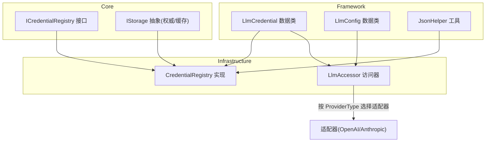
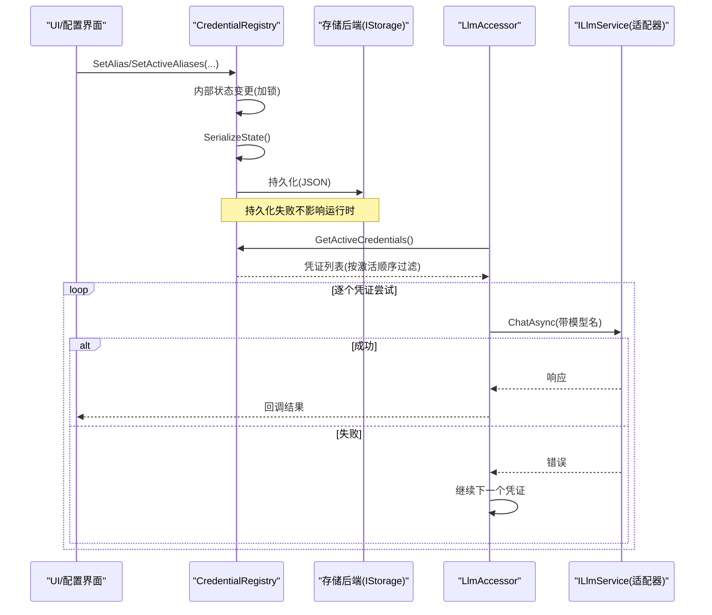
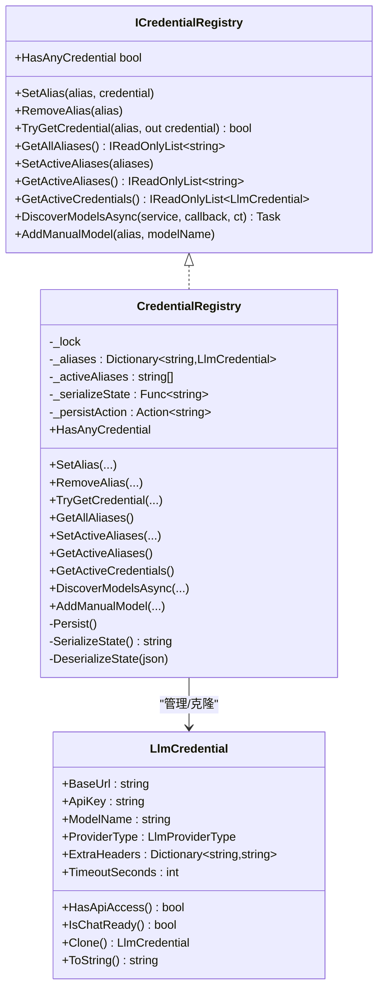
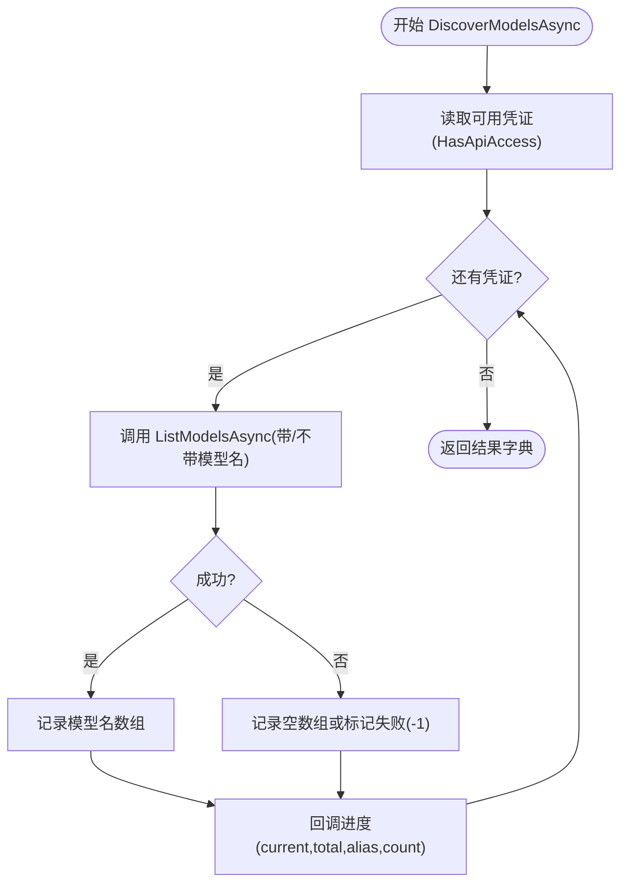
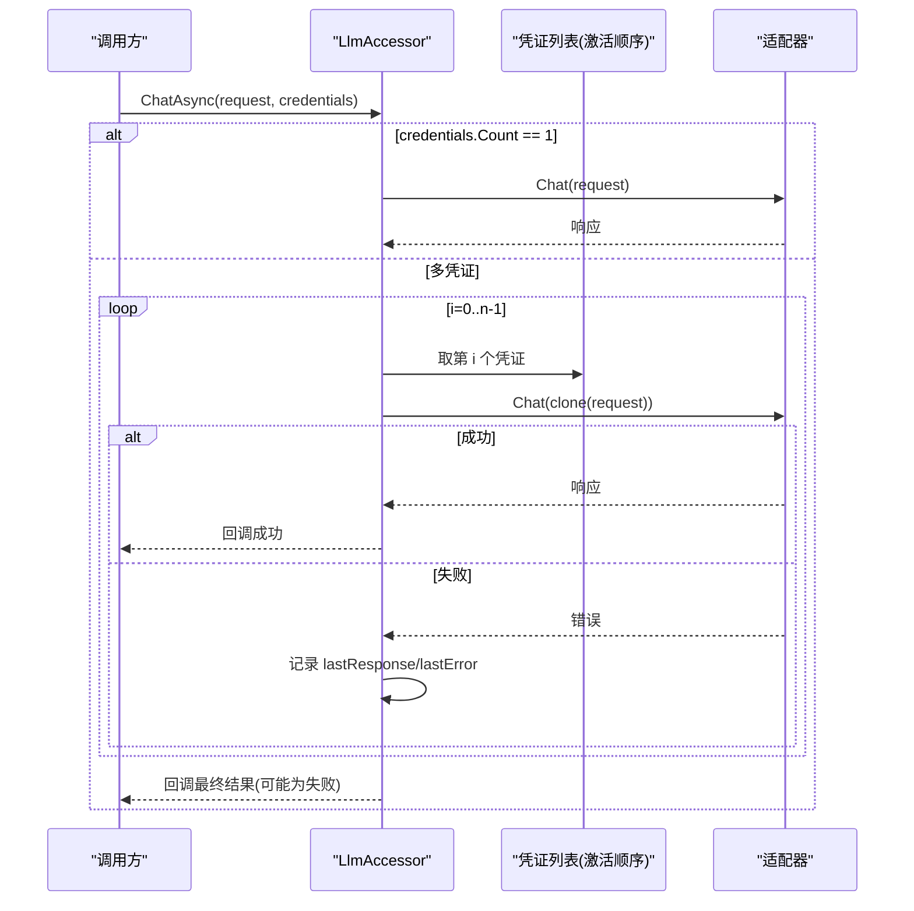
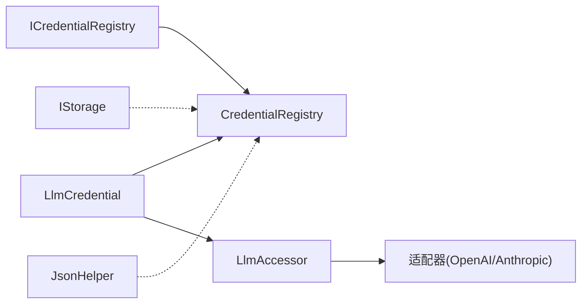

# 凭证管理

<cite>
**本文引用的文件**
- [CredentialRegistry.cs](file://src/NPCLife/Infrastructure/Llm/CredentialRegistry.cs)
- [ICredentialRegistry.cs](file://src/NPCLife/Core/ICredentialRegistry.cs)
- [LlmCredential.cs](file://src/NPCLife/Framework/Llm/LlmCredential.cs)
- [LlmConfig.cs](file://src/NPCLife/Framework/Llm/LlmConfig.cs)
- [LlmAccessor.cs](file://src/NPCLife/Infrastructure/Llm/LlmAccessor.cs)
- [JsonHelper.cs](file://src/NPCLife/Framework/JsonHelper.cs)
- [IStorage.cs](file://src/NPCLife/Core/IStorage.cs)
</cite>

## 目录
1. [简介](#简介)
2. [项目结构](#项目结构)
3. [核心组件](#核心组件)
4. [架构总览](#架构总览)
5. [详细组件分析](#详细组件分析)
6. [依赖关系分析](#依赖关系分析)
7. [性能考量](#性能考量)
8. [故障排查指南](#故障排查指南)
9. [结论](#结论)
10. [附录：API 参考与最佳实践](#附录api-参考与最佳实践)

## 简介
本文件系统性阐述凭证管理子系统的设计与实现，重点围绕 CredentialRegistry 类展开，涵盖以下主题：
- 凭证别名管理：如何以“代号”形式组织与检索 API 凭证。
- 激活顺序与回退链路：如何通过“激活顺序”实现多凭证自动回退。
- 序列化与持久化：JSON 格式与存储策略，以及持久化失败的容错。
- 凭证发现：异步模型发现流程与进度回调。
- 安全与最佳实践：凭证书写、可见性控制与错误处理建议。
- API 参考与使用示例：面向使用者的完整接口说明与操作指引。

## 项目结构
凭证管理相关代码主要分布在以下模块：
- Core 层：定义凭证注册表接口与通用配置类型。
- Framework 层：提供凭证数据结构、JSON 工具与配置类型。
- Infrastructure 层：实现凭证注册表与访问器，负责持久化与适配器调度。

图表来源
- [ICredentialRegistry.cs:1-102](file://src/NPCLife/Core/ICredentialRegistry.cs#L1-L102)
- [CredentialRegistry.cs:1-327](file://src/NPCLife/Infrastructure/Llm/CredentialRegistry.cs#L1-L327)
- [LlmCredential.cs:1-84](file://src/NPCLife/Framework/Llm/LlmCredential.cs#L1-L84)
- [LlmConfig.cs:1-69](file://src/NPCLife/Framework/Llm/LlmConfig.cs#L1-L69)
- [LlmAccessor.cs:1-331](file://src/NPCLife/Infrastructure/Llm/LlmAccessor.cs#L1-L331)
- [JsonHelper.cs:1-54](file://src/NPCLife/Framework/JsonHelper.cs#L1-L54)
- [IStorage.cs:1-53](file://src/NPCLife/Core/IStorage.cs#L1-L53)

章节来源
- [ICredentialRegistry.cs:1-102](file://src/NPCLife/Core/ICredentialRegistry.cs#L1-L102)
- [CredentialRegistry.cs:1-327](file://src/NPCLife/Infrastructure/Llm/CredentialRegistry.cs#L1-L327)
- [LlmCredential.cs:1-84](file://src/NPCLife/Framework/Llm/LlmCredential.cs#L1-L84)
- [LlmConfig.cs:1-69](file://src/NPCLife/Framework/Llm/LlmConfig.cs#L1-L69)
- [LlmAccessor.cs:1-331](file://src/NPCLife/Infrastructure/Llm/LlmAccessor.cs#L1-L331)
- [JsonHelper.cs:1-54](file://src/NPCLife/Framework/JsonHelper.cs#L1-L54)
- [IStorage.cs:1-53](file://src/NPCLife/Core/IStorage.cs#L1-L53)

## 核心组件
- 凭证注册表接口（ICredentialRegistry）
  - 职责边界清晰：别名管理、激活顺序、模型发现、持久化职责均由实现承担。
  - 关键方法族：别名 CRUD、激活顺序设置与查询、按激活顺序获取凭证、异步模型发现、手动模型登记。
- 凭证数据类（LlmCredential）
  - 三元组字段：baseUrl、apiKey、modelName；附加 providerType、ExtraHeaders、TimeoutSeconds。
  - 校验方法：HasApiAccess（API 访问级）、IsChatReady（聊天级）。
  - 克隆语义：Clone 返回浅拷贝副本，避免并发与调用方副作用。
- 访问器（LlmAccessor）
  - 无状态设计：每次调用基于传入凭证创建临时适配器，用后即弃。
  - 多凭证回退：ChatAsync 支持按顺序尝试，失败自动切换，全部失败返回最后错误。
  - 异步回调：后台线程执行，通过 MainThreadDispatcher 回到 UI 线程回调。

章节来源
- [ICredentialRegistry.cs:20-100](file://src/NPCLife/Core/ICredentialRegistry.cs#L20-L100)
- [LlmCredential.cs:12-82](file://src/NPCLife/Framework/Llm/LlmCredential.cs#L12-L82)
- [LlmAccessor.cs:26-331](file://src/NPCLife/Infrastructure/Llm/LlmAccessor.cs#L26-L331)

## 架构总览
CredentialRegistry 作为凭证注册表实现，通过构造函数注入序列化与持久化委托，实现“内存状态 ↔ JSON 字符串 ↔ 存储后端”的解耦。运行时 Agent 通过 TryGetCredential / GetActiveCredentials 获取凭证；UI 通过 SetAlias / RemoveAlias / SetActiveAliases 管理配置。LlmAccessor 在调用层按激活顺序进行多凭证回退，确保高可用。

图表来源
- [CredentialRegistry.cs:40-52](file://src/NPCLife/Infrastructure/Llm/CredentialRegistry.cs#L40-L52)
- [CredentialRegistry.cs:232-247](file://src/NPCLife/Infrastructure/Llm/CredentialRegistry.cs#L232-L247)
- [CredentialRegistry.cs:139-153](file://src/NPCLife/Infrastructure/Llm/CredentialRegistry.cs#L139-L153)
- [LlmAccessor.cs:47-71](file://src/NPCLife/Infrastructure/Llm/LlmAccessor.cs#L47-L71)
- [LlmAccessor.cs:114-191](file://src/NPCLife/Infrastructure/Llm/LlmAccessor.cs#L114-L191)

## 详细组件分析

### 凭证注册表（CredentialRegistry）实现
- 内部状态
  - _aliases：字典，键为代号（大小写不敏感），值为 LlmCredential 副本。
  - _activeAliases：激活顺序列表，仅保留存在的代号，顺序即优先级。
  - _lock：细粒度互斥，保障多线程安全。
- 别名管理
  - SetAlias：校验参数，克隆凭证后写入，随后触发持久化。
  - RemoveAlias：移除代号及在激活列表中的该项，随后持久化。
  - TryGetCredential：按代号查找且需 IsChatReady() 为真才返回。
  - GetAllAliases/HasAnyCredential：遍历别名与可用性检查。
- 激活顺序与回退链路
  - SetActiveAliases：按传入顺序过滤出存在的代号，保持输入顺序。
  - GetActiveAliases：返回当前激活顺序副本。
  - GetActiveCredentials：按激活顺序筛选并克隆有效凭证，形成回退链路。
- 模型发现（异步）
  - DiscoverModelsAsync：遍历具备 API 访问能力的凭证，调用 ILlmService.ListModelsAsync，收集结果并回调进度。
  - AddManualModel：为指定代号设置模型名（适用于不支持列表查询的提供商）。
- 序列化与持久化
  - SerializeState：将 _aliases 与 _activeAliases 写入 JSON，字段包含 baseUrl、apiKey、modelName、providerType、timeoutSeconds。
  - DeserializeState：解析 JSON，恢复别名与激活顺序，忽略不存在的代号。
  - Persist：序列化后调用注入的持久化动作，捕获异常以免影响运行时。
- 并发与线程安全
  - 所有公开方法均在 _lock 内执行，避免竞态。
  - 克隆返回与克隆写入，防止共享引用导致的状态泄漏。

图表来源
- [ICredentialRegistry.cs:20-100](file://src/NPCLife/Core/ICredentialRegistry.cs#L20-L100)
- [CredentialRegistry.cs:20-52](file://src/NPCLife/Infrastructure/Llm/CredentialRegistry.cs#L20-L52)
- [CredentialRegistry.cs:58-113](file://src/NPCLife/Infrastructure/Llm/CredentialRegistry.cs#L58-L113)
- [CredentialRegistry.cs:119-153](file://src/NPCLife/Infrastructure/Llm/CredentialRegistry.cs#L119-L153)
- [CredentialRegistry.cs:159-226](file://src/NPCLife/Infrastructure/Llm/CredentialRegistry.cs#L159-L226)
- [CredentialRegistry.cs:232-324](file://src/NPCLife/Infrastructure/Llm/CredentialRegistry.cs#L232-L324)
- [LlmCredential.cs:12-82](file://src/NPCLife/Framework/Llm/LlmCredential.cs#L12-L82)

章节来源
- [CredentialRegistry.cs:20-327](file://src/NPCLife/Infrastructure/Llm/CredentialRegistry.cs#L20-L327)
- [ICredentialRegistry.cs:20-100](file://src/NPCLife/Core/ICredentialRegistry.cs#L20-L100)
- [LlmCredential.cs:12-82](file://src/NPCLife/Framework/Llm/LlmCredential.cs#L12-L82)

### 模型发现流程（异步与进度回调）
- 输入：ILlmService（用于无状态查询）、进度回调、取消令牌。
- 步骤：
  1) 读取当前可用凭证（HasApiAccess 为真）。
  2) 逐个凭证调用 ListModelsAsync，并记录结果。
  3) 通过回调报告当前索引、总数、代号与模型数量（-1 表示失败）。
  4) 返回“代号 -> 模型名数组”的字典。
- 特性：
  - 支持取消。
  - 单个失败不影响整体进度，记录为空数组或标记失败。
  - 适合 UI 展示与配置向导。

图表来源
- [CredentialRegistry.cs:159-209](file://src/NPCLife/Infrastructure/Llm/CredentialRegistry.cs#L159-L209)

章节来源
- [CredentialRegistry.cs:159-209](file://src/NPCLife/Infrastructure/Llm/CredentialRegistry.cs#L159-L209)

### 多凭证回退链路（LlmAccessor）
- 单凭证路径：直接创建适配器并调用 Chat。
- 多凭证路径：按顺序尝试，每次使用独立请求副本，失败记录错误并继续下一个，成功立即返回，全部失败返回最后响应。
- 适配器选择：依据 LlmCredential.ProviderType 分派 OpenAI 或 Anthropic 适配器。
- 线程模型：后台线程执行，完成后通过 MainThreadDispatcher 回到 UI 线程回调。

图表来源
- [LlmAccessor.cs:47-71](file://src/NPCLife/Infrastructure/Llm/LlmAccessor.cs#L47-L71)
- [LlmAccessor.cs:114-191](file://src/NPCLife/Infrastructure/Llm/LlmAccessor.cs#L114-L191)
- [LlmAccessor.cs:290-303](file://src/NPCLife/Infrastructure/Llm/LlmAccessor.cs#L290-L303)

章节来源
- [LlmAccessor.cs:47-191](file://src/NPCLife/Infrastructure/Llm/LlmAccessor.cs#L47-L191)
- [LlmAccessor.cs:290-303](file://src/NPCLife/Infrastructure/Llm/LlmAccessor.cs#L290-L303)

## 依赖关系分析
- 接口与实现
  - ICredentialRegistry 定义契约，CredentialRegistry 提供实现。
  - LlmAccessor 依赖 LlmCredential 与 ProviderType 进行适配器分派。
- 数据与工具
  - LlmCredential 作为纯数据载体，被注册表与访问器广泛使用。
  - JsonHelper 提供 JSON 转义与引用工具，CredentialRegistry 的序列化过程使用 JsonWriter（同目录其他文件）。
- 存储抽象
  - IStorage 提供权威与缓存两类存储抽象，CredentialRegistry 通过注入的持久化委托对接任意存储后端。

图表来源
- [ICredentialRegistry.cs:20-100](file://src/NPCLife/Core/ICredentialRegistry.cs#L20-L100)
- [CredentialRegistry.cs:20-52](file://src/NPCLife/Infrastructure/Llm/CredentialRegistry.cs#L20-L52)
- [LlmCredential.cs:12-82](file://src/NPCLife/Framework/Llm/LlmCredential.cs#L12-L82)
- [LlmAccessor.cs:290-303](file://src/NPCLife/Infrastructure/Llm/LlmAccessor.cs#L290-L303)
- [IStorage.cs:10-51](file://src/NPCLife/Core/IStorage.cs#L10-L51)
- [JsonHelper.cs:8-53](file://src/NPCLife/Framework/JsonHelper.cs#L8-L53)

章节来源
- [ICredentialRegistry.cs:20-100](file://src/NPCLife/Core/ICredentialRegistry.cs#L20-L100)
- [CredentialRegistry.cs:20-52](file://src/NPCLife/Infrastructure/Llm/CredentialRegistry.cs#L20-L52)
- [LlmCredential.cs:12-82](file://src/NPCLife/Framework/Llm/LlmCredential.cs#L12-L82)
- [LlmAccessor.cs:290-303](file://src/NPCLife/Infrastructure/Llm/LlmAccessor.cs#L290-L303)
- [IStorage.cs:10-51](file://src/NPCLife/Core/IStorage.cs#L10-L51)
- [JsonHelper.cs:8-53](file://src/NPCLife/Framework/JsonHelper.cs#L8-L53)

## 性能考量
- 序列化开销
  - SerializeState 为每个别名构建小 JSON 片段再合并，内存分配可控。
  - 建议：批量变更后一次性持久化，避免频繁 IO。
- 并发与锁
  - _lock 保护关键路径，避免频繁加锁可通过批处理 API（如 SetActiveAliases）减少持久化次数。
- 模型发现
  - DiscoverModelsAsync 为串行逐一查询，网络延迟为主要瓶颈；建议在 UI 上显示进度并允许取消。
- 回退链路
  - LlmAccessor 的多凭证回退在失败快速切换，但每次创建适配器与网络调用有成本；建议合理设置激活顺序，将最可能成功的放在前面。

## 故障排查指南
- 持久化失败
  - 现象：运行正常但存储后端写入异常。
  - 处理：CredentialRegistry 的 Persist 捕获异常，不影响运行；检查存储后端权限与磁盘空间。
- 凭证不可用
  - 现象：HasAnyCredential 为假或 GetActiveCredentials 为空。
  - 处理：确认凭证 HasApiAccess/IsChatReady 条件满足；检查激活顺序中是否存在已移除的代号。
- 模型发现异常
  - 现象：某代号进度回调 count=-1。
  - 处理：检查对应凭证的 baseUrl/apiKey/modelName 与网络连通性；必要时使用 AddManualModel 手动登记。
- 回退链路不生效
  - 现象：失败未自动切换。
  - 处理：确认激活顺序正确；检查凭证是否 IsChatReady；观察日志中的回退提示。

章节来源
- [CredentialRegistry.cs:232-247](file://src/NPCLife/Infrastructure/Llm/CredentialRegistry.cs#L232-L247)
- [CredentialRegistry.cs:179-206](file://src/NPCLife/Infrastructure/Llm/CredentialRegistry.cs#L179-L206)
- [LlmCredential.cs:36-49](file://src/NPCLife/Framework/Llm/LlmCredential.cs#L36-L49)
- [LlmAccessor.cs:174-177](file://src/NPCLife/Infrastructure/Llm/LlmAccessor.cs#L174-L177)

## 结论
CredentialRegistry 通过“代号 + 三元组凭证 + 激活顺序”的组合，提供了灵活、可持久化的凭证管理体系。配合 LlmAccessor 的多凭证回退与异步模型发现，既满足了 UI 配置的易用性，也保障了运行时的高可用与可观测性。遵循本文的安全与最佳实践，可在复杂网络环境下稳定地管理多提供商、多模型的凭证。

## 附录：API 参考与最佳实践

### API 参考（ICredentialRegistry）
- 别名管理
  - SetAlias(alias, credential)：设置或覆盖代号对应的凭证。
  - RemoveAlias(alias)：移除代号及其凭证。
  - TryGetCredential(alias, out credential)：按代号查找并返回副本。
  - GetAllAliases()：获取所有代号列表。
  - HasAnyCredential：是否有任一凭证具备 API 访问能力。
- 激活顺序与回退
  - SetActiveAliases(aliases)：设置激活顺序（仅保留存在的代号，保持输入顺序）。
  - GetActiveAliases()：获取当前激活顺序。
  - GetActiveCredentials()：按激活顺序返回可用凭证副本。
- 模型发现
  - DiscoverModelsAsync(llmService, progressCallback, ct)：异步发现各代号下的模型列表。
  - AddManualModel(alias, modelName)：为不支持列表查询的提供商手动登记模型名。

章节来源
- [ICredentialRegistry.cs:26-100](file://src/NPCLife/Core/ICredentialRegistry.cs#L26-L100)

### 使用示例（步骤说明）
- 配置与持久化
  - 初始化 CredentialRegistry 时注入序列化与持久化委托；首次启动可传入 initialJson 加载历史状态。
  - 修改别名或激活顺序后，注册表自动序列化并持久化。
- UI 管理
  - 设置别名：SetAlias("primary", new LlmCredential { ... })。
  - 设置激活顺序：SetActiveAliases(new[] { "primary", "backup" })。
  - 触发模型发现：DiscoverModelsAsync(accessor, (cur, total, alias, count) => { /* 更新进度 */ }, ct)。
- Agent 使用
  - 获取激活凭证：GetActiveCredentials()，交由 LlmAccessor.ChatAsync 自动回退。
- 安全与最佳实践
  - 严格区分 HasApiAccess 与 IsChatReady：前者用于连通性与列表查询，后者用于聊天请求。
  - 不在 UI 线程阻塞：模型发现与聊天调用均为异步，通过回调回到主线程。
  - 控制可见性：避免在日志或 UI 中打印明文 apiKey；必要时截断显示。
  - 降低持久化频率：批量变更后再持久化，减少 IO 压力。
  - 网络与超时：合理设置 TimeoutSeconds，避免长时间阻塞。

章节来源
- [CredentialRegistry.cs:40-52](file://src/NPCLife/Infrastructure/Llm/CredentialRegistry.cs#L40-L52)
- [CredentialRegistry.cs:58-113](file://src/NPCLife/Infrastructure/Llm/CredentialRegistry.cs#L58-L113)
- [CredentialRegistry.cs:119-153](file://src/NPCLife/Infrastructure/Llm/CredentialRegistry.cs#L119-L153)
- [CredentialRegistry.cs:159-226](file://src/NPCLife/Infrastructure/Llm/CredentialRegistry.cs#L159-L226)
- [LlmCredential.cs:36-49](file://src/NPCLife/Framework/Llm/LlmCredential.cs#L36-L49)
- [LlmAccessor.cs:47-71](file://src/NPCLife/Infrastructure/Llm/LlmAccessor.cs#L47-L71)