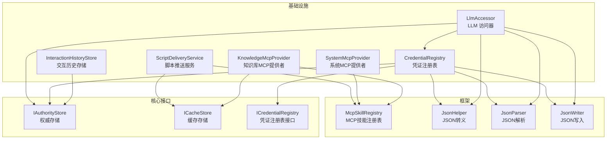
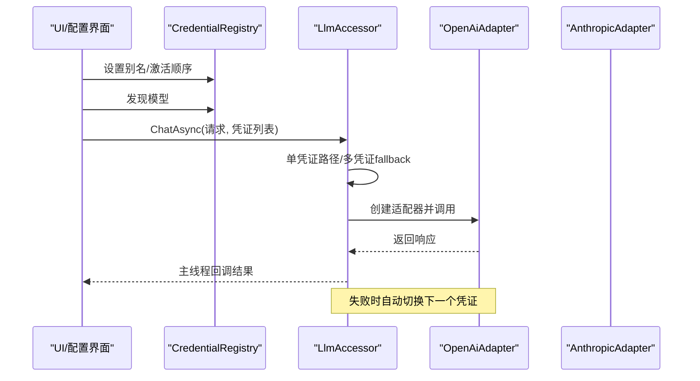
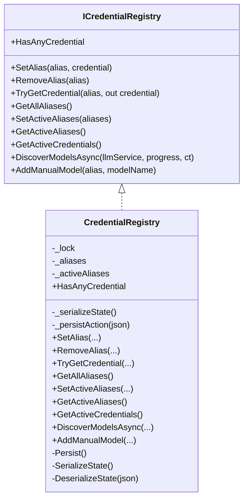
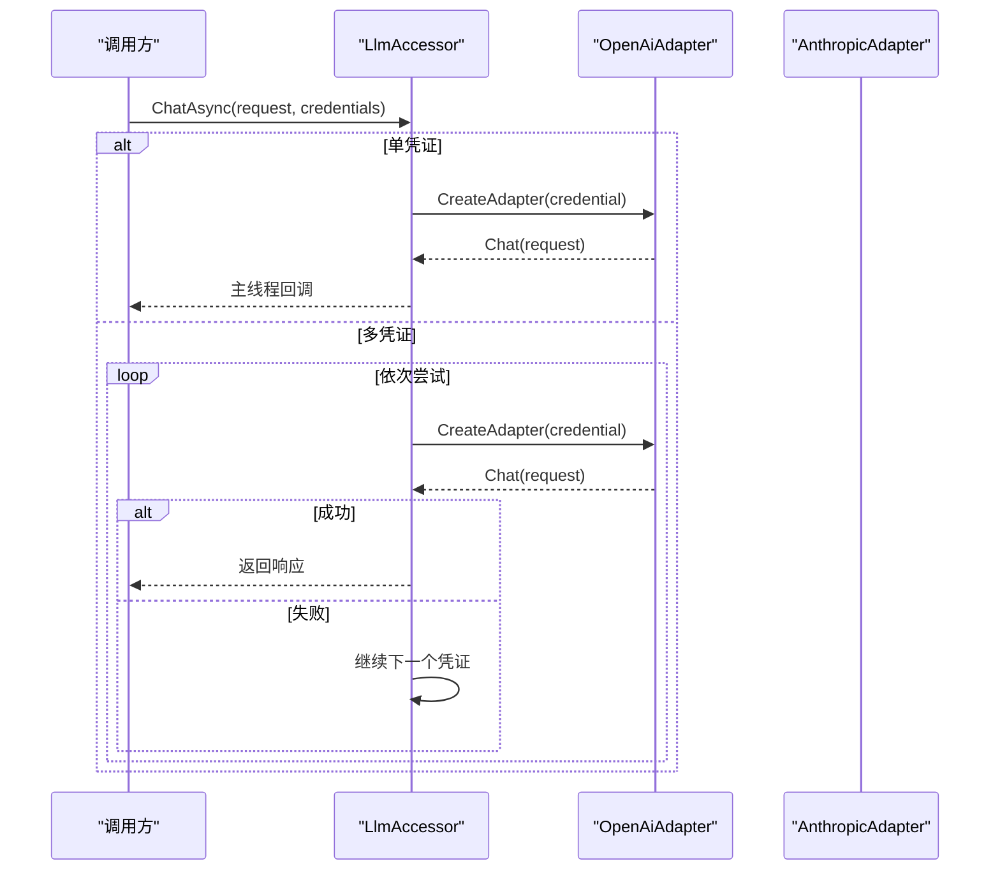
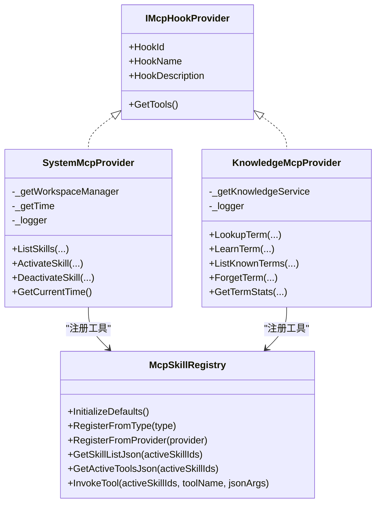
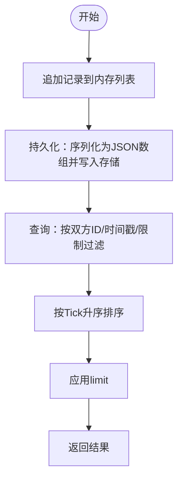
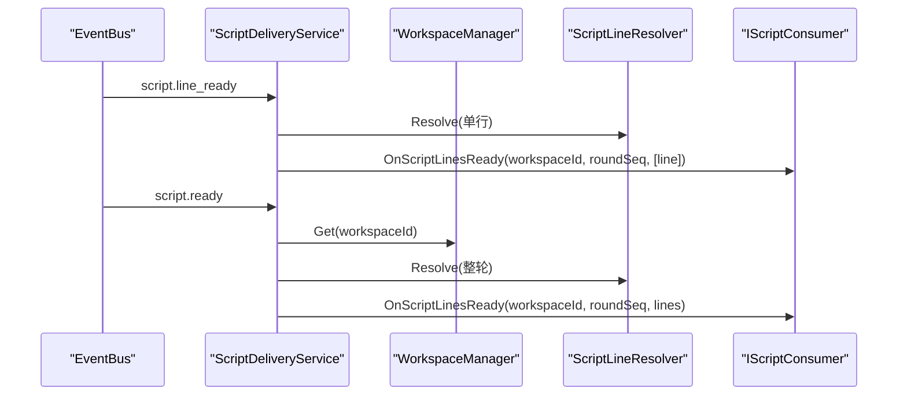
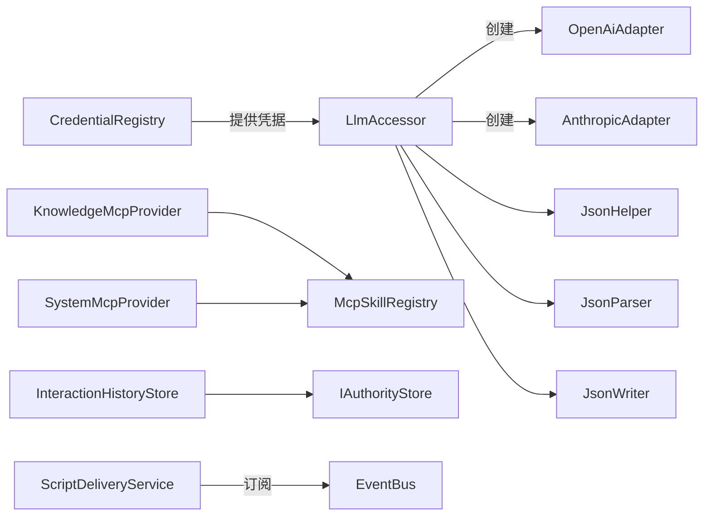

# 基础设施实现

<cite>
**本文档引用的文件**
- [CredentialRegistry.cs](file://src/NPCLife/Infrastructure/Llm/CredentialRegistry.cs)
- [ICredentialRegistry.cs](file://src/NPCLife/Core/ICredentialRegistry.cs)
- [LlmAccessor.cs](file://src/NPCLife/Infrastructure/Llm/LlmAccessor.cs)
- [OpenAiAdapter.cs](file://src/NPCLife/Infrastructure/Llm/OpenAiAdapter.cs)
- [AnthropicAdapter.cs](file://src/NPCLife/Infrastructure/Llm/AnthropicAdapter.cs)
- [KnowledgeMcpProvider.cs](file://src/NPCLife/Infrastructure/Mcp/KnowledgeMcpProvider.cs)
- [SystemMcpProvider.cs](file://src/NPCLife/Infrastructure/Mcp/SystemMcpProvider.cs)
- [McpSkillRegistry.cs](file://src/NPCLife/Framework/Mcp/McpSkillRegistry.cs)
- [InteractionHistoryStore.cs](file://src/NPCLife/Infrastructure/InteractionHistoryStore.cs)
- [ScriptDeliveryService.cs](file://src/NPCLife/Infrastructure/ScriptDeliveryService.cs)
- [IStorage.cs](file://src/NPCLife/Core/IStorage.cs)
- [JsonHelper.cs](file://src/NPCLife/Framework/JsonHelper.cs)
- [JsonParser.cs](file://src/NPCLife/Framework/JsonParser.cs)
- [JsonWriter.cs](file://src/NPCLife/Framework/JsonWriter.cs)
</cite>

## 目录
1. [简介](#简介)
2. [项目结构](#项目结构)
3. [核心组件](#核心组件)
4. [架构总览](#架构总览)
5. [详细组件分析](#详细组件分析)
6. [依赖关系分析](#依赖关系分析)
7. [性能考量](#性能考量)
8. [故障排查指南](#故障排查指南)
9. [结论](#结论)
10. [附录](#附录)

## 简介
本文件面向基础设施层的实现与使用，聚焦以下主题：
- 凭证注册表的管理机制与安全考虑
- MCP 提供者的实现原理与扩展方式
- 交互历史存储的设计与优化策略
- 基础设施组件的配置示例与集成指南
- 性能基准与优化建议
- 基础设施层对系统整体性能的影响与改进方向

## 项目结构
基础设施层位于 src/NPCLife/Infrastructure 与 src/NPCLife/Framework 下，围绕 LLM 凭证管理、MCP 技能与工具、交互历史与脚本交付等核心能力展开，并通过统一的 JSON 工具链与存储接口实现跨模块协作。

**图表来源**
- [CredentialRegistry.cs:1-327](file://src/NPCLife/Infrastructure/Llm/CredentialRegistry.cs#L1-L327)
- [ICredentialRegistry.cs:1-102](file://src/NPCLife/Core/ICredentialRegistry.cs#L1-L102)
- [LlmAccessor.cs:1-331](file://src/NPCLife/Infrastructure/Llm/LlmAccessor.cs#L1-L331)
- [InteractionHistoryStore.cs:1-185](file://src/NPCLife/Infrastructure/InteractionHistoryStore.cs#L1-L185)
- [ScriptDeliveryService.cs:1-225](file://src/NPCLife/Infrastructure/ScriptDeliveryService.cs#L1-L225)
- [KnowledgeMcpProvider.cs:1-355](file://src/NPCLife/Infrastructure/Mcp/KnowledgeMcpProvider.cs#L1-L355)
- [SystemMcpProvider.cs:1-149](file://src/NPCLife/Infrastructure/Mcp/SystemMcpProvider.cs#L1-L149)
- [McpSkillRegistry.cs:1-470](file://src/NPCLife/Framework/Mcp/McpSkillRegistry.cs#L1-L470)
- [IStorage.cs:1-53](file://src/NPCLife/Core/IStorage.cs#L1-L53)
- [JsonHelper.cs:1-54](file://src/NPCLife/Framework/JsonHelper.cs#L1-L54)
- [JsonParser.cs:1-268](file://src/NPCLife/Framework/JsonParser.cs#L1-L268)
- [JsonWriter.cs:1-136](file://src/NPCLife/Framework/JsonWriter.cs#L1-L136)

**章节来源**
- [CredentialRegistry.cs:1-327](file://src/NPCLife/Infrastructure/Llm/CredentialRegistry.cs#L1-L327)
- [LlmAccessor.cs:1-331](file://src/NPCLife/Infrastructure/Llm/LlmAccessor.cs#L1-L331)
- [InteractionHistoryStore.cs:1-185](file://src/NPCLife/Infrastructure/InteractionHistoryStore.cs#L1-L185)
- [ScriptDeliveryService.cs:1-225](file://src/NPCLife/Infrastructure/ScriptDeliveryService.cs#L1-L225)
- [KnowledgeMcpProvider.cs:1-355](file://src/NPCLife/Infrastructure/Mcp/KnowledgeMcpProvider.cs#L1-L355)
- [SystemMcpProvider.cs:1-149](file://src/NPCLife/Infrastructure/Mcp/SystemMcpProvider.cs#L1-L149)
- [McpSkillRegistry.cs:1-470](file://src/NPCLife/Framework/Mcp/McpSkillRegistry.cs#L1-L470)
- [IStorage.cs:1-53](file://src/NPCLife/Core/IStorage.cs#L1-L53)
- [JsonHelper.cs:1-54](file://src/NPCLife/Framework/JsonHelper.cs#L1-L54)
- [JsonParser.cs:1-268](file://src/NPCLife/Framework/JsonParser.cs#L1-L268)
- [JsonWriter.cs:1-136](file://src/NPCLife/Framework/JsonWriter.cs#L1-L136)

## 核心组件
- 凭证注册表：管理“模型代号 → API 凭证三元组”的映射，支持别名、激活顺序、模型发现与持久化。
- LLM 访问器：无状态适配器工厂，支持多凭证 fallback、连接测试与模型列表查询。
- MCP 提供者：知识库与系统元工具集，通过注册表统一暴露给 LLM。
- 交互历史存储：追加式流水线，持久化到权威存储，支持按双方与时间范围查询。
- 脚本推送服务：订阅事件总线，解析占位符后投递到游戏侧消费者。
- JSON 工具链：轻量 JSON 转义、解析与写入，减少分配与提升性能。
- 存储接口：权威存储与缓存存储分离，确保数据可靠性与可再生性。

**章节来源**
- [ICredentialRegistry.cs:1-102](file://src/NPCLife/Core/ICredentialRegistry.cs#L1-L102)
- [LlmAccessor.cs:1-331](file://src/NPCLife/Infrastructure/Llm/LlmAccessor.cs#L1-L331)
- [McpSkillRegistry.cs:1-470](file://src/NPCLife/Framework/Mcp/McpSkillRegistry.cs#L1-L470)
- [InteractionHistoryStore.cs:1-185](file://src/NPCLife/Infrastructure/InteractionHistoryStore.cs#L1-L185)
- [ScriptDeliveryService.cs:1-225](file://src/NPCLife/Infrastructure/ScriptDeliveryService.cs#L1-L225)
- [JsonHelper.cs:1-54](file://src/NPCLife/Framework/JsonHelper.cs#L1-L54)
- [JsonParser.cs:1-268](file://src/NPCLife/Framework/JsonParser.cs#L1-L268)
- [JsonWriter.cs:1-136](file://src/NPCLife/Framework/JsonWriter.cs#L1-L136)
- [IStorage.cs:1-53](file://src/NPCLife/Core/IStorage.cs#L1-L53)

## 架构总览
基础设施层通过清晰的职责划分与接口约束，实现低耦合高内聚：
- 凭证注册表负责“配置与持久化”，LLM 访问器负责“调用与适配”，MCP 注册表负责“技能与工具”，存储接口负责“数据可靠性”。
- JSON 工具链贯穿序列化与反序列化，避免第三方依赖带来的复杂性与性能损耗。
- 事件驱动的脚本推送服务解耦了生成与渲染阶段。

**图表来源**
- [CredentialRegistry.cs:1-327](file://src/NPCLife/Infrastructure/Llm/CredentialRegistry.cs#L1-L327)
- [LlmAccessor.cs:1-331](file://src/NPCLife/Infrastructure/Llm/LlmAccessor.cs#L1-L331)
- [OpenAiAdapter.cs:1-392](file://src/NPCLife/Infrastructure/Llm/OpenAiAdapter.cs#L1-L392)
- [AnthropicAdapter.cs:1-434](file://src/NPCLife/Infrastructure/Llm/AnthropicAdapter.cs#L1-L434)

## 详细组件分析

### 凭证注册表（CredentialRegistry）
- 管理机制
  - 别名管理：设置、移除、查找、枚举。
  - 激活顺序：维护“激活代号顺序”，形成 fallback 链路。
  - 模型发现：遍历已配置凭证，调用 LLM 服务查询模型列表。
  - 持久化：通过委托将内部状态序列化并写入存储后端。
- 安全考虑
  - 内部状态使用锁保护，避免并发冲突。
  - 序列化时对敏感字段进行转义与最小化输出。
  - 仅在持久化失败时记录警告，不影响运行时。
- 使用方法
  - UI 侧通过 SetAlias/SetActiveAliases 管理配置。
  - Agent 侧通过 TryGetCredential/GetActiveCredentials 获取凭证。
  - 通过 DiscoverModelsAsync 获取可用模型列表。

**图表来源**
- [ICredentialRegistry.cs:1-102](file://src/NPCLife/Core/ICredentialRegistry.cs#L1-L102)
- [CredentialRegistry.cs:1-327](file://src/NPCLife/Infrastructure/Llm/CredentialRegistry.cs#L1-L327)

**章节来源**
- [ICredentialRegistry.cs:1-102](file://src/NPCLife/Core/ICredentialRegistry.cs#L1-L102)
- [CredentialRegistry.cs:1-327](file://src/NPCLife/Infrastructure/Llm/CredentialRegistry.cs#L1-L327)

### LLM 访问器（LlmAccessor）
- 实现原理
  - 无状态设计：每次调用根据传入凭证创建临时适配器，用完即弃。
  - 多凭证 fallback：按顺序尝试，单个失败自动切换下一个，全部失败返回最后一个错误。
  - 线程模型：后台线程发起请求，主线程派发回调，避免阻塞 UI。
- 适配器扩展
  - 通过 CreateAdapter 根据 ProviderType 创建不同适配器（OpenAI/Anthropic）。
  - 新增适配器时仅需实现 ILlmApiProvider 并在工厂中注册。
- 使用方法
  - ChatAsync：支持单凭证与多凭证路径。
  - TestConnectionAsync/ListModelsAsync：用于配置向导与模型发现。

**图表来源**
- [LlmAccessor.cs:1-331](file://src/NPCLife/Infrastructure/Llm/LlmAccessor.cs#L1-L331)
- [OpenAiAdapter.cs:1-392](file://src/NPCLife/Infrastructure/Llm/OpenAiAdapter.cs#L1-L392)
- [AnthropicAdapter.cs:1-434](file://src/NPCLife/Infrastructure/Llm/AnthropicAdapter.cs#L1-L434)

**章节来源**
- [LlmAccessor.cs:1-331](file://src/NPCLife/Infrastructure/Llm/LlmAccessor.cs#L1-L331)
- [OpenAiAdapter.cs:1-392](file://src/NPCLife/Infrastructure/Llm/OpenAiAdapter.cs#L1-L392)
- [AnthropicAdapter.cs:1-434](file://src/NPCLife/Infrastructure/Llm/AnthropicAdapter.cs#L1-L434)

### MCP 提供者与技能注册表
- 系统 MCP 提供者（SystemMcpProvider）
  - 提供技能列表、激活、反激活与当前时间查询。
  - 通过 WorkspaceManager 获取工作空间状态，零静态耦合。
- 知识库 MCP 提供者（KnowledgeMcpProvider）
  - 提供词条查询、学习、列举、删除与统计。
  - 通过 IKnowledgeService 接口访问知识库，不依赖具体实现。
- 技能注册表（McpSkillRegistry）
  - 管理技能元数据与工具注册，提供纯函数：根据激活技能集合生成工具定义或技能列表。
  - 支持从类型或 Hook 提供者自动扫描注册工具。

**图表来源**
- [SystemMcpProvider.cs:1-149](file://src/NPCLife/Infrastructure/Mcp/SystemMcpProvider.cs#L1-L149)
- [KnowledgeMcpProvider.cs:1-355](file://src/NPCLife/Infrastructure/Mcp/KnowledgeMcpProvider.cs#L1-L355)
- [McpSkillRegistry.cs:1-470](file://src/NPCLife/Framework/Mcp/McpSkillRegistry.cs#L1-L470)

**章节来源**
- [SystemMcpProvider.cs:1-149](file://src/NPCLife/Infrastructure/Mcp/SystemMcpProvider.cs#L1-L149)
- [KnowledgeMcpProvider.cs:1-355](file://src/NPCLife/Infrastructure/Mcp/KnowledgeMcpProvider.cs#L1-L355)
- [McpSkillRegistry.cs:1-470](file://src/NPCLife/Framework/Mcp/McpSkillRegistry.cs#L1-L470)

### 交互历史存储（InteractionHistoryStore）
- 设计要点
  - 追加式流水线：内存中维护列表，持久化到权威存储。
  - 查询接口：支持双方交互、按时间戳与数量限制过滤。
  - 持久化策略：手动构建 JSON 数组字符串，避免复杂类型序列化。
- 优化策略
  - 仅在必要时加载与保存，避免频繁 IO。
  - 查询时先过滤再排序，限制返回数量。
  - 日志记录失败但不中断流程。

**图表来源**
- [InteractionHistoryStore.cs:1-185](file://src/NPCLife/Infrastructure/InteractionHistoryStore.cs#L1-L185)

**章节来源**
- [InteractionHistoryStore.cs:1-185](file://src/NPCLife/Infrastructure/InteractionHistoryStore.cs#L1-L185)
- [IStorage.cs:1-53](file://src/NPCLife/Core/IStorage.cs#L1-L53)

### 脚本推送服务（ScriptDeliveryService）
- 职责边界
  - 订阅 EventBus 的 script.line_ready 与 script.ready 事件。
  - 逐行解析 SpeakerName 后立即投递单行；轮次完成时投递完整 ScriptLines 列表。
- 集成要点
  - 通过 WorkspaceManager 获取工作空间，解析占位符后投递到游戏侧 IScriptConsumer。
  - 使用 MainThreadDispatcher 确保在主线程调用消费者接口。

**图表来源**
- [ScriptDeliveryService.cs:1-225](file://src/NPCLife/Infrastructure/ScriptDeliveryService.cs#L1-L225)

**章节来源**
- [ScriptDeliveryService.cs:1-225](file://src/NPCLife/Infrastructure/ScriptDeliveryService.cs#L1-L225)

### JSON 工具链与存储接口
- JSON 工具链
  - JsonHelper：字符串转义与引用。
  - JsonParser：轻量 JSON 解析（对象/数组/字符串数组）。
  - JsonWriter：最小化分配的对象写入器。
- 存储接口
  - IAuthorityStore：权威数据（存档文件），不可丢失。
  - ICacheStore：缓存数据（本地文件），可再生。

**章节来源**
- [JsonHelper.cs:1-54](file://src/NPCLife/Framework/JsonHelper.cs#L1-L54)
- [JsonParser.cs:1-268](file://src/NPCLife/Framework/JsonParser.cs#L1-L268)
- [JsonWriter.cs:1-136](file://src/NPCLife/Framework/JsonWriter.cs#L1-L136)
- [IStorage.cs:1-53](file://src/NPCLife/Core/IStorage.cs#L1-L53)

## 依赖关系分析
- 组件耦合
  - CredentialRegistry 与 LlmAccessor：凭证注册表为访问器提供凭据来源。
  - LlmAccessor 与适配器：访问器通过工厂创建适配器，实现对不同提供商的解耦。
  - MCP 提供者与注册表：提供者通过注册表暴露工具，系统与知识库工具均受控于同一注册表。
  - 交互历史存储与存储接口：使用权威存储进行持久化。
  - 脚本推送服务与事件总线：通过事件驱动实现解耦。
- 外部依赖
  - 仅依赖自研 JSON 工具链与存储接口，避免引入第三方库导致的版本与性能问题。

**图表来源**
- [CredentialRegistry.cs:1-327](file://src/NPCLife/Infrastructure/Llm/CredentialRegistry.cs#L1-L327)
- [LlmAccessor.cs:1-331](file://src/NPCLife/Infrastructure/Llm/LlmAccessor.cs#L1-L331)
- [OpenAiAdapter.cs:1-392](file://src/NPCLife/Infrastructure/Llm/OpenAiAdapter.cs#L1-L392)
- [AnthropicAdapter.cs:1-434](file://src/NPCLife/Infrastructure/Llm/AnthropicAdapter.cs#L1-L434)
- [KnowledgeMcpProvider.cs:1-355](file://src/NPCLife/Infrastructure/Mcp/KnowledgeMcpProvider.cs#L1-L355)
- [SystemMcpProvider.cs:1-149](file://src/NPCLife/Infrastructure/Mcp/SystemMcpProvider.cs#L1-L149)
- [McpSkillRegistry.cs:1-470](file://src/NPCLife/Framework/Mcp/McpSkillRegistry.cs#L1-L470)
- [InteractionHistoryStore.cs:1-185](file://src/NPCLife/Infrastructure/InteractionHistoryStore.cs#L1-L185)
- [ScriptDeliveryService.cs:1-225](file://src/NPCLife/Infrastructure/ScriptDeliveryService.cs#L1-L225)
- [JsonHelper.cs:1-54](file://src/NPCLife/Framework/JsonHelper.cs#L1-L54)
- [JsonParser.cs:1-268](file://src/NPCLife/Framework/JsonParser.cs#L1-L268)
- [JsonWriter.cs:1-136](file://src/NPCLife/Framework/JsonWriter.cs#L1-L136)

**章节来源**
- [CredentialRegistry.cs:1-327](file://src/NPCLife/Infrastructure/Llm/CredentialRegistry.cs#L1-L327)
- [LlmAccessor.cs:1-331](file://src/NPCLife/Infrastructure/Llm/LlmAccessor.cs#L1-L331)
- [McpSkillRegistry.cs:1-470](file://src/NPCLife/Framework/Mcp/McpSkillRegistry.cs#L1-L470)
- [InteractionHistoryStore.cs:1-185](file://src/NPCLife/Infrastructure/InteractionHistoryStore.cs#L1-L185)
- [ScriptDeliveryService.cs:1-225](file://src/NPCLife/Infrastructure/ScriptDeliveryService.cs#L1-L225)

## 性能考量
- 凭证注册表
  - 使用锁保护内部状态，避免并发写入；序列化采用流式写入器，降低峰值内存占用。
  - 模型发现采用异步并行查询，结合进度回调，提升用户体验。
- LLM 访问器
  - 单凭证路径跳过 fallback 开销；多凭证路径按顺序尝试，失败快速切换。
  - 适配器每次创建新实例（含 HttpClient），避免连接复用带来的状态污染。
- 交互历史存储
  - 追加式设计避免随机写；持久化时一次性序列化整个数组，减少 IO 次数。
  - 查询先过滤再排序，限制返回数量，控制内存与 CPU 开销。
- 脚本推送服务
  - 事件驱动解耦，避免阻塞；主线程派发确保 UI 安全。
- JSON 工具链
  - 自研轻量实现，避免第三方库的性能与兼容性问题；StringBuilder 与预分配容量减少分配。

**章节来源**
- [CredentialRegistry.cs:1-327](file://src/NPCLife/Infrastructure/Llm/CredentialRegistry.cs#L1-L327)
- [LlmAccessor.cs:1-331](file://src/NPCLife/Infrastructure/Llm/LlmAccessor.cs#L1-L331)
- [InteractionHistoryStore.cs:1-185](file://src/NPCLife/Infrastructure/InteractionHistoryStore.cs#L1-L185)
- [ScriptDeliveryService.cs:1-225](file://src/NPCLife/Infrastructure/ScriptDeliveryService.cs#L1-L225)
- [JsonHelper.cs:1-54](file://src/NPCLife/Framework/JsonHelper.cs#L1-L54)
- [JsonParser.cs:1-268](file://src/NPCLife/Framework/JsonParser.cs#L1-L268)
- [JsonWriter.cs:1-136](file://src/NPCLife/Framework/JsonWriter.cs#L1-L136)

## 故障排查指南
- 凭证注册表
  - 现象：无法获取有效凭证。
  - 排查：检查激活顺序中是否存在可用代号；确认凭证是否具备 API 访问权限。
  - 参考：HasAnyCredential、GetActiveCredentials。
- LLM 访问器
  - 现象：多凭证 fallback 未生效或全部失败。
  - 排查：确认凭证有效性与顺序；查看日志中的 fallback 警告信息。
  - 参考：ChatWithFallbackAsync、Warning 日志。
- MCP 提供者
  - 现象：工具不可用或调用失败。
  - 排查：确认技能已激活；检查注册表中工具定义是否正确；查看工具调用异常。
  - 参考：McpSkillRegistry.InvokeTool、SystemMcpProvider/KnowledgeMcpProvider 的工具实现。
- 交互历史存储
  - 现象：查询结果为空或加载失败。
  - 排查：检查存储键与 JSON 格式；确认解析逻辑与字段映射。
  - 参考：LoadFromStore、DictToRecord。
- 脚本推送服务
  - 现象：台词未推送或占位符未解析。
  - 排查：确认事件是否发布；检查 WorkspaceManager 与 IScriptConsumer 状态。
  - 参考：OnScriptLineReady、OnScriptReady。

**章节来源**
- [CredentialRegistry.cs:1-327](file://src/NPCLife/Infrastructure/Llm/CredentialRegistry.cs#L1-L327)
- [LlmAccessor.cs:1-331](file://src/NPCLife/Infrastructure/Llm/LlmAccessor.cs#L1-L331)
- [McpSkillRegistry.cs:1-470](file://src/NPCLife/Framework/Mcp/McpSkillRegistry.cs#L1-L470)
- [InteractionHistoryStore.cs:1-185](file://src/NPCLife/Infrastructure/InteractionHistoryStore.cs#L1-L185)
- [ScriptDeliveryService.cs:1-225](file://src/NPCLife/Infrastructure/ScriptDeliveryService.cs#L1-L225)

## 结论
基础设施层通过清晰的接口与无状态设计，实现了凭证管理、LLM 调用、MCP 工具、交互历史与脚本推送的高效协同。自研 JSON 工具链与存储接口确保了性能与可维护性。建议在后续迭代中进一步完善监控指标与错误恢复策略，持续优化 IO 与网络调用的吞吐与延迟表现。

## 附录

### 配置示例与集成指南
- 凭证注册表配置
  - 设置别名：通过 SetAlias(alias, credential) 绑定模型代号与凭证。
  - 激活顺序：通过 SetActiveAliases([...]) 定义 fallback 链路。
  - 模型发现：通过 DiscoverModelsAsync(llmService, progress, ct) 获取可用模型列表。
  - 参考：[CredentialRegistry.cs:1-327](file://src/NPCLife/Infrastructure/Llm/CredentialRegistry.cs#L1-L327)
- LLM 访问器集成
  - 单凭证调用：ChatAsync(request, [credential], ct)。
  - 多凭证调用：ChatAsync(request, credentials, ct) 自动 fallback。
  - 连接测试：TestConnectionAsync(credential, ct)。
  - 参考：[LlmAccessor.cs:1-331](file://src/NPCLife/Infrastructure/Llm/LlmAccessor.cs#L1-L331)
- MCP 提供者扩展
  - 注册技能与工具：使用 McpSkillRegistry.RegisterFromType 或 RegisterFromProvider。
  - 系统工具：SystemMcpProvider 提供技能列表、激活/反激活与当前时间。
  - 知识库工具：KnowledgeMcpProvider 提供词条查询、学习、列举、删除与统计。
  - 参考：
    - [McpSkillRegistry.cs:1-470](file://src/NPCLife/Framework/Mcp/McpSkillRegistry.cs#L1-L470)
    - [SystemMcpProvider.cs:1-149](file://src/NPCLife/Infrastructure/Mcp/SystemMcpProvider.cs#L1-L149)
    - [KnowledgeMcpProvider.cs:1-355](file://src/NPCLife/Infrastructure/Mcp/KnowledgeMcpProvider.cs#L1-L355)
- 交互历史存储使用
  - 追加记录：Append(record)。
  - 查询历史：Query(a, b, sinceTick, limit) 或 QueryByPawn。
  - 持久化：Persist()。
  - 参考：[InteractionHistoryStore.cs:1-185](file://src/NPCLife/Infrastructure/InteractionHistoryStore.cs#L1-L185)
- 脚本推送服务集成
  - 订阅事件：等待 EventBus 发布 script.line_ready 与 script.ready。
  - 投递台词：通过 IScriptConsumer.OnScriptLinesReady(workspaceId, roundSeq, lines)。
  - 参考：[ScriptDeliveryService.cs:1-225](file://src/NPCLife/Infrastructure/ScriptDeliveryService.cs#L1-L225)

### 性能基准与优化建议
- 基准建议
  - 凭证注册表：批量模型发现时采用异步并行，结合进度回调；序列化采用流式写入器。
  - LLM 访问器：单凭证路径避免 fallback 开销；适配器实例化成本可控。
  - 交互历史存储：批量持久化与查询限制返回数量；避免频繁 IO。
  - 脚本推送服务：事件驱动与主线程派发，减少阻塞。
- 优化建议
  - 引入连接池与超时重试策略（在适配器层实现）。
  - 对常用查询结果增加缓存（结合 ICacheStore）。
  - 使用更细粒度的日志级别与采样，降低日志开销。
  - 对 JSON 序列化进行热点路径优化（如复用写入器）。