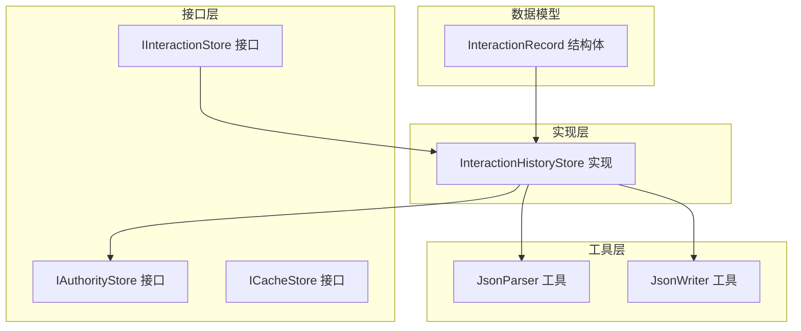
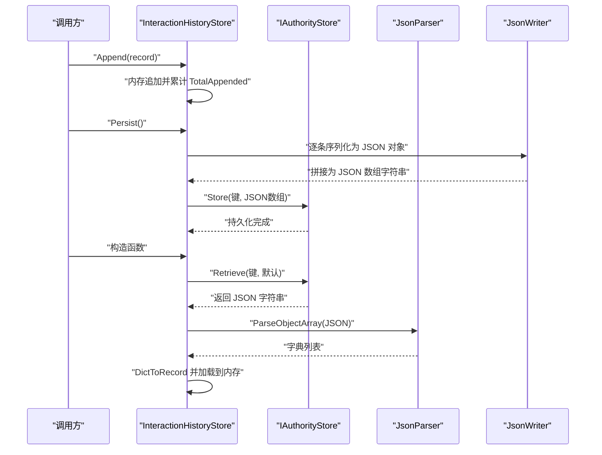
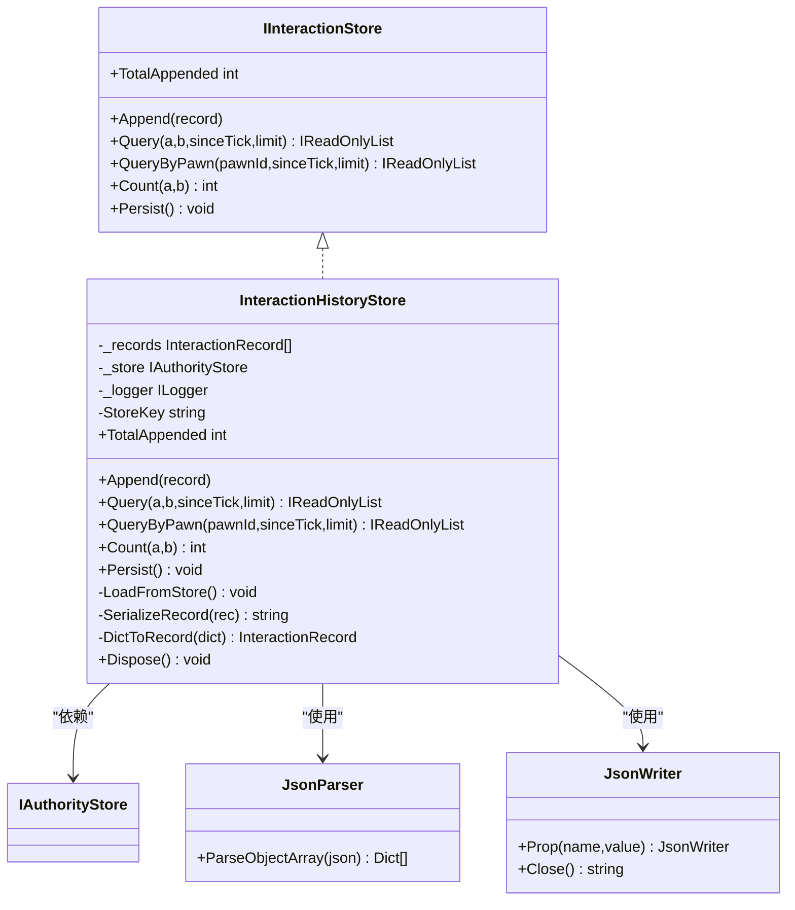
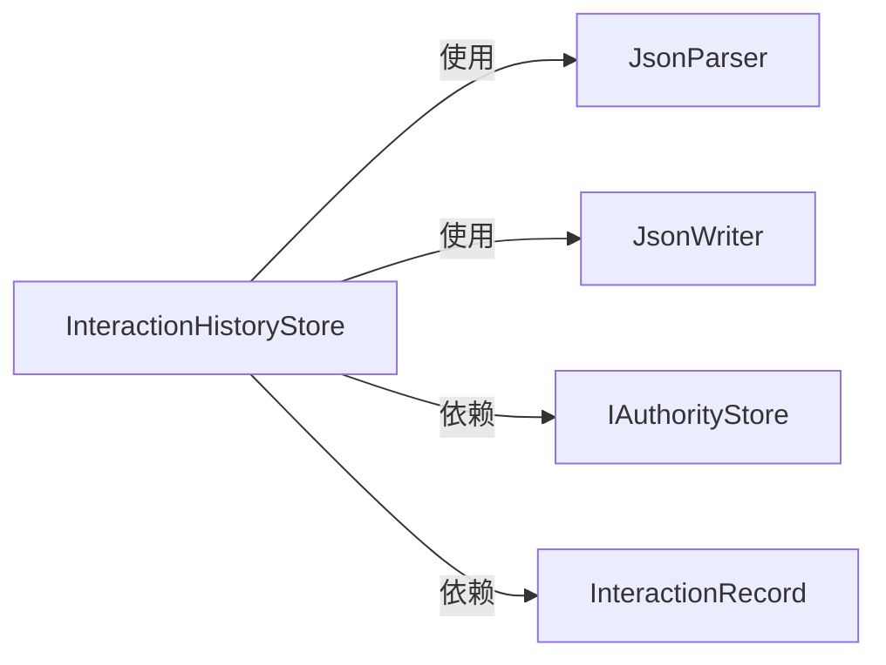

# 存储实现

<cite>
**本文引用的文件**
- [IInteractionStore.cs](file://src/NPCLife/Core/IInteractionStore.cs)
- [InteractionHistoryStore.cs](file://src/NPCLife/Infrastructure/InteractionHistoryStore.cs)
- [IStorage.cs](file://src/NPCLife/Core/IStorage.cs)
- [JsonParser.cs](file://src/NPCLife/Framework/JsonParser.cs)
- [JsonWriter.cs](file://src/NPCLife/Framework/JsonWriter.cs)
- [CharacterCard.cs](file://src/NPCLife/Cards/CharacterCard.cs)
- [WorkspaceEventPoolTests.cs](file://tests/NPCLife.Tests/Driver/WorkspaceEventPoolTests.cs)
</cite>

## 目录
1. [简介](#简介)
2. [项目结构](#项目结构)
3. [核心组件](#核心组件)
4. [架构总览](#架构总览)
5. [详细组件分析](#详细组件分析)
6. [依赖分析](#依赖分析)
7. [性能考虑](#性能考虑)
8. [故障排查指南](#故障排查指南)
9. [结论](#结论)
10. [附录](#附录)

## 简介
本文聚焦于交互历史存储的实现与设计，围绕以下目标展开：
- 深入解释 InteractionHistoryStore 的存储策略与数据结构设计
- 详细描述存储接口的抽象设计与实现要求
- 说明交互历史的持久化机制与数据访问模式
- 解释存储实现的性能优化策略与并发控制机制
- 提供存储配置的详细指南与故障恢复方案
- 包含存储实现的扩展接口与自定义存储适配器的开发方法

## 项目结构
与存储实现相关的核心文件分布如下：
- 接口层：IInteractionStore 定义交互历史的增删查计能力
- 实现层：InteractionHistoryStore 提供默认实现，基于权威存储进行持久化
- 存储抽象：IAuthorityStore/ICacheStore 抽象权威与缓存两类存储
- JSON 工具：JsonParser/JsonWriter 提供高性能的 JSON 解析与序列化
- 数据模型：InteractionRecord 描述交互流水记录的数据结构
- 使用示例：测试中体现事件池与交互历史的协同使用

图表来源
- [IInteractionStore.cs:11-51](file://src/NPCLife/Core/IInteractionStore.cs#L11-L51)
- [InteractionHistoryStore.cs:16-183](file://src/NPCLife/Infrastructure/InteractionHistoryStore.cs#L16-L183)
- [IStorage.cs:10-51](file://src/NPCLife/Core/IStorage.cs#L10-L51)
- [JsonParser.cs:13-267](file://src/NPCLife/Framework/JsonParser.cs#L13-L267)
- [JsonWriter.cs:11-135](file://src/NPCLife/Framework/JsonWriter.cs#L11-L135)
- [CharacterCard.cs:31-47](file://src/NPCLife/Cards/CharacterCard.cs#L31-L47)

章节来源
- [IInteractionStore.cs:11-51](file://src/NPCLife/Core/IInteractionStore.cs#L11-L51)
- [InteractionHistoryStore.cs:16-183](file://src/NPCLife/Infrastructure/InteractionHistoryStore.cs#L16-L183)
- [IStorage.cs:10-51](file://src/NPCLife/Core/IStorage.cs#L10-L51)
- [JsonParser.cs:13-267](file://src/NPCLife/Framework/JsonParser.cs#L13-L267)
- [JsonWriter.cs:11-135](file://src/NPCLife/Framework/JsonWriter.cs#L11-L135)
- [CharacterCard.cs:31-47](file://src/NPCLife/Cards/CharacterCard.cs#L31-L47)

## 核心组件
- IInteractionStore：定义交互历史的追加、查询、计数与持久化能力，强调“只追加、自然膨胀、不裁剪”的流水式设计，并将语义层 KV 计算与缓存写入交由上层触发。
- InteractionHistoryStore：默认实现，维护内存列表作为缓冲区，提供基于 LINQ 的查询与排序，持久化时将内存记录序列化为 JSON 数组写入权威存储。
- IAuthorityStore/ICacheStore：权威存储用于存档文件，要求不可丢失；缓存存储用于本地文件，允许缺失与重建。
- JsonParser/JsonWriter：提供高性能的 JSON 解析与序列化，避免频繁分配，支持对象数组解析与属性写入。

章节来源
- [IInteractionStore.cs:11-51](file://src/NPCLife/Core/IInteractionStore.cs#L11-L51)
- [InteractionHistoryStore.cs:16-183](file://src/NPCLife/Infrastructure/InteractionHistoryStore.cs#L16-L183)
- [IStorage.cs:10-51](file://src/NPCLife/Core/IStorage.cs#L10-L51)
- [JsonParser.cs:96-125](file://src/NPCLife/Framework/JsonParser.cs#L96-L125)
- [JsonWriter.cs:29-122](file://src/NPCLife/Framework/JsonWriter.cs#L29-L122)

## 架构总览
交互历史存储采用“内存缓冲 + 权威持久化”的双层架构：
- 内存层：以 List<InteractionRecord> 维护追加的历史，提供高效的内存查询与排序
- 持久化层：通过 IAuthorityStore 将内存中的记录序列化为 JSON 数组并写入存档键
- 上层协作：语义层 KV（如角色关系统计）由上层按需计算并写入 ICacheStore

图表来源
- [InteractionHistoryStore.cs:28-33](file://src/NPCLife/Infrastructure/InteractionHistoryStore.cs#L28-L33)
- [InteractionHistoryStore.cs:97-117](file://src/NPCLife/Infrastructure/InteractionHistoryStore.cs#L97-L117)
- [InteractionHistoryStore.cs:119-141](file://src/NPCLife/Infrastructure/InteractionHistoryStore.cs#L119-L141)
- [JsonParser.cs:96-125](file://src/NPCLife/Framework/JsonParser.cs#L96-L125)
- [JsonWriter.cs:147-156](file://src/NPCLife/Infrastructure/InteractionHistoryStore.cs#L147-L156)

## 详细组件分析

### 接口抽象 IInteractionStore
- 设计要点
  - 追加：Append(record)，仅做输入校验与计数累加
  - 查询：Query(pawnA, pawnB, sinceTick, limit)、QueryByPawn(pawnId, sinceTick, limit)，均返回按 Tick 升序的结果集
  - 计数：Count(pawnA, pawnB) 返回双方交互次数
  - 总量：TotalAppended 提供累计追加计数
  - 持久化：Persist() 在合适时机将内存记录刷入权威存储
- 语义约定
  - “只追加、不裁剪”：历史自然膨胀，不主动清理
  - 语义层 KV 由上层触发计算并写入缓存存储

章节来源
- [IInteractionStore.cs:11-51](file://src/NPCLife/Core/IInteractionStore.cs#L11-L51)

### 默认实现 InteractionHistoryStore
- 数据结构
  - 内存缓冲：List<InteractionRecord> 保存所有已追加记录
  - 计数器：TotalAppended 记录累计追加数量
  - 键名：常量键名标识交互历史集合
- 查询与排序
  - Query/QueryByPawn 先按角色筛选，再按 Tick 升序，最后应用 sinceTick 与 limit
  - 使用 LINQ 进行链式过滤与投影，最终转换为 List 返回
- 持久化与加载
  - Persist：逐条序列化为 JSON 对象，拼接为数组字符串，写入 IAuthorityStore
  - LoadFromStore：从 IAuthorityStore 读取 JSON 字符串，解析为字典数组，逐条转换为记录并加载
- 序列化与反序列化
  - SerializeRecord：使用 JsonWriter 写入固定字段，避免多余字段
  - DictToRecord：从字典映射到结构体，处理缺失键与类型转换
- 异常处理
  - 持久化/加载失败时通过 ILogger 输出警告，不中断流程

图表来源
- [IInteractionStore.cs:11-51](file://src/NPCLife/Core/IInteractionStore.cs#L11-L51)
- [InteractionHistoryStore.cs:16-183](file://src/NPCLife/Infrastructure/InteractionHistoryStore.cs#L16-L183)
- [JsonParser.cs:96-125](file://src/NPCLife/Framework/JsonParser.cs#L96-L125)
- [JsonWriter.cs:147-156](file://src/NPCLife/Infrastructure/InteractionHistoryStore.cs#L147-L156)

章节来源
- [InteractionHistoryStore.cs:16-183](file://src/NPCLife/Infrastructure/InteractionHistoryStore.cs#L16-L183)
- [JsonParser.cs:96-125](file://src/NPCLife/Framework/JsonParser.cs#L96-L125)
- [JsonWriter.cs:147-156](file://src/NPCLife/Infrastructure/InteractionHistoryStore.cs#L147-L156)

### 数据模型 InteractionRecord
- 字段含义
  - Tick：发生时刻（游戏 tick）
  - InitiatorID：互动发起者 ID
  - RecipientID：互动接受者 ID
  - InteractionDef：互动定义名（如“对话”、“侮辱”等）
  - Outcome：互动结果标签
- 用途：作为交互历史的最小数据单元，被持久化为 JSON 对象并存储

章节来源
- [CharacterCard.cs:31-47](file://src/NPCLife/Cards/CharacterCard.cs#L31-L47)

### JSON 工具链
- JsonParser
  - ParseObjectArray：解析 JSON 对象数组，逐个提取对象并转为字典，便于后续映射为记录
- JsonWriter
  - Prop/Array：以最小分配策略写入属性与数组
  - Close：输出完整 JSON 对象字符串

章节来源
- [JsonParser.cs:96-125](file://src/NPCLife/Framework/JsonParser.cs#L96-L125)
- [JsonWriter.cs:29-122](file://src/NPCLife/Framework/JsonWriter.cs#L29-L122)

### 使用场景与集成点
- 事件池与交互历史协同：测试用例展示了事件池的阈值触发与清空流程，交互历史作为事件驱动的产物之一，会在合适时机被持久化
- 上层职责：语义层 KV（如关系统计）由上层按需计算并写入缓存存储，交互历史本身保持“只追加、不裁剪”的纯数据流

章节来源
- [WorkspaceEventPoolTests.cs:73-117](file://tests/NPCLife.Tests/Driver/WorkspaceEventPoolTests.cs#L73-L117)
- [WorkspaceEventPoolTests.cs:149-175](file://tests/NPCLife.Tests/Driver/WorkspaceEventPoolTests.cs#L149-L175)

## 依赖分析
- 组件耦合
  - InteractionHistoryStore 依赖 IAuthorityStore 进行持久化，依赖 JsonParser/JsonWriter 进行序列化
  - 查询路径依赖 LINQ，整体复杂度与记录数量线性相关
- 外部依赖
  - 无第三方依赖，JSON 工具为自研轻量实现
- 潜在风险
  - 内存查询为 O(n) 筛选 + O(n log n) 排序，记录规模大时可能成为瓶颈
  - 持久化为一次性全量写入，建议在低峰期或批量触发

图表来源
- [InteractionHistoryStore.cs:16-183](file://src/NPCLife/Infrastructure/InteractionHistoryStore.cs#L16-L183)
- [JsonParser.cs:96-125](file://src/NPCLife/Framework/JsonParser.cs#L96-L125)
- [JsonWriter.cs:147-156](file://src/NPCLife/Infrastructure/InteractionHistoryStore.cs#L147-L156)
- [CharacterCard.cs:31-47](file://src/NPCLife/Cards/CharacterCard.cs#L31-L47)

章节来源
- [InteractionHistoryStore.cs:16-183](file://src/NPCLife/Infrastructure/InteractionHistoryStore.cs#L16-L183)
- [JsonParser.cs:96-125](file://src/NPCLife/Framework/JsonParser.cs#L96-L125)
- [JsonWriter.cs:147-156](file://src/NPCLife/Infrastructure/InteractionHistoryStore.cs#L147-L156)

## 性能考虑
- 时间复杂度
  - 查询：O(n) 筛选 + O(n log n) 排序，n 为内存记录数
  - 计数：O(n)
  - 持久化：O(n) 序列化 + 1 次写入
- 空间复杂度
  - 内存占用与记录数线性增长，适合短期到中期会话
- 优化建议
  - 分页与限流：通过 limit 参数限制返回数量，避免一次性返回过多数据
  - 批量持久化：在低负载时段集中调用 Persist，减少 IO 频率
  - 内存回收：在长生命周期场景下，结合业务周期调用 Dispose 清空内存
  - 索引策略：未来可引入基于角色 ID 的二级索引以加速筛选
  - 并发控制：当前实现未内置锁，建议在多线程环境下由上层协调调用时机

[本节为通用性能讨论，无需特定文件引用]

## 故障排查指南
- 加载失败
  - 现象：启动时无法加载历史记录，日志出现警告
  - 排查：检查 IAuthorityStore 的键是否存在、JSON 是否为空或格式错误
  - 处理：确认持久化键名一致，必要时清理或修复存档
- 持久化失败
  - 现象：调用 Persist 后日志出现警告
  - 排查：检查 IAuthorityStore 的 Store 方法是否可用、磁盘空间与权限
  - 处理：在安全时机重试，确保系统具备写入权限
- 查询结果异常
  - 现象：查询结果顺序或数量不符合预期
  - 排查：确认 sinceTick 与 limit 参数、角色 ID 是否正确
  - 处理：调整参数或在上层增加缓存层以减少重复计算

章节来源
- [InteractionHistoryStore.cs:119-141](file://src/NPCLife/Infrastructure/InteractionHistoryStore.cs#L119-L141)
- [InteractionHistoryStore.cs:97-117](file://src/NPCLife/Infrastructure/InteractionHistoryStore.cs#L97-L117)

## 结论
- InteractionHistoryStore 以“只追加、不裁剪”的流水式设计，结合权威存储实现可靠的交互历史持久化
- 查询与计数基于内存 LINQ，简单直观；在大规模数据下建议配合分页与限流
- JSON 工具链提供高效序列化，避免额外依赖
- 并发控制与性能优化可在上层协调与未来扩展中逐步完善

[本节为总结性内容，无需特定文件引用]

## 附录

### 存储配置与最佳实践
- 配置项
  - 持久化键名：固定为内部常量键名，确保跨版本一致性
  - 持久化时机：建议在会话结束或低负载时段调用 Persist
  - 查询参数：合理设置 sinceTick 与 limit，避免全量扫描
- 最佳实践
  - 将语义层 KV 计算与缓存写入交由上层触发，保持交互历史的纯粹数据流
  - 在长生命周期场景中定期调用 Dispose 清空内存，防止内存膨胀

章节来源
- [InteractionHistoryStore.cs:21](file://src/NPCLife/Infrastructure/InteractionHistoryStore.cs#L21)
- [InteractionHistoryStore.cs:97-117](file://src/NPCLife/Infrastructure/InteractionHistoryStore.cs#L97-L117)
- [IInteractionStore.cs:46-50](file://src/NPCLife/Core/IInteractionStore.cs#L46-L50)

### 扩展接口与自定义存储适配器
- 扩展点
  - 自定义 IAuthorityStore：实现 Store/Retrieve/Contains/Remove，满足不同存档介质需求
  - 自定义序列化：替换 JsonParser/JsonWriter 为其他序列化方案（如 MessagePack）
- 开发步骤
  - 实现 IAuthorityStore 接口，确保键值语义与现有实现一致
  - 在 InteractionHistoryStore 构造函数注入新实现，验证加载/持久化流程
  - 如需变更数据模型，同步更新序列化/反序列化逻辑与查询筛选条件

章节来源
- [IStorage.cs:10-23](file://src/NPCLife/Core/IStorage.cs#L10-L23)
- [InteractionHistoryStore.cs:28-33](file://src/NPCLife/Infrastructure/InteractionHistoryStore.cs#L28-L33)
- [JsonParser.cs:96-125](file://src/NPCLife/Framework/JsonParser.cs#L96-L125)
- [JsonWriter.cs:147-156](file://src/NPCLife/Infrastructure/InteractionHistoryStore.cs#L147-L156)