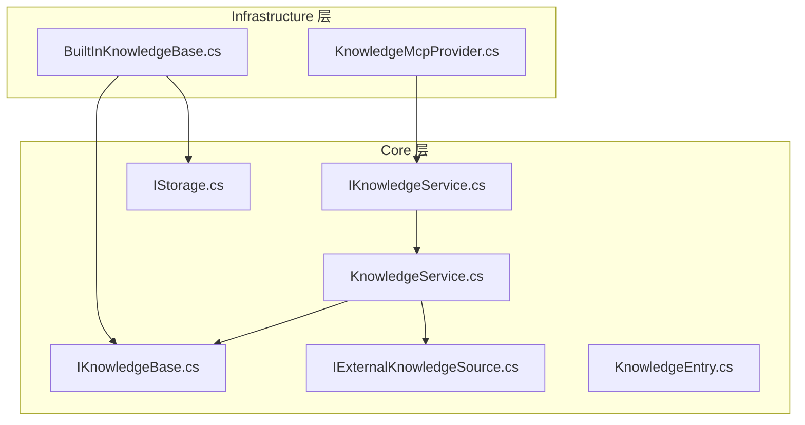
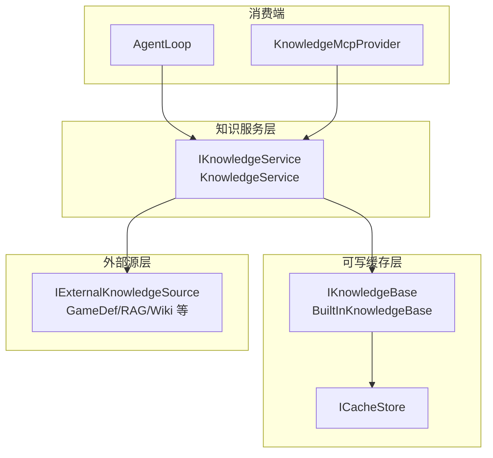
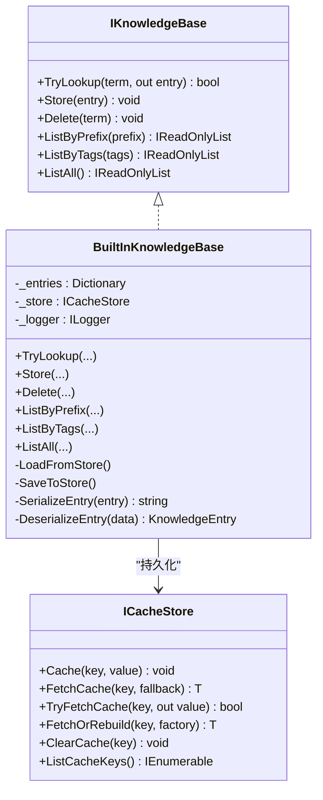
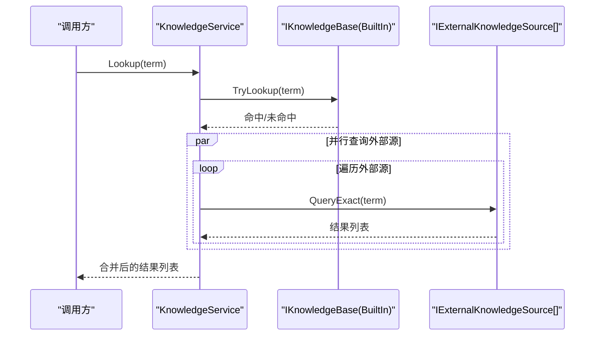
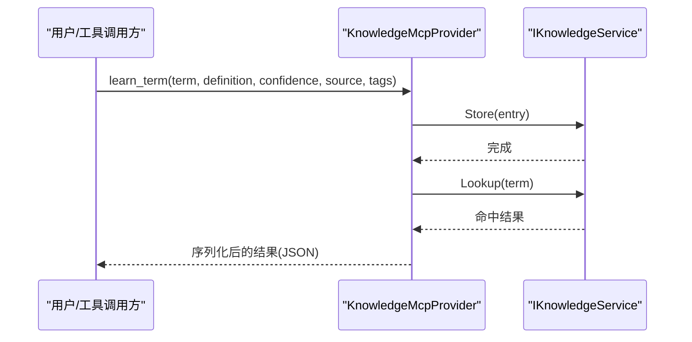
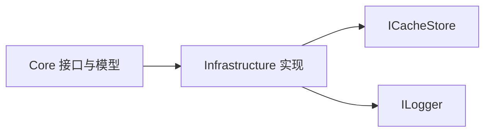

# 知识库实现

<cite>
**本文引用的文件**
- [IKnowledgeBase.cs](file://src/NPCLife/Core/IKnowledgeBase.cs)
- [IKnowledgeService.cs](file://src/NPCLife/Core/IKnowledgeService.cs)
- [IExternalKnowledgeSource.cs](file://src/NPCLife/Core/IExternalKnowledgeSource.cs)
- [KnowledgeEntry.cs](file://src/NPCLife/Core/KnowledgeEntry.cs)
- [KnowledgeService.cs](file://src/NPCLife/Core/KnowledgeService.cs)
- [BuiltInKnowledgeBase.cs](file://src/NPCLife/Infrastructure/Knowledge/BuiltInKnowledgeBase.cs)
- [KnowledgeMcpProvider.cs](file://src/NPCLife/Infrastructure/Mcp/KnowledgeMcpProvider.cs)
- [IStorage.cs](file://src/NPCLife/Core/IStorage.cs)
- [KnowledgeModule.md](file://docs/KnowledgeModule.md)
</cite>

## 目录
1. [简介](#简介)
2. [项目结构](#项目结构)
3. [核心组件](#核心组件)
4. [架构总览](#架构总览)
5. [详细组件分析](#详细组件分析)
6. [依赖分析](#依赖分析)
7. [性能考虑](#性能考虑)
8. [故障排查指南](#故障排查指南)
9. [结论](#结论)
10. [附录](#附录)

## 简介
本文件系统性阐述知识库模块的实现与设计，重点包括：
- BuiltInKnowledgeBase 的内置知识结构与查询机制
- 知识库接口的设计理念与扩展能力
- 内置知识的组织方式、分类体系与检索算法
- 知识库的缓存策略与性能优化机制
- 配置选项与自定义知识的集成方法
- 测试策略与质量保证措施

知识库模块以 IKnowledgeService 为唯一对外契约，面向 AgentLoop、MCP 提供者等消费端屏蔽底层实现细节；默认实现 KnowledgeService 将可写缓存 IKnowledgeBase 与一组只读外部源 IExternalKnowledgeSource 聚合，形成“可写缓存 + 多源只读”的统一查询入口。

## 项目结构
知识库相关代码主要分布在 Core 与 Infrastructure 两个层次：
- Core 层定义公共接口与数据模型，确保框架组件仅依赖抽象契约
- Infrastructure 层提供默认实现与 MCP 工具集，便于运行时交互与调试

图表来源
- [IKnowledgeService.cs:12-34](file://src/NPCLife/Core/IKnowledgeService.cs#L12-L34)
- [IKnowledgeBase.cs:9-51](file://src/NPCLife/Core/IKnowledgeBase.cs#L9-L51)
- [IExternalKnowledgeSource.cs:9-20](file://src/NPCLife/Core/IExternalKnowledgeSource.cs#L9-L20)
- [KnowledgeEntry.cs:9-25](file://src/NPCLife/Core/KnowledgeEntry.cs#L9-L25)
- [KnowledgeService.cs:13-64](file://src/NPCLife/Core/KnowledgeService.cs#L13-L64)
- [BuiltInKnowledgeBase.cs:13-206](file://src/NPCLife/Infrastructure/Knowledge/BuiltInKnowledgeBase.cs#L13-L206)
- [IStorage.cs:29-51](file://src/NPCLife/Core/IStorage.cs#L29-L51)
- [KnowledgeMcpProvider.cs:15-355](file://src/NPCLife/Infrastructure/Mcp/KnowledgeMcpProvider.cs#L15-L355)

章节来源
- [IKnowledgeService.cs:12-34](file://src/NPCLife/Core/IKnowledgeService.cs#L12-L34)
- [KnowledgeService.cs:13-64](file://src/NPCLife/Core/KnowledgeService.cs#L13-L64)
- [BuiltInKnowledgeBase.cs:13-206](file://src/NPCLife/Infrastructure/Knowledge/BuiltInKnowledgeBase.cs#L13-L206)
- [KnowledgeMcpProvider.cs:15-355](file://src/NPCLife/Infrastructure/Mcp/KnowledgeMcpProvider.cs#L15-L355)
- [IStorage.cs:29-51](file://src/NPCLife/Core/IStorage.cs#L29-L51)

## 核心组件
- IKnowledgeService：知识服务公共接口，定义查询、存储、删除、列举等能力，面向框架组件消费
- KnowledgeService：默认实现，聚合 IKnowledgeBase（可写）与 IExternalKnowledgeSource[]（只读）
- IKnowledgeBase：可写缓存契约，定义词条的增删查改与列举能力
- BuiltInKnowledgeBase：内置知识库唯一可写实现，基于内存字典 + ICacheStore 持久化
- IExternalKnowledgeSource：只读外部源契约，实现者可为 GameDef、Wiki、RAG 等
- KnowledgeEntry：知识条目数据模型，包含词条名、释义、来源、信心度、语义标签

章节来源
- [IKnowledgeService.cs:12-34](file://src/NPCLife/Core/IKnowledgeService.cs#L12-L34)
- [KnowledgeService.cs:13-64](file://src/NPCLife/Core/KnowledgeService.cs#L13-L64)
- [IKnowledgeBase.cs:9-51](file://src/NPCLife/Core/IKnowledgeBase.cs#L9-L51)
- [BuiltInKnowledgeBase.cs:13-206](file://src/NPCLife/Infrastructure/Knowledge/BuiltInKnowledgeBase.cs#L13-L206)
- [IExternalKnowledgeSource.cs:9-20](file://src/NPCLife/Core/IExternalKnowledgeSource.cs#L9-L20)
- [KnowledgeEntry.cs:9-25](file://src/NPCLife/Core/KnowledgeEntry.cs#L9-L25)

## 架构总览
知识库模块采用“接口隔离 + 默认聚合 + 可插拔外部源”的架构设计：
- 消费端（AgentLoop、MCP 工具）仅依赖 IKnowledgeService
- 默认实现 KnowledgeService 并行查询内部缓存与外部源，汇总返回
- BuiltInKnowledgeBase 提供可写缓存，持久化至 ICacheStore
- IExternalKnowledgeSource 抽象外部只读源，实现者自行决定精确/模糊匹配策略

图表来源
- [KnowledgeService.cs:13-64](file://src/NPCLife/Core/KnowledgeService.cs#L13-L64)
- [BuiltInKnowledgeBase.cs:13-206](file://src/NPCLife/Infrastructure/Knowledge/BuiltInKnowledgeBase.cs#L13-L206)
- [IStorage.cs:29-51](file://src/NPCLife/Core/IStorage.cs#L29-L51)
- [IExternalKnowledgeSource.cs:9-20](file://src/NPCLife/Core/IExternalKnowledgeSource.cs#L9-L20)

## 详细组件分析

### BuiltInKnowledgeBase：内置知识库实现
- 数据结构
  - 内存索引：Dictionary<string, KnowledgeEntry>，键为词条名（大小写不敏感）
  - 持久化：通过 ICacheStore 以 JSON 数组形式序列化存储
- 查询机制
  - TryLookup：O(1) 字典查找，大小写不敏感
  - ListByPrefix：前缀匹配 + 排序，大小写不敏感
  - ListByTags：标签交集匹配，大小写不敏感
  - ListAll：按词条名排序输出
- 写入与删除
  - Store：直接覆盖；必要时补全 ContextTags；立即持久化
  - Delete：移除后立即持久化
- 序列化
  - SerializeEntry/DeserializeEntry：JSON 字段映射，兼容 LegacyCache
- 错误处理
  - 加载/保存失败记录警告日志，不影响运行

图表来源
- [IKnowledgeBase.cs:9-51](file://src/NPCLife/Core/IKnowledgeBase.cs#L9-L51)
- [BuiltInKnowledgeBase.cs:13-206](file://src/NPCLife/Infrastructure/Knowledge/BuiltInKnowledgeBase.cs#L13-L206)
- [IStorage.cs:29-51](file://src/NPCLife/Core/IStorage.cs#L29-L51)

章节来源
- [BuiltInKnowledgeBase.cs:13-206](file://src/NPCLife/Infrastructure/Knowledge/BuiltInKnowledgeBase.cs#L13-L206)
- [IStorage.cs:29-51](file://src/NPCLife/Core/IStorage.cs#L29-L51)

### KnowledgeService：默认知识服务实现
- 职责
  - Lookup：并行查询内部缓存与所有外部源，返回全部命中结果
  - Store/Delete/List*：代理到 IKnowledgeBase
- 并发与一致性
  - 内部缓存查询与外部源查询并行执行，避免阻塞
  - 结果按来源聚合，调用方依据 Source 字段区分可信度

图表来源
- [KnowledgeService.cs:28-48](file://src/NPCLife/Core/KnowledgeService.cs#L28-L48)

章节来源
- [KnowledgeService.cs:13-64](file://src/NPCLife/Core/KnowledgeService.cs#L13-L64)

### KnowledgeMcpProvider：知识库 MCP 工具集
- 工具清单
  - lookup_term：词条查询，返回全部来源的命中结果
  - learn_term：主动学习并存储词条（直接覆盖）
  - list_known_terms：列举内部知识库，支持前缀与标签过滤
  - forget_term：删除指定词条
  - get_term_stats：获取词条元数据（信心度、来源、标签）
- 参数与约束
  - term 为必填项；confidence 限定在 0.0~1.0
  - tags 支持逗号分隔的多标签输入
- 错误处理
  - 统一捕获异常并返回结构化错误信息，同时记录警告日志

图表来源
- [KnowledgeMcpProvider.cs:80-123](file://src/NPCLife/Infrastructure/Mcp/KnowledgeMcpProvider.cs#L80-L123)

章节来源
- [KnowledgeMcpProvider.cs:15-355](file://src/NPCLife/Infrastructure/Mcp/KnowledgeMcpProvider.cs#L15-L355)

### 知识条目模型与分类体系
- KnowledgeEntry 字段
  - Term：词条名（索引键，大小写不敏感）
  - Definition：释义文本（可空）
  - Source：来源名称（如 LLM、GameDef、AgentDeduction、Wiki、RAG）
  - Confidence：信心度（0.0~1.0）
  - ContextTags：语义标签列表（如 Combat、Faction、Lore）
- 分类与过滤
  - 通过 ContextTags 进行领域过滤（命中任一标签即匹配）
  - 通过前缀进行快速列举与探索

章节来源
- [KnowledgeEntry.cs:9-25](file://src/NPCLife/Core/KnowledgeEntry.cs#L9-L25)
- [IKnowledgeBase.cs:38-44](file://src/NPCLife/Core/IKnowledgeBase.cs#L38-L44)

## 依赖分析
- 模块内聚与耦合
  - Core 层仅暴露接口与数据模型，低耦合、高内聚
  - Infrastructure 层对 Core 的依赖为单向（实现依赖抽象）
- 外部依赖
  - ICacheStore：本地缓存抽象，负责持久化与重建
  - ILogger：日志记录，用于加载/保存失败的告警
- 可能的循环依赖
  - 未发现循环依赖迹象；各层职责清晰

图表来源
- [BuiltInKnowledgeBase.cs:13-206](file://src/NPCLife/Infrastructure/Knowledge/BuiltInKnowledgeBase.cs#L13-L206)
- [IStorage.cs:29-51](file://src/NPCLife/Core/IStorage.cs#L29-L51)

章节来源
- [BuiltInKnowledgeBase.cs:13-206](file://src/NPCLife/Infrastructure/Knowledge/BuiltInKnowledgeBase.cs#L13-L206)
- [IStorage.cs:29-51](file://src/NPCLife/Core/IStorage.cs#L29-L51)

## 性能考虑
- 查询复杂度
  - TryLookup：O(1) 字典查找
  - ListByPrefix：O(n) 遍历 + O(k log k) 排序（n 为词条总数，k 为匹配数）
  - ListByTags：O(n) 遍历 + O(k log k) 排序
- 内存与持久化
  - 内存字典索引，无容量限制与淘汰策略
  - 每次写入均触发持久化，保证可靠性但可能带来写放大
- 并行查询
  - KnowledgeService 对外部源查询采用并行策略，降低整体延迟
- 建议优化方向
  - 引入写缓冲与批量持久化，减少频繁 IO
  - 对高频前缀与标签建立二级索引，加速 ListByPrefix/ListByTags
  - 在外部源侧实现更细粒度的缓存与预热

## 故障排查指南
- 常见问题
  - 词条未命中：检查 Term 是否大小写不敏感匹配；确认外部源是否返回结果
  - 写入无效：确认 Term 非空；检查 Store 调用是否成功
  - 列表为空：确认缓存是否正确加载；检查 ICacheStore 是否可用
- 日志定位
  - BuiltInKnowledgeBase 在加载/保存失败时输出警告日志
  - KnowledgeMcpProvider 在工具执行异常时输出警告日志
- 诊断步骤
  - 使用 MCP 工具 list_known_terms 检查内部缓存状态
  - 使用 get_term_stats 查看词条元数据
  - 检查 ICacheStore 的键值与序列化格式

章节来源
- [BuiltInKnowledgeBase.cs:126-131](file://src/NPCLife/Infrastructure/Knowledge/BuiltInKnowledgeBase.cs#L126-L131)
- [KnowledgeMcpProvider.cs:72-74](file://src/NPCLife/Infrastructure/Mcp/KnowledgeMcpProvider.cs#L72-L74)

## 结论
知识库模块通过清晰的接口分层与默认聚合实现，实现了“可写缓存 + 多源只读”的灵活架构。BuiltInKnowledgeBase 提供高性能的内存索引与可靠的本地持久化；KnowledgeService 将内部缓存与外部源统一聚合，满足多来源查询场景；KnowledgeMcpProvider 为运行时交互提供了便捷工具集。该设计既满足当前需求，又为第三方自定义实现预留了充分空间。

## 附录

### 配置选项与集成方法
- 配置要点
  - ICacheStore：选择合适的本地缓存实现（如 LocalFileStore），确保键空间隔离
  - ILogger：启用详细日志以便定位加载/保存异常
- 自定义知识集成
  - 实现 IExternalKnowledgeSource：提供 SourceName 与 QueryExact，返回的 Source 字段需与 SourceName 保持一致
  - 注入到 KnowledgeService：通过构造函数注入外部源集合
  - 替换默认实现：直接实现 IKnowledgeService，按需组织知识库架构（单库、多层、分布式）

章节来源
- [IExternalKnowledgeSource.cs:9-20](file://src/NPCLife/Core/IExternalKnowledgeSource.cs#L9-L20)
- [KnowledgeService.cs:18-22](file://src/NPCLife/Core/KnowledgeService.cs#L18-L22)
- [KnowledgeModule.md:115-173](file://docs/KnowledgeModule.md#L115-L173)

### 测试策略与质量保证
- 接口契约测试
  - 断言 IKnowledgeService 的 Lookup/Store/Delete/List* 行为符合约定
- 默认实现行为验证
  - 验证 KnowledgeService 的并行查询与聚合逻辑
- 内置缓存稳定性
  - 验证 BuiltInKnowledgeBase 的持久化与反序列化流程
- MCP 工具可用性
  - 验证 KnowledgeMcpProvider 的工具签名、参数解析与错误处理
- 文档一致性核验
  - 对照 KnowledgeModule.md 的接口定义与典型接入方式

章节来源
- [KnowledgeModule.md:1-244](file://docs/KnowledgeModule.md#L1-L244)