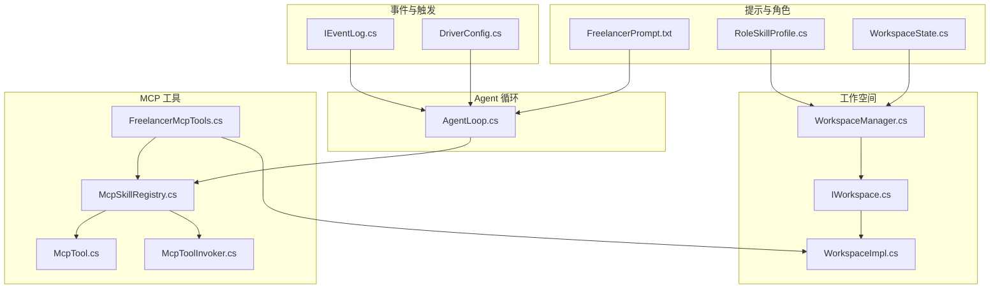
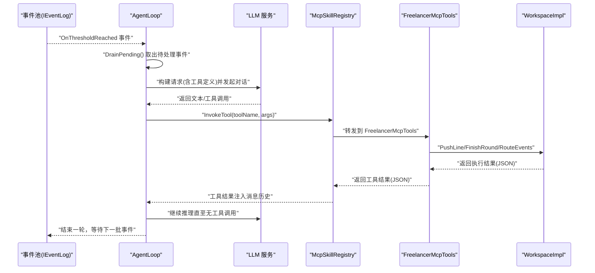
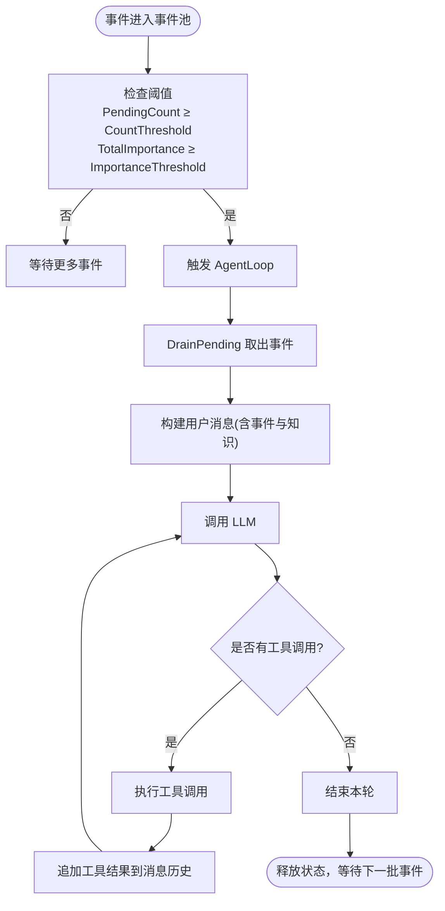
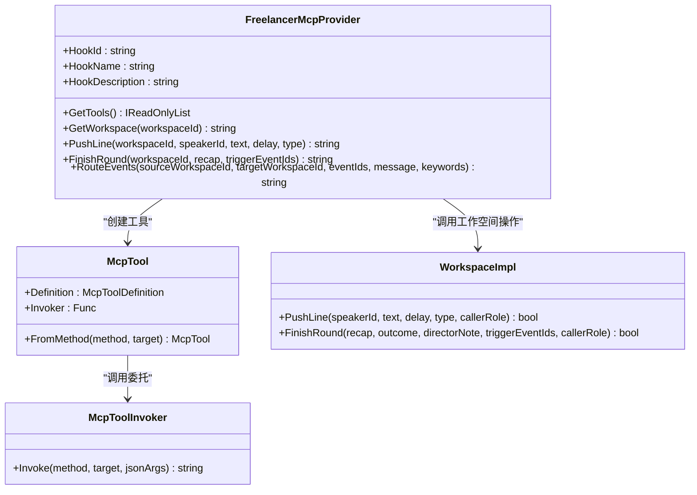
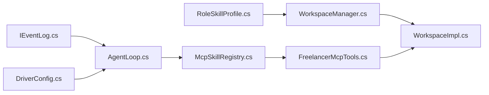

# 临时编剧角色（Freelancer）

<cite>
**本文引用的文件**
- [FreelancerPrompt.txt](file://src/NPCLife/Prompts/FreelancerPrompt.txt)
- [FreelancerMcpTools.cs](file://src/NPCLife/Workspace/FreelancerMcpTools.cs)
- [AgentLoop.cs](file://src/NPCLife/Agent/AgentLoop.cs)
- [McpTool.cs](file://src/NPCLife/Framework/Mcp/McpTool.cs)
- [McpToolInvoker.cs](file://src/NPCLife/Framework/Mcp/McpToolInvoker.cs)
- [IWorkspace.cs](file://src/NPCLife/Workspace/IWorkspace.cs)
- [WorkspaceImpl.cs](file://src/NPCLife/Workspace/WorkspaceImpl.cs)
- [IEventLog.cs](file://src/NPCLife/Core/IEventLog.cs)
- [McpSkillRegistry.cs](file://src/NPCLife/Framework/Mcp/McpSkillRegistry.cs)
- [WorkspaceManager.cs](file://src/NPCLife/Workspace/WorkspaceManager.cs)
- [DriverConfig.cs](file://src/NPCLife/Driver/DriverConfig.cs)
- [RoleSkillProfile.cs](file://src/NPCLife/Workspace/RoleSkillProfile.cs)
- [WorkspaceState.cs](file://src/NPCLife/Workspace/WorkspaceState.cs)
</cite>

## 目录
1. [简介](#简介)
2. [项目结构](#项目结构)
3. [核心组件](#核心组件)
4. [架构总览](#架构总览)
5. [详细组件分析](#详细组件分析)
6. [依赖分析](#依赖分析)
7. [性能考虑](#性能考虑)
8. [故障排查指南](#故障排查指南)
9. [结论](#结论)
10. [附录](#附录)

## 简介
临时编剧（Freelancer）是多智能体叙事系统中的应急响应与特殊事件处理角色。其定位是在不维护跨轮次剧情上下文的前提下，快速处理突发性、独立性的事件（如日常对话、随机遭遇、环境变化等）。Freelancer 通过轻量提示词与专用 MCP 工具集，实现“即兴、快速、独立”的叙事输出；在必要时将更适合的事件路由回导演工作空间，从而与导演、编剧形成互补协作。

## 项目结构
围绕 Freelancer 的关键模块与文件如下：
- 提示词与角色规范：Prompts/FreelancerPrompt.txt
- 工作空间与角色：WorkspaceState.cs、RoleSkillProfile.cs、WorkspaceManager.cs、IWorkspace.cs、WorkspaceImpl.cs
- 事件池与触发：IEventLog.cs、DriverConfig.cs
- Agent 主循环：AgentLoop.cs
- MCP 工具体系：McpTool.cs、McpToolInvoker.cs、McpSkillRegistry.cs
- Freelancer 专用工具提供者：Workspace/FreelancerMcpTools.cs

**图表来源**
- [FreelancerPrompt.txt:1-18](file://src/NPCLife/Prompts/FreelancerPrompt.txt#L1-L18)
- [RoleSkillProfile.cs:1-74](file://src/NPCLife/Workspace/RoleSkillProfile.cs#L1-L74)
- [WorkspaceState.cs:1-152](file://src/NPCLife/Workspace/WorkspaceState.cs#L1-L152)
- [WorkspaceManager.cs:1-616](file://src/NPCLife/Workspace/WorkspaceManager.cs#L1-L616)
- [IWorkspace.cs:1-51](file://src/NPCLife/Workspace/IWorkspace.cs#L1-L51)
- [WorkspaceImpl.cs:1-197](file://src/NPCLife/Workspace/WorkspaceImpl.cs#L1-L197)
- [IEventLog.cs:1-52](file://src/NPCLife/Core/IEventLog.cs#L1-L52)
- [DriverConfig.cs:1-107](file://src/NPCLife/Driver/DriverConfig.cs#L1-L107)
- [AgentLoop.cs:1-581](file://src/NPCLife/Agent/AgentLoop.cs#L1-L581)
- [McpTool.cs:1-40](file://src/NPCLife/Framework/Mcp/McpTool.cs#L1-L40)
- [McpToolInvoker.cs:1-238](file://src/NPCLife/Framework/Mcp/McpToolInvoker.cs#L1-L238)
- [McpSkillRegistry.cs:1-470](file://src/NPCLife/Framework/Mcp/McpSkillRegistry.cs#L1-L470)
- [FreelancerMcpTools.cs:1-274](file://src/NPCLife/Workspace/FreelancerMcpTools.cs#L1-L274)

**章节来源**
- [FreelancerPrompt.txt:1-18](file://src/NPCLife/Prompts/FreelancerPrompt.txt#L1-L18)
- [DriverConfig.cs:1-107](file://src/NPCLife/Driver/DriverConfig.cs#L1-L107)
- [RoleSkillProfile.cs:1-74](file://src/NPCLife/Workspace/RoleSkillProfile.cs#L1-L74)
- [WorkspaceState.cs:1-152](file://src/NPCLife/Workspace/WorkspaceState.cs#L1-L152)
- [WorkspaceManager.cs:1-616](file://src/NPCLife/Workspace/WorkspaceManager.cs#L1-L616)
- [IWorkspace.cs:1-51](file://src/NPCLife/Workspace/IWorkspace.cs#L1-L51)
- [WorkspaceImpl.cs:1-197](file://src/NPCLife/Workspace/WorkspaceImpl.cs#L1-L197)
- [IEventLog.cs:1-52](file://src/NPCLife/Core/IEventLog.cs#L1-L52)
- [AgentLoop.cs:1-581](file://src/NPCLife/Agent/AgentLoop.cs#L1-L581)
- [McpTool.cs:1-40](file://src/NPCLife/Framework/Mcp/McpTool.cs#L1-L40)
- [McpToolInvoker.cs:1-238](file://src/NPCLife/Framework/Mcp/McpToolInvoker.cs#L1-L238)
- [McpSkillRegistry.cs:1-470](file://src/NPCLife/Framework/Mcp/McpSkillRegistry.cs#L1-L470)
- [FreelancerMcpTools.cs:1-274](file://src/NPCLife/Workspace/FreelancerMcpTools.cs#L1-L274)

## 核心组件
- 角色与技能配置
  - 角色身份：WorkspaceRole.Freelancer
  - 默认技能集：workspace_freelancer、character_query、event_query
- 工作空间与事件
  - IWorkspace/IEventLog：工作空间的元数据、事件池与操作接口
  - WorkspaceManager：工作空间的 CRUD、分支/合并、事件路由
- Agent 主循环
  - AgentLoop：基于事件池阈值被动激活，构建请求、调用 LLM、执行工具调用循环
- MCP 工具体系
  - McpSkillRegistry：技能与工具注册、激活、调用
  - McpTool/McpToolInvoker：工具定义与运行时调用
  - FreelancerMcpTools：Freelancer 专用工具（获取工作空间、推送台词、结束轮次、事件路由）

**章节来源**
- [WorkspaceState.cs:9-20](file://src/NPCLife/Workspace/WorkspaceState.cs#L9-L20)
- [RoleSkillProfile.cs:46-51](file://src/NPCLife/Workspace/RoleSkillProfile.cs#L46-L51)
- [IWorkspace.cs:11-51](file://src/NPCLife/Workspace/IWorkspace.cs#L11-L51)
- [IEventLog.cs:12-51](file://src/NPCLife/Core/IEventLog.cs#L12-L51)
- [WorkspaceManager.cs:19-616](file://src/NPCLife/Workspace/WorkspaceManager.cs#L19-L616)
- [AgentLoop.cs:43-581](file://src/NPCLife/Agent/AgentLoop.cs#L43-L581)
- [McpSkillRegistry.cs:22-470](file://src/NPCLife/Framework/Mcp/McpSkillRegistry.cs#L22-L470)
- [McpTool.cs:14-39](file://src/NPCLife/Framework/Mcp/McpTool.cs#L14-L39)
- [McpToolInvoker.cs:14-238](file://src/NPCLife/Framework/Mcp/McpToolInvoker.cs#L14-L238)
- [FreelancerMcpTools.cs:21-274](file://src/NPCLife/Workspace/FreelancerMcpTools.cs#L21-L274)

## 架构总览
Freelancer 的工作机制围绕“事件池触发 → Agent 主循环 → LLM 推理 → MCP 工具执行 → 工作空间输出”展开。Freelancer 专用工具提供者将工作空间操作收敛为轻量工具，强调独立性与快速响应。

**图表来源**
- [IEventLog.cs:48-49](file://src/NPCLife/Core/IEventLog.cs#L48-L49)
- [AgentLoop.cs:171-337](file://src/NPCLife/Agent/AgentLoop.cs#L171-L337)
- [McpSkillRegistry.cs:361-437](file://src/NPCLife/Framework/Mcp/McpSkillRegistry.cs#L361-L437)
- [FreelancerMcpTools.cs:36-232](file://src/NPCLife/Workspace/FreelancerMcpTools.cs#L36-L232)
- [WorkspaceImpl.cs:83-182](file://src/NPCLife/Workspace/WorkspaceImpl.cs#L83-L182)

## 详细组件分析

### 角色定位与提示词设计
- 角色职责
  - 处理突发性、独立性事件，不维护跨轮次剧情上下文
  - 使用角色查询、事件查询等工具获取当前状态
  - 逐句推送台词，结束后调用结束轮次
- 工作原则
  - 每次激活为独立任务，不维护剧情延续性
  - 叙事风格轻快、即兴、快速响应
  - 每次激活只处理当前批次事件，输出 1 个轮次
  - 事件更适合剧情线时，使用事件路由推回导演工作空间

**章节来源**
- [FreelancerPrompt.txt:1-18](file://src/NPCLife/Prompts/FreelancerPrompt.txt#L1-L18)

### 触发条件与介入时机
- 事件池阈值
  - DriverConfig 为 Freelancer 配置了独立的事件数量与重要度阈值
  - 当事件池 PendingCount 与 TotalImportance 达到阈值时，触发 AgentLoop
- 定时器脉冲
  - DriverConfig 支持为 Freelancer 配置定时器脉冲间隔（0 表示禁用）
  - 定时器会向事件池注入 TimerPulse 事件，作为周期性触发手段

**图表来源**
- [DriverConfig.cs:19-29](file://src/NPCLife/Driver/DriverConfig.cs#L19-L29)
- [DriverConfig.cs:54-101](file://src/NPCLife/Driver/DriverConfig.cs#L54-L101)
- [IEventLog.cs:36-49](file://src/NPCLife/Core/IEventLog.cs#L36-L49)
- [AgentLoop.cs:171-337](file://src/NPCLife/Agent/AgentLoop.cs#L171-L337)

**章节来源**
- [DriverConfig.cs:1-107](file://src/NPCLife/Driver/DriverConfig.cs#L1-L107)
- [IEventLog.cs:1-52](file://src/NPCLife/Core/IEventLog.cs#L1-L52)
- [AgentLoop.cs:171-337](file://src/NPCLife/Agent/AgentLoop.cs#L171-L337)

### 快速响应逻辑与提示词注入
- 事件批处理
  - AgentLoop 在每次激活时一次性 DrainPending，形成“当前批次事件”
- 知识服务注入
  - 收集事件关键词去重后批量查询知识服务，缺失词条与相关知识注入提示词
- 温度与工具限制
  - 支持温度控制与最大轮次限制，防止死循环与过度生成

**章节来源**
- [AgentLoop.cs:455-539](file://src/NPCLife/Agent/AgentLoop.cs#L455-L539)
- [AgentLoop.cs:441-449](file://src/NPCLife/Agent/AgentLoop.cs#L441-L449)
- [AgentLoop.cs:58-65](file://src/NPCLife/Agent/AgentLoop.cs#L58-L65)

### Freelancer 专用 MCP 工具与处理流程
- 工具集
  - 获取工作空间：fre_get_workspace（轻量视图，不含历史）
  - 推送台词：push_line（dialogue/narration/action/pause）
  - 结束轮次：finish_round（recap，无 outcome/directorNote）
  - 事件路由：route_events（将事件从源工作空间推送到目标工作空间）
- 身份约束
  - 所有操作均需以 WorkspaceRole.Freelancer 身份调用
  - 工作空间状态必须为 Active

**图表来源**
- [FreelancerMcpTools.cs:21-232](file://src/NPCLife/Workspace/FreelancerMcpTools.cs#L21-L232)
- [McpTool.cs:14-39](file://src/NPCLife/Framework/Mcp/McpTool.cs#L14-L39)
- [McpToolInvoker.cs:24-72](file://src/NPCLife/Framework/Mcp/McpToolInvoker.cs#L24-L72)
- [WorkspaceImpl.cs:83-182](file://src/NPCLife/Workspace/WorkspaceImpl.cs#L83-L182)

**章节来源**
- [FreelancerMcpTools.cs:36-232](file://src/NPCLife/Workspace/FreelancerMcpTools.cs#L36-L232)
- [WorkspaceImpl.cs:83-182](file://src/NPCLife/Workspace/WorkspaceImpl.cs#L83-L182)
- [McpTool.cs:1-40](file://src/NPCLife/Framework/Mcp/McpTool.cs#L1-L40)
- [McpToolInvoker.cs:1-238](file://src/NPCLife/Framework/Mcp/McpToolInvoker.cs#L1-L238)

### 与其他角色的协作方式
- 与导演（Director）
  - Freelancer 可将不适合的事件路由回导演工作空间（route_events）
  - 导演负责全局结构管理与分支/合并
- 与编剧（Screenwriter）
  - Freelancer 与编剧共享“推送台词/结束轮次”的能力形态，但 Freelancer 不维护剧情上下文
  - 编剧负责长期叙事推进与 outcome/directorNote 上报

**章节来源**
- [FreelancerPrompt.txt:16-17](file://src/NPCLife/Prompts/FreelancerPrompt.txt#L16-L17)
- [WorkspaceState.cs:11-20](file://src/NPCLife/Workspace/WorkspaceState.cs#L11-L20)
- [RoleSkillProfile.cs:19-51](file://src/NPCLife/Workspace/RoleSkillProfile.cs#L19-L51)

### 代码示例：Freelancer 的快速响应机制与特殊事件处理流程
以下示例展示从事件池触发到工具调用与工作空间输出的关键路径（以文件路径代替具体代码内容）：
- 事件池触发与 Agent 主循环
  - [AgentLoop.cs:122-165](file://src/NPCLife/Agent/AgentLoop.cs#L122-L165)
  - [AgentLoop.cs:171-337](file://src/NPCLife/Agent/AgentLoop.cs#L171-L337)
- 工具调用与结果注入
  - [AgentLoop.cs:266-318](file://src/NPCLife/Agent/AgentLoop.cs#L266-L318)
  - [McpSkillRegistry.cs:361-437](file://src/NPCLife/Framework/Mcp/McpSkillRegistry.cs#L361-L437)
- Freelancer 工具调用
  - [FreelancerMcpTools.cs:87-115](file://src/NPCLife/Workspace/FreelancerMcpTools.cs#L87-L115)
  - [FreelancerMcpTools.cs:127-154](file://src/NPCLife/Workspace/FreelancerMcpTools.cs#L127-L154)
  - [FreelancerMcpTools.cs:165-232](file://src/NPCLife/Workspace/FreelancerMcpTools.cs#L165-L232)
- 工作空间操作
  - [WorkspaceImpl.cs:83-123](file://src/NPCLife/Workspace/WorkspaceImpl.cs#L83-L123)
  - [WorkspaceImpl.cs:125-182](file://src/NPCLife/Workspace/WorkspaceImpl.cs#L125-L182)

**章节来源**
- [AgentLoop.cs:122-337](file://src/NPCLife/Agent/AgentLoop.cs#L122-L337)
- [McpSkillRegistry.cs:361-437](file://src/NPCLife/Framework/Mcp/McpSkillRegistry.cs#L361-L437)
- [FreelancerMcpTools.cs:87-232](file://src/NPCLife/Workspace/FreelancerMcpTools.cs#L87-L232)
- [WorkspaceImpl.cs:83-182](file://src/NPCLife/Workspace/WorkspaceImpl.cs#L83-L182)

## 依赖分析
- 角色与技能
  - Freelancer 默认激活 workspace_freelancer、character_query、event_query
  - 通过 RoleSkillProfile 与 WorkspaceManager 的默认技能加载机制生效
- 工具注册与调用
  - FreelancerMcpTools 通过 IMcpHookProvider 注册工具，McpSkillRegistry 统一管理与调用
- 工作空间与事件
  - WorkspaceManager 管理工作空间生命周期与事件路由；WorkspaceImpl 实现 PushLine/FinishRound

**图表来源**
- [RoleSkillProfile.cs:58-71](file://src/NPCLife/Workspace/RoleSkillProfile.cs#L58-L71)
- [WorkspaceManager.cs:119-137](file://src/NPCLife/Workspace/WorkspaceManager.cs#L119-L137)
- [WorkspaceImpl.cs:1-197](file://src/NPCLife/Workspace/WorkspaceImpl.cs#L1-L197)
- [IEventLog.cs:1-52](file://src/NPCLife/Core/IEventLog.cs#L1-L52)
- [DriverConfig.cs:1-107](file://src/NPCLife/Driver/DriverConfig.cs#L1-L107)
- [AgentLoop.cs:1-581](file://src/NPCLife/Agent/AgentLoop.cs#L1-L581)
- [McpSkillRegistry.cs:154-175](file://src/NPCLife/Framework/Mcp/McpSkillRegistry.cs#L154-L175)
- [FreelancerMcpTools.cs:36-44](file://src/NPCLife/Workspace/FreelancerMcpTools.cs#L36-L44)
- [WorkspaceManager.cs:382-392](file://src/NPCLife/Workspace/WorkspaceManager.cs#L382-L392)

**章节来源**
- [RoleSkillProfile.cs:1-74](file://src/NPCLife/Workspace/RoleSkillProfile.cs#L1-L74)
- [WorkspaceManager.cs:119-137](file://src/NPCLife/Workspace/WorkspaceManager.cs#L119-L137)
- [WorkspaceImpl.cs:1-197](file://src/NPCLife/Workspace/WorkspaceImpl.cs#L1-L197)
- [IEventLog.cs:1-52](file://src/NPCLife/Core/IEventLog.cs#L1-L52)
- [DriverConfig.cs:1-107](file://src/NPCLife/Driver/DriverConfig.cs#L1-L107)
- [AgentLoop.cs:1-581](file://src/NPCLife/Agent/AgentLoop.cs#L1-L581)
- [McpSkillRegistry.cs:154-175](file://src/NPCLife/Framework/Mcp/McpSkillRegistry.cs#L154-L175)
- [FreelancerMcpTools.cs:36-44](file://src/NPCLife/Workspace/FreelancerMcpTools.cs#L36-L44)
- [WorkspaceManager.cs:382-392](file://src/NPCLife/Workspace/WorkspaceManager.cs#L382-L392)

## 性能考虑
- 事件批处理
  - 通过一次性 DrainPending，减少 LLM 调用次数与消息历史长度
- 最大轮次限制
  - 限制工具调用轮次，避免长链路与高 token 消耗
- 轻量工作空间视图
  - Freelancer 专用工具返回轻量视图，不含历史叙事，降低序列化与传输成本
- 工具调用幂等与短路径
  - 推送台词与结束轮次均为短路径操作，减少复杂状态变更

[本节为通用指导，不直接分析具体文件]

## 故障排查指南
- 事件未触发
  - 检查 DriverConfig 的 Freelancer 阈值设置与事件池 PendingCount/TotalImportance 是否达标
  - 确认定时器脉冲是否启用（FreelancerTimerInterval > 0）
- 工具调用失败
  - 查看 McpSkillRegistry 的工具调用日志与错误返回
  - 确认参数类型转换与必填参数是否齐全
- 工作空间操作拒绝
  - 确认调用身份为 WorkspaceRole.Freelancer
  - 确认工作空间状态为 Active
- Agent 循环异常
  - 关注 AgentLoop 的状态机流转与错误路径，检查 LLM 响应与工具结果注入

**章节来源**
- [DriverConfig.cs:19-38](file://src/NPCLife/Driver/DriverConfig.cs#L19-L38)
- [IEventLog.cs:36-49](file://src/NPCLife/Core/IEventLog.cs#L36-L49)
- [McpSkillRegistry.cs:361-437](file://src/NPCLife/Framework/Mcp/McpSkillRegistry.cs#L361-L437)
- [McpToolInvoker.cs:57-72](file://src/NPCLife/Framework/Mcp/McpToolInvoker.cs#L57-L72)
- [WorkspaceImpl.cs:88-98](file://src/NPCLife/Workspace/WorkspaceImpl.cs#L88-L98)
- [WorkspaceImpl.cs:128-138](file://src/NPCLife/Workspace/WorkspaceImpl.cs#L128-L138)
- [AgentLoop.cs:323-396](file://src/NPCLife/Agent/AgentLoop.cs#L323-L396)

## 结论
Freelancer 通过轻量提示词、专用 MCP 工具与事件池阈值驱动，在不维护剧情上下文的前提下实现了对突发性与独立事件的快速响应。其与导演、编剧形成明确分工：导演负责结构管理，编剧负责长期叙事推进，Freelancer 负责应急与即兴输出，并在必要时将事件路由回导演工作空间，从而在多智能体系统中发挥补充与灵活的优势。

[本节为总结性内容，不直接分析具体文件]

## 附录
- 角色与技能对照
  - WorkspaceRole.Freelancer → 默认技能：workspace_freelancer、character_query、event_query
- 关键流程参考路径
  - 事件池触发：[IEventLog.cs:48-49](file://src/NPCLife/Core/IEventLog.cs#L48-L49)
  - Agent 主循环：[AgentLoop.cs:171-337](file://src/NPCLife/Agent/AgentLoop.cs#L171-L337)
  - 工具注册与调用：[McpSkillRegistry.cs:154-175](file://src/NPCLife/Framework/Mcp/McpSkillRegistry.cs#L154-L175)
  - Freelancer 工具：[FreelancerMcpTools.cs:36-232](file://src/NPCLife/Workspace/FreelancerMcpTools.cs#L36-L232)
  - 工作空间操作：[WorkspaceImpl.cs:83-182](file://src/NPCLife/Workspace/WorkspaceImpl.cs#L83-L182)