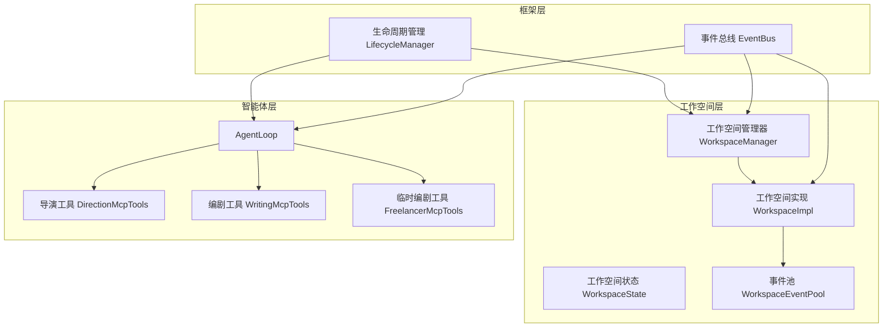
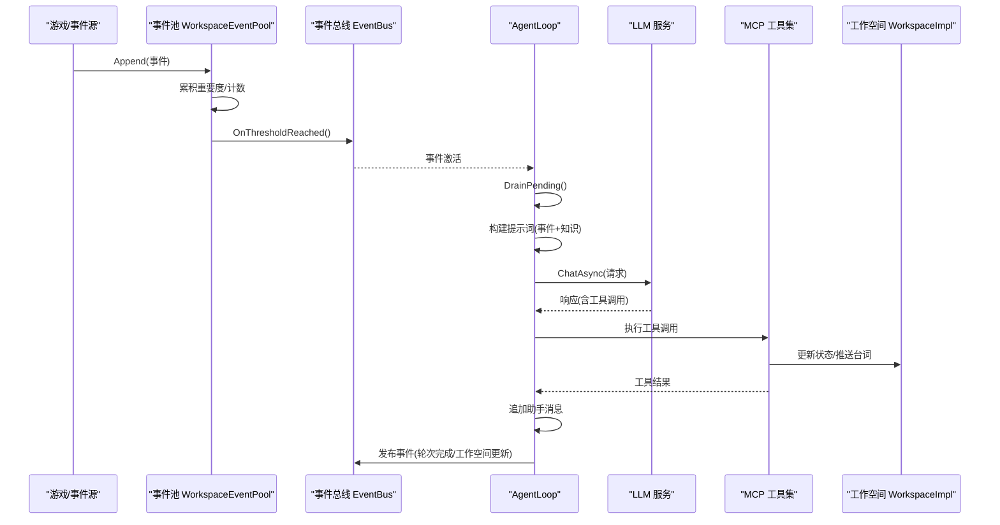
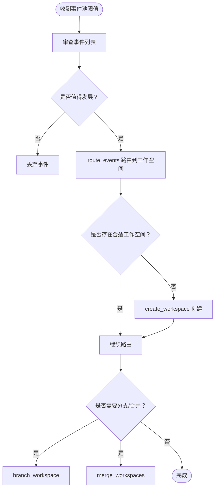
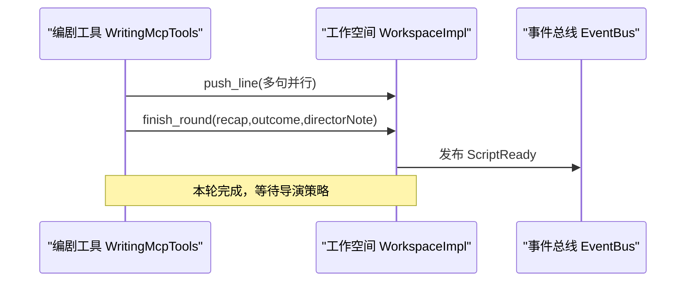
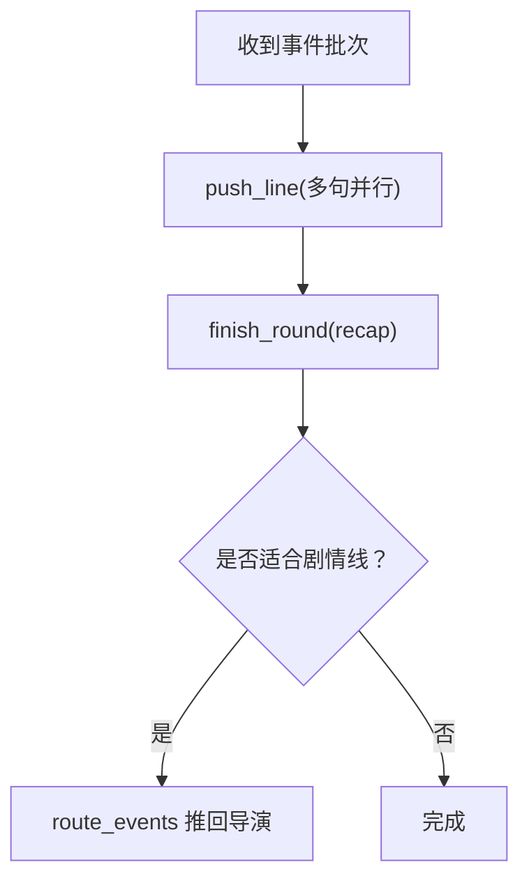
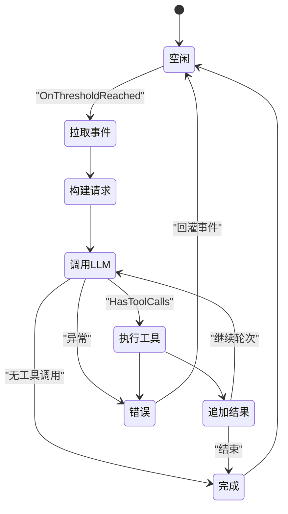
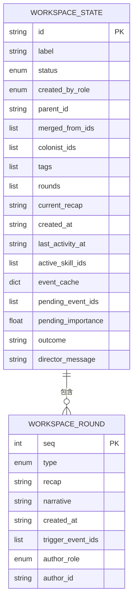
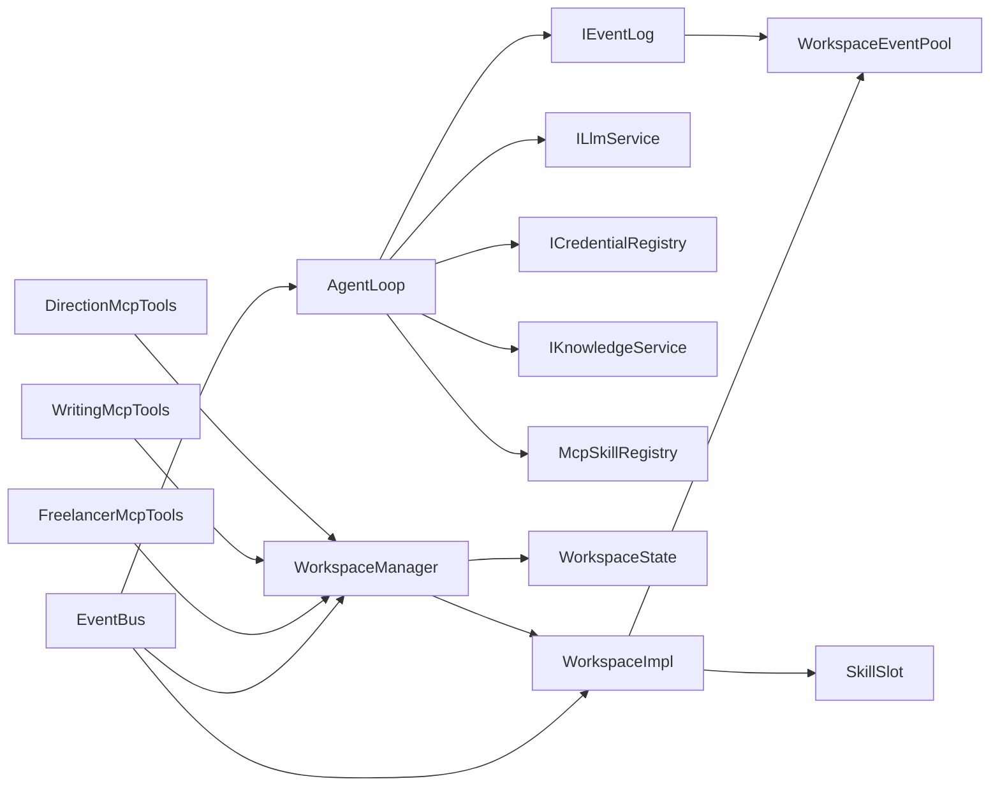

# 多智能体系统

<cite>
**本文引用的文件**
- [AgentLoop.cs](file://src/NPCLife/Agent/AgentLoop.cs)
- [EventBus.cs](file://src/NPCLife/Framework/EventBus.cs)
- [IEventLog.cs](file://src/NPCLife/Core/IEventLog.cs)
- [WorkspaceEventPool.cs](file://src/NPCLife/Workspace/WorkspaceEventPool.cs)
- [WorkspaceState.cs](file://src/NPCLife/Workspace/WorkspaceState.cs)
- [WorkspaceImpl.cs](file://src/NPCLife/Workspace/WorkspaceImpl.cs)
- [WorkspaceManager.cs](file://src/NPCLife/Workspace/WorkspaceManager.cs)
- [DirectionMcpTools.cs](file://src/NPCLife/Workspace/DirectionMcpTools.cs)
- [WritingMcpTools.cs](file://src/NPCLife/Workspace/WritingMcpTools.cs)
- [FreelancerMcpTools.cs](file://src/NPCLife/Workspace/FreelancerMcpTools.cs)
- [DirectorPrompt.txt](file://src/NPCLife/Prompts/DirectorPrompt.txt)
- [ScreenwriterPrompt.txt](file://src/NPCLife/Prompts/ScreenwriterPrompt.txt)
- [FreelancerPrompt.txt](file://src/NPCLife/Prompts/FreelancerPrompt.txt)
- [LifecycleManager.cs](file://src/NPCLife/Framework/LifecycleManager.cs)
</cite>

## 目录
1. [引言](#引言)
2. [项目结构](#项目结构)
3. [核心组件](#核心组件)
4. [架构总览](#架构总览)
5. [详细组件分析](#详细组件分析)
6. [依赖分析](#依赖分析)
7. [性能考虑](#性能考虑)
8. [故障排查指南](#故障排查指南)
9. [结论](#结论)
10. [附录](#附录)

## 引言
本文件面向多智能体系统（Director 导演、Screenwriter 编剧、Freelancer 临时编剧）的协作机制进行系统化技术文档化，覆盖设计理念、职责边界、决策逻辑、异步消息传递、状态同步与策略调整、角色切换与状态转换规则，并提供基于仓库实际代码的可视化流程与参考路径，帮助读者快速理解并扩展该系统。

## 项目结构
多智能体系统围绕“工作空间”（Workspace）组织，每个工作空间是一个上下文容器，承载事件池、技能槽、轮次叙事日志与状态。智能体通过 MCP 工具与工作空间交互，事件通过事件池按阈值异步激活 AgentLoop，形成“事件驱动 + 工具调用”的闭环。

图表来源
- [WorkspaceManager.cs:19-616](file://src/NPCLife/Workspace/WorkspaceManager.cs#L19-L616)
- [WorkspaceImpl.cs:16-197](file://src/NPCLife/Workspace/WorkspaceImpl.cs#L16-L197)
- [WorkspaceEventPool.cs:21-186](file://src/NPCLife/Workspace/WorkspaceEventPool.cs#L21-L186)
- [AgentLoop.cs:43-581](file://src/NPCLife/Agent/AgentLoop.cs#L43-L581)
- [DirectionMcpTools.cs:16-460](file://src/NPCLife/Workspace/DirectionMcpTools.cs#L16-L460)
- [WritingMcpTools.cs:16-313](file://src/NPCLife/Workspace/WritingMcpTools.cs#L16-L313)
- [FreelancerMcpTools.cs:21-274](file://src/NPCLife/Workspace/FreelancerMcpTools.cs#L21-L274)
- [EventBus.cs:17-243](file://src/NPCLife/Framework/EventBus.cs#L17-L243)
- [LifecycleManager.cs:23-264](file://src/NPCLife/Framework/LifecycleManager.cs#L23-L264)

章节来源
- [WorkspaceManager.cs:19-616](file://src/NPCLife/Workspace/WorkspaceManager.cs#L19-L616)
- [WorkspaceImpl.cs:16-197](file://src/NPCLife/Workspace/WorkspaceImpl.cs#L16-L197)
- [WorkspaceEventPool.cs:21-186](file://src/NPCLife/Workspace/WorkspaceEventPool.cs#L21-L186)
- [AgentLoop.cs:43-581](file://src/NPCLife/Agent/AgentLoop.cs#L43-L581)
- [EventBus.cs:17-243](file://src/NPCLife/Framework/EventBus.cs#L17-L243)
- [LifecycleManager.cs:23-264](file://src/NPCLife/Framework/LifecycleManager.cs#L23-L264)

## 核心组件
- 工作空间管理器（WorkspaceManager）：负责工作空间的 CRUD、分支/合并、事件路由与持久化；作为导演的唯一入口。
- 工作空间实现（WorkspaceImpl）：封装 WorkspaceState，暴露事件池、技能槽与叙事操作（PushLine、FinishRound）。
- 事件池（WorkspaceEventPool）：实现 IEventLog，提供 append-only 写入、阈值激活、DrainPending 等能力。
- 智能体循环（AgentLoop）：被动激活（OnThresholdReached），构建请求、调用 LLM、执行工具、追加结果、发布事件。
- 事件总线（EventBus）：统一发布/订阅，支持优先级与错误隔离。
- 导演工具（DirectionMcpTools）：create/list/get/suspend/resume/close/branch/merge/route_events。
- 编剧工具（WritingMcpTools）：get_workspace/push_line/finish_round/route_events。
- 临时编剧工具（FreelancerMcpTools）：轻量视图与相同工具族，但不维护剧情上下文。
- 生命周期管理（LifecycleManager）：统一初始化、配置就绪、销毁与重置。

章节来源
- [WorkspaceManager.cs:19-616](file://src/NPCLife/Workspace/WorkspaceManager.cs#L19-L616)
- [WorkspaceImpl.cs:16-197](file://src/NPCLife/Workspace/WorkspaceImpl.cs#L16-L197)
- [WorkspaceEventPool.cs:21-186](file://src/NPCLife/Workspace/WorkspaceEventPool.cs#L21-L186)
- [AgentLoop.cs:43-581](file://src/NPCLife/Agent/AgentLoop.cs#L43-L581)
- [DirectionMcpTools.cs:16-460](file://src/NPCLife/Workspace/DirectionMcpTools.cs#L16-L460)
- [WritingMcpTools.cs:16-313](file://src/NPCLife/Workspace/WritingMcpTools.cs#L16-L313)
- [FreelancerMcpTools.cs:21-274](file://src/NPCLife/Workspace/FreelancerMcpTools.cs#L21-L274)
- [EventBus.cs:17-243](file://src/NPCLife/Framework/EventBus.cs#L17-L243)
- [LifecycleManager.cs:23-264](file://src/NPCLife/Framework/LifecycleManager.cs#L23-L264)

## 架构总览
多智能体系统采用“事件驱动 + 工具调用”的异步协作模式：
- 事件进入工作空间事件池，达到阈值后通过 EventBus 通知 AgentLoop。
- AgentLoop 构建提示词（包含事件列表与知识注入），调用 LLM，执行工具（MCP），并将工具结果注入消息历史。
- 工具调用由导演/编剧/临时编剧三套工具提供者实现，分别对应不同的职责与权限。
- 工具调用完成后，系统通过 EventBus 发布事件，驱动工作空间状态更新与脚本投递。

图表来源
- [WorkspaceEventPool.cs:49-90](file://src/NPCLife/Workspace/WorkspaceEventPool.cs#L49-L90)
- [EventBus.cs:86-113](file://src/NPCLife/Framework/EventBus.cs#L86-L113)
- [AgentLoop.cs:171-337](file://src/NPCLife/Agent/AgentLoop.cs#L171-L337)
- [WorkspaceImpl.cs:83-182](file://src/NPCLife/Workspace/WorkspaceImpl.cs#L83-L182)

## 详细组件分析

### 导演（Director）设计与协作
- 职责范围
  - 审查事件列表，选择值得发展的事件。
  - 路由事件到合适工作空间，必要时创建/分支/合并工作空间。
  - 未被路由的事件丢弃。
- 决策原则
  - 相关事件合并到同一工作空间。
  - 参考编剧留言决定推送策略。
  - 无明显因果关系的事件推送给临时编剧。
  - 可分支/合并现有工作空间。
- 工具与交互
  - 使用 create_workspace、branch_workspace、merge_workspaces、list_workspaces、get_workspace、suspend/resume/close 等管理工具。
  - 使用 route_events 将事件从源工作空间路由到目标工作空间。
- 事件路由
  - 事件具有 eventId，通过 route_events 推送到对应工作空间。
  - 无合适工作空间时，先 create_workspace 再 route_events。

图表来源
- [DirectorPrompt.txt:1-18](file://src/NPCLife/Prompts/DirectorPrompt.txt#L1-L18)
- [DirectionMcpTools.cs:50-361](file://src/NPCLife/Workspace/DirectionMcpTools.cs#L50-L361)
- [WorkspaceManager.cs:382-392](file://src/NPCLife/Workspace/WorkspaceManager.cs#L382-L392)

章节来源
- [DirectorPrompt.txt:1-18](file://src/NPCLife/Prompts/DirectorPrompt.txt#L1-L18)
- [DirectionMcpTools.cs:16-460](file://src/NPCLife/Workspace/DirectionMcpTools.cs#L16-L460)
- [WorkspaceManager.cs:19-616](file://src/NPCLife/Workspace/WorkspaceManager.cs#L19-L616)

### 编剧（Screenwriter）设计与协作
- 职责范围
  - 审查推送到本工作空间的事件。
  - 根据需要调用角色/环境感知等工具获取上下文。
  - 使用 push_line 逐句撰写台词，完成后调用 finish_round。
- 工作原则
  - 优先使用 push_line 逐句输出以降低等待延迟。
  - 可并行调用多个 push_line 以减少往返。
  - 必须在所有台词写完后调用 finish_round。
  - recap 总结本轮叙事起点，outcome 简述结果，directorNote 给导演留言。
  - 每次激活只推送 1 个轮次。
  - 如事件不适合本剧情线，可用 route_events 推回导演工作空间。
- 与导演协作
  - 编剧在 finish_round 中向导演留言，指导后续策略。
  - 导演据此决定是否继续、分支或合并。

图表来源
- [ScreenwriterPrompt.txt:1-17](file://src/NPCLife/Prompts/ScreenwriterPrompt.txt#L1-L17)
- [WritingMcpTools.cs:77-152](file://src/NPCLife/Workspace/WritingMcpTools.cs#L77-L152)
- [WorkspaceImpl.cs:125-182](file://src/NPCLife/Workspace/WorkspaceImpl.cs#L125-L182)

章节来源
- [ScreenwriterPrompt.txt:1-17](file://src/NPCLife/Prompts/ScreenwriterPrompt.txt#L1-L17)
- [WritingMcpTools.cs:16-313](file://src/NPCLife/Workspace/WritingMcpTools.cs#L16-L313)
- [WorkspaceImpl.cs:83-182](file://src/NPCLife/Workspace/WorkspaceImpl.cs#L83-L182)

### 临时编剧（Freelancer）设计与协作
- 职责范围
  - 处理突发性、独立性的事件（日常对话、随机遭遇、环境变化等）。
  - 不维护跨轮次的剧情上下文。
  - 调用工具获取当前状态，使用 push_line 输出，完成后调用 finish_round。
- 工作原则
  - 每次激活都是独立任务，不维护剧情延续性。
  - 叙事风格保持轻快、即兴、快速响应。
  - 每次激活只处理当前批次事件，输出 1 个轮次。
  - recap 只总结本次事件批次，不需要回顾历史。
  - 可并行调用多个 push_line。
  - 必须在所有台词写完后调用 finish_round。
  - 如事件更适合某条剧情线，用 route_events 推回导演工作空间。
  - 不负责汇报剧情线推进状态。
- 与导演/编剧协作
  - 通过 route_events 将不适合的事件推回导演。
  - 不维护叙事轮次历史，视图更轻量。

图表来源
- [FreelancerPrompt.txt:1-18](file://src/NPCLife/Prompts/FreelancerPrompt.txt#L1-L18)
- [FreelancerMcpTools.cs:87-154](file://src/NPCLife/Workspace/FreelancerMcpTools.cs#L87-L154)
- [WorkspaceImpl.cs:125-182](file://src/NPCLife/Workspace/WorkspaceImpl.cs#L125-L182)

章节来源
- [FreelancerPrompt.txt:1-18](file://src/NPCLife/Prompts/FreelancerPrompt.txt#L1-L18)
- [FreelancerMcpTools.cs:21-274](file://src/NPCLife/Workspace/FreelancerMcpTools.cs#L21-L274)
- [WorkspaceImpl.cs:83-182](file://src/NPCLife/Workspace/WorkspaceImpl.cs#L83-L182)

### 智能体循环（AgentLoop）与异步消息传递
- 状态机与生命周期
  - 显式状态机：Idle → DrainingEvents → BuildingRequest → CallingLlm → ExecutingTools → AppendingToolResults → Finishing → Error。
  - 通过 SemaphoreSlim 防重入，CancellationToken 贯穿链路。
  - 通过订阅 IEventLog.OnThresholdReached 被动激活。
- 请求构建与 LLM 调用
  - 构建用户消息（事件列表 + 知识注入），生成 LlmRequest。
  - 通过 AgentPipeline 运行拦截器（Before/After LLM、Before/After Tool Call）。
  - 发布框架事件（AgentActivated、LlmRequestSent、LlmResponseReceived、ToolInvoking、ToolInvoked、AgentRoundComplete、AgentLoopFinished）。
- 工具调用与结果注入
  - 工具调用前/后均支持拦截器，确保可观测性与可扩展性。
  - 将工具结果注入消息历史，维持严格的 assistant + tool_results 结构。
- 错误处理与回灌
  - 异常时将已 drain 的事件回灌至事件池，等待重试。
  - 统一发布错误事件并记录日志。

图表来源
- [AgentLoop.cs:19-29](file://src/NPCLife/Agent/AgentLoop.cs#L19-L29)
- [AgentLoop.cs:171-337](file://src/NPCLife/Agent/AgentLoop.cs#L171-L337)
- [EventBus.cs:186-242](file://src/NPCLife/Framework/EventBus.cs#L186-L242)

章节来源
- [AgentLoop.cs:43-581](file://src/NPCLife/Agent/AgentLoop.cs#L43-L581)
- [EventBus.cs:17-243](file://src/NPCLife/Framework/EventBus.cs#L17-L243)

### 工作空间状态与事件路由
- 工作空间状态
  - Active：活跃中，编剧可继续推送回合。
  - Suspended：挂起，保留数据但暂停回合推送。
  - Completed/Abandoned：完结/废弃。
- 事件路由
  - WorkspaceManager.RouteEvents 将事件追加到目标工作空间事件池。
  - 事件池达到阈值后触发 AgentLoop。
- 分支/合并
  - Branch：复制父空间轮次历史，追加 Branch 轮。
  - Merge：按序号去重合并，追加 Merge 轮，源空间标记为 Abandoned。

图表来源
- [WorkspaceState.cs:94-151](file://src/NPCLife/Workspace/WorkspaceState.cs#L94-L151)

章节来源
- [WorkspaceState.cs:9-53](file://src/NPCLife/Workspace/WorkspaceState.cs#L9-L53)
- [WorkspaceManager.cs:382-392](file://src/NPCLife/Workspace/WorkspaceManager.cs#L382-L392)
- [WorkspaceManager.cs:193-263](file://src/NPCLife/Workspace/WorkspaceManager.cs#L193-L263)
- [WorkspaceManager.cs:269-376](file://src/NPCLife/Workspace/WorkspaceManager.cs#L269-L376)

## 依赖分析
- 组件耦合
  - AgentLoop 依赖 IEventLog（WorkspaceEventPool 实现）、ILlmService、ICredentialRegistry、IKnowledgeService、ILogger、McpSkillRegistry。
  - WorkspaceManager 依赖 IAuthorityStore、ILogger、DriverConfig、ICardSerializer。
  - WorkspaceImpl 依赖 WorkspaceState、WorkspaceEventPool、SkillSlot、ILogger。
  - 三套 MCP 工具提供者（DirectionMcpTools、WritingMcpTools、FreelancerMcpTools）通过 IMcpHookProvider 注入 WorkspaceManager 与 ILogger。
- 外部依赖与集成点
  - 事件总线 EventBus 提供跨组件解耦。
  - 生命周期管理 LifecycleManager 统一组件初始化与销毁。
- 潜在循环依赖
  - 通过接口与工厂注入避免直接循环依赖；工具提供者通过 Func<IWorkspaceManager> 注入，降低耦合。

图表来源
- [AgentLoop.cs:45-116](file://src/NPCLife/Agent/AgentLoop.cs#L45-L116)
- [WorkspaceManager.cs:21-40](file://src/NPCLife/Workspace/WorkspaceManager.cs#L21-L40)
- [WorkspaceImpl.cs:18-46](file://src/NPCLife/Workspace/WorkspaceImpl.cs#L18-L46)
- [DirectionMcpTools.cs:18-25](file://src/NPCLife/Workspace/DirectionMcpTools.cs#L18-L25)
- [WritingMcpTools.cs:18-25](file://src/NPCLife/Workspace/WritingMcpTools.cs#L18-L25)
- [FreelancerMcpTools.cs:23-30](file://src/NPCLife/Workspace/FreelancerMcpTools.cs#L23-L30)
- [EventBus.cs:17-243](file://src/NPCLife/Framework/EventBus.cs#L17-L243)

章节来源
- [AgentLoop.cs:43-581](file://src/NPCLife/Agent/AgentLoop.cs#L43-L581)
- [WorkspaceManager.cs:19-616](file://src/NPCLife/Workspace/WorkspaceManager.cs#L19-L616)
- [WorkspaceImpl.cs:16-197](file://src/NPCLife/Workspace/WorkspaceImpl.cs#L16-L197)
- [DirectionMcpTools.cs:16-460](file://src/NPCLife/Workspace/DirectionMcpTools.cs#L16-L460)
- [WritingMcpTools.cs:16-313](file://src/NPCLife/Workspace/WritingMcpTools.cs#L16-L313)
- [FreelancerMcpTools.cs:21-274](file://src/NPCLife/Workspace/FreelancerMcpTools.cs#L21-L274)
- [EventBus.cs:17-243](file://src/NPCLife/Framework/EventBus.cs#L17-L243)

## 性能考虑
- 事件池阈值与批处理
  - 通过 DriverConfig 的有效阈值控制批量大小与重要度，减少频繁激活带来的开销。
  - 事件池在内存中维护 recent 历史，避免持久化带来的 IO 压力。
- 工具调用优化
  - 支持单轮多次 push_line 并行调用，减少往返次数。
  - 工具调用前后拦截器允许缓存与预处理，提升吞吐。
- 状态一致性
  - 通过 WorkspaceState 的持久化与 WorkspaceManager 的序列化/反序列化保障重启后状态恢复。
  - 事件池的 DrainPending 一次性消费，避免重复处理。
- 并发与防重入
  - AgentLoop 使用 SemaphoreSlim 防止并发运行；CancellationToken 保证取消路径可控。
  - 事件总线发布采用快照与异常隔离，避免单个订阅者影响整体。

## 故障排查指南
- AgentLoop 常见问题
  - 状态卡在 DrainingEvents/BuildingRequest：检查事件池是否正确达到阈值。
  - LLM 调用失败：检查凭证注册表、网络与模型可用性；查看 LlmError 事件。
  - 工具调用异常：检查工具定义与参数；关注 ToolInvoking/ToolInvoked 事件。
  - 回灌事件：确认 FailAndRequeue 是否被触发，检查事件池 PendingCount。
- 工作空间问题
  - 状态不可转换：检查 WorkspaceManager.IsValidTransition 与状态约束。
  - 事件路由失败：确认源/目标工作空间存在且处于 Active 状态。
  - 轻量视图缺失：临时编剧不返回轮次历史，属于预期行为。
- 生命周期与事件总线
  - 初始化失败：检查 LifecycleManager 的 OnInit/OnConfigReady 钩子。
  - 订阅丢失：确认 EventBus 的订阅与清理逻辑，避免 Shutdown 后仍有订阅。

章节来源
- [AgentLoop.cs:370-396](file://src/NPCLife/Agent/AgentLoop.cs#L370-L396)
- [WorkspaceManager.cs:406-423](file://src/NPCLife/Workspace/WorkspaceManager.cs#L406-L423)
- [EventBus.cs:86-113](file://src/NPCLife/Framework/EventBus.cs#L86-L113)
- [LifecycleManager.cs:159-240](file://src/NPCLife/Framework/LifecycleManager.cs#L159-L240)

## 结论
该多智能体系统通过“事件驱动 + 工具调用”的模式实现了导演、编剧与临时编剧的清晰分工与高效协作。导演负责结构化管理与事件路由，编剧专注于叙事内容与上下文沉淀，临时编剧处理突发与独立事件。事件总线与工作空间状态机确保了异步消息传递与状态一致性，生命周期管理提供了稳健的启动/销毁/重置能力。通过阈值控制、并行工具调用与拦截器扩展，系统在性能与可扩展性之间取得良好平衡。

## 附录
- 角色切换与状态转换规则
  - 工作空间状态转换：Active/Suspended → Active/Suspended/Completed/Abandoned；Completed/Abandoned 不再转换。
  - 分支/合并：仅导演可操作，内部校验并生成结构轮。
  - 事件路由：仅活跃工作空间可接收；路由失败时返回警告信息。
- 异步消息传递要点
  - 事件池阈值触发 AgentLoop；AgentLoop 发布多类框架事件；工作空间实现发布 ScriptReady/ScriptLineReady；导演/编剧/临时编剧工具发布相应事件。
- 代码示例参考路径
  - 导演创建/分支/合并/路由：[DirectionMcpTools.cs:50-361](file://src/NPCLife/Workspace/DirectionMcpTools.cs#L50-L361)
  - 编剧推送台词/结束轮次：[WritingMcpTools.cs:77-152](file://src/NPCLife/Workspace/WritingMcpTools.cs#L77-L152)
  - 临时编剧推送台词/结束轮次：[FreelancerMcpTools.cs:87-154](file://src/NPCLife/Workspace/FreelancerMcpTools.cs#L87-L154)
  - 事件池阈值与激活：[WorkspaceEventPool.cs:81-90](file://src/NPCLife/Workspace/WorkspaceEventPool.cs#L81-L90)
  - AgentLoop 主循环与事件发布：[AgentLoop.cs:171-337](file://src/NPCLife/Agent/AgentLoop.cs#L171-L337)
  - 工作空间状态与轮次：[WorkspaceState.cs:94-151](file://src/NPCLife/Workspace/WorkspaceState.cs#L94-L151)
  - 生命周期管理：[LifecycleManager.cs:159-240](file://src/NPCLife/Framework/LifecycleManager.cs#L159-L240)