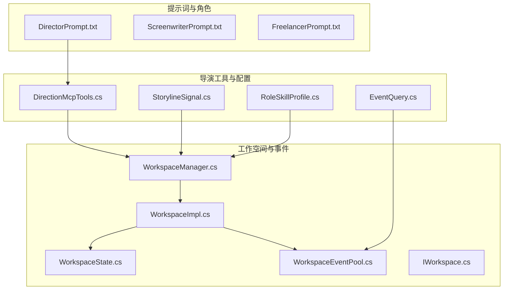
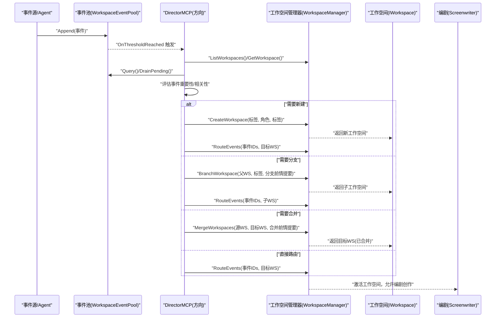
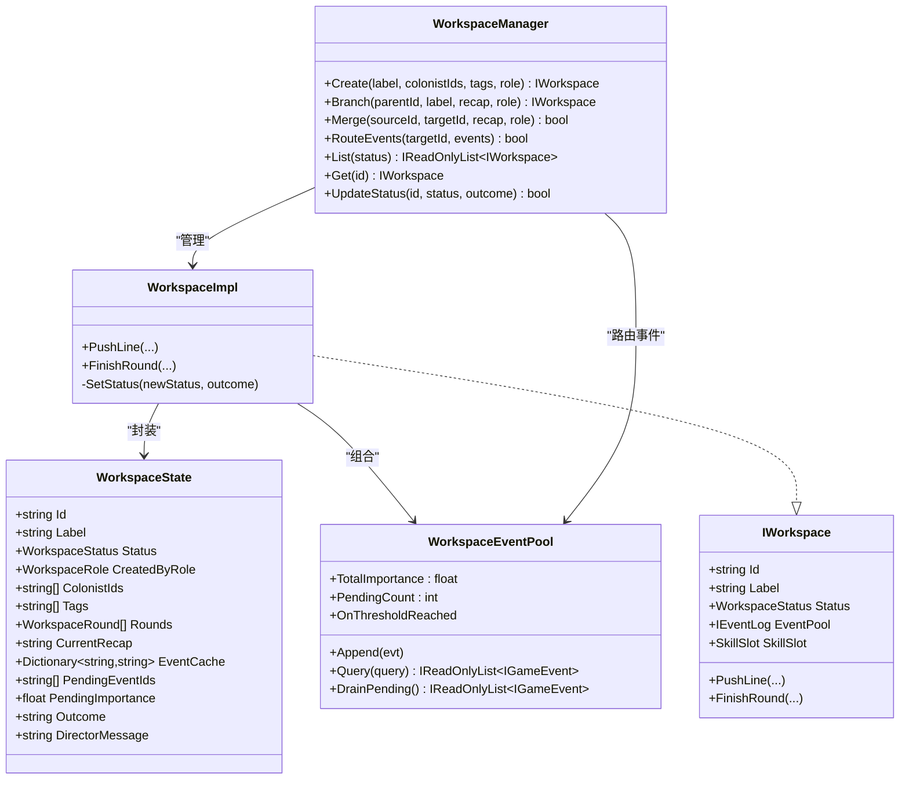
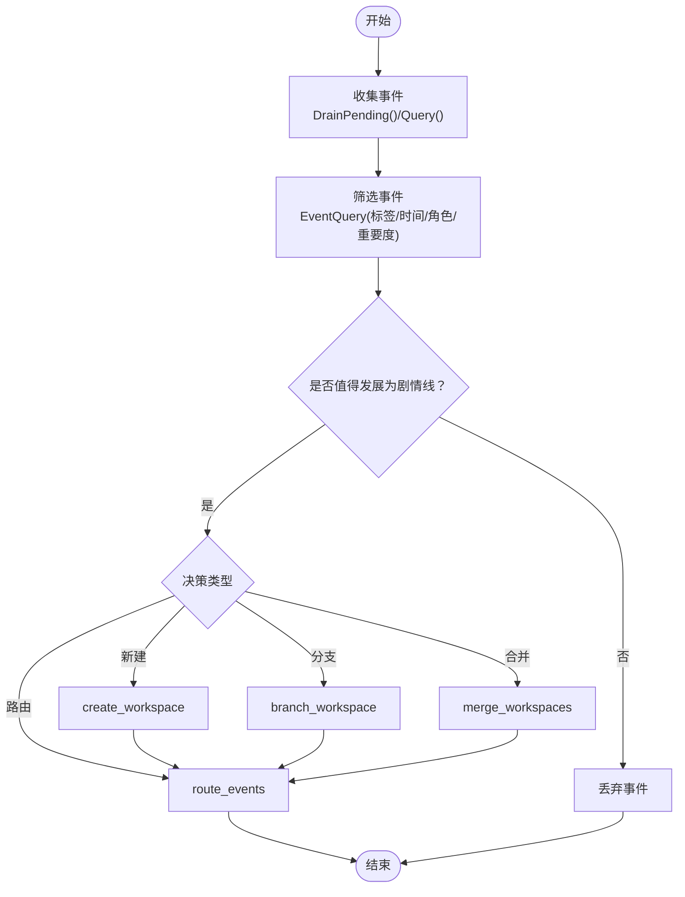
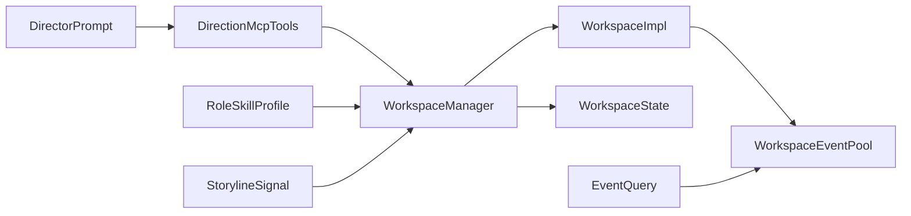

# 导演角色（Director）

<cite>
**本文引用的文件**
- [DirectorPrompt.txt](file://src/NPCLife/Prompts/DirectorPrompt.txt)
- [DirectionMcpTools.cs](file://src/NPCLife/Workspace/DirectionMcpTools.cs)
- [WorkspaceEventPool.cs](file://src/NPCLife/Workspace/WorkspaceEventPool.cs)
- [IWorkspace.cs](file://src/NPCLife/Workspace/IWorkspace.cs)
- [WorkspaceImpl.cs](file://src/NPCLife/Workspace/WorkspaceImpl.cs)
- [WorkspaceManager.cs](file://src/NPCLife/Workspace/WorkspaceManager.cs)
- [WorkspaceState.cs](file://src/NPCLife/Workspace/WorkspaceState.cs)
- [StorylineSignal.cs](file://src/NPCLife/Workspace/StorylineSignal.cs)
- [EventQuery.cs](file://src/NPCLife/Core/EventQuery.cs)
- [RoleSkillProfile.cs](file://src/NPCLife/Workspace/RoleSkillProfile.cs)
- [ScreenwriterPrompt.txt](file://src/NPCLife/Prompts/ScreenwriterPrompt.txt)
- [FreelancerPrompt.txt](file://src/NPCLife/Prompts/FreelancerPrompt.txt)
</cite>

## 目录
1. [简介](#简介)
2. [项目结构](#项目结构)
3. [核心组件](#核心组件)
4. [架构总览](#架构总览)
5. [详细组件分析](#详细组件分析)
6. [依赖关系分析](#依赖关系分析)
7. [性能考量](#性能考量)
8. [故障排查指南](#故障排查指南)
9. [结论](#结论)
10. [附录](#附录)

## 简介
本文件面向多智能体系统中的“导演角色（Director）”，系统性阐述其在剧情调度与工作空间结构管理方面的职责、机制与最佳实践。Director 是最高决策者，负责：
- 接收并审查来自事件池的事件，进行优先级与重要性评估；
- 基于事件与编剧信号，判断是否将事件发展为剧情线；
- 使用 MCP 工具创建、分支、合并与路由工作空间；
- 与其他角色（编剧、临时工）形成清晰的协作闭环。

## 项目结构
围绕 Director 的关键代码分布在以下模块：
- 提示词与角色定位：DirectorPrompt、ScreenwriterPrompt、FreelancerPrompt
- 工作空间与事件池：WorkspaceState、WorkspaceEventPool、IWorkspace、WorkspaceImpl、WorkspaceManager
- 导演专用 MCP 工具：DirectionMcpTools
- 角色技能配置：RoleSkillProfile
- 信号与查询：StorylineSignal、EventQuery

图表来源
- [DirectorPrompt.txt:1-18](file://src/NPCLife/Prompts/DirectorPrompt.txt#L1-L18)
- [DirectionMcpTools.cs:1-460](file://src/NPCLife/Workspace/DirectionMcpTools.cs#L1-L460)
- [WorkspaceManager.cs:1-616](file://src/NPCLife/Workspace/WorkspaceManager.cs#L1-L616)
- [WorkspaceImpl.cs:1-197](file://src/NPCLife/Workspace/WorkspaceImpl.cs#L1-L197)
- [WorkspaceEventPool.cs:1-186](file://src/NPCLife/Workspace/WorkspaceEventPool.cs#L1-L186)
- [WorkspaceState.cs:1-152](file://src/NPCLife/Workspace/WorkspaceState.cs#L1-L152)
- [StorylineSignal.cs:1-46](file://src/NPCLife/Workspace/StorylineSignal.cs#L1-L46)
- [EventQuery.cs:1-48](file://src/NPCLife/Core/EventQuery.cs#L1-L48)
- [RoleSkillProfile.cs:1-74](file://src/NPCLife/Workspace/RoleSkillProfile.cs#L1-L74)

章节来源
- [DirectorPrompt.txt:1-18](file://src/NPCLife/Prompts/DirectorPrompt.txt#L1-L18)
- [DirectionMcpTools.cs:1-460](file://src/NPCLife/Workspace/DirectionMcpTools.cs#L1-L460)
- [WorkspaceManager.cs:1-616](file://src/NPCLife/Workspace/WorkspaceManager.cs#L1-L616)
- [WorkspaceImpl.cs:1-197](file://src/NPCLife/Workspace/WorkspaceImpl.cs#L1-L197)
- [WorkspaceEventPool.cs:1-186](file://src/NPCLife/Workspace/WorkspaceEventPool.cs#L1-L186)
- [WorkspaceState.cs:1-152](file://src/NPCLife/Workspace/WorkspaceState.cs#L1-L152)
- [StorylineSignal.cs:1-46](file://src/NPCLife/Workspace/StorylineSignal.cs#L1-L46)
- [EventQuery.cs:1-48](file://src/NPCLife/Core/EventQuery.cs#L1-L48)
- [RoleSkillProfile.cs:1-74](file://src/NPCLife/Workspace/RoleSkillProfile.cs#L1-L74)

## 核心组件
- 导演提示词（DirectorPrompt）：定义职责边界、决策原则与事件路由策略，明确“挑选值得发展的事件”“使用 route_events 路由到工作空间”“未被路由的事件丢弃”的流程。
- 导演 MCP 工具（DirectionMcpTools）：提供 create_workspace、branch_workspace、merge_workspaces、route_events 等能力，并以 IMcpHookProvider 注入 WorkspaceManager 与日志器，实现零静态耦合。
- 工作空间与事件池（WorkspaceState、WorkspaceEventPool、IWorkspace、WorkspaceImpl、WorkspaceManager）：统一承载事件缓存、轮次日志、状态机与持久化；事件池支持阈值触发与最近事件缓冲，支撑 Director 的审查与路由。
- 角色技能配置（RoleSkillProfile）：为 Director 预置“全局感知 + 结构管理”技能集，确保其具备全局视图与结构决策能力。
- 信号与查询（StorylineSignal、EventQuery）：编剧通过信号反馈推进状态，Director 基于此与事件重要性共同决策；EventQuery 为事件检索提供灵活筛选。

章节来源
- [DirectorPrompt.txt:1-18](file://src/NPCLife/Prompts/DirectorPrompt.txt#L1-L18)
- [DirectionMcpTools.cs:1-460](file://src/NPCLife/Workspace/DirectionMcpTools.cs#L1-L460)
- [WorkspaceState.cs:1-152](file://src/NPCLife/Workspace/WorkspaceState.cs#L1-L152)
- [WorkspaceEventPool.cs:1-186](file://src/NPCLife/Workspace/WorkspaceEventPool.cs#L1-L186)
- [IWorkspace.cs:1-51](file://src/NPCLife/Workspace/IWorkspace.cs#L1-L51)
- [WorkspaceImpl.cs:1-197](file://src/NPCLife/Workspace/WorkspaceImpl.cs#L1-L197)
- [WorkspaceManager.cs:1-616](file://src/NPCLife/Workspace/WorkspaceManager.cs#L1-L616)
- [RoleSkillProfile.cs:1-74](file://src/NPCLife/Workspace/RoleSkillProfile.cs#L1-L74)
- [StorylineSignal.cs:1-46](file://src/NPCLife/Workspace/StorylineSignal.cs#L1-L46)
- [EventQuery.cs:1-48](file://src/NPCLife/Core/EventQuery.cs#L1-L48)

## 架构总览
Director 在多智能体系统中的定位是“结构管理者 + 决策中枢”。其工作流如下：
- 事件采集：各 Agent 将事件写入各自工作空间的事件池，或写入公共事件池（由 WorkspaceManager 路由）。
- 事件审查：Director 通过 MCP 工具查询活跃工作空间、读取事件池、结合编剧信号与事件重要性进行评估。
- 决策执行：根据评估结果，选择 create_workspace 新建、branch_workspace 分支、merge_workspaces 合并，或使用 route_events 将事件路由到合适工作空间。
- 结果反馈：未被路由的事件被丢弃；已路由的事件进入相应工作空间继续由编剧创作。

图表来源
- [DirectionMcpTools.cs:1-460](file://src/NPCLife/Workspace/DirectionMcpTools.cs#L1-L460)
- [WorkspaceManager.cs:1-616](file://src/NPCLife/Workspace/WorkspaceManager.cs#L1-L616)
- [WorkspaceEventPool.cs:1-186](file://src/NPCLife/Workspace/WorkspaceEventPool.cs#L1-L186)
- [IWorkspace.cs:1-51](file://src/NPCLife/Workspace/IWorkspace.cs#L1-L51)

## 详细组件分析

### 导演提示词设计原理与决策逻辑
- 职责边界：审查事件、挑选值得发展的事件、路由到工作空间、丢弃未路由事件。
- 决策原则：
  - 相关事件可合并到同一工作空间（如同一场袭击中的多个角色受伤）。
  - 参考剧情编剧留言决定推送策略。
  - 无明显因果关系的事件视为临时事件，推送给临时编剧。
  - 可用分支/合并管理剧情走向。
- 事件路由：每条事件带 eventId，使用 route_events 推送至对应工作空间；无合适空间时先 create_workspace 再路由。

章节来源
- [DirectorPrompt.txt:1-18](file://src/NPCLife/Prompts/DirectorPrompt.txt#L1-L18)

### 导演 MCP 工具集与工作空间生命周期
- 工具清单：
  - 创建：create_workspace（标签、角色、可选角色ID与语义标签）
  - 查询：list_workspaces、get_workspace
  - 生命周期：suspend_workspace、resume_workspace、close_workspace
  - 分支/合并：branch_workspace、merge_workspaces
  - 事件路由：route_events（支持附加留言与关键词）
- 设计要点：
  - 通过 IMcpHookProvider 注入 WorkspaceManager 与日志器，零静态耦合。
  - route_events 支持深拷贝事件并附加关键词，便于后续知识库检索增强。
  - 返回导演视图（不含叙事内容，含信号与统计）。

章节来源
- [DirectionMcpTools.cs:1-460](file://src/NPCLife/Workspace/DirectionMcpTools.cs#L1-L460)

### 工作空间与事件池
- WorkspaceState：承载工作空间元数据、轮次日志、事件缓存、待处理事件队列与累积重要度。
- WorkspaceEventPool：双层缓冲（持久化 pending + 内存 recent），支持阈值触发与灵活查询。
- WorkspaceImpl：封装状态与组件，提供 PushLine/FinishRound 等叙事操作，限制调用方角色。
- WorkspaceManager：CRUD、分支/合并、事件路由、状态机与持久化。

图表来源
- [WorkspaceState.cs:1-152](file://src/NPCLife/Workspace/WorkspaceState.cs#L1-L152)
- [WorkspaceEventPool.cs:1-186](file://src/NPCLife/Workspace/WorkspaceEventPool.cs#L1-L186)
- [IWorkspace.cs:1-51](file://src/NPCLife/Workspace/IWorkspace.cs#L1-L51)
- [WorkspaceImpl.cs:1-197](file://src/NPCLife/Workspace/WorkspaceImpl.cs#L1-L197)
- [WorkspaceManager.cs:1-616](file://src/NPCLife/Workspace/WorkspaceManager.cs#L1-L616)

章节来源
- [WorkspaceState.cs:1-152](file://src/NPCLife/Workspace/WorkspaceState.cs#L1-L152)
- [WorkspaceEventPool.cs:1-186](file://src/NPCLife/Workspace/WorkspaceEventPool.cs#L1-L186)
- [IWorkspace.cs:1-51](file://src/NPCLife/Workspace/IWorkspace.cs#L1-L51)
- [WorkspaceImpl.cs:1-197](file://src/NPCLife/Workspace/WorkspaceImpl.cs#L1-L197)
- [WorkspaceManager.cs:1-616](file://src/NPCLife/Workspace/WorkspaceManager.cs#L1-L616)

### 事件审查流程与工作空间创建
- 事件审查：
  - 通过 WorkspaceEventPool.Query/DrainPending 获取事件集合。
  - 结合 EventQuery 的标签、时间窗、角色、最小重要度等条件筛选。
  - 依据事件重要度与相关性，参考编剧信号（StorylineSignal）与提示词原则进行决策。
- 工作空间创建：
  - 使用 create_workspace 创建新线，标签与角色固定为 Director。
  - 若事件相关性强且具备发展价值，直接路由到新工作空间。
  - 若事件更适合作为临时事件，路由到临时编剧工作空间。

图表来源
- [WorkspaceEventPool.cs:1-186](file://src/NPCLife/Workspace/WorkspaceEventPool.cs#L1-L186)
- [EventQuery.cs:1-48](file://src/NPCLife/Core/EventQuery.cs#L1-L48)
- [DirectionMcpTools.cs:1-460](file://src/NPCLife/Workspace/DirectionMcpTools.cs#L1-L460)
- [DirectorPrompt.txt:1-18](file://src/NPCLife/Prompts/DirectorPrompt.txt#L1-L18)

章节来源
- [WorkspaceEventPool.cs:1-186](file://src/NPCLife/Workspace/WorkspaceEventPool.cs#L1-L186)
- [EventQuery.cs:1-48](file://src/NPCLife/Core/EventQuery.cs#L1-L48)
- [DirectionMcpTools.cs:1-460](file://src/NPCLife/Workspace/DirectionMcpTools.cs#L1-L460)
- [DirectorPrompt.txt:1-18](file://src/NPCLife/Prompts/DirectorPrompt.txt#L1-L18)

### 导演的协调作用与角色交互
- 与编剧（Screenwriter）：
  - 编剧通过 finish_round 的 directorNote 反馈推进状态与期望事件类型。
  - 导演据此决定是否继续、分支或合并。
- 与临时工（Freelancer）：
  - 临时工处理独立事件，不维护剧情上下文；若事件更适合剧情线，通过 route_events 回推导演。
- 与系统（WorkspaceManager）：
  - 通过 MCP 工具调用 WorkspaceManager 的创建、分支、合并与路由能力，实现结构化管理。

章节来源
- [ScreenwriterPrompt.txt:1-17](file://src/NPCLife/Prompts/ScreenwriterPrompt.txt#L1-L17)
- [FreelancerPrompt.txt:1-18](file://src/NPCLife/Prompts/FreelancerPrompt.txt#L1-L18)
- [DirectionMcpTools.cs:1-460](file://src/NPCLife/Workspace/DirectionMcpTools.cs#L1-L460)
- [WorkspaceManager.cs:1-616](file://src/NPCLife/Workspace/WorkspaceManager.cs#L1-L616)

## 依赖关系分析
- 导演提示词驱动决策：DirectorPrompt 明确“挑选 + 路由 + 丢弃”的原则。
- 导演工具依赖 WorkspaceManager：DirectionMcpTools 通过 IMcpHookProvider 注入 WorkspaceManager，实现对工作空间的创建、分支、合并与路由。
- 工作空间内部依赖事件池：WorkspaceEventPool 提供事件缓存与阈值触发，支撑 Director 的审查与路由。
- 角色技能配置：RoleSkillProfile 为 Director 预置“全局感知 + 结构管理”技能集，确保其具备结构决策能力。

图表来源
- [DirectorPrompt.txt:1-18](file://src/NPCLife/Prompts/DirectorPrompt.txt#L1-L18)
- [DirectionMcpTools.cs:1-460](file://src/NPCLife/Workspace/DirectionMcpTools.cs#L1-L460)
- [WorkspaceManager.cs:1-616](file://src/NPCLife/Workspace/WorkspaceManager.cs#L1-L616)
- [WorkspaceImpl.cs:1-197](file://src/NPCLife/Workspace/WorkspaceImpl.cs#L1-L197)
- [WorkspaceEventPool.cs:1-186](file://src/NPCLife/Workspace/WorkspaceEventPool.cs#L1-L186)
- [WorkspaceState.cs:1-152](file://src/NPCLife/Workspace/WorkspaceState.cs#L1-L152)
- [RoleSkillProfile.cs:1-74](file://src/NPCLife/Workspace/RoleSkillProfile.cs#L1-L74)
- [StorylineSignal.cs:1-46](file://src/NPCLife/Workspace/StorylineSignal.cs#L1-L46)
- [EventQuery.cs:1-48](file://src/NPCLife/Core/EventQuery.cs#L1-L48)

章节来源
- [DirectorPrompt.txt:1-18](file://src/NPCLife/Prompts/DirectorPrompt.txt#L1-L18)
- [DirectionMcpTools.cs:1-460](file://src/NPCLife/Workspace/DirectionMcpTools.cs#L1-L460)
- [WorkspaceManager.cs:1-616](file://src/NPCLife/Workspace/WorkspaceManager.cs#L1-L616)
- [WorkspaceImpl.cs:1-197](file://src/NPCLife/Workspace/WorkspaceImpl.cs#L1-L197)
- [WorkspaceEventPool.cs:1-186](file://src/NPCLife/Workspace/WorkspaceEventPool.cs#L1-L186)
- [WorkspaceState.cs:1-152](file://src/NPCLife/Workspace/WorkspaceState.cs#L1-L152)
- [RoleSkillProfile.cs:1-74](file://src/NPCLife/Workspace/RoleSkillProfile.cs#L1-L74)
- [StorylineSignal.cs:1-46](file://src/NPCLife/Workspace/StorylineSignal.cs#L1-L46)
- [EventQuery.cs:1-48](file://src/NPCLife/Core/EventQuery.cs#L1-L48)

## 性能考量
- 事件池阈值触发：通过有效数量与重要度阈值控制激活频率，避免频繁全量扫描。
- 最近事件缓冲：维持内存中的 recent 历史，按重要度淘汰策略保持热点事件的高命中率。
- 批量路由：route_events 支持批量事件路由，减少多次往返调用。
- 持久化与并发：WorkspaceManager 使用读写锁保护工作空间列表，持久化采用一次性序列化数组，降低写放大。

## 故障排查指南
- 工具调用失败：
  - 检查 WorkspaceManager 是否可用与工作空间是否存在。
  - 确认事件ID是否存在于源工作空间的事件池。
- 状态机异常：
  - 校验状态转换是否合法（Active/Suspended/Completed/Abandoned）。
- 日志定位：
  - DirectionMcpTools 中对异常进行警告记录，可据此定位问题。

章节来源
- [DirectionMcpTools.cs:1-460](file://src/NPCLife/Workspace/DirectionMcpTools.cs#L1-L460)
- [WorkspaceManager.cs:1-616](file://src/NPCLife/Workspace/WorkspaceManager.cs#L1-L616)

## 结论
Director 通过明确的提示词原则、完善的 MCP 工具集与稳健的工作空间管理机制，在多智能体系统中承担“结构决策者”的核心职责。其审查与路由流程确保事件被高效转化为有价值的剧情线，同时通过分支与合并维持叙事结构的灵活性与一致性。配合编剧与临时工的协同，形成从事件到剧情的完整闭环。

## 附录
- 术语
  - 工作空间：承载事件与叙事的上下文容器，包含轮次日志与状态。
  - 事件池：工作空间内部的事件缓存与查询接口。
  - 结构轮：Branch/Merge 类型的轮次，仅含前情提要，不包含台词。
  - 导演视图：不含叙事内容的导演视角摘要（含信号与统计）。