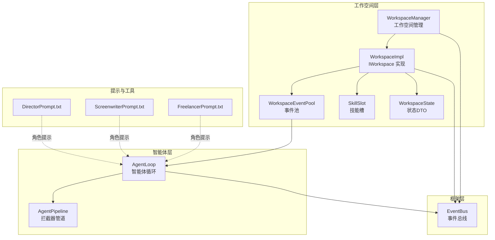
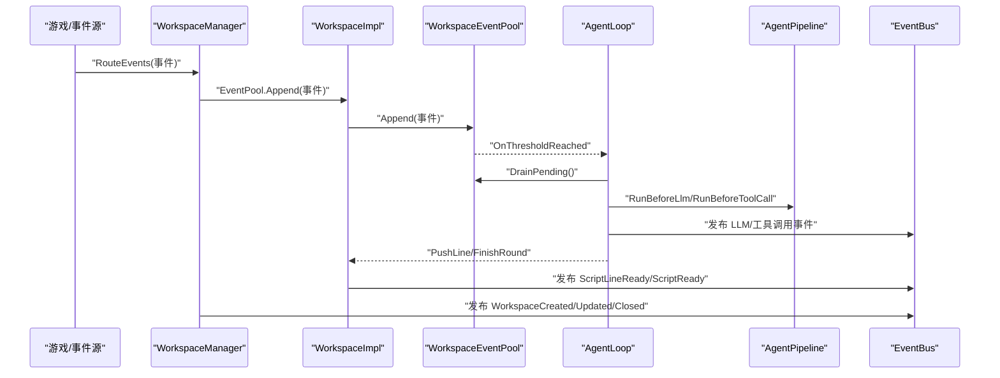
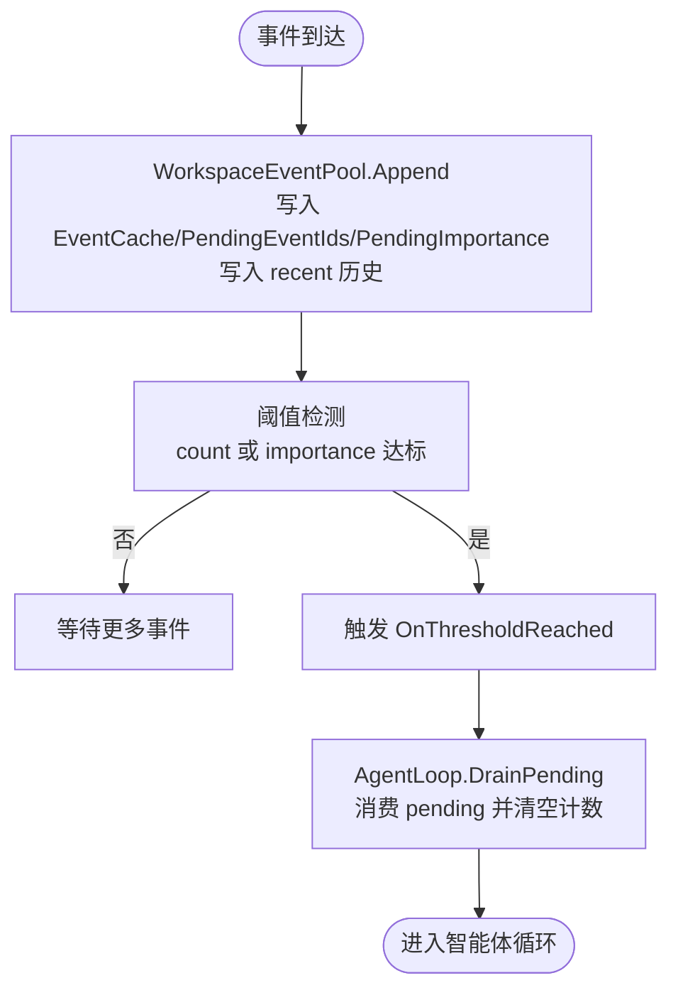
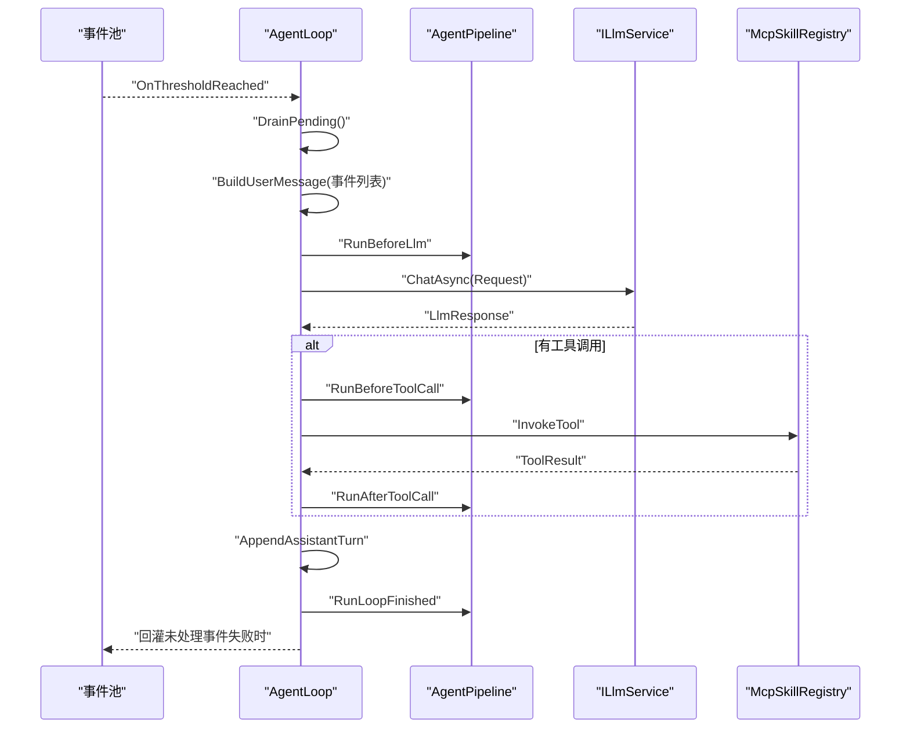
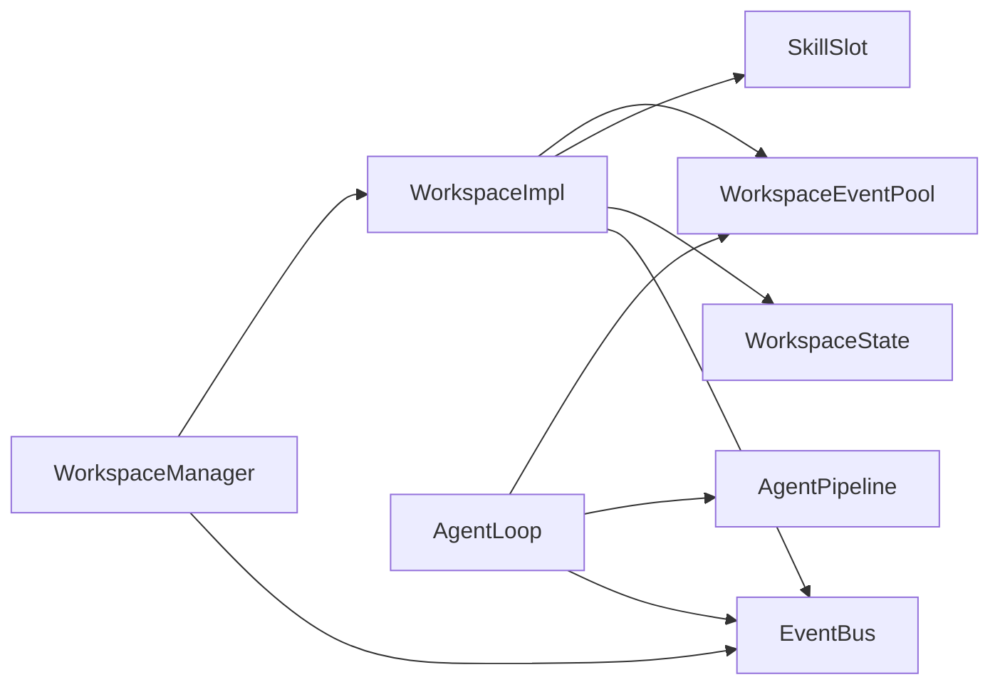

# 智能体协作机制

<cite>
**本文引用的文件**
- [WorkspaceImpl.cs](file://src/NPCLife/Workspace/WorkspaceImpl.cs)
- [WorkspaceManager.cs](file://src/NPCLife/Workspace/WorkspaceManager.cs)
- [WorkspaceEventPool.cs](file://src/NPCLife/Workspace/WorkspaceEventPool.cs)
- [WorkspaceState.cs](file://src/NPCLife/Workspace/WorkspaceState.cs)
- [IWorkspace.cs](file://src/NPCLife/Workspace/IWorkspace.cs)
- [SkillSlot.cs](file://src/NPCLife/Workspace/SkillSlot.cs)
- [RoleSkillProfile.cs](file://src/NPCLife/Workspace/RoleSkillProfile.cs)
- [AgentLoop.cs](file://src/NPCLife/Agent/AgentLoop.cs)
- [AgentPipeline.cs](file://src/NPCLife/Framework/AgentPipeline.cs)
- [EventBus.cs](file://src/NPCLife/Framework/EventBus.cs)
- [DirectorPrompt.txt](file://src/NPCLife/Prompts/DirectorPrompt.txt)
- [ScreenwriterPrompt.txt](file://src/NPCLife/Prompts/ScreenwriterPrompt.txt)
- [FreelancerPrompt.txt](file://src/NPCLife/Prompts/FreelancerPrompt.txt)
- [WorkspaceEventPoolTests.cs](file://tests/NPCLife.Tests/Driver/WorkspaceEventPoolTests.cs)
</cite>

## 目录
1. [引言](#引言)
2. [项目结构](#项目结构)
3. [核心组件](#核心组件)
4. [架构总览](#架构总览)
5. [详细组件分析](#详细组件分析)
6. [依赖分析](#依赖分析)
7. [性能考量](#性能考量)
8. [故障排查指南](#故障排查指南)
9. [结论](#结论)
10. [附录](#附录)

## 引言
本文件系统性阐述多智能体协作机制，聚焦 Director（导演）、Screenwriter（编剧）、Freelancer（临时工）三类角色在事件驱动下的协作模式与通信机制。文档覆盖事件从“事件池”到“工作空间”，再到“最终输出”的完整流转；解释状态同步与消息传递（EventBus 事件总线、AgentPipeline 管道拦截器）；给出角色切换与状态转换规则；并提供可落地的应用场景与最佳实践。

## 项目结构
围绕“工作空间 + 事件池 + 智能体循环”的核心设计，系统采用分层组织：
- Workspace 层：工作空间状态、事件池、技能槽、角色与状态定义
- Agent 层：智能体循环（AgentLoop）与管道拦截（AgentPipeline）
- Framework 层：事件总线（EventBus）、提示词与工具集成
- Driver/Prompts 层：角色提示词与驱动配置

图表来源
- [WorkspaceImpl.cs:16-196](file://src/NPCLife/Workspace/WorkspaceImpl.cs#L16-L196)
- [WorkspaceManager.cs:19-615](file://src/NPCLife/Workspace/WorkspaceManager.cs#L19-L615)
- [WorkspaceEventPool.cs:21-185](file://src/NPCLife/Workspace/WorkspaceEventPool.cs#L21-L185)
- [AgentLoop.cs:43-581](file://src/NPCLife/Agent/AgentLoop.cs#L43-L581)
- [AgentPipeline.cs:120-247](file://src/NPCLife/Framework/AgentPipeline.cs#L120-L247)
- [EventBus.cs:17-242](file://src/NPCLife/Framework/EventBus.cs#L17-L242)
- [DirectorPrompt.txt:1-18](file://src/NPCLife/Prompts/DirectorPrompt.txt#L1-L18)
- [ScreenwriterPrompt.txt:1-17](file://src/NPCLife/Prompts/ScreenwriterPrompt.txt#L1-L17)
- [FreelancerPrompt.txt:1-18](file://src/NPCLife/Prompts/FreelancerPrompt.txt#L1-L18)

章节来源
- [WorkspaceImpl.cs:16-196](file://src/NPCLife/Workspace/WorkspaceImpl.cs#L16-L196)
- [WorkspaceManager.cs:19-615](file://src/NPCLife/Workspace/WorkspaceManager.cs#L19-L615)
- [WorkspaceEventPool.cs:21-185](file://src/NPCLife/Workspace/WorkspaceEventPool.cs#L21-L185)
- [AgentLoop.cs:43-581](file://src/NPCLife/Agent/AgentLoop.cs#L43-L581)
- [AgentPipeline.cs:120-247](file://src/NPCLife/Framework/AgentPipeline.cs#L120-L247)
- [EventBus.cs:17-242](file://src/NPCLife/Framework/EventBus.cs#L17-L242)
- [DirectorPrompt.txt:1-18](file://src/NPCLife/Prompts/DirectorPrompt.txt#L1-L18)
- [ScreenwriterPrompt.txt:1-17](file://src/NPCLife/Prompts/ScreenwriterPrompt.txt#L1-L17)
- [FreelancerPrompt.txt:1-18](file://src/NPCLife/Prompts/FreelancerPrompt.txt#L1-L18)

## 核心组件
- 工作空间（Workspace）
  - IWorkspace：对外门面，暴露元数据、事件池与技能槽，提供推送台词与结束轮次的能力
  - WorkspaceImpl：实现 IWorkspace，封装 WorkspaceState、事件池与技能槽，负责事件路由与轮次归档
  - WorkspaceState：工作空间状态与轮次日志的数据载体
  - WorkspaceEventPool：事件池，支持阈值触发、最近历史缓存、DrainPending 消费
  - SkillSlot：技能槽，封装激活/停用技能与工具集合
  - RoleSkillProfile：按角色预设默认技能集
- 智能体（Agent）
  - AgentLoop：事件驱动的智能体循环，状态机驱动，支持 LLM + 工具调用
  - AgentPipeline：拦截器管道，贯穿 Prompt/Llm/ToolCall/Finish 阶段
- 事件总线（EventBus）：发布/订阅，命名空间事件名，错误隔离与优先级排序
- 角色提示词：DirectorPrompt、ScreenwriterPrompt、FreelancerPrompt

章节来源
- [IWorkspace.cs:11-50](file://src/NPCLife/Workspace/IWorkspace.cs#L11-L50)
- [WorkspaceImpl.cs:16-196](file://src/NPCLife/Workspace/WorkspaceImpl.cs#L16-L196)
- [WorkspaceState.cs:94-151](file://src/NPCLife/Workspace/WorkspaceState.cs#L94-L151)
- [WorkspaceEventPool.cs:21-185](file://src/NPCLife/Workspace/WorkspaceEventPool.cs#L21-L185)
- [SkillSlot.cs:11-61](file://src/NPCLife/Workspace/SkillSlot.cs#L11-L61)
- [RoleSkillProfile.cs:13-74](file://src/NPCLife/Workspace/RoleSkillProfile.cs#L13-L74)
- [AgentLoop.cs:43-581](file://src/NPCLife/Agent/AgentLoop.cs#L43-L581)
- [AgentPipeline.cs:120-247](file://src/NPCLife/Framework/AgentPipeline.cs#L120-L247)
- [EventBus.cs:17-242](file://src/NPCLife/Framework/EventBus.cs#L17-L242)
- [DirectorPrompt.txt:1-18](file://src/NPCLife/Prompts/DirectorPrompt.txt#L1-L18)
- [ScreenwriterPrompt.txt:1-17](file://src/NPCLife/Prompts/ScreenwriterPrompt.txt#L1-L17)
- [FreelancerPrompt.txt:1-18](file://src/NPCLife/Prompts/FreelancerPrompt.txt#L1-L18)

## 架构总览
多智能体协作以“事件驱动 + 工作空间隔离 + 管道拦截”为核心：
- Director：全局视角，负责事件路由、工作空间创建/分支/合并、状态变更
- Screenwriter：叙事创作，基于事件池与工具集产出台词与轮次
- Freelancer：独立事件快速响应，无需跨轮次上下文
- 事件池阈值触发智能体循环，EventBus 贯穿生命周期事件，AgentPipeline 注入拦截逻辑

图表来源
- [WorkspaceManager.cs:382-392](file://src/NPCLife/Workspace/WorkspaceManager.cs#L382-L392)
- [WorkspaceImpl.cs:83-182](file://src/NPCLife/Workspace/WorkspaceImpl.cs#L83-L182)
- [WorkspaceEventPool.cs:49-90](file://src/NPCLife/Workspace/WorkspaceEventPool.cs#L49-L90)
- [AgentLoop.cs:171-337](file://src/NPCLife/Agent/AgentLoop.cs#L171-L337)
- [AgentPipeline.cs:180-236](file://src/NPCLife/Framework/AgentPipeline.cs#L180-L236)
- [EventBus.cs:86-113](file://src/NPCLife/Framework/EventBus.cs#L86-L113)

## 详细组件分析

### 工作空间与事件池
- WorkspaceState：承载工作空间元数据、轮次日志、当前前情提要、事件缓存与待处理事件队列
- WorkspaceEventPool：双层缓冲（持久化 pending + 内存 recent），阈值触发（数量/重要度），DrainPending 清空并返回事件
- WorkspaceImpl：封装事件池与技能槽，提供 PushLine/FinishRound，发布 ScriptLineReady/ScriptReady
- WorkspaceManager：CRUD、分支/合并、事件路由、持久化与状态变更广播

图表来源
- [WorkspaceEventPool.cs:49-90](file://src/NPCLife/Workspace/WorkspaceEventPool.cs#L49-L90)
- [WorkspaceEventPool.cs:166-183](file://src/NPCLife/Workspace/WorkspaceEventPool.cs#L166-L183)
- [WorkspaceImpl.cs:83-123](file://src/NPCLife/Workspace/WorkspaceImpl.cs#L83-L123)

章节来源
- [WorkspaceState.cs:94-151](file://src/NPCLife/Workspace/WorkspaceState.cs#L94-L151)
- [WorkspaceEventPool.cs:21-185](file://src/NPCLife/Workspace/WorkspaceEventPool.cs#L21-L185)
- [WorkspaceImpl.cs:16-196](file://src/NPCLife/Workspace/WorkspaceImpl.cs#L16-L196)
- [WorkspaceManager.cs:19-615](file://src/NPCLife/Workspace/WorkspaceManager.cs#L19-L615)

### 智能体循环与管道拦截
- AgentLoop：显式状态机（Idle/DrainingEvents/BuildingRequest/CallingLlm/ExecutingTools/AppendingToolResults/Finishing/Error），被动激活（OnThresholdReached），统一成功/失败路径
- AgentPipeline：拦截器链（BeforePrompt/BeforeLlm/BeforeToolCall/AfterToolCall/LoopFinished），支持优先级与取消
- 事件总线：贯穿 Agent 激活、LLM 请求/响应、工具调用前后、轮次完成与循环结束

图表来源
- [AgentLoop.cs:171-337](file://src/NPCLife/Agent/AgentLoop.cs#L171-L337)
- [AgentPipeline.cs:180-236](file://src/NPCLife/Framework/AgentPipeline.cs#L180-L236)

章节来源
- [AgentLoop.cs:43-581](file://src/NPCLife/Agent/AgentLoop.cs#L43-L581)
- [AgentPipeline.cs:120-247](file://src/NPCLife/Framework/AgentPipeline.cs#L120-L247)
- [EventBus.cs:186-242](file://src/NPCLife/Framework/EventBus.cs#L186-L242)

### 角色职责与协作规则
- Director（导演）
  - 职责：审查事件、挑选值得发展的事件、路由到工作空间、必要时创建/分支/合并
  - 角色提示词强调“路由事件、创建/分支/合并工作空间”
- Screenwriter（编剧）
  - 职责：审查工作空间内事件、调用工具获取上下文、逐句输出台词、结束轮次并填写 recap/outcome/directorNote
  - 角色提示词强调“逐句输出、结束轮次、前情提要与结果”
- Freelancer（临时工）
  - 职责：处理突发性、独立事件，无需跨轮次上下文，快速输出轮次
  - 角色提示词强调“独立任务、快速响应、不维护延续性”

章节来源
- [DirectorPrompt.txt:1-18](file://src/NPCLife/Prompts/DirectorPrompt.txt#L1-L18)
- [ScreenwriterPrompt.txt:1-17](file://src/NPCLife/Prompts/ScreenwriterPrompt.txt#L1-L17)
- [FreelancerPrompt.txt:1-18](file://src/NPCLife/Prompts/FreelancerPrompt.txt#L1-L18)

### 状态同步与消息传递
- 事件总线（EventBus）
  - 订阅/取消订阅、发布、错误隔离、优先级排序、调试接口
  - 预定义事件名：框架生命周期、工作空间、脚本、LLM、工具调用等
- 工作空间状态同步
  - WorkspaceManager 在创建、分支/合并、状态变更、轮次完成时发布事件
  - WorkspaceImpl 在 PushLine/FinsihRound 时发布脚本相关事件
- 智能体状态同步
  - AgentLoop 在激活、每轮完成、循环结束时发布事件
  - AgentPipeline 拦截器可读取/修改上下文并在结束时统计

章节来源
- [EventBus.cs:17-242](file://src/NPCLife/Framework/EventBus.cs#L17-L242)
- [WorkspaceManager.cs:134-184](file://src/NPCLife/Workspace/WorkspaceManager.cs#L134-L184)
- [WorkspaceImpl.cs:114-181](file://src/NPCLife/Workspace/WorkspaceImpl.cs#L114-L181)
- [AgentLoop.cs:182-367](file://src/NPCLife/Agent/AgentLoop.cs#L182-L367)
- [AgentPipeline.cs:180-236](file://src/NPCLife/Framework/AgentPipeline.cs#L180-L236)

### 角色切换与状态转换
- 角色与技能
  - RoleSkillProfile 为 Director/Screenwriter/Freelancer 预设默认技能集
  - SkillSlot 提供 Activate/Deactivate，变更时通过 WorkspaceImpl.publishUpdated 广播
- 工作空间状态
  - WorkspaceStatus：Active/Suspended/Completed/Abandoned
  - WorkspaceManager 校验状态转换合法性，非法转换记录警告
- 激活条件
  - WorkspaceEventPool 基于 DriverConfig 的角色阈值（数量/重要度）触发 OnThresholdReached
  - 测试覆盖多工作空间独立性与阈值触发行为

章节来源
- [RoleSkillProfile.cs:13-74](file://src/NPCLife/Workspace/RoleSkillProfile.cs#L13-L74)
- [SkillSlot.cs:11-61](file://src/NPCLife/Workspace/SkillSlot.cs#L11-L61)
- [WorkspaceState.cs:25-53](file://src/NPCLife/Workspace/WorkspaceState.cs#L25-L53)
- [WorkspaceManager.cs:406-423](file://src/NPCLife/Workspace/WorkspaceManager.cs#L406-L423)
- [WorkspaceEventPool.cs:81-90](file://src/NPCLife/Workspace/WorkspaceEventPool.cs#L81-L90)
- [WorkspaceEventPoolTests.cs:138-274](file://tests/NPCLife.Tests/Driver/WorkspaceEventPoolTests.cs#L138-L274)

### 典型应用与最佳实践
- 场景一：Director 路由事件到 Screenwriter
  - 使用 WorkspaceManager.RouteEvents 将事件写入目标工作空间事件池
  - Screenwriter 通过 WorkspaceImpl.PushLine 输出台词，FinishRound 归档轮次
  - 参考路径：[WorkspaceManager.cs:382-392](file://src/NPCLife/Workspace/WorkspaceManager.cs#L382-L392)、[WorkspaceImpl.cs:83-182](file://src/NPCLife/Workspace/WorkspaceImpl.cs#L83-L182)
- 场景二：Freelancer 处理独立事件
  - 事件池阈值触发后，Freelancer 以独立轮次快速输出
  - 参考路径：[RoleSkillProfile.cs:46-51](file://src/NPCLife/Workspace/RoleSkillProfile.cs#L46-L51)、[AgentLoop.cs:171-337](file://src/NPCLife/Agent/AgentLoop.cs#L171-L337)
- 场景三：拦截器增强 LLM 请求
  - 通过 AgentPipeline.AddInterceptor 注入 BeforeLlm/BeforeToolCall/AfterToolCall
  - 参考路径：[AgentPipeline.cs:137-173](file://src/NPCLife/Framework/AgentPipeline.cs#L137-L173)、[AgentLoop.cs:225-295](file://src/NPCLife/Agent/AgentLoop.cs#L225-L295)

## 依赖分析
- 组件耦合
  - WorkspaceImpl 依赖 WorkspaceState、WorkspaceEventPool、SkillSlot、EventBus
  - AgentLoop 依赖 IEventLog（事件池）、ILlmService、ICredentialRegistry、AgentPipeline、EventBus
  - WorkspaceManager 依赖 IAuthorityStore、ILogger、DriverConfig、ICardSerializer、EventBus
- 外部依赖
  - 事件序列化：ICardSerializer（CardSerializer.Default）
  - 工具调用：McpSkillRegistry（通过 AgentLoop 间接使用）
- 潜在循环依赖
  - 通过接口解耦（IEventLog、IWorkspace、IWorkspaceManager），未见循环

图表来源
- [WorkspaceManager.cs:19-615](file://src/NPCLife/Workspace/WorkspaceManager.cs#L19-L615)
- [WorkspaceImpl.cs:16-196](file://src/NPCLife/Workspace/WorkspaceImpl.cs#L16-L196)
- [AgentLoop.cs:43-581](file://src/NPCLife/Agent/AgentLoop.cs#L43-L581)
- [AgentPipeline.cs:120-247](file://src/NPCLife/Framework/AgentPipeline.cs#L120-L247)
- [EventBus.cs:17-242](file://src/NPCLife/Framework/EventBus.cs#L17-L242)

章节来源
- [WorkspaceManager.cs:19-615](file://src/NPCLife/Workspace/WorkspaceManager.cs#L19-L615)
- [WorkspaceImpl.cs:16-196](file://src/NPCLife/Workspace/WorkspaceImpl.cs#L16-L196)
- [AgentLoop.cs:43-581](file://src/NPCLife/Agent/AgentLoop.cs#L43-L581)
- [AgentPipeline.cs:120-247](file://src/NPCLife/Framework/AgentPipeline.cs#L120-L247)
- [EventBus.cs:17-242](file://src/NPCLife/Framework/EventBus.cs#L17-L242)

## 性能考量
- 事件池阈值控制
  - 通过 DriverConfig 为不同角色设置 count 与 importance 阈值，避免频繁小批量处理
  - 参考路径：[WorkspaceEventPool.cs:81-90](file://src/NPCLife/Workspace/WorkspaceEventPool.cs#L81-L90)
- 最近历史容量
  - 限制 recent 缓冲大小，按最小重要度淘汰，平衡查询性能与上下文完整性
  - 参考路径：[WorkspaceEventPool.cs:61-74](file://src/NPCLife/Workspace/WorkspaceEventPool.cs#L61-L74)
- 智能体循环节流
  - 通过状态机与信号量防止重入，统一失败回灌策略
  - 参考路径：[AgentLoop.cs:60-65](file://src/NPCLife/Agent/AgentLoop.cs#L60-L65)、[AgentLoop.cs:370-396](file://src/NPCLife/Agent/AgentLoop.cs#L370-L396)
- 管道拦截开销
  - 默认无拦截器时零开销；按需添加拦截器并合理设置优先级
  - 参考路径：[AgentPipeline.cs:137-173](file://src/NPCLife/Framework/AgentPipeline.cs#L137-L173)

## 故障排查指南
- 事件未触发智能体
  - 检查事件池阈值是否达标（数量/重要度）
  - 参考路径：[WorkspaceEventPoolTests.cs:138-274](file://tests/NPCLife.Tests/Driver/WorkspaceEventPoolTests.cs#L138-L274)
- 智能体循环异常
  - 查看 AgentLoop.FailAndRequeue 是否回灌事件；关注 LLM 错误与工具调用异常
  - 参考路径：[AgentLoop.cs:370-396](file://src/NPCLife/Agent/AgentLoop.cs#L370-L396)
- 状态转换非法
  - WorkspaceManager.IsValidTransition 校验失败会记录警告
  - 参考路径：[WorkspaceManager.cs:406-423](file://src/NPCLife/Workspace/WorkspaceManager.cs#L406-L423)
- 事件总线异常
  - EventBus 在处理器抛异常时进行错误隔离并记录警告
  - 参考路径：[EventBus.cs:104-112](file://src/NPCLife/Framework/EventBus.cs#L104-L112)

章节来源
- [WorkspaceEventPoolTests.cs:138-274](file://tests/NPCLife.Tests/Driver/WorkspaceEventPoolTests.cs#L138-L274)
- [AgentLoop.cs:370-396](file://src/NPCLife/Agent/AgentLoop.cs#L370-L396)
- [WorkspaceManager.cs:406-423](file://src/NPCLife/Workspace/WorkspaceManager.cs#L406-L423)
- [EventBus.cs:104-112](file://src/NPCLife/Framework/EventBus.cs#L104-L112)

## 结论
该多智能体协作体系以“事件池阈值触发 + 工作空间隔离 + 管道拦截”为核心，实现了 Director/Screenwriter/Freelancer 的清晰分工与高效协同。通过 EventBus 与 AgentPipeline，系统在保证可观测性与可扩展性的同时，兼顾了性能与稳定性。建议在实际部署中：
- 依据业务特征调整角色阈值与最近历史容量
- 按需引入拦截器，避免不必要的开销
- 健全监控与告警，结合事件总线定位问题

## 附录
- 角色提示词参考
  - DirectorPrompt：路由事件、创建/分支/合并工作空间
  - ScreenwriterPrompt：逐句输出、结束轮次、前情提要与结果
  - FreelancerPrompt：独立任务、快速响应、不维护延续性

章节来源
- [DirectorPrompt.txt:1-18](file://src/NPCLife/Prompts/DirectorPrompt.txt#L1-L18)
- [ScreenwriterPrompt.txt:1-17](file://src/NPCLife/Prompts/ScreenwriterPrompt.txt#L1-L17)
- [FreelancerPrompt.txt:1-18](file://src/NPCLife/Prompts/FreelancerPrompt.txt#L1-L18)