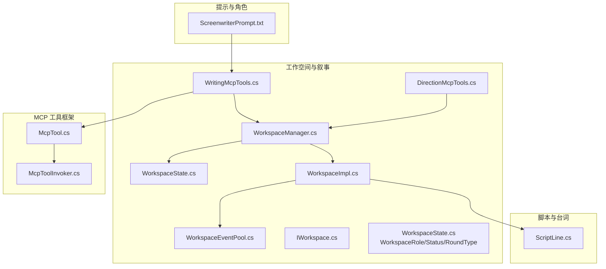
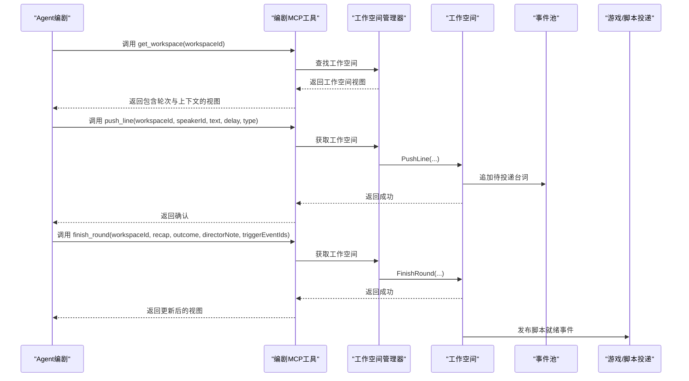
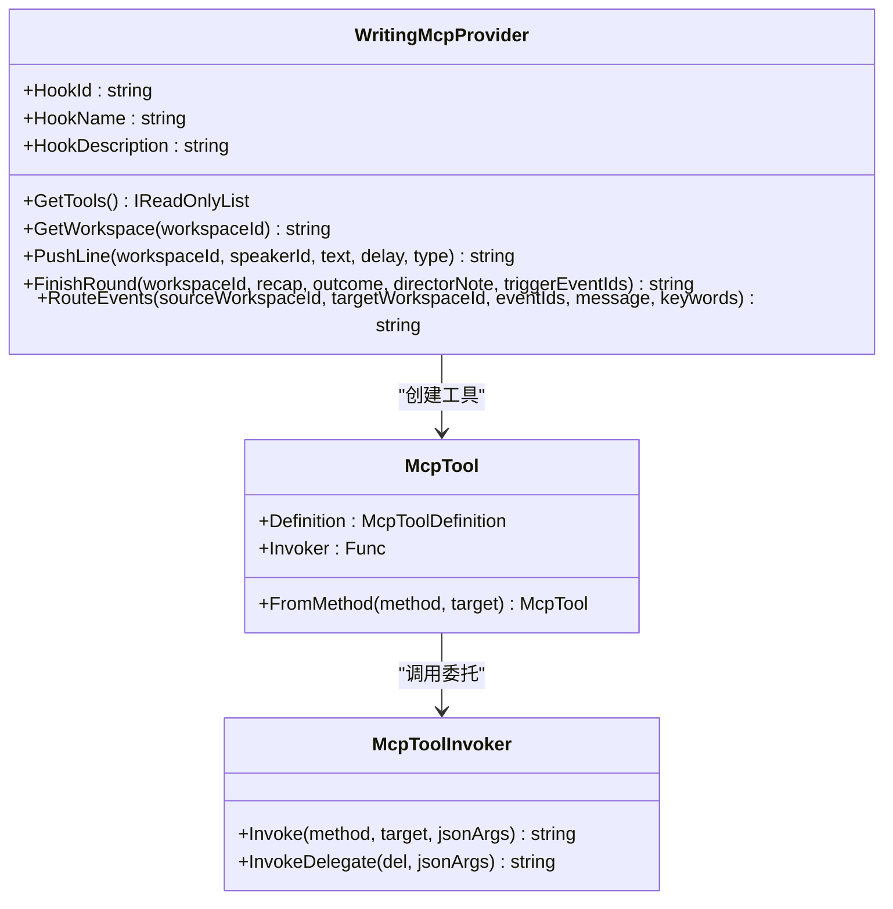
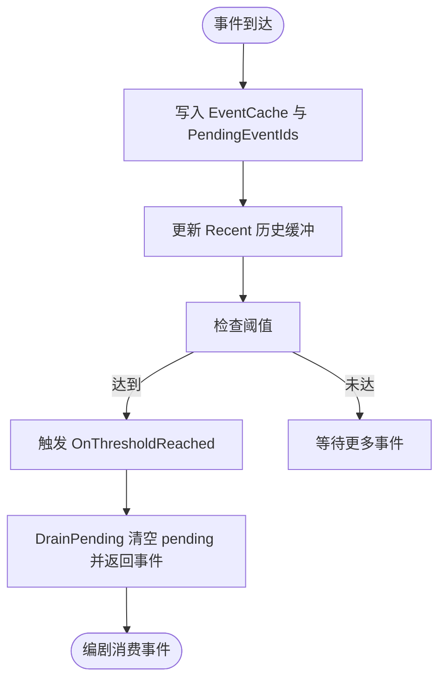
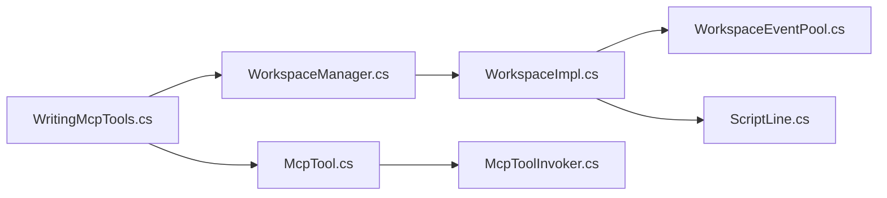

# 编剧角色（Screenwriter）

<cite>
**本文引用的文件**
- [ScreenwriterPrompt.txt](file://src/NPCLife/Prompts/ScreenwriterPrompt.txt)
- [WritingMcpTools.cs](file://src/NPCLife/Workspace/WritingMcpTools.cs)
- [DirectionMcpTools.cs](file://src/NPCLife/Workspace/DirectionMcpTools.cs)
- [IWorkspace.cs](file://src/NPCLife/Workspace/IWorkspace.cs)
- [WorkspaceImpl.cs](file://src/NPCLife/Workspace/WorkspaceImpl.cs)
- [WorkspaceManager.cs](file://src/NPCLife/Workspace/WorkspaceManager.cs)
- [WorkspaceState.cs](file://src/NPCLife/Workspace/WorkspaceState.cs)
- [WorkspaceEventPool.cs](file://src/NPCLife/Workspace/WorkspaceEventPool.cs)
- [DriverConfig.cs](file://src/NPCLife/Driver/DriverConfig.cs)
- [McpTool.cs](file://src/NPCLife/Framework/Mcp/McpTool.cs)
- [McpToolInvoker.cs](file://src/NPCLife/Framework/Mcp/McpToolInvoker.cs)
- [ScriptLine.cs](file://src/NPCLife/Framework/Script/ScriptLine.cs)
</cite>

## 目录
1. [引言](#引言)
2. [项目结构](#项目结构)
3. [核心组件](#核心组件)
4. [架构总览](#架构总览)
5. [详细组件分析](#详细组件分析)
6. [依赖关系分析](#依赖关系分析)
7. [性能考量](#性能考量)
8. [故障排查指南](#故障排查指南)
9. [结论](#结论)

## 引言
本文件面向“编剧角色（Screenwriter）”的实现与使用，系统性阐述其在多智能体叙事系统中的职责边界、工作流与质量控制机制。重点覆盖以下方面：
- 编剧如何从工作空间获取事件信息，审查并发展故事线
- 编剧的提示词设计与叙事生成逻辑（如何将事件转化为连贯的故事情节）
- 编剧使用的 MCP 工具集（如 push_line、finish_round、route_events 等）及其调用方式
- 在多智能体系统中的执行角色与质量控制作用

## 项目结构
围绕“编剧”的相关代码主要分布在以下模块：
- 提示词与角色规范：Prompts/ScreenwriterPrompt.txt
- 工作空间与叙事基础设施：Workspace/*（包含工作空间状态、事件池、管理器、编剧/导演工具）
- MCP 工具框架：Framework/Mcp/*
- 脚本与台词模型：Framework/Script/*

图表来源
- [ScreenwriterPrompt.txt:1-17](file://src/NPCLife/Prompts/ScreenwriterPrompt.txt#L1-L17)
- [WritingMcpTools.cs:1-313](file://src/NPCLife/Workspace/WritingMcpTools.cs#L1-L313)
- [DirectionMcpTools.cs:1-460](file://src/NPCLife/Workspace/DirectionMcpTools.cs#L1-L460)
- [WorkspaceState.cs:1-152](file://src/NPCLife/Workspace/WorkspaceState.cs#L1-L152)
- [WorkspaceImpl.cs:1-197](file://src/NPCLife/Workspace/WorkspaceImpl.cs#L1-L197)
- [WorkspaceManager.cs:1-616](file://src/NPCLife/Workspace/WorkspaceManager.cs#L1-L616)
- [WorkspaceEventPool.cs:1-186](file://src/NPCLife/Workspace/WorkspaceEventPool.cs#L1-L186)
- [McpTool.cs:1-40](file://src/NPCLife/Framework/Mcp/McpTool.cs#L1-L40)
- [McpToolInvoker.cs:1-238](file://src/NPCLife/Framework/Mcp/McpToolInvoker.cs#L1-L238)
- [ScriptLine.cs:1-43](file://src/NPCLife/Framework/Script/ScriptLine.cs#L1-L43)

章节来源
- [ScreenwriterPrompt.txt:1-17](file://src/NPCLife/Prompts/ScreenwriterPrompt.txt#L1-L17)
- [WritingMcpTools.cs:1-313](file://src/NPCLife/Workspace/WritingMcpTools.cs#L1-L313)
- [WorkspaceState.cs:1-152](file://src/NPCLife/Workspace/WorkspaceState.cs#L1-L152)

## 核心组件
- 编剧提示词与工作原则：明确职责、输出节奏、收尾规范与质量要求
- 编剧 MCP 工具集：提供查询工作空间、推送台词、结束轮次、路由事件的能力
- 工作空间与事件池：承载事件、轮次、上下文与状态流转
- 工具调用链：MCP 工具定义与运行时调用器

章节来源
- [ScreenwriterPrompt.txt:1-17](file://src/NPCLife/Prompts/ScreenwriterPrompt.txt#L1-L17)
- [WritingMcpTools.cs:31-38](file://src/NPCLife/Workspace/WritingMcpTools.cs#L31-L38)
- [WorkspaceEventPool.cs:49-89](file://src/NPCLife/Workspace/WorkspaceEventPool.cs#L49-L89)
- [McpTool.cs:14-38](file://src/NPCLife/Framework/Mcp/McpTool.cs#L14-L38)
- [McpToolInvoker.cs:24-72](file://src/NPCLife/Framework/Mcp/McpToolInvoker.cs#L24-L72)

## 架构总览
编剧在系统中的定位与交互如下：
- 编剧通过 MCP 工具读取工作空间视图，审查事件池中的事件
- 基于事件与上下文，使用 push_line 逐步输出台词，实现低延迟的实时呈现
- 完成一轮后调用 finish_round 归档回顾与结果，并向导演发送指导性留言
- 若事件不适合当前线，可通过 route_events 将事件退回导演工作空间

图表来源
- [WritingMcpTools.cs:45-152](file://src/NPCLife/Workspace/WritingMcpTools.cs#L45-L152)
- [WorkspaceImpl.cs:83-182](file://src/NPCLife/Workspace/WorkspaceImpl.cs#L83-L182)
- [WorkspaceManager.cs:382-392](file://src/NPCLife/Workspace/WorkspaceManager.cs#L382-L392)
- [WorkspaceEventPool.cs:49-89](file://src/NPCLife/Workspace/WorkspaceEventPool.cs#L49-L89)

## 详细组件分析

### 编剧提示词与工作原则
- 职责清单：审查事件、获取上下文、逐句推送台词、结束轮次并填写回顾/结果/导演留言
- 输出原则：优先 push_line 逐句输出以降低等待；可并行调用多句；完成后必须 finish_round
- 文本规范：recap 总结起点，outcome 简述结果，directorNote 说明剧情线状态与期望事件类型
- 激活策略：每次激活仅推送 1 个轮次；若事件不适合，可用 route_events 回退

章节来源
- [ScreenwriterPrompt.txt:1-17](file://src/NPCLife/Prompts/ScreenwriterPrompt.txt#L1-L17)

### 编剧 MCP 工具集（WritingMcpTools）
- 工具清单与职责
  - get_workspace：返回工作空间的编剧视图（含轮次、上下文与标签）
  - push_line：推送单句台词，支持多种类型（对话/旁白/动作/停顿），可并行调用
  - finish_round：结束本轮，归档 recap/outcome 并写入导演留言
  - route_events：将事件从源工作空间路由到目标工作空间，可附加留言与关键词

- 参数与行为要点
  - push_line：校验工作空间状态与调用者角色；立即发布脚本行就绪事件
  - finish_round：校验状态与调用者；生成轮次并发布脚本就绪事件
  - route_events：深拷贝事件并附加关键词，批量路由并返回统计

- 调用链与错误处理
  - 工具通过 McpTool.FromMethod 包装，统一由 McpToolInvoker 反射调用
  - 工具方法捕获异常并返回安全的 JSON 结果，避免中断

图表来源
- [WritingMcpTools.cs:16-40](file://src/NPCLife/Workspace/WritingMcpTools.cs#L16-L40)
- [McpTool.cs:14-38](file://src/NPCLife/Framework/Mcp/McpTool.cs#L14-L38)
- [McpToolInvoker.cs:24-72](file://src/NPCLife/Framework/Mcp/McpToolInvoker.cs#L24-L72)

章节来源
- [WritingMcpTools.cs:31-152](file://src/NPCLife/Workspace/WritingMcpTools.cs#L31-L152)
- [McpTool.cs:14-38](file://src/NPCLife/Framework/Mcp/McpTool.cs#L14-L38)
- [McpToolInvoker.cs:24-72](file://src/NPCLife/Framework/Mcp/McpToolInvoker.cs#L24-L72)

### 工作空间与事件池（Workspace 与 EventPool）
- 工作空间状态与角色
  - WorkspaceRole：Director、Screenwriter、Freelancer
  - WorkspaceStatus：Active、Suspended、Completed、Abandoned
  - RoundType：Normal、Branch、Merge
- 事件池（WorkspaceEventPool）
  - 双层结构：pending（持久化）+ recent（内存）
  - 阈值触发：根据 DriverConfig 的计数与重要度阈值，达到后触发 OnThresholdReached
  - DrainPending：清空 pending 并返回事件列表，供编剧消费
- 工作空间实现（WorkspaceImpl）
  - PushLine：校验状态与调用者，发布 ScriptLineReady 事件
  - FinishRound：生成轮次、更新 CurrentRecap/Outcome/DirectorMessage，发布 ScriptReady 事件

图表来源
- [WorkspaceEventPool.cs:49-89](file://src/NPCLife/Workspace/WorkspaceEventPool.cs#L49-L89)
- [DriverConfig.cs:54-85](file://src/NPCLife/Driver/DriverConfig.cs#L54-L85)

章节来源
- [WorkspaceState.cs:9-53](file://src/NPCLife/Workspace/WorkspaceState.cs#L9-L53)
- [WorkspaceEventPool.cs:49-183](file://src/NPCLife/Workspace/WorkspaceEventPool.cs#L49-L183)
- [WorkspaceImpl.cs:83-182](file://src/NPCLife/Workspace/WorkspaceImpl.cs#L83-L182)
- [DriverConfig.cs:54-101](file://src/NPCLife/Driver/DriverConfig.cs#L54-L101)

### 工具调用与序列化
- 工具定义生成：McpTool.FromMethod 自动从方法签名生成 Definition
- 运行时调用：McpToolInvoker.Invoke 将 JSON 参数反序列化、反射调用、序列化返回值
- 类型转换与集合处理：支持基础类型、枚举、数组与泛型集合
- 错误处理：捕获反射异常并返回 JSON 错误对象

章节来源
- [McpTool.cs:28-37](file://src/NPCLife/Framework/Mcp/McpTool.cs#L28-L37)
- [McpToolInvoker.cs:24-72](file://src/NPCLife/Framework/Mcp/McpToolInvoker.cs#L24-L72)
- [McpToolInvoker.cs:87-171](file://src/NPCLife/Framework/Mcp/McpToolInvoker.cs#L87-L171)
- [McpToolInvoker.cs:177-226](file://src/NPCLife/Framework/Mcp/McpToolInvoker.cs#L177-L226)

### 脚本与台词模型
- ScriptLine：包含 SpeakerId、Text、Type、RelativeTime 等字段
- 类型体系：Dialogue、Narration、Action、Pause
- 与工作空间集成：WorkspaceImpl 在 PushLine 中构建 ScriptLine 并发布事件

章节来源
- [ScriptLine.cs:6-42](file://src/NPCLife/Framework/Script/ScriptLine.cs#L6-L42)
- [WorkspaceImpl.cs:100-122](file://src/NPCLife/Workspace/WorkspaceImpl.cs#L100-L122)

## 依赖关系分析
- 编剧工具依赖工作空间管理器与日志器，通过 IMcpHookProvider 注入，保持零静态耦合
- 工具方法通过 McpTool 与 McpToolInvoker 解耦，便于扩展与测试
- 工作空间实现依赖事件池与脚本发布机制，确保实时性与一致性

图表来源
- [WritingMcpTools.cs:16-40](file://src/NPCLife/Workspace/WritingMcpTools.cs#L16-L40)
- [WorkspaceManager.cs:19-40](file://src/NPCLife/Workspace/WorkspaceManager.cs#L19-L40)
- [WorkspaceImpl.cs:16-46](file://src/NPCLife/Workspace/WorkspaceImpl.cs#L16-L46)
- [WorkspaceEventPool.cs:21-43](file://src/NPCLife/Workspace/WorkspaceEventPool.cs#L21-L43)
- [McpTool.cs:14-38](file://src/NPCLife/Framework/Mcp/McpTool.cs#L14-L38)
- [McpToolInvoker.cs:14-72](file://src/NPCLife/Framework/Mcp/McpToolInvoker.cs#L14-L72)

章节来源
- [WritingMcpTools.cs:16-40](file://src/NPCLife/Workspace/WritingMcpTools.cs#L16-L40)
- [WorkspaceManager.cs:19-40](file://src/NPCLife/Workspace/WorkspaceManager.cs#L19-L40)
- [McpTool.cs:14-38](file://src/NPCLife/Framework/Mcp/McpTool.cs#L14-L38)
- [McpToolInvoker.cs:14-72](file://src/NPCLife/Framework/Mcp/McpToolInvoker.cs#L14-L72)

## 性能考量
- 事件阈值与批处理：通过 DriverConfig 的计数与重要度阈值，减少频繁激活带来的开销
- 并行输出：push_line 支持在同一响应中并行调用多个工具，降低往返延迟
- 内存与持久化：事件池采用双层结构，recent 仅内存缓存，pending 持久化，平衡实时性与可靠性
- 工具调用开销：McpToolInvoker 使用反射调用，需注意参数解析与类型转换的成本

## 故障排查指南
- 工具调用失败
  - 现象：返回空对象或错误对象
  - 排查：检查工作空间是否存在、状态是否为 Active、调用者角色是否为 Screenwriter/Freelancer
  - 参考路径：[WritingMcpTools.cs:63-67](file://src/NPCLife/Workspace/WritingMcpTools.cs#L63-L67)、[WorkspaceImpl.cs:94-98](file://src/NPCLife/Workspace/WorkspaceImpl.cs#L94-L98)
- finish_round 未生效
  - 现象：未生成轮次或未发布脚本就绪事件
  - 排查：确认调用者角色、工作空间状态、参数完整性
  - 参考路径：[WorkspaceImpl.cs:125-182](file://src/NPCLife/Workspace/WorkspaceImpl.cs#L125-L182)
- route_events 未路由
  - 现象：返回 routed 小于 total
  - 排查：确认源工作空间存在且处于 Active、目标工作空间有效、事件 ID 正确
  - 参考路径：[WritingMcpTools.cs:172-231](file://src/NPCLife/Workspace/WritingMcpTools.cs#L172-L231)
- 事件未触发激活
  - 现象：OnThresholdReached 未触发
  - 排查：核对 DriverConfig 的阈值设置与事件重要度累加
  - 参考路径：[WorkspaceEventPool.cs:81-90](file://src/NPCLife/Workspace/WorkspaceEventPool.cs#L81-L90)、[DriverConfig.cs:54-85](file://src/NPCLife/Driver/DriverConfig.cs#L54-L85)

章节来源
- [WritingMcpTools.cs:63-67](file://src/NPCLife/Workspace/WritingMcpTools.cs#L63-L67)
- [WorkspaceImpl.cs:94-98](file://src/NPCLife/Workspace/WorkspaceImpl.cs#L94-L98)
- [WorkspaceImpl.cs:125-182](file://src/NPCLife/Workspace/WorkspaceImpl.cs#L125-L182)
- [WritingMcpTools.cs:172-231](file://src/NPCLife/Workspace/WritingMcpTools.cs#L172-L231)
- [WorkspaceEventPool.cs:81-90](file://src/NPCLife/Workspace/WorkspaceEventPool.cs#L81-L90)
- [DriverConfig.cs:54-85](file://src/NPCLife/Driver/DriverConfig.cs#L54-L85)

## 结论
编剧角色通过明确的提示词与严格的工具调用规范，在工作空间中高效地将事件转化为连贯的叙事内容。其核心能力包括：
- 事件审查与上下文获取：基于事件池与工作空间视图
- 台词生成与实时投递：push_line 支持并行输出，降低延迟
- 轮次收尾与质量控制：finish_round 归档回顾与结果，提供导演指导
- 事件路由与协作：route_events 实现跨线协作与问题回退

该设计在多智能体系统中承担“叙事生成者”的关键角色，既保障了创作质量，也维持了系统的可扩展性与稳定性。