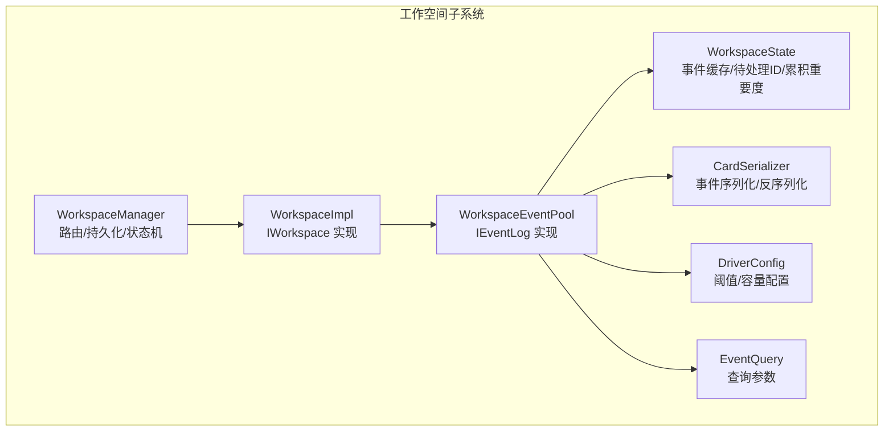
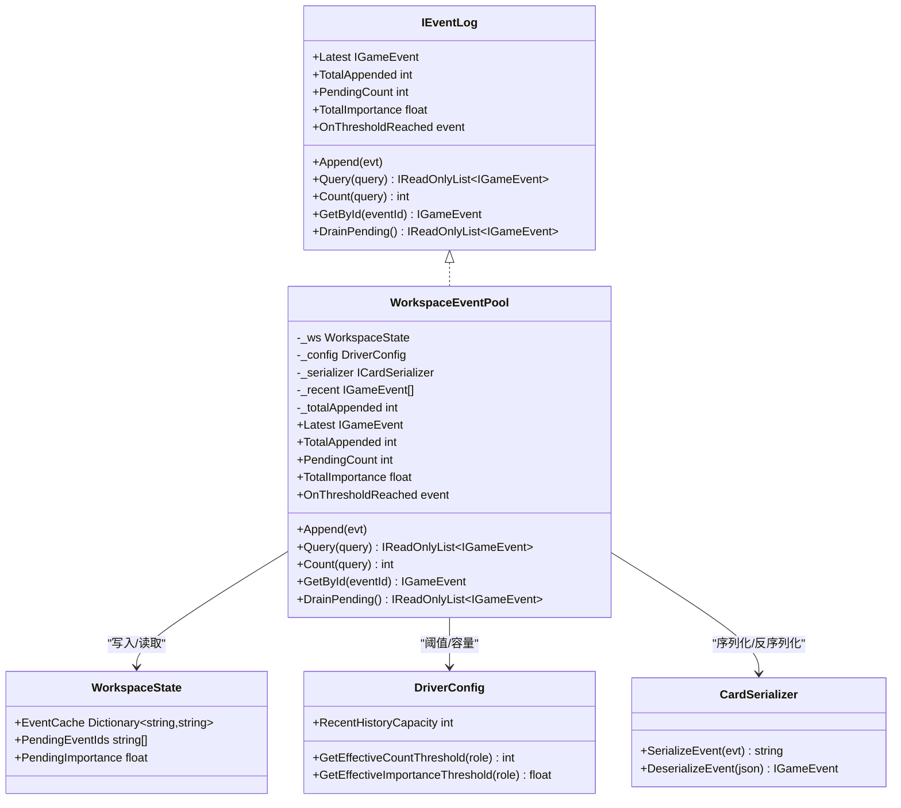
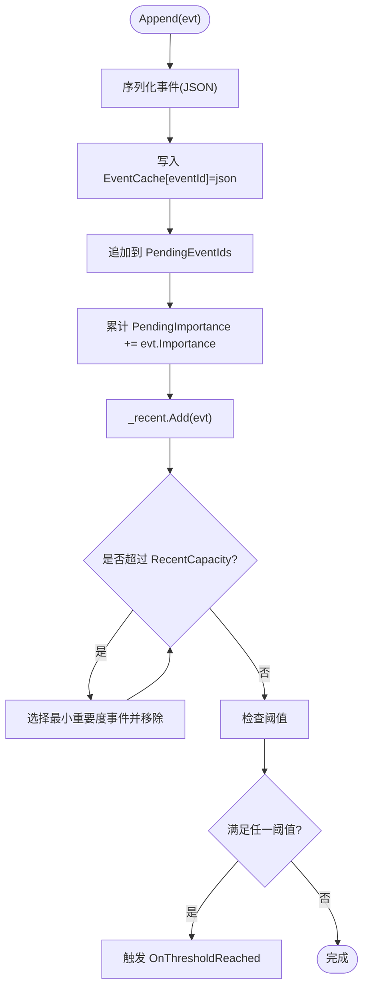
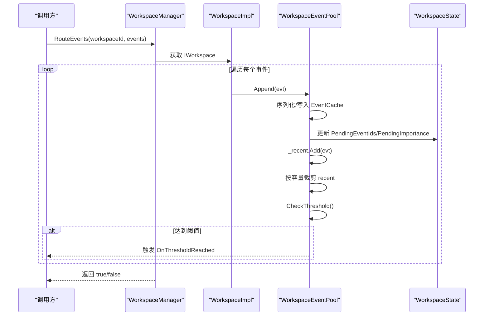
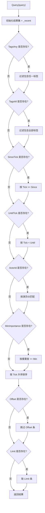
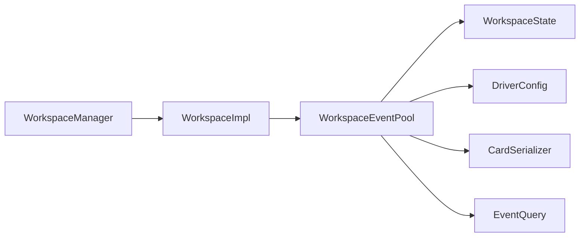

# 事件池管理

<cite>
**本文引用的文件**
- [WorkspaceEventPool.cs](file://src/NPCLife/Workspace/WorkspaceEventPool.cs)
- [IEventLog.cs](file://src/NPCLife/Core/IEventLog.cs)
- [EventQuery.cs](file://src/NPCLife/Core/EventQuery.cs)
- [WorkspaceState.cs](file://src/NPCLife/Workspace/WorkspaceState.cs)
- [DriverConfig.cs](file://src/NPCLife/Driver/DriverConfig.cs)
- [CardSerializer.cs](file://src/NPCLife/Framework/Mcp/CardSerializer.cs)
- [WorkspaceImpl.cs](file://src/NPCLife/Workspace/WorkspaceImpl.cs)
- [WorkspaceManager.cs](file://src/NPCLife/Workspace/WorkspaceManager.cs)
- [IWorkspace.cs](file://src/NPCLife/Workspace/IWorkspace.cs)
- [EventCard.cs](file://src/NPCLife/Cards/EventCard.cs)
- [WorkspaceEventPoolTests.cs](file://tests/NPCLife.Tests/Driver/WorkspaceEventPoolTests.cs)
</cite>

## 目录
1. [简介](#简介)
2. [项目结构](#项目结构)
3. [核心组件](#核心组件)
4. [架构总览](#架构总览)
5. [详细组件分析](#详细组件分析)
6. [依赖关系分析](#依赖关系分析)
7. [性能考量](#性能考量)
8. [故障排除指南](#故障排除指南)
9. [结论](#结论)
10. [附录](#附录)

## 简介
本文件系统性阐述工作空间事件池的设计与实现，涵盖事件池的数据结构、事件存储机制（缓存与历史缓冲）、阈值触发与批处理、内存管理策略、与工作空间状态的关系及对工作空间进度的影响，并给出性能优化建议与实践示例。

## 项目结构
事件池位于工作空间子系统内，围绕 WorkspaceState 构建双层缓冲：持久化的 pending 缓冲区与仅内存的 recent 历史缓冲区。事件池实现 IEventLog 接口，提供写入、查询、阈值激活与 drain 等能力；WorkspaceManager 负责事件路由与持久化；DriverConfig 提供阈值与容量配置；CardSerializer 负责事件序列化/反序列化。

图示来源
- [WorkspaceEventPool.cs:1-186](file://src/NPCLife/Workspace/WorkspaceEventPool.cs#L1-L186)
- [WorkspaceState.cs:94-150](file://src/NPCLife/Workspace/WorkspaceState.cs#L94-L150)
- [DriverConfig.cs:9-106](file://src/NPCLife/Driver/DriverConfig.cs#L9-L106)
- [CardSerializer.cs:14-89](file://src/NPCLife/Framework/Mcp/CardSerializer.cs#L14-L89)
- [WorkspaceImpl.cs:16-75](file://src/NPCLife/Workspace/WorkspaceImpl.cs#L16-L75)
- [WorkspaceManager.cs:19-616](file://src/NPCLife/Workspace/WorkspaceManager.cs#L19-L616)

章节来源
- [WorkspaceEventPool.cs:11-21](file://src/NPCLife/Workspace/WorkspaceEventPool.cs#L11-L21)
- [WorkspaceState.cs:135-142](file://src/NPCLife/Workspace/WorkspaceState.cs#L135-L142)
- [DriverConfig.cs:42-43](file://src/NPCLife/Driver/DriverConfig.cs#L42-L43)

## 核心组件
- WorkspaceEventPool：实现 IEventLog，负责事件写入、阈值检测、recent 历史裁剪、pending drain。
- WorkspaceState：承载事件池的持久化状态（EventCache、PendingEventIds、PendingImportance）。
- DriverConfig：提供按角色的阈值与通用容量配置。
- CardSerializer：事件 JSON 序列化/反序列化，支撑事件池的持久化与恢复。
- WorkspaceImpl：IWorkspace 的实现，持有事件池实例并暴露只读元数据。
- WorkspaceManager：事件路由入口，将外部事件写入目标工作空间的事件池。

章节来源
- [IEventLog.cs:12-50](file://src/NPCLife/Core/IEventLog.cs#L12-L50)
- [WorkspaceEventPool.cs:21-43](file://src/NPCLife/Workspace/WorkspaceEventPool.cs#L21-L43)
- [WorkspaceState.cs:135-142](file://src/NPCLife/Workspace/WorkspaceState.cs#L135-L142)
- [DriverConfig.cs:54-85](file://src/NPCLife/Driver/DriverConfig.cs#L54-L85)
- [CardSerializer.cs:22-89](file://src/NPCLife/Framework/Mcp/CardSerializer.cs#L22-L89)
- [WorkspaceImpl.cs:38-46](file://src/NPCLife/Workspace/WorkspaceImpl.cs#L38-L46)
- [WorkspaceManager.cs:382-392](file://src/NPCLife/Workspace/WorkspaceManager.cs#L382-L392)

## 架构总览
事件池采用“双缓冲”设计：
- pending 缓冲区：持久化到 WorkspaceState，随工作空间存档；Agent drain 时清空。
- recent 历史缓冲：仅内存，按重要度裁剪，支持高效查询与按 ID 查找。

图示来源
- [IEventLog.cs:12-50](file://src/NPCLife/Core/IEventLog.cs#L12-L50)
- [WorkspaceEventPool.cs:21-183](file://src/NPCLife/Workspace/WorkspaceEventPool.cs#L21-L183)
- [WorkspaceState.cs:135-142](file://src/NPCLife/Workspace/WorkspaceState.cs#L135-L142)
- [DriverConfig.cs:54-85](file://src/NPCLife/Driver/DriverConfig.cs#L54-L85)
- [CardSerializer.cs:22-89](file://src/NPCLife/Framework/Mcp/CardSerializer.cs#L22-L89)

## 详细组件分析

### 数据结构与存储机制
- 持久化层（pending 缓冲区）
  - EventCache：键为事件 ID，值为序列化后的事件 JSON。
  - PendingEventIds：按 FIFO 顺序记录待处理事件 ID。
  - PendingImportance：累计重要度，避免反序列化成本。
- 内存层（recent 历史缓冲）
  - _recent：按到达顺序保存事件，用于查询与按 ID 查找。
  - 最大容量由 DriverConfig.RecentHistoryCapacity 控制，超过时按“最小重要度”策略淘汰。

图示来源
- [WorkspaceEventPool.cs:49-79](file://src/NPCLife/Workspace/WorkspaceEventPool.cs#L49-L79)
- [CardSerializer.cs:22-59](file://src/NPCLife/Framework/Mcp/CardSerializer.cs#L22-L59)
- [DriverConfig.cs:42-43](file://src/NPCLife/Driver/DriverConfig.cs#L42-L43)
- [WorkspaceEventPool.cs:81-90](file://src/NPCLife/Workspace/WorkspaceEventPool.cs#L81-L90)

章节来源
- [WorkspaceState.cs:135-142](file://src/NPCLife/Workspace/WorkspaceState.cs#L135-L142)
- [WorkspaceEventPool.cs:49-79](file://src/NPCLife/Workspace/WorkspaceEventPool.cs#L49-L79)
- [CardSerializer.cs:22-59](file://src/NPCLife/Framework/Mcp/CardSerializer.cs#L22-L59)
- [DriverConfig.cs:42-43](file://src/NPCLife/Driver/DriverConfig.cs#L42-L43)

### 事件路由算法
- 路由入口：WorkspaceManager.RouteEvents 将一组事件逐一写入目标工作空间的事件池。
- 到达时间戳：事件 Tick 字段作为时间戳，查询时可用于范围过滤。
- 重要度计算：事件 Importance 直接累加至 PendingImportance；查询时可按 MinImportance 过滤。
- 批量处理机制：RouteEvents 支持批量事件写入；Append 在每次写入后评估阈值，满足则触发 OnThresholdReached。

图示来源
- [WorkspaceManager.cs:382-392](file://src/NPCLife/Workspace/WorkspaceManager.cs#L382-L392)
- [WorkspaceImpl.cs:71](file://src/NPCLife/Workspace/WorkspaceImpl.cs#L71)
- [WorkspaceEventPool.cs:49-79](file://src/NPCLife/Workspace/WorkspaceEventPool.cs#L49-L79)
- [WorkspaceState.cs:135-142](file://src/NPCLife/Workspace/WorkspaceState.cs#L135-L142)

章节来源
- [WorkspaceManager.cs:382-392](file://src/NPCLife/Workspace/WorkspaceManager.cs#L382-L392)
- [WorkspaceEventPool.cs:81-90](file://src/NPCLife/Workspace/WorkspaceEventPool.cs#L81-L90)
- [EventCard.cs:25-29](file://src/NPCLife/Cards/EventCard.cs#L25-L29)

### 查询与去重策略
- 查询参数：EventQuery 支持标签 OR/AND、时间范围、演员过滤、最小重要度、分页偏移与限制。
- 去重策略：事件池不提供事件去重；查询时按标签集合进行布尔匹配，按 Tick 排序后分页。
- 按 ID 查找：GetById 从 recent 缓冲区倒序查找，确保最新事件优先命中。

图示来源
- [EventQuery.cs:9-46](file://src/NPCLife/Core/EventQuery.cs#L9-L46)
- [WorkspaceEventPool.cs:96-124](file://src/NPCLife/Workspace/WorkspaceEventPool.cs#L96-L124)

章节来源
- [EventQuery.cs:9-46](file://src/NPCLife/Core/EventQuery.cs#L9-L46)
- [WorkspaceEventPool.cs:96-154](file://src/NPCLife/Workspace/WorkspaceEventPool.cs#L96-L154)

### 内存管理策略
- 容量限制：RecentHistoryCapacity 控制 recent 缓冲区上限；超过时按“最小重要度”淘汰最旧条目，复杂度 O(n) 每次裁剪。
- 过期事件清理：pending 缓冲区不主动清理；DrainPending 会清空 PendingEventIds 并重置 PendingImportance。
- 垃圾回收：recent 缓冲区为纯内存对象，生命周期与事件池一致；EventCache 仅在需要时被反序列化使用。

章节来源
- [DriverConfig.cs:42-43](file://src/NPCLife/Driver/DriverConfig.cs#L42-L43)
- [WorkspaceEventPool.cs:61-74](file://src/NPCLife/Workspace/WorkspaceEventPool.cs#L61-L74)
- [WorkspaceEventPool.cs:166-183](file://src/NPCLife/Workspace/WorkspaceEventPool.cs#L166-L183)

### 与工作空间状态的关系与进度影响
- 事件池状态即工作空间状态的一部分：EventCache、PendingEventIds、PendingImportance 由 WorkspaceState 持久化。
- 事件池对工作空间进度的影响：
  - 通过 OnThresholdReached 触发 AgentLoop 主动处理，推进叙事轮次。
  - DrainPending 清空 pending，使阈值回归初始，形成“写入—触发—消费—重置”的周期。
- IWorkspace 暴露 EventPool 供外部订阅阈值事件，实现被动激活。

章节来源
- [WorkspaceState.cs:135-142](file://src/NPCLife/Workspace/WorkspaceState.cs#L135-L142)
- [WorkspaceImpl.cs:71](file://src/NPCLife/Workspace/WorkspaceImpl.cs#L71)
- [IWorkspace.cs:34-35](file://src/NPCLife/Workspace/IWorkspace.cs#L34-L35)
- [WorkspaceEventPool.cs:30](file://src/NPCLife/Workspace/WorkspaceEventPool.cs#L30)

## 依赖关系分析
- 低耦合高内聚：事件池仅依赖 WorkspaceState、DriverConfig、CardSerializer，职责清晰。
- 外部依赖点：
  - DriverConfig 提供阈值与容量配置，影响事件池行为。
  - CardSerializer 提供事件序列化/反序列化，保障持久化一致性。
  - WorkspaceManager 作为路由入口，连接外部事件源与事件池。

图示来源
- [WorkspaceManager.cs:382-392](file://src/NPCLife/Workspace/WorkspaceManager.cs#L382-L392)
- [WorkspaceImpl.cs:38-46](file://src/NPCLife/Workspace/WorkspaceImpl.cs#L38-L46)
- [WorkspaceEventPool.cs:23-43](file://src/NPCLife/Workspace/WorkspaceEventPool.cs#L23-L43)

章节来源
- [WorkspaceManager.cs:382-392](file://src/NPCLife/Workspace/WorkspaceManager.cs#L382-L392)
- [WorkspaceEventPool.cs:23-43](file://src/NPCLife/Workspace/WorkspaceEventPool.cs#L23-L43)

## 性能考量
- 写入路径
  - Append 为 O(1) 操作（忽略裁剪），序列化成本取决于事件大小；建议控制单事件 Payload 规模。
- 查询路径
  - Query 对 recent 做多阶段 LINQ 过滤与排序，整体复杂度 O(n log n)，n 为 recent 数量；建议合理设置 RecentHistoryCapacity。
- 裁剪策略
  - 每次超过容量时执行 O(n) 最小重要度扫描；可考虑引入优先队列优化（见“优化建议”）。
- 阈值触发
  - Append 后即时评估，避免额外轮询；阈值配置需结合业务吞吐量调整。

章节来源
- [WorkspaceEventPool.cs:61-74](file://src/NPCLife/Workspace/WorkspaceEventPool.cs#L61-L74)
- [WorkspaceEventPool.cs:96-124](file://src/NPCLife/Workspace/WorkspaceEventPool.cs#L96-L124)
- [DriverConfig.cs:54-85](file://src/NPCLife/Driver/DriverConfig.cs#L54-L85)

## 故障排除指南
- 事件未触发阈值
  - 检查 DriverConfig 中对应角色的 Count/Importance 阈值是否过大。
  - 确认事件 Importance 是否正确设置。
- Drain 后仍无法继续触发
  - 确认 DrainPending 已调用，PendingEventIds 与 PendingImportance 已清零。
- 查询结果为空
  - 检查 EventQuery 的标签/时间范围/演员过滤条件是否过于严格。
- 事件丢失或重复
  - 事件池不提供去重；如需去重，请在上游事件源或路由层处理。
- 性能问题
  - 适当降低 RecentHistoryCapacity，减少裁剪与查询成本。

章节来源
- [WorkspaceEventPoolTests.cs:138-197](file://tests/NPCLife.Tests/Driver/WorkspaceEventPoolTests.cs#L138-L197)
- [WorkspaceEventPoolTests.cs:199-274](file://tests/NPCLife.Tests/Driver/WorkspaceEventPoolTests.cs#L199-L274)
- [WorkspaceEventPoolTests.cs:277-332](file://tests/NPCLife.Tests/Driver/WorkspaceEventPoolTests.cs#L277-L332)
- [WorkspaceEventPool.cs:166-183](file://src/NPCLife/Workspace/WorkspaceEventPool.cs#L166-L183)

## 结论
事件池通过“pending 持久化 + recent 内存”的双缓冲设计，在保证事件可追溯与可查询的同时，兼顾了实时性与性能。配合按角色的阈值与容量配置，事件池能够可靠地驱动 Agent 的被动激活流程，支撑工作空间的持续叙事推进。

## 附录

### 使用示例（步骤说明）
- 路由事件到工作空间
  - 通过 WorkspaceManager.RouteEvents 将事件批量写入目标工作空间的事件池。
- 订阅阈值触发
  - 订阅 WorkspaceImpl.EventPool.OnThresholdReached，以便在达到阈值时执行处理逻辑。
- 消费 pending 事件
  - 调用 DrainPending 获取并清空当前 pending 集合，随后进行批处理。

章节来源
- [WorkspaceManager.cs:382-392](file://src/NPCLife/Workspace/WorkspaceManager.cs#L382-L392)
- [WorkspaceImpl.cs:71](file://src/NPCLife/Workspace/WorkspaceImpl.cs#L71)
- [WorkspaceEventPool.cs:166-183](file://src/NPCLife/Workspace/WorkspaceEventPool.cs#L166-L183)

### 性能优化建议
- 批量操作
  - 在事件源侧聚合事件后再调用 RouteEvents，减少 Append 次数。
- 异步处理
  - 在订阅 OnThresholdReached 后，将耗时处理放入后台任务队列，避免阻塞事件写入。
- 并发安全
  - 事件池内部为单工作空间实例，不跨工作空间共享；跨工作空间并发由 WorkspaceManager/List/Get 等接口层控制。
- 数据结构优化
  - 将 recent 缓冲区替换为基于最小堆的优先队列，将 O(n) 裁剪降为 O(log n) 插入/删除，适合高吞吐场景。
- 配置调优
  - 根据角色与业务负载调整 DriverConfig 的阈值与 RecentHistoryCapacity，平衡触发频率与内存占用。

章节来源
- [DriverConfig.cs:54-85](file://src/NPCLife/Driver/DriverConfig.cs#L54-L85)
- [WorkspaceEventPool.cs:61-74](file://src/NPCLife/Workspace/WorkspaceEventPool.cs#L61-L74)