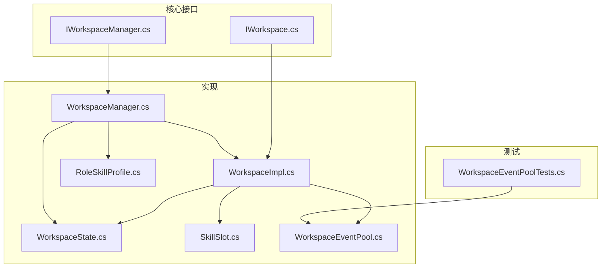
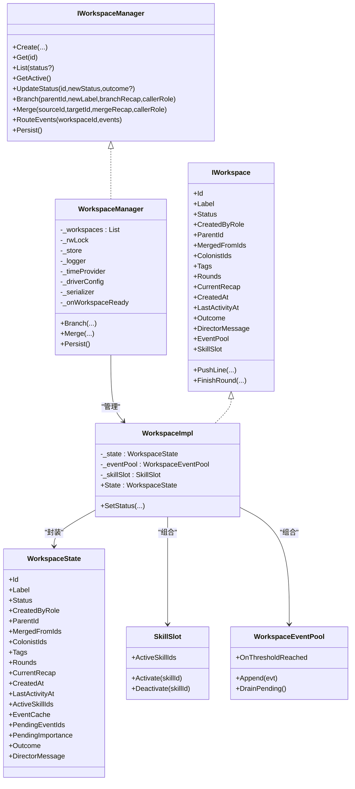
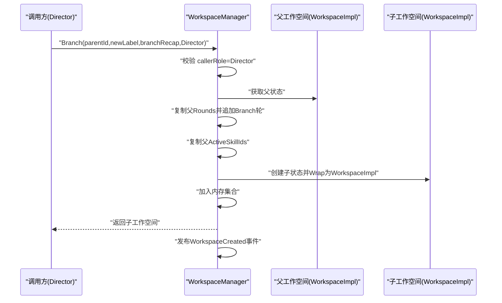
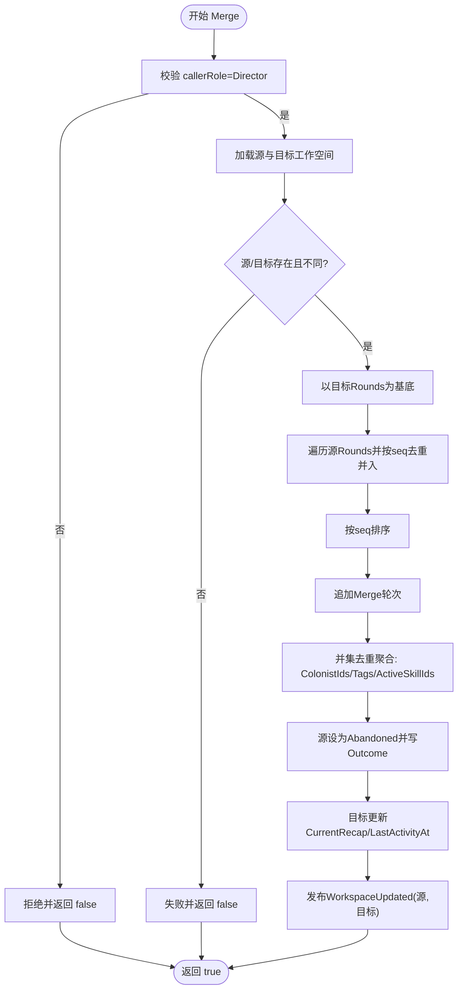
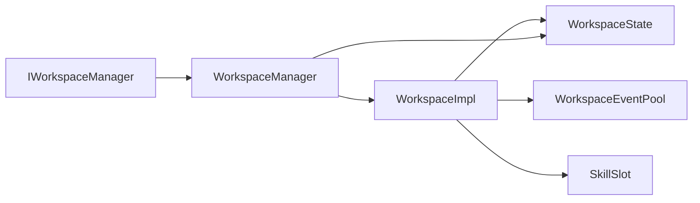

# 工作空间分支与合并

<cite>
**本文引用的文件**
- [IWorkspace.cs](file://src/NPCLife/Workspace/IWorkspace.cs)
- [WorkspaceImpl.cs](file://src/NPCLife/Workspace/WorkspaceImpl.cs)
- [WorkspaceManager.cs](file://src/NPCLife/Workspace/WorkspaceManager.cs)
- [WorkspaceState.cs](file://src/NPCLife/Workspace/WorkspaceState.cs)
- [IWorkspaceManager.cs](file://src/NPCLife/Core/IWorkspaceManager.cs)
- [SkillSlot.cs](file://src/NPCLife/Workspace/SkillSlot.cs)
- [RoleSkillProfile.cs](file://src/NPCLife/Workspace/RoleSkillProfile.cs)
- [WorkspaceEventPool.cs](file://src/NPCLife/Workspace/WorkspaceEventPool.cs)
- [WorkspaceEventPoolTests.cs](file://tests/NPCLife.Tests/Driver/WorkspaceEventPoolTests.cs)
</cite>

## 目录
1. [引言](#引言)
2. [项目结构](#项目结构)
3. [核心组件](#核心组件)
4. [架构总览](#架构总览)
5. [详细组件分析](#详细组件分析)
6. [依赖关系分析](#依赖关系分析)
7. [性能考量](#性能考量)
8. [故障排查指南](#故障排查指南)
9. [结论](#结论)
10. [附录](#附录)

## 引言
本文件系统性阐述工作空间的分支与合并机制，涵盖技术实现细节、权限控制、历史记录与版本追踪、冲突解决策略、性能与可靠性保障，并给出设计模式与最佳实践及典型使用场景。

## 项目结构
工作空间相关代码集中在 Workspace 命名空间，核心接口与实现位于 Core 与 Workspace 两个子目录；事件与技能等子系统通过接口耦合接入。

图表来源
- [IWorkspaceManager.cs:1-58](file://src/NPCLife/Core/IWorkspaceManager.cs#L1-L58)
- [WorkspaceManager.cs:1-616](file://src/NPCLife/Workspace/WorkspaceManager.cs#L1-L616)
- [IWorkspace.cs:1-51](file://src/NPCLife/Workspace/IWorkspace.cs#L1-L51)
- [WorkspaceImpl.cs:1-197](file://src/NPCLife/Workspace/WorkspaceImpl.cs#L1-L197)
- [WorkspaceState.cs:1-152](file://src/NPCLife/Workspace/WorkspaceState.cs#L1-L152)
- [SkillSlot.cs:1-61](file://src/NPCLife/Workspace/SkillSlot.cs#L1-L61)
- [RoleSkillProfile.cs:1-74](file://src/NPCLife/Workspace/RoleSkillProfile.cs#L1-L74)
- [WorkspaceEventPool.cs:1-186](file://src/NPCLife/Workspace/WorkspaceEventPool.cs#L1-L186)
- [WorkspaceEventPoolTests.cs:1-352](file://tests/NPCLife.Tests/Driver/WorkspaceEventPoolTests.cs#L1-L352)

章节来源
- [IWorkspaceManager.cs:1-58](file://src/NPCLife/Core/IWorkspaceManager.cs#L1-L58)
- [WorkspaceManager.cs:1-616](file://src/NPCLife/Workspace/WorkspaceManager.cs#L1-L616)
- [IWorkspace.cs:1-51](file://src/NPCLife/Workspace/IWorkspace.cs#L1-L51)
- [WorkspaceImpl.cs:1-197](file://src/NPCLife/Workspace/WorkspaceImpl.cs#L1-L197)
- [WorkspaceState.cs:1-152](file://src/NPCLife/Workspace/WorkspaceState.cs#L1-L152)
- [SkillSlot.cs:1-61](file://src/NPCLife/Workspace/SkillSlot.cs#L1-L61)
- [RoleSkillProfile.cs:1-74](file://src/NPCLife/Workspace/RoleSkillProfile.cs#L1-L74)
- [WorkspaceEventPool.cs:1-186](file://src/NPCLife/Workspace/WorkspaceEventPool.cs#L1-L186)
- [WorkspaceEventPoolTests.cs:1-352](file://tests/NPCLife.Tests/Driver/WorkspaceEventPoolTests.cs#L1-L352)

## 核心组件
- IWorkspaceManager：工作空间管理器抽象，定义创建、查询、状态更新、分支/合并、事件路由与持久化等职责。
- WorkspaceManager：具体实现，负责内存工作空间集合的增删改查、分支/合并、状态机校验、持久化与事件分发。
- IWorkspace：工作空间门面接口，暴露元数据、内部组件（事件池、技能槽）以及叙事操作（推词、结束轮）。
- WorkspaceImpl：IWorkspace 实现，封装 WorkspaceState 并桥接内部组件；向管理器暴露状态变更能力。
- WorkspaceState：工作空间状态模型，包含轮次序列、标签、角色、技能、事件缓存、合并来源等。
- SkillSlot：工作空间内部技能槽，封装激活/停用技能与工具集变更通知。
- RoleSkillProfile：角色默认技能配置，用于创建工作空间时的初始技能激活。
- WorkspaceEventPool：工作空间内部事件池，双层缓冲（持久化的 pending 与内存 recent），支持阈值触发。

章节来源
- [IWorkspaceManager.cs:1-58](file://src/NPCLife/Core/IWorkspaceManager.cs#L1-L58)
- [WorkspaceManager.cs:1-616](file://src/NPCLife/Workspace/WorkspaceManager.cs#L1-L616)
- [IWorkspace.cs:1-51](file://src/NPCLife/Workspace/IWorkspace.cs#L1-L51)
- [WorkspaceImpl.cs:1-197](file://src/NPCLife/Workspace/WorkspaceImpl.cs#L1-L197)
- [WorkspaceState.cs:1-152](file://src/NPCLife/Workspace/WorkspaceState.cs#L1-L152)
- [SkillSlot.cs:1-61](file://src/NPCLife/Workspace/SkillSlot.cs#L1-L61)
- [RoleSkillProfile.cs:1-74](file://src/NPCLife/Workspace/RoleSkillProfile.cs#L1-L74)
- [WorkspaceEventPool.cs:1-186](file://src/NPCLife/Workspace/WorkspaceEventPool.cs#L1-L186)

## 架构总览
工作空间采用“门面 + 管理器 + 状态模型”的分层架构。管理器持有内存工作空间集合，负责结构操作（分支/合并）、状态机与持久化；工作空间门面对外暴露只读元数据与内部组件；内部组件（事件池、技能槽）通过接口解耦。

图表来源
- [IWorkspaceManager.cs:1-58](file://src/NPCLife/Core/IWorkspaceManager.cs#L1-L58)
- [WorkspaceManager.cs:1-616](file://src/NPCLife/Workspace/WorkspaceManager.cs#L1-L616)
- [IWorkspace.cs:1-51](file://src/NPCLife/Workspace/IWorkspace.cs#L1-L51)
- [WorkspaceImpl.cs:1-197](file://src/NPCLife/Workspace/WorkspaceImpl.cs#L1-L197)
- [WorkspaceState.cs:1-152](file://src/NPCLife/Workspace/WorkspaceState.cs#L1-L152)
- [SkillSlot.cs:1-61](file://src/NPCLife/Workspace/SkillSlot.cs#L1-L61)
- [WorkspaceEventPool.cs:1-186](file://src/NPCLife/Workspace/WorkspaceEventPool.cs#L1-L186)

## 详细组件分析

### 分支创建（Branch）
- 触发入口：Director 角色调用 WorkspaceManager.Branch。
- 关键步骤
  - 权限校验：仅 Director 可执行。
  - 复制父工作空间状态：轮次序列复制并在末尾追加一条 Branch 类型轮次。
  - 新轮次序列生成：基于父轮次数量生成分支序号 seq。
  - 技能槽继承：复制父 ActiveSkillIds 作为子工作空间初始激活技能集。
  - 元数据继承：标签、角色列表等浅拷贝；父 ID 指向源工作空间；合并来源为空。
  - 状态初始化：新工作空间 Active，创建与最后活跃时间同步。
  - 事件发布：发布 WorkspaceCreated 事件，携带父 ID 信息。
- 数据完整性
  - 轮次列表深拷贝，避免共享引用导致的并发问题。
  - 技能 ID 列表深拷贝，确保后续修改不影响父工作空间。
  - 事件池与技能槽在 WorkspaceImpl 构造时独立实例化，隔离副作用。

图表来源
- [WorkspaceManager.cs:193-263](file://src/NPCLife/Workspace/WorkspaceManager.cs#L193-L263)
- [WorkspaceImpl.cs:25-46](file://src/NPCLife/Workspace/WorkspaceImpl.cs#L25-L46)

章节来源
- [WorkspaceManager.cs:193-263](file://src/NPCLife/Workspace/WorkspaceManager.cs#L193-L263)
- [WorkspaceImpl.cs:25-46](file://src/NPCLife/Workspace/WorkspaceImpl.cs#L25-L46)

### 合并算法（Merge）
- 触发入口：Director 角色调用 WorkspaceManager.Merge。
- 关键步骤
  - 权限校验：仅 Director 可执行。
  - 参数校验：源与目标存在且不相同。
  - 轮次序列去重与合并
    - 以目标工作空间轮次为基础，遍历源工作空间轮次。
    - 使用哈希集(existingSeqs)跳过与目标重复的 seq，保持最终有序。
    - 合并完成后追加一条 Merge 类型轮次。
  - 元数据聚合
    - 合并来源 MergedFromIds 追加源工作空间 ID。
    - ColonistIds 与 Tags 去重并入。
    - ActiveSkillIds 去重并入。
  - 状态与时间戳
    - 源工作空间标记为 Abandoned，写入 Outcome 描述。
    - 目标工作空间更新 CurrentRecap、LastActivityAt。
  - 事件发布：向源与目标发布 WorkspaceUpdated 事件。
- 冲突解决策略
  - 轮次序号冲突：通过 seq 去重策略解决，保留目标已有轮次，源重复轮次被忽略。
  - 元数据冲突：采用“并集去重”策略，保证不丢失任何元素。
  - 技能冲突：并集去重，确保目标工作空间获得源工作空间的全部激活技能。
- 数据完整性保证
  - 所有集合均进行深拷贝或去重插入，避免共享引用引发的竞态。
  - 最终排序确保轮次顺序稳定。
  - 状态转换与时间戳统一更新，保证历史一致性。

图表来源
- [WorkspaceManager.cs:269-376](file://src/NPCLife/Workspace/WorkspaceManager.cs#L269-L376)

章节来源
- [WorkspaceManager.cs:269-376](file://src/NPCLife/Workspace/WorkspaceManager.cs#L269-L376)

### 权限控制机制
- 分支与合并仅允许 Director 角色执行。WorkspaceManager 在分支与合并入口处进行 callerRole 校验，不符合则记录警告并拒绝操作。
- 叙事操作（推词、结束轮）仅允许 Screenwriter/Freelancer 执行，Director 无直接叙事权限，体现职责分离。

章节来源
- [WorkspaceManager.cs:195-199](file://src/NPCLife/Workspace/WorkspaceManager.cs#L195-L199)
- [WorkspaceManager.cs:271-275](file://src/NPCLife/Workspace/WorkspaceManager.cs#L271-L275)
- [WorkspaceImpl.cs:88-98](file://src/NPCLife/Workspace/WorkspaceImpl.cs#L88-L98)
- [WorkspaceImpl.cs:128-138](file://src/NPCLife/Workspace/WorkspaceImpl.cs#L128-L138)

### 工作空间历史记录与版本追踪
- 历史记录
  - 轮次序列：WorkspaceState.Rounds 记录所有轮次，包含 Normal/Branch/Merge 三类。
  - 合并记录：Merge 轮次仅包含前情提要，不包含台词，用于结构层面的版本追踪。
  - 合并来源：WorkspaceState.MergedFromIds 记录被合并的源工作空间 ID 列表，形成 DAG 形式的合并树。
  - 分支来源：WorkspaceState.ParentId 指向父工作空间 ID，形成树形分支结构。
- 版本追踪
  - 通过轮次序号 seq 与轮次类型区分结构轮与叙事轮。
  - 通过 CreatedAt/LastActivityAt 记录关键节点时间戳，便于审计与统计。

章节来源
- [WorkspaceState.cs:60-88](file://src/NPCLife/Workspace/WorkspaceState.cs#L60-L88)
- [WorkspaceState.cs:94-150](file://src/NPCLife/Workspace/WorkspaceState.cs#L94-L150)
- [WorkspaceManager.cs:213-224](file://src/NPCLife/Workspace/WorkspaceManager.cs#L213-L224)
- [WorkspaceManager.cs:313-324](file://src/NPCLife/Workspace/WorkspaceManager.cs#L313-L324)

### 技能槽继承与默认激活
- 默认技能
  - WorkspaceManager.Create 时根据创建角色调用 RoleSkillProfile.GetDefaultSkillIds 获取默认技能集并激活。
- 分支继承
  - WorkspaceManager.Branch 时复制父 ActiveSkillIds 作为子工作空间初始技能集。
- 技能变更
  - WorkspaceImpl.SkillSlot 提供 Activate/Deactivate，变更会触发 WorkspaceManager 注册的更新回调，进而持久化与事件发布。

章节来源
- [WorkspaceManager.cs:91-138](file://src/NPCLife/Workspace/WorkspaceManager.cs#L91-L138)
- [WorkspaceManager.cs:226-248](file://src/NPCLife/Workspace/WorkspaceManager.cs#L226-L248)
- [RoleSkillProfile.cs:58-71](file://src/NPCLife/Workspace/RoleSkillProfile.cs#L58-L71)
- [SkillSlot.cs:24-58](file://src/NPCLife/Workspace/SkillSlot.cs#L24-L58)
- [WorkspaceImpl.cs:39-45](file://src/NPCLife/Workspace/WorkspaceImpl.cs#L39-L45)

### 事件池与阈值触发（对分支合并的影响）
- 事件池双层结构
  - pending：随 WorkspaceState 持久化，包含 EventCache、PendingEventIds、PendingImportance。
  - recent：仅内存，限制容量，用于查询与最近事件访问。
- 阈值触发
  - 根据角色与配置计算有效阈值，达到后触发 OnThresholdReached，供上层流程（如 AgentLoop）被动激活。
- 对分支合并的意义
  - 合并不会改变事件池的阈值规则，但会合并 pending 事件集合（通过轮次序列与元数据聚合），从而影响后续 DrainPending 的结果。
  - 合并后的工作空间仍维持独立的事件池实例，避免跨工作空间的事件泄漏。

章节来源
- [WorkspaceEventPool.cs:21-90](file://src/NPCLife/Workspace/WorkspaceEventPool.cs#L21-L90)
- [WorkspaceEventPool.cs:166-183](file://src/NPCLife/Workspace/WorkspaceEventPool.cs#L166-L183)
- [WorkspaceEventPoolTests.cs:19-31](file://tests/NPCLife.Tests/Driver/WorkspaceEventPoolTests.cs#L19-L31)

## 依赖关系分析
- 管理器与实现
  - WorkspaceManager 实现 IWorkspaceManager，管理 WorkspaceImpl 集合。
  - WorkspaceImpl 实现 IWorkspace，封装 WorkspaceState 并组合 WorkspaceEventPool 与 SkillSlot。
- 状态模型
  - WorkspaceState 是纯 DTO，承载所有工作空间状态字段，被管理器与实现共同读写。
- 组件耦合
  - 事件池与技能槽通过接口与 WorkspaceImpl 解耦，降低耦合度。
  - 管理器通过持久化接口与存储后端交互，支持扩展。

图表来源
- [IWorkspaceManager.cs:1-58](file://src/NPCLife/Core/IWorkspaceManager.cs#L1-L58)
- [WorkspaceManager.cs:1-616](file://src/NPCLife/Workspace/WorkspaceManager.cs#L1-L616)
- [IWorkspace.cs:1-51](file://src/NPCLife/Workspace/IWorkspace.cs#L1-L51)
- [WorkspaceImpl.cs:1-197](file://src/NPCLife/Workspace/WorkspaceImpl.cs#L1-L197)
- [WorkspaceState.cs:1-152](file://src/NPCLife/Workspace/WorkspaceState.cs#L1-L152)
- [WorkspaceEventPool.cs:1-186](file://src/NPCLife/Workspace/WorkspaceEventPool.cs#L1-L186)
- [SkillSlot.cs:1-61](file://src/NPCLife/Workspace/SkillSlot.cs#L1-L61)

章节来源
- [IWorkspaceManager.cs:1-58](file://src/NPCLife/Core/IWorkspaceManager.cs#L1-L58)
- [WorkspaceManager.cs:1-616](file://src/NPCLife/Workspace/WorkspaceManager.cs#L1-L616)
- [IWorkspace.cs:1-51](file://src/NPCLife/Workspace/IWorkspace.cs#L1-L51)
- [WorkspaceImpl.cs:1-197](file://src/NPCLife/Workspace/WorkspaceImpl.cs#L1-L197)
- [WorkspaceState.cs:1-152](file://src/NPCLife/Workspace/WorkspaceState.cs#L1-L152)
- [WorkspaceEventPool.cs:1-186](file://src/NPCLife/Workspace/WorkspaceEventPool.cs#L1-L186)
- [SkillSlot.cs:1-61](file://src/NPCLife/Workspace/SkillSlot.cs#L1-L61)

## 性能考量
- 并发与锁
  - 管理器使用 ReaderWriterLockSlim 保护工作空间集合的读写，读多写少场景下提升吞吐。
- 持久化
  - 批量序列化与一次性写入，减少 IO 次数；异常捕获避免崩溃。
- 合并复杂度
  - 轮次去重使用 HashSet，时间复杂度近似 O(n+m)，其中 n 为目标轮次数，m 为源轮次数。
  - 排序成本 O(k log k)，k 为合并后轮次数。
- 事件池
  - pending 事件清空与重要度重置，避免长期累积导致内存压力。
  - recent 历史容量限制，按最小重要度淘汰，平衡内存与查询效率。

章节来源
- [WorkspaceManager.cs:21-48](file://src/NPCLife/Workspace/WorkspaceManager.cs#L21-L48)
- [WorkspaceManager.cs:50-74](file://src/NPCLife/Workspace/WorkspaceManager.cs#L50-L74)
- [WorkspaceManager.cs:295-309](file://src/NPCLife/Workspace/WorkspaceManager.cs#L295-L309)
- [WorkspaceEventPool.cs:61-74](file://src/NPCLife/Workspace/WorkspaceEventPool.cs#L61-L74)
- [WorkspaceEventPool.cs:166-183](file://src/NPCLife/Workspace/WorkspaceEventPool.cs#L166-L183)

## 故障排查指南
- 权限错误
  - 现象：分支/合并被拒绝并记录警告。
  - 排查：确认调用方角色为 Director；检查 WorkspaceManager 日志。
- 参数错误
  - 现象：分支/合并失败返回 false。
  - 排查：确认源/目标 ID 存在且不相同；检查 WorkspaceManager 日志。
- 状态机错误
  - 现象：状态更新无效。
  - 排查：检查 WorkspaceStatus 转换是否合法；参考状态机约束。
- 事件池阈值未触发
  - 现象：OnThresholdReached 未触发。
  - 排查：核对 DriverConfig 阈值配置与角色；确认事件重要度累计与 pending 清空逻辑。

章节来源
- [WorkspaceManager.cs:195-199](file://src/NPCLife/Workspace/WorkspaceManager.cs#L195-L199)
- [WorkspaceManager.cs:271-275](file://src/NPCLife/Workspace/WorkspaceManager.cs#L271-L275)
- [WorkspaceManager.cs:201-206](file://src/NPCLife/Workspace/WorkspaceManager.cs#L201-L206)
- [WorkspaceManager.cs:277-284](file://src/NPCLife/Workspace/WorkspaceManager.cs#L277-L284)
- [WorkspaceManager.cs:170-174](file://src/NPCLife/Workspace/WorkspaceManager.cs#L170-L174)
- [WorkspaceEventPoolTests.cs:138-175](file://tests/NPCLife.Tests/Driver/WorkspaceEventPoolTests.cs#L138-L175)

## 结论
分支与合并机制通过严格的权限控制、完善的轮次去重与元数据聚合策略，实现了工作空间结构的可控演进。结合事件池阈值触发与技能槽继承，系统在保证数据完整性的同时，提供了灵活的创作与管理能力。建议遵循最佳实践，在明确的业务场景下进行分支与合并，避免频繁小粒度合并导致历史碎片化。

## 附录

### 设计模式与最佳实践
- 设计模式
  - 门面模式：IWorkspace 作为门面，屏蔽内部组件细节。
  - 组合/聚合：WorkspaceImpl 组合 WorkspaceEventPool 与 SkillSlot，实现职责分离。
  - 策略模式：不同角色的默认技能集通过 RoleSkillProfile 策略化配置。
- 最佳实践
  - 何时分支：当需要探索不同叙事方向或并行验证多个假设时进行分支。
  - 如何避免分支污染：严格限制分支内的叙事边界，避免无关角色/事件进入；定期清理不再使用的分支。
  - 合并时机：在分支产出稳定、具备明确结论或统一方向时进行合并；合并前先审查轮次去重与元数据聚合结果。
  - 冲突规避：尽量避免在同一 seq 下产生不同分支的轮次；若不可避免，优先保留目标工作空间的版本。

### 实际使用场景与示例路径
- 场景一：并行探索不同结局
  - 步骤：Director 分支出两条或多条分支工作空间，分别推进不同结局；完成后选择最优分支进行合并。
  - 示例路径
    - [WorkspaceManager.cs:193-263](file://src/NPCLife/Workspace/WorkspaceManager.cs#L193-L263)
    - [WorkspaceManager.cs:269-376](file://src/NPCLife/Workspace/WorkspaceManager.cs#L269-L376)
- 场景二：整合临时任务与主线剧情
  - 步骤：Freelancer 或 Screenwriter 在独立工作空间中处理临时事件，完成后合并至主线工作空间。
  - 示例路径
    - [WorkspaceImpl.cs:83-123](file://src/NPCLife/Workspace/WorkspaceImpl.cs#L83-L123)
    - [WorkspaceManager.cs:367-375](file://src/NPCLife/Workspace/WorkspaceManager.cs#L367-L375)
- 场景三：角色/环境/事件查询能力的差异
  - 说明：不同角色默认技能不同，直接影响创作能力与视角；Director 更关注结构与全局，Screenwriter 关注完整叙事上下文。
  - 示例路径
    - [RoleSkillProfile.cs:58-71](file://src/NPCLife/Workspace/RoleSkillProfile.cs#L58-L71)
    - [WorkspaceManager.cs:119-124](file://src/NPCLife/Workspace/WorkspaceManager.cs#L119-L124)