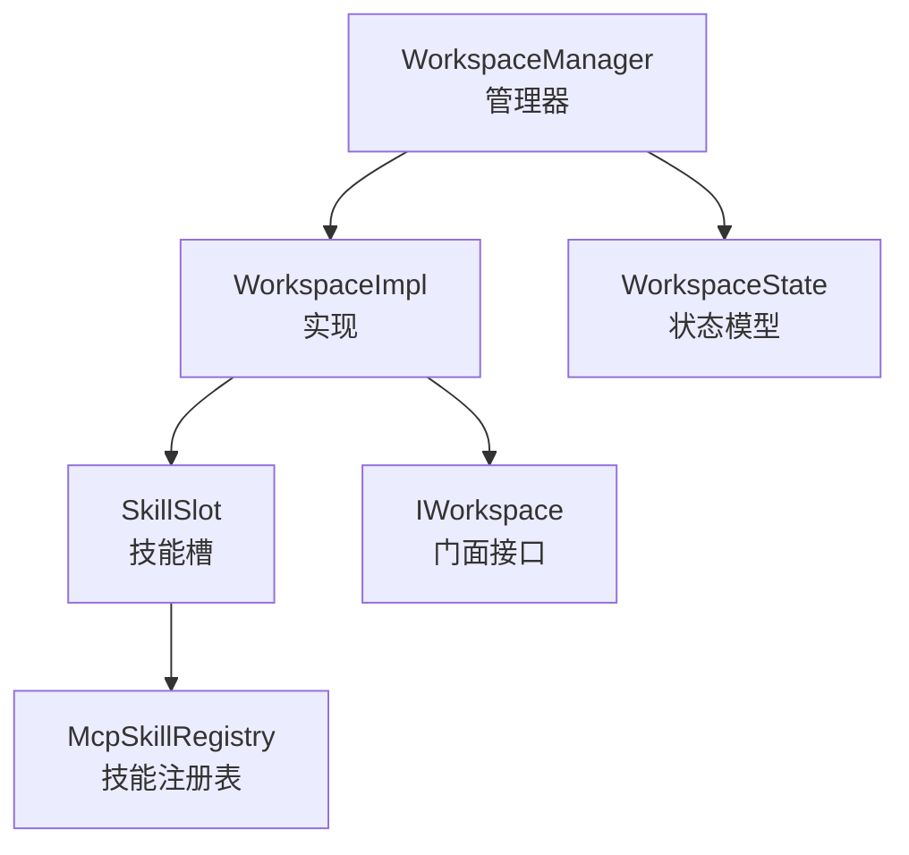
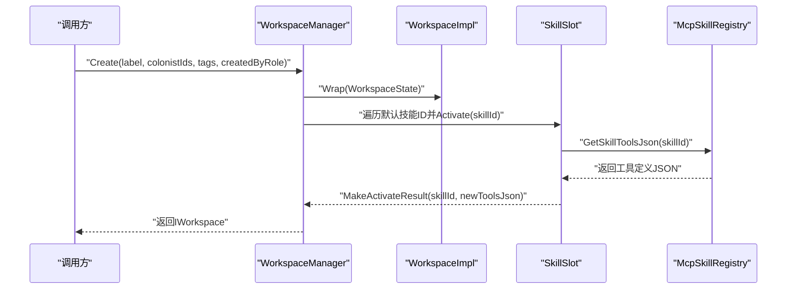
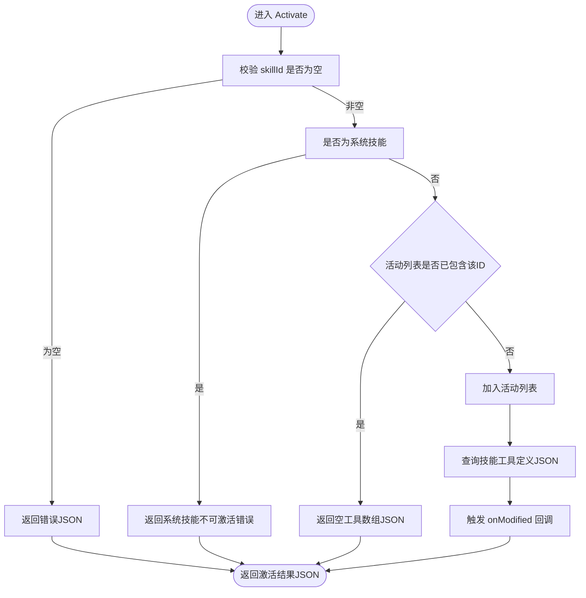
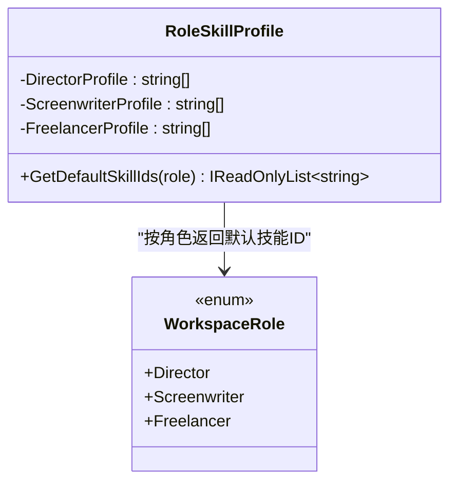
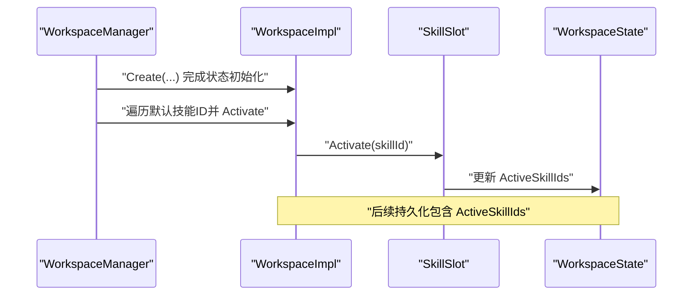
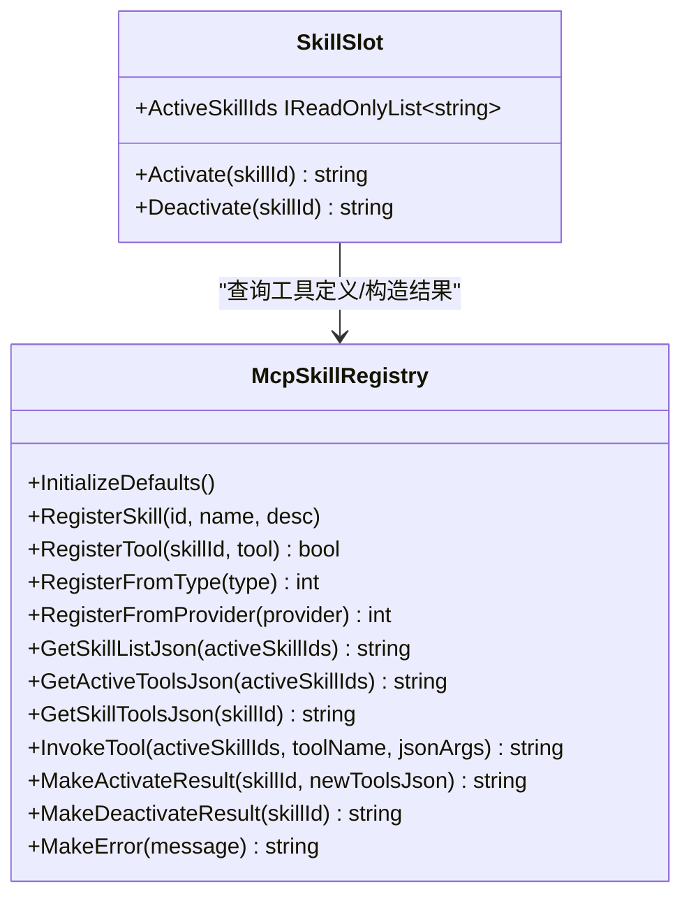
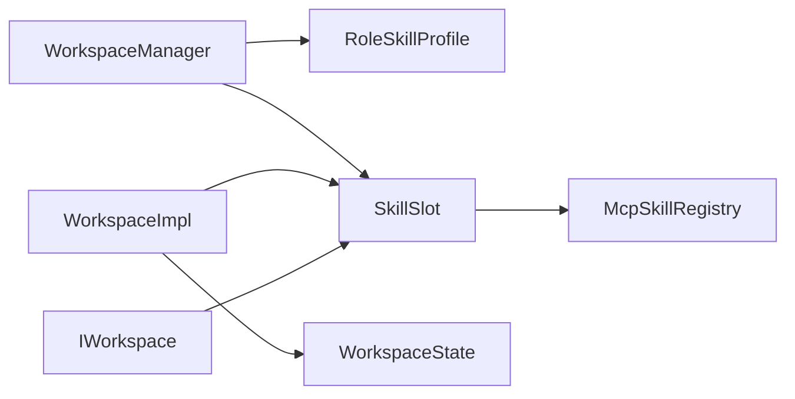

# 工作空间技能系统

<cite>
**本文引用的文件**
- [SkillSlot.cs](file://src/NPCLife/Workspace/SkillSlot.cs)
- [RoleSkillProfile.cs](file://src/NPCLife/Workspace/RoleSkillProfile.cs)
- [WorkspaceImpl.cs](file://src/NPCLife/Workspace/WorkspaceImpl.cs)
- [WorkspaceManager.cs](file://src/NPCLife/Workspace/WorkspaceManager.cs)
- [WorkspaceState.cs](file://src/NPCLife/Workspace/WorkspaceState.cs)
- [IWorkspace.cs](file://src/NPCLife/Workspace/IWorkspace.cs)
- [McpSkillRegistry.cs](file://src/NPCLife/Framework/Mcp/McpSkillRegistry.cs)
</cite>

## 目录
1. [简介](#简介)
2. [项目结构](#项目结构)
3. [核心组件](#核心组件)
4. [架构总览](#架构总览)
5. [组件详解](#组件详解)
6. [依赖关系分析](#依赖关系分析)
7. [性能考量](#性能考量)
8. [故障排查指南](#故障排查指南)
9. [结论](#结论)
10. [附录](#附录)

## 简介
本文件系统性阐述工作空间技能系统的设计与实现，重点覆盖以下方面：
- 技能槽（SkillSlot）的架构设计与激活机制：技能ID管理、激活状态跟踪、技能效果应用（通过MCP工具集合体现）。
- 角色技能配置（RoleSkillProfile）：不同角色的默认技能集、技能组合规则与优先级。
- 与工作空间生命周期的集成：创建时自动激活、状态变更时的技能调整。
- 扩展机制：新增技能类型与自定义技能行为的方式。
- 性能优化策略：技能查找效率与内存占用控制。
- 实际应用场景与配置示例。

## 项目结构
工作空间技能系统位于工作空间模块内，并与MCP技能注册表紧密协作。核心文件如下：
- 技能槽：SkillSlot.cs
- 角色技能配置：RoleSkillProfile.cs
- 工作空间实现：WorkspaceImpl.cs
- 工作空间管理器：WorkspaceManager.cs
- 工作空间状态模型：WorkspaceState.cs
- 工作空间门面接口：IWorkspace.cs
- MCP技能注册表：McpSkillRegistry.cs

图表来源
- [WorkspaceManager.cs:91-138](file://src/NPCLife/Workspace/WorkspaceManager.cs#L91-L138)
- [WorkspaceImpl.cs:25-46](file://src/NPCLife/Workspace/WorkspaceImpl.cs#L25-L46)
- [SkillSlot.cs:16-20](file://src/NPCLife/Workspace/SkillSlot.cs#L16-L20)
- [McpSkillRegistry.cs:22-76](file://src/NPCLife/Framework/Mcp/McpSkillRegistry.cs#L22-L76)

章节来源
- [WorkspaceManager.cs:91-138](file://src/NPCLife/Workspace/WorkspaceManager.cs#L91-L138)
- [WorkspaceImpl.cs:25-46](file://src/NPCLife/Workspace/WorkspaceImpl.cs#L25-L46)
- [SkillSlot.cs:11-20](file://src/NPCLife/Workspace/SkillSlot.cs#L11-L20)
- [McpSkillRegistry.cs:22-76](file://src/NPCLife/Framework/Mcp/McpSkillRegistry.cs#L22-L76)

## 核心组件
- 技能槽（SkillSlot）：封装激活/停用技能的逻辑，维护活动技能ID列表，并在修改时回调通知上层状态同步。
- 角色技能配置（RoleSkillProfile）：根据角色（导演、编剧、临时工）返回默认技能ID集合。
- 工作空间实现（WorkspaceImpl）：持有技能槽实例，负责在创建时注入默认技能，并在状态变更时同步持久化。
- 工作空间管理器（WorkspaceManager）：负责工作空间的CRUD、分支/合并、事件路由；在创建时依据角色自动激活默认技能。
- MCP技能注册表（McpSkillRegistry）：提供技能元数据、工具注册、工具查询与调用、结果JSON构造等能力。
- 工作空间状态（WorkspaceState）：持久化字段包含ActiveSkillIds，确保技能状态可恢复。

章节来源
- [SkillSlot.cs:11-60](file://src/NPCLife/Workspace/SkillSlot.cs#L11-L60)
- [RoleSkillProfile.cs:13-72](file://src/NPCLife/Workspace/RoleSkillProfile.cs#L13-L72)
- [WorkspaceImpl.cs:16-46](file://src/NPCLife/Workspace/WorkspaceImpl.cs#L16-L46)
- [WorkspaceManager.cs:91-138](file://src/NPCLife/Workspace/WorkspaceManager.cs#L91-L138)
- [McpSkillRegistry.cs:22-470](file://src/NPCLife/Framework/Mcp/McpSkillRegistry.cs#L22-L470)
- [WorkspaceState.cs:94-150](file://src/NPCLife/Workspace/WorkspaceState.cs#L94-L150)

## 架构总览
技能系统围绕“技能槽”与“技能注册表”展开，工作空间生命周期贯穿技能的创建、传播与持久化。

图表来源
- [WorkspaceManager.cs:91-138](file://src/NPCLife/Workspace/WorkspaceManager.cs#L91-L138)
- [WorkspaceImpl.cs:38-45](file://src/NPCLife/Workspace/WorkspaceImpl.cs#L38-L45)
- [SkillSlot.cs:24-45](file://src/NPCLife/Workspace/SkillSlot.cs#L24-L45)
- [McpSkillRegistry.cs:289-312](file://src/NPCLife/Framework/Mcp/McpSkillRegistry.cs#L289-L312)

## 组件详解

### 技能槽（SkillSlot）设计与激活机制
- 职责边界
  - 维护活动技能ID列表（ActiveSkillIds）。
  - 提供激活（Activate）与停用（Deactivate）能力。
  - 与McpSkillRegistry协作，获取技能工具定义并构造激活/停用结果。
  - 通过回调通知上层状态变更，以便持久化与事件发布。
- 激活流程
  - 参数校验：禁止空skillId；系统技能不可被显式激活。
  - 去重：若技能ID已存在，不再重复添加，返回空工具数组。
  - 新增：将技能ID加入活动列表，查询其工具定义JSON，构造激活结果。
- 停用流程
  - 参数校验：禁止空skillId；系统技能不可被停用。
  - 移除：从活动列表移除，通知上层。
- 错误处理
  - 所有错误通过McpSkillRegistry.MakeError统一构造错误结果JSON，便于上层识别与日志记录。

图表来源
- [SkillSlot.cs:24-45](file://src/NPCLife/Workspace/SkillSlot.cs#L24-L45)
- [McpSkillRegistry.cs:443-467](file://src/NPCLife/Framework/Mcp/McpSkillRegistry.cs#L443-L467)

章节来源
- [SkillSlot.cs:11-60](file://src/NPCLife/Workspace/SkillSlot.cs#L11-L60)
- [McpSkillRegistry.cs:443-467](file://src/NPCLife/Framework/Mcp/McpSkillRegistry.cs#L443-L467)

### 角色技能配置（RoleSkillProfile）
- 设计原则
  - 导演：全局视角与结构管理，不涉及叙事细节。
  - 编剧：完整叙事创作工具集，包含关系、环境、事件等上下文。
  - 临时工：轻量查询与快速输出，不涉及复杂上下文。
- 默认技能集
  - 导演：工作空间方向、殖民地概览、角色查询、事件查询、知识管理。
  - 编剧：工作空间写作、殖民地概览、角色查询、关系查询、事件查询、环境查询、知识管理。
  - 临时工：工作空间临时工、角色查询、事件查询。
- 查询接口
  - GetDefaultSkillIds(WorkspaceRole)：按角色返回默认技能ID列表。

图表来源
- [RoleSkillProfile.cs:13-72](file://src/NPCLife/Workspace/RoleSkillProfile.cs#L13-L72)
- [WorkspaceState.cs:9-20](file://src/NPCLife/Workspace/WorkspaceState.cs#L9-L20)

章节来源
- [RoleSkillProfile.cs:13-72](file://src/NPCLife/Workspace/RoleSkillProfile.cs#L13-L72)
- [WorkspaceState.cs:9-20](file://src/NPCLife/Workspace/WorkspaceState.cs#L9-L20)

### 与工作空间生命周期的集成
- 创建时自动激活
  - WorkspaceManager.Create在创建WorkspaceState后，调用RoleSkillProfile.GetDefaultSkillIds获取默认技能ID，并逐个调用SkillSlot.Activate进行激活。
- 状态变更时的技能调整
  - 分支（Branch）：子工作空间继承父工作空间的活动技能ID。
  - 合并（Merge）：目标工作空间汇总源工作空间的活动技能ID，去重后合并。
  - 更新状态：WorkspaceImpl.SetStatus仅更新状态与时间戳，不改变技能集合。
- 持久化与恢复
  - WorkspaceState.ActiveSkillIds参与序列化/反序列化，保证冷启动后技能状态可恢复。

图表来源
- [WorkspaceManager.cs:91-138](file://src/NPCLife/Workspace/WorkspaceManager.cs#L91-L138)
- [WorkspaceImpl.cs:38-45](file://src/NPCLife/Workspace/WorkspaceImpl.cs#L38-L45)
- [WorkspaceState.cs:132-133](file://src/NPCLife/Workspace/WorkspaceState.cs#L132-L133)

章节来源
- [WorkspaceManager.cs:91-138](file://src/NPCLife/Workspace/WorkspaceManager.cs#L91-L138)
- [WorkspaceImpl.cs:38-45](file://src/NPCLife/Workspace/WorkspaceImpl.cs#L38-L45)
- [WorkspaceState.cs:132-133](file://src/NPCLife/Workspace/WorkspaceState.cs#L132-L133)

### 技能系统与MCP工具的衔接
- 工具注册
  - McpSkillRegistry.RegisterFromType/Provider将带[McpSkill]/[McpTool]标注的方法注册到对应技能下，形成“技能→工具列表”的映射。
- 工具查询
  - GetActiveToolsJson：返回系统技能+当前激活业务技能的所有工具定义JSON，用于prompt构造。
  - GetSkillToolsJson：返回指定技能的工具定义JSON。
- 工具调用
  - InvokeTool：在激活技能范围内查找工具并执行，失败时返回错误JSON；同时发布工具调用前后事件。
- 结果构造
  - MakeActivateResult/MakeDeactivateResult/MakeError：统一返回JSON结构，便于前端与上层处理。

图表来源
- [McpSkillRegistry.cs:22-470](file://src/NPCLife/Framework/Mcp/McpSkillRegistry.cs#L22-L470)
- [SkillSlot.cs:24-58](file://src/NPCLife/Workspace/SkillSlot.cs#L24-L58)

章节来源
- [McpSkillRegistry.cs:22-470](file://src/NPCLife/Framework/Mcp/McpSkillRegistry.cs#L22-L470)
- [SkillSlot.cs:24-58](file://src/NPCLife/Workspace/SkillSlot.cs#L24-L58)

### 扩展机制：新增技能类型与自定义技能行为
- 新增技能类型
  - 在McpSkillRegistry.InitializeDefaults中注册新技能元数据（Id、Name、Description）。
  - 使用RegisterFromType/Provider将工具方法自动注册到新技能下。
- 自定义技能行为
  - 通过McpTool的Invoker实现具体行为；工具参数采用JSON格式，便于与LLM交互。
  - 若需特殊激活/停用副作用，可在SkillSlot的onModified回调中扩展（例如同步外部缓存或发布事件）。

章节来源
- [McpSkillRegistry.cs:52-175](file://src/NPCLife/Framework/Mcp/McpSkillRegistry.cs#L52-L175)
- [McpSkillRegistry.cs:353-437](file://src/NPCLife/Framework/Mcp/McpSkillRegistry.cs#L353-L437)
- [SkillSlot.cs:16-20](file://src/NPCLife/Workspace/SkillSlot.cs#L16-L20)

### 实际应用场景与配置示例
- 场景一：创建导演工作空间
  - 角色：Director
  - 默认技能：工作空间方向、殖民地概览、角色查询、事件查询、知识管理
  - 效果：自动注入上述技能，系统技能始终可用
- 场景二：创建编剧工作空间
  - 角色：Screenwriter
  - 默认技能：工作空间写作、殖民地概览、角色查询、关系查询、事件查询、环境查询、知识管理
  - 效果：具备完整叙事创作上下文
- 场景三：创建临时工工作空间
  - 角色：Freelancer
  - 默认技能：工作空间临时工、角色查询、事件查询
  - 效果：轻量工具集，适合快速对话与独立事件
- 场景四：分支/合并后的技能传播
  - 分支：子工作空间继承父工作空间的活动技能ID
  - 合并：目标工作空间汇总源工作空间的活动技能ID并去重

章节来源
- [RoleSkillProfile.cs:19-51](file://src/NPCLife/Workspace/RoleSkillProfile.cs#L19-L51)
- [WorkspaceManager.cs:226-248](file://src/NPCLife/Workspace/WorkspaceManager.cs#L226-L248)
- [WorkspaceManager.cs:356-365](file://src/NPCLife/Workspace/WorkspaceManager.cs#L356-L365)

## 依赖关系分析
- 组件耦合
  - WorkspaceManager依赖RoleSkillProfile与SkillSlot，负责创建时的默认技能激活与分支/合并时的技能传播。
  - WorkspaceImpl持有SkillSlot并将其与WorkspaceState的ActiveSkillIds绑定，实现状态同步与持久化。
  - SkillSlot依赖McpSkillRegistry进行工具查询与结果构造。
- 外部依赖
  - McpSkillRegistry为纯静态注册表，提供技能与工具的元数据与查询能力。
- 循环依赖
  - 未发现循环依赖；各模块职责清晰，接口边界明确。

图表来源
- [WorkspaceManager.cs:91-138](file://src/NPCLife/Workspace/WorkspaceManager.cs#L91-L138)
- [WorkspaceImpl.cs:25-46](file://src/NPCLife/Workspace/WorkspaceImpl.cs#L25-L46)
- [SkillSlot.cs:16-20](file://src/NPCLife/Workspace/SkillSlot.cs#L16-L20)
- [McpSkillRegistry.cs:22-76](file://src/NPCLife/Framework/Mcp/McpSkillRegistry.cs#L22-L76)

章节来源
- [WorkspaceManager.cs:91-138](file://src/NPCLife/Workspace/WorkspaceManager.cs#L91-L138)
- [WorkspaceImpl.cs:25-46](file://src/NPCLife/Workspace/WorkspaceImpl.cs#L25-L46)
- [SkillSlot.cs:16-20](file://src/NPCLife/Workspace/SkillSlot.cs#L16-L20)
- [McpSkillRegistry.cs:22-76](file://src/NPCLife/Framework/Mcp/McpSkillRegistry.cs#L22-L76)

## 性能考量
- 技能查找效率
  - 激活/停用时对活动技能ID列表进行Contains/Add/Remove操作，列表规模通常较小（技能数量有限），时间复杂度近似O(n)，满足实时需求。
  - 工具查询（GetActiveToolsJson/GetSkillToolsJson）基于字典映射，查找为O(1)；工具调用（InvokeTool）先按业务技能再fallback至系统技能，整体仍为常数级查找。
- 内存占用控制
  - 活动技能ID列表与工具定义JSON在运行期驻留；可通过减少不必要的技能激活降低工具定义JSON体积。
  - 序列化时仅持久化ActiveSkillIds，避免冗余字段，降低存储与传输成本。
- 并发与锁
  - McpSkillRegistry内部使用锁保护注册表读写，避免并发冲突；技能查询与调用为纯函数，适合高并发场景。
- 建议
  - 将常用技能保持激活，非常用技能按需激活/停用，减少工具定义JSON大小。
  - 在分支/合并时尽量复用现有技能集合，避免重复注册相同工具。

章节来源
- [SkillSlot.cs:33-42](file://src/NPCLife/Workspace/SkillSlot.cs#L33-L42)
- [McpSkillRegistry.cs:249-287](file://src/NPCLife/Framework/Mcp/McpSkillRegistry.cs#L249-L287)
- [McpSkillRegistry.cs:387-437](file://src/NPCLife/Framework/Mcp/McpSkillRegistry.cs#L387-L437)

## 故障排查指南
- 激活/停用返回错误
  - 空skillId：检查调用方参数传递。
  - 系统技能不可激活/停用：系统技能始终可用，不应尝试显式变更。
- 工具调用失败
  - 工具不存在：确认技能ID正确且工具已注册。
  - 工具执行异常：查看错误JSON中的消息，定位具体异常并修复工具实现。
- 技能未生效
  - 检查WorkspaceState.ActiveSkillIds是否正确持久化与恢复。
  - 确认SkillSlot的onModified回调是否触发状态同步。

章节来源
- [SkillSlot.cs:26-30](file://src/NPCLife/Workspace/SkillSlot.cs#L26-L30)
- [SkillSlot.cs:49-53](file://src/NPCLife/Workspace/SkillSlot.cs#L49-L53)
- [McpSkillRegistry.cs:461-467](file://src/NPCLife/Framework/Mcp/McpSkillRegistry.cs#L461-L467)
- [McpSkillRegistry.cs:436](file://src/NPCLife/Framework/Mcp/McpSkillRegistry.cs#L436)

## 结论
工作空间技能系统通过SkillSlot与McpSkillRegistry的协同，实现了以技能为中心的能力开放与管理。系统在创建阶段即按角色注入默认技能，结合分支/合并传播技能集合，确保了工作空间生命周期内的能力一致性。通过统一的结果JSON与工具调用机制，系统既满足了实时交互需求，也提供了良好的扩展性与可观测性。配合合理的性能优化策略，可在保证体验的同时控制内存与计算开销。

## 附录
- 关键接口与职责
  - IWorkspace：对外门面，暴露元数据、内部组件与叙事操作。
  - SkillSlot：技能激活/停用与状态同步。
  - RoleSkillProfile：角色到默认技能集的映射。
  - WorkspaceManager：工作空间CRUD、分支/合并与技能传播。
  - McpSkillRegistry：技能与工具的注册、查询与调用。

章节来源
- [IWorkspace.cs:11-50](file://src/NPCLife/Workspace/IWorkspace.cs#L11-L50)
- [WorkspaceManager.cs:19-41](file://src/NPCLife/Workspace/WorkspaceManager.cs#L19-L41)
- [McpSkillRegistry.cs:22-76](file://src/NPCLife/Framework/Mcp/McpSkillRegistry.cs#L22-L76)