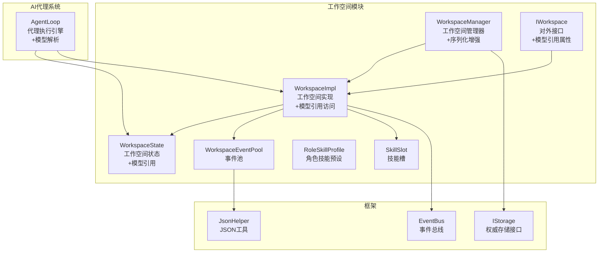
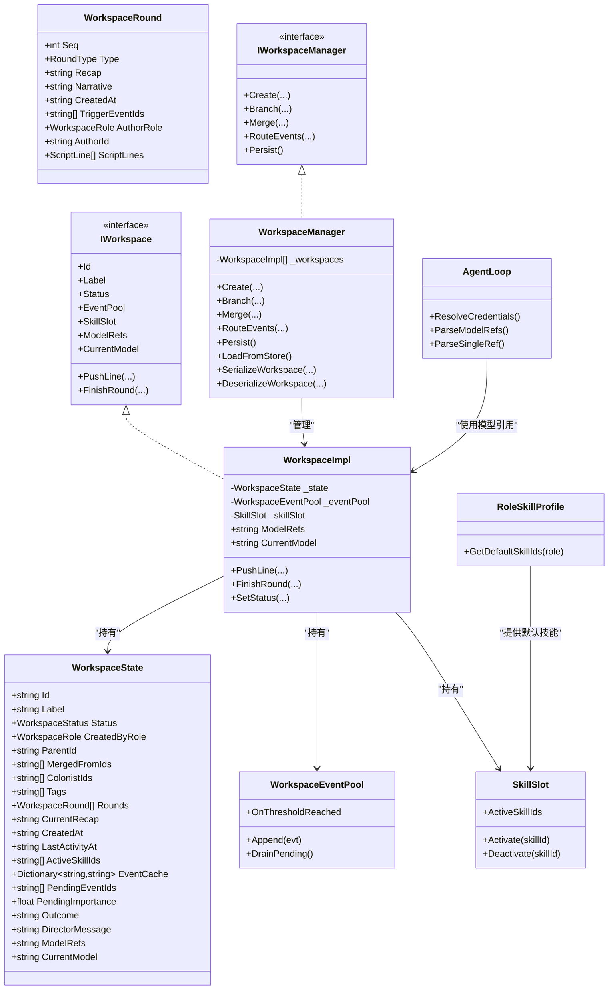
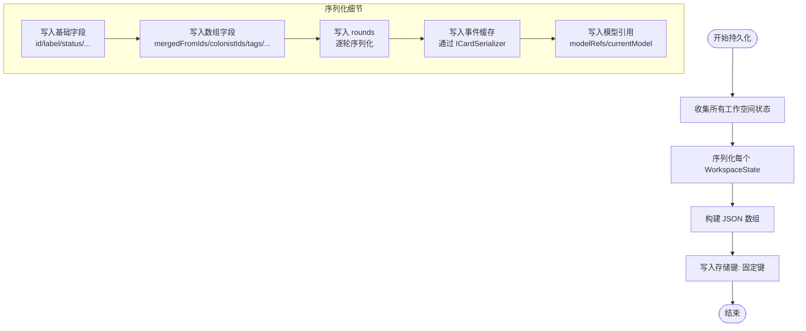
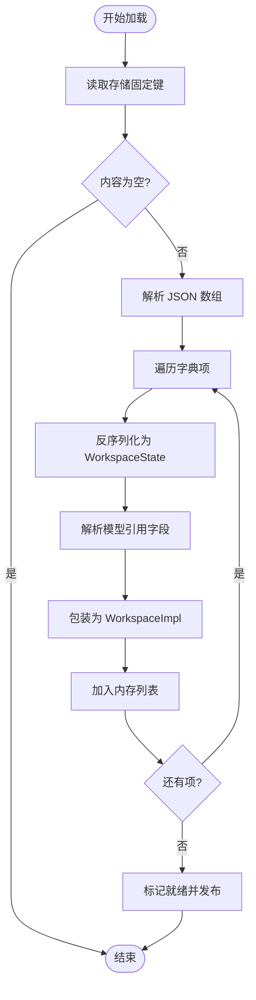
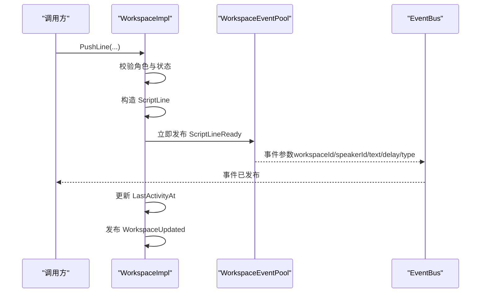
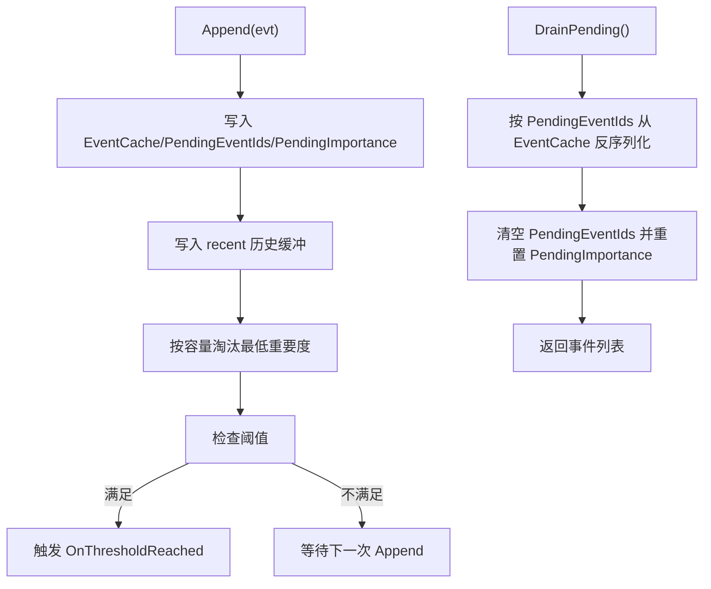
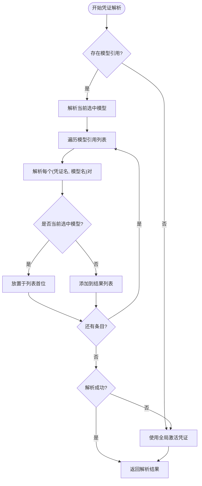
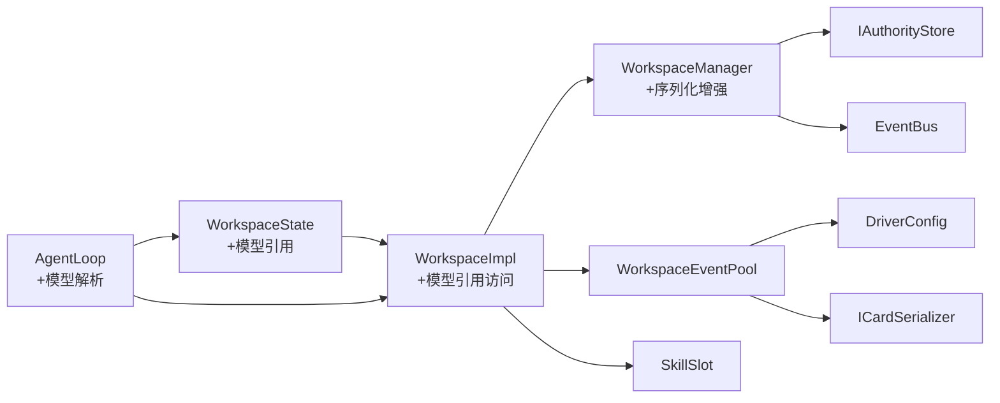

# 工作空间状态管理

<cite>
**本文引用的文件**
- [WorkspaceState.cs](file://src/NPCLife/Workspace/WorkspaceState.cs)
- [IWorkspace.cs](file://src/NPCLife/Workspace/IWorkspace.cs)
- [WorkspaceImpl.cs](file://src/NPCLife/Workspace/WorkspaceImpl.cs)
- [WorkspaceManager.cs](file://src/NPCLife/Workspace/WorkspaceManager.cs)
- [IWorkspaceManager.cs](file://src/NPCLife/Core/IWorkspaceManager.cs)
- [SkillSlot.cs](file://src/NPCLife/Workspace/SkillSlot.cs)
- [RoleSkillProfile.cs](file://src/NPCLife/Workspace/RoleSkillProfile.cs)
- [WorkspaceEventPool.cs](file://src/NPCLife/Workspace/WorkspaceEventPool.cs)
- [EventBus.cs](file://src/NPCLife/Framework/EventBus.cs)
- [JsonHelper.cs](file://src/NPCLife/Framework/JsonHelper.cs)
- [IStorage.cs](file://src/NPCLife/Core/IStorage.cs)
- [WorkspaceEventPoolTests.cs](file://tests/NPCLife.Tests/Driver/WorkspaceEventPoolTests.cs)
- [AgentLoop.cs](file://src/NPCLife/Agent/AgentLoop.cs)
</cite>

## 更新摘要
**变更内容**
- 新增模型引用能力支持，包括ModelRefs和CurrentModel属性
- 更新WorkspaceState数据模型以支持模型配置持久化
- 增强IWorkspace接口以暴露模型引用信息
- 扩展WorkspaceImpl实现以支持模型引用访问
- 更新WorkspaceManager序列化/反序列化逻辑以处理模型配置
- 集成AgentLoop中的模型解析和凭证管理功能

## 目录
1. [简介](#简介)
2. [项目结构](#项目结构)
3. [核心组件](#核心组件)
4. [架构概览](#架构概览)
5. [详细组件分析](#详细组件分析)
6. [模型引用系统](#模型引用系统)
7. [依赖分析](#依赖分析)
8. [性能考虑](#性能考虑)
9. [故障排查指南](#故障排查指南)
10. [结论](#结论)
11. [附录](#附录)

## 简介
本文件系统性阐述工作空间状态管理的设计与实现，围绕 WorkspaceState 数据模型、状态持久化机制、业务规则（角色权限、标签分类、技能激活）、状态变更日志与事件发布、一致性保障、扩展点与自定义选项，以及调试与性能监控方法展开。**更新版本**特别增强了模型引用能力，支持工作空间级别的模型配置管理，为AI代理的多模型选择和凭证管理提供了灵活的基础设施。

## 项目结构
工作空间状态管理位于 Workspace 模块，核心文件包括：
- WorkspaceState：定义工作空间的数据模型与轮次结构，**新增模型引用字段**
- IWorkspace/WorkspaceImpl：对外接口与实现，封装状态与内部组件，**新增模型引用访问**
- WorkspaceManager：工作空间的 CRUD、分支/合并、事件路由与持久化，**增强序列化逻辑**
- IWorkspaceManager：管理器接口
- SkillSlot/RoleSkillProfile：技能槽与角色技能预设
- WorkspaceEventPool：事件池（pending/recent 缓冲、阈值触发）
- EventBus：事件总线（发布/订阅、错误隔离）
- JsonHelper：JSON 转义与引用工具
- IStorage：权威存储接口（存档）
- **AgentLoop：AI代理执行引擎，集成模型引用解析和凭证管理**

**图表来源**
- [WorkspaceState.cs:151-159](file://src/NPCLife/Workspace/WorkspaceState.cs#L151-L159)
- [IWorkspace.cs:32-36](file://src/NPCLife/Workspace/IWorkspace.cs#L32-L36)
- [WorkspaceImpl.cs:66-67](file://src/NPCLife/Workspace/WorkspaceImpl.cs#L66-L67)
- [WorkspaceManager.cs:500-503](file://src/NPCLife/Workspace/WorkspaceManager.cs#L500-L503)
- [AgentLoop.cs:569-607](file://src/NPCLife/Agent/AgentLoop.cs#L569-L607)

## 核心组件
- **WorkspaceState**：工作空间的纯数据载体，包含标识、标签、状态、角色、分支/合并来源、角色列表、语义标签、轮次日志、当前前情提要、时间戳、激活技能、事件缓存、待处理事件队列及累积重要度、结局描述与导演留言等字段。**新增模型引用字段ModelRefs和CurrentModel**。
- **WorkspaceImpl**：IWorkspace 的实现，包装 WorkspaceState 并暴露事件池与技能槽组件；负责 PushLine/FinishRound 等操作的权限校验与状态约束；通过回调通知管理器持久化；**新增模型引用访问属性**。
- **WorkspaceManager**：工作空间的生命周期与结构管理，提供 CRUD、分支/合并、事件路由、持久化；负责序列化/反序列化与状态一致性控制；**增强序列化逻辑以处理模型引用**。
- **IWorkspace/IWorkspaceManager**：对外接口契约，确保元数据只读、状态变更受控；**IWorkspace新增模型引用属性**。
- **SkillSlot/RoleSkillProfile**：技能槽封装激活/停用逻辑与系统技能保护；根据角色提供默认技能集。
- **WorkspaceEventPool**：事件池，维护 pending/recent 两层缓冲，支持阈值触发与 drain 消费。
- **EventBus**：统一事件发布/订阅，提供错误隔离与优先级排序。
- **JsonHelper/IStorage**：JSON 工具与权威存储接口，支撑持久化。
- **AgentLoop**：AI代理执行引擎，集成模型引用解析、凭证管理和多模型调度功能。

**章节来源**
- [WorkspaceState.cs:94-160](file://src/NPCLife/Workspace/WorkspaceState.cs#L94-L160)
- [WorkspaceImpl.cs:16-199](file://src/NPCLife/Workspace/WorkspaceImpl.cs#L16-L199)
- [WorkspaceManager.cs:19-622](file://src/NPCLife/Workspace/WorkspaceManager.cs#L19-L622)
- [IWorkspace.cs:11-57](file://src/NPCLife/Workspace/IWorkspace.cs#L11-L57)
- [IWorkspaceManager.cs:14-58](file://src/NPCLife/Core/IWorkspaceManager.cs#L14-L58)
- [SkillSlot.cs:11-61](file://src/NPCLife/Workspace/SkillSlot.cs#L11-L61)
- [RoleSkillProfile.cs:13-74](file://src/NPCLife/Workspace/RoleSkillProfile.cs#L13-L74)
- [WorkspaceEventPool.cs:21-186](file://src/NPCLife/Workspace/WorkspaceEventPool.cs#L21-L186)
- [EventBus.cs:17-243](file://src/NPCLife/Framework/EventBus.cs#L17-L243)
- [JsonHelper.cs:8-54](file://src/NPCLife/Framework/JsonHelper.cs#L8-L54)
- [IStorage.cs:10-23](file://src/NPCLife/Core/IStorage.cs#L10-L23)
- [AgentLoop.cs:569-607](file://src/NPCLife/Agent/AgentLoop.cs#L569-L607)

## 架构概览
工作空间状态管理采用"状态对象 + 实现类 + 管理器"的分层设计，**新增模型引用系统**：
- 状态对象（WorkspaceState）承载所有可序列化数据，**包含模型引用字段**
- 实现类（WorkspaceImpl）封装操作与内部组件，**提供模型引用访问**
- 管理器（WorkspaceManager）协调生命周期、结构操作与持久化，**增强序列化逻辑**
- 事件总线（EventBus）贯穿状态变更与外部集成
- 事件池（WorkspaceEventPool）提供事件缓冲与阈值触发
- 技能槽（SkillSlot）与角色预设（RoleSkillProfile）提供可插拔的能力开关
- **AI代理（AgentLoop）集成模型解析和凭证管理**

**图表来源**
- [WorkspaceState.cs:151-159](file://src/NPCLife/Workspace/WorkspaceState.cs#L151-L159)
- [WorkspaceImpl.cs:66-67](file://src/NPCLife/Workspace/WorkspaceImpl.cs#L66-L67)
- [WorkspaceManager.cs:500-503](file://src/NPCLife/Workspace/WorkspaceManager.cs#L500-L503)
- [IWorkspace.cs:32-36](file://src/NPCLife/Workspace/IWorkspace.cs#L32-L36)
- [AgentLoop.cs:569-607](file://src/NPCLife/Agent/AgentLoop.cs#L569-L607)

## 详细组件分析

### WorkspaceState 数据模型
- 标识与元数据：Id、Label、CreatedAt、LastActivityAt
- 状态与角色：Status、CreatedByRole
- 结构关系：ParentId（父空间）、MergedFromIds（合并来源）
- 角色与标签：ColonistIds、Tags
- 轮次与叙事：Rounds（WorkspaceRound 列表）、CurrentRecap
- 技能与事件：ActiveSkillIds、EventCache、PendingEventIds、PendingImportance
- 结局与沟通：Outcome、DirectorMessage
- **模型引用：ModelRefs（JSON数组格式）、CurrentModel（JSON对象格式）**

**新增字段含义**
- **ModelRefs**：JSON数组格式的模型引用列表，格式为`[{"cred":"primary","model":"gpt-4o"},...]`，数组顺序即调用优先级
- **CurrentModel**：当前选中模型的JSON对象，格式与ModelRefs条目一致：`{"cred":"primary","model":"gpt-4o"}`

**字段复杂度要点**
- ModelRefs/CurrentModel：JSON字符串处理，序列化/反序列化开销较小
- 名称匹配策略：通过模型名称而非整数索引，避免列表变化时的失对齐问题

**章节来源**
- [WorkspaceState.cs:151-159](file://src/NPCLife/Workspace/WorkspaceState.cs#L151-L159)

### WorkspaceImpl 操作与权限
- PushLine：仅允许 Screenwriter/Freelancer 在 Active 状态下推送；立即发布 ScriptLineReady 事件；更新 LastActivityAt
- FinishRound：仅允许 Screenwriter/Freelancer 在 Active 状态下结束轮次；生成 Normal 轮次并写入 CurrentRecap；发布 ScriptReady 事件
- SetStatus：内部修改状态与时间戳，支持 Outcome 填充
- **模型引用访问**：通过ModelRefs和CurrentModel属性提供只读访问

**权限与状态约束**
- 角色限制：非编剧/临时工拒绝
- 状态限制：非 Active 拒绝
- 时间戳：每次活动更新 LastActivityAt
- **模型引用访问**：所有工作空间实例均可读取模型引用信息

**章节来源**
- [WorkspaceImpl.cs:66-67](file://src/NPCLife/Workspace/WorkspaceImpl.cs#L66-L67)
- [WorkspaceImpl.cs:83-182](file://src/NPCLife/Workspace/WorkspaceImpl.cs#L83-L182)

### WorkspaceManager 生命周期与结构操作
- Create：生成新工作空间，填充默认字段，按角色激活默认技能，发布 WorkspaceCreated
- UpdateStatus：状态转换校验（见下一节），Active→Completed/Abandoned 发布 WorkspaceClosed，否则发布 WorkspaceUpdated
- Branch：复制父空间轮次与技能，追加 Branch 轮次，发布 WorkspaceCreated
- Merge：合并源空间轮次与元数据，追加 Merge 轮次，更新目标空间状态与来源列表，发布 WorkspaceUpdated（两次）
- **序列化增强**：在SerializeWorkspace和DeserializeWorkspace中处理ModelRefs和CurrentModel字段

**状态转换有效性**
- Active/Suspended 可转 Active/Suspended/Completed/Abandoned
- Completed/Abandoned 不可逆

**章节来源**
- [WorkspaceManager.cs:91-138](file://src/NPCLife/Workspace/WorkspaceManager.cs#L91-L138)
- [WorkspaceManager.cs:165-187](file://src/NPCLife/Workspace/WorkspaceManager.cs#L165-L187)
- [WorkspaceManager.cs:193-263](file://src/NPCLife/Workspace/WorkspaceManager.cs#L193-L263)
- [WorkspaceManager.cs:269-376](file://src/NPCLife/Workspace/WorkspaceManager.cs#L269-L376)
- [WorkspaceManager.cs:406-423](file://src/NPCLife/Workspace/WorkspaceManager.cs#L406-L423)
- [WorkspaceManager.cs:500-503](file://src/NPCLife/Workspace/WorkspaceManager.cs#L500-L503)
- [WorkspaceManager.cs:547-549](file://src/NPCLife/Workspace/WorkspaceManager.cs#L547-L549)

### 持久化机制与序列化/反序列化
- 存储键：固定键名用于保存所有工作空间的数组 JSON
- 序列化：逐工作空间序列化，数组拼接为字符串写入存储，**新增模型引用字段处理**
- 反序列化：解析数组，逐项反序列化为 WorkspaceState，再包装为 WorkspaceImpl，**新增模型引用字段解析**
- 事件池持久化：EventCache 通过 ICardSerializer 序列化为 JSON 字符串，随工作空间一起持久化

**序列化流程图**

**图表来源**
- [WorkspaceManager.cs:500-503](file://src/NPCLife/Workspace/WorkspaceManager.cs#L500-L503)
- [WorkspaceManager.cs:463-505](file://src/NPCLife/Workspace/WorkspaceManager.cs#L463-L505)
- [WorkspaceManager.cs:520-547](file://src/NPCLife/Workspace/WorkspaceManager.cs#L520-L547)

**反序列化流程图**

**图表来源**
- [WorkspaceManager.cs:547-549](file://src/NPCLife/Workspace/WorkspaceManager.cs#L547-L549)
- [WorkspaceManager.cs:429-457](file://src/NPCLife/Workspace/WorkspaceManager.cs#L429-L457)
- [WorkspaceManager.cs:520-571](file://src/NPCLife/Workspace/WorkspaceManager.cs#L520-L571)

**章节来源**
- [WorkspaceManager.cs:50-74](file://src/NPCLife/Workspace/WorkspaceManager.cs#L50-L74)
- [WorkspaceManager.cs:429-457](file://src/NPCLife/Workspace/WorkspaceManager.cs#L429-L457)
- [WorkspaceManager.cs:463-505](file://src/NPCLife/Workspace/WorkspaceManager.cs#L463-L505)
- [WorkspaceManager.cs:520-571](file://src/NPCLife/Workspace/WorkspaceManager.cs#L520-L571)

### 事件发布与日志记录
- 状态变更：UpdateStatus/FinishRound/SetStatus 更新 LastActivityAt 并发布 WorkspaceUpdated 或 WorkspaceClosed
- 台词事件：PushLine 立即发布 ScriptLineReady；FinishRound 发布 ScriptReady
- 生命周期：Create 发布 WorkspaceCreated；Branch/Merge 发布 WorkspaceCreated
- 错误与警告：管理器与实现类在权限/状态检查失败时记录 Warning 日志

**事件流（以 PushLine 为例）**

**图表来源**
- [WorkspaceImpl.cs:83-123](file://src/NPCLife/Workspace/WorkspaceImpl.cs#L83-L123)
- [WorkspaceImpl.cs:44](file://src/NPCLife/Workspace/WorkspaceImpl.cs#L44)
- [EventBus.cs:86-113](file://src/NPCLife/Framework/EventBus.cs#L86-L113)

**章节来源**
- [WorkspaceImpl.cs:83-182](file://src/NPCLife/Workspace/WorkspaceImpl.cs#L83-L182)
- [WorkspaceManager.cs:165-187](file://src/NPCLife/Workspace/WorkspaceManager.cs#L165-L187)
- [EventBus.cs:186-242](file://src/NPCLife/Framework/EventBus.cs#L186-L242)

### 业务规则与一致性保障
- 角色权限
  - PushLine/FinishRound：仅 Screenwriter/Freelancer 可操作
  - Branch/Merge：仅 Director 可操作
- 状态约束
  - 所有操作仅在 Active 状态下允许
  - 状态转换遵循有效路径（Active/Suspended → 完成/废弃/保持）
- 事件池一致性
  - pending 与 recent 缓冲相互独立，drain 后清空 pending
  - 阈值触发仅在达到 count 或 importance 任一条件时发生
- 技能一致性
  - 系统技能不可停用；激活/停用通过 SkillSlot 维护 ActiveSkillIds
  - 默认技能按角色预设自动激活
- **模型引用一致性**
  - ModelRefs为JSON数组格式，条目必须包含cred和model字段
  - CurrentModel为单个JSON对象，与ModelRefs条目格式一致
  - 通过名称匹配而非整数索引，避免列表变化时的失对齐

**章节来源**
- [WorkspaceImpl.cs:88-98](file://src/NPCLife/Workspace/WorkspaceImpl.cs#L88-L98)
- [WorkspaceImpl.cs:128-138](file://src/NPCLife/Workspace/WorkspaceImpl.cs#L128-L138)
- [WorkspaceManager.cs:195-199](file://src/NPCLife/Workspace/WorkspaceManager.cs#L195-L199)
- [WorkspaceManager.cs:271-275](file://src/NPCLife/Workspace/WorkspaceManager.cs#L271-L275)
- [SkillSlot.cs:24-58](file://src/NPCLife/Workspace/SkillSlot.cs#L24-L58)
- [RoleSkillProfile.cs:58-71](file://src/NPCLife/Workspace/RoleSkillProfile.cs#L58-L71)

### 事件池与阈值触发
- 双缓冲结构
  - pending：持久化到 WorkspaceState（EventCache/PendingEventIds/PendingImportance）
  - recent：仅内存，按容量淘汰最低重要度事件
- 阈值触发
  - 每次 Append 后计算有效阈值（按角色配置），满足任一条件触发 OnThresholdReached
- drain 消费
  - 清空 pending 并返回事件列表，供 Agent/工具调用消费

**事件池操作流程**

**图表来源**
- [WorkspaceEventPool.cs:49-80](file://src/NPCLife/Workspace/WorkspaceEventPool.cs#L49-L80)
- [WorkspaceEventPool.cs:166-183](file://src/NPCLife/Workspace/WorkspaceEventPool.cs#L166-L183)

**章节来源**
- [WorkspaceEventPool.cs:21-186](file://src/NPCLife/Workspace/WorkspaceEventPool.cs#L21-L186)
- [WorkspaceEventPoolTests.cs:17-352](file://tests/NPCLife.Tests/Driver/WorkspaceEventPoolTests.cs#L17-L352)

### 扩展点与自定义选项
- 新增状态字段
  - 在 WorkspaceState 中添加字段并在序列化/反序列化中处理
  - 更新 WorkspaceManager 的 SerializeWorkspace/DeserializeWorkspace
- 新增验证规则
  - 在 WorkspaceImpl 的操作中增加前置校验
  - 在 WorkspaceManager 的结构操作中增加约束
- 新增事件
  - 在 EventBus 中新增事件名常量
  - 在相应位置发布事件
- 新增技能
  - 在 RoleSkillProfile 中添加角色预设
  - 在 SkillSlot 中处理系统技能保护与结果构造
- **新增模型引用功能**
  - 在WorkspaceState中添加ModelRefs和CurrentModel字段
  - 在IWorkspace接口中暴露模型引用属性
  - 在WorkspaceImpl中提供只读访问
  - 在WorkspaceManager中处理序列化/反序列化
  - 在AgentLoop中集成模型解析和凭证管理

**章节来源**
- [WorkspaceState.cs:151-159](file://src/NPCLife/Workspace/WorkspaceState.cs#L151-L159)
- [IWorkspace.cs:32-36](file://src/NPCLife/Workspace/IWorkspace.cs#L32-L36)
- [WorkspaceImpl.cs:66-67](file://src/NPCLife/Workspace/WorkspaceImpl.cs#L66-L67)
- [WorkspaceManager.cs:500-503](file://src/NPCLife/Workspace/WorkspaceManager.cs#L500-L503)
- [WorkspaceManager.cs:547-549](file://src/NPCLife/Workspace/WorkspaceManager.cs#L547-L549)
- [AgentLoop.cs:569-607](file://src/NPCLife/Agent/AgentLoop.cs#L569-L607)

## 模型引用系统

### 模型引用数据结构
工作空间支持基于JSON的模型引用配置，提供灵活的多模型选择能力：

**ModelRefs字段**
- 类型：JSON字符串数组
- 格式：`[{"cred":"primary","model":"gpt-4o"}, {"cred":"backup","model":"claude-3"}]`
- 作用：定义工作空间可用的模型列表，数组顺序即调用优先级
- 解析：通过ParseModelRefs方法将JSON字符串解析为(凭证名, 模型名)元组列表

**CurrentModel字段**
- 类型：JSON字符串对象
- 格式：`{"cred":"primary","model":"gpt-4o"}`
- 作用：指定当前选中的模型，与ModelRefs中的条目格式一致
- 匹配：通过名称而非整数索引进行匹配，避免列表变化时的失对齐

### 凭证解析与调度
AgentLoop集成模型引用解析功能，实现智能的凭证调度：

**ResolveCredentials流程**
1. 检查工作空间的ModelRefs是否存在且有效
2. 解析当前选中模型（CurrentModel）
3. 遍历模型引用列表，解析每个(凭证名, 模型名)对
4. 将当前选中模型的凭证置于列表首位
5. 如果解析失败，回退到全局激活凭证

**解析方法**
- ParseModelRefs：解析JSON数组，提取所有(凭证名, 模型名)对
- ParseSingleRef：解析单个JSON对象，提取(凭证名, 模型名)对
- ResolveCredentials：综合处理模型引用和凭证解析

**图表来源**
- [AgentLoop.cs:569-607](file://src/NPCLife/Agent/AgentLoop.cs#L569-L607)
- [AgentLoop.cs:613-636](file://src/NPCLife/Agent/AgentLoop.cs#L613-L636)
- [AgentLoop.cs:642-655](file://src/NPCLife/Agent/AgentLoop.cs#L642-L655)

**章节来源**
- [WorkspaceState.cs:151-159](file://src/NPCLife/Workspace/WorkspaceState.cs#L151-L159)
- [IWorkspace.cs:32-36](file://src/NPCLife/Workspace/IWorkspace.cs#L32-L36)
- [WorkspaceImpl.cs:66-67](file://src/NPCLife/Workspace/WorkspaceImpl.cs#L66-L67)
- [WorkspaceManager.cs:500-503](file://src/NPCLife/Workspace/WorkspaceManager.cs#L500-L503)
- [AgentLoop.cs:569-607](file://src/NPCLife/Agent/AgentLoop.cs#L569-L607)
- [AgentLoop.cs:613-655](file://src/NPCLife/Agent/AgentLoop.cs#L613-L655)

## 依赖分析
- WorkspaceState 作为纯数据载体，被 WorkspaceImpl 与 WorkspaceManager 引用，**新增模型引用字段依赖**
- WorkspaceImpl 依赖 WorkspaceEventPool 与 SkillSlot，并通过回调通知 WorkspaceManager 持久化，**新增模型引用访问依赖**
- WorkspaceManager 依赖 IAuthorityStore 进行持久化，依赖 EventBus 发布事件，**增强序列化逻辑以处理模型引用**
- WorkspaceEventPool 依赖 ICardSerializer 进行事件序列化，依赖 DriverConfig 进行阈值配置
- EventBus 为无外部依赖的纯静态组件，提供错误隔离与优先级排序
- **AgentLoop 依赖工作空间模型引用，实现智能凭证解析和调度**

**图表来源**
- [WorkspaceState.cs:151-159](file://src/NPCLife/Workspace/WorkspaceState.cs#L151-L159)
- [WorkspaceImpl.cs:66-67](file://src/NPCLife/Workspace/WorkspaceImpl.cs#L66-L67)
- [WorkspaceManager.cs:500-503](file://src/NPCLife/Workspace/WorkspaceManager.cs#L500-L503)
- [WorkspaceEventPool.cs:21-43](file://src/NPCLife/Workspace/WorkspaceEventPool.cs#L21-L43)
- [EventBus.cs:17-155](file://src/NPCLife/Framework/EventBus.cs#L17-L155)
- [IStorage.cs:10-23](file://src/NPCLife/Core/IStorage.cs#L10-L23)
- [AgentLoop.cs:569-607](file://src/NPCLife/Agent/AgentLoop.cs#L569-L607)

**章节来源**
- [WorkspaceState.cs:151-159](file://src/NPCLife/Workspace/WorkspaceState.cs#L151-L159)
- [WorkspaceImpl.cs:66-67](file://src/NPCLife/Workspace/WorkspaceImpl.cs#L66-L67)
- [WorkspaceManager.cs:500-503](file://src/NPCLife/Workspace/WorkspaceManager.cs#L500-L503)
- [WorkspaceEventPool.cs:21-43](file://src/NPCLife/Workspace/WorkspaceEventPool.cs#L21-L43)
- [EventBus.cs:17-155](file://src/NPCLife/Framework/EventBus.cs#L17-L155)
- [IStorage.cs:10-23](file://src/NPCLife/Core/IStorage.cs#L10-L23)
- [AgentLoop.cs:569-607](file://src/NPCLife/Agent/AgentLoop.cs#L569-L607)

## 性能考虑
- 序列化/反序列化
  - 使用 JsonWriter/JsonParser 进行高效字符串构建与解析
  - 事件池使用 ICardSerializer 将事件序列化为紧凑 JSON，减少存储体积
  - **模型引用字段采用JSON字符串格式，避免复杂对象序列化开销**
- 事件池容量
  - recent 历史按容量淘汰最低重要度事件，避免内存膨胀
- 状态锁
  - 使用 ReaderWriterLockSlim 降低并发读写冲突
- 事件发布
  - EventBus 的错误隔离避免单个处理器异常影响整体性能
- **模型引用解析优化**
  - 使用名称匹配而非整数索引，避免列表变化时的重新映射开销
  - 当前选中模型自动提升优先级，减少解析次数

**章节来源**
- [WorkspaceManager.cs:50-74](file://src/NPCLife/Workspace/WorkspaceManager.cs#L50-L74)
- [WorkspaceEventPool.cs:61-74](file://src/NPCLife/Workspace/WorkspaceEventPool.cs#L61-L74)
- [EventBus.cs:104-112](file://src/NPCLife/Framework/EventBus.cs#L104-L112)
- [AgentLoop.cs:569-607](file://src/NPCLife/Agent/AgentLoop.cs#L569-L607)

## 故障排查指南
- 权限问题
  - PushLine/FinishRound 返回 false 且日志出现角色/状态警告，检查调用角色与工作空间状态
- 状态转换无效
  - UpdateStatus 返回 false 且日志提示无效转换，确认状态路径是否符合有效规则
- 事件未触发
  - 检查阈值配置（count/importance）与事件池 pending 状态，确认 OnThresholdReached 是否订阅
- 持久化失败
  - Persist/LoadFromStore 抛出异常，检查存储实现与键值一致性
- 技能无法停用
  - 系统技能不可停用，检查是否尝试停用系统技能 ID
- **模型引用问题**
  - 检查ModelRefs格式是否为有效的JSON数组，条目是否包含cred和model字段
  - 检查CurrentModel格式是否为有效的JSON对象，与ModelRefs条目格式一致
  - 确认凭证解析是否成功，检查AgentLoop中的ResolveCredentials日志

**章节来源**
- [WorkspaceImpl.cs:88-98](file://src/NPCLife/Workspace/WorkspaceImpl.cs#L88-L98)
- [WorkspaceImpl.cs:128-138](file://src/NPCLife/Workspace/WorkspaceImpl.cs#L128-L138)
- [WorkspaceManager.cs:170-174](file://src/NPCLife/Workspace/WorkspaceManager.cs#L170-L174)
- [WorkspaceManager.cs:453-456](file://src/NPCLife/Workspace/WorkspaceManager.cs#L453-L456)
- [SkillSlot.cs:52-57](file://src/NPCLife/Workspace/SkillSlot.cs#L52-L57)
- [AgentLoop.cs:569-607](file://src/NPCLife/Agent/AgentLoop.cs#L569-L607)

## 结论
工作空间状态管理通过清晰的数据模型、严格的权限与状态约束、完善的事件发布与持久化机制，实现了可扩展、可观测、可维护的叙事工作流。**更新版本**通过引入模型引用能力，进一步增强了系统的灵活性和可配置性，为AI代理的多模型选择和凭证管理提供了强大的基础设施。借助事件池的阈值触发、技能槽的可插拔能力和模型引用的智能解析，系统能够灵活适配不同角色和场景的创作需求。建议在扩展新功能时遵循现有序列化/反序列化契约与事件发布规范，确保状态一致性与性能表现。

## 附录
- 术语
  - 工作空间：上下文空间，承载叙事与事件
  - 轮次：一次叙事推进的基本单元
  - 事件池：工作空间内的事件缓冲与阈值触发机制
  - 技能槽：工作空间内可激活/停用的 MCP 工具集合
  - **模型引用：工作空间级别的AI模型配置，支持多模型选择和凭证管理**
- 相关测试
  - 事件池行为与阈值触发的单元测试覆盖了 Append、Drain、阈值条件与多工作空间隔离
  - **模型引用解析功能的单元测试覆盖了JSON格式验证、凭证解析和调度逻辑**

**章节来源**
- [WorkspaceEventPoolTests.cs:17-352](file://tests/NPCLife.Tests/Driver/WorkspaceEventPoolTests.cs#L17-L352)
- [AgentLoop.cs:569-607](file://src/NPCLife/Agent/AgentLoop.cs#L569-L607)