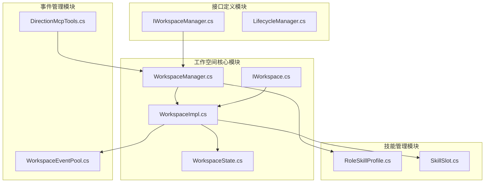
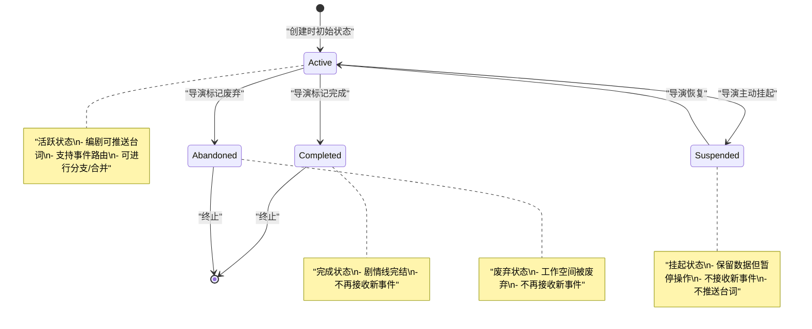
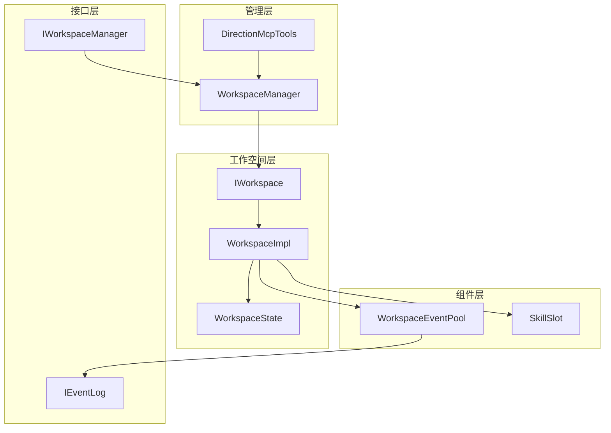
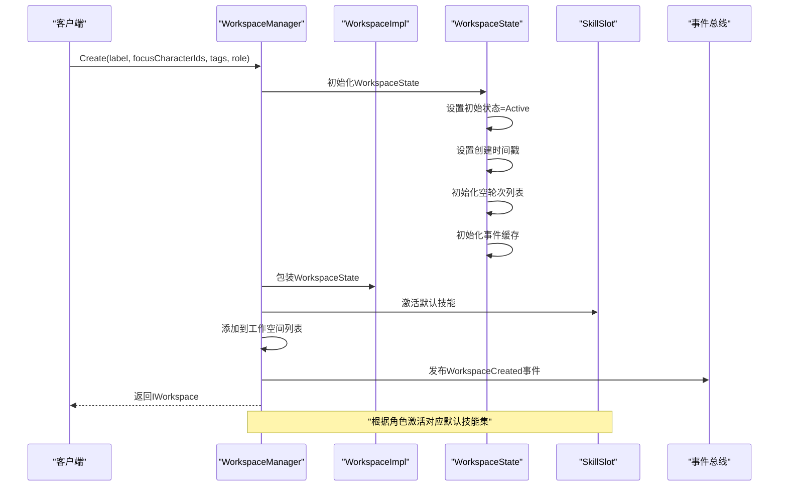
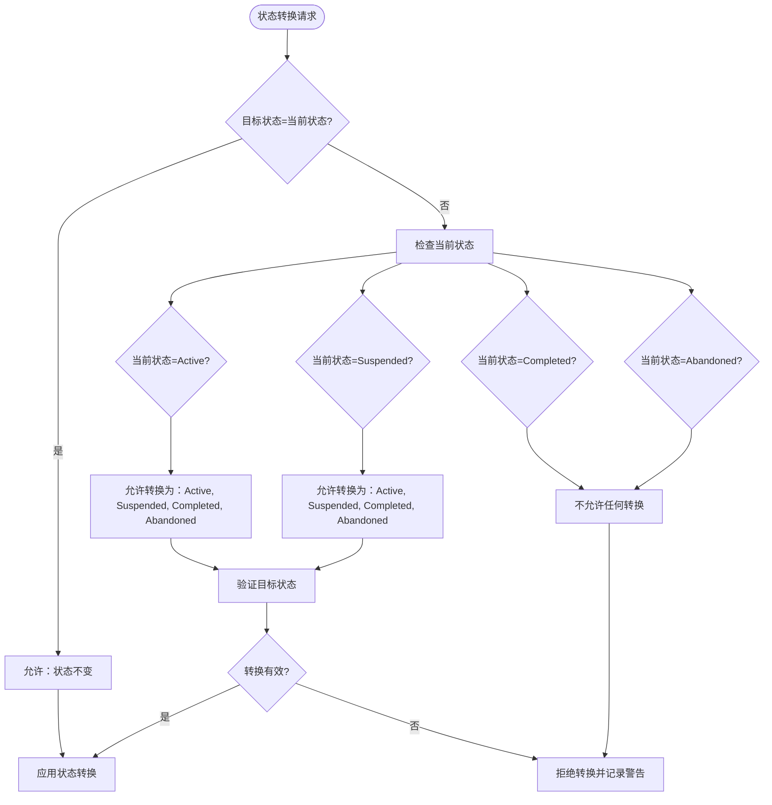
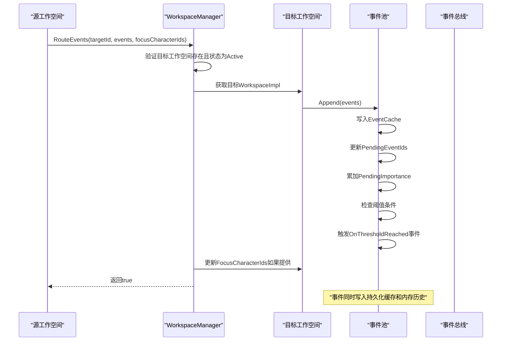
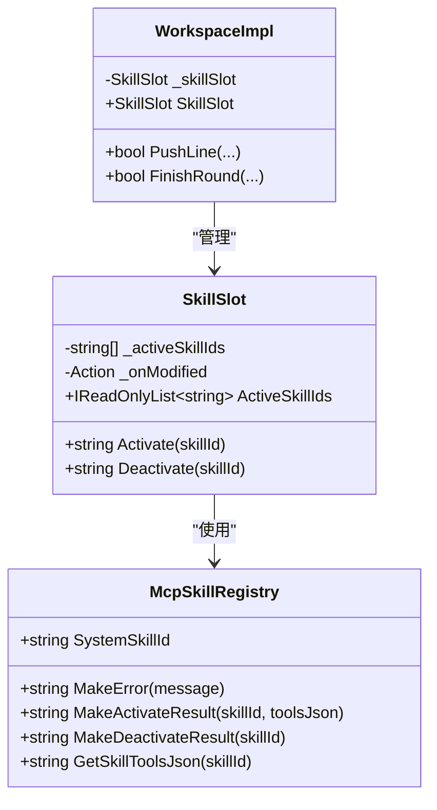

# 工作空间生命周期管理

<cite>
**本文引用的文件**
- [IWorkspace.cs](file://src/NPCLife/Workspace/IWorkspace.cs)
- [WorkspaceImpl.cs](file://src/NPCLife/Workspace/WorkspaceImpl.cs)
- [WorkspaceManager.cs](file://src/NPCLife/Workspace/WorkspaceManager.cs)
- [WorkspaceState.cs](file://src/NPCLife/Workspace/WorkspaceState.cs)
- [IWorkspaceManager.cs](file://src/NPCLife/Core/IWorkspaceManager.cs)
- [RoleSkillProfile.cs](file://src/NPCLife/Workspace/RoleSkillProfile.cs)
- [SkillSlot.cs](file://src/NPCLife/Workspace/SkillSlot.cs)
- [WorkspaceEventPool.cs](file://src/NPCLife/Workspace/WorkspaceEventPool.cs)
- [DirectionMcpTools.cs](file://src/NPCLife/Workspace/DirectionMcpTools.cs)
- [LifecycleManager.cs](file://src/NPCLife/Framework/LifecycleManager.cs)
- [WorkspaceEventPoolTests.cs](file://tests/NPCLife.Tests/Driver/WorkspaceEventPoolTests.cs)
- [AgentLoop.cs](file://src/NPCLife/Agent/AgentLoop.cs)
- [WritingMcpTools.cs](file://src/NPCLife/Workspace/WritingMcpTools.cs)
- [ImproviserMcpTools.cs](file://src/NPCLife/Workspace/ImproviserMcpTools.cs)
</cite>

## 更新摘要
**变更内容**
- 从colonistIds（殖民者ID）迁移到focusCharacterIds（聚焦角色ID）
- 移除了所有与colonist相关的概念和API
- 新增自动工作空间上下文注入机制
- 更新了角色权限模型中的术语一致性

## 目录
1. [简介](#简介)
2. [项目结构](#项目结构)
3. [核心组件](#核心组件)
4. [架构概览](#架构概览)
5. [详细组件分析](#详细组件分析)
6. [依赖关系分析](#依赖关系分析)
7. [性能考虑](#性能考虑)
8. [故障排除指南](#故障排除指南)
9. [结论](#结论)
10. [最佳实践](#最佳实践)

## 简介

工作空间生命周期管理是NPCLife框架的核心功能之一，负责管理剧情线工作空间从创建到销毁的完整生命周期。本文档深入解释工作空间的状态管理机制，包括创建过程中的状态初始化、标签设置、角色分配和默认技能激活，详细描述状态转换机制，以及挂起和恢复机制对事件处理和工具调用的影响。

**更新** 本版本反映了工作空间管理的重大重构：从colonistIds迁移到focusCharacterIds，移除所有与colonist相关的概念，新增自动工作空间上下文注入机制。

## 项目结构

工作空间生命周期管理相关的代码主要分布在以下模块中：



**图表来源**
- [WorkspaceManager.cs:1-646](file://src/NPCLife/Workspace/WorkspaceManager.cs#L1-L646)
- [WorkspaceImpl.cs:1-226](file://src/NPCLife/Workspace/WorkspaceImpl.cs#L1-L226)
- [WorkspaceState.cs:1-159](file://src/NPCLife/Workspace/WorkspaceState.cs#L1-L159)

**章节来源**
- [WorkspaceManager.cs:1-646](file://src/NPCLife/Workspace/WorkspaceManager.cs#L1-L646)
- [WorkspaceImpl.cs:1-226](file://src/NPCLife/Workspace/WorkspaceImpl.cs#L1-L226)
- [WorkspaceState.cs:1-159](file://src/NPCLife/Workspace/WorkspaceState.cs#L1-L159)

## 核心组件

### 工作空间状态模型

工作空间采用四状态模型，每个状态都有明确的含义和约束：



**图表来源**
- [WorkspaceState.cs:25-38](file://src/NPCLife/Workspace/WorkspaceState.cs#L25-L38)

### 角色权限模型

系统定义三种Agent角色，每种角色具有不同的权限和默认技能配置：

| 角色 | 权限范围 | 默认技能 |
|------|----------|----------|
| Director | 全局视图和结构管理 | workspace_direction, colony_overview, character_query, event_query, knowledge_management |
| Screenwriter | 完整的叙事创作能力 | workspace_writing, colony_overview, character_query, relationship_query, event_query, environment_query, knowledge_management |
| Freelancer | 轻量查询和快速输出 | workspace_freelancer, character_query, event_query |

**更新** 角色权限模型中的术语已更新为更准确的表述，移除了与colonist相关的概念。

**章节来源**
- [WorkspaceState.cs:9-20](file://src/NPCLife/Workspace/WorkspaceState.cs#L9-L20)
- [RoleSkillProfile.cs:13-74](file://src/NPCLife/Workspace/RoleSkillProfile.cs#L13-L74)

## 架构概览

工作空间生命周期管理采用分层架构设计，各组件职责清晰分离：



**图表来源**
- [WorkspaceManager.cs:19-40](file://src/NPCLife/Workspace/WorkspaceManager.cs#L19-L40)
- [DirectionMcpTools.cs:16-45](file://src/NPCLife/Workspace/DirectionMcpTools.cs#L16-L45)

## 详细组件分析

### 工作空间管理器（WorkspaceManager）

WorkspaceManager是工作空间生命周期管理的核心协调者，负责：

#### 创建流程
创建工作空间时的完整初始化过程：



**更新** 创建流程现已使用focusCharacterIds替代colonistIds，体现了新的角色聚焦机制。

**图表来源**
- [WorkspaceManager.cs:91-146](file://src/NPCLife/Workspace/WorkspaceManager.cs#L91-L146)
- [RoleSkillProfile.cs:58-71](file://src/NPCLife/Workspace/RoleSkillProfile.cs#L58-L71)

#### 状态转换验证
状态转换采用严格的验证机制：



**图表来源**
- [WorkspaceManager.cs:421-438](file://src/NPCLife/Workspace/WorkspaceManager.cs#L421-L438)

#### 分支和合并操作
分支操作创建新的工作空间副本：

```mermaid
sequenceDiagram
participant Director as "Director"
participant Manager as "WorkspaceManager"
participant Parent as "父工作空间"
participant Child as "子工作空间"
participant EventBus as "事件总线"
Director->>Manager : Branch(parentId, newLabel, branchRecap, role)
Manager->>Parent : 获取父工作空间状态
Parent->>Parent : 复制轮次历史
Parent->>Parent : 添加Branch轮
Parent->>Child : 创建新WorkspaceState
Child->>Child : 继承父技能集
Child->>Child : 设置初始状态=Active
Manager->>Manager : 添加子工作空间到列表
Manager->>EventBus : 发布WorkspaceCreated事件
Manager-->>Director : 返回子工作空间
Note over Manager,Child : "子工作空间继承父工作空间的ActiveSkillIds"
```



**图表来源**
- [WorkspaceManager.cs:201-275](file://src/NPCLife/Workspace/WorkspaceManager.cs#L201-L275)

### 工作空间实现（WorkspaceImpl）

WorkspaceImpl作为IWorkspace的实现类，封装了工作空间的所有操作：

#### 事件路由机制
事件路由到工作空间的完整流程：



**更新** 事件路由现在支持自动工作空间上下文注入，通过focusCharacterIds参数动态更新工作空间的聚焦角色。

**图表来源**
- [WorkspaceManager.cs:394-407](file://src/NPCLife/Workspace/WorkspaceManager.cs#L394-L407)
- [WorkspaceEventPool.cs:49-89](file://src/NPCLife/Workspace/WorkspaceEventPool.cs#L49-L89)

#### 技能槽管理
技能槽提供灵活的技能激活/停用机制：



**图表来源**
- [SkillSlot.cs:11-61](file://src/NPCLife/Workspace/SkillSlot.cs#L11-L61)
- [WorkspaceImpl.cs:38-46](file://src/NPCLife/Workspace/WorkspaceImpl.cs#L38-L46)

### 事件池（WorkspaceEventPool）

事件池实现了双层缓冲结构，支持阈值驱动的被动激活：

#### 事件池架构
```mermaid
graph TB
subgraph "持久化层"
EventCache[EventCache<br/>Dictionary<string, string>]
PendingIds[PendingEventIds<br/>List<string>]
PendingImp[PendingImportance<br/>float]
end
subgraph "内存层"
Recent[Recent History<br/>List<IGameEvent>]
end
subgraph "阈值计算"
CountThreshold[Count Threshold<br/>DriverConfig]
ImpThreshold[Importance Threshold<br/>DriverConfig]
end
EventCache --> PendingIds
EventCache --> PendingImp
PendingIds --> CountThreshold
PendingImp --> ImpThreshold
CountThreshold --> CheckThreshold[CheckThreshold]
ImpThreshold --> CheckThreshold
CheckThreshold --> OnThresholdReached[OnThresholdReached事件]
Note over EventCache: "随WorkspaceState持久化"
Note over Recent: "仅内存缓存，有限容量"
```

**图表来源**
- [WorkspaceEventPool.cs:21-43](file://src/NPCLife/Workspace/WorkspaceEventPool.cs#L21-L43)
- [WorkspaceEventPool.cs:81-90](file://src/NPCLife/Workspace/WorkspaceEventPool.cs#L81-L90)

**章节来源**
- [WorkspaceImpl.cs:83-226](file://src/NPCLife/Workspace/WorkspaceImpl.cs#L83-L226)
- [WorkspaceEventPool.cs:49-183](file://src/NPCLife/Workspace/WorkspaceEventPool.cs#L49-L183)

## 依赖关系分析

工作空间生命周期管理涉及多个层次的依赖关系：

```mermaid
graph TB
subgraph "外部依赖"
IEventLog[IEventLog接口]
IWorkspaceManager[IWorkspaceManager接口]
ILogger[ILogger接口]
IAuthorityStore[IAuthorityStore接口]
end
subgraph "核心实现"
WorkspaceManager[WorkspaceManager]
WorkspaceImpl[WorkspaceImpl]
WorkspaceState[WorkspaceState]
WorkspaceEventPool[WorkspaceEventPool]
SkillSlot[SkillSlot]
end
subgraph "工具集成"
DirectionMcpTools[DirectionMcpTools]
RoleSkillProfile[RoleSkillProfile]
end
subgraph "基础设施"
EventBus[EventBus]
McpSkillRegistry[McpSkillRegistry]
DriverConfig[DriverConfig]
end
IEventLog --> WorkspaceEventPool
IWorkspaceManager --> WorkspaceManager
ILogger --> WorkspaceManager
IAuthorityStore --> WorkspaceManager
WorkspaceManager --> WorkspaceImpl
WorkspaceImpl --> WorkspaceState
WorkspaceImpl --> WorkspaceEventPool
WorkspaceImpl --> SkillSlot
DirectionMcpTools --> WorkspaceManager
RoleSkillProfile --> WorkspaceManager
WorkspaceEventPool --> EventBus
WorkspaceEventPool --> McpSkillRegistry
WorkspaceEventPool --> DriverConfig
Note over WorkspaceManager: "协调所有工作空间操作"
Note over DirectionMcpTools: "导演专用工具接口"
```

**图表来源**
- [WorkspaceManager.cs:21-40](file://src/NPCLife/Workspace/WorkspaceManager.cs#L21-L40)
- [DirectionMcpTools.cs:16-25](file://src/NPCLife/Workspace/DirectionMcpTools.cs#L16-L25)

**章节来源**
- [WorkspaceManager.cs:1-646](file://src/NPCLife/Workspace/WorkspaceManager.cs#L1-L646)
- [DirectionMcpTools.cs:1-451](file://src/NPCLife/Workspace/DirectionMcpTools.cs#L1-L451)

## 性能考虑

### 内存管理策略

工作空间生命周期管理采用了多项性能优化措施：

1. **双层缓冲架构**：事件池采用持久化缓存和内存历史的双重结构，平衡了性能和可靠性
2. **读写锁机制**：使用ReaderWriterLockSlim确保多线程安全的同时最大化读取性能
3. **延迟序列化**：仅在必要时进行JSON序列化，减少CPU开销
4. **阈值驱动**：通过阈值触发事件，避免频繁的轮询操作

### 状态转换优化

状态转换验证采用常量时间复杂度的查找表，确保状态变更的高效性：

```mermaid
flowchart LR
A[状态转换请求] --> B{当前状态}
B --> C{目标状态}
C --> D[O(1)查找表验证]
D --> E[应用转换或拒绝]
Note over A,E: "时间复杂度：O(1)\n空间复杂度：O(1)"
```

## 故障排除指南

### 常见问题诊断

#### 状态转换失败
当遇到状态转换失败时，通常有以下原因：

1. **无效的转换组合**：从Completed或Abandoned状态尝试转换
2. **权限不足**：非Director角色尝试进行状态变更
3. **工作空间不存在**：提供的ID不存在于系统中

#### 事件路由问题
事件无法到达目标工作空间可能的原因：

1. **目标工作空间非Active状态**
2. **事件ID无效或不存在**
3. **源工作空间事件池为空**

#### 自动上下文注入问题
焦点角色上下文注入失败的常见原因：

1. **focusCharacterIds参数格式错误**
2. **工作空间ID无效**
3. **工作空间处于非Active状态**

**章节来源**
- [WorkspaceManager.cs:168-171](file://src/NPCLife/Workspace/WorkspaceManager.cs#L168-L171)
- [WorkspaceManager.cs:394-407](file://src/NPCLife/Workspace/WorkspaceManager.cs#L394-L407)

## 结论

工作空间生命周期管理系统通过清晰的分层架构、严格的权限控制和高效的性能优化，为NPCLife框架提供了强大的剧情线管理能力。系统支持完整的生命周期管理，包括创建、挂起/恢复、分支/合并和销毁，并通过事件驱动的方式实现松耦合的组件交互。

**更新** 本版本的重构显著提升了系统的语义准确性，从colonistIds到focusCharacterIds的迁移使系统更加专注于叙事焦点，而新增的自动工作空间上下文注入机制则进一步增强了系统的智能化水平。

## 最佳实践

### 生命周期管理最佳实践

#### 创建阶段
1. **合理设置标签**：为工作空间添加有意义的语义标签，便于后续检索和管理
2. **选择合适的初始角色**：根据工作空间的性质选择Director、Screenwriter或Freelancer
3. **预配置技能集**：根据预期的叙事需求激活必要的技能
4. **设置焦点角色**：在创建时明确指定初始的聚焦角色，为后续叙事提供方向

#### 运行阶段
1. **监控事件阈值**：合理配置DriverConfig中的阈值参数，确保及时响应重要事件
2. **定期状态检查**：建立定期检查机制，及时发现和处理异常状态
3. **事件路由优化**：避免不必要的事件路由，减少系统负载
4. **焦点角色管理**：根据剧情发展动态更新focusCharacterIds，保持叙事焦点的一致性

#### 销毁阶段
1. **优雅关闭**：使用Completed或Abandoned状态进行有序关闭
2. **资源清理**：确保所有相关资源得到正确释放
3. **数据备份**：在销毁前确保重要数据已备份

### 性能优化建议

1. **批量操作**：对于大量事件的处理，使用批量操作而非单个事件处理
2. **阈值调优**：根据实际使用场景调整阈值参数，平衡响应性和性能
3. **内存监控**：定期监控内存使用情况，避免内存泄漏
4. **并发控制**：合理控制并发操作数量，避免系统过载
5. **上下文缓存**：利用自动上下文注入机制，减少重复的焦点角色设置

### 异常处理策略

1. **幂等性设计**：确保关键操作具有幂等性，避免重复操作造成的问题
2. **错误日志**：详细记录错误信息，便于问题诊断和追踪
3. **回滚机制**：对于关键操作提供回滚机制，确保系统一致性
4. **降级策略**：在系统压力过大时提供降级策略，保证基本功能可用
5. **上下文验证**：在自动上下文注入时进行输入验证，防止无效数据污染系统状态

### 自动上下文注入最佳实践

1. **焦点角色选择**：根据当前剧情的重要程度选择合适的聚焦角色
2. **上下文更新时机**：在关键剧情转折点及时更新焦点角色
3. **多角色管理**：支持同时关注多个重要角色，体现复杂的叙事关系
4. **上下文传播**：确保焦点角色信息能够正确传播到相关的MCP工具和技能中
5. **性能监控**：监控上下文注入操作的性能影响，避免过度频繁的更新

通过遵循这些最佳实践，可以确保工作空间生命周期管理系统的稳定运行和高效性能，充分利用新的焦点角色管理和自动上下文注入机制提升系统的智能化水平。