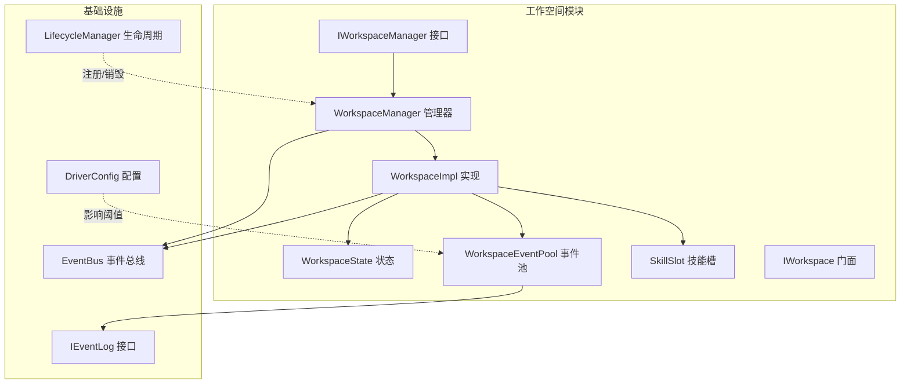
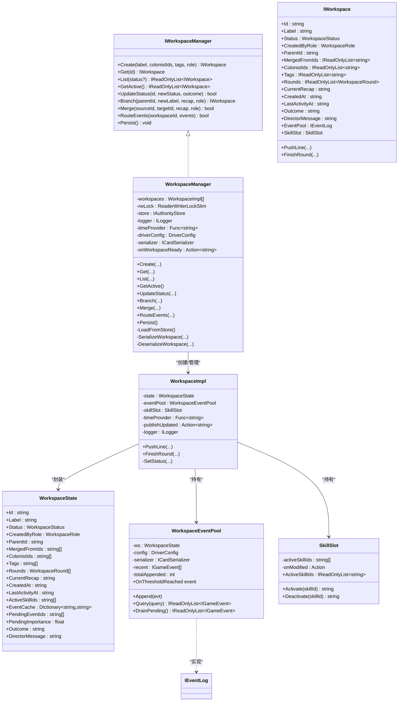
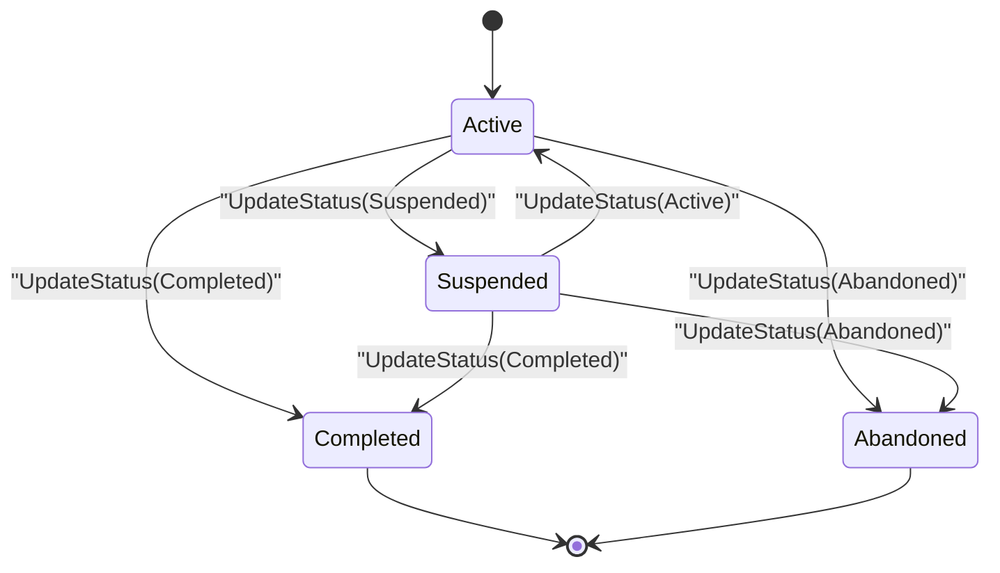
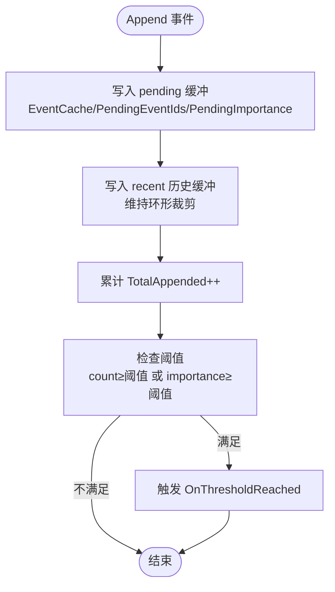
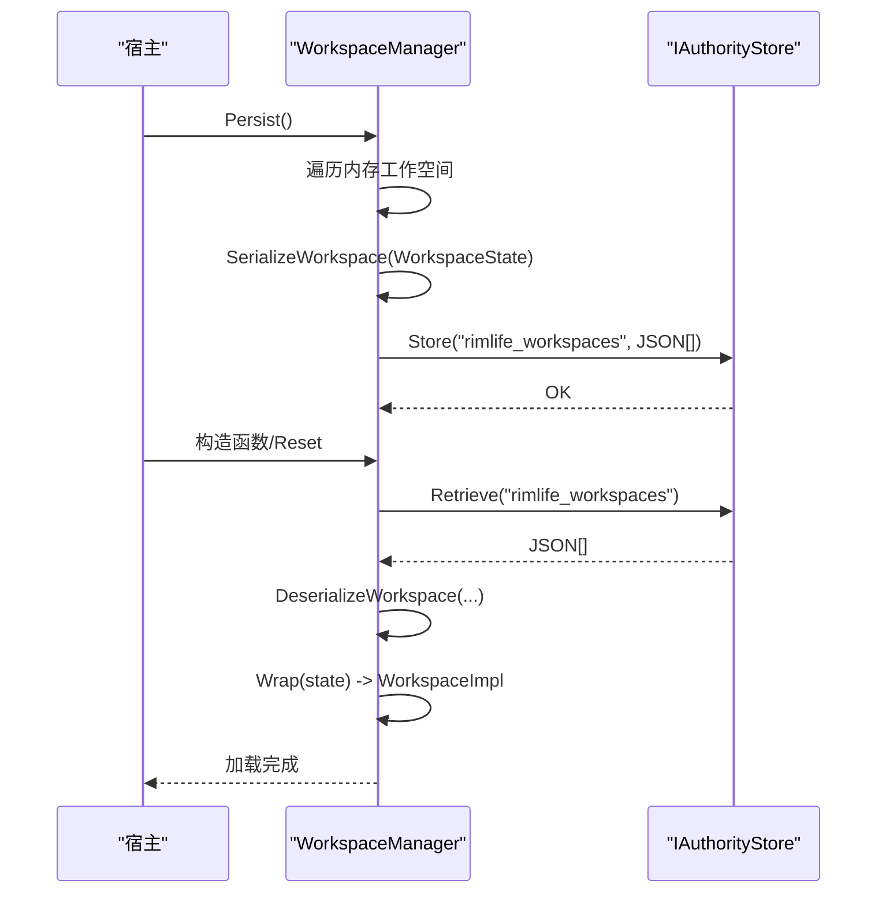
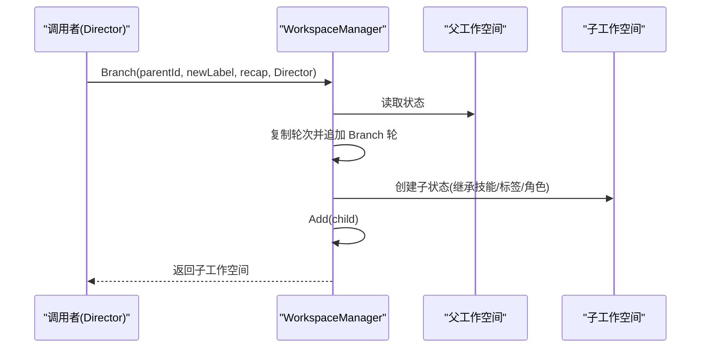
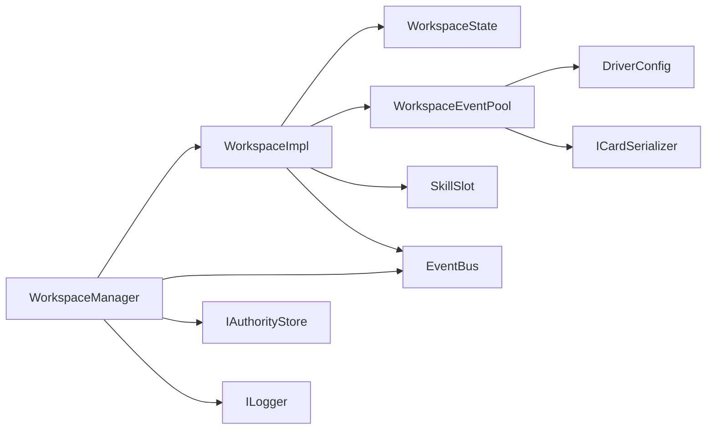

# 工作空间管理系统

<cite>
**本文引用的文件**   
- [README.md](file://README.md)
- [IWorkspace.cs](file://src/NPCLife/Workspace/IWorkspace.cs)
- [WorkspaceImpl.cs](file://src/NPCLife/Workspace/WorkspaceImpl.cs)
- [WorkspaceManager.cs](file://src/NPCLife/Workspace/WorkspaceManager.cs)
- [WorkspaceState.cs](file://src/NPCLife/Workspace/WorkspaceState.cs)
- [WorkspaceEventPool.cs](file://src/NPCLife/Workspace/WorkspaceEventPool.cs)
- [SkillSlot.cs](file://src/NPCLife/Workspace/SkillSlot.cs)
- [RoleSkillProfile.cs](file://src/NPCLife/Workspace/RoleSkillProfile.cs)
- [IWorkspaceManager.cs](file://src/NPCLife/Core/IWorkspaceManager.cs)
- [IEventLog.cs](file://src/NPCLife/Core/IEventLog.cs)
- [EventBus.cs](file://src/NPCLife/Framework/EventBus.cs)
- [DriverConfig.cs](file://src/NPCLife/Driver/DriverConfig.cs)
- [LifecycleManager.cs](file://src/NPCLife/Framework/LifecycleManager.cs)
- [InteractionHistoryStore.cs](file://src/NPCLife/Infrastructure/InteractionHistoryStore.cs)
- [WorkspaceEventPoolTests.cs](file://tests/NPCLife.Tests/Driver/WorkspaceEventPoolTests.cs)
</cite>

## 目录
1. [简介](#简介)
2. [项目结构](#项目结构)
3. [核心组件](#核心组件)
4. [架构总览](#架构总览)
5. [详细组件分析](#详细组件分析)
6. [依赖关系分析](#依赖关系分析)
7. [性能考量](#性能考量)
8. [故障排查指南](#故障排查指南)
9. [结论](#结论)
10. [附录](#附录)

## 简介
本文件面向“工作空间管理系统”的使用者与维护者，系统性阐述工作空间的概念、生命周期管理、上下文隔离机制，以及事件池管理、对话历史维护与角色集合管理的实现方式。文档还覆盖工作空间状态的持久化与恢复、最佳实践（性能优化、内存管理、错误处理）、典型使用示例与常见问题解决方案。

## 项目结构
工作空间系统位于 src/NPCLife/Workspace 下，围绕 IWorkspaceManager、WorkspaceManager、WorkspaceState、WorkspaceImpl、WorkspaceEventPool、SkillSlot 等核心对象组织，配合 DriverConfig、EventBus、LifecycleManager 等基础设施协同工作。IWorkspace 作为门面接口，屏蔽内部状态与组件细节，向外部提供受控的元数据与操作。

图表来源
- [WorkspaceManager.cs:19-616](file://src/NPCLife/Workspace/WorkspaceManager.cs#L19-L616)
- [WorkspaceImpl.cs:16-197](file://src/NPCLife/Workspace/WorkspaceImpl.cs#L16-L197)
- [WorkspaceState.cs:94-151](file://src/NPCLife/Workspace/WorkspaceState.cs#L94-L151)
- [WorkspaceEventPool.cs:21-186](file://src/NPCLife/Workspace/WorkspaceEventPool.cs#L21-L186)
- [SkillSlot.cs:11-61](file://src/NPCLife/Workspace/SkillSlot.cs#L11-L61)
- [IEventLog.cs:12-51](file://src/NPCLife/Core/IEventLog.cs#L12-L51)
- [DriverConfig.cs:9-107](file://src/NPCLife/Driver/DriverConfig.cs#L9-L107)
- [EventBus.cs:17-243](file://src/NPCLife/Framework/EventBus.cs#L17-L243)
- [LifecycleManager.cs:23-264](file://src/NPCLife/Framework/LifecycleManager.cs#L23-L264)

章节来源
- [README.md:1-93](file://README.md#L1-L93)
- [WorkspaceManager.cs:19-616](file://src/NPCLife/Workspace/WorkspaceManager.cs#L19-L616)
- [WorkspaceImpl.cs:16-197](file://src/NPCLife/Workspace/WorkspaceImpl.cs#L16-L197)
- [WorkspaceState.cs:94-151](file://src/NPCLife/Workspace/WorkspaceState.cs#L94-L151)
- [WorkspaceEventPool.cs:21-186](file://src/NPCLife/Workspace/WorkspaceEventPool.cs#L21-L186)
- [SkillSlot.cs:11-61](file://src/NPCLife/Workspace/SkillSlot.cs#L11-L61)
- [IEventLog.cs:12-51](file://src/NPCLife/Core/IEventLog.cs#L12-L51)
- [DriverConfig.cs:9-107](file://src/NPCLife/Driver/DriverConfig.cs#L9-L107)
- [EventBus.cs:17-243](file://src/NPCLife/Framework/EventBus.cs#L17-L243)
- [LifecycleManager.cs:23-264](file://src/NPCLife/Framework/LifecycleManager.cs#L23-L264)

## 核心组件
- IWorkspaceManager：工作空间管理器接口，定义 CRUD、分支/合并、事件路由与持久化等职责。
- WorkspaceManager：管理器实现，负责工作空间的创建、查询、状态变更、分支/合并、事件路由、持久化与加载。
- WorkspaceState：工作空间状态数据模型，承载元数据、轮次日志、事件缓存、技能激活列表等。
- WorkspaceImpl：IWorkspace 的实现，包装 WorkspaceState，暴露只读元数据、内部组件（事件池、技能槽）与叙事操作。
- WorkspaceEventPool：工作空间内部事件池，实现 IEventLog，提供双层缓冲（持久化的 pending 与内存 recent）、阈值触发与 drain。
- SkillSlot：工作空间内部技能槽，封装激活/停用技能与工具集变更的逻辑。
- RoleSkillProfile：角色技能预设，按角色自动激活默认技能集。
- IEventLog：事件日志抽象接口，统一事件写入、查询与阈值激活语义。
- DriverConfig：驱动配置，定义不同角色的事件阈值、历史缓冲容量、定时器脉冲等。
- EventBus：通用事件总线，提供发布/订阅、错误隔离与优先级排序。
- LifecycleManager：生命周期管理器，统一注册/销毁组件与触发钩子。
- InteractionHistoryStore：交互历史存储（与工作空间管理相关），演示持久化模式。

章节来源
- [IWorkspaceManager.cs:14-58](file://src/NPCLife/Core/IWorkspaceManager.cs#L14-L58)
- [WorkspaceManager.cs:19-616](file://src/NPCLife/Workspace/WorkspaceManager.cs#L19-L616)
- [WorkspaceState.cs:94-151](file://src/NPCLife/Workspace/WorkspaceState.cs#L94-L151)
- [WorkspaceImpl.cs:16-197](file://src/NPCLife/Workspace/WorkspaceImpl.cs#L16-L197)
- [WorkspaceEventPool.cs:21-186](file://src/NPCLife/Workspace/WorkspaceEventPool.cs#L21-L186)
- [SkillSlot.cs:11-61](file://src/NPCLife/Workspace/SkillSlot.cs#L11-L61)
- [RoleSkillProfile.cs:13-74](file://src/NPCLife/Workspace/RoleSkillProfile.cs#L13-L74)
- [IEventLog.cs:12-51](file://src/NPCLife/Core/IEventLog.cs#L12-L51)
- [DriverConfig.cs:9-107](file://src/NPCLife/Driver/DriverConfig.cs#L9-L107)
- [EventBus.cs:17-243](file://src/NPCLife/Framework/EventBus.cs#L17-L243)
- [LifecycleManager.cs:23-264](file://src/NPCLife/Framework/LifecycleManager.cs#L23-L264)
- [InteractionHistoryStore.cs:16-185](file://src/NPCLife/Infrastructure/InteractionHistoryStore.cs#L16-L185)

## 架构总览
工作空间系统采用“门面 + 状态 + 组件”的分层设计。IWorkspaceManager 统一对外，WorkspaceManager 负责业务编排与持久化；WorkspaceImpl 将状态与组件暴露给外部；WorkspaceEventPool 与 SkillSlot 作为内部子系统，分别承担事件与技能管理；EventBus 提供跨模块解耦的消息通道；DriverConfig 与 LifecycleManager 提供运行期配置与生命周期管理。

图表来源
- [IWorkspaceManager.cs:14-58](file://src/NPCLife/Core/IWorkspaceManager.cs#L14-L58)
- [WorkspaceManager.cs:19-616](file://src/NPCLife/Workspace/WorkspaceManager.cs#L19-L616)
- [IWorkspace.cs:11-51](file://src/NPCLife/Workspace/IWorkspace.cs#L11-L51)
- [WorkspaceImpl.cs:16-197](file://src/NPCLife/Workspace/WorkspaceImpl.cs#L16-L197)
- [WorkspaceState.cs:94-151](file://src/NPCLife/Workspace/WorkspaceState.cs#L94-L151)
- [WorkspaceEventPool.cs:21-186](file://src/NPCLife/Workspace/WorkspaceEventPool.cs#L21-L186)
- [SkillSlot.cs:11-61](file://src/NPCLife/Workspace/SkillSlot.cs#L11-L61)
- [IEventLog.cs:12-51](file://src/NPCLife/Core/IEventLog.cs#L12-L51)

## 详细组件分析

### 工作空间概念与生命周期
- 角色与权限
  - Director：全局视角，负责分支/合并/关闭，不直接参与叙事。
  - Screenwriter：创作叙事，可推送台词与结束轮次。
  - Freelancer：临时任务代理，快速响应独立事件。
- 状态机
  - Active：活跃，可继续推送。
  - Suspended：挂起，保留数据但暂停。
  - Completed / Abandoned：完结/废弃，不可再变更。
- 轮次类型
  - Normal：含前情提要与正式台词。
  - Branch/Merge：仅含结构声明轮，无台词。

章节来源
- [WorkspaceState.cs:9-53](file://src/NPCLife/Workspace/WorkspaceState.cs#L9-L53)
- [WorkspaceState.cs:25-53](file://src/NPCLife/Workspace/WorkspaceState.cs#L25-L53)
- [WorkspaceState.cs:60-88](file://src/NPCLife/Workspace/WorkspaceState.cs#L60-L88)

### 生命周期管理与上下文隔离
- 创建：生成唯一 ID、初始化状态、根据角色激活默认技能集，发布创建事件。
- 查询：按 ID、状态过滤、获取活跃集合。
- 更新状态：严格的状态机转换校验，非法转换拒绝。
- 挂起/恢复：通过状态变更实现，不影响事件池与技能槽。
- 关闭：Completed/Abandoned 后发布关闭事件，不再接受变更。

图表来源
- [WorkspaceState.cs:25-38](file://src/NPCLife/Workspace/WorkspaceState.cs#L25-L38)
- [WorkspaceManager.cs:406-423](file://src/NPCLife/Workspace/WorkspaceManager.cs#L406-L423)

章节来源
- [WorkspaceManager.cs:91-138](file://src/NPCLife/Workspace/WorkspaceManager.cs#L91-L138)
- [WorkspaceManager.cs:165-187](file://src/NPCLife/Workspace/WorkspaceManager.cs#L165-L187)
- [WorkspaceManager.cs:406-423](file://src/NPCLife/Workspace/WorkspaceManager.cs#L406-L423)

### 事件池管理与阈值触发
- 双层缓冲
  - pending：持久化到 WorkspaceState（EventCache/PendingEventIds/PendingImportance），随工作空间保存。
  - recent：内存环形缓冲（RecentHistoryCapacity），用于查询与 GetById。
- 阈值触发
  - 按角色配置的事件数与重要度阈值，任一满足即触发 OnThresholdReached。
  - 由 AgentLoop 订阅被动激活。
- DrainPending
  - 取出所有 pending 事件并清空缓冲，用于消费与重置。

图表来源
- [WorkspaceEventPool.cs:49-90](file://src/NPCLife/Workspace/WorkspaceEventPool.cs#L49-L90)
- [DriverConfig.cs:54-85](file://src/NPCLife/Driver/DriverConfig.cs#L54-L85)

章节来源
- [WorkspaceEventPool.cs:21-186](file://src/NPCLife/Workspace/WorkspaceEventPool.cs#L21-L186)
- [DriverConfig.cs:9-107](file://src/NPCLife/Driver/DriverConfig.cs#L9-L107)
- [WorkspaceEventPoolTests.cs:138-275](file://tests/NPCLife.Tests/Driver/WorkspaceEventPoolTests.cs#L138-L275)

### 对话历史维护与角色集合管理
- 对话历史
  - 通过 IInteractionStore（实现为 InteractionHistoryStore）维护交互流水，支持按双方/单方查询与计数。
  - 与工作空间状态分离，不参与事件池阈值判断。
- 角色集合
  - WorkspaceState.ColonistIds 维护工作空间关联的角色 ID 列表，合并时去重聚合。
  - 用于筛选事件、查询角色状态与关系。

章节来源
- [InteractionHistoryStore.cs:16-185](file://src/NPCLife/Infrastructure/InteractionHistoryStore.cs#L16-L185)
- [WorkspaceState.cs:114-118](file://src/NPCLife/Workspace/WorkspaceState.cs#L114-L118)
- [WorkspaceManager.cs:330-350](file://src/NPCLife/Workspace/WorkspaceManager.cs#L330-L350)

### 技能槽与角色技能配置
- SkillSlot
  - ActiveSkillIds 列表与 McpSkillRegistry 交互，支持激活/停用技能并返回工具集 JSON。
  - 系统技能不可停用，重复激活返回空工具集。
- RoleSkillProfile
  - 按角色提供默认技能集：Director、Screenwriter、Freelancer 各自预设。

章节来源
- [SkillSlot.cs:11-61](file://src/NPCLife/Workspace/SkillSlot.cs#L11-L61)
- [RoleSkillProfile.cs:13-74](file://src/NPCLife/Workspace/RoleSkillProfile.cs#L13-L74)
- [WorkspaceImpl.cs:38-46](file://src/NPCLife/Workspace/WorkspaceImpl.cs#L38-L46)

### 工作空间状态的持久化与恢复
- WorkspaceManager
  - Persist：遍历内存工作空间，序列化为 JSON 数组，写入 IAuthorityStore。
  - LoadFromStore：从存储读取 JSON，反序列化为 WorkspaceState 并重建 WorkspaceImpl。
- WorkspaceState
  - 持久化字段覆盖：元数据、轮次、事件缓存、技能、标签、角色集合、时间戳、Outcome、DirectorMessage 等。
- 事件池
  - pending 字段随状态持久化，确保重启后可继续消费。

图表来源
- [WorkspaceManager.cs:50-74](file://src/NPCLife/Workspace/WorkspaceManager.cs#L50-L74)
- [WorkspaceManager.cs:429-457](file://src/NPCLife/Workspace/WorkspaceManager.cs#L429-L457)
- [WorkspaceManager.cs:463-520](file://src/NPCLife/Workspace/WorkspaceManager.cs#L463-L520)
- [WorkspaceManager.cs:520-571](file://src/NPCLife/Workspace/WorkspaceManager.cs#L520-L571)

章节来源
- [WorkspaceManager.cs:50-74](file://src/NPCLife/Workspace/WorkspaceManager.cs#L50-L74)
- [WorkspaceManager.cs:429-457](file://src/NPCLife/Workspace/WorkspaceManager.cs#L429-L457)
- [WorkspaceManager.cs:463-520](file://src/NPCLife/Workspace/WorkspaceManager.cs#L463-L520)
- [WorkspaceManager.cs:520-571](file://src/NPCLife/Workspace/WorkspaceManager.cs#L520-L571)

### 分支、合并与挂起/恢复流程
- 分支（Branch）
  - 仅 Director 可操作；复制父线轮次至新线，新增 Branch 轮；继承父线技能与标签/角色集合。
- 合并（Merge）
  - 仅 Director 可操作；去重合并轮次，保留各自标签/角色集合与技能；源线标记 Abandoned。
- 挂起/恢复（Suspend/Resume）
  - 通过 UpdateStatus 切换，不改变事件池与技能状态。

图表来源
- [WorkspaceManager.cs:193-263](file://src/NPCLife/Workspace/WorkspaceManager.cs#L193-L263)

章节来源
- [WorkspaceManager.cs:193-263](file://src/NPCLife/Workspace/WorkspaceManager.cs#L193-L263)
- [WorkspaceManager.cs:269-376](file://src/NPCLife/Workspace/WorkspaceManager.cs#L269-L376)
- [WorkspaceManager.cs:165-187](file://src/NPCLife/Workspace/WorkspaceManager.cs#L165-L187)

### 事件路由与消息传递
- WorkspaceManager.RouteEvents
  - 将事件批量写入目标工作空间的事件池（仅对 Active 状态有效）。
- EventBus
  - 管理器与实现均通过 EventBus 发布工作空间生命周期与脚本事件，便于订阅者响应。

章节来源
- [WorkspaceManager.cs:382-392](file://src/NPCLife/Workspace/WorkspaceManager.cs#L382-L392)
- [EventBus.cs:186-242](file://src/NPCLife/Framework/EventBus.cs#L186-L242)
- [WorkspaceImpl.cs:114-122](file://src/NPCLife/Workspace/WorkspaceImpl.cs#L114-L122)
- [WorkspaceImpl.cs:175-181](file://src/NPCLife/Workspace/WorkspaceImpl.cs#L175-L181)

## 依赖关系分析
- 组件耦合
  - WorkspaceManager 与 WorkspaceImpl 强耦合（管理与实现），但通过 IWorkspace 对外解耦。
  - WorkspaceImpl 依赖 WorkspaceState、WorkspaceEventPool、SkillSlot，形成内聚组件。
  - WorkspaceEventPool 依赖 DriverConfig 与 ICardSerializer，实现阈值与序列化。
- 外部依赖
  - IAuthorityStore：持久化后端抽象。
  - ILogger：日志抽象。
  - EventBus：跨模块消息总线。
  - LifecycleManager：组件生命周期管理。

图表来源
- [WorkspaceManager.cs:31-40](file://src/NPCLife/Workspace/WorkspaceManager.cs#L31-L40)
- [WorkspaceImpl.cs:25-46](file://src/NPCLife/Workspace/WorkspaceImpl.cs#L25-L46)
- [WorkspaceEventPool.cs:32-43](file://src/NPCLife/Workspace/WorkspaceEventPool.cs#L32-L43)
- [EventBus.cs:17-243](file://src/NPCLife/Framework/EventBus.cs#L17-L243)

章节来源
- [WorkspaceManager.cs:31-40](file://src/NPCLife/Workspace/WorkspaceManager.cs#L31-L40)
- [WorkspaceImpl.cs:25-46](file://src/NPCLife/Workspace/WorkspaceImpl.cs#L25-L46)
- [WorkspaceEventPool.cs:32-43](file://src/NPCLife/Workspace/WorkspaceEventPool.cs#L32-L43)
- [EventBus.cs:17-243](file://src/NPCLife/Framework/EventBus.cs#L17-L243)

## 性能考量
- 事件池阈值
  - 通过分角色阈值减少无效调用，建议根据场景调整 DriverConfig 的阈值与 RecentHistoryCapacity。
- 内存与序列化
  - recent 历史采用环形裁剪，避免无限增长；pending 事件随状态持久化，重启后可继续消费。
- 并发与锁
  - 使用 ReaderWriterLockSlim 保护工作空间列表，读多写少场景下提升并发吞吐。
- 序列化开销
  - WorkspaceManager 在 Persist 时构建 JSON 字符串，注意大工作空间集合的内存峰值。
- 生命周期
  - 通过 LifecycleManager 注册组件，确保正确 Dispose 与事件清理，避免资源泄漏。

章节来源
- [DriverConfig.cs:9-107](file://src/NPCLife/Driver/DriverConfig.cs#L9-L107)
- [WorkspaceEventPool.cs:61-74](file://src/NPCLife/Workspace/WorkspaceEventPool.cs#L61-L74)
- [WorkspaceManager.cs:21-29](file://src/NPCLife/Workspace/WorkspaceManager.cs#L21-L29)
- [WorkspaceManager.cs:50-74](file://src/NPCLife/Workspace/WorkspaceManager.cs#L50-L74)
- [LifecycleManager.cs:23-264](file://src/NPCLife/Framework/LifecycleManager.cs#L23-L264)

## 故障排查指南
- 无法推送台词
  - 检查工作空间状态是否为 Active；确认调用者角色为 Screenwriter/Freelancer；检查输入文本与类型。
- FinishRound 失败
  - 状态非 Active、调用者权限不足、或工作空间处于 Completed/Abandoned。
- 事件池不触发
  - 检查 DriverConfig 阈值配置；确认事件 Importance 与 PendingImportance 是否累计；确认订阅 OnThresholdReached。
- 分支/合并失败
  - 确认调用者为 Director；检查源/目标 ID 是否存在；合并时避免源目标相同。
- 持久化失败
  - 检查 IAuthorityStore 实现；查看日志 Warning 输出；确认 JSON 序列化/反序列化路径。

章节来源
- [WorkspaceImpl.cs:83-123](file://src/NPCLife/Workspace/WorkspaceImpl.cs#L83-L123)
- [WorkspaceImpl.cs:125-182](file://src/NPCLife/Workspace/WorkspaceImpl.cs#L125-L182)
- [WorkspaceManager.cs:193-263](file://src/NPCLife/Workspace/WorkspaceManager.cs#L193-L263)
- [WorkspaceManager.cs:269-376](file://src/NPCLife/Workspace/WorkspaceManager.cs#L269-L376)
- [WorkspaceEventPool.cs:81-90](file://src/NPCLife/Workspace/WorkspaceEventPool.cs#L81-L90)
- [WorkspaceManager.cs:69-73](file://src/NPCLife/Workspace/WorkspaceManager.cs#L69-L73)

## 结论
工作空间管理系统通过清晰的角色分工、严格的生命周期状态机、双层事件池与技能槽机制，实现了高内聚、低耦合的上下文隔离与异步协作。结合事件阈值触发与持久化恢复，系统在保证性能的同时提供了强大的叙事扩展能力。建议在实际部署中根据场景调整阈值与容量，并通过 EventBus 与 LifecycleManager 建立完善的可观测与可维护体系。

## 附录

### 最佳实践清单
- 角色权限
  - 仅 Director 执行分支/合并/关闭；Screenwriter/Freelancer 专注叙事。
- 阈值配置
  - 根据事件密度与 LLM 成本调优 DriverConfig；合理设置 RecentHistoryCapacity。
- 状态管理
  - 使用 UpdateStatus 明确挂起/恢复/关闭；避免在 Completed/Abandoned 上继续写入。
- 持久化时机
  - 在合适的时间点调用 Persist；存档切换时使用 LifecycleManager.Reset。
- 错误处理
  - 订阅 EventBus 事件进行监控；捕获并记录日志，避免异常传播影响其他订阅者。

章节来源
- [README.md:34-87](file://README.md#L34-L87)
- [DriverConfig.cs:9-107](file://src/NPCLife/Driver/DriverConfig.cs#L9-L107)
- [WorkspaceManager.cs:50-74](file://src/NPCLife/Workspace/WorkspaceManager.cs#L50-L74)
- [LifecycleManager.cs:232-241](file://src/NPCLife/Framework/LifecycleManager.cs#L232-L241)
- [EventBus.cs:86-113](file://src/NPCLife/Framework/EventBus.cs#L86-L113)