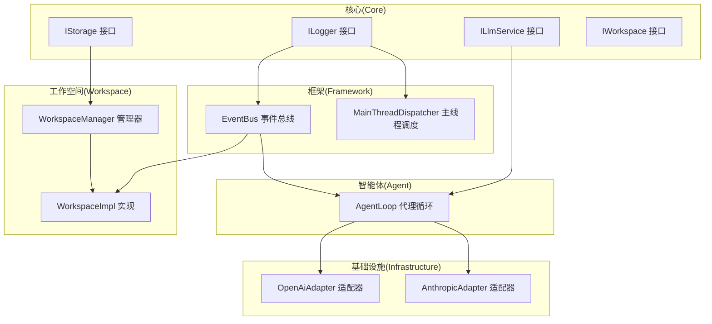
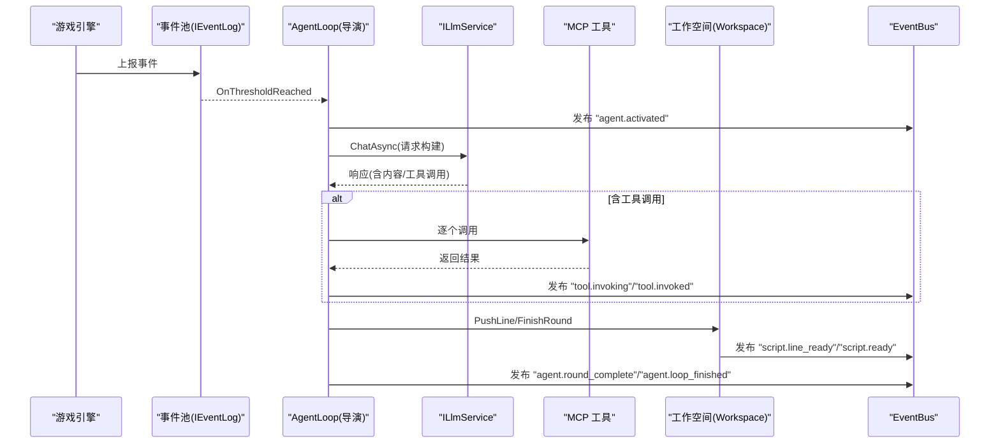
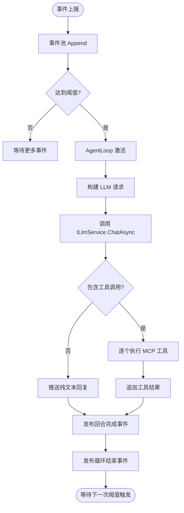
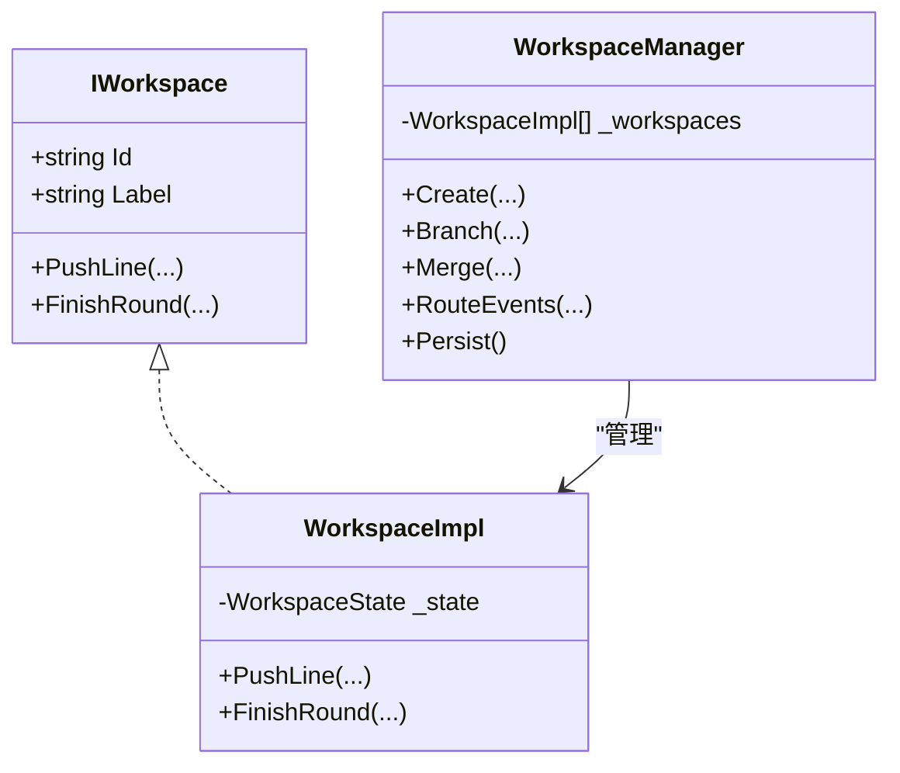
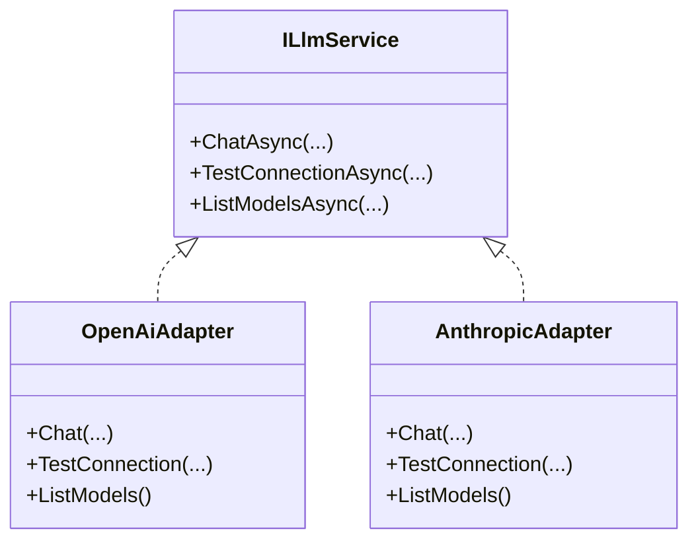
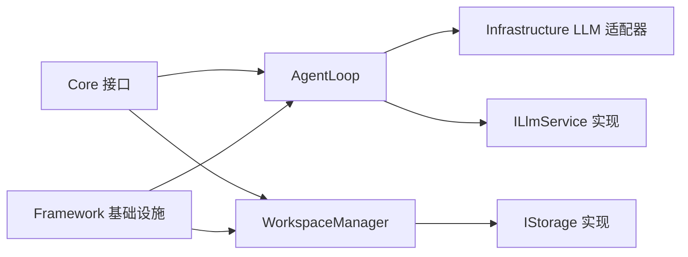

# 快速开始

<cite>
**本文引用的文件**
- [README.md](file://README.md)
- [NPCLife.csproj](file://src/NPCLife/NPCLife.csproj)
- [IStorage.cs](file://src/NPCLife/Core/IStorage.cs)
- [ILogger.cs](file://src/NPCLife/Framework/ILogger.cs)
- [ILlmService.cs](file://src/NPCLife/Core/ILlmService.cs)
- [EventBus.cs](file://src/NPCLife/Framework/EventBus.cs)
- [AgentLoop.cs](file://src/NPCLife/Agent/AgentLoop.cs)
- [MainThreadDispatcher.cs](file://src/NPCLife/Framework/MainThreadDispatcher.cs)
- [IWorkspace.cs](file://src/NPCLife/Workspace/IWorkspace.cs)
- [WorkspaceImpl.cs](file://src/NPCLife/Workspace/WorkspaceImpl.cs)
- [WorkspaceManager.cs](file://src/NPCLife/Workspace/WorkspaceManager.cs)
- [OpenAiAdapter.cs](file://src/NPCLife/Infrastructure/Llm/OpenAiAdapter.cs)
- [AnthropicAdapter.cs](file://src/NPCLife/Infrastructure/Llm/AnthropicAdapter.cs)
- [KnowledgeModule.md](file://docs/KnowledgeModule.md)
</cite>

## 目录
1. [简介](#简介)
2. [项目结构](#项目结构)
3. [核心组件](#核心组件)
4. [架构总览](#架构总览)
5. [详细组件分析](#详细组件分析)
6. [依赖分析](#依赖分析)
7. [性能考虑](#性能考虑)
8. [故障排查指南](#故障排查指南)
9. [结论](#结论)
10. [附录](#附录)

## 简介
NPCLife 是一个可嵌入游戏引擎的 C# 库，通过上报游戏事件并自动触发 AI 驱动的剧情生成，为 NPC 提供有因果关系的动态叙事。项目提供事件总线、工作空间（Workspace）管理、MCP 工具协议、以及 LLM 适配层，帮助你在 30 分钟内完成基础集成并看到效果。

- 项目目标：将游戏事件转化为 AI 驱动的叙事流，支持分支与合并、多角色协作（导演/编剧/临时编剧）、上下文隔离与阈值触发。
- 集成要求：宿主游戏需提供三类适配器（存储、日志、LLM 服务）与时间提供者，同时可注入自定义 MCP 工具。

**章节来源**
- [README.md:1-93](file://README.md#L1-L93)

## 项目结构
NPCLife 采用清晰的分层与职责划分：
- Core：核心接口与领域模型（事件、知识、凭证、存储等）
- Framework：通用基础设施（事件总线、主线程调度、日志、JSON 工具等）
- Agent：AI 角色循环（导演/编剧/临时编剧）的执行引擎
- Workspace：工作空间（剧情线）的生命周期与状态管理
- Infrastructure：LLM 适配器（OpenAI / Anthropic）
- Driver：驱动配置与提示词
- Cards：卡牌与事件数据结构
- Prompts：内置提示词资源

**图表来源**
- [IStorage.cs:1-53](file://src/NPCLife/Core/IStorage.cs#L1-L53)
- [ILogger.cs:1-20](file://src/NPCLife/Framework/ILogger.cs#L1-L20)
- [ILlmService.cs:1-51](file://src/NPCLife/Core/ILlmService.cs#L1-L51)
- [EventBus.cs:1-243](file://src/NPCLife/Framework/EventBus.cs#L1-L243)
- [AgentLoop.cs:1-581](file://src/NPCLife/Agent/AgentLoop.cs#L1-L581)
- [MainThreadDispatcher.cs:1-147](file://src/NPCLife/Framework/MainThreadDispatcher.cs#L1-L147)
- [WorkspaceManager.cs:1-616](file://src/NPCLife/Workspace/WorkspaceManager.cs#L1-L616)
- [WorkspaceImpl.cs:1-197](file://src/NPCLife/Workspace/WorkspaceImpl.cs#L1-L197)
- [OpenAiAdapter.cs:1-392](file://src/NPCLife/Infrastructure/Llm/OpenAiAdapter.cs#L1-L392)
- [AnthropicAdapter.cs:1-434](file://src/NPCLife/Infrastructure/Llm/AnthropicAdapter.cs#L1-L434)

**章节来源**
- [NPCLife.csproj:1-38](file://src/NPCLife/NPCLife.csproj#L1-L38)

## 核心组件
- 事件总线 EventBus：提供发布/订阅能力，支持命名空间事件名、错误隔离、优先级排序，是框架内通信中枢。
- AgentLoop：被动激活的代理循环，基于事件阈值触发，负责构建请求、调用 LLM、执行工具调用、归档回合。
- WorkspaceManager：工作空间的 CRUD、分支/合并、事件路由与持久化。
- IStorage：权威存档与缓存存取接口，分别用于存档状态与本地缓存。
- ILogger：统一日志接口，便于宿主注入平台日志。
- ILlmService：LLM 服务统一异步契约，支持多凭证回退、连接测试与模型列表查询。
- MainThreadDispatcher：主线程任务调度器，确保 UI 相关回调在主线程执行。
- LLM 适配器：OpenAI 与 Anthropic 的适配器，负责请求/响应格式转换与错误处理。

**章节来源**
- [EventBus.cs:1-243](file://src/NPCLife/Framework/EventBus.cs#L1-L243)
- [AgentLoop.cs:1-581](file://src/NPCLife/Agent/AgentLoop.cs#L1-L581)
- [WorkspaceManager.cs:1-616](file://src/NPCLife/Workspace/WorkspaceManager.cs#L1-L616)
- [IStorage.cs:1-53](file://src/NPCLife/Core/IStorage.cs#L1-L53)
- [ILogger.cs:1-20](file://src/NPCLife/Framework/ILogger.cs#L1-L20)
- [ILlmService.cs:1-51](file://src/NPCLife/Core/ILlmService.cs#L1-L51)
- [MainThreadDispatcher.cs:1-147](file://src/NPCLife/Framework/MainThreadDispatcher.cs#L1-L147)
- [OpenAiAdapter.cs:1-392](file://src/NPCLife/Infrastructure/Llm/OpenAiAdapter.cs#L1-L392)
- [AnthropicAdapter.cs:1-434](file://src/NPCLife/Infrastructure/Llm/AnthropicAdapter.cs#L1-L434)

## 架构总览
NPCLife 的工作流围绕“事件上报 → 阈值检测 → 导演激活 → 事件路由 → 编剧生成 → 台词输出 → 轮次归档”的闭环展开。事件总线贯穿其中，驱动 AgentLoop 与 Workspace 的状态流转。

**图表来源**
- [AgentLoop.cs:171-337](file://src/NPCLife/Agent/AgentLoop.cs#L171-L337)
- [WorkspaceImpl.cs:83-182](file://src/NPCLife/Workspace/WorkspaceImpl.cs#L83-L182)
- [EventBus.cs:86-113](file://src/NPCLife/Framework/EventBus.cs#L86-L113)

**章节来源**
- [README.md:56-66](file://README.md#L56-L66)

## 详细组件分析

### 接口适配器实现指南（IStorage、ILogger、ILlmService）

- IStorage（权威存档与缓存）
  - 权威存储 IAuthorityStore：用于存档文件，数据不可丢失，缺失视为异常。
  - 缓存存储 ICacheStore：用于本地文件缓存，数据可再生，缺失属正常情况。
  - 实现建议：将 IAuthorityStore 映射到游戏存档目录，将 ICacheStore 映射到本地临时目录；在 WorkspaceManager.Persist 时写入权威存储。
  
  **章节来源**
  - [IStorage.cs:10-51](file://src/NPCLife/Core/IStorage.cs#L10-L51)
  - [WorkspaceManager.cs:50-74](file://src/NPCLife/Workspace/WorkspaceManager.cs#L50-L74)

- ILogger（日志）
  - 提供 Message/Warning/Error 三个级别，框架内部通过此接口输出日志。
  - 实现建议：将宿主平台的日志系统绑定到 ILogger，以便统一收集与过滤。

  **章节来源**
  - [ILogger.cs:8-18](file://src/NPCLife/Framework/ILogger.cs#L8-L18)

- ILlmService（LLM 服务）
  - ChatAsync：支持多凭证顺序尝试，失败自动切换下一个，全部失败返回最后一个错误。
  - TestConnectionAsync：用于配置向导中的连接测试。
  - ListModelsAsync：列出可用模型（部分 API 不支持，返回空数组）。
  - 实现建议：封装 OpenAI/Anthropic 等适配器，暴露统一的 ILlmService；在工作线程中执行 HTTP 调用，通过 MainThreadDispatcher 回到主线程。

  **章节来源**
  - [ILlmService.cs:17-49](file://src/NPCLife/Core/ILlmService.cs#L17-L49)

### 最小可用实现示例（路径指引）
- IStorage 最小实现
  - 权威存档：在游戏存档目录创建文件，使用 IAuthorityStore.Store/Retrieve/Remove。
  - 缓存存取：在本地目录创建文件，使用 ICacheStore.Cache/FetchCache/TryFetchCache。
  - 参考路径：[IStorage.cs:10-51](file://src/NPCLife/Core/IStorage.cs#L10-L51)，[WorkspaceManager.cs:50-74](file://src/NPCLife/Workspace/WorkspaceManager.cs#L50-L74)

- ILogger 最小实现
  - 将宿主日志系统绑定到 ILogger 的三个方法，确保零外部依赖。
  - 参考路径：[ILogger.cs:8-18](file://src/NPCLife/Framework/ILogger.cs#L8-L18)

- ILlmService 最小实现
  - 使用 OpenAiAdapter 或 AnthropicAdapter 作为内部实现，对外暴露 ILlmService。
  - 参考路径：[OpenAiAdapter.cs:18-74](file://src/NPCLife/Infrastructure/Llm/OpenAiAdapter.cs#L18-L74)，[AnthropicAdapter.cs:23-68](file://src/NPCLife/Infrastructure/Llm/AnthropicAdapter.cs#L23-L68)

### 事件上报与处理流程（完整示例路径）
- 游戏侧在合适时机（例如战斗、对话、探索）调用事件池 Append，达到阈值后触发 AgentLoop。
- AgentLoop 订阅 IEventLog.OnThresholdReached，进入 RunOnceAsync，构建请求、调用 LLM、执行工具调用、推送台词、归档回合。
- 工作空间通过 IWorkspace.PushLine 立即发布单行就绪事件，由 ScriptDeliveryService 逐行投递到游戏侧显示。

**图表来源**
- [AgentLoop.cs:171-337](file://src/NPCLife/Agent/AgentLoop.cs#L171-L337)
- [WorkspaceImpl.cs:114-182](file://src/NPCLife/Workspace/WorkspaceImpl.cs#L114-L182)

**章节来源**
- [AgentLoop.cs:122-165](file://src/NPCLife/Agent/AgentLoop.cs#L122-L165)
- [WorkspaceImpl.cs:83-182](file://src/NPCLife/Workspace/WorkspaceImpl.cs#L83-L182)

### 工作空间与时间提供者集成
- 工作空间 IWorkspace 提供 PushLine/FinishRound 等操作，内部通过 EventBus 发布事件。
- WorkspaceManager 负责工作空间的 CRUD、分支/合并、事件路由与持久化，依赖 IAuthorityStore。
- 时间提供者：由宿主提供返回当前时间字符串的函数，用于时间戳记录与状态更新。

**图表来源**
- [IWorkspace.cs:11-50](file://src/NPCLife/Workspace/IWorkspace.cs#L11-L50)
- [WorkspaceImpl.cs:16-46](file://src/NPCLife/Workspace/WorkspaceImpl.cs#L16-L46)
- [WorkspaceManager.cs:19-40](file://src/NPCLife/Workspace/WorkspaceManager.cs#L19-L40)

**章节来源**
- [IWorkspace.cs:11-50](file://src/NPCLife/Workspace/IWorkspace.cs#L11-L50)
- [WorkspaceImpl.cs:16-197](file://src/NPCLife/Workspace/WorkspaceImpl.cs#L16-L197)
- [WorkspaceManager.cs:19-616](file://src/NPCLife/Workspace/WorkspaceManager.cs#L19-L616)

### LLM 适配器与 MCP 工具
- OpenAiAdapter/AnthropicAdapter：将内部统一格式转换为对应 API 的请求/响应格式，支持连接测试与模型列表查询。
- MCP 工具：通过 AgentPipeline 与 McpSkillRegistry 注册与调用，工具调用前后可进行拦截与校验。

**图表来源**
- [ILlmService.cs:17-49](file://src/NPCLife/Core/ILlmService.cs#L17-L49)
- [OpenAiAdapter.cs:18-143](file://src/NPCLife/Infrastructure/Llm/OpenAiAdapter.cs#L18-L143)
- [AnthropicAdapter.cs:23-100](file://src/NPCLife/Infrastructure/Llm/AnthropicAdapter.cs#L23-L100)

**章节来源**
- [OpenAiAdapter.cs:18-392](file://src/NPCLife/Infrastructure/Llm/OpenAiAdapter.cs#L18-L392)
- [AnthropicAdapter.cs:23-434](file://src/NPCLife/Infrastructure/Llm/AnthropicAdapter.cs#L23-L434)

## 依赖分析
- 组件耦合与内聚
  - Core 接口定义清晰，AgentLoop/WorkspaceManager 仅依赖接口，降低耦合。
  - Framework 层提供 EventBus 与 MainThreadDispatcher，作为横切关注点。
  - Infrastructure 层对 LLM 适配器透明，便于替换与扩展。
- 外部依赖
  - System.Net.Http 用于 HTTP 调用。
  - 无第三方 UI/游戏引擎依赖，适合嵌入任意宿主。

**图表来源**
- [NPCLife.csproj:23-29](file://src/NPCLife/NPCLife.csproj#L23-L29)
- [AgentLoop.cs:43-116](file://src/NPCLife/Agent/AgentLoop.cs#L43-L116)
- [WorkspaceManager.cs:19-40](file://src/NPCLife/Workspace/WorkspaceManager.cs#L19-L40)

**章节来源**
- [NPCLife.csproj:1-38](file://src/NPCLife/NPCLife.csproj#L1-L38)

## 性能考虑
- 阈值触发：事件在池中积累，达到数量阈值或累计重要度阈值再触发 AI，减少 API 调用频率与成本。
- 线程模型：LLM 调用在工作线程执行，通过 MainThreadDispatcher 回到主线程，避免阻塞 UI。
- 工具调用：单轮最多 maxRounds 次，防止死循环；工具调用前后可进行拦截与校验，减少无效调用。
- 缓存与持久化：合理使用 ICacheStore 与 IAuthorityStore，降低重复计算与 IO 压力。

**章节来源**
- [README.md:50-53](file://README.md#L50-L53)
- [AgentLoop.cs:258-264](file://src/NPCLife/Agent/AgentLoop.cs#L258-L264)
- [MainThreadDispatcher.cs:62-108](file://src/NPCLife/Framework/MainThreadDispatcher.cs#L62-L108)

## 故障排查指南
- LLM 连接失败
  - 使用 ILlmService.TestConnectionAsync 进行连接测试，检查 API Key、BaseURL、超时设置。
  - 查看 OpenAiAdapter/AnthropicAdapter 的错误日志与 HTTP 状态码。
  - 参考路径：[ILlmService.cs:38-39](file://src/NPCLife/Core/ILlmService.cs#L38-L39)，[OpenAiAdapter.cs:79-112](file://src/NPCLife/Infrastructure/Llm/OpenAiAdapter.cs#L79-L112)，[AnthropicAdapter.cs:70-92](file://src/NPCLife/Infrastructure/Llm/AnthropicAdapter.cs#L70-L92)

- 工具调用异常
  - 检查 McpSkillRegistry 是否正确注册工具，工具调用前后拦截器是否取消或抛出异常。
  - 关注 EventBus 中 "tool.invoking"/"tool.invoked" 事件，定位失败环节。
  - 参考路径：[AgentLoop.cs:274-301](file://src/NPCLife/Agent/AgentLoop.cs#L274-L301)，[EventBus.cs:211-214](file://src/NPCLife/Framework/EventBus.cs#L211-L214)

- 工作空间状态异常
  - 确认 WorkspaceManager.UpdateStatus 的状态转换是否合法，查看日志警告。
  - 检查持久化是否成功，必要时手动备份 IAuthorityStore。
  - 参考路径：[WorkspaceManager.cs:165-187](file://src/NPCLife/Workspace/WorkspaceManager.cs#L165-L187)

- 日志与主线程
  - 确保 ILogger 已注入，MainThreadDispatcher 在主线程调用 DrainQueue。
  - 参考路径：[ILogger.cs:8-18](file://src/NPCLife/Framework/ILogger.cs#L8-L18)，[MainThreadDispatcher.cs:62-108](file://src/NPCLife/Framework/MainThreadDispatcher.cs#L62-L108)

**章节来源**
- [ILlmService.cs:38-39](file://src/NPCLife/Core/ILlmService.cs#L38-L39)
- [OpenAiAdapter.cs:79-112](file://src/NPCLife/Infrastructure/Llm/OpenAiAdapter.cs#L79-L112)
- [AnthropicAdapter.cs:70-92](file://src/NPCLife/Infrastructure/Llm/AnthropicAdapter.cs#L70-L92)
- [AgentLoop.cs:274-301](file://src/NPCLife/Agent/AgentLoop.cs#L274-L301)
- [EventBus.cs:211-214](file://src/NPCLife/Framework/EventBus.cs#L211-L214)
- [WorkspaceManager.cs:165-187](file://src/NPCLife/Workspace/WorkspaceManager.cs#L165-L187)
- [ILogger.cs:8-18](file://src/NPCLife/Framework/ILogger.cs#L8-L18)
- [MainThreadDispatcher.cs:62-108](file://src/NPCLife/Framework/MainThreadDispatcher.cs#L62-L108)

## 结论
通过提供 IStorage、ILogger、ILlmService 三类适配器与时间提供者，NPCLife 可以无缝嵌入任意游戏引擎。按照本文的快速开始步骤，你可以在 30 分钟内完成基础集成：上报事件、触发代理循环、生成并推送台词、持久化工作空间状态。遇到问题时，结合事件总线与日志系统进行定位，利用 LLM 适配器与 MCP 工具扩展你的叙事能力。

## 附录

### 安装与环境配置
- 目标框架：.NET Framework 4.8 与 .NET Standard 2.0
- 依赖：System.Net.Http
- 建议：在宿主工程中引用 NPCLife.dll，并实现上述三类适配器与时间提供者。

**章节来源**
- [NPCLife.csproj:3-14](file://src/NPCLife/NPCLife.csproj#L3-L14)
- [NPCLife.csproj:27-29](file://src/NPCLife/NPCLife.csproj#L27-L29)

### 常见集成问题与调试技巧
- 问题：事件不触发
  - 检查事件池 Append 是否被调用，阈值是否达到，AgentLoop 是否订阅 OnThresholdReached。
  - 参考路径：[AgentLoop.cs:113-116](file://src/NPCLife/Agent/AgentLoop.cs#L113-L116)

- 问题：台词不显示
  - 确认 IWorkspace.PushLine 成功，关注 EventBus 中 "script.line_ready" 事件。
  - 参考路径：[WorkspaceImpl.cs:114-122](file://src/NPCLife/Workspace/WorkspaceImpl.cs#L114-L122)

- 问题：日志为空
  - 确认 ILogger 已注入，且宿主平台允许输出。
  - 参考路径：[ILogger.cs:8-18](file://src/NPCLife/Framework/ILogger.cs#L8-L18)

- 问题：LLM 响应为空
  - 使用 TestConnectionAsync 进行连通性测试，检查请求/响应 JSON 与错误信息。
  - 参考路径：[ILlmService.cs:38-39](file://src/NPCLife/Core/ILlmService.cs#L38-L39)，[OpenAiAdapter.cs:49-58](file://src/NPCLife/Infrastructure/Llm/OpenAiAdapter.cs#L49-L58)

**章节来源**
- [AgentLoop.cs:113-116](file://src/NPCLife/Agent/AgentLoop.cs#L113-L116)
- [WorkspaceImpl.cs:114-122](file://src/NPCLife/Workspace/WorkspaceImpl.cs#L114-L122)
- [ILogger.cs:8-18](file://src/NPCLife/Framework/ILogger.cs#L8-L18)
- [ILlmService.cs:38-39](file://src/NPCLife/Core/ILlmService.cs#L38-L39)
- [OpenAiAdapter.cs:49-58](file://src/NPCLife/Infrastructure/Llm/OpenAiAdapter.cs#L49-L58)