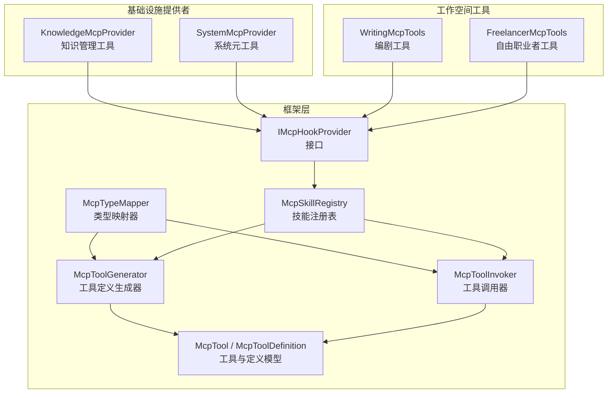
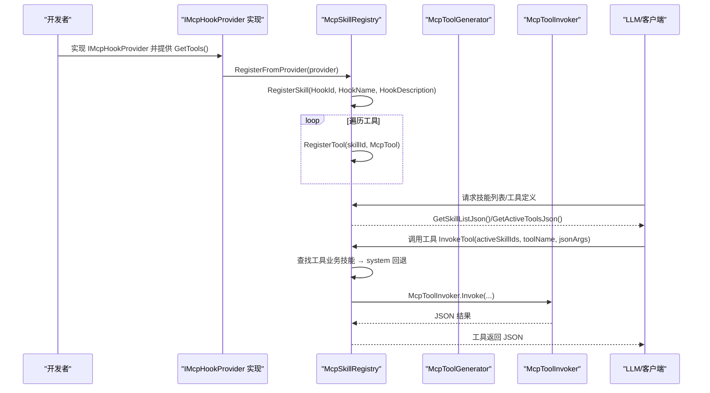
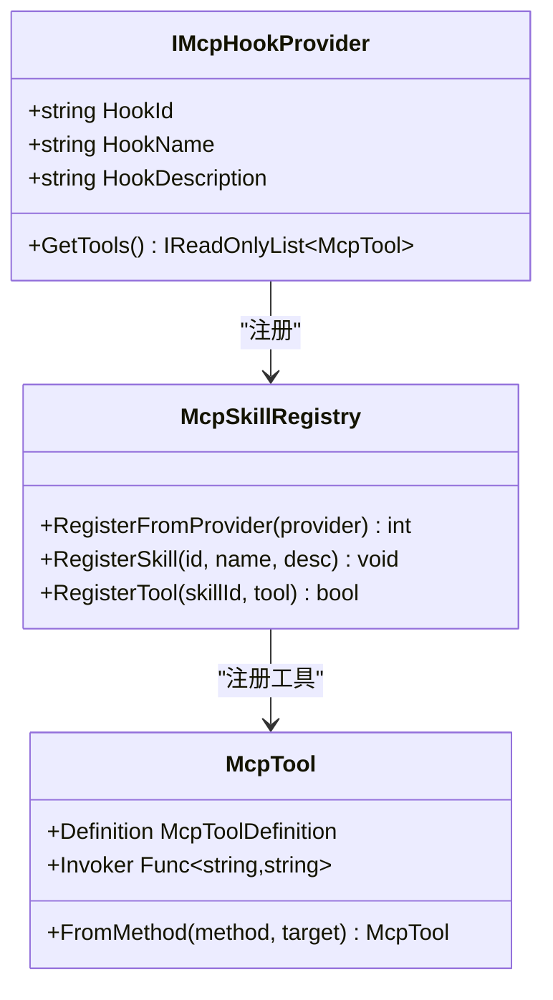
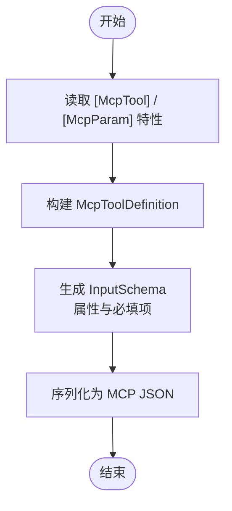
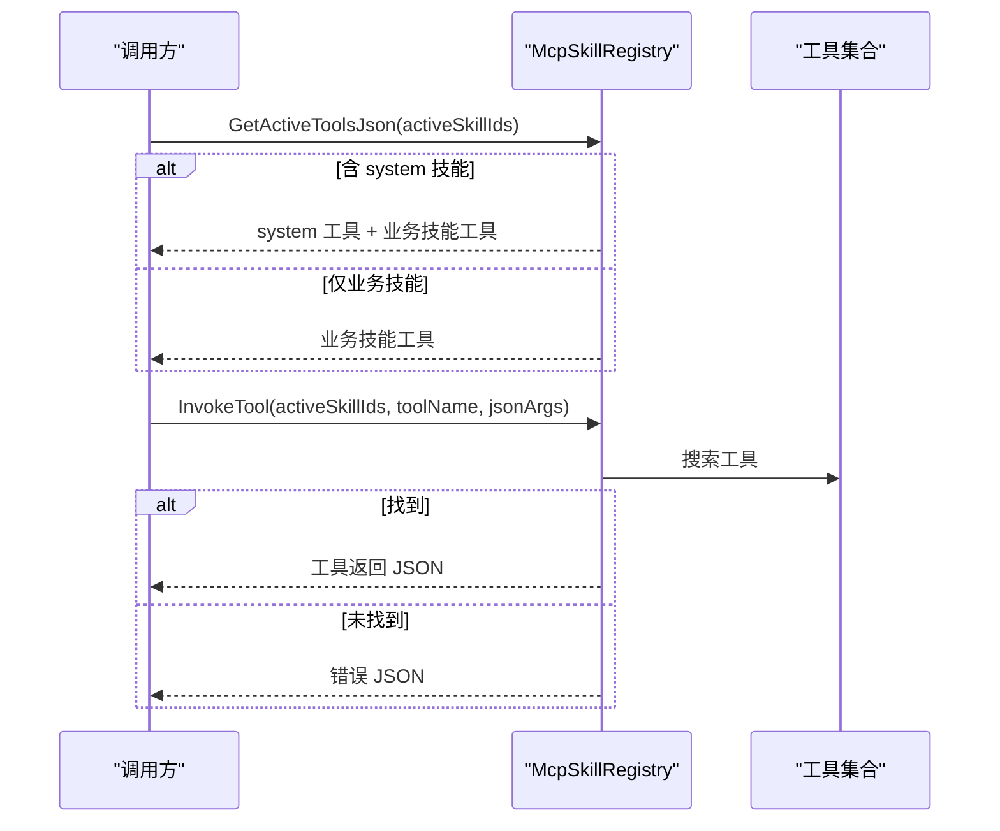
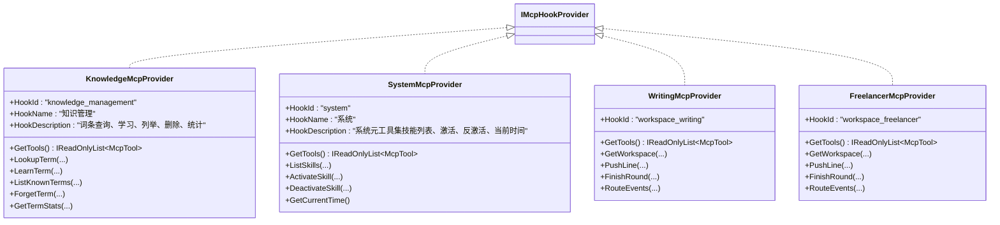
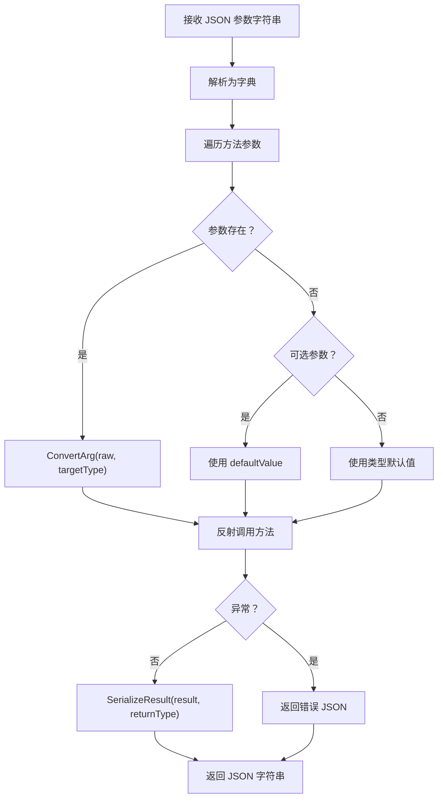
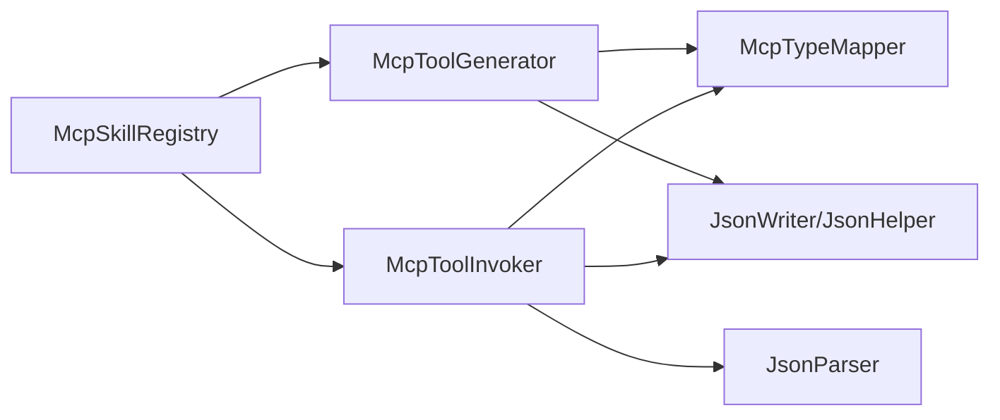

# MCP工具开发

<cite>
**本文引用的文件**
- [IMcpHookProvider.cs](file://src/NPCLife/Framework/Mcp/IMcpHookProvider.cs)
- [McpToolGenerator.cs](file://src/NPCLife/Framework/Mcp/McpToolGenerator.cs)
- [McpSkillRegistry.cs](file://src/NPCLife/Framework/Mcp/McpSkillRegistry.cs)
- [McpTool.cs](file://src/NPCLife/Framework/Mcp/McpTool.cs)
- [McpToolDefinition.cs](file://src/NPCLife/Framework/Mcp/McpToolDefinition.cs)
- [McpToolInvoker.cs](file://src/NPCLife/Framework/Mcp/McpToolInvoker.cs)
- [McpTypeMapper.cs](file://src/NPCLife/Framework/Mcp/McpTypeMapper.cs)
- [McpParamAttribute.cs](file://src/NPCLife/Framework/Mcp/McpParamAttribute.cs)
- [McpToolAttribute.cs](file://src/NPCLife/Framework/Mcp/McpToolAttribute.cs)
- [McpSkillAttribute.cs](file://src/NPCLife/Framework/Mcp/McpSkillAttribute.cs)
- [KnowledgeMcpProvider.cs](file://src/NPCLife/Infrastructure/Mcp/KnowledgeMcpProvider.cs)
- [SystemMcpProvider.cs](file://src/NPCLife/Infrastructure/Mcp/SystemMcpProvider.cs)
- [WritingMcpTools.cs](file://src/NPCLife/Workspace/WritingMcpTools.cs)
- [FreelancerMcpTools.cs](file://src/NPCLife/Workspace/FreelancerMcpTools.cs)
- [McpSkillRegistryTests.cs](file://tests/NPCLife.Tests/Framework/McpSkillRegistryTests.cs)
- [McpToolGeneratorTests.cs](file://tests/NPCLife.Tests/Framework/McpToolGeneratorTests.cs)
</cite>

## 目录
1. [简介](#简介)
2. [项目结构](#项目结构)
3. [核心组件](#核心组件)
4. [架构总览](#架构总览)
5. [详细组件分析](#详细组件分析)
6. [依赖分析](#依赖分析)
7. [性能考虑](#性能考虑)
8. [故障排查指南](#故障排查指南)
9. [结论](#结论)
10. [附录](#附录)

## 简介
本指南面向希望基于MCP（Model Context Protocol）框架开发工具的工程师，系统讲解以下主题：
- IMcpHookProvider接口的实现方法与工具注册机制
- McpToolGenerator的自动生成流程与特性映射
- McpSkillRegistry的使用方法与技能管理策略
- 现有MCP提供者的实现模式（知识MCP提供者、系统MCP提供者）
- MCP工具的参数映射、返回值处理与错误处理机制
- 自定义MCP工具的完整开发流程与测试方法
- 性能优化与并发处理建议

## 项目结构
MCP相关代码集中在Framework/Mcp与Infrastructure/Mcp以及Workspace目录下，采用“接口+注册表+生成器+调用器”的分层设计：
- Framework/Mcp：MCP核心抽象与基础设施（接口、注册表、生成器、调用器、类型映射、特性）
- Infrastructure/Mcp：内置提供者（知识库、系统元工具）
- Workspace：工作空间相关工具（编剧、自由职业者）

图表来源
- [IMcpHookProvider.cs:23-36](file://src/NPCLife/Framework/Mcp/IMcpHookProvider.cs#L23-L36)
- [McpSkillRegistry.cs:22-470](file://src/NPCLife/Framework/Mcp/McpSkillRegistry.cs#L22-L470)
- [McpToolGenerator.cs:12-214](file://src/NPCLife/Framework/Mcp/McpToolGenerator.cs#L12-L214)
- [McpToolInvoker.cs:14-238](file://src/NPCLife/Framework/Mcp/McpToolInvoker.cs#L14-L238)
- [McpTypeMapper.cs:10-85](file://src/NPCLife/Framework/Mcp/McpTypeMapper.cs#L10-L85)
- [KnowledgeMcpProvider.cs:15-40](file://src/NPCLife/Infrastructure/Mcp/KnowledgeMcpProvider.cs#L15-L40)
- [SystemMcpProvider.cs:15-41](file://src/NPCLife/Infrastructure/Mcp/SystemMcpProvider.cs#L15-L41)
- [WritingMcpTools.cs:16-40](file://src/NPCLife/Workspace/WritingMcpTools.cs#L16-L40)
- [FreelancerMcpTools.cs:21-44](file://src/NPCLife/Workspace/FreelancerMcpTools.cs#L21-L44)

章节来源
- [IMcpHookProvider.cs:1-38](file://src/NPCLife/Framework/Mcp/IMcpHookProvider.cs#L1-L38)
- [McpSkillRegistry.cs:1-470](file://src/NPCLife/Framework/Mcp/McpSkillRegistry.cs#L1-L470)
- [McpToolGenerator.cs:1-214](file://src/NPCLife/Framework/Mcp/McpToolGenerator.cs#L1-L214)
- [McpToolInvoker.cs:1-238](file://src/NPCLife/Framework/Mcp/McpToolInvoker.cs#L1-L238)
- [McpTypeMapper.cs:1-85](file://src/NPCLife/Framework/Mcp/McpTypeMapper.cs#L1-L85)
- [KnowledgeMcpProvider.cs:1-355](file://src/NPCLife/Infrastructure/Mcp/KnowledgeMcpProvider.cs#L1-L355)
- [SystemMcpProvider.cs:1-149](file://src/NPCLife/Infrastructure/Mcp/SystemMcpProvider.cs#L1-L149)
- [WritingMcpTools.cs:1-313](file://src/NPCLife/Workspace/WritingMcpTools.cs#L1-L313)
- [FreelancerMcpTools.cs:1-274](file://src/NPCLife/Workspace/FreelancerMcpTools.cs#L1-L274)

## 核心组件
- IMcpHookProvider：MCP钩子提供者接口，定义HookId/HookName/HookDescription与GetTools()，用于将工具自动注册到对应技能下
- McpSkillRegistry：技能注册表，负责技能元数据、工具注册、查询（技能列表、激活工具JSON）、工具调用（含system技能回退）
- McpToolGenerator：工具定义生成器，基于特性与反射生成MCP工具定义（名称、描述、参数schema），并序列化为标准JSON
- McpToolInvoker：工具运行时调用器，负责JSON参数解析、类型转换、方法反射调用与结果序列化
- McpTypeMapper：C#类型到JSON Schema类型的映射器，支持基础类型、枚举、数组/集合、可空类型解包
- McpTool / McpToolDefinition：工具与定义模型，承载Definition与Invoker
- 特性体系：McpToolAttribute、McpParamAttribute、McpSkillAttribute，用于标注工具、参数与技能归属

章节来源
- [IMcpHookProvider.cs:23-36](file://src/NPCLife/Framework/Mcp/IMcpHookProvider.cs#L23-L36)
- [McpSkillRegistry.cs:22-470](file://src/NPCLife/Framework/Mcp/McpSkillRegistry.cs#L22-L470)
- [McpToolGenerator.cs:12-214](file://src/NPCLife/Framework/Mcp/McpToolGenerator.cs#L12-L214)
- [McpToolInvoker.cs:14-238](file://src/NPCLife/Framework/Mcp/McpToolInvoker.cs#L14-L238)
- [McpTypeMapper.cs:10-85](file://src/NPCLife/Framework/Mcp/McpTypeMapper.cs#L10-L85)
- [McpTool.cs:14-39](file://src/NPCLife/Framework/Mcp/McpTool.cs#L14-L39)
- [McpToolDefinition.cs:5-50](file://src/NPCLife/Framework/Mcp/McpToolDefinition.cs#L5-L50)
- [McpToolAttribute.cs:8-18](file://src/NPCLife/Framework/Mcp/McpToolAttribute.cs#L8-L18)
- [McpParamAttribute.cs:8-34](file://src/NPCLife/Framework/Mcp/McpParamAttribute.cs#L8-L34)
- [McpSkillAttribute.cs:10-22](file://src/NPCLife/Framework/Mcp/McpSkillAttribute.cs#L10-L22)

## 架构总览
MCP工具开发遵循“声明式定义 + 反射生成 + 注册表管理 + 调用器执行”的闭环：
- 开发者通过特性声明工具方法，McpToolGenerator基于特性与反射生成工具定义
- 通过McpSkillRegistry注册工具到技能，或通过IMcpHookProvider统一注册
- 调用阶段由McpSkillRegistry根据激活技能范围定位工具，委托McpToolInvoker执行
- 返回值统一序列化为JSON，错误通过ErrorHandler报告并返回标准化错误

图表来源
- [IMcpHookProvider.cs:14-21](file://src/NPCLife/Framework/Mcp/IMcpHookProvider.cs#L14-L21)
- [McpSkillRegistry.cs:154-175](file://src/NPCLife/Framework/Mcp/McpSkillRegistry.cs#L154-L175)
- [McpSkillRegistry.cs:249-287](file://src/NPCLife/Framework/Mcp/McpSkillRegistry.cs#L249-L287)
- [McpSkillRegistry.cs:361-437](file://src/NPCLife/Framework/Mcp/McpSkillRegistry.cs#L361-L437)
- [McpToolInvoker.cs:24-72](file://src/NPCLife/Framework/Mcp/McpToolInvoker.cs#L24-L72)

## 详细组件分析

### IMcpHookProvider接口与工具注册机制
- 接口职责：提供HookId/HookName/HookDescription与GetTools()，将工具自动注册到对应技能
- 注册流程：McpSkillRegistry.RegisterFromProvider(provider)会确保技能元数据存在，并将provider.GetTools()注册到该技能
- 适用场景：知识管理、系统元工具、工作空间工具等

图表来源
- [IMcpHookProvider.cs:23-36](file://src/NPCLife/Framework/Mcp/IMcpHookProvider.cs#L23-L36)
- [McpSkillRegistry.cs:154-175](file://src/NPCLife/Framework/Mcp/McpSkillRegistry.cs#L154-L175)
- [McpTool.cs:28-37](file://src/NPCLife/Framework/Mcp/McpTool.cs#L28-L37)

章节来源
- [IMcpHookProvider.cs:14-21](file://src/NPCLife/Framework/Mcp/IMcpHookProvider.cs#L14-L21)
- [McpSkillRegistry.cs:154-175](file://src/NPCLife/Framework/Mcp/McpSkillRegistry.cs#L154-L175)

### McpToolGenerator自动生成流程
- 从MethodInfo生成McpToolDefinition：读取[McpTool]/[McpParam]特性，缺失时从方法签名推导
- required逻辑：显式设[McpParam(Required=...)]优先，否则从C#默认值自动推断
- 序列化为标准MCP JSON：包含type="function"字段，parameters来自InputSchema
- 支持批量扫描类型中的[McpTool]方法，生成JSON数组

图表来源
- [McpToolGenerator.cs:19-78](file://src/NPCLife/Framework/Mcp/McpToolGenerator.cs#L19-L78)
- [McpToolGenerator.cs:84-102](file://src/NPCLife/Framework/Mcp/McpToolGenerator.cs#L84-L102)
- [McpToolGenerator.cs:126-146](file://src/NPCLife/Framework/Mcp/McpToolGenerator.cs#L126-L146)

章节来源
- [McpToolGenerator.cs:19-102](file://src/NPCLife/Framework/Mcp/McpToolGenerator.cs#L19-L102)
- [McpToolGenerator.cs:126-146](file://src/NPCLife/Framework/Mcp/McpToolGenerator.cs#L126-L146)

### McpSkillRegistry使用与技能管理
- 初始化：InitializeDefaults()注册默认业务技能元数据
- 注册工具：RegisterFromType()扫描类型中带[McpTool]的方法；RegisterFromProvider()从提供者注册
- 查询：GetSkillListJson()返回技能列表（含激活状态）；GetActiveToolsJson()返回激活工具定义JSON
- 调用：InvokeTool()先在激活技能中搜索，未找到则回退到system技能
- 结果构造：MakeActivateResult()/MakeDeactivateResult()/MakeError()生成标准化响应

图表来源
- [McpSkillRegistry.cs:249-287](file://src/NPCLife/Framework/Mcp/McpSkillRegistry.cs#L249-L287)
- [McpSkillRegistry.cs:361-437](file://src/NPCLife/Framework/Mcp/McpSkillRegistry.cs#L361-L437)

章节来源
- [McpSkillRegistry.cs:52-76](file://src/NPCLife/Framework/Mcp/McpSkillRegistry.cs#L52-L76)
- [McpSkillRegistry.cs:124-147](file://src/NPCLife/Framework/Mcp/McpSkillRegistry.cs#L124-L147)
- [McpSkillRegistry.cs:185-242](file://src/NPCLife/Framework/Mcp/McpSkillRegistry.cs#L185-L242)
- [McpSkillRegistry.cs:292-312](file://src/NPCLife/Framework/Mcp/McpSkillRegistry.cs#L292-L312)
- [McpSkillRegistry.cs:444-467](file://src/NPCLife/Framework/Mcp/McpSkillRegistry.cs#L444-L467)

### 现有MCP提供者实现模式
- 知识MCP提供者（KnowledgeMcpProvider）：实现IMcpHookProvider，提供词条查询、学习、列举、删除、统计等工具
- 系统MCP提供者（SystemMcpProvider）：实现IMcpHookProvider，提供list_skills/activate_skill/deactivate_skill/get_current_time等系统元工具
- 工作空间工具（WritingMcpTools/FreelancerMcpTools）：通过IMcpHookProvider注入依赖，提供查询、推送台词、结束轮次、事件路由等

图表来源
- [KnowledgeMcpProvider.cs:15-40](file://src/NPCLife/Infrastructure/Mcp/KnowledgeMcpProvider.cs#L15-L40)
- [SystemMcpProvider.cs:15-41](file://src/NPCLife/Infrastructure/Mcp/SystemMcpProvider.cs#L15-L41)
- [WritingMcpTools.cs:16-40](file://src/NPCLife/Workspace/WritingMcpTools.cs#L16-L40)
- [FreelancerMcpTools.cs:21-44](file://src/NPCLife/Workspace/FreelancerMcpTools.cs#L21-L44)

章节来源
- [KnowledgeMcpProvider.cs:15-355](file://src/NPCLife/Infrastructure/Mcp/KnowledgeMcpProvider.cs#L15-L355)
- [SystemMcpProvider.cs:15-149](file://src/NPCLife/Infrastructure/Mcp/SystemMcpProvider.cs#L15-L149)
- [WritingMcpTools.cs:16-313](file://src/NPCLife/Workspace/WritingMcpTools.cs#L16-L313)
- [FreelancerMcpTools.cs:21-274](file://src/NPCLife/Workspace/FreelancerMcpTools.cs#L21-L274)

### 参数映射、返回值处理与错误处理
- 参数映射：McpToolInvoker根据[McpParam]特性进行参数名/描述/必填映射；McpTypeMapper将C#类型映射为JSON Schema类型
- 必填判断：显式Required=True/False优先，否则依据C#默认值推断
- 类型转换：支持string/bool/integral/float/double/decimal/enum/array/list等；转换失败回退默认值
- 返回值序列化：基础类型直接序列化，枚举转字符串，集合转JSON数组，复杂对象转字符串
- 错误处理：TargetInvocationException解包，统一返回{"error": "..."}；注册表调用异常通过ErrorHandler报告

图表来源
- [McpToolInvoker.cs:24-72](file://src/NPCLife/Framework/Mcp/McpToolInvoker.cs#L24-L72)
- [McpToolInvoker.cs:87-132](file://src/NPCLife/Framework/Mcp/McpToolInvoker.cs#L87-L132)
- [McpToolInvoker.cs:177-226](file://src/NPCLife/Framework/Mcp/McpToolInvoker.cs#L177-L226)
- [McpTypeMapper.cs:16-43](file://src/NPCLife/Framework/Mcp/McpTypeMapper.cs#L16-L43)

章节来源
- [McpToolInvoker.cs:24-72](file://src/NPCLife/Framework/Mcp/McpToolInvoker.cs#L24-L72)
- [McpToolInvoker.cs:87-132](file://src/NPCLife/Framework/Mcp/McpToolInvoker.cs#L87-L132)
- [McpToolInvoker.cs:177-226](file://src/NPCLife/Framework/Mcp/McpToolInvoker.cs#L177-L226)
- [McpTypeMapper.cs:16-43](file://src/NPCLife/Framework/Mcp/McpTypeMapper.cs#L16-L43)

### 自定义MCP工具开发流程与测试方法
- 开发流程
  1) 定义工具方法并添加[McpTool]特性，必要时为参数添加[McpParam]特性
  2) 选择注册方式：手工注册到技能或实现IMcpHookProvider统一注册
  3) 通过McpToolGenerator.GenerateDefinition或RegisterFromType完成注册
  4) 使用McpSkillRegistry.GetActiveToolsJson/GetSkillListJson验证工具定义
  5) 使用McpSkillRegistry.InvokeTool进行端到端调用验证
- 测试方法
  - 使用McpSkillRegistryTests验证注册、查询、调用路径
  - 使用McpToolGeneratorTests验证生成器与调用器行为

章节来源
- [McpSkillRegistryTests.cs:43-49](file://tests/NPCLife.Tests/Framework/McpSkillRegistryTests.cs#L43-L49)
- [McpSkillRegistryTests.cs:82-96](file://tests/NPCLife.Tests/Framework/McpSkillRegistryTests.cs#L82-L96)
- [McpSkillRegistryTests.cs:102-146](file://tests/NPCLife.Tests/Framework/McpSkillRegistryTests.cs#L102-L146)
- [McpSkillRegistryTests.cs:152-181](file://tests/NPCLife.Tests/Framework/McpSkillRegistryTests.cs#L152-L181)
- [McpSkillRegistryTests.cs:207-244](file://tests/NPCLife.Tests/Framework/McpSkillRegistryTests.cs#L207-L244)
- [McpToolGeneratorTests.cs:62-107](file://tests/NPCLife.Tests/Framework/McpToolGeneratorTests.cs#L62-L107)
- [McpToolGeneratorTests.cs:113-136](file://tests/NPCLife.Tests/Framework/McpToolGeneratorTests.cs#L113-L136)
- [McpToolGeneratorTests.cs:142-150](file://tests/NPCLife.Tests/Framework/McpToolGeneratorTests.cs#L142-L150)
- [McpToolGeneratorTests.cs:156-192](file://tests/NPCLife.Tests/Framework/McpToolGeneratorTests.cs#L156-L192)

## 依赖分析
- 组件耦合
  - McpSkillRegistry对McpToolGenerator/McpToolInvoker存在使用依赖，但无外部依赖
  - McpToolGenerator依赖McpTypeMapper与JsonWriter/JsonHelper
  - McpToolInvoker依赖JsonParser/JsonHelper与McpTypeMapper
- 外部集成点
  - 系统提供者依赖WorkspaceManager/ILogger/timeProvider
  - 知识提供者依赖IKnowledgeService/ILogger
- 并发与锁
  - 注册表使用内部锁保证线程安全

图表来源
- [McpSkillRegistry.cs:249-287](file://src/NPCLife/Framework/Mcp/McpSkillRegistry.cs#L249-L287)
- [McpToolGenerator.cs:84-102](file://src/NPCLife/Framework/Mcp/McpToolGenerator.cs#L84-L102)
- [McpToolInvoker.cs:24-72](file://src/NPCLife/Framework/Mcp/McpToolInvoker.cs#L24-L72)

章节来源
- [McpSkillRegistry.cs:373-437](file://src/NPCLife/Framework/Mcp/McpSkillRegistry.cs#L373-L437)
- [McpToolGenerator.cs:84-102](file://src/NPCLife/Framework/Mcp/McpToolGenerator.cs#L84-L102)
- [McpToolInvoker.cs:24-72](file://src/NPCLife/Framework/Mcp/McpToolInvoker.cs#L24-L72)

## 性能考虑
- 反射成本控制
  - 工具定义生成与注册尽量在应用启动阶段完成，避免运行时重复反射
  - 使用McpTool.FromMethod缓存Invoker委托，减少反射调用次数
- JSON序列化
  - 使用StringBuilder与预分配容量减少内存分配
  - 对常用工具定义进行缓存（如GetActiveToolsJson）
- 并发处理
  - 注册表内部使用锁保护，避免竞态；调用阶段按需加锁
  - 工具方法本身应保持无副作用，便于并行调用
- 类型转换与序列化
  - 对基础类型与集合进行快速路径处理，避免不必要的装箱/拆箱
  - 枚举与数组/集合的序列化采用高效拼接策略

## 故障排查指南
- 工具未出现在工具列表
  - 检查是否正确添加[McpTool]特性，或是否通过IMcpHookProvider注册
  - 确认技能ID与激活状态一致
- 参数缺失导致默认值问题
  - 使用[McpParam(Required=False)]明确可选参数
  - 检查类型转换逻辑，必要时提供默认值
- 调用返回错误
  - 查看ErrorHandler日志，定位异常堆栈
  - 确认工具名称大小写与Definition.Name一致
- 系统工具不可用
  - system技能始终可用，检查调用范围是否包含system

章节来源
- [McpSkillRegistry.cs:361-437](file://src/NPCLife/Framework/Mcp/McpSkillRegistry.cs#L361-L437)
- [McpToolInvoker.cs:62-71](file://src/NPCLife/Framework/Mcp/McpToolInvoker.cs#L62-L71)

## 结论
本指南提供了MCP工具开发的完整方法论：以IMcpHookProvider为入口，结合McpSkillRegistry与McpToolGenerator实现声明式工具定义与注册，借助McpToolInvoker完成类型安全的参数映射与返回值序列化。通过现有知识与系统提供者的实现模式，开发者可以快速扩展自定义工具，并在测试驱动下保证质量与性能。

## 附录
- 常用特性
  - [McpToolAttribute]：工具方法标注，覆盖名称与描述
  - [McpParamAttribute]：参数标注，覆盖名称、描述与必填状态
  - [McpSkillAttribute]：方法/类标注，指定技能ID
- 常用工具
  - [McpToolGenerator.SerializeAllActiveTools]：获取激活技能的工具定义JSON
  - [McpToolGenerator.SerializeSkillList]：获取技能列表JSON
  - [McpSkillRegistry.GetActiveToolsJson]：获取激活工具定义
  - [McpSkillRegistry.GetSkillListJson]：获取技能列表（含激活状态）
  - [McpSkillRegistry.InvokeTool]：调用工具（含system回退）