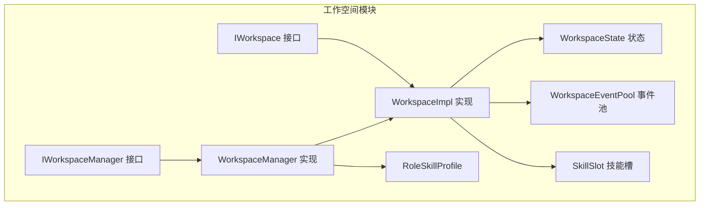
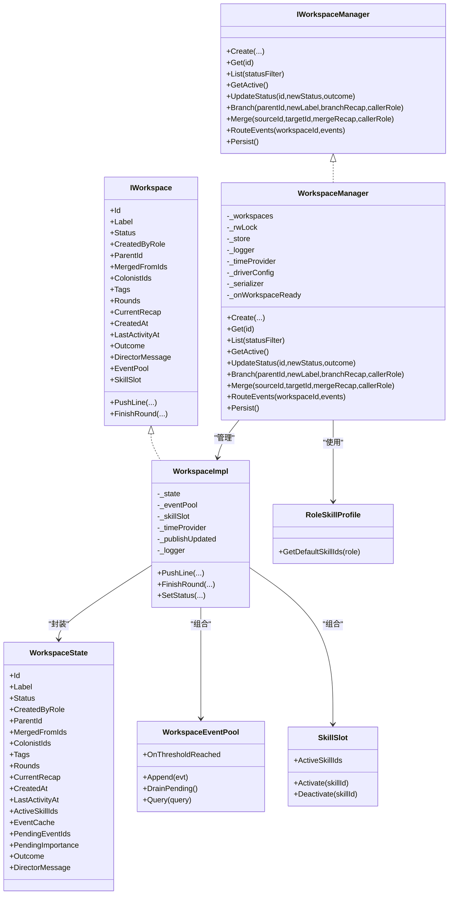
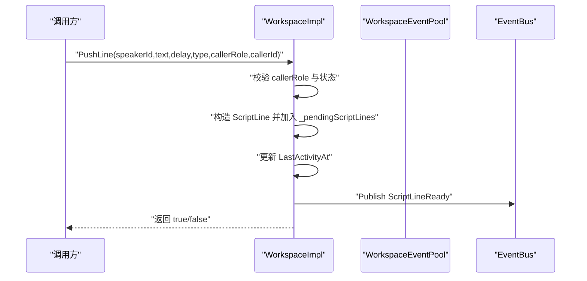
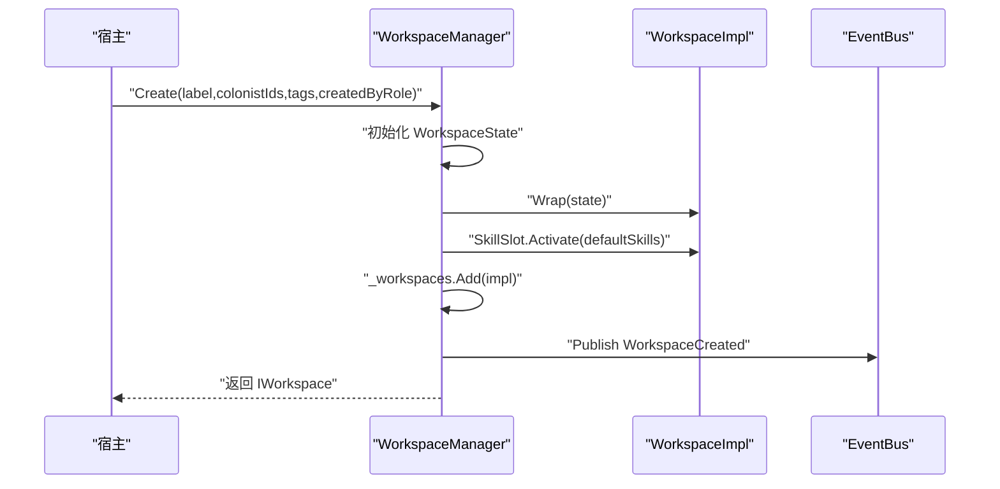
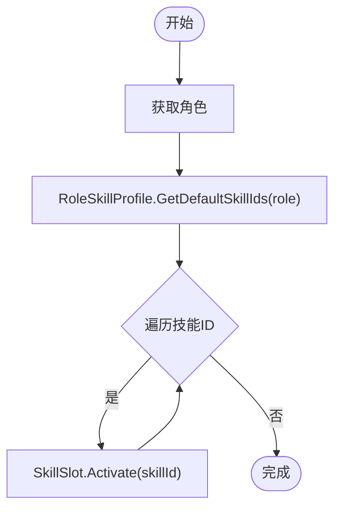
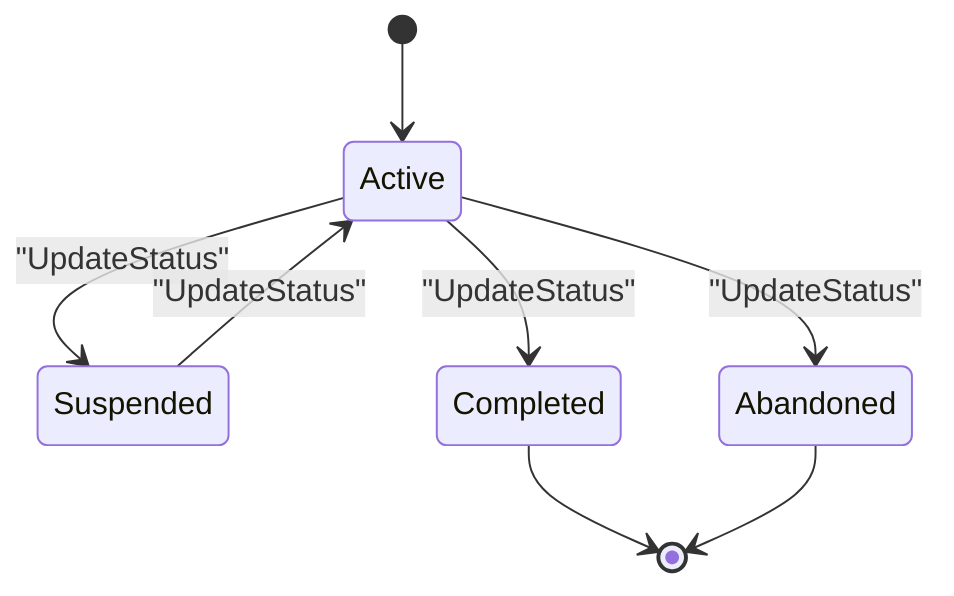
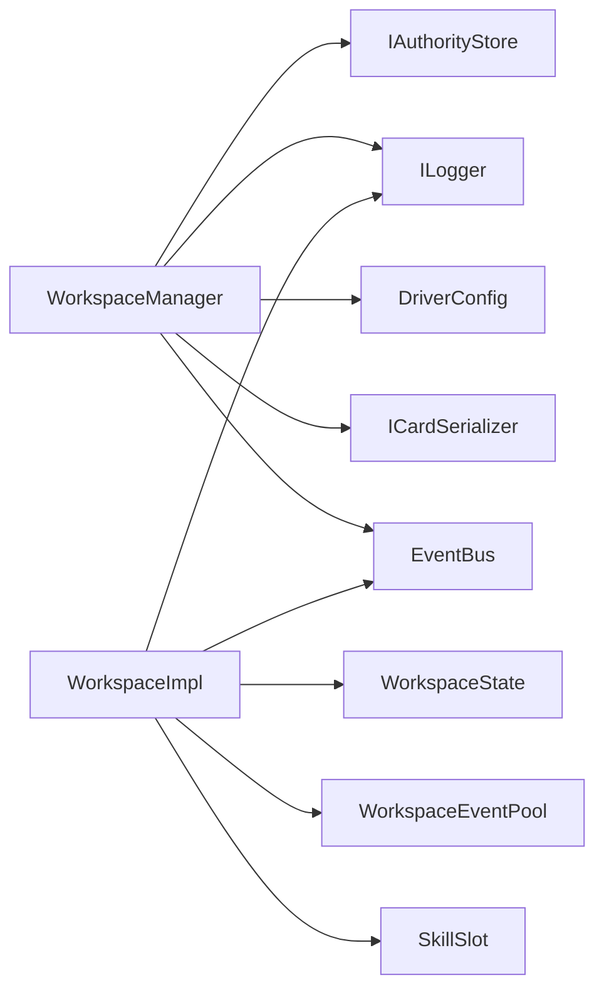

# 工作空间扩展

<cite>
**本文引用的文件**
- [IWorkspace.cs](file://src/NPCLife/Workspace/IWorkspace.cs)
- [WorkspaceImpl.cs](file://src/NPCLife/Workspace/WorkspaceImpl.cs)
- [IWorkspaceManager.cs](file://src/NPCLife/Core/IWorkspaceManager.cs)
- [WorkspaceManager.cs](file://src/NPCLife/Workspace/WorkspaceManager.cs)
- [RoleSkillProfile.cs](file://src/NPCLife/Workspace/RoleSkillProfile.cs)
- [SkillSlot.cs](file://src/NPCLife/Workspace/SkillSlot.cs)
- [WorkspaceState.cs](file://src/NPCLife/Workspace/WorkspaceState.cs)
- [WorkspaceEventPool.cs](file://src/NPCLife/Workspace/WorkspaceEventPool.cs)
- [README.md](file://README.md)
- [WorkspaceEventPoolTests.cs](file://tests/NPCLife.Tests/Driver/WorkspaceEventPoolTests.cs)
</cite>

## 目录
1. [简介](#简介)
2. [项目结构](#项目结构)
3. [核心组件](#核心组件)
4. [架构总览](#架构总览)
5. [详细组件分析](#详细组件分析)
6. [依赖分析](#依赖分析)
7. [性能考虑](#性能考虑)
8. [故障排查指南](#故障排查指南)
9. [结论](#结论)
10. [附录](#附录)

## 简介
本指南面向希望扩展“工作空间（Workspace）”功能的开发者，围绕 IWorkspace 接口设计、WorkspaceImpl 的继承与重写策略、WorkspaceManager 的扩展点与自定义工作空间创建流程展开。同时提供角色技能配置文件的自定义方法、技能槽位扩展机制、生命周期管理与状态同步策略、集成与配置选项、性能与资源影响分析以及测试与调试技巧。

## 项目结构
工作空间相关代码位于 src/NPCLife/Workspace 目录，核心接口与实现如下：
- IWorkspace：对外门面接口，暴露元数据、内部组件与叙事操作
- WorkspaceImpl：IWorkspace 的内部实现，封装 WorkspaceState、事件池与技能槽
- IWorkspaceManager：工作空间管理器接口，负责 CRUD、分支/合并、事件路由与持久化
- WorkspaceManager：IWorkspaceManager 的具体实现，负责工作空间生命周期与状态同步
- RoleSkillProfile：角色默认技能配置
- SkillSlot：工作空间内部技能槽，封装激活/停用逻辑
- WorkspaceState：工作空间状态数据模型
- WorkspaceEventPool：工作空间内部事件池，实现 IEventLog

图表来源
- [IWorkspace.cs:11-51](file://src/NPCLife/Workspace/IWorkspace.cs#L11-L51)
- [WorkspaceImpl.cs:16-197](file://src/NPCLife/Workspace/WorkspaceImpl.cs#L16-L197)
- [IWorkspaceManager.cs:14-58](file://src/NPCLife/Core/IWorkspaceManager.cs#L14-L58)
- [WorkspaceManager.cs:19-616](file://src/NPCLife/Workspace/WorkspaceManager.cs#L19-L616)
- [RoleSkillProfile.cs:13-74](file://src/NPCLife/Workspace/RoleSkillProfile.cs#L13-L74)
- [SkillSlot.cs:11-61](file://src/NPCLife/Workspace/SkillSlot.cs#L11-L61)
- [WorkspaceState.cs:94-152](file://src/NPCLife/Workspace/WorkspaceState.cs#L94-L152)
- [WorkspaceEventPool.cs:21-186](file://src/NPCLife/Workspace/WorkspaceEventPool.cs#L21-L186)

章节来源
- [README.md:1-93](file://README.md#L1-L93)
- [WorkspaceManager.cs:19-616](file://src/NPCLife/Workspace/WorkspaceManager.cs#L19-L616)

## 核心组件
- IWorkspace：定义工作空间对外只读元数据、内部组件（事件池、技能槽）与叙事操作（推送台词、结束轮次）
- WorkspaceImpl：内部实现类，持有 WorkspaceState，组合事件池与技能槽，负责操作校验与事件发布
- IWorkspaceManager：定义工作空间管理器的 CRUD、分支/合并、事件路由与持久化接口
- WorkspaceManager：具体实现，负责工作空间创建、状态变更、分支/合并、事件路由、持久化与状态同步
- RoleSkillProfile：按角色提供默认技能集
- SkillSlot：封装技能激活/停用与工具集变更通知
- WorkspaceState：工作空间状态数据模型，包含轮次、标签、角色、技能、事件缓存等
- WorkspaceEventPool：实现 IEventLog 的事件池，支持阈值触发与最近历史缓冲

章节来源
- [IWorkspace.cs:11-51](file://src/NPCLife/Workspace/IWorkspace.cs#L11-L51)
- [WorkspaceImpl.cs:16-197](file://src/NPCLife/Workspace/WorkspaceImpl.cs#L16-L197)
- [IWorkspaceManager.cs:14-58](file://src/NPCLife/Core/IWorkspaceManager.cs#L14-L58)
- [WorkspaceManager.cs:19-616](file://src/NPCLife/Workspace/WorkspaceManager.cs#L19-L616)
- [RoleSkillProfile.cs:13-74](file://src/NPCLife/Workspace/RoleSkillProfile.cs#L13-L74)
- [SkillSlot.cs:11-61](file://src/NPCLife/Workspace/SkillSlot.cs#L11-L61)
- [WorkspaceState.cs:94-152](file://src/NPCLife/Workspace/WorkspaceState.cs#L94-L152)
- [WorkspaceEventPool.cs:21-186](file://src/NPCLife/Workspace/WorkspaceEventPool.cs#L21-L186)

## 架构总览
工作空间体系采用“门面接口 + 内部实现 + 管理器”的分层设计：
- 外部通过 IWorkspace 访问工作空间
- WorkspaceImpl 封装 WorkspaceState，并组合事件池与技能槽
- WorkspaceManager 负责工作空间的创建、状态变更、分支/合并、事件路由与持久化
- RoleSkillProfile 为不同角色提供默认技能集
- SkillSlot 负责技能激活/停用与工具集变更通知
- WorkspaceEventPool 实现 IEventLog，支持阈值触发与最近历史缓冲

图表来源
- [IWorkspace.cs:11-51](file://src/NPCLife/Workspace/IWorkspace.cs#L11-L51)
- [WorkspaceImpl.cs:16-197](file://src/NPCLife/Workspace/WorkspaceImpl.cs#L16-L197)
- [IWorkspaceManager.cs:14-58](file://src/NPCLife/Core/IWorkspaceManager.cs#L14-L58)
- [WorkspaceManager.cs:19-616](file://src/NPCLife/Workspace/WorkspaceManager.cs#L19-L616)
- [RoleSkillProfile.cs:13-74](file://src/NPCLife/Workspace/RoleSkillProfile.cs#L13-L74)
- [SkillSlot.cs:11-61](file://src/NPCLife/Workspace/SkillSlot.cs#L11-L61)
- [WorkspaceState.cs:94-152](file://src/NPCLife/Workspace/WorkspaceState.cs#L94-L152)
- [WorkspaceEventPool.cs:21-186](file://src/NPCLife/Workspace/WorkspaceEventPool.cs#L21-L186)

## 详细组件分析

### IWorkspace 接口设计与扩展方法
- 设计理念
  - 作为对外门面，元数据只读，状态变更由 IWorkspaceManager 控制
  - 内部组件（事件池、技能槽）通过只读属性暴露，便于外部安全访问
  - 叙事操作（推送台词、结束轮次）集中定义，便于统一校验与事件发布
- 扩展建议
  - 新增只读元数据：在 WorkspaceState 中添加字段，在 WorkspaceImpl 的只读属性代理中返回
  - 新增内部组件：在 WorkspaceImpl 中新增组合对象并在 IWorkspace 中暴露只读属性
  - 新增叙事操作：在 IWorkspace 中声明方法签名，在 WorkspaceImpl 中实现并发布相应事件

章节来源
- [IWorkspace.cs:11-51](file://src/NPCLife/Workspace/IWorkspace.cs#L11-L51)
- [WorkspaceImpl.cs:52-123](file://src/NPCLife/Workspace/WorkspaceImpl.cs#L52-L123)

### WorkspaceImpl 的继承与重写策略
- 继承策略
  - WorkspaceImpl 为 internal 类，不直接对外暴露，通过 IWorkspace 返回给外部
  - 如需扩展，建议在外部创建自定义实现类，实现 IWorkspace 并组合 WorkspaceState、事件池与技能槽
- 重写策略
  - 对 PushLine/FinishRound 等操作进行前置校验与后置事件发布
  - 对 SetStatus 进行状态变更与时间戳更新
  - 对内部状态变更（如 ActiveSkillIds）通过回调通知管理器持久化

图表来源
- [WorkspaceImpl.cs:83-123](file://src/NPCLife/Workspace/WorkspaceImpl.cs#L83-L123)

章节来源
- [WorkspaceImpl.cs:16-197](file://src/NPCLife/Workspace/WorkspaceImpl.cs#L16-L197)

### WorkspaceManager 的扩展点与自定义工作空间创建流程
- 扩展点
  - 自定义工作空间创建：在 Create 中扩展 WorkspaceState 的初始化逻辑（如默认标签、角色、技能）
  - 自定义分支/合并：在 Branch/Merge 中扩展规则（如跨角色权限、合并策略）
  - 自定义事件路由：在 RouteEvents 中扩展事件处理逻辑
  - 自定义持久化：在 Persist/LoadFromStore 中扩展序列化/反序列化策略
- 自定义工作空间创建流程
  - 通过 IWorkspaceManager.Create 创建工作空间，设置标签、角色与初始技能
  - 管理器根据角色自动激活默认技能集
  - 管理器发布 WorkspaceCreated 事件，触发 onWorkspaceReady 回调

图表来源
- [WorkspaceManager.cs:91-138](file://src/NPCLife/Workspace/WorkspaceManager.cs#L91-L138)

章节来源
- [IWorkspaceManager.cs:18-31](file://src/NPCLife/Core/IWorkspaceManager.cs#L18-L31)
- [WorkspaceManager.cs:91-138](file://src/NPCLife/Workspace/WorkspaceManager.cs#L91-L138)

### 角色技能配置文件的自定义方法与技能槽位扩展机制
- 角色技能配置
  - RoleSkillProfile 为静态类，提供 GetDefaultSkillIds(role) 返回默认技能 ID 列表
  - 支持 Director、Screenwriter、Freelancer 三类角色，默认技能集不同
- 技能槽位扩展
  - SkillSlot 封装 ActiveSkillIds，提供 Activate/Deactivate 方法
  - Activate/Deactivate 返回 McpSkillRegistry 的结果，支持系统技能保护
  - 通过回调通知管理器状态变更

图表来源
- [RoleSkillProfile.cs:58-71](file://src/NPCLife/Workspace/RoleSkillProfile.cs#L58-L71)
- [SkillSlot.cs:24-58](file://src/NPCLife/Workspace/SkillSlot.cs#L24-L58)

章节来源
- [RoleSkillProfile.cs:13-74](file://src/NPCLife/Workspace/RoleSkillProfile.cs#L13-L74)
- [SkillSlot.cs:11-61](file://src/NPCLife/Workspace/SkillSlot.cs#L11-L61)

### 工作空间生命周期管理与状态同步策略
- 生命周期
  - Active：活跃状态，允许推送台词与结束轮次
  - Suspended：挂起状态，保留数据但暂停操作
  - Completed/Abandoned：完结/废弃状态，不可再变更
- 状态同步
  - 管理器通过 PublishUpdated 与 EventBus.WorkspaceUpdated 通知状态变更
  - 管理器在 UpdateStatus 中校验状态转换合法性
  - 管理器在 Persist 中将所有工作空间状态序列化保存

图表来源
- [WorkspaceManager.cs:165-187](file://src/NPCLife/Workspace/WorkspaceManager.cs#L165-L187)
- [WorkspaceState.cs:25-38](file://src/NPCLife/Workspace/WorkspaceState.cs#L25-L38)

章节来源
- [WorkspaceManager.cs:165-187](file://src/NPCLife/Workspace/WorkspaceManager.cs#L165-L187)
- [WorkspaceState.cs:25-38](file://src/NPCLife/Workspace/WorkspaceState.cs#L25-L38)

### 自定义工作空间的集成方法与配置选项
- 集成步骤
  - 注入 IWorkspaceManager 实例到宿主应用
  - 通过 IWorkspaceManager.Create 创建工作空间
  - 通过 IWorkspace.PushLine/FinishRound 进行叙事操作
  - 通过 IWorkspaceManager.RouteEvents 路由事件
- 配置选项
  - DriverConfig：阈值配置（数量阈值、重要度阈值）、最近历史容量
  - ICardSerializer：事件序列化/反序列化
  - IAuthorityStore：持久化存储

章节来源
- [README.md:69-87](file://README.md#L69-L87)
- [WorkspaceEventPool.cs:81-90](file://src/NPCLife/Workspace/WorkspaceEventPool.cs#L81-L90)

### 工作空间扩展对系统资源和性能的影响
- 事件池
  - pending 缓冲区持久化，recent 历史仅内存，避免频繁 IO
  - 阈值触发减少 LLM 调用频率，控制 API 成本
- 技能槽
  - 激活/停用技能时更新工具集，可能增加 MCP 工具生成开销
- 状态同步
  - 读写锁保证并发安全，批量持久化降低写放大

章节来源
- [WorkspaceEventPool.cs:14-20](file://src/NPCLife/Workspace/WorkspaceEventPool.cs#L14-L20)
- [WorkspaceManager.cs:50-74](file://src/NPCLife/Workspace/WorkspaceManager.cs#L50-L74)

## 依赖分析
- 组件耦合
  - WorkspaceImpl 依赖 WorkspaceState、WorkspaceEventPool、SkillSlot、Logger、EventBus
  - WorkspaceManager 依赖 IAuthorityStore、ILogger、DriverConfig、ICardSerializer、EventBus
- 外部依赖
  - IAuthorityStore：持久化存储
  - ILogger：日志输出
  - DriverConfig：阈值与容量配置
  - ICardSerializer：事件序列化

图表来源
- [WorkspaceManager.cs:31-40](file://src/NPCLife/Workspace/WorkspaceManager.cs#L31-L40)
- [WorkspaceImpl.cs:25-46](file://src/NPCLife/Workspace/WorkspaceImpl.cs#L25-L46)

章节来源
- [WorkspaceManager.cs:31-40](file://src/NPCLife/Workspace/WorkspaceManager.cs#L31-L40)
- [WorkspaceImpl.cs:25-46](file://src/NPCLife/Workspace/WorkspaceImpl.cs#L25-L46)

## 性能考虑
- 事件阈值触发：通过数量阈值与重要度阈值控制 AI 调用频率，降低 API 成本
- 最近历史缓冲：限制 recent 历史容量，避免内存膨胀
- 批量持久化：读锁保护下批量序列化，减少写放大
- 并发控制：读写锁保证高并发下的状态一致性

章节来源
- [WorkspaceEventPool.cs:61-74](file://src/NPCLife/Workspace/WorkspaceEventPool.cs#L61-L74)
- [WorkspaceManager.cs:52-74](file://src/NPCLife/Workspace/WorkspaceManager.cs#L52-L74)

## 故障排查指南
- 操作权限问题
  - PushLine/FinishRound 仅允许 Screenwriter/Freelancer 调用，否则返回失败并记录警告
- 状态问题
  - 非 Active 状态下调用叙事操作将被拒绝
  - UpdateStatus 验证状态转换合法性，非法转换记录警告
- 事件池问题
  - 阈值触发通过 OnThresholdReached 事件通知，确保订阅者正确处理
  - DrainPending 清空 pending 并重置重要度，避免重复触发

章节来源
- [WorkspaceImpl.cs:88-98](file://src/NPCLife/Workspace/WorkspaceImpl.cs#L88-L98)
- [WorkspaceImpl.cs:128-138](file://src/NPCLife/Workspace/WorkspaceImpl.cs#L128-L138)
- [WorkspaceManager.cs:170-174](file://src/NPCLife/Workspace/WorkspaceManager.cs#L170-L174)
- [WorkspaceEventPoolTests.cs:138-197](file://tests/NPCLife.Tests/Driver/WorkspaceEventPoolTests.cs#L138-L197)

## 结论
工作空间扩展以 IWorkspace 为门面、WorkspaceImpl 为核心实现、WorkspaceManager 为管理中枢，辅以 RoleSkillProfile 与 SkillSlot 的技能体系，以及 WorkspaceEventPool 的事件阈值触发机制。通过合理的扩展点与配置选项，开发者可以在不破坏框架契约的前提下，灵活定制工作空间的行为与生命周期管理。

## 附录
- 测试参考
  - WorkspaceEventPoolTests：覆盖事件池初始化、Append、Drain、阈值回调与多工作空间隔离
- 集成要点
  - 提供 IAuthorityStore、ILogger、ILlmService、时间提供者与 DriverConfig
  - 注入自定义 MCP 工具以增强叙事能力

章节来源
- [WorkspaceEventPoolTests.cs:17-352](file://tests/NPCLife.Tests/Driver/WorkspaceEventPoolTests.cs#L17-L352)
- [README.md:69-87](file://README.md#L69-L87)