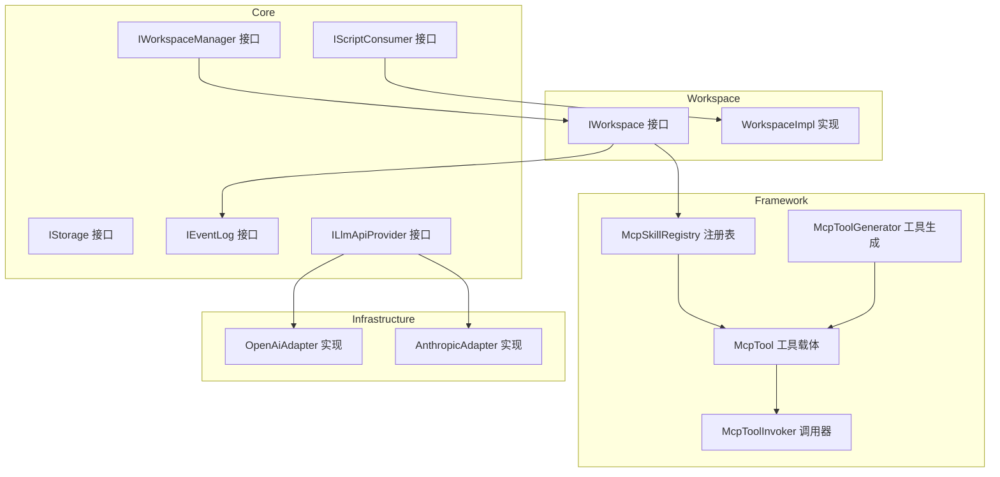
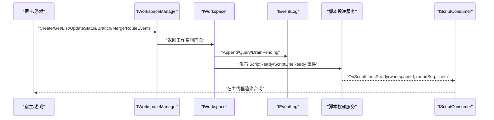
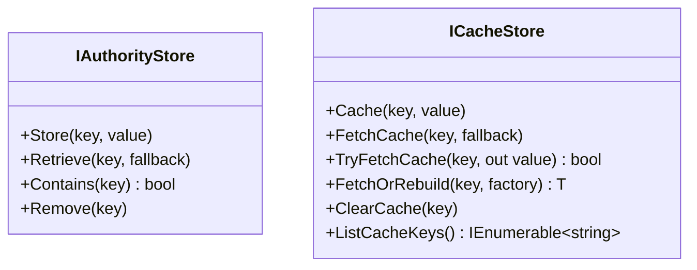
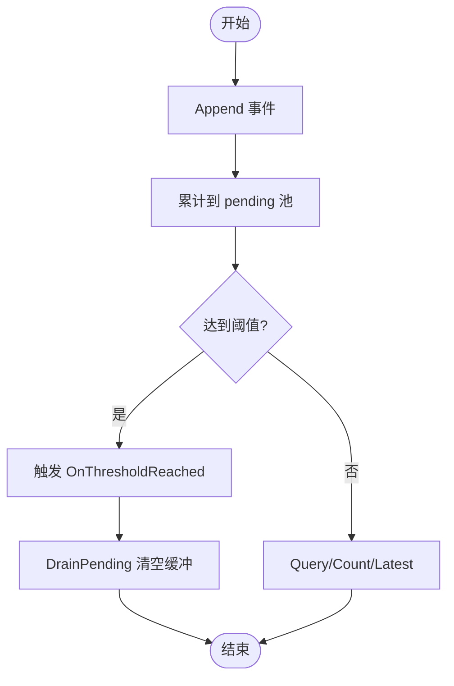
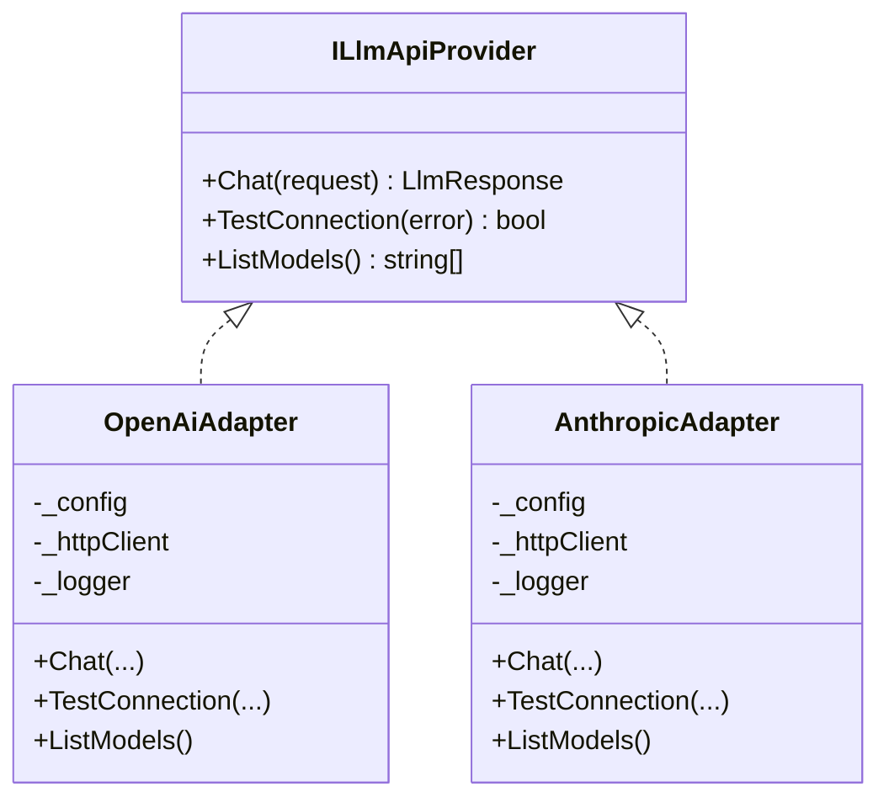
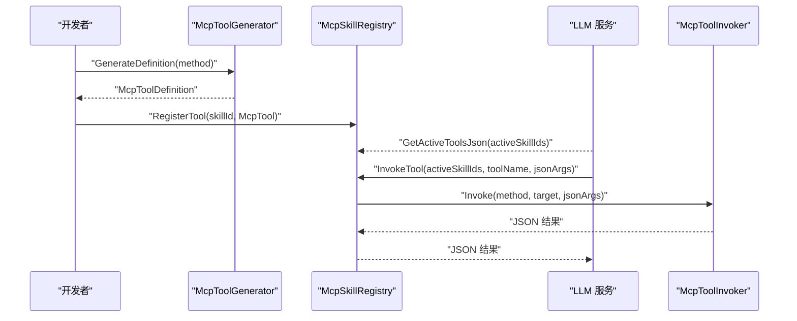
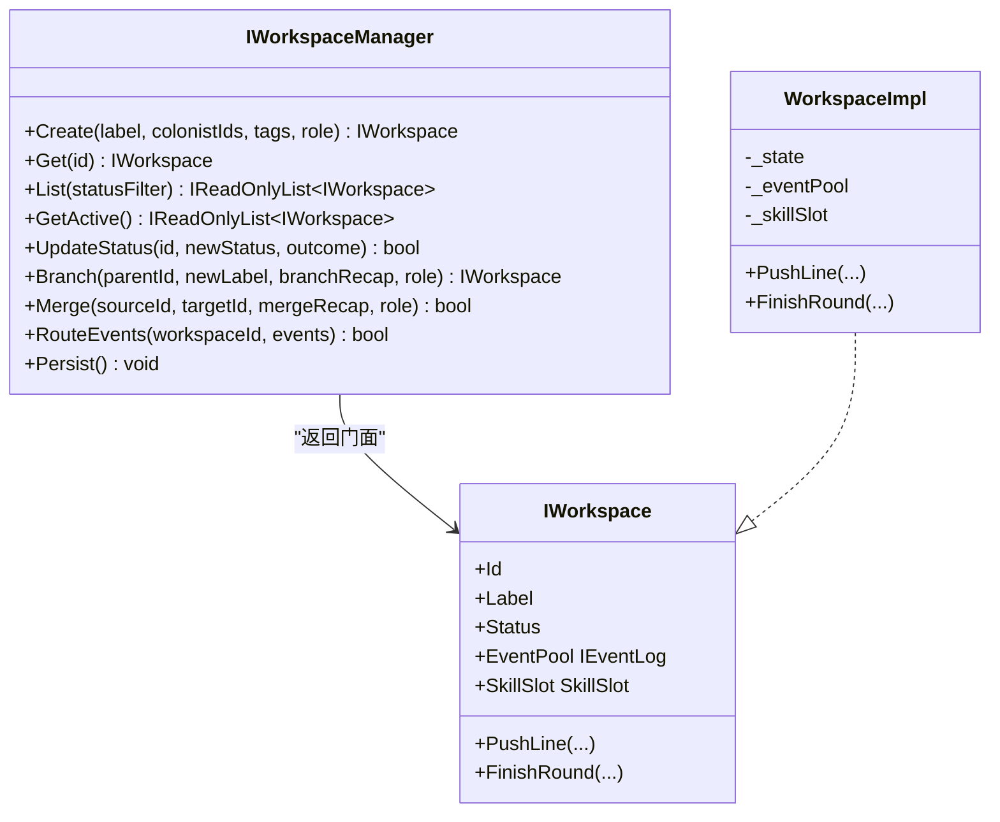
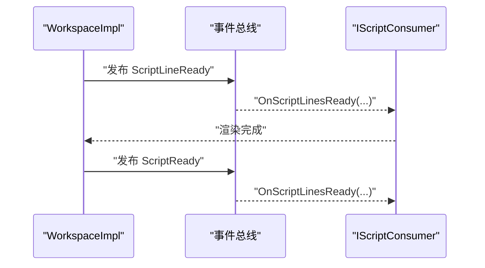
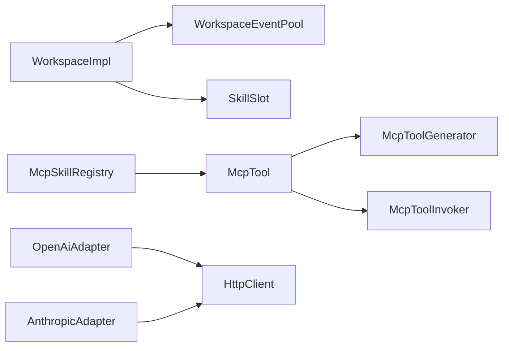

# 扩展与定制

<cite>
**本文引用的文件**
- [IStorage.cs](file://src/NPCLife/Core/IStorage.cs)
- [IEventLog.cs](file://src/NPCLife/Core/IEventLog.cs)
- [ILlmApiProvider.cs](file://src/NPCLife/Core/ILlmApiProvider.cs)
- [IScriptConsumer.cs](file://src/NPCLife/Core/IScriptConsumer.cs)
- [IWorkspaceManager.cs](file://src/NPCLife/Core/IWorkspaceManager.cs)
- [IWorkspace.cs](file://src/NPCLife/Workspace/IWorkspace.cs)
- [WorkspaceImpl.cs](file://src/NPCLife/Workspace/WorkspaceImpl.cs)
- [McpTool.cs](file://src/NPCLife/Framework/Mcp/McpTool.cs)
- [McpToolGenerator.cs](file://src/NPCLife/Framework/Mcp/McpToolGenerator.cs)
- [McpToolInvoker.cs](file://src/NPCLife/Framework/Mcp/McpToolInvoker.cs)
- [McpSkillRegistry.cs](file://src/NPCLife/Framework/Mcp/McpSkillRegistry.cs)
- [McpToolAttribute.cs](file://src/NPCLife/Framework/Mcp/McpToolAttribute.cs)
- [McpParamAttribute.cs](file://src/NPCLife/Framework/Mcp/McpParamAttribute.cs)
- [OpenAiAdapter.cs](file://src/NPCLife/Infrastructure/Llm/OpenAiAdapter.cs)
- [AnthropicAdapter.cs](file://src/NPCLife/Infrastructure/Llm/AnthropicAdapter.cs)
</cite>

## 目录
1. [引言](#引言)
2. [项目结构](#项目结构)
3. [核心组件](#核心组件)
4. [架构总览](#架构总览)
5. [详细组件分析](#详细组件分析)
6. [依赖分析](#依赖分析)
7. [性能考虑](#性能考虑)
8. [故障排查指南](#故障排查指南)
9. [结论](#结论)
10. [附录](#附录)

## 引言
本指南面向希望在 NPCLife 框架之上进行扩展与定制的开发者，涵盖以下主题：
- 框架的扩展点与插件机制
- 自定义适配器开发（存储、日志、LLM）
- 自定义 MCP 工具的实现与注册流程
- 自定义工作空间的开发与集成
- 脚本消费器的扩展机制与使用场景
- 扩展开发最佳实践与设计模式
- 扩展对系统性能与稳定性的影响评估

## 项目结构
NPCLife 采用清晰的分层与职责分离设计：
- Core 层：定义领域接口与核心抽象（存储、事件日志、LLM、脚本消费器、工作空间管理等）
- Framework 层：提供通用基础设施（MCP 工具体系、事件总线、JSON 工具、指标拦截器等）
- Infrastructure 层：具体实现（LLM 适配器、知识库、交互历史存储、脚本投递服务等）
- Workspace 层：工作空间的门面与实现，封装事件池、技能槽、叙事操作
- Driver/Prompts 等：驱动层与提示词模板

图表来源
- [IStorage.cs:1-53](file://src/NPCLife/Core/IStorage.cs#L1-L53)
- [IEventLog.cs:1-52](file://src/NPCLife/Core/IEventLog.cs#L1-L52)
- [ILlmApiProvider.cs:1-37](file://src/NPCLife/Core/ILlmApiProvider.cs#L1-L37)
- [IScriptConsumer.cs:1-23](file://src/NPCLife/Core/IScriptConsumer.cs#L1-L23)
- [IWorkspaceManager.cs:1-58](file://src/NPCLife/Core/IWorkspaceManager.cs#L1-L58)
- [IWorkspace.cs:1-51](file://src/NPCLife/Workspace/IWorkspace.cs#L1-L51)
- [WorkspaceImpl.cs:1-197](file://src/NPCLife/Workspace/WorkspaceImpl.cs#L1-L197)
- [McpSkillRegistry.cs:1-470](file://src/NPCLife/Framework/Mcp/McpSkillRegistry.cs#L1-L470)
- [McpTool.cs:1-40](file://src/NPCLife/Framework/Mcp/McpTool.cs#L1-L40)
- [McpToolGenerator.cs:1-214](file://src/NPCLife/Framework/Mcp/McpToolGenerator.cs#L1-L214)
- [McpToolInvoker.cs:1-238](file://src/NPCLife/Framework/Mcp/McpToolInvoker.cs#L1-L238)
- [OpenAiAdapter.cs:1-392](file://src/NPCLife/Infrastructure/Llm/OpenAiAdapter.cs#L1-L392)
- [AnthropicAdapter.cs:1-434](file://src/NPCLife/Infrastructure/Llm/AnthropicAdapter.cs#L1-L434)

章节来源
- [IStorage.cs:1-53](file://src/NPCLife/Core/IStorage.cs#L1-L53)
- [IEventLog.cs:1-52](file://src/NPCLife/Core/IEventLog.cs#L1-L52)
- [ILlmApiProvider.cs:1-37](file://src/NPCLife/Core/ILlmApiProvider.cs#L1-L37)
- [IScriptConsumer.cs:1-23](file://src/NPCLife/Core/IScriptConsumer.cs#L1-L23)
- [IWorkspaceManager.cs:1-58](file://src/NPCLife/Core/IWorkspaceManager.cs#L1-L58)
- [IWorkspace.cs:1-51](file://src/NPCLife/Workspace/IWorkspace.cs#L1-L51)
- [WorkspaceImpl.cs:1-197](file://src/NPCLife/Workspace/WorkspaceImpl.cs#L1-L197)
- [McpSkillRegistry.cs:1-470](file://src/NPCLife/Framework/Mcp/McpSkillRegistry.cs#L1-L470)
- [McpTool.cs:1-40](file://src/NPCLife/Framework/Mcp/McpTool.cs#L1-L40)
- [McpToolGenerator.cs:1-214](file://src/NPCLife/Framework/Mcp/McpToolGenerator.cs#L1-L214)
- [McpToolInvoker.cs:1-238](file://src/NPCLife/Framework/Mcp/McpToolInvoker.cs#L1-L238)
- [OpenAiAdapter.cs:1-392](file://src/NPCLife/Infrastructure/Llm/OpenAiAdapter.cs#L1-L392)
- [AnthropicAdapter.cs:1-434](file://src/NPCLife/Infrastructure/Llm/AnthropicAdapter.cs#L1-L434)

## 核心组件
- 存储抽象：IAuthorityStore 与 ICacheStore，分别用于不可丢失的权威数据与可再生的缓存数据
- 事件日志：IEventLog 提供追加、查询、阈值激活与 pending 池能力
- LLM 适配：ILlmApiProvider 为内部统一格式与外部 API 的桥接，OpenAiAdapter 与 AnthropicAdapter 提供具体实现
- 脚本消费器：IScriptConsumer 用于接收框架推送的台词行并在主线程安全上下文中渲染
- 工作空间：IWorkspaceManager 管理工作空间的 CRUD、分支/合并与事件路由；IWorkspace 暴露事件池、技能槽与叙事操作

章节来源
- [IStorage.cs:10-51](file://src/NPCLife/Core/IStorage.cs#L10-L51)
- [IEventLog.cs:12-50](file://src/NPCLife/Core/IEventLog.cs#L12-L50)
- [ILlmApiProvider.cs:12-35](file://src/NPCLife/Core/ILlmApiProvider.cs#L12-L35)
- [IScriptConsumer.cs:10-21](file://src/NPCLife/Core/IScriptConsumer.cs#L10-L21)
- [IWorkspaceManager.cs:14-56](file://src/NPCLife/Core/IWorkspaceManager.cs#L14-L56)
- [IWorkspace.cs:11-50](file://src/NPCLife/Workspace/IWorkspace.cs#L11-L50)

## 架构总览
NPCLife 的扩展点主要集中在以下方面：
- 存储层：通过 IAuthorityStore/ICacheStore 接口注入自定义存储实现
- LLM 层：通过 ILlmApiProvider 接口注入自定义 LLM 适配器
- MCP 工具层：通过 McpSkillRegistry 注册自定义工具，支持反射方法与 Hook 提供者两种来源
- 工作空间层：通过 IWorkspaceManager/IWorkspace 扩展工作空间生命周期与叙事能力
- 脚本层：通过 IScriptConsumer 扩展脚本消费与渲染

图表来源
- [IWorkspaceManager.cs:14-56](file://src/NPCLife/Core/IWorkspaceManager.cs#L14-L56)
- [IWorkspace.cs:11-50](file://src/NPCLife/Workspace/IWorkspace.cs#L11-L50)
- [WorkspaceImpl.cs:83-182](file://src/NPCLife/Workspace/WorkspaceImpl.cs#L83-L182)
- [IScriptConsumer.cs:10-21](file://src/NPCLife/Core/IScriptConsumer.cs#L10-L21)

## 详细组件分析

### 存储适配器扩展
- 设计要点
  - IAuthorityStore：强调“权威数据不可丢失”，缺失即异常
  - ICacheStore：强调“缓存可再生”，缺失属正常情况
- 扩展步骤
  - 实现 IAuthorityStore 与 ICacheStore 接口
  - 在启动阶段替换默认实现（例如通过 IoC 容器或工厂）
  - 注意幂等性与一致性，避免在事务中阻塞主线程
- 性能建议
  - 缓存层使用批量写入与异步 I/O
  - 权威层确保原子性与持久化确认

图表来源
- [IStorage.cs:10-51](file://src/NPCLife/Core/IStorage.cs#L10-L51)

章节来源
- [IStorage.cs:10-51](file://src/NPCLife/Core/IStorage.cs#L10-L51)

### 日志适配器扩展
- 设计要点
  - IEventLog 提供 append-only 写入、条件查询、阈值激活与 pending 池
  - 支持订阅 OnThresholdReached 事件，便于 AgentLoop 等组件被动激活
- 扩展步骤
  - 实现 IEventLog 接口，维护内部缓冲与阈值状态
  - 在 DrainPending 时重置计数器与重要度
  - 在查询与计数时支持分页与条件过滤
- 性能建议
  - 使用环形缓冲或分段存储降低碎片
  - 阈值触发采用事件总线，避免轮询

图表来源
- [IEventLog.cs:12-50](file://src/NPCLife/Core/IEventLog.cs#L12-L50)

章节来源
- [IEventLog.cs:12-50](file://src/NPCLife/Core/IEventLog.cs#L12-L50)

### LLM 适配器扩展
- 设计要点
  - ILlmApiProvider 为内部统一格式与外部 API 的桥接
  - OpenAiAdapter 与 AnthropicAdapter 展示了不同 API 的适配策略
- 扩展步骤
  - 实现 ILlmApiProvider 接口，完成请求构建、HTTP 传输、响应解析与错误处理
  - 在适配器中处理超时、连接测试与模型列表
  - 保持工作线程同步调用，避免阻塞主线程
- 性能建议
  - 合理设置超时与重试策略
  - 缓存常用模型与配置，减少重复解析

图表来源
- [ILlmApiProvider.cs:12-35](file://src/NPCLife/Core/ILlmApiProvider.cs#L12-L35)
- [OpenAiAdapter.cs:18-143](file://src/NPCLife/Infrastructure/Llm/OpenAiAdapter.cs#L18-L143)
- [AnthropicAdapter.cs:23-100](file://src/NPCLife/Infrastructure/Llm/AnthropicAdapter.cs#L23-L100)

章节来源
- [ILlmApiProvider.cs:12-35](file://src/NPCLife/Core/ILlmApiProvider.cs#L12-L35)
- [OpenAiAdapter.cs:18-143](file://src/NPCLife/Infrastructure/Llm/OpenAiAdapter.cs#L18-L143)
- [AnthropicAdapter.cs:23-100](file://src/NPCLife/Infrastructure/Llm/AnthropicAdapter.cs#L23-L100)

### MCP 工具扩展与注册
- 设计要点
  - McpTool 作为统一载体，支持从 MethodInfo 包装或手工构造
  - McpToolGenerator 通过反射生成工具定义与 JSON
  - McpToolInvoker 负责 JSON 参数解析、类型转换与返回值序列化
  - McpSkillRegistry 管理技能与工具映射，支持系统技能与业务技能
- 自定义工具实现流程
  - 使用 [McpTool] 与 [McpParam] 特性标注方法
  - 通过 McpTool.FromMethod 或手工构造 McpTool
  - 使用 McpSkillRegistry.RegisterTool 或 RegisterFromType 注册
  - 在工作空间激活相应技能，使工具进入 LLM 可见范围
- 调用流程
  - LLM 请求工具调用 → McpSkillRegistry 查找 → McpToolInvoker 反射调用 → 返回 JSON

图表来源
- [McpToolGenerator.cs:19-121](file://src/NPCLife/Framework/Mcp/McpToolGenerator.cs#L19-L121)
- [McpSkillRegistry.cs:97-175](file://src/NPCLife/Framework/Mcp/McpSkillRegistry.cs#L97-L175)
- [McpToolInvoker.cs:24-81](file://src/NPCLife/Framework/Mcp/McpToolInvoker.cs#L24-L81)
- [McpTool.cs:28-37](file://src/NPCLife/Framework/Mcp/McpTool.cs#L28-L37)

章节来源
- [McpTool.cs:14-38](file://src/NPCLife/Framework/Mcp/McpTool.cs#L14-L38)
- [McpToolGenerator.cs:19-121](file://src/NPCLife/Framework/Mcp/McpToolGenerator.cs#L19-L121)
- [McpToolInvoker.cs:24-81](file://src/NPCLife/Framework/Mcp/McpToolInvoker.cs#L24-L81)
- [McpSkillRegistry.cs:97-175](file://src/NPCLife/Framework/Mcp/McpSkillRegistry.cs#L97-L175)
- [McpToolAttribute.cs:8-16](file://src/NPCLife/Framework/Mcp/McpToolAttribute.cs#L8-L16)
- [McpParamAttribute.cs:21-32](file://src/NPCLife/Framework/Mcp/McpParamAttribute.cs#L21-L32)

### 自定义工作空间扩展
- 设计要点
  - IWorkspaceManager 负责工作空间的 CRUD、分支/合并与事件路由
  - IWorkspace 暴露事件池、技能槽与叙事操作（PushLine、FinishRound）
  - WorkspaceImpl 内部组合 WorkspaceState、WorkspaceEventPool、SkillSlot
- 扩展步骤
  - 实现 IWorkspaceManager 与 IWorkspace 接口
  - 在 WorkspaceImpl 中注入自定义事件池与技能槽
  - 通过事件总线发布 ScriptReady/ScriptLineReady，驱动脚本消费器
- 集成建议
  - 严格区分元数据只读与状态变更路径
  - 在 FinishRound 时清理临时状态并归档

图表来源
- [IWorkspaceManager.cs:14-56](file://src/NPCLife/Core/IWorkspaceManager.cs#L14-L56)
- [IWorkspace.cs:11-50](file://src/NPCLife/Workspace/IWorkspace.cs#L11-L50)
- [WorkspaceImpl.cs:16-46](file://src/NPCLife/Workspace/WorkspaceImpl.cs#L16-L46)

章节来源
- [IWorkspaceManager.cs:14-56](file://src/NPCLife/Core/IWorkspaceManager.cs#L14-L56)
- [IWorkspace.cs:11-50](file://src/NPCLife/Workspace/IWorkspace.cs#L11-L50)
- [WorkspaceImpl.cs:16-46](file://src/NPCLife/Workspace/WorkspaceImpl.cs#L16-L46)

### 脚本消费器扩展
- 设计要点
  - IScriptConsumer 在主线程调度下接收框架推送的台词行
  - WorkspaceImpl 在 PushLine 与 FinishRound 时发布事件
- 扩展步骤
  - 实现 IScriptConsumer 接口
  - 在 OnScriptLinesReady 中基于 Tick 时间轴调度显示
- 最佳实践
  - 保证渲染逻辑与 UI 主线程安全
  - 对批量台词进行节流与去抖

图表来源
- [WorkspaceImpl.cs:114-179](file://src/NPCLife/Workspace/WorkspaceImpl.cs#L114-L179)
- [IScriptConsumer.cs:10-21](file://src/NPCLife/Core/IScriptConsumer.cs#L10-L21)

章节来源
- [WorkspaceImpl.cs:114-179](file://src/NPCLife/Workspace/WorkspaceImpl.cs#L114-L179)
- [IScriptConsumer.cs:10-21](file://src/NPCLife/Core/IScriptConsumer.cs#L10-L21)

## 依赖分析
- 组件耦合
  - WorkspaceImpl 依赖 WorkspaceState、DriverConfig、ICardSerializer、ILogger
  - McpSkillRegistry 依赖 McpTool、McpToolGenerator、McpToolInvoker、JsonWriter/JsonParser
  - LLM 适配器依赖 HttpClient、JsonWriter/JsonParser、LlmRequest/LlmResponse
- 外部依赖
  - HTTP 客户端用于 LLM 适配器
  - 事件总线用于工作空间与脚本消费器解耦
- 循环依赖
  - 通过接口与事件总线避免直接循环依赖

图表来源
- [WorkspaceImpl.cs:38-45](file://src/NPCLife/Workspace/WorkspaceImpl.cs#L38-L45)
- [McpSkillRegistry.cs:97-175](file://src/NPCLife/Framework/Mcp/McpSkillRegistry.cs#L97-L175)
- [OpenAiAdapter.cs:24-29](file://src/NPCLife/Infrastructure/Llm/OpenAiAdapter.cs#L24-L29)
- [AnthropicAdapter.cs:32-37](file://src/NPCLife/Infrastructure/Llm/AnthropicAdapter.cs#L32-L37)

章节来源
- [WorkspaceImpl.cs:38-45](file://src/NPCLife/Workspace/WorkspaceImpl.cs#L38-L45)
- [McpSkillRegistry.cs:97-175](file://src/NPCLife/Framework/Mcp/McpSkillRegistry.cs#L97-L175)
- [OpenAiAdapter.cs:24-29](file://src/NPCLife/Infrastructure/Llm/OpenAiAdapter.cs#L24-L29)
- [AnthropicAdapter.cs:32-37](file://src/NPCLife/Infrastructure/Llm/AnthropicAdapter.cs#L32-L37)

## 性能考虑
- 存储层
  - 权威存储：确保原子写入与崩溃恢复
  - 缓存存储：批量写入、LRU/过期策略、异步清理
- 事件日志
  - 分页查询与索引优化，避免全表扫描
  - 阈值触发采用事件总线，减少轮询开销
- LLM 适配器
  - 合理设置超时与重试；对长文本进行分片或流式处理
  - 复用 HttpClient，避免频繁创建销毁
- MCP 工具
  - 反射调用成本较高，建议对热点工具进行缓存或 Hook 提供者
  - 参数与返回值序列化尽量避免大对象
- 工作空间
  - 事件池与技能槽的状态变更需最小化锁粒度
  - FinishRound 时批量归档，避免频繁 IO
- 脚本消费器
  - 对批量台词进行节流与去抖，避免 UI 卡顿

## 故障排查指南
- LLM 适配器
  - 连接测试失败：检查 BaseUrl、ApiKey、ExtraHeaders
  - 解析错误：检查响应 JSON 结构与字段映射
  - 超时：调整 TimeoutSeconds 或网络策略
- MCP 工具
  - 工具未找到：确认技能已激活且工具名称一致
  - 参数类型错误：检查 [McpParam] Required 与类型映射
  - 反射异常：查看内部异常堆栈并定位具体方法
- 工作空间
  - PushLine/FinishRound 失败：检查调用角色权限与工作空间状态
  - 事件未触发：确认事件池阈值与 OnThresholdReached 订阅
- 脚本消费器
  - 未收到台词：检查事件总线订阅与主线程调度

章节来源
- [OpenAiAdapter.cs:79-143](file://src/NPCLife/Infrastructure/Llm/OpenAiAdapter.cs#L79-L143)
- [AnthropicAdapter.cs:70-100](file://src/NPCLife/Infrastructure/Llm/AnthropicAdapter.cs#L70-L100)
- [McpToolInvoker.cs:62-71](file://src/NPCLife/Framework/Mcp/McpToolInvoker.cs#L62-L71)
- [WorkspaceImpl.cs:88-138](file://src/NPCLife/Workspace/WorkspaceImpl.cs#L88-L138)

## 结论
NPCLife 提供了完善的扩展点与插件机制，围绕存储、事件日志、LLM、MCP 工具、工作空间与脚本消费器形成清晰的扩展边界。通过接口抽象与事件总线解耦，开发者可以在不破坏核心稳定性的前提下，灵活注入自定义实现，并遵循最佳实践提升性能与可靠性。

## 附录
- 扩展开发最佳实践
  - 以接口为中心，避免直接依赖具体实现
  - 使用特性标注与反射生成工具定义，保持声明式配置
  - 通过事件总线与回调接口实现松耦合集成
  - 对热点路径进行性能优化与监控埋点
- 设计模式参考
  - 工厂/注册表：McpSkillRegistry
  - 适配器：ILlmApiProvider
  - 门面：IWorkspace
  - 回调：IScriptConsumer
  - 观察者：IEventLog.OnThresholdReached