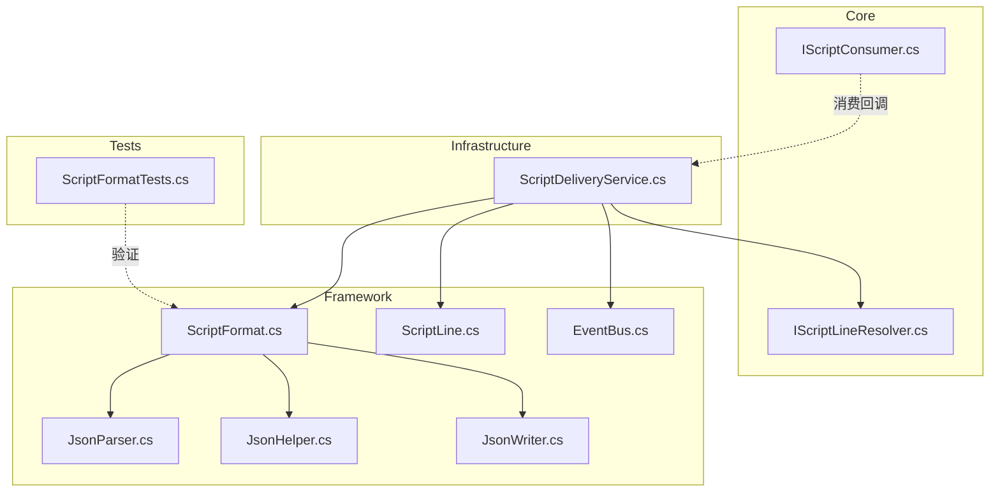
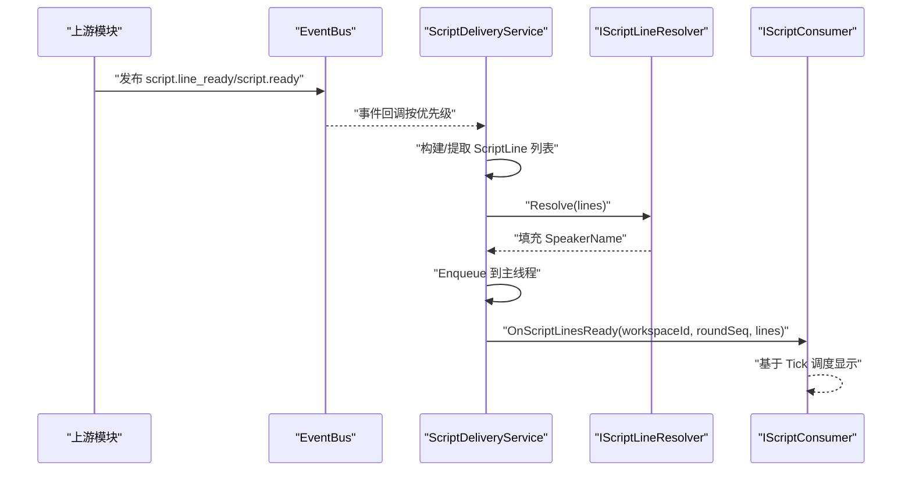
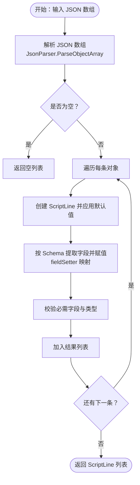
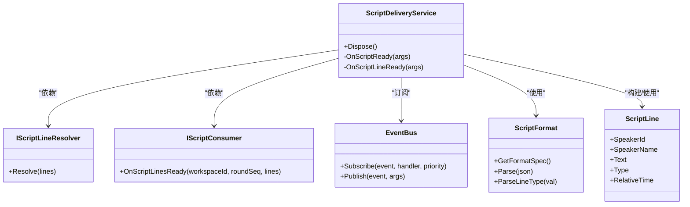

# 脚本消费器扩展

<cite>
**本文引用的文件**
- [IScriptConsumer.cs](file://src/NPCLife/Core/IScriptConsumer.cs)
- [IScriptLineResolver.cs](file://src/NPCLife/Core/IScriptLineResolver.cs)
- [ScriptFormat.cs](file://src/NPCLife/Framework/Script/ScriptFormat.cs)
- [ScriptLine.cs](file://src/NPCLife/Framework/Script/ScriptLine.cs)
- [ScriptDeliveryService.cs](file://src/NPCLife/Infrastructure/ScriptDeliveryService.cs)
- [JsonParser.cs](file://src/NPCLife/Framework/JsonParser.cs)
- [JsonHelper.cs](file://src/NPCLife/Framework/JsonHelper.cs)
- [JsonWriter.cs](file://src/NPCLife/Framework/JsonWriter.cs)
- [EventBus.cs](file://src/NPCLife/Framework/EventBus.cs)
- [ScriptFormatTests.cs](file://tests/NPCLife.Tests/Framework/ScriptFormatTests.cs)
</cite>

## 目录
1. [简介](#简介)
2. [项目结构](#项目结构)
3. [核心组件](#核心组件)
4. [架构总览](#架构总览)
5. [组件详解](#组件详解)
6. [依赖关系分析](#依赖关系分析)
7. [性能与内存考量](#性能与内存考量)
8. [故障排查与调试](#故障排查与调试)
9. [结论](#结论)
10. [附录](#附录)

## 简介
本指南面向希望扩展“脚本消费器”能力的开发者，围绕以下目标展开：
- 实现 IScriptConsumer 接口以接收并调度台词展示。
- 理解并扩展 IScriptLineResolver 的解析策略，实现自定义占位符解析。
- 基于 ScriptFormat 的 Schema 驱动机制扩展新的脚本格式。
- 掌握 ScriptLine 的处理逻辑与自定义行处理器的接入方式。
- 了解脚本消费器的配置管理与运行时调度策略。
- 分析扩展对系统性能与内存的影响。
- 提供调试与监控建议，以及安全与权限控制要点。

## 项目结构
围绕脚本消费器扩展的关键文件分布如下：
- Core 层：定义消费接口与解析接口（IScriptConsumer、IScriptLineResolver）。
- Framework 层：提供脚本格式定义与解析（ScriptFormat、ScriptLine）、事件总线（EventBus）、JSON 工具（JsonParser、JsonHelper、JsonWriter）。
- Infrastructure 层：实现脚本推送服务（ScriptDeliveryService），订阅 EventBus 事件并把解析后的 ScriptLine 推送给游戏侧消费者。
- Tests 层：验证 ScriptFormat 的解析行为与格式规范一致性。

图表来源
- [ScriptDeliveryService.cs:1-225](file://src/NPCLife/Infrastructure/ScriptDeliveryService.cs#L1-L225)
- [ScriptFormat.cs:1-281](file://src/NPCLife/Framework/Script/ScriptFormat.cs#L1-L281)
- [ScriptLine.cs:1-43](file://src/NPCLife/Framework/Script/ScriptLine.cs#L1-L43)
- [IScriptConsumer.cs:1-23](file://src/NPCLife/Core/IScriptConsumer.cs#L1-L23)
- [IScriptLineResolver.cs:1-20](file://src/NPCLife/Core/IScriptLineResolver.cs#L1-L20)
- [EventBus.cs:1-243](file://src/NPCLife/Framework/EventBus.cs#L1-L243)
- [JsonParser.cs:1-268](file://src/NPCLife/Framework/JsonParser.cs#L1-L268)
- [JsonHelper.cs:1-54](file://src/NPCLife/Framework/JsonHelper.cs#L1-L54)
- [JsonWriter.cs:1-136](file://src/NPCLife/Framework/JsonWriter.cs#L1-L136)
- [ScriptFormatTests.cs:1-281](file://tests/NPCLife.Tests/Framework/ScriptFormatTests.cs#L1-L281)

章节来源
- [ScriptDeliveryService.cs:1-225](file://src/NPCLife/Infrastructure/ScriptDeliveryService.cs#L1-L225)
- [ScriptFormat.cs:1-281](file://src/NPCLife/Framework/Script/ScriptFormat.cs#L1-L281)
- [ScriptLine.cs:1-43](file://src/NPCLife/Framework/Script/ScriptLine.cs#L1-L43)
- [IScriptConsumer.cs:1-23](file://src/NPCLife/Core/IScriptConsumer.cs#L1-L23)
- [IScriptLineResolver.cs:1-20](file://src/NPCLife/Core/IScriptLineResolver.cs#L1-L20)
- [EventBus.cs:1-243](file://src/NPCLife/Framework/EventBus.cs#L1-L243)
- [JsonParser.cs:1-268](file://src/NPCLife/Framework/JsonParser.cs#L1-L268)
- [JsonHelper.cs:1-54](file://src/NPCLife/Framework/JsonHelper.cs#L1-L54)
- [JsonWriter.cs:1-136](file://src/NPCLife/Framework/JsonWriter.cs#L1-L136)
- [ScriptFormatTests.cs:1-281](file://tests/NPCLife.Tests/Framework/ScriptFormatTests.cs#L1-L281)

## 核心组件
- IScriptConsumer：游戏侧消费回调接口，负责接收解析完成的 ScriptLine 列表，并基于 Tick 时间轴进行显示调度。
- IScriptLineResolver：占位符解析接口，将 ScriptLine 中的 SpeakerId 解析为显示名（SpeakerName），供推送前填充。
- ScriptFormat：脚本格式定义与解析器，采用 Schema 驱动设计，提供格式规范文本与 JSON 数组解析。
- ScriptLine：台词行数据契约，包含说话者标识、显示名、文本、类型与相对时间戳。
- ScriptDeliveryService：脚本推送服务，订阅 EventBus 的 script.line_ready 与 script.ready 事件，解析占位符后通过主线程调度投递给 IScriptConsumer。
- EventBus：事件总线，提供发布/订阅、优先级排序与错误隔离。
- JSON 工具：JsonParser、JsonHelper、JsonWriter 提供轻量 JSON 解析、转义与写入，支撑 ScriptFormat 的解析与序列化。

章节来源
- [IScriptConsumer.cs:10-21](file://src/NPCLife/Core/IScriptConsumer.cs#L10-L21)
- [IScriptLineResolver.cs:11-17](file://src/NPCLife/Core/IScriptLineResolver.cs#L11-L17)
- [ScriptFormat.cs:13-279](file://src/NPCLife/Framework/Script/ScriptFormat.cs#L13-L279)
- [ScriptLine.cs:25-41](file://src/NPCLife/Framework/Script/ScriptLine.cs#L25-L41)
- [ScriptDeliveryService.cs:19-223](file://src/NPCLife/Infrastructure/ScriptDeliveryService.cs#L19-L223)
- [EventBus.cs:17-242](file://src/NPCLife/Framework/EventBus.cs#L17-L242)
- [JsonParser.cs:13-267](file://src/NPCLife/Framework/JsonParser.cs#L13-L267)
- [JsonHelper.cs:8-53](file://src/NPCLife/Framework/JsonHelper.cs#L8-L53)
- [JsonWriter.cs:11-135](file://src/NPCLife/Framework/JsonWriter.cs#L11-L135)

## 架构总览
脚本消费器扩展遵循“事件驱动 + Schema 驱动”的架构：
- 事件驱动：上游模块通过 EventBus 发布 script.line_ready 与 script.ready 事件，ScriptDeliveryService 订阅并处理。
- 解析与填充：ScriptFormat 负责将 JSON 数组解析为 ScriptLine 列表；IScriptLineResolver 负责填充 SpeakerName。
- 主线程调度：ScriptDeliveryService 通过 MainThreadDispatcher 将 OnScriptLinesReady 回调投递到主线程，确保 UI 安全。
- 消费回调：游戏侧实现 IScriptConsumer，在 OnScriptLinesReady 中基于 Tick 时间轴调度显示。

图表来源
- [ScriptDeliveryService.cs:56-208](file://src/NPCLife/Infrastructure/ScriptDeliveryService.cs#L56-L208)
- [IScriptLineResolver.cs:11-17](file://src/NPCLife/Core/IScriptLineResolver.cs#L11-L17)
- [IScriptConsumer.cs:19-20](file://src/NPCLife/Core/IScriptConsumer.cs#L19-L20)
- [EventBus.cs:46-113](file://src/NPCLife/Framework/EventBus.cs#L46-L113)

## 组件详解

### IScriptConsumer 实现与消费流程
- 接口职责：接收一批已解析并填充 SpeakerName 的 ScriptLine，基于 Tick 时间轴进行显示调度。
- 调用时机：由 ScriptDeliveryService 在主线程中调用，保证 UI 线程安全。
- 关键参数：
  - workspaceId：来源工作空间 ID。
  - roundSeq：本轮在工作空间中的序号。
  - lines：只读列表，包含已解析的 ScriptLine。
- 实现建议：
  - 在 OnScriptLinesReady 中记录批次起始时间，将 RelativeTime 转换为帧/毫秒单位进行调度。
  - 支持批量渲染与逐条渲染两种模式，依据业务需求选择。
  - 对 Pause 类型行仅做延时处理，不进行文本渲染。

章节来源
- [IScriptConsumer.cs:10-21](file://src/NPCLife/Core/IScriptConsumer.cs#L10-L21)
- [ScriptDeliveryService.cs:90-100](file://src/NPCLife/Infrastructure/ScriptDeliveryService.cs#L90-L100)

### IScriptLineResolver 解析策略与自定义解析器
- 解析目标：将 ScriptLine.SpeakerId 解析为显示名（ScriptLine.SpeakerName）。
- 解析范围：遍历所有行，对 SpeakerId 非空的 Dialogue 行查找显示名。
- 扩展方式：
  - 实现 IScriptLineResolver 接口，提供 Resolve 方法。
  - 在 Resolve 中根据 SpeakerId 查找角色数据源（如 Pawn → Name/FullName），填充 SpeakerName。
  - 可结合 IWorkspaceManager 获取上下文信息，增强解析准确性。
- 注意事项：
  - 解析应在推送前完成，确保 OnScriptLinesReady 收到的是完整数据。
  - 对缺失或无法解析的 SpeakerId，可保留 null 或使用占位名。

章节来源
- [IScriptLineResolver.cs:11-17](file://src/NPCLife/Core/IScriptLineResolver.cs#L11-L17)
- [ScriptDeliveryService.cs:84-85](file://src/NPCLife/Infrastructure/ScriptDeliveryService.cs#L84-L85)

### ScriptFormat 扩展机制与新格式支持
- 设计理念：Schema 驱动，单一事实来源。通过修改 Schema 数组与 fieldSetter 字典即可更换输出格式。
- 关键结构：
  - ScriptFieldDef：定义字段的 JsonKey、中文标签、类型提示、是否必需、默认值与用法备注。
  - fieldSetter：JsonKey → ScriptLine 属性赋值映射。
- 扩展步骤：
  - 在 Schema 中新增/调整字段定义（JsonKey、Label、TypeHint、Required、DefaultValue、UsageNote）。
  - 在 fieldSetter 中添加或修改对应字段的赋值逻辑（如类型转换、默认值处理）。
  - 如需新增 ScriptLineType，请同步扩展枚举并在 ParseLineType 中处理映射。
  - 更新 GetFormatSpec 以反映新字段的提示词，确保与 Schema 一致。
- 容错与默认值：
  - 缺失字段按 Schema 的 DefaultValue 应用默认值。
  - 非法类型值默认回退为 Dialogue。
  - 非法数值默认为 0。
- 测试保障：
  - 使用 ScriptFormatTests 验证解析行为、默认值、容错与格式规范一致性。

图表来源
- [ScriptFormat.cs:189-239](file://src/NPCLife/Framework/Script/ScriptFormat.cs#L189-L239)
- [JsonParser.cs:97-125](file://src/NPCLife/Framework/JsonParser.cs#L97-L125)

章节来源
- [ScriptFormat.cs:13-279](file://src/NPCLife/Framework/Script/ScriptFormat.cs#L13-L279)
- [ScriptFormatTests.cs:17-279](file://tests/NPCLife.Tests/Framework/ScriptFormatTests.cs#L17-L279)

### ScriptLine 处理逻辑与自定义行处理器
- 数据契约：包含 SpeakerId、SpeakerName、Text、Type、RelativeTime。
- 处理流程：
  - ScriptFormat.Parse 生成 ScriptLine 列表，填充除 SpeakerName 外的字段。
  - IScriptLineResolver.Resolve 填充 SpeakerName。
  - ScriptDeliveryService 将解析后的列表通过主线程投递至 IScriptConsumer。
- 自定义行处理器：
  - 可在 Resolve 前后插入自定义处理器，如：
    - 文本清洗与标准化（去除多余空白、统一标点）。
    - 多语言替换与占位符二次解析。
    - 条件过滤（仅保留特定类型或来源的行）。
  - 处理器应保持幂等与线程安全，避免副作用。

章节来源
- [ScriptLine.cs:25-41](file://src/NPCLife/Framework/Script/ScriptLine.cs#L25-L41)
- [ScriptDeliveryService.cs:84-100](file://src/NPCLife/Infrastructure/ScriptDeliveryService.cs#L84-L100)

### 配置管理与运行时调度策略
- 事件订阅与优先级：
  - ScriptDeliveryService 订阅 EventBus 的 script.line_ready 与 script.ready，优先级为 50。
  - EventBus 支持优先级排序，数字越小越先执行。
- 主线程调度：
  - ScriptDeliveryService 使用 MainThreadDispatcher.Enqueue 将回调投递到主线程，保证 UI 安全。
- 工作空间与轮次：
  - script.ready 事件携带 workspaceId 与 roundSeq，推送时会定位到具体工作空间与轮次的 ScriptLines。
- 消费者注册：
  - 通过构造函数注入 IScriptConsumer 获取器，若未注册则记录警告并跳过推送。

章节来源
- [ScriptDeliveryService.cs:44-46](file://src/NPCLife/Infrastructure/ScriptDeliveryService.cs#L44-L46)
- [ScriptDeliveryService.cs:112-208](file://src/NPCLife/Infrastructure/ScriptDeliveryService.cs#L112-L208)
- [EventBus.cs:46-65](file://src/NPCLife/Framework/EventBus.cs#L46-L65)

## 依赖关系分析
- 耦合与内聚：
  - ScriptDeliveryService 依赖 EventBus、ScriptFormat、IScriptLineResolver、IScriptConsumer 与 MainThreadDispatcher。
  - ScriptFormat 依赖 JsonParser、JsonHelper、JsonWriter，形成清晰的数据流。
- 外部依赖：
  - EventBus 提供事件总线能力，无外部耦合。
  - JSON 工具为自研轻量实现，避免第三方依赖。
- 潜在循环依赖：
  - 当前结构未见循环依赖，接口分离良好。

图表来源
- [ScriptDeliveryService.cs:19-223](file://src/NPCLife/Infrastructure/ScriptDeliveryService.cs#L19-L223)
- [IScriptLineResolver.cs:11-17](file://src/NPCLife/Core/IScriptLineResolver.cs#L11-L17)
- [IScriptConsumer.cs:19-20](file://src/NPCLife/Core/IScriptConsumer.cs#L19-L20)
- [ScriptFormat.cs:117-279](file://src/NPCLife/Framework/Script/ScriptFormat.cs#L117-L279)
- [ScriptLine.cs:25-41](file://src/NPCLife/Framework/Script/ScriptLine.cs#L25-L41)
- [EventBus.cs:46-113](file://src/NPCLife/Framework/EventBus.cs#L46-L113)

## 性能与内存考量
- 解析路径优化：
  - ScriptFormat.Parse 采用 Schema 驱动与 fieldSetter 映射，避免硬编码分支，提升可维护性与解析效率。
  - JsonParser 为轻量实现，避免复杂库依赖，减少启动开销。
- 内存分配：
  - JsonParser.ParseObjectArray 与 ParseDict 逐元素解析，尽量减少中间对象数量。
  - JsonWriter 通过 StringBuilder 与容量预估降低分配次数。
- 线程与调度：
  - 解析与填充发生在推送前，主线程仅做回调投递，避免 UI 线程阻塞。
- 扩展成本：
  - 新增字段通过 Schema 与 fieldSetter 扩展，无需改动解析主干逻辑，降低维护成本。
  - 解析失败返回空列表，避免异常传播影响整体稳定性。

章节来源
- [ScriptFormat.cs:189-239](file://src/NPCLife/Framework/Script/ScriptFormat.cs#L189-L239)
- [JsonParser.cs:97-125](file://src/NPCLife/Framework/JsonParser.cs#L97-L125)
- [JsonWriter.cs:16-21](file://src/NPCLife/Framework/JsonWriter.cs#L16-L21)

## 故障排查与调试
- 常见问题与定位：
  - 未收到回调：检查 EventBus 是否正确发布 script.line_ready/script.ready，确认 ScriptDeliveryService 订阅成功且未被释放。
  - 占位符未解析：确认 IScriptLineResolver 实现已注册并 Resolve 被调用。
  - 消费者未注册：查看日志中“IScriptConsumer not registered.”警告。
  - 工作空间不存在：查看“Workspace not found.”或“Round seq not found.”警告。
  - JSON 解析失败：检查上游输出是否符合 ScriptFormat.Schema，参考 ScriptFormatTests 的容错用例。
- 调试建议：
  - 使用 EventBus.SubscriberCount 与 SubscribedEvents 检查订阅状态。
  - 在 ScriptDeliveryService 的回调中增加日志，记录关键参数与异常。
  - 在 IScriptConsumer 中记录 OnScriptLinesReady 的批次大小与时序，便于性能分析。
- 监控指标（建议）：
  - 事件发布/订阅延迟。
  - 解析耗时与失败率。
  - 占位符解析命中率。
  - 回调执行耗时与主线程排队长度。

章节来源
- [ScriptDeliveryService.cs:44-46](file://src/NPCLife/Infrastructure/ScriptDeliveryService.cs#L44-L46)
- [ScriptDeliveryService.cs:90-100](file://src/NPCLife/Infrastructure/ScriptDeliveryService.cs#L90-L100)
- [ScriptDeliveryService.cs:132-144](file://src/NPCLife/Infrastructure/ScriptDeliveryService.cs#L132-L144)
- [ScriptDeliveryService.cs:183-188](file://src/NPCLife/Infrastructure/ScriptDeliveryService.cs#L183-L188)
- [EventBus.cs:135-154](file://src/NPCLife/Framework/EventBus.cs#L135-L154)

## 结论
通过接口分离与事件驱动的设计，脚本消费器扩展具备良好的可扩展性与可维护性。基于 Schema 的格式扩展与轻量 JSON 工具链，既保证了灵活性，又兼顾了性能与稳定性。建议在实现自定义解析器与行处理器时，遵循幂等、线程安全与最小副作用原则，并结合日志与监控持续优化体验。

## 附录

### 开发清单
- 实现 IScriptConsumer 并在 OnScriptLinesReady 中完成基于 Tick 的调度。
- 实现 IScriptLineResolver 并在 Resolve 中填充 SpeakerName。
- 若需扩展格式，修改 ScriptFormat.Schema 与 fieldSetter，并更新 GetFormatSpec。
- 在 EventBus 中发布 script.line_ready/script.ready 事件，确保参数完整。
- 使用 ScriptFormatTests 验证新格式的解析与容错行为。

### 安全与权限控制建议
- 输入校验：对上游 JSON 输出进行严格校验，拒绝非法结构与类型。
- 权限隔离：解析与填充过程避免访问敏感资源，必要时引入白名单与沙箱。
- 日志脱敏：避免在日志中输出敏感字段（如密钥、完整 JSON），仅记录摘要信息。
- 异常隔离：EventBus 与 ScriptDeliveryService 已内置异常捕获，建议在自定义处理器中同样遵循错误隔离原则。