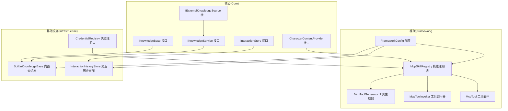
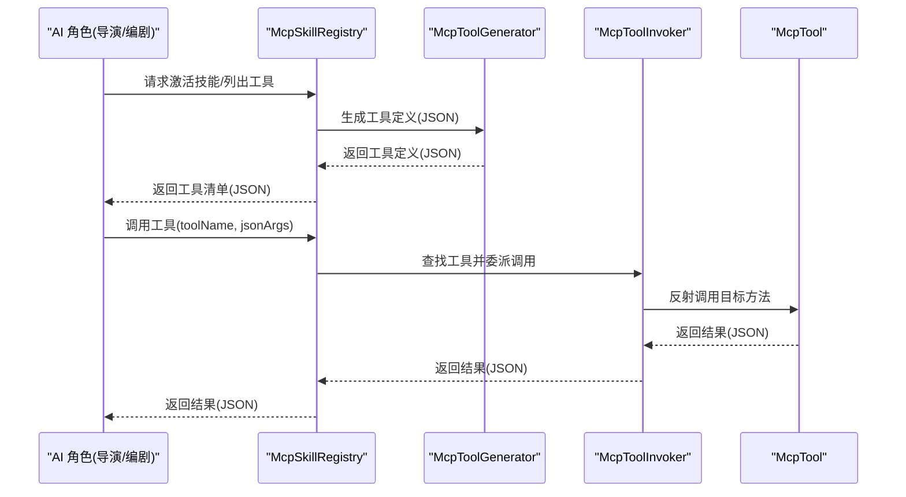
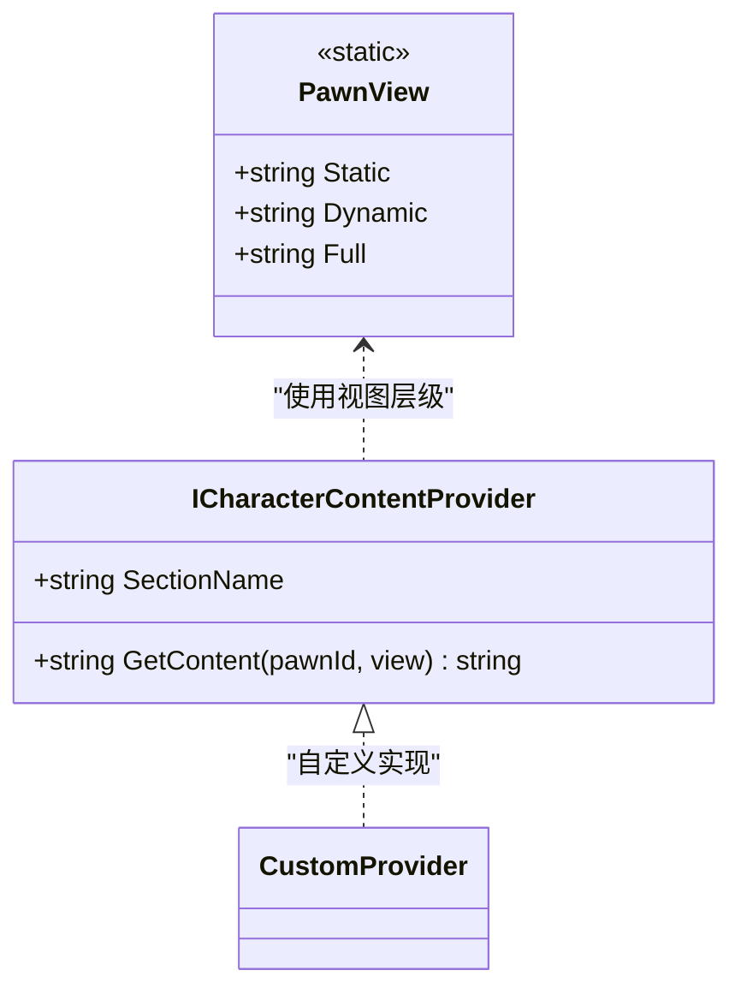
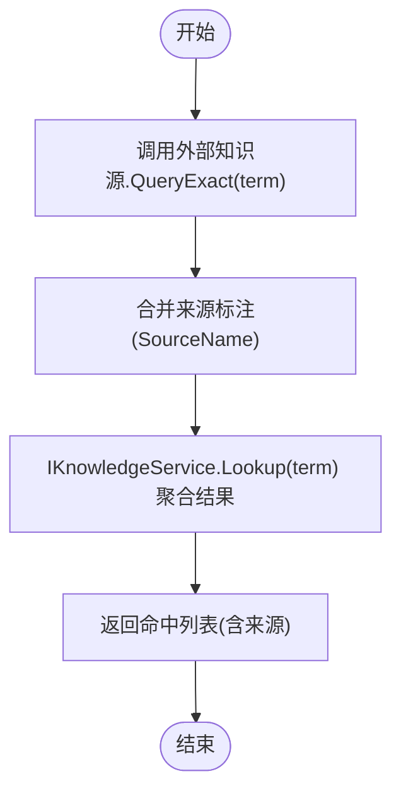
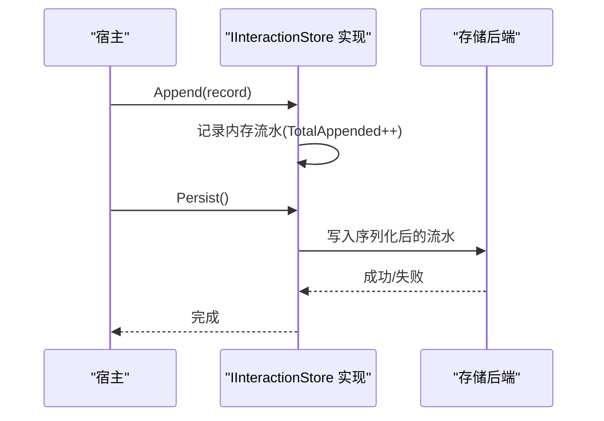
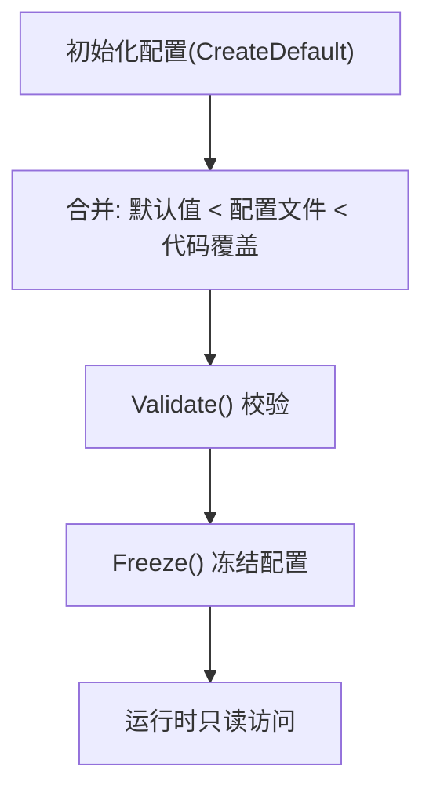
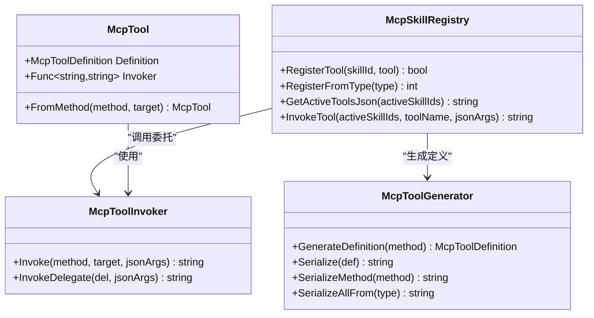
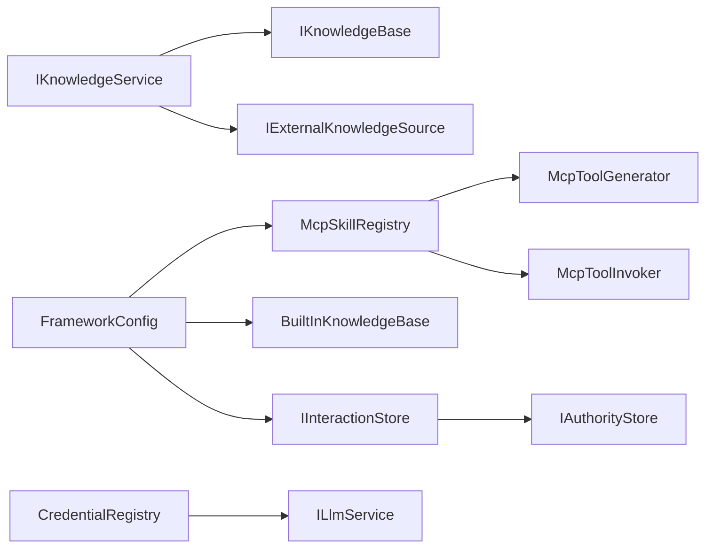

# 自定义集成模式

<cite>
**本文引用的文件**
- [README.md](file://README.md)
- [ICharacterContentProvider.cs](file://src/NPCLife/Core/ICharacterContentProvider.cs)
- [IExternalKnowledgeSource.cs](file://src/NPCLife/Core/IExternalKnowledgeSource.cs)
- [IInteractionStore.cs](file://src/NPCLife/Core/IInteractionStore.cs)
- [IKnowledgeBase.cs](file://src/NPCLife/Core/IKnowledgeBase.cs)
- [IKnowledgeService.cs](file://src/NPCLife/Core/IKnowledgeService.cs)
- [FrameworkConfig.cs](file://src/NPCLife/Framework/FrameworkConfig.cs)
- [InteractionHistoryStore.cs](file://src/NPCLife/Infrastructure/InteractionHistoryStore.cs)
- [BuiltInKnowledgeBase.cs](file://src/NPCLife/Infrastructure/Knowledge/BuiltInKnowledgeBase.cs)
- [CredentialRegistry.cs](file://src/NPCLife/Infrastructure/Llm/CredentialRegistry.cs)
- [McpTool.cs](file://src/NPCLife/Framework/Mcp/McpTool.cs)
- [McpToolGenerator.cs](file://src/NPCLife/Framework/Mcp/McpToolGenerator.cs)
- [McpToolInvoker.cs](file://src/NPCLife/Framework/Mcp/McpToolInvoker.cs)
- [McpSkillRegistry.cs](file://src/NPCLife/Framework/Mcp/McpSkillRegistry.cs)
- [McpToolGeneratorTests.cs](file://tests/NPCLife.Tests/Framework/McpToolGeneratorTests.cs)
</cite>

## 目录
1. [简介](#简介)
2. [项目结构](#项目结构)
3. [核心组件](#核心组件)
4. [架构总览](#架构总览)
5. [详细组件分析](#详细组件分析)
6. [依赖分析](#依赖分析)
7. [性能考量](#性能考量)
8. [故障排查指南](#故障排查指南)
9. [结论](#结论)
10. [附录](#附录)

## 简介
本指南面向希望在 NPCLife 框架中进行“自定义集成”的开发者，围绕以下主题提供系统化说明：
- 角色内容提供者的集成方法与内容适配策略
- 外部知识源的接入流程与数据同步机制
- 交互存储的自定义实现与数据持久化方案
- 框架配置的扩展点与自定义配置项添加方法
- 第三方系统的集成模式与适配器设计原则
- 集成扩展的兼容性考虑与版本管理策略
- 集成测试的方法与自动化验证流程
- 集成扩展的部署与运维注意事项

## 项目结构
NPCLife 采用清晰的分层与职责分离设计：
- Core 层：定义核心接口与领域模型（如角色内容提供者、外部知识源、交互存储、知识库、知识服务）
- Framework 层：提供运行时框架能力（配置、MCP 工具体系、事件总线、指标拦截器等）
- Infrastructure 层：提供默认实现（内置知识库、交互历史存储、凭证注册表等）
- Workspace 与 Driver：工作空间与驱动配置相关模块
- Tests：针对关键组件的单元测试，覆盖 MCP 工具生成与调用链路

图表来源
- [ICharacterContentProvider.cs:16-36](file://src/NPCLife/Core/ICharacterContentProvider.cs#L16-L36)
- [IExternalKnowledgeSource.cs:9-19](file://src/NPCLife/Core/IExternalKnowledgeSource.cs#L9-L19)
- [IInteractionStore.cs:11-51](file://src/NPCLife/Core/IInteractionStore.cs#L11-L51)
- [IKnowledgeBase.cs:9-51](file://src/NPCLife/Core/IKnowledgeBase.cs#L9-L51)
- [IKnowledgeService.cs:12-34](file://src/NPCLife/Core/IKnowledgeService.cs#L12-L34)
- [FrameworkConfig.cs:17-206](file://src/NPCLife/Framework/FrameworkConfig.cs#L17-L206)
- [McpSkillRegistry.cs:22-470](file://src/NPCLife/Framework/Mcp/McpSkillRegistry.cs#L22-L470)
- [McpToolGenerator.cs:12-214](file://src/NPCLife/Framework/Mcp/McpToolGenerator.cs#L12-L214)
- [McpToolInvoker.cs:14-238](file://src/NPCLife/Framework/Mcp/McpToolInvoker.cs#L14-L238)
- [McpTool.cs:14-39](file://src/NPCLife/Framework/Mcp/McpTool.cs#L14-L39)
- [BuiltInKnowledgeBase.cs:13-206](file://src/NPCLife/Infrastructure/Knowledge/BuiltInKnowledgeBase.cs#L13-L206)
- [InteractionHistoryStore.cs:16-185](file://src/NPCLife/Infrastructure/InteractionHistoryStore.cs#L16-L185)
- [CredentialRegistry.cs:20-327](file://src/NPCLife/Infrastructure/Llm/CredentialRegistry.cs#L20-L327)

章节来源
- [README.md:1-93](file://README.md#L1-L93)

## 核心组件
本节聚焦于与“自定义集成”直接相关的核心接口与默认实现，帮助你快速理解扩展点与适配策略。

- 角色内容提供者 ICharacterContentProvider
  - 作用：为角色人物卡的不同维度（健康、心情、技能等）提供自然语言描述
  - 视图层级：static（客观属性）、dynamic（+视角/记忆快照）、full（+记忆流水）
  - 输出：按 SectionName 组装为结构化 JSON
  - 适配策略：实现多个 Provider，分别负责不同维度；根据 view 参数动态决定详细程度

- 外部知识源 IExternalKnowledgeSource
  - 作用：只读外部知识源抽象（GameDef、Wiki、RAG 等）
  - 查询：精确词条查询，返回 KnowledgeEntry 列表
  - 来源标注：KnowledgeEntry.Source 与 SourceName 一致

- 交互存储 IInteractionStore
  - 作用：交互历史 append-only 流水，天然膨胀不裁剪
  - 操作：追加、按角色对查询、按角色查询、计数、持久化
  - 默认实现：InteractionHistoryStore，基于 IAuthorityStore 持久化

- 知识库 IKnowledgeBase 与知识服务 IKnowledgeService
  - IKnowledgeBase：词条的增删查改（内置唯一可写实现 BuiltInKnowledgeBase）
  - IKnowledgeService：统一知识消费接口，默认实现聚合内置知识库与外部知识源
  - 适配策略：第三方可自行实现 IKnowledgeService，按需组织知识库架构

- 框架配置 FrameworkConfig
  - 作用：统一管理驱动参数、诊断开关、功能开关
  - 冻结机制：初始化完成后冻结，禁止运行时修改
  - 序列化/反序列化：支持 JSON 导入导出与校验

章节来源
- [ICharacterContentProvider.cs:6-36](file://src/NPCLife/Core/ICharacterContentProvider.cs#L6-L36)
- [IExternalKnowledgeSource.cs:9-19](file://src/NPCLife/Core/IExternalKnowledgeSource.cs#L9-L19)
- [IInteractionStore.cs:11-51](file://src/NPCLife/Core/IInteractionStore.cs#L11-L51)
- [IKnowledgeBase.cs:9-51](file://src/NPCLife/Core/IKnowledgeBase.cs#L9-L51)
- [IKnowledgeService.cs:12-34](file://src/NPCLife/Core/IKnowledgeService.cs#L12-L34)
- [FrameworkConfig.cs:17-206](file://src/NPCLife/Framework/FrameworkConfig.cs#L17-L206)

## 架构总览
下图展示了 MCP 工具链在框架中的位置与调用关系，以及与技能注册表、工具生成器、调用器的协作方式。

图表来源
- [McpSkillRegistry.cs:22-470](file://src/NPCLife/Framework/Mcp/McpSkillRegistry.cs#L22-L470)
- [McpToolGenerator.cs:12-214](file://src/NPCLife/Framework/Mcp/McpToolGenerator.cs#L12-L214)
- [McpToolInvoker.cs:14-238](file://src/NPCLife/Framework/Mcp/McpToolInvoker.cs#L14-L238)
- [McpTool.cs:14-39](file://src/NPCLife/Framework/Mcp/McpTool.cs#L14-L39)

## 详细组件分析

### 角色内容提供者集成
- 设计要点
  - 通过 SectionName 将不同维度的内容组织为结构化 JSON
  - 依据 view 参数（static/dynamic/full）控制返回内容的详细程度
  - 支持返回空值表示该层级不需要此 section
- 自定义步骤
  - 实现 ICharacterContentProvider 接口，定义唯一的 SectionName
  - 在 GetContent 中根据 pawnId 与 view 生成自然语言描述
  - 将多个 Provider 注册到框架，由上层统一组装

图表来源
- [ICharacterContentProvider.cs:6-36](file://src/NPCLife/Core/ICharacterContentProvider.cs#L6-L36)

章节来源
- [ICharacterContentProvider.cs:6-36](file://src/NPCLife/Core/ICharacterContentProvider.cs#L6-L36)

### 外部知识源接入与同步
- 设计要点
  - IExternalKnowledgeSource 仅提供精确查询，返回 KnowledgeEntry 列表
  - SourceName 用于标注查询结果出处
  - IKnowledgeService 聚合内置知识库与外部知识源，统一对外提供 Lookup/Store/Delete/List 等能力
- 自定义步骤
  - 实现 IExternalKnowledgeSource，提供 QueryExact(term)
  - 在 IKnowledgeService 默认实现中组合外部源与内置知识库
  - 通过 IKnowledgeBase.Store/Delete/ListByTags/ListByPrefix 管理词条

图表来源
- [IExternalKnowledgeSource.cs:9-19](file://src/NPCLife/Core/IExternalKnowledgeSource.cs#L9-L19)
- [IKnowledgeService.cs:12-34](file://src/NPCLife/Core/IKnowledgeService.cs#L12-L34)
- [IKnowledgeBase.cs:9-51](file://src/NPCLife/Core/IKnowledgeBase.cs#L9-L51)

章节来源
- [IExternalKnowledgeSource.cs:9-19](file://src/NPCLife/Core/IExternalKnowledgeSource.cs#L9-L19)
- [IKnowledgeService.cs:12-34](file://src/NPCLife/Core/IKnowledgeService.cs#L12-L34)
- [IKnowledgeBase.cs:9-51](file://src/NPCLife/Core/IKnowledgeBase.cs#L9-L51)

### 交互存储的自定义实现与持久化
- 设计要点
  - IInteractionStore 定义 append-only 流水、查询、计数与持久化接口
  - 默认实现 InteractionHistoryStore 基于 IAuthorityStore 持久化
  - 支持按角色对/角色查询、时间过滤、限制返回条数
- 自定义步骤
  - 实现 IInteractionStore 接口，定义 Append/Query/QueryByPawn/Count/Persist
  - 在 Persist 中选择合适的存储后端（文件、数据库、云存储）
  - 在合适的时机（如存档）调用 Persist，确保数据落盘

图表来源
- [IInteractionStore.cs:11-51](file://src/NPCLife/Core/IInteractionStore.cs#L11-L51)
- [InteractionHistoryStore.cs:16-185](file://src/NPCLife/Infrastructure/InteractionHistoryStore.cs#L16-L185)

章节来源
- [IInteractionStore.cs:11-51](file://src/NPCLife/Core/IInteractionStore.cs#L11-L51)
- [InteractionHistoryStore.cs:16-185](file://src/NPCLife/Infrastructure/InteractionHistoryStore.cs#L16-L185)

### 框架配置扩展点与自定义配置项
- 设计要点
  - FrameworkConfig 为纯数据类，包含 Driver/Diagnostics/Features 三个子配置区
  - 支持 FromJson/ToJson 序列化与 Validate 校验
  - Freeze() 冻结后禁止修改，保证运行时配置不可变
- 自定义步骤
  - 在现有子配置区中添加字段（如新增功能开关或驱动参数）
  - 在 ToJson/FromJson 中处理新字段的序列化/反序列化
  - 在 Validate 中添加合法性检查
  - 在 Initialize 完成后调用 Freeze()

图表来源
- [FrameworkConfig.cs:17-206](file://src/NPCLife/Framework/FrameworkConfig.cs#L17-L206)

章节来源
- [FrameworkConfig.cs:17-206](file://src/NPCLife/Framework/FrameworkConfig.cs#L17-L206)

### 第三方系统集成模式与适配器设计原则
- 设计原则
  - 通过接口解耦：第三方系统通过实现框架接口（如 IExternalKnowledgeSource、IInteractionStore、ICredentialRegistry 等）接入
  - 适配器最小侵入：仅暴露必要方法，避免对第三方系统内部结构产生依赖
  - 明确边界：输入输出遵循框架约定的数据结构（如 KnowledgeEntry、InteractionRecord、Json 字符串）
- 典型适配器
  - 知识源适配器：实现 IExternalKnowledgeSource，将第三方知识库映射为 KnowledgeEntry
  - 存储适配器：实现 IInteractionStore/IKnowledgeBase，对接第三方存储（文件、数据库、云）
  - 凭证适配器：实现 ICredentialRegistry，管理第三方 LLM 凭证与模型发现

章节来源
- [IExternalKnowledgeSource.cs:9-19](file://src/NPCLife/Core/IExternalKnowledgeSource.cs#L9-L19)
- [IInteractionStore.cs:11-51](file://src/NPCLife/Core/IInteractionStore.cs#L11-L51)
- [CredentialRegistry.cs:20-327](file://src/NPCLife/Infrastructure/Llm/CredentialRegistry.cs#L20-L327)

### MCP 工具体系与自定义工具集成
- 设计要点
  - McpTool 作为统一载体，承载工具定义与调用委托
  - McpToolGenerator 通过反射与特性生成工具定义（支持 [McpTool]/[McpParam]）
  - McpToolInvoker 负责 JSON 参数解析、类型转换与方法调用
  - McpSkillRegistry 管理技能与工具映射，提供激活/查询/调用能力
- 自定义步骤
  - 在工具类中标注 [McpTool] 与 [McpParam]，定义工具签名与参数
  - 使用 McpTool.FromMethod 或手工构造 McpTool
  - 通过 McpSkillRegistry.RegisterTool 或 RegisterFromType 注册到技能
  - 通过 GetActiveToolsJson 生成工具定义，供 LLM 使用

图表来源
- [McpTool.cs:14-39](file://src/NPCLife/Framework/Mcp/McpTool.cs#L14-L39)
- [McpToolGenerator.cs:12-214](file://src/NPCLife/Framework/Mcp/McpToolGenerator.cs#L12-L214)
- [McpToolInvoker.cs:14-238](file://src/NPCLife/Framework/Mcp/McpToolInvoker.cs#L14-L238)
- [McpSkillRegistry.cs:22-470](file://src/NPCLife/Framework/Mcp/McpSkillRegistry.cs#L22-L470)

章节来源
- [McpTool.cs:14-39](file://src/NPCLife/Framework/Mcp/McpTool.cs#L14-L39)
- [McpToolGenerator.cs:12-214](file://src/NPCLife/Framework/Mcp/McpToolGenerator.cs#L12-L214)
- [McpToolInvoker.cs:14-238](file://src/NPCLife/Framework/Mcp/McpToolInvoker.cs#L14-L238)
- [McpSkillRegistry.cs:22-470](file://src/NPCLife/Framework/Mcp/McpSkillRegistry.cs#L22-L470)

### 兼容性考虑与版本管理策略
- 兼容性
  - 接口契约稳定：核心接口（如 IExternalKnowledgeSource、IInteractionStore、IKnowledgeService）保持向后兼容
  - 工具签名与参数：通过特性与类型映射保证工具定义与调用的稳定性
  - 配置冻结：FrameworkConfig 冻结后禁止修改，避免运行时配置漂移
- 版本管理
  - 新增配置项：在 FrameworkConfig 中预留字段，保持默认值与兼容解析
  - 工具扩展：通过 McpSkillRegistry 注册新工具，不影响既有工具
  - 知识库扩展：通过 IKnowledgeService 聚合新知识源，不改变现有存储格式

章节来源
- [FrameworkConfig.cs:17-206](file://src/NPCLife/Framework/FrameworkConfig.cs#L17-L206)
- [McpSkillRegistry.cs:22-470](file://src/NPCLife/Framework/Mcp/McpSkillRegistry.cs#L22-L470)
- [IKnowledgeService.cs:12-34](file://src/NPCLife/Core/IKnowledgeService.cs#L12-L34)

### 集成测试方法与自动化验证
- 测试覆盖
  - MCP 工具链：覆盖类型映射、工具定义生成、参数转换、调用结果序列化
  - 关键断言：工具定义 JSON 结构、必填参数识别、调用结果正确性
- 自动化建议
  - 单元测试：针对 McpToolGeneratorTests 的测试思路，编写工具方法与调用器的单元测试
  - 集成测试：模拟 MCP 工具注册、激活、调用全流程，验证返回值与错误处理
  - 回归测试：随着配置项与工具扩展增加，持续回归核心链路

章节来源
- [McpToolGeneratorTests.cs:9-195](file://tests/NPCLife.Tests/Framework/McpToolGeneratorTests.cs#L9-L195)

## 依赖分析
- 组件耦合
  - IKnowledgeService 依赖 IKnowledgeBase 与 IExternalKnowledgeSource
  - McpSkillRegistry 依赖 McpToolGenerator 与 McpToolInvoker
  - InteractionHistoryStore 依赖 IAuthorityStore
  - CredentialRegistry 依赖 ILlmService 与 IStorage（持久化）
- 外部依赖
  - 框架本身不依赖具体第三方系统，通过接口解耦
  - 日志、存储、LLM 服务由宿主提供适配器

图表来源
- [IKnowledgeService.cs:12-34](file://src/NPCLife/Core/IKnowledgeService.cs#L12-L34)
- [IKnowledgeBase.cs:9-51](file://src/NPCLife/Core/IKnowledgeBase.cs#L9-L51)
- [IExternalKnowledgeSource.cs:9-19](file://src/NPCLife/Core/IExternalKnowledgeSource.cs#L9-L19)
- [McpSkillRegistry.cs:22-470](file://src/NPCLife/Framework/Mcp/McpSkillRegistry.cs#L22-L470)
- [McpToolGenerator.cs:12-214](file://src/NPCLife/Framework/Mcp/McpToolGenerator.cs#L12-L214)
- [McpToolInvoker.cs:14-238](file://src/NPCLife/Framework/Mcp/McpToolInvoker.cs#L14-L238)
- [InteractionHistoryStore.cs:16-185](file://src/NPCLife/Infrastructure/InteractionHistoryStore.cs#L16-L185)
- [CredentialRegistry.cs:20-327](file://src/NPCLife/Infrastructure/Llm/CredentialRegistry.cs#L20-L327)
- [FrameworkConfig.cs:17-206](file://src/NPCLife/Framework/FrameworkConfig.cs#L17-L206)

章节来源
- [IKnowledgeService.cs:12-34](file://src/NPCLife/Core/IKnowledgeService.cs#L12-L34)
- [IKnowledgeBase.cs:9-51](file://src/NPCLife/Core/IKnowledgeBase.cs#L9-L51)
- [IExternalKnowledgeSource.cs:9-19](file://src/NPCLife/Core/IExternalKnowledgeSource.cs#L9-L19)
- [McpSkillRegistry.cs:22-470](file://src/NPCLife/Framework/Mcp/McpSkillRegistry.cs#L22-L470)
- [McpToolGenerator.cs:12-214](file://src/NPCLife/Framework/Mcp/McpToolGenerator.cs#L12-L214)
- [McpToolInvoker.cs:14-238](file://src/NPCLife/Framework/Mcp/McpToolInvoker.cs#L14-L238)
- [InteractionHistoryStore.cs:16-185](file://src/NPCLife/Infrastructure/InteractionHistoryStore.cs#L16-L185)
- [CredentialRegistry.cs:20-327](file://src/NPCLife/Infrastructure/Llm/CredentialRegistry.cs#L20-L327)
- [FrameworkConfig.cs:17-206](file://src/NPCLife/Framework/FrameworkConfig.cs#L17-L206)

## 性能考量
- 工具调用性能
  - 反射调用与参数转换：尽量减少复杂类型转换，合理使用特性标注必填参数
  - 工具定义生成：批量生成工具定义时注意字符串拼接与 JSON 序列化开销
- 存储与查询
  - 交互历史：append-only 流水，查询时注意时间过滤与限制返回条数
  - 知识库：字典查找 O(1)，前缀与标签筛选需注意数据规模
- 配置与冻结
  - 配置冻结后避免运行时修改带来的额外判断开销

## 故障排查指南
- MCP 工具调用异常
  - 检查工具定义生成是否正确（名称、描述、参数 schema）
  - 核对参数类型转换与默认值设置
  - 关注异常包装与错误返回 JSON
- 存储持久化失败
  - 检查 IAuthorityStore 实现与权限
  - 关注序列化/反序列化过程中的异常日志
- 凭证与模型发现
  - 确认别名与激活顺序，检查模型发现回调与取消令牌
- 配置校验失败
  - 使用 Validate() 输出错误列表，修正非法配置项

章节来源
- [McpToolInvoker.cs:14-238](file://src/NPCLife/Framework/Mcp/McpToolInvoker.cs#L14-L238)
- [InteractionHistoryStore.cs:97-141](file://src/NPCLife/Infrastructure/InteractionHistoryStore.cs#L97-L141)
- [CredentialRegistry.cs:159-227](file://src/NPCLife/Infrastructure/Llm/CredentialRegistry.cs#L159-L227)
- [FrameworkConfig.cs:56-75](file://src/NPCLife/Framework/FrameworkConfig.cs#L56-L75)

## 结论
通过接口解耦与工具链完备的 MCP 体系，NPCLife 为第三方系统的集成提供了清晰的扩展路径。开发者只需实现相应接口并遵循数据结构约定，即可无缝接入角色内容、外部知识源、交互历史与 LLM 凭证管理等能力。配合完善的配置、测试与持久化机制，可在保证兼容性的前提下实现灵活的定制与演进。

## 附录
- 集成清单
  - 角色内容提供者：实现 ICharacterContentProvider，按维度提供描述
  - 外部知识源：实现 IExternalKnowledgeSource，提供精确查询
  - 交互存储：实现 IInteractionStore，定义持久化策略
  - 知识服务：实现 IKnowledgeService，聚合内置与外部知识源
  - MCP 工具：使用特性标注工具方法，注册到技能并激活
  - 配置扩展：在 FrameworkConfig 中添加字段并处理序列化/校验/冻结